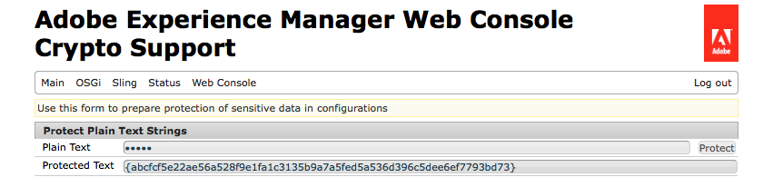

# Krypteringsstöd för konfigurationsegenskaper{#encryption-support-for-configuration-properties}

## Översikt {#overview}

Med den här funktionen kan alla OSGi-konfigurationsegenskaper lagras i en skyddad krypterad form i stället för i klartext. Formuläret i webbkonsolens användargränssnitt används för att skapa krypterad text från klartext med hjälp av den systemomfattande krypteringsnyckeln.

Stöd för OSGi Configuration Plugin har lagts till för att dekryptera egenskapen innan den används av en tjänst.

>[!NOTE]
>
>Tjänster som förväntar sig ett krypterat värde måste använda kontrollen IsProtected för att se om värdet är krypterat innan det försöker dekryptera det, eftersom det redan kan ha dekrypterats.

## Aktivera krypteringsstöd {#enabling-encryption-support}

De här stegen visar hur du krypterar SMTP-lösenordet för e-posttjänsten. Du kan slutföra de här stegen för en OSGI-egenskap som du vill kryptera.

1. Gå till AEM Web Console på *https://&lt;serveradress>:&lt;serverport>/system/console/configMgr*
1. I det övre vänstra hörnet går du till **Main - Crypto Support**

   

1. Sidan **Adobe Experience Manager Web Console Crypto Support** visas.

   

1. I fältet **Oformaterad text** anger du texten i känsliga data som du vill skydda.
1. Välj **Skydda**. Den skyddade texten visas som krypterad text.

   

1. Kopiera den skyddade texten från steg 5 och klistra in den i OSGI-formulärvärdet. I det här exemplet läggs det krypterade **SMTP-lösenordet** till i *Day CQ Mail Service*.

   

1. Spara egenskaperna för daglig CQ Mail Service. SMTP-lösenordet skickas nu som ett krypterat värde.

## Stöd för dekryptering {#decryption-support}

AEM tillhandahåller nu ett konfigurations-plugin-program som dekrypterar konfigurationsegenskaper. Denna AEM-plugin dekrypterar och hämtar automatiskt egenskaperna för klartext.
