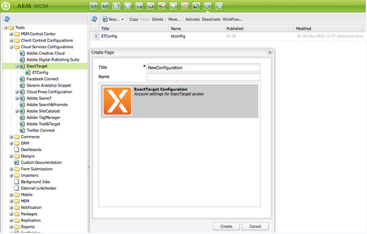

# Integrera med ExactTarget{#integrating-with-exacttarget}

Genom att integrera Adobe Experience Manager (AEM) med Exact Target kan du hantera och skicka e-post som skapats AEM med Exact Target. Du kan också använda leadhanteringsfunktionerna i Exact Target genom AEM formulär på AEM sidor.

Integreringen ger dig följande funktioner:

* Möjlighet att skapa e-postmeddelanden i AEM och publicera dem på Exact Target för distribution.
* Möjlighet att ange åtgärd för ett AEM formulär för att skapa en exakt målabonnent.

När ExactTarget har konfigurerats kan du publicera nyhetsbrev och e-postmeddelanden till ExactTarget. Se [Publicera nyhetsbrev till en e-posttjänst](/help/sites-authoring/personalization.md).

## Skapa en ExactTarget-konfiguration {#creating-an-exacttarget-configuration}

ExactTarget-konfigurationer kan läggas till med hjälp av molntjänster eller verktyg. Båda metoderna beskrivs i det här avsnittet.

### Konfigurera ExactTarget med hjälp av molntjänster {#configuring-exacttarget-via-cloudservices}

Så här skapar du en ExactTarget-konfiguration i Cloud Service:

1. Klicka på **Cloud Service** på välkomstsidan. (Eller direkt åtkomst på `https://<hostname>:<port>/etc/cloudservices.html`.)
1. Klicka på **ExactTarget** och sedan på **Konfigurera**. Konfigurationsfönstret ExactTarget öppnas.

   

1. Ange en titel och eventuellt ett namn och klicka på **Skapa**. Konfigurationsfönstret **ExactTarget-inställningar** öppnas.

   

1. Ange användarnamn, lösenord och välj en API-slutpunkt (till exempel **https://webservice.exacttarget.com/Service.asmx**).
1. Klicka på **Anslut till ExactTarget.** När du har anslutit visas en dialogruta om att anslutningen lyckades. Klicka på **OK** för att stänga fönstret.

   

1. Välj ett konto, om det är tillgängligt. Kontot är till för Enterprise 2.0-kunder. Klicka på **OK**.

   ExactTarget har konfigurerats. Du kan redigera konfigurationen genom att klicka på **Redigera**. Du kan gå till ExactTarget genom att klicka på **Gå till ExactTarget**.

1. AEM har nu en datatilläggsfunktion. Du kan importera ExactTarget-datatilläggskolumner. Den kan konfigureras genom att klicka på plustecknet (+) som visas förutom den EXactTarget-konfiguration som skapades. Alla befintliga datatillägg kan väljas i listrutan. Mer information om hur du konfigurerar datatillägg finns i [ExactTarget-dokumentationen](https://help.salesforce.com/s/articleView?id=sf.mc_es_data_extension_data_relationships_classic.htm&amp;type=5).

   Importerade datatilläggskolumner kan senare användas via komponenten **Text och Personalization**.

   

### Konfigurera ExactTarget med hjälp av verktyg {#configuring-exacttarget-via-tools}

Så här skapar du en ExactTarget-konfiguration i verktygen:

1. Klicka på **Verktyg** på välkomstsidan. Eller navigera dit direkt genom att gå till `https://<hostname>:<port>/misadmin#/etc`.
1. Välj **Verktyg**, sedan **Konfigurationer för Cloud Service** och sedan **ExactTarget**.
1. Klicka på **Nytt** för att öppna fönstret **Skapa sida **.

   

1. Ange **Titel** och eventuellt **Namn** och klicka på **Skapa**.
1. Ange konfigurationsinformationen enligt steg 4 i föregående procedur. Följ den proceduren för att slutföra konfigurationen av ExactTarget.

### Lägga till flera konfigurationer {#adding-multiple-configurations}

Så här lägger du till flera konfigurationer:

1. På välkomstsidan klickar du på **Cloud Service** och sedan på **ExactTarget**. Klicka på **Visa konfigurationer** som visas om en eller flera ExactTarget-konfigurationer är tillgängliga. Alla tillgängliga konfigurationer visas.
1. Klicka på **+** bredvid Tillgängliga konfigurationer. Då öppnas fönstret **Skapa konfigurationer**. Följ den tidigare konfigurationsproceduren för att skapa en konfiguration.
