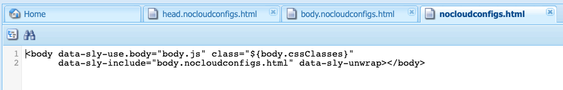

# Exportera Experience Fragments till Adobe Target{#exporting-experience-fragments-to-adobe-target}

>[!CAUTION]
>
>Vissa funktioner på den här sidan kräver att AEM 6.5.3.0 (eller senare) används.
>
>6.5.3.0:
>
>* **Externalizer-domäner** kan nu markeras.
>  **Obs!** Externalizer-domäner är bara relevanta för innehållet i Experience Fragment som skickas till Target, och inte för metadata som Visa erbjudandeinnehåll.
>
>6.5.2.0:
>
>* Upplevelsefragment kan exporteras till:
>
>   * standardarbetsytan.
>   * en namngiven arbetsyta som anges i molnkonfigurationen.
>   * **Obs!** För export till särskilda arbetsytor krävs Adobe Target Premium.
>
>* AEM måste vara [integrerat med Adobe Target med IMS](/help/sites-administering/integration-target-ims.md).
>
>AEM 6.5.0.0 och 6.5.1.0:
>
>* AEM Experience Fragments exporteras till standardarbetsytan i Adobe Target.
>* AEM måste integreras med Adobe Target enligt instruktionerna i [Integrera med Adobe Target](/help/sites-administering/target.md).

Du kan exportera [Upplevelsefragment](/help/sites-authoring/experience-fragments.md), som har skapats i Adobe Experience Manager (AEM), till Adobe Target (Target). De kan sedan användas som erbjudanden i Target-aktiviteter för att testa och personalisera upplevelser i stor skala.

Det finns tre formatalternativ för att exportera ett Experience Fragment till Adobe Target:

* HTML (standard): Stöd för leverans av webb- och hybridinnehåll
* JSON: Stöd för leverans av headless-material
* HTML &amp; JSON

AEM Experience Fragments kan exporteras till standardarbetsytan i Adobe Target eller till användardefinierade arbetsytor för Adobe Target. Detta görs med Adobe Developer Console, som AEM [integrerat med Adobe Target med IMS](/help/sites-administering/integration-target-ims.md).

>[!NOTE]
>
>Adobe Target arbetsytor finns inte i själva Adobe Target. De definieras och hanteras i Adobe IMS (Identity Management System) och väljs sedan ut för användning i olika lösningar med hjälp av integreringar från Adobe Developer Console.

>[!NOTE]
>
>Adobe Target arbetsytor kan endast användas för att tillåta medlemmar i en organisation (grupp) att skapa och hantera erbjudanden och aktiviteter för denna organisation. utan att ge åtkomst till andra användare. Till exempel landsspecifika organisationer inom ett globalt område.

>[!NOTE]
>
>Mer information finns även i:
>
>* [Utveckling av Adobe Target](https://developers.adobetarget.com/)
>* [Kärnkomponenter - Upplevelsefragment](https://experienceleague.adobe.com/docs/experience-manager-core-components/using/wcm-components/experience-fragment.html)
>

## Förutsättningar {#prerequisites}

>[!CAUTION]
>
>Vissa funktioner på den här sidan kräver att AEM 6.5.3.0 används.

Du måste utföra olika åtgärder:

1. Du måste [integrera AEM med Adobe Target med IMS](/help/sites-administering/integration-target-ims.md).
2. Upplevelsefragment exporteras från AEM författarinstans, så du måste [Konfigurera AEM Link Externalizer](/help/sites-administering/target-requirements.md#configuring-the-aem-link-externalizer) på författarinstansen för att säkerställa att alla referenser i Experience Fragment är externaliserade för webbleverans.

   >[!NOTE]
   >
   >För ländrörning som inte omfattas av standardinställningen används [Experience Fragment Link Rewriter-provider](/help/sites-developing/experience-fragments.md#the-experience-fragment-link-rewriter-provider-html) är tillgängligt. Med detta kan ni utveckla anpassade regler för er instans.

## Lägg till molnkonfigurationen {#add-the-cloud-configuration}

Innan du exporterar ett fragment måste du lägga till **Molnkonfiguration** for **Adobe Target** till fragmentet eller mappen. Detta gör även att du kan:

* ange de formatalternativ som ska användas för exporten
* välj en målarbetsyta som mål
* välj en Externalizer-domän för att skriva om referenser i Experience Fragment (valfritt)

De obligatoriska alternativen kan väljas i **Sidegenskaper** av den mapp och/eller det fragment som krävs, specifikationen ärvs vid behov.

1. Navigera till **Upplevelsefragment** konsol.

1. Öppna **Sidegenskaper** för rätt mapp eller fragment.

   >[!NOTE]
   >
   >Om du lägger till molnkonfigurationen i den överordnade Experience Fragment-mappen ärvs konfigurationen av alla underordnade.
   >
   >
   >Om du lägger till molnkonfigurationen i själva Experience Fragment ärvs konfigurationen av alla variationer.

1. Välj **Cloud Services** -fliken.

1. Under **Konfiguration av Cloud Service**, markera **Adobe Target** i listrutan.

   >[!NOTE]
   >
   >JSON-formatet i ett Experience Fragment-erbjudande kan anpassas. För att göra detta definierar du en Customer Experience Fragment-komponent och kommenterar sedan hur dess egenskaper ska exporteras i komponentens Sling Model.
   >
   >Se kärnkomponenten:
   >
   >[Kärnkomponenter - Upplevelsefragment](https://experienceleague.adobe.com/docs/experience-manager-core-components/using/wcm-components/experience-fragment.html)

   Under **Adobe Target** välj:

   * lämplig konfiguration
   * det obligatoriska formatalternativet
   * en Adobe Target-arbetsyta
   * vid behov - Externalizer-domänen

   >[!CAUTION]
   >
   >Externalizer-domänen är valfri.
   >
   >En AEM Externalizer konfigureras när du vill att det exporterade innehållet ska peka på en viss *publicera* domän. Mer information finns i [Konfigurera AEM Link Externalizer](/help/sites-administering/target-requirements.md#configuring-the-aem-link-externalizer).
   >
   >Observera också att Externalizer-domäner bara är relevanta för innehållet i Experience Fragment som skickas till Target, och inte för metadata som Visa erbjudandeinnehåll.

   För en mapp:

   

1. **Spara och stäng**.

## Exportera ett Experience Fragment till Adobe Target {#exporting-an-experience-fragment-to-adobe-target}

>[!CAUTION]
>
>För medieresurser, till exempel bilder, exporteras bara en referens till Target. Resursen lagras i AEM Assets och levereras från den AEM publiceringsinstansen.
>
>Därför måste Experience Fragment, med alla relaterade resurser, publiceras innan du exporterar till Target.

Så här exporterar du ett Experience Fragment från AEM till Target (efter att du har angett molnkonfigurationen):

1. Navigera till Experience Fragment-konsolen.
1. Välj den Experience Fragment som du vill exportera till mål.

   >[!NOTE]
   >
   >Det måste vara en webbvariant för Experience Fragment.

1. Tryck/klicka **Exportera till Adobe Target**.

   >[!NOTE]
   >
   >Om Experience Fragment redan har exporterats väljer du **Uppdatera i Adobe Target**.

1. Tryck/klicka **Exportera utan publicering** eller **Publicera** efter behov.

   >[!NOTE]
   >
   >Markera **Publicera** publicerar Experience Fragment direkt och skickar det till Target.

1. Tryck/klicka **OK** i bekräftelsedialogrutan.

   Din Experience Fragment bör nu vara i Target.

   >[!NOTE]
   >
   >[Olika detaljer](/help/sites-authoring/experience-fragments.md#details-of-your-experience-fragment) av exporten visas i **Listvy** av konsolen och **Egenskaper**.

   >[!NOTE]
   >
   >När du visar ett Experience Fragment i Adobe Target *senast ändrad* datum som visas är det datum då fragmentet senast ändrades i AEM, inte det datum då fragmentet senast exporterades till Adobe Target.

>[!NOTE]
>
>Du kan också exportera från sidredigeraren med jämförbara kommandon i [Sidinformation](/help/sites-authoring/author-environment-tools.md#page-information) -menyn.

## Använda dina upplevelsefragment i Adobe Target {#using-your-experience-fragments-in-adobe-target}

När du har utfört ovanstående uppgifter visas Experience Fragment på offertsidan i Adobe Target. Titta på [specifik Target-dokumentation](https://experienceleague.adobe.com/docs/target/using/experiences/offers/aem-experience-fragments.html?lang=en) om du vill veta vad du kan uppnå där.

>[!NOTE]
>
>När du visar ett Experience Fragment i Adobe Target *senast ändrad* datum som visas är det datum då fragmentet senast ändrades i AEM, inte det datum då fragmentet senast exporterades till Adobe Target.

## Ta bort ett Experience Fragment som redan har exporterats till Adobe Target {#deleting-an-experience-fragment-already-exported-to-adobe-target}

Om du tar bort ett Experience Fragment som redan har exporterats till Target kan det orsaka problem om fragmentet redan används i ett erbjudande i Adobe Target. Om du tar bort fragmentet blir erbjudandet oanvändbart eftersom fragmentinnehållet levereras av AEM.

För att undvika sådana situationer:

* Om Experience Fragment inte används för närvarande i en aktivitet kan AEM användaren ta bort fragmentet utan ett varningsmeddelande.
* Om Experience Fragment används av en aktivitet i Adobe Target får AEM ett felmeddelande om eventuella konsekvenser som en borttagning av fragmentet kan ha för aktiviteten.

  Felmeddelandet i AEM förhindrar inte användaren från att (tvinga) ta bort Experience Fragment. Om Experience Fragment tas bort:

   * Målerbjudandet med AEM Experience Fragment kan visa oönskat beteende

      * Erbjudandet kommer troligtvis fortfarande att återges eftersom Experience Fragment HTML flyttades till Target
      * Eventuella referenser i Experience Fragment kanske inte fungerar korrekt om refererade resurser också tas bort i AEM.

   * Alla ytterligare ändringar av Experience Fragment är omöjliga eftersom Experience Fragment inte längre finns i AEM.


## Ta bort ClientLibs från Experience Fragments som exporterats till Target {#removing-clientlibs-from-fragments-exported-target}

Experience Fragments innehåller fullständiga html-taggar och alla nödvändiga klientbibliotek (CSS/JS) för att återge fragmentet exakt som det skapades av Experience Fragment Content Author. Det här är underdesign.

När du använder ett Experience Fragment-erbjudande med Adobe Target på en sida som levereras av AEM innehåller målsidan redan alla nödvändiga klientbibliotek. Dessutom behövs inte heller den överflödiga HTML-koden i Experience Fragment-erbjudandet (se [Överväganden](#considerations)).

Här följer ett pseudoexempel på html i ett Experience Fragment-erbjudande:

```html
<!DOCTYPE>
<html>
   <head>
      <title>…</title>
      <!-- all of the client libraries (css/js) -->
      …
   </head>
   <body>
        <!--/* Actual XF Offer content would appear here... */-->
   </body>
</html>
```

När AEM exporterar ett Experience Fragment till Adobe Target sker detta på en hög nivå med hjälp av flera ytterligare Sling Selectors. URL:en för det exporterade Experience Fragment kan till exempel se ut så här (observera `nocloudconfigs.atoffer`):

* http://www.your-aem-instance.com/content/experience-fragments/my-offers/my-xf-offer.nocloudconfigs.atoffer.html

The `nocloudconfigs` -väljaren definieras med hjälp av HTML och kan överlappas genom att kopiera den från:

* /libs/cq/experience-fragments/components/xfpage/nocloudconfigs.html

The `atoffer` väljaren används efter bearbetning med [Sling Rewriter](/help/sites-developing/experience-fragments.md#the-experience-fragment-link-rewriter-provider-html). Båda kan användas för att ta bort klientbiblioteken.

### Exempel {#example}

För det syftet här ska vi illustrera hur man gör detta med `nocloudconfigs`.

>[!NOTE]
>
>Se [Redigerbara mallar](/help/sites-developing/templates.md#editable-templates) för mer information.

#### Övertäckningar {#overlays}

I just det här exemplet [övertäckningar](/help/sites-developing/overlays.md) som inkluderas tar bort klientbiblioteken *och* den ovidkommande html. Du förutsätts redan ha skapat malltypen Experience Fragment. De nödvändiga filer som behöver kopieras från `/libs/cq/experience-fragments/components/xfpage/` inkludera:

* `nocloudconfigs.html`
* `head.nocloudconfigs.html`
* `body.nocloudconfigs.html`

#### Malltypsövertäckningar {#template-type-overlays}

I det här exemplet ska vi ha följande struktur:


Innehållet i dessa filer är följande:

* `body.nocloudconfigs.html`

  

* `head.nocloudconfigs.html`

  

* `nocloudconfigs.html`

  

>[!NOTE]
>
>Används `data-sly-unwrap` om du vill ta bort body-taggen måste du `nocloudconfigs.html`.

### Överväganden {#considerations}

Om du behöver stöd för både AEM och icke-AEM webbplatser med Experience Fragment Offers i Adobe Target måste du skapa två Experience Fragments (två olika malltyper):

* En med övertäckningen som tar bort clientlibs/extra html

* En som inte har övertäckningen och därför innehåller de nödvändiga klientlibs