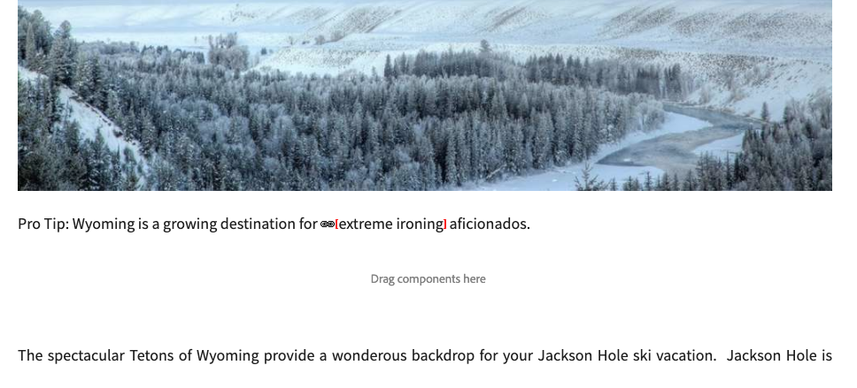

# Länkkontrollen {#the-link-checker}

Innehållsförfattare behöver inte bekymra sig om att validera alla länkar som de inkluderar på sina innehållssidor.

Länkkontrollen körs automatiskt så att skribenterna kan få hjälp med sina länkar:

* Validera länkar när de läggs till i innehållet
* Visar en lista över alla externa länkar i innehållet
* Utföra länktomformningar

Länkkontrollen har flera [konfigurationsalternativ](#configuring) som att definiera den interna valideringen, tillåta att vissa länkar eller länkmönster utelämnas från valideringen och skriva om regler för länkreskrivning.

Länkkontrollen validerar båda [interna länkar](#internal) och [externa länkar.](#external)

>[!NOTE]
>
>Eftersom länkkontrollen används för att kontrollera länkarna på alla innehållssidor kan länkkontrollen påverka prestanda för stora databaser. I sådana fall kan du behöva [konfigurera hur ofta länkkontrollen körs](#configuring) eller [avaktivera det.](#disabling)

## Intern länkkontroll {#internal}

Interna länkar är länkar till annat innehåll i AEM. Du kan lägga till interna länkar med sökvägsväljaren i textredigeraren eller med en anpassad komponent. Till exempel:

* Din sida `/content/wknd/us/en/adventures/ski-touring.html`
* Innehåller en länk till `/content/wknd/us/en/adventures/extreme-ironing.html` i en [Textkomponent.](https://experienceleague.adobe.com/docs/experience-manager-core-components/using/components/text.html)

Interna länkar valideras så snart innehållsförfattaren lägger till en intern länk på en sida. Om länken blir ogiltig:

* Den tas bort från utgivaren. Länktexten finns kvar, men själva länken tas bort.
* Den visas som en bruten länk i redigeringsgränssnittet.

## Kontroll av extern länk {#external}

Externa länkar är länkar till innehåll utanför AEM. Externa länkar kan läggas till med RTE eller med en anpassad komponent. Till exempel:

* Din sida `/content/wknd/us/en/adventures/ski-touring.html`
* Innehåller en länk till `https://bunwarmerthermalunderwear.com` i en [Textkomponent.](https://experienceleague.adobe.com/docs/experience-manager-core-components/using/components/text.html)

Externa länkar valideras för syntax och genom att deras tillgänglighet kontrolleras. Den här kontrollen utförs asynkront på en konfigurerbar intern. Om länkkontrollen hittar en ogiltig extern länk:

* Den tas bort från utgivaren. Länktexten finns kvar, men själva länken tas bort.
* Den visas som en bruten länk i redigeringsgränssnittet.

Dessutom är [Extern länkkontroll](#external-link-checker) -gränssnittet innehåller en översikt över alla externa länkar på innehållssidorna.

### Använda extern länkkontroll {#external-link-checker}

Så här använder du den externa länkkontrollen:

1. Använda **Navigering**, markera **verktyg** sedan **Webbplatser**.
1. Välj **Extern länkkontroll** och en lista över alla externa länkar visas.

Följande information visas:

* **Status** - Valideringsstatusen för länken, som kan vara något av följande:
   * **Giltig** - Den externa länken kan nås via Länkkontroll
   * **Väntande** - Den externa länken lades till i webbplatsinnehållet, men har ännu inte validerats av Länkkontrollen
   * **Ogiltig** - Den externa länken kan inte nås av Länkkontrollen
* **URL** - Den externa länken
* **Referent** - Innehållssidan som innehåller den externa länken
   * Detta är bara ifyllt [om konfigurerat.](#configuring)
* **Senast kontrollerad** - Den senaste gången som länkkontrollen validerade den externa länken
   * Hur ofta länkar kontrolleras [kan konfigureras.](#configuring)
* **Senaste status** - Den senaste HTML-statuskoden som returnerades när länken senast markerade den externa länken
* **Senast tillgänglig** - Tid sedan länken senast var tillgänglig för länkkontrollen
* **Senast använd** - tid sedan sidan med den externa länken senast öppnades i redigeringsgränssnittet

Du kan ändra innehållet i fönstret genom att använda de två knapparna högst upp i länklistan:

* **Uppdatera** - Uppdatera innehållet i listan
* **Kontrollera** - Kontrollera en enskild extern länk som är markerad i listan

### Så här fungerar den externa länkkontrollen {#how-it-works}

Extern länkkontroll är lätt att använda men är beroende av flera tjänster och du kan lättare förstå hur de fungerar [konfigurera länkkontrollen](#configuring) för att tillgodose dina behov.

1. När en innehållsförfattare sparar en länk till en sida aktiveras en händelsehanterare.
1. Händelsehanteraren går igenom allt innehåll under `/content` och söker efter nya eller uppdaterade länkar och lägger till dem i ett cacheminne för länkkontrollen.
1. The **Dag CQ Link Checker Service** körs sedan regelbundet för att kontrollera om posterna i cachen har giltig syntax.
1. Syntaxvaliderade länkar visas sedan i [Extern länkkontroll](#external-link-checker) -fönstret. De kommer dock att **Väntande** tillstånd.
1. The **CQ-länkkontrolluppgift för dag** körs sedan regelbundet för att validera länkarna genom att ringa ett GET-anrop.
1. The **CQ-länkkontrolluppgift för dag** uppdaterar sedan posterna i fönstret External Link Checker med resultatet av GET-anropen.

## Konfigurera länkkontrollen {#configuring}

Länkkontrollen är automatiskt tillgänglig i AEM. Det finns dock flera OSGi-konfigurationer som kan ändras för att ändra dess beteende:

* **Information om lagringsinformation för CQ-länkkontroll dag** - Den här tjänsten definierar storleken på cache-minnet för Länkkontroll i databasen.
* **Dag CQ Link Checker Service** - Tjänsten utför asynkron kontroll av syntaxen för externa länkar. Du kan bland annat definiera kontrollperioden och vilka typer av länkar som ignoreras av kontrollfunktionen.
* **CQ-länkkontrolluppgift för dag** - Den här tjänsten utför GET-validering av externa länkar. Det gör att olika definitioner av intervall kan kontrollera dåliga och bra länkar bland andra alternativ.
* **Dag CQ Link Checker Transformer** - Möjliggör konvertering av länkar baserat på en användardefinierad regeluppsättning.

Se dokumentet [Konfigurationsinställningar för OSGi](/help/sites-deploying/osgi-configuration-settings.md) om du vill ha mer information om hur du ändrar OSGi-inställningar.

## Inaktivera länkkontrollen {#disabling}

Du kan välja att inaktivera länkkontrollen helt. Så här gör du:

1. Öppna OSGi-konsolen.
1. Redigera **Dag CQ Link Checker Transformer**
1. Markera de alternativ som du vill inaktivera:
   * **Inaktivera kontroll** - inaktivera validering av länkar
   * **Inaktivera omskrivning** - för att inaktivera länkändringar

>[!NOTE]
>
>Om du inaktiverar länkkontroll efter att du har börjat skapa ditt innehåll kan du fortfarande se poster i [Fönstret External Link Checker](#external-link-checker), men de kommer inte längre att uppdateras.
