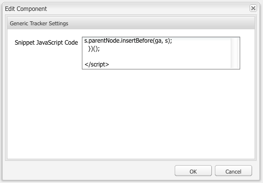

# Analyser med externa leverantörer {#analytics-with-external-providers}

Analyser kan ge dig viktig och intressant information om hur webbplatsen används.

Det finns olika färdiga konfigurationer för integrering med rätt tjänst, till exempel:

* [Adobe Analytics](/help/sites-administering/adobeanalytics.md)
* [Adobe Target](/help/sites-administering/target.md)

Du kan också konfigurera en egen instans av **Generiska analysfragment** för att definiera en ny tjänstkonfiguration.

Informationen samlas sedan in med små kodfragment som läggs till på webbsidorna. Till exempel:

>[!CAUTION]
>
>Skript får inte omslutas av `script` -taggar.

```
var _gaq = _gaq || [];
_gaq.push(['_setAccount', 'UA-XXXXX-X']);
_gaq.push(['_trackPageview']);

(function() {
    var ga = document.createElement('script'); ga.type = 'text/javascript'; ga.async = true;
    ga.src = ('https:' == document.location.protocol ? 'https://ssl' : 'https://www') + '.google-analytics.com/ga.js';
    var s = document.getElementsByTagName('script')[0]; s.parentNode.insertBefore(ga, s);
})();
```

Sådana fragment gör det möjligt att samla in data och generera rapporter. De faktiska data som samlas in beror på providern och vilket kodfragment som används. Exempel på statistik är:

* hur många besökare som helst
* hur många sidor som besöktes
* söktermer som används
* landningssidor

>[!CAUTION]
>
>Demonsplatsen Geometrixx-Outdoor är konfigurerad så att attributen i Sidegenskaperna läggs till i HTML-källkoden (alldeles ovanför `</html>` sluttagg) i motsvarande `js` skript.
>
>Om din egen `/apps` ärver inte från standardsidkomponenten ( `/libs/foundation/components/page`) måste du (eller dina utvecklare) se till att motsvarande `js` skript inkluderas, t.ex. genom att `cq/cloudserviceconfigs/components/servicescomponents`eller med en liknande mekanism.
>
>Utan detta kommer ingen av tjänsterna (Generic, Analytics, Target, etc.) att fungera.

## Skapa en ny tjänst med ett allmänt kodfragment {#creating-a-new-service-with-a-generic-snippet}

För den grundläggande konfigurationen:

1. Öppna **verktyg** konsol.
1. Expandera från den vänstra rutan **Konfigurationer av Cloud Services**.
1. Dubbelklicka på **Kodavsnitt för allmän analys** för att öppna sidan:

   

1. Klicka på + för att lägga till en ny konfiguration med dialogrutan. åtminstone tilldela ett namn, till exempel Google Analytics:

   

1. Klicka **Skapa**&#x200B;öppnas fragmentdialogrutan omedelbart - klistra in rätt javascript-fragment i fältet:

   

1. Klicka **OK** att spara.

## Använda din nya tjänst på sidor {#using-your-new-service-on-pages}

När du har skapat tjänstkonfigurationen behöver du nu konfigurera de sidor som krävs för att använda den:

1. Navigera till sidan.
1. Öppna **Sidegenskaper** från sidesparken, sedan **Cloud Services** -fliken.
1. Klicka **Lägg till tjänst** väljer du sedan önskad tjänst, till exempel **Kodavsnitt för allmän analys**:

   

1. Klicka **OK** att spara.
1. Du kommer tillbaka till **Cloud Services** -fliken. The **Kodavsnitt för allmän analys** visas nu med meddelandet `Configuration reference missing`. Använd listrutan för att välja en specifik tjänstinstans; till exempel google-analys:

   

1. Klicka **OK** att spara.

   Utdraget visas nu om du visar sidans sidkälla.

   Efter en lämplig tidsperiod kan du visa den statistik som har samlats in.

   >[!NOTE]
   >
   >Om konfigurationen är kopplad till en sida som har underordnade sidor, ärvs tjänsten även av dessa sidor.
