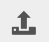
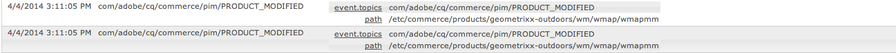
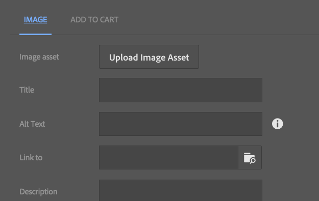

# Administrera generisk e-handel {#administering-generic-ecommerce}

Den generiska AEM-lösningen innehåller metoder för att hantera den handelsinformation som finns i databasen (till skillnad från att använda en extern e-handelsmotor). Detta omfattar följande:

* [Produkter](/help/sites-administering/concepts.md#products)
* [Produktvarianter](/help/sites-administering/concepts.md#product-variants)
* [Kataloger](/help/sites-administering/concepts.md#catalogs)
* [Erbjudanden](/help/sites-administering/concepts.md#promotions)
* [Vouchers](/help/sites-administering/concepts.md#vouchers)
* [Beställningar](/help/sites-administering/concepts.md#shopping-cart-and-orders)
* [Proxysidor](/help/sites-administering/concepts.md#proxy-pages)

>[!NOTE]
>
>Standardinstallationen av AEM innehåller den generiska implementeringen av AEM (JCR) för e-handel.
>
>Detta är för närvarande avsett för demonstrationssyften, eller som en grundläggande grund för en anpassad implementering enligt dina krav.

## Produkter och produktvariationer {#products-and-product-variations}

>[!NOTE]
>
>Följande procedurer gäller för både Produkter och Produktvariationer.

Innan du skapar produkter måste du definiera ett [ställningar](/help/sites-authoring/scaffolding.md). Här anges vilka fält du behöver för att definiera produkterna och hur de ska redigeras.

Det behövs ett ställningar för varje enskild produkttyp. Den lämpliga strukturen är kopplad till produkterna antingen genom att

* path
* produkten kan referera till skalet

>[!NOTE]
>
>I butiken Geometrixx-Outdoor finns en enda produkttyp (och därför en enda koffel):
>
>`/etc/scaffolding/geometrixx-outdoors`
>
>Produkttypen Geometrixx-Outdoor är aktiv på:
>
>`/etc/commerce/products/geometrixx-outdoors`
>
>Du kan skapa en ny produktdefinition var som helst under den utan ytterligare inställningar.

### Importerar produkter {#importing-products}

#### Importera produkter - Touchoptimerat användargränssnitt {#importing-products-touch-optimized-ui}

1. Navigera till **Products** -konsolen via **Commerce**.
1. Navigera till önskad plats med **Products** Console.
1. Använd ikonen **Importera produkter** för att öppna guiden.

   

1. Ange:

   * **Importör**

      Importören för den specifika [handelsleverantören](/help/sites-administering/concepts.md#commerce-providers), som standard `Geometrixx`.

   * **Källa**

      Den fil du vill importera; du kan använda webbläsaren för att välja en fil.

   * **Inkrementell import**

      Ange om detta är en stegvis import (i motsats till fullständig).
   >[!NOTE]
   >
   >Den stegvisa importen (av importexemplaret geometrixx-outdoor) sker på produktnivå.
   >
   >En anpassad importör kan definieras för att fungera som det ska.

1. Om du vill importera produkterna väljer du **Nästa** visas en logg över de åtgärder som har vidtagits.

   >[!NOTE]
   >
   >Produkterna importeras till, eller i förhållande till, den aktuella platsen.

   >[!NOTE]
   >
   >Om du använder **Nästa** och **Bakåt** flera gånger importeras produktdefinitionerna. Eftersom de har samma SKU:er skrivs den information som finns i databasen över.

1. Välj **Klar** för att stänga guiden.

#### Importerar produkter - klassiskt användargränssnitt {#importing-products-classic-ui}

1. Använd **verktygskonsolen** för att öppna mappen **Commerce** .
1. Dubbelklicka för att öppna **produktimporteraren**:

   

1. Ange:

   * **Butiksnamn**

      Produkterna importeras till:

      `/etc/commerce/products/<*store name*>/`

   * **Commerce Provider**

      Importören för din [e-handelsleverantör](/help/sites-administering/concepts.md#commerce-providers). som standard Geometrixx.

   * **Källfil**

      Platsen i databasen för filen som du vill importera.

   * **Inkrementell import**

      Ange om detta är en stegvis import (i motsats till fullständig).

1. Klicka på **Importera produkter**.

### Skapar produktinformation {#creating-product-information}

>[!NOTE]
>
>Standardprodukthanteringen är grundläggande eftersom produktuppsättningen Geometrixx-Outdoor har hållits grundläggande. Komplexiteten bygger på [produktversionerna](/help/sites-authoring/scaffolding.md), så med din egen produktanpassning kan du göra mer avancerad redigering.

#### Skapa produktinformation - Touchoptimerat gränssnitt {#creating-product-information-touch-optimized-ui}

1. Använd **produktkonsolen** (via **Commerce**) för att navigera till önskad plats.
1. Använd ikonen **Skapa** om du vill välja något (beroende på struktur och plats):

   * **Skapa produkt**
   * **Skapa produktvariation**
   

1. Guiden öppnas. Använd flikarna **Grundläggande** och **Produkt** för att ange [produktattributen](/help/sites-administering/concepts.md#product-attributes) för den nya produkten eller produktvarianten.

   >[!NOTE]
   >
   >**Title** and **SKU** are the minimum required to create a product or variant.

1. Spara informationen genom att välja **Skapa** .

>[!NOTE]
>
>Många produkter finns i en rad olika färger och/eller storlekar. Information om basprodukten och relaterade produktvarianter kan både hanteras från **produktkonsolen** .
>
>Produkterna och deras varianter lagras som en trädstruktur, produktinformationen är högst upp, med varianterna under (den här strukturen används av användargränssnittet).

### Redigera produktinformation {#editing-product-information}

>[!NOTE]
>
>Produktbilder i geometrixx-utomhusbruk kan fås från:
>
>`/etc/commerce/products/...`
>
>Det innebär att de som standard blockeras av [dispatchern](https://helpx.adobe.com/experience-manager/dispatcher/using/dispatcher-configuration.html), så konfigurera som det behövs.

#### Redigera produktinformation - Touchoptimerat gränssnitt {#editing-product-information-touch-optimized-ui}

1. Gå till produktinformationen med **Products** Console (via **Commerce**).
1. Använd antingen:

   * [snabbåtgärder](/help/sites-authoring/basic-handling.md#quick-actions)
   * [markeringsläge](/help/sites-authoring/basic-handling.md#navigating-and-selection-mode)
   Välj ikonen **Visa produktdata** :

   

1. Produktattributen  visas. Använd **Redigera** och **Klar** för att göra ändringar.

### Visar produktreferenser {#showing-product-references}

#### Visar produktreferenser - Touchoptimerat användargränssnitt {#showing-product-references-touch-optimized-ui}

1. Gå till produktinformationen med **Products** Console (via **Commerce**).
1. Öppna den sekundära listen för referenser med ikonen:

   

1. Välj önskad produkt - den sekundära rälen uppdateras för att visa tillgängliga referenstyper:

   

1. Klicka/tryck på referenstypen (t.ex. produktsidor) för att utöka listan.
1. Välj en specifik referens för att visa alternativen:

   * Navigera till produktsidan
   * Redigera produktsida
   

### Sök efter produkter {#search-for-products}

1. Navigera till **Products** -konsolen via **Commerce**.
1. Öppna den andra listen för sökning med ikonen:

   

1. Du kan söka efter produkter på flera olika sätt. Du kan bara använda en eller flera aspekter för en sökning. De produkter som hittas visas:

   

1. Om du klickar/trycker på en produkt öppnas den. Du kan också publicera den eller visa produktdata.

#### Utöka sökning {#extending-search}

Du kan ändra en befintlig aspekt eller lägga till nya, med CRXDE Lite:

1. Navigera till:

   `http://localhost:4502/crx/de/index.jsp#/libs/commerce/gui/content/products/aside/items/search/items/searchpanel/facets`

1. Du kan till exempel ändra de storlekar som ska visas på produktsöksidan. Klicka på `sizegroup` noden.
1. Klicka på `items` nod och sedan på `propertypredicate` nod.
1. Du kan ändra på `propertyValues`. Du kan till exempel lägga till XS, eller XXL, eller ta bort en storlek.
1. Klicka på **Spara alla** och navigera till produktsöksidan. Ändringarna bör visas.

### Flera resurser {#multiple-assets}

Du kan lägga till flera resurser i produktkomponenten och sedan ange vilken resurs som ska visas på produktsidan.

>[!NOTE]
>
>Allt som rör flera resurser görs med det pekoptimerade användargränssnittet.

#### Lägga till flera resurser {#adding-multiple-assets}

1. Navigera till **Products** -konsolen via **Commerce**.
1. Gå till önskad produkt med hjälp av **produktkonsolen** .

   >[!NOTE]
   >
   >Du måste vara på produktnivå, inte på variantnivå.

1. Tryck/klicka på ikonen **Visa produktdata** med markeringsläge eller snabbåtgärder.
1. Tryck/klicka på ikonen Redigera.
1. Bläddra för att **lägga till**.

   

1. Tryck/klicka på **Lägg till**. En ny platshållare för resursen visas.
1. Om du trycker/klickar på **Ändra **öppnas en dialogruta där du kan välja en resurs.
1. Välj den resurs som du vill lägga till.

   >[!NOTE]
   >
   >De resurser du kan välja är från [Resurser](https://helpx.adobe.com/experience-manager/aem-previous-versions.html#assets).

1. Tryck/klicka på ikonen Klar.

Två resurser lagras nu i produktkomponenten. Du kan konfigurera vilken som ska visas på produktsidan. Detta fungerar med ett kategorisystem. Först måste du lägga till en kategori till de enskilda resurserna:

1. Tryck/klicka på **Visa produktdata**.
1. Skriv in en **tillgångskategori** under tillgångarna, till exempel `cat1` och `cat2`.

   >[!NOTE]
   >
   >Du kan också använda taggar för kategorier.

1. Tryck/klicka på ikonen Klar. Nu måste du [göra](#rolling-out-a-catalog) ändringarna.

Nu har resurserna i produktkomponenten en kategori. Du kan konfigurera vilken kategori som ska visas på tre olika nivåer:

* [Produktsida](#product-page)
* [Katalog](#catalog)
* [Products Console](#products-console)

>[!NOTE]
>
>Om du inte anger kategorier visas den första resursen på produktsidan.

Mekanismen för att välja den bild som ska visas är följande:

1. Verifiera om en kategori har angetts för produktsidan.
1. Annars kontrollerar du om en kategori har angetts för katalogen.
1. Om inte, kontrollerar du om en kategori har angetts för produktkonsolen.

>[!NOTE]
>
>För både katalognivå och produktkonsolnivå måste du implementera ändringarna och se skillnaden på produktsidan.

#### Produktsida {#product-page}

1. Gå till din produktsida.
1. **Redigera** produktkomponenten.
1. Skriv den **bildkategori** du valde (till `cat1` exempel).
1. Tryck/klicka på **Klar**. Sidan uppdateras och rätt resurs ska visas.

#### Katalog {#catalog}

1. Navigera till katalogen.
1. Tryck/klicka på **Visa egenskaper**.
1. Tryck/klicka på **Redigera**.
1. Tryck/klicka på fliken **Resurser** .
1. Ange den **produkttillgångskategori** som krävs.
1. Tryck/klicka på **Klar**.
1. [Utnyttja](#rolling-out-a-catalog) ändringarna.

#### Products Console {#products-console}

1. Gå till önskad produkt med hjälp av **produktkonsolen** .
1. Tryck/klicka på **Visa produktdata**.
1. Tryck/klicka på **Redigera**.
1. Ange en **standardtillgångskategori**.
1. Tryck/klicka på **Klar**.
1. [Utnyttja](#rolling-out-a-catalog) ändringarna.

### Publicera/avpublicera produktinformation {#publishing-unpublishing-product-information}

#### Publicera/avpublicera produktinformation - Touchoptimerat gränssnitt {#publishing-unpublishing-product-information-touch-optimized-ui}

>[!NOTE]
>
>Produktinformationen publiceras ofta via de sidor som refererar till den. Om du till exempel publicerar sidan X som refererar till produkten Y, frågar AEM om du även vill publicera produkten Y.
>
>I speciella fall stöder AEM även publicering direkt från produktdata.

1. Gå till produktinformationen med **Products** Console (via **Commerce**).
1. Använd antingen:

   * [snabbåtgärder](/help/sites-authoring/basic-handling.md#quick-actions)
   * [markeringsläge](/help/sites-authoring/basic-handling.md#navigating-and-selection-mode)
   Välj ikonen **Publicera** eller **Avpublicera** efter behov:

    

   Produktinformationen kommer att publiceras eller avpubliceras efter behov.

### Produktfeed {#product-feed}

Med Search&amp;Promote-integreringen kan du:

* använda eCommerce API, oberoende av den underliggande databasstrukturen och handelsplattformen.
* Använd funktionen Index Connector i Search&amp;Promote för att skapa en produktfeed i XML-format.
* utnyttja funktionen Fjärrstyrning i Search&amp;Promote för att utföra on-demand- eller schemalagda begäranden i produktflödet
* feed-generering för olika Search&amp;Promote-konton, konfigurerade som molntjänster.

Mer information finns i [Produktfeed](/help/sites-administering/product-feed.md).

### Händelsehanterare för produktuppdateringar {#event-handler-for-product-updates}

Det finns en händelsehanterare som loggar en händelse när en produkt läggs till, ändras eller tas bort och när en produktsida läggs till, ändras eller tas bort. Det finns följande OSGi-händelser:

* `com/adobe/cq/commerce/pim/PRODUCT_ADDED`
* `com/adobe/cq/commerce/pim/PRODUCT_MODIFIED`
* `com/adobe/cq/commerce/pim/PRODUCT_DELETED`
* `com/adobe/cq/commerce/pim/PRODUCT_PAGE_ADDED`
* `com/adobe/cq/commerce/pim/PRODUCT_PAGE_MODIFIED`
* `com/adobe/cq/commerce/pim/PRODUCT_PAGE_DELETED`

För `PRODUCT_*` händelserna pekar sökvägen till basprodukten i `/etc/commerce/products`. För `PRODUCT_PAGE_*` händelserna pekar sökvägen till `cq:Page` noden.

Du kan titta på dem i webbkonsolen i OSGI-händelser ( `/system/console/events`), till exempel:

>[!NOTE]
>
>Läs även [händelsehantering i AEM](https://blogs.adobe.com/experiencedelivers/experience-management/event_handling_incq/). 

### Bild med Lägg till i kundvagnslänkar {#image-with-add-to-cart-links}

Med komponenten Bild med Lägg i kundvagnslänkar kan du snabbt lägga till en produkt i kundvagnen genom att skapa en aktiveringspunkt länkad till en produkt i en bild.

När du klickar på aktiveringspunkten öppnas en dialogruta där du kan välja storlek och kvantitet för produkten.

1. Navigera till sidan där du vill lägga till komponenten.
1. Dra och släpp komponenten på sidan.
1. Dra och släpp en bild i komponenten från [resursläsaren](/help/sites-authoring/author-environment-tools.md#assets-browser).
1. Du kan antingen:

   * klicka på komponenten och sedan på ikonen Redigera
   * dubbelklicka långsamt

1. Klicka på helskärmsikonen.

   

1. Klicka på ikonen Starta karta.

   

1. Klicka på en av formikonerna.

   

1. Ändra och flytta formen efter behov.
1. Klicka på formen.
1. När du klickar på bläddringsikonen öppnas [Resursväljaren](../assets/search-assets.md#assetselector).

   >[!NOTE]
   >
   >Du kan också skriva produktsökvägen som måste finnas på produktnivå, inte på variantnivå, direkt.

   

1. Klicka på bekräftelseikonen två gånger och sedan på Avsluta helskärm.
1. Klicka någonstans på sidan bredvid komponenten. Sidan bör uppdateras och följande symbol bör visas på bilden:

   

1. Växla till [förhandsvisningsläge](/help/sites-authoring/editing-content.md#previewingpagestouchoptimizedui) .
1. Klicka på hotspot-området +. En dialogruta öppnas där du kan välja storlek och kvantitet för den produkt du angav i **Path**.

   

1. Ange en storlek och en kvantitet.
1. Klicka på knappen Lägg till i kundvagnen. Dialogrutan stängs.
1. Gå till kundvagnen. Produkten ska vara här.

#### Konfigurationsalternativ {#configuration-options}

Du kan konfigurera hur dialogrutan ser ut när du klickar på hotspot-området:

1. Klicka på komponenten och klicka på konfigurationsikonen.

   

1. Bläddra nedåt. Fliken **LÄGG TILL I KORT** finns.

   

1. Klicka på **LÄGG TILL I KORT**. Det finns tre konfigurationsalternativ som du kan använda.

   

1. Klicka på ikonen Klar.

## Kataloger {#catalogs}

### Skapa en katalog {#generating-a-catalog}

#### Generera en katalog - Touchoptimerat användargränssnitt {#generating-a-catalog-touch-optimized-ui}

>[!NOTE]
>
>Katalogen kommer att referera till dina produktdata.

Så här skapar du en katalog:

1. Öppna konsolen Platser (till exempel [http://localhost:4502/sites.html/content](http://localhost:4502/sites.html/content)).
1. Navigera till den plats där du vill skapa den nya sidan.
1. Använd ikonen **Skapa** för att öppna alternativlistan:

   

1. Välj **Skapa katalog** i listan. Guiden Skapa katalog öppnas.

   

1. Navigera till önskad katalogutkast.
1. Tryck/klicka på knappen **Välj** och tryck/klicka på önskad katalogutkast.
1. Tryck/klicka på **Nästa**.

   

1. Skriv en **titel** och ett **namn**.
1. Tryck/klicka på knappen **Skapa** . Katalogen skapas och en dialogruta öppnas.

   

1. Om du trycker/klickar på **Klar** återgår du till webbplatskonsolen där du kan se katalogen.

   Om du trycker/klickar på knappen **Öppna katalog** öppnas katalogen (till exempel `http://localhost:4502/editor.html/content/test-catalog.html`).

#### Generera en katalog - Classic UI {#generating-a-catalog-classic-ui}

>[!NOTE]
>
>Katalogen kommer att referera till dina [produktdata](#products-and-product-variants).

1. Gå till din **katalogutkast** med hjälp av **webbplatskonsolen** och gå sedan till baskatalogen.

   Exempel:

   `http://localhost:4502/siteadmin#/content/catalogs/geometrixx-outdoors/base-catalog`

1. Skapa en ny sida med hjälp av mallen **Avsnittsutkast** .

   Exempel, `Swimwear`.

1. Öppna den nya `Swimwear` sidan och klicka sedan på **Redigera utkast** för att öppna dialogrutan **Egenskaper** där du kan ställa in **produktvalet** .

   Öppna till exempel fältet **Taggar/nyckelord** för att välja Aktivitet och sedan Simma i sektionen Geometrixx-Outdoor.

1. Klicka på **OK** för att spara dina egenskaper; exempelprodukter visas under **produkturvalskriterierna** på sidan om skiss.
1. Klicka på **Överrullningsändringar..**, välj **Överrullningssida och alla undersidor**, klicka sedan på **Nästa** och sedan **Övergång**. När utrullningen är klar visas **statusindikatorn** som grön.
1. Nu kan du klicka på **Stäng** och kontrollera den nya katalogsektionen; till exempel på och under:

   `http://localhost:4502/cf#/content/geometrixx-outdoors/en/swimwear.html`

1. Klicka på **Redigera utkast** på sidan för utkast och öppna fliken **Genererad sida** i dialogrutan **Egenskaper** . I fältet Banderolllista väljer du den bild som du vill visa;
till exempel `summer.jpg`
1. Klicka på **OK** för att spara dina egenskaper; bannerinformation visas under **Produkturvalskriterierna** på plansidan.
1. Utför de här nya ändringarna.

### Stänger ut en katalog {#rolling-out-a-catalog}

#### Skapa en katalog - Touchoptimerat användargränssnitt {#rolling-out-a-catalog-touch-optimized-ui}

Så här distribuerar du en katalog:

1. Navigera till **katalogkonsolen** via **Commerce**.
1. Navigera till den katalog som du vill lansera.
1. Använd antingen:

   * [snabbåtgärder](/help/sites-authoring/basic-handling.md#quick-actions)
   * [markeringsläge](/help/sites-authoring/basic-handling.md#navigating-and-selection-mode)
   Välj ikonen **Utrullningsändringar** :

   

1. I guiden ställer du in utrullningen efter behov och trycker/klickar sedan på **Rollout Changes**.
1. En dialogruta öppnas. Tryck/klicka på **Klar** när processen är klar.

#### Öppnar en katalog - Classic UI {#rolling-out-a-catalog-classic-ui}

Så här distribuerar du en katalog:

1. Navigera till den katalog som du vill lansera. Exempel:

   `http://localhost:4502/cf#/content/catalogs/geometrixx-outdoors/base-catalog.html`

1. Klicka på **Överrullningsändringar..**
1. Ställ in utrullningen efter behov.
1. Klicka på **Överrullning**.

### Blueprint Importer {#blueprint-importer}

#### Blueprint Importer - pekoptimerat användargränssnitt {#blueprint-importer-touch-optimized-ui}

1. Navigera till **katalogkonsolen** via **Commerce**.
1. Navigera till den plats där du vill importera katalogplanen.
1. Tryck/klicka på ikonen **Importera utkast** .

   

1. Välj Källa i guiden efter behov och tryck/klicka på **Nästa**.

   

1. Tryck/klicka på **Klar** när importen är klar.

#### Blueprint Importer - Classic UI {#blueprint-importer-classic-ui}

1. Navigera till **Commerce** med **verktygskonsolen**.

   Exempel:

   `http://localhost:4502/miscadmin#/etc/commerce`

1. Öppna **Katalogimporteraren**.
1. Ställ in importen efter behov.
1. Klicka på **Importera katalogutkast**.

## Erbjudanden {#promotions}

### Skapa en kampanj {#creating-a-promotion}

#### Skapa en kampanj - klassiskt användargränssnitt {#creating-a-promotion-classic-ui}

>[!NOTE]
>
>I följande exempel behandlas en kampanj som hålls direkt i en [kampanj](/help/sites-classic-ui-authoring/classic-personalization-campaigns.md). Den används för verifikationer.
>
>En kampanj kan också finnas i en [upplevelse](/help/sites-authoring/personalization.md) i en kampanj.
>
>Mer information finns i [Kampanjer och Vouchers](#promotions-and-vouchers).

1. Öppna konsolen **Webbplatser** för din författarinstans.
1. Välj önskad **kampanj** i den vänstra rutan.
1. Klicka på **Nytt**, välj **tävlingsmallen** och ange sedan en **titel** (och **namn** om det behövs) för den nya vouchern.
1. Klicka på **Skapa**. Den nya kampanjsidan visas i den högra rutan.

1. Redigera **egenskaper** genom att antingen:

   * öppnar sidan och klickar sedan på knappen Redigera för att öppna dialogrutan Egenskaper
   * **markera sidan i webbplatskonsolen och sedan använda snabbmenyn (vanligtvis höger musknapp) för att välja** Egenskaper... och öppna egenskapsdialogrutan
   Ange **erbjudandetyp**, **rabatttyp**, **rabattvärde** och eventuella andra fält.

1. Spara genom att klicka på **OK** .

1. Nu kan ni aktivera kampanjen så att kunderna ser den i publiceringsinstansen.

## Vouchers {#vouchers}

### Skapa en voucher {#creating-a-voucher}

#### Skapa en kupong - klassiskt användargränssnitt {#creating-a-voucher-classic-ui}

1. Öppna konsolen **Webbplatser** för din författarinstans.
1. Välj önskad **kampanj** i den vänstra rutan.
1. Klicka på **Nytt**, markera **Voucher** -mallen och ange sedan en **titel** (och **namn** om det behövs) för den nya verifikationen.
1. Klicka på **Skapa**. Den nya verifikationssidan visas i den högra rutan.

1. Öppna den nya verifikationssidan med ett dubbelklick och klicka sedan på **Redigera** för att konfigurera informationen.
1. Spara genom att klicka på **OK** .

1. Nu kan du aktivera din voucher så att kunderna kan använda den i sina kundvagnar i publiceringsinstansen.

### Tar bort verifikationer {#removing-vouchers}

#### Tar bort Vouchers - klassiskt gränssnitt {#removing-vouchers-classic-ui}

För att göra en voucher otillgänglig för kunderna kan du antingen:

* Inaktivera vouchern - den är fortfarande tillgänglig i författarmiljön så att du kan återaktivera den vid ett senare tillfälle.
* Ta bort den helt.

Båda åtgärderna kan utföras från **webbplatskonsolen** .

### Ändra verifikationer {#modifying-vouchers}

#### Ändra Vouchers - klassiskt användargränssnitt {#modifying-vouchers-classic-ui}

Om du vill ändra egenskaperna för en voucher eller kampanj kan du dubbelklicka på den på **webbplatskonsolen** och klicka på **Redigera**. När du har sparat den bör du aktivera den så att ändringarna överförs till publiceringsinstansen.

### Lägga till verifikationer i en kundvagn {#adding-vouchers-to-a-cart}

Om du vill att användare ska kunna lägga till vouchers i sina kundvagnar kan du använda den inbyggda **Vouchers** -komponenten (handelskategori). Du måste lägga till det här på samma sida som kundvagnen visas på (men är inte obligatoriskt). Verifikationskomponenten är bara ett formulär där användaren kan ange en verifikationskod, det är kundvagnskomponenten som faktiskt visar listan över använda verifikationer och deras rabatt.

På demowebbplatsen (Geometrixx Outdoor - English) kan du se kupongformuläret på kundvagnssidan, under den faktiska kundvagnen.

## Beställningar {#orders}

>[!NOTE]
>
>Observera att körklar AEM inte har några åtgärder som krävs för standardfunktioner i samband med order, som att returnera varor, uppdatera orderstatus, utföra leveranser och generera följesedlar. Den är främst avsedd som en förhandstitt på teknik.
>
>Den allmänna orderhanteringen i AEM har hållits grundläggande. Vilka fält som är tillgängliga i guiden beror på skalan:
>`/etc/scaffolding/geometrixx-outdoors/order/jcr:content/cq:dialog`
>
>Om du skapar ett anpassat ställningar kan du lagra mer orderinformation.

>[!NOTE]
>
>Orderkonsolen visar information om leverantörsorder, som aldrig publiceras.
>
>Kundorderinformationen finns i deras hemkataloger och visas i orderhistoriken för deras konto. Denna information publiceras tillsammans med resten av deras hemkatalog.

### Skapar orderinformation {#creating-order-information}

#### Skapa beställningsinformation - Touchoptimerat gränssnitt {#creating-order-information-touch-optimized-ui}

1. Använd **Orders** Console för att navigera till önskad plats.
1. Använd ikonen **Skapa** för att välja **Skapa order**.

   

1. Guiden öppnas. Använd flikarna **Grundläggande**, **Innehåll**, **Betalning** och **Uppfyllelse** för att ange [information om den nya ordern](/help/sites-administering/concepts.md#order-information).

1. Spara informationen genom att välja **Skapa** .

### Redigera orderinformation {#editing-order-information}

#### Redigera beställningsinformation - Touchoptimerat gränssnitt {#editing-order-information-touch-optimized-ui}

1. Använd **Orders** Console för att navigera till ordningen.
1. Använd antingen:

   * [snabbåtgärder](/help/sites-authoring/basic-handling.md#quick-actions)
   * [markeringsläge](/help/sites-authoring/basic-handling.md#navigating-and-selection-mode)
   Välj ikonen **Visa orderdata** :

   

1. Beställningsinformationen  visas. Använd **Redigera** och **Klar** för att göra ändringar.

