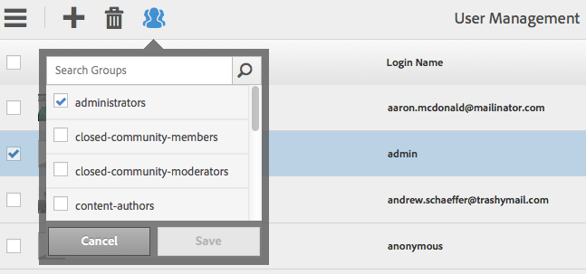

# Granitåtgärder - användar- och gruppadministration{#granite-operations-user-and-group-administration}

Eftersom Granite innehåller CRX Repository-implementeringen av JCR API-specifikationen har det en egen användar- och gruppadministration.

De här kontona är den underliggande grunden för [AEM konton](/help/sites-administering/security.md) och alla kontoändringar som görs i Granite-administrationen återspeglas om/när kontona nås från [AEM användarkonsolen](/help/sites-administering/security.md#accessing-user-administration-with-the-security-console) (till exempel `http://localhost:4502/useradmin`). På AEM användarkonsol kan du även hantera behörigheter och andra AEM.

Administrationskonsolerna för vissa användare och grupper är båda tillgängliga från **[Tools](/help/sites-administering/tools-consoles.md)**-konsolen i det pekoptimerade användargränssnittet:

Om du väljer **Användare** eller **Grupper** från verktygskonsolen öppnas rätt konsol. I båda kan du vidta åtgärder antingen genom att använda kryssrutan och sedan åtgärder från verktygsfältet, eller genom att öppna kontoinformationen via länken under **Namn**.

* [Användaradministration](#user-administration)

  

  **Användare**-konsolen visar:

   * användarnamnet
   * användarens inloggningsnamn (kontonamn)
   * eventuell titel som kontot har fått

* [Gruppadministration](#group-administration)

  

  Konsolen **Grupper** visar:

   * gruppnamnet
   * gruppbeskrivningen
   * antalet användare/grupper i gruppen

## Användaradministration {#user-administration}

### Lägga till en ny användare {#adding-a-new-user}

1. Använd ikonen **Lägg till användare** :

   

1. Formuläret **Skapa användare** öppnas:

   

   Här kan du ange användarinformation för kontot (de flesta är standard och självförklarande):

   * **ID**

     Detta är det unika ID:t för användarkontot. Det är obligatoriskt och får inte innehålla blanksteg.

   * **E-postadress**
   * **Lösenord**

     Ett lösenord är obligatoriskt.

   * **Retype-lösenord**

     Detta är obligatoriskt eftersom det krävs för att bekräfta lösenordet.

   * **Förnamn**
   * **Efternamn**
   * **Telefonnummer**
   * **Jobbtitel**
   * **Gatuadress**
   * **Mobil**
   * **Ort**
   * **Postnummer**
   * **Land**
   * **Läge**
   * **Titel**
   * **Kön**
   * **Om**
   * **Kontoinställningar**

      * **Status**
Du kan flagga kontot som antingen **aktivt** eller **inaktivt**.

   * **Foto**

     Här kan du ladda upp ett foto som ska användas som avatar.

     Godkända filtyper: `.jpg .png .tif .gif`

     Önskad storlek: `240x240px`

   * **Lägg till användare i grupper**

     Använd listrutan för val för att välja grupper som användaren ska vara medlem i. När du har markerat kan du avmarkera **X** efter namnet innan du sparar.

   * **Grupper**

     En lista över grupper som användaren är medlem i. Använd namnet **X** för att avmarkera innan du sparar.

1. När du har definierat användningen av användarkontot:

   * **Avbryt** om du vill avbryta registreringen.
   * **Spara** för att slutföra registreringen. Ett meddelande visas om du skapar användarkontot.

### Redigera en befintlig användare {#editing-an-existing-user}

1. Gå till användarinformationen från länken under användarnamnet i användarkonsolen.

1. Nu kan du redigera informationen som i [Lägga till en ny användare](#adding-a-new-user).

1. Gå till användarinformationen från länken under användarnamnet i användarkonsolen.

1. Nu kan du redigera informationen som i [Lägga till en ny användare](#adding-a-new-user).

### Ändra lösenordet för en befintlig användare {#changing-the-password-for-an-existing-user}

1. Gå till användarinformationen från länken under användarnamnet i användarkonsolen.

1. Nu kan du redigera informationen som i [Lägga till en ny användare](#adding-a-new-user). Under **Kontoinställningar** finns en länk för **Ändra lösenord**.

   

1. Dialogrutan **Ändra lösenord** öppnas. Ange och skriv det nya lösenordet igen tillsammans med ditt lösenord. Använd **OK** för att bekräfta ändringarna.

   

   Ett meddelande bekräftar att lösenordet har ändrats.

### Snabbgruppstilldelning {#quick-group-assignment}

1. Använd kryssrutan för att flagga en eller flera användare.
1. Använd ikonen **Grupper** :

   

   Så här öppnar du listrutan för gruppval:

   

1. I markeringsrutan kan du markera eller avmarkera grupper som användarkontot ska tillhöra.

1. När du har tilldelat, eller inte tilldelat, grupperna efter behov:

   * **Avbryt** om du vill avbryta ändringarna
   * **Spara** för att bekräfta ändringarna

### Tar bort befintlig användarinformation {#deleting-existing-user-details}

1. Använd kryssrutan för att flagga en eller flera användare.
1. Använd ikonen **Ta bort** för att ta bort användarinformationen:

   

1. Du ombeds bekräfta borttagningen och sedan bekräftar ett meddelande att borttagningen har ägt rum.

## Gruppadministration {#group-administration}

### Lägga till en ny grupp {#adding-a-new-group}

1. Använd ikonen Lägg till grupp:

   

1. Formuläret **Skapa grupp** öppnas:

   

   Här kan du ange gruppinformation:

   * **ID**

     Detta är en unik identifierare för gruppen. Detta är obligatoriskt och får inte innehålla blanksteg.

   * **Namn**

     Ett namn för gruppen. Det visas i gruppkonsolen.

   * **Beskrivning**

     En beskrivning av gruppen.

   * **Lägg till medlemmar i gruppen**

     Använd listrutan för val för att välja användare som ska läggas till i gruppen. När du har markerat kan du avmarkera **X** efter namnet innan du sparar.

   * **Gruppmedlemmar**

     En lista över användare i gruppen. Använd namnet **X** för att avmarkera innan du sparar.

1. När du har definierat gruppen använder du:

   * **Avbryt** om du vill avbryta registreringen.
   * **Spara** för att slutföra registreringen. Skapandet av gruppen bekräftas med ett meddelande.

### Redigera en befintlig grupp {#editing-an-existing-group}

1. Gå till gruppinformationen från länken under gruppnamnet i gruppkonsolen.

1. Du kan nu redigera och spara informationen som i [Lägga till en ny grupp](#adding-a-new-group).

### Kopiera en befintlig grupp {#copying-an-existing-group}

1. Använd kryssrutan för att flagga en grupp.
1. Använd ikonen **Kopiera** för att kopiera gruppinformationen:

   

1. Formuläret **Redigera gruppinställningar** öppnas.

   Grupp-ID:t är samma som det ursprungliga, men har prefixet `Copy of`. Redigera det här ID:t eftersom det inte får innehålla blanksteg. Alla andra detaljer är desamma som originalet.

   Du kan nu redigera och spara informationen som i [Lägga till en ny grupp](#adding-a-new-group).

### Ta bort en befintlig grupp {#deleting-an-existing-group}

1. Använd kryssrutan för att flagga en eller flera grupper.
1. Använd ikonen **Ta bort** för att ta bort gruppinformationen:

   

1. Du ombeds bekräfta borttagningen och sedan bekräftar ett meddelande att borttagningen har ägt rum.
