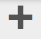
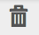

# Granitåtgärder - användar- och gruppadministration{#granite-operations-user-and-group-administration}

Eftersom Granite innehåller CRX-databasimplementeringen av JCR API-specifikationen har det en egen användar- och gruppadministration.

Dessa konton utgör den underliggande grunden för [AEM](/help/sites-administering/security.md) och eventuella kontoändringar som görs i Granitadministrationen kommer att återspeglas om/när kontona hämtas från [AEM](/help/sites-administering/security.md#accessing-user-administration-with-the-security-console) (t.ex. `http://localhost:4502/useradmin`). På AEM användarkonsol kan du även hantera behörigheter och andra AEM.

Administrationskonsoler för Granite-användare och grupper är båda tillgängliga från **[verktyg](/help/sites-administering/tools-consoles.md)** konsol för det pekoptimerade användargränssnittet:

Välj antingen **Användare** eller **Grupper** från verktygskonsolen öppnar rätt konsol. I båda kan du vidta åtgärder antingen genom att använda kryssrutan och sedan åtgärder från verktygsfältet, eller genom att öppna kontoinformationen via länken under **Namn**.

* [Användaradministration](#user-administration)

  

  The **Användare** konsollistor:

   * användarnamnet
   * användarens inloggningsnamn (kontonamn)
   * eventuell titel som kontot har fått

* [Gruppadministration](#group-administration)

  

  The **Grupper** konsollistor:

   * gruppnamnet
   * gruppbeskrivningen
   * antalet användare/grupper i gruppen

## Användaradministration {#user-administration}

### Lägga till en ny användare {#adding-a-new-user}

1. Använd **Lägg till användare** ikon:

   

1. The **Skapa användare** formuläret öppnas:

   

   Här kan du ange användarinformation för kontot (de flesta är standard och självförklarande):

   * **ID**

     Detta är det unika ID:t för användarkontot. Det är obligatoriskt och får inte innehålla blanksteg.

   * **E-postadress**
   * **Lösenord**

     Ett lösenord är obligatoriskt.

   * **Skriv lösenordet igen**

     Detta är obligatoriskt eftersom det krävs för att bekräfta lösenordet.

   * **Förnamn**
   * **Efternamn**
   * **Telefonnummer**
   * **Befattning**
   * **Gata**
   * **Mobil**
   * **Ort**
   * **Postnummer**
   * **Land**
   * **Läge**
   * **Titel**
   * **Kön**
   * **Om**
   * **Kontoinställningar**

      * **Status**
Du kan flagga kontot som antingen **aktiv** eller **inaktiv**.

   * **Foto**

     Här kan du ladda upp ett foto som ska användas som avatar.

     Godkända filtyper: `.jpg .png .tif .gif`

     Önskad storlek: `240x240px`

   * **Lägg till användare i grupper**

     Använd listrutan för val för att välja grupper som användaren ska vara medlem i. Använd **X** efter namnet som ska avmarkeras innan du sparar.

   * **Grupper**

     En lista över grupper som användaren är medlem i. Använd **X** efter namnet som ska avmarkeras innan du sparar.

1. När du har definierat användarkontot:

   * **Avbryt** för att avbryta registreringen.
   * **Spara** för att slutföra registreringen. Ett meddelande visas om du skapar användarkontot.

### Redigera en befintlig användare {#editing-an-existing-user}

1. Gå till användarinformationen från länken under användarnamnet i användarkonsolen.

1. Nu kan du redigera informationen som i [Lägga till en ny användare](#adding-a-new-user).

1. Gå till användarinformationen från länken under användarnamnet i användarkonsolen.

1. Nu kan du redigera informationen som i [Lägga till en ny användare](#adding-a-new-user).

### Ändra lösenordet för en befintlig användare {#changing-the-password-for-an-existing-user}

1. Gå till användarinformationen från länken under användarnamnet i användarkonsolen.

1. Nu kan du redigera informationen som i [Lägga till en ny användare](#adding-a-new-user). Under **Kontoinställningar** det finns en länk för **Ändra lösenord**.

   

1. The **Ändra lösenord** öppnas. Ange och skriv det nya lösenordet igen tillsammans med ditt lösenord. Använd **OK** för att bekräfta ändringarna.

   

   Ett meddelande bekräftar att lösenordet har ändrats.

### Snabbgruppstilldelning {#quick-group-assignment}

1. Använd kryssrutan för att flagga en eller flera användare.
1. Använd **Grupper** ikon:

   

   Så här öppnar du listrutan för gruppval:

   

1. I markeringsrutan kan du markera eller avmarkera grupper som användarkontot ska tillhöra.

1. När du har tilldelat, eller inte tilldelat, grupperna efter behov:

   * **Avbryt** för att avbryta ändringarna
   * **Spara** för att bekräfta ändringarna

### Tar bort befintlig användarinformation {#deleting-existing-user-details}

1. Använd kryssrutan för att flagga en eller flera användare.
1. Använd **Ta bort** -ikon för att ta bort användarinformationen:

   

1. Du ombeds bekräfta borttagningen och sedan bekräftar ett meddelande att borttagningen har ägt rum.

## Gruppadministration {#group-administration}

### Lägga till en ny grupp {#adding-a-new-group}

1. Använd ikonen Lägg till grupp:

   

1. The **Skapa grupp** formuläret öppnas:

   

   Här kan du ange gruppinformation:

   * **ID**

     Detta är en unik identifierare för gruppen. Detta är obligatoriskt och får inte innehålla blanksteg.

   * **Namn**

     Ett namn för gruppen. den visas i gruppkonsolen.

   * **Beskrivning**

     En beskrivning av gruppen.

   * **Lägg till medlemmar i grupp**

     Använd listrutan för val för att välja användare som ska läggas till i gruppen. Använd **X** efter namnet som ska avmarkeras innan du sparar.

   * **Gruppmedlemmar**

     En lista över användare i gruppen. Använd **X** efter namnet som ska avmarkeras innan du sparar.

1. När du har definierat gruppen använder du:

   * **Avbryt** för att avbryta registreringen.
   * **Spara** för att slutföra registreringen. Skapandet av gruppen bekräftas med ett meddelande.

### Redigera en befintlig grupp {#editing-an-existing-group}

1. Gå till gruppinformationen från länken under gruppnamnet i gruppkonsolen.

1. Nu kan du redigera och spara informationen som i [Lägga till en ny grupp](#adding-a-new-group).

### Kopiera en befintlig grupp {#copying-an-existing-group}

1. Använd kryssrutan för att flagga en grupp.
1. Använd **Kopiera** om du vill kopiera gruppinformationen:

   

1. The **Redigera gruppinställningar** kommer att öppnas.

   Grupp-ID:t är detsamma som det ursprungliga, men föregås av `Copy of`. Du måste redigera detta eftersom ID:t inte får innehålla blanksteg. All annan information är densamma som originalet.

   Nu kan du redigera och spara informationen som i [Lägga till en ny grupp](#adding-a-new-group).

### Ta bort en befintlig grupp {#deleting-an-existing-group}

1. Använd kryssrutan för att flagga en eller flera grupper.
1. Använd **Ta bort** -ikon för att ta bort gruppinformationen:

   

1. Du ombeds bekräfta borttagningen och sedan bekräftar ett meddelande att borttagningen har ägt rum.
