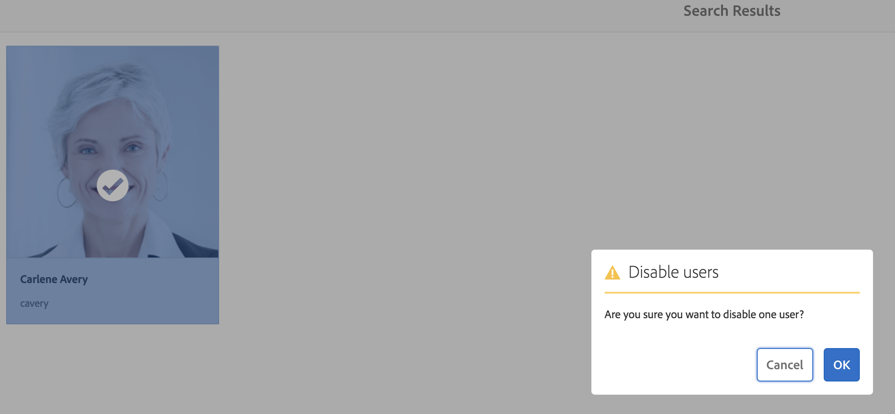
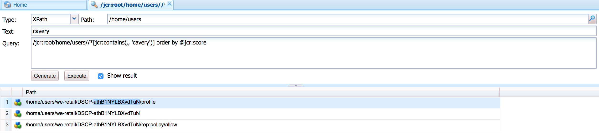

# Hantera GDPR-begäranden för AEM Foundation{#handling-gdpr-requests-for-the-aem-foundation}

>[!IMPORTANT]
>
>GDPR används som exempel i avsnitten nedan, men de ingående detaljerna är tillämpliga på alla dataskydds- och sekretessbestämmelser. såsom GDPR, CCPA osv.

## Stöd för AEM Foundation GDPR {#aem-foundation-gdpr-support}

På AEM Foundation-nivå är de personuppgifter som lagras användarprofilen. Därför handlar informationen i den här artikeln främst om hur du får åtkomst till och tar bort användarprofiler, för att hantera förfrågningar om GDPR-åtkomst respektive -borttagning.

## Åtkomst till en användarprofil {#accessing-a-user-profile}

### Manuella steg {#manual-steps}

1. Öppna konsolen Användaradministration genom att gå till **[!UICONTROL Inställningar - Säkerhet - Användare]** eller genom att bläddra direkt till `https://<serveraddress>:<serverport>/libs/granite/security/content/useradmin.html`

   

1. Sök sedan efter användaren genom att skriva namnet i sökfältet högst upp på sidan:

   

1. Slutligen öppnar du användarprofilen genom att klicka på den och kontrollerar sedan under fliken **[!UICONTROL Detaljer]** .

   

### HTTP-API {#http-api}

Som vi nämnt tillhandahåller Adobe API:er för åtkomst av användardata för att underlätta automatisering. Det finns flera typer av API:er som du kan använda:

**UserProperties API**

```shell
curl -u user:password http://localhost:4502/libs/granite/security/search/profile.userproperties.json\?authId\=cavery
```

**Sling API**

*Identifierar användarens hemsida:*

```xml
curl -g -u user:password 'http://localhost:4502/libs/granite/security/search/authorizables.json?query={"condition":[{"named":"cavery"}]}'
     {"authorizables":[{"type":"user","authorizableId_xss":"cavery","authorizableId":"cavery","name_xss":"Carlene Avery","name":"Carlene Avery","home":"/home/users/we-retail/DSCP-athB1NYLBXvdTuN"}],"total":1}
```

*Hämtar användardata*

Använda nodsökvägen från egenskapen home för JSON-nyttolasten som returneras från ovanstående kommando:

```shell
curl -u user:password  'http://localhost:4502/home/users/we-retail/DSCP-athB1NYLBXvdTuN/profile.-1.json'
```

```shell
curl -u user:password  'http://localhost:4502/home/users/we-retail/DSCP-athB1NYLBXvdTuN/profiles.-1.json'
```

## Inaktivera en användare och ta bort associerade profiler {#disabling-a-user-and-deleting-the-associated-profiles}

### Inaktivera användare {#disable-user}

1. Öppna konsolen för användaradministration och sök efter användaren i fråga enligt beskrivningen ovan.
1. Håll pekaren över användaren och klicka på markeringsikonen. Profilen blir grå vilket anger att den är markerad.

1. Tryck på knappen Inaktivera i den övre menyn för att inaktivera användaren:

   

1. Bekräfta slutligen åtgärden:

   

   Användargränssnittet visar sedan att användaren har inaktiverats genom att klistra ut och lägga till ett lås till profilkortet:

   

### Ta bort användarprofilinformation {#delete-user-profile-information}

1. Logga in på CRXDE Lite och sök efter `[!UICONTROL userId]`:

   

1. Öppna användarnoden som finns under `[!UICONTROL /home/users]` som standard:

   

1. Ta bort profilnoder och alla underordnade noder. Profilnoderna har två format beroende på AEM-versionen:

   1. Standardprofilen under `[!UICONTROL /profile]`
   1. `[!UICONTROL /profiles]`, för nya profiler som skapats med AEM 6.5.
   

### HTTP-API {#http-api-1}

I följande procedurer används kommandoradsverktyget för att illustrera hur du inaktiverar användaren med `curl` kaveriet **** `userId` och tar bort de profiler som finns på standardplatsen.

* *Identifiera användarens hemsida*

```shell
curl -g -u user:password 'http://localhost:4502/libs/granite/security/search/authorizables.json?query={"condition":[{"named":"cavery"}]}'
     {"authorizables":[{"type":"user","authorizableId_xss":"cavery","authorizableId":"cavery","name_xss":"Carlene Avery","name":"Carlene Avery","home":"/home/users/we-retail/DSCP-athB1NYLBXvdTuN"}],"total":1}
```

* *Inaktivera användaren*

Använda nodsökvägen från egenskapen home för JSON-nyttolasten som returneras från ovanstående kommando:

```shell
curl -X POST -u user:password -FdisableUser="describe the reasons for disabling this user (GDPR in this case)" 'http://localhost:4502/home/users/we-retail/DSCP-athB1NYLBXvdTuN.rw.userprops.html'
```

* *Tar bort användarprofiler*

Använd nodsökvägen från egenskapen home för JSON-nyttolasten som returneras från kontoidentifieringskommandot och den kända out-of-box-profilnodplatsen:

```shell
curl -X POST -u user:password -H "Accept: application/json,**/**;q=0.9" -d ':operation=delete' 'http://localhost:4502/home/users/we-retail/DSCP-athB1NYLBXvdTuN/profile'
```

```shell
curl -X POST -u user:password -H "Accept: application/json,**/**;q=0.9" -d ':operation=delete' 'http://localhost:4502/home/users/we-retail/DSCP-athB1NYLBXvdTuN/profile'
```

