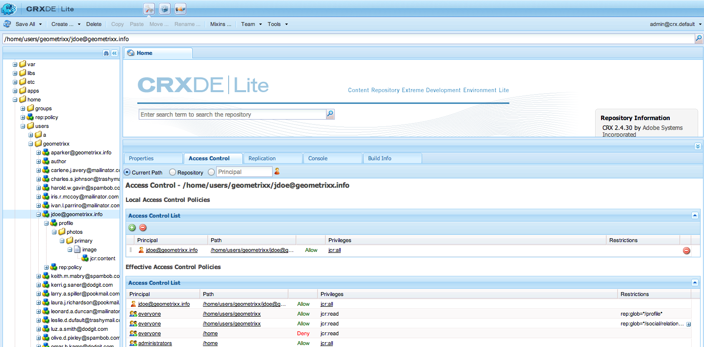
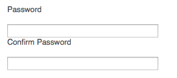

# Identitetshantering{#identity-management}

Enskilda besökare på din webbplats kan bara identifieras när du ger dem möjlighet att logga in. Det finns olika skäl till att du kan behöva ange en inloggningsfunktion:

* [AEM](/help/communities/overview.md)CommunitiesBesökare på webbplatsen måste logga in för att kunna publicera innehåll i communityn.
* [Stängda användargrupper](/help/sites-administering/cug.md)

   Du kan behöva begränsa åtkomsten till din webbplats (eller delar av den) till vissa besökare.

* [Personalisering](/help/sites-administering/personalization.md) Gör det möjligt för besökare att konfigurera vissa aspekter av hur de kommer åt din webbplats.

Funktionen Logga in (och ut) tillhandahålls av ett [konto med en **profil **](#profiles-and-user-accounts)som innehåller ytterligare information om den registrerade besökaren (användaren). De faktiska processerna för registrering och godkännande kan skilja sig åt:

* Självregistrering från webbplatsen

   En [communitywebbplats](/help/communities/sites-console.md) kan konfigureras så att besökare kan registrera sig själva eller logga in med sina Facebook- eller Twitter-konton.

* Registreringsförfrågan från webbplatsen

   För en sluten användargrupp kan du tillåta besökare att begära registrering, men tvinga fram auktorisering via ett arbetsflöde.

* Registrera varje konto från författarmiljön

   Om du har ett litet antal profiler, som ändå behöver behörighet, kan du välja att registrera dem direkt.

För att besökare ska kunna registrera sig kan en serie komponenter och formulär användas för att samla in den nödvändiga identifieringsinformationen, och sedan den extra (ofta valfria) profilinformationen. När de har registrerat sig bör de också kunna kontrollera och uppdatera de uppgifter de har lämnat.

Ytterligare funktioner kan konfigureras eller utvecklas:

* Konfigurera eventuell omvänd replikering som krävs.
* Tillåt att en användare tar bort sin profil genom att utveckla ett formulär tillsammans med ett arbetsflöde.

>[!NOTE]
>
>Den information som anges i profilen kan också användas för att förse användaren med riktat innehåll via [segment](/help/sites-administering/campaign-segmentation.md) och [kampanjer](/help/sites-classic-ui-authoring/classic-personalization-campaigns.md).

## Registreringsformulär {#registration-forms}

Ett [formulär](/help/sites-authoring/default-components.md#form-component) kan användas för att samla in registreringsinformationen och sedan generera det nya kontot och den nya profilen.

Användare kan till exempel begära en ny profil via sidan Geometrixx`http://localhost:4502/content/geometrixx-outdoors/en/user/register.html`


När du skickar begäran öppnas profilsidan där användaren kan ange personlig information.


Det nya kontot visas även i [användarkonsolen](/help/sites-administering/security.md).

## Inloggning {#login}

Inloggningskomponenten kan användas för att samla in inloggningsinformationen och sedan aktivera inloggningsprocessen.

Detta förser besökaren med standardfälten **Användarnamn** och **Lösenord**, med en **inloggningsknapp** som aktiverar inloggningsprocessen när inloggningsuppgifterna anges.

Användare kan till exempel antingen logga in eller skapa ett nytt konto med alternativet **Logga in** i verktygsfältet Geometrixx, som använder sidan:

`http://localhost:4502/content/geometrixx-outdoors/en/user/sign-in.html`


## Loggar ut {#logging-out}

Eftersom det finns en inloggningsmekanism krävs också en utloggningsmekanism. Det här är tillgängligt som alternativet **Logga ut** i Geometrixx.

## Visa och uppdatera en profil {#viewing-and-updating-a-profile}

Beroende på ditt registreringsformulär kan besökaren ha registrerat information i sin profil. De bör kunna visa och/eller uppdatera detta i ett senare skede. Detta kan göras i en liknande form; i Geometrixx:

```
http://localhost:4502/content/geometrixx-outdoors/en/user/profile.html
```

Om du vill se information om din profil klickar du på **Min profil** i det övre högra hörnet på en sida. till exempel med `admin` kontot:
`http://localhost:4502/home/users/a/admin/profile.form.html/content/geometrixx-outdoors/en/user/profile.html.`

Du kan visa en annan profil med hjälp av [klientkontexten](/help/sites-administering/client-context.md) (i författarmiljön och med tillräcklig behörighet):

1. Öppna en sida; till exempel sidan Geometrixx:

   `http://localhost:4502/cf#/content/geometrixx/en.html`

1. Klicka på **Min profil** i det övre högra hörnet. Du ser profilen för ditt aktuella konto; till exempel administratören.
1. Tryck på **control-alt-C** för att öppna klientkontexten.
1. Klicka på knappen **Läs in en profil** i klientkontextens övre vänstra hörn.

   

1. Välj en annan profil i listrutan i dialogrutan. till exempel **Alison Parker**.
1. Click **OK**.
1. Klicka igen på **Min profil**. Formuläret uppdateras med Alisons information.

   

1. Du kan nu använda **Redigera profil** eller **Ändra lösenord** för att uppdatera informationen.

## Lägga till fält i profildefinitionen {#adding-fields-to-the-profile-definition}

Du kan lägga till fält i profildefinitionen. Om du till exempel vill lägga till fältet Favoritfärg i Geometrixx-profilen:

1. Gå till Geometrixx Outdoor Site > English > User > My Profile i webbkonsolen.
1. Dubbelklicka på sidan **Min profil** för att öppna den för redigering.
1. På fliken **Komponenter** i sidosparken expanderar du **formuläravsnittet** .
1. Dra en **listruta** från sidosparken till formuläret, precis nedanför fältet **Om mig** .
1. Dubbelklicka på **listrutekomponenten** för att öppna dialogrutan för konfiguration och ange:

   * **Elementnamn** - `favoriteColor`
   * **Titel** - `Favorite Color`
   * **Objekt** - Lägg till flera färger som objekt
   Spara genom att klicka på **OK** .

1. Stäng sidan och gå tillbaka till **webbplatskonsolen** och aktivera sidan Min profil.

   Nästa gång du visar en profil kan du välja en favoritfärg:

   

   Fältet sparas under **profilavsnittet** för det aktuella användarkontot:

   

## Profiltillstånd {#profile-states}

Det finns ett antal användningsområden som kräver att du vet om en användare (eller snarare deras profil) är i ett *visst läge* eller inte.

Detta innebär att definiera en lämplig egenskap i användarprofilen på följande sätt:

* är synlig och tillgänglig för användaren
* definierar två lägen för varje egenskap
* möjliggör växling mellan de två definierade lägena

Detta görs med:

* [Statliga leverantörer](#state-providers)

   Om du vill hantera de två lägena för en viss egenskap och övergångarna mellan dessa.

* [Arbetsflöden](#workflows)

   Om du vill hantera åtgärder relaterade till lägena.

Flera lägen kan definieras; I Geometrixx är dessa till exempel:

* prenumerera (eller avbryta prenumerationen) på meddelanden i nyhetsbrev eller kommentarstrådar
* lägga till och ta bort en anslutning till en vän

### Statliga leverantörer {#state-providers}

En lägesprovider hanterar den aktuella statusen för den aktuella egenskapen tillsammans med övergångarna mellan de två möjliga lägena.

Statliga leverantörer implementeras som komponenter, så de kan anpassas för ditt projekt. I Geometrixx är dessa:

* Un-/Subscription Forum Topic
* Lägg till/ta bort vän

### Arbetsflöden {#workflows}

Statliga leverantörer hanterar en profilegenskap och dess lägen.

Det behövs ett arbetsflöde för att implementera åtgärder som är relaterade till lägena. När du prenumererar på meddelanden hanterar arbetsflödet till exempel den faktiska prenumerationsåtgärden; När du avbryter prenumerationen på meddelanden kommer arbetsflödet att hantera borttagningen av användaren från prenumerationslistan.

## Profiler och användarkonton {#profiles-and-user-accounts}

Profiler lagras i innehållsdatabasen som en del av[användarkontot](/help/sites-administering/user-group-ac-admin.md).

Profilen finns under `/home/users/geometrixx`:


I en standardinstallation (författare eller publicering) har alla läsåtkomst till all profilinformation för alla användare. Alla är en *inbyggd grupp som automatiskt innehåller alla befintliga användare och grupper. Det går inte att redigera* medlemslistan.&quot;

Dessa åtkomsträttigheter definieras av följande jokertecken-ACL:

/home all allow jcr:read rep:glob = */profile*

Det gör att:

* forum, kommentarer eller blogginlägg för att visa information (t.ex. ikon eller fullständigt namn) från lämplig profil
* länkar till profilsidor för geometrixx

Om sådan åtkomst inte är lämplig för din installation kan du ändra dessa standardinställningar.

Detta kan du göra på fliken **[Åtkomstkontroll](/help/sites-administering/user-group-ac-admin.md#access-right-management)**:



## Profilkomponenter {#profile-components}

Det finns även ett antal profilkomponenter som du kan använda för att definiera profilkraven för din plats.

### Kontrollerat lösenordsfält {#checked-password-field}

Den här komponenten ger dig två fält för:

* inmatning av ett lösenord
* en kontroll som bekräftar att lösenordet har angetts korrekt.

Med standardinställningarna visas komponenten så här:



### Profil Avatar Photo {#profile-avatar-photo}

Den här komponenten ger användaren en funktion för att välja och överföra en Avatar Photo-fil.


### Detaljerat profilnamn {#profile-detailed-name}

Med den här komponenten kan användaren ange ett detaljerat namn.


### Profilkön {#profile-gender}

Med den här komponenten kan användaren ange sitt kön.


