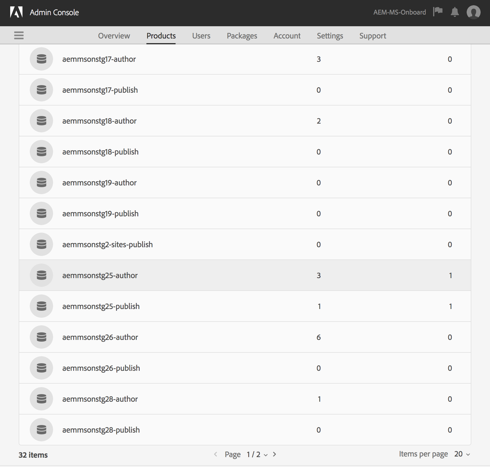

# Adobe IMS-autentisering och [!DNL Admin Console]-stöd för AEM Managed Services {#adobe-ims-authentication-and-admin-console-support-for-aem-managed-services}

>[!NOTE]
>
>Den här funktionen är endast tillgänglig för Adobe Managed Services-kunder.

## Introduktion {#introduction}

I AEM 6.4.3.0 introduceras [!DNL Admin Console]-stöd för AEM och Adobe IMS(Identity Management System)-baserad autentisering för **AEM Managed Services**-kunder.

Om du AEM på [!DNL Admin Console] kan AEM Managed Services-kunder hantera alla Experience Cloud-användare i en konsol. Användare kan tilldelas till produktprofiler som är kopplade till AEM instanser, så att de kan logga in på en viss instans.

## Viktiga högdagrar {#key-highlights}

* Stöd för AEM IMS-autentisering gäller endast AEM författare, administratörer och utvecklare, inte för externa slutanvändare på kundens webbplats, som webbplatsbesökare
* [!DNL Admin Console] representerar AEM Managed Services-kunder som IMS-organisationer och deras instanser som produktkontexter. Kundsystem- och produktadministratörer kan hantera åtkomst till instanser
* AEM Managed Services synkroniserar kundtopologier med [!DNL Admin Console]. Det kommer att finnas en instans AEM Managed Services produktkontext per instans i [!DNL Admin Console].
* Produktprofiler i [!DNL Admin Console] avgör vilka instanser en användare kan komma åt
* Federerad autentisering med kundens egna SAML 2-kompatibla identitetsleverantörer stöds
* Endast Enterprise ID:n eller Federated ID:n (för kunder med enkel inloggning) stöds, inte Adobe ID:n.
* [!DNL User Management] (i Adobe [!DNL Admin Console]) ägs fortfarande av kundadministratörerna.

## Arkitektur {#architecture}

IMS-autentisering fungerar med OAuth-protokollet mellan AEM och Adobe IMS-slutpunkten. När en användare som har en Adobe-identitet har lagts till i IMS kan hen logga in på AEM Managed Services-instanser med IMS-inloggningsuppgifter.

Inloggningsflödet för användaren visas nedan. Användaren omdirigeras till IMS och eventuellt till kund-ID för SSO-validering och omdirigeras sedan tillbaka till AEM.

## Konfigurera {#how-to-set-up}

### Onboarding-organisationer till [!DNL Admin Console] {#onboarding-organizations-to-admin-console}

Kunden måste registrera sig för [!DNL Admin Console] för att kunna använda Adobe IMS för AEM autentisering.

Som ett första steg bör kunden ha en organisation som är etablerad i Adobe IMS. Adobe Enterprise-kunder representeras som IMS-organisationer i [Adobe [!DNL Admin Console]](https://helpx.adobe.com/enterprise/using/admin-console.html).

AEM Managed Services-kunder bör redan ha en organisation etablerad, och som en del av IMS-etableringen kommer kundinstanserna att vara tillgängliga i [!DNL Admin Console] för hantering av användarberättiganden och åtkomst.

Övergången till IMS för användarautentisering är en gemensam åtgärd mellan AMS och kunder, där vart och ett av dem har sina arbetsflöden att slutföra.

När en kund finns som IMS-organisation och AMS har etablerat kunden för IMS är detta en sammanfattning av de konfigurationsarbetsflöden som krävs:

1. Den utsedda systemadministratören får en inbjudan att logga in på [!DNL Admin Console]
1. Anspråksdomänen för systemadministratören som bekräftar domänens ägarskap (i det här exemplet acme.com)
1. Systemadministratören ställer in användarkataloger
1. Systemadministratören konfigurerar identitetsleverantören (IDP) i [!DNL Admin Console] för SSO-installationen.
1. AEM Admin hanterar de lokala grupperna, behörigheterna och behörigheterna som vanligt. Se Användar- och gruppsynkronisering

>[!NOTE]
>
>Mer information om grunderna i Adobe Identity Management, inklusive IDP-konfiguration, finns i artikeln om [Konfigurera identitet och enkel inloggning](https://helpx.adobe.com/enterprise/using/set-up-identity.html).
>
>Mer information om företagsadministration och [!DNL Admin Console] finns i [Välkommen till administratörshandboken för företag och team](https://helpx.adobe.com/enterprise/managing/user-guide.html).

### Onboarding-användare till [!DNL Admin Console] {#onboarding-users-to-the-admin-console}

Det finns tre sätt att introducera användare beroende på kundens storlek och deras önskemål:

1. Skapa användare och grupper manuellt i [!DNL Admin Console]
1. Överföra en CSV-fil med användare
1. Synkronisera användare och grupper från kundens Enterprise Active Directory.

#### Manuell tillägg via användargränssnittet för [!DNL Admin Console] {#manual-addition-through-admin-console-ui}

Användare och grupper kan skapas manuellt i [!DNL Admin Console]-gränssnittet. Den här metoden kan användas om de inte har många användare att hantera. Till exempel färre än 50 AEM användare.

Användare kan också skapas manuellt om kunden redan använder den här metoden för att administrera andra Adobe-produkter som Adobe Analytics, Adobe Target eller Adobe Creative Cloud.

#### Filöverföring i gränssnittet [!DNL Admin Console] {#file-upload-in-the-admin-console-ui}

En CSV-fil kan laddas upp för att användarna ska kunna lägga till flera användare samtidigt:

#### Verktyget för användarsynkronisering {#user-sync-tool}

Med verktyget för användarsynkronisering (UST i korthet) kan företagskunder skapa eller hantera Adobe-användare som använder Active Directory eller andra testade OpenLDAP-katalogtjänster. Målanvändarna är IT-identitetsadministratörer (Enterprise Directory och System Admins) som kan installera och konfigurera verktyget. Verktyget med öppen källkod är anpassbart så att kunderna kan låta en utvecklare ändra det efter sina egna behov.

När användarsynkronisering körs hämtar den en lista över användare från organisationens Active Directory (eller någon annan kompatibel datakälla) och jämför den med listan över användare i [!DNL Admin Console]. Därefter anropas API:t för Adobe [!DNL User Management] så att [!DNL Admin Console] synkroniseras med organisationens katalog. Ändringsflödet är helt enkelt ett sätt. Alla ändringar som görs i [!DNL Admin Console] kommer inte att flyttas ut till katalogen.

Verktyget gör att systemadministratören kan mappa användargrupper i kundens katalog med produktkonfiguration och användargrupper i [!DNL Admin Console], den nya UST-versionen tillåter även att användargrupper i [!DNL Admin Console] skapas dynamiskt.

Om du vill konfigurera användarsynkronisering måste organisationen skapa en uppsättning autentiseringsuppgifter på samma sätt som de använder [[!DNL User Management] API](https://www.adobe.io/apis/cloudplatform/usermanagement/docs/setup.html).

Användarsynkronisering distribueras via Adobe Github-databasen på den här platsen:

[https://github.com/adobe-apiplatform/user-sync.py/releases/latest](https://github.com/adobe-apiplatform/user-sync.py/releases/latest)

Observera att en förhandsversion 2.4RC1 finns tillgänglig med stöd för att skapa dynamiska grupper och finns här: [https://github.com/adobe-apiplatform/user-sync.py/releases/tag/v2.4rc1](https://github.com/adobe-apiplatform/user-sync.py/releases/tag/v2.4rc1)

De viktigaste funktionerna i den här versionen är möjligheten att dynamiskt mappa nya LDAP-grupper för användarmedlemskap i [!DNL Admin Console] och skapa dynamiska användargrupper.

Mer information om de nya gruppfunktionerna finns här:

[https://adobe-apiplatform.github.io/user-sync.py/en/user-manual/advanced_configuration.html#additional-group-options](https://adobe-apiplatform.github.io/user-sync.py/en/user-manual/advanced_configuration.html#additional-group-options)

>[!NOTE]
>
>Mer information finns i:
>
>* [användarsynkroniseringsverktyget - användarsynkronisering i Adobe](https://adobe-apiplatform.github.io/user-sync.py/en/)
>
>* användarsynkroniseringsverktyget måste registreras som Adobe I/O klient-UMAPI enligt proceduren som beskrivs under [Autentisering för API-åtkomst](https://adobe-apiplatform.github.io/umapi-documentation/en/UM_Authentication.html)
>
>* [Adobe Developer Console-dokumentation](https://developer.adobe.com/developer-console/docs/guides/).
>
>* [API-dokumentation för användarhantering](https://adobe-apiplatform.github.io/umapi-documentation/en/).
>

>[!NOTE]
>
>Den AEM IMS-konfigurationen hanteras av Adobe Managed Services team. Kundadministratören kan dock ändra det efter behov (t.ex. Automatiskt gruppmedlemskap eller Gruppmappning). IMS-klienten registreras också av ditt Managed Services-team.

## Använda {#how-to-use}

### Hantera produkter och användaråtkomst i [!DNL Admin Console] {#managing-products-and-user-access-in-admin-console}

När kundens produktadministratör loggar in på [!DNL Admin Console] kommer de att se flera instanser av den AEM Managed Services-produktkontexten enligt nedan:

I det här exemplet har organisationen *AEM-MS-Onboard* 32 instanser som sträcker sig över olika topologier och miljöer som Stage, Prod och så vidare.

Instansinformationen kan kontrolleras för att identifiera instansen:

Under varje produktkontextinstans kommer det att finnas en associerad produktprofil. Den här produktprofilen används för att tilldela användare åtkomst.

Alla användare som läggs till under den här produktprofilen kan logga in på den instansen enligt exemplet nedan:

### Loggar in AEM {#logging-into-aem}

#### Inloggning för lokal administratör {#local-admin-login}

AEM kan fortfarande ha stöd för lokala inloggningar för administratörsanvändare eftersom inloggningsskärmen har ett alternativ för att logga in lokalt:

#### IMS-baserad inloggning {#ims-based-login}

Andra användare kan använda IMS-baserad inloggning när IMS har konfigurerats för instansen. Användaren klickar först på **Logga in med Adobe** enligt nedan:

De dirigeras sedan om till inloggningsskärmen för IMS och anger sina inloggningsuppgifter:

Om en federerad IDP konfigureras under den första konfigurationen av [!DNL Admin Console] kommer användaren att omdirigeras till kund-ID:t för enkel inloggning.

IDP är Okta i exemplet nedan:

När autentiseringen är klar omdirigeras användaren tillbaka till AEM och loggas in:

### Migrerar befintliga användare {#migrating-existing-users}

För befintliga AEM som använder en annan autentiseringsmetod och nu migreras till IMS måste det finnas ett migreringssteg.

Befintliga användare i AEM-databasen (som hämtas lokalt via LDAP eller SAML) kan migreras till IMS som IDP med verktyget för användarmigrering.

Detta verktyg kommer att köras av ditt AMS-team som en del av IMS-etableringen.

### Hantera behörigheter och åtkomstkontrollistor i AEM {#managing-permissions-and-acls-in-aem}

Åtkomstkontroll och behörigheter hanteras även i AEM, vilket kan uppnås genom att användargrupper skiljs från IMS (till exempel AEM-GRP-008 i exemplet nedan) och lokala grupper där behörigheter och åtkomstkontroll definieras. Användargrupperna som synkroniseras från IMS kan tilldelas lokala grupper och ärva behörigheterna.

I exemplet nedan lägger vi till synkroniserade grupper i den lokala gruppen *Dam_Users* som exempel.

Här har en användare också tilldelats ett fåtal grupper i [!DNL Admin Console]. (Användare och grupper kan synkroniseras från LDAP med användarsynkroniseringsverktyget eller skapas lokalt. Se **Onboarding Users (introduktion till[!DNL Admin Console]** tidigare).

>[!NOTE]
>
>Användargrupper synkroniseras bara när användarna loggar in på instansen.

Användaren ingår i följande grupper i IMS:

När användaren loggar in synkroniseras hans/hennes gruppmedlemskap enligt nedan:

I AEM kan användargrupper som synkroniseras från IMS läggas till som medlemmar i befintliga lokala grupper, till exempel DAM-användare.

Som visas nedan ärver gruppen *AEM-GRP_008* DAM-användares behörigheter och behörigheter. Detta är ett effektivt sätt att hantera behörigheter för synkroniserade grupper och används ofta även i LDAP-baserade autentiseringsmetoder.

