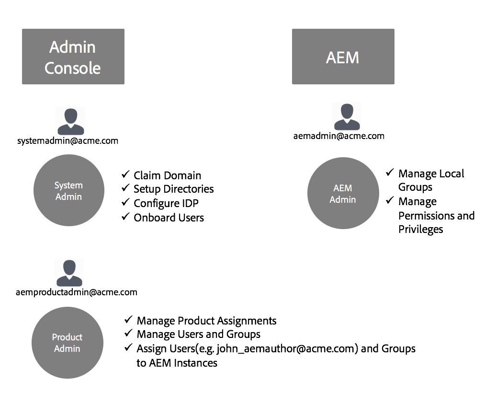

# Adobe IMS-autentisering och - [!DNL Admin Console] support för AEM Managed Services {#adobe-ims-authentication-and-admin-console-support-for-aem-managed-services}

>[!NOTE]
>
>Observera att den här funktionen endast är tillgänglig för Adobe Managed Services-kunder.

## Introduktion {#introduction}

AEM 6.4.3.0 introducerar stöd [!DNL Admin Console] för AEM-instanser och Adobe IMS-baserad autentisering (Identity Management System) för kunder som använder **AEM Managed Services** .

AEM-introduktion till Adobe ger kunder med hanterade tjänster [!DNL Admin Console] från AEM möjlighet att hantera alla Experience Cloud-användare i en konsol. Användare och grupper kan tilldelas till produktprofiler som är kopplade till AEM-instanser, så att de kan logga in på en viss instans.

## Viktiga funktioner {#key-highlights}

* Stöd för AEM IMS-autentisering gäller endast för AEM-författare, administratörer och utvecklare, inte för externa slutanvändare på kundens webbplats, som webbplatsbesökare
* Dessa [!DNL Admin Console] representerar kunder som använder AEM Managed Services som IMS-organisationer och deras instanser som produktkontexter. Kundsystem- och produktadministratörer kan hantera åtkomst till instanser
* AEM Managed Services kommer att synkronisera kundtopologier med [!DNL Admin Console]. Det kommer att finnas en instans av AEM Managed Services Product Context per instans i [!DNL Admin Console].
* Product Profiles in [!DNL Admin Console] will determine which instances a user can access
* Federerad autentisering med kundens egna SAML 2-kompatibla identitetsleverantörer stöds
* Endast Enterprise ID:n eller Federated ID:n (för kunder med enkel inloggning) stöds, inte personliga Adobe ID:n.
* [!DNL User Management](i Adobe [!DNL Admin Console]) ägs även i fortsättningen av kundadministratörer.

## Arkitektur {#architecture}

IMS-autentisering fungerar med OAuth-protokollet mellan AEM och Adobe IMS-slutpunkten. När en användare som har en Adobe-identitet har lagts till i IMS kan hen logga in på AEM Managed Services-instanser med IMS-inloggningsuppgifter.

Inloggningsflödet för användaren visas nedan. Användaren omdirigeras till IMS och eventuellt till kund-ID för SSO-validering och omdirigeras sedan tillbaka till AEM.

## How To Set Up {#how-to-set-up}

### Onboarding Organizations to [!DNL Admin Console] {#onboarding-organizations-to-admin-console}

The customer onboarding to [!DNL Admin Console] is a pre-requisite to using Adobe IMS for AEM authentication.

Som ett första steg bör kunden ha en organisation som är etablerad i Adobe IMS. Adobe Enterprise-kunder representeras som IMS-organisationer i [Adobe [!DNL Admin Console]](https://helpx.adobe.com/enterprise/using/admin-console.html).

AEM Managed Services customers should already have an organization provisioned, and as part of the IMS provisioning, the customer instances will be made available in the [!DNL Admin Console] for managing user entitlements and access.

Övergången till IMS för användarautentisering är en gemensam åtgärd mellan AMS och kunder, där vart och ett av dem har sina arbetsflöden att slutföra.

När en kund finns som IMS-organisation och AMS har etablerat kunden för IMS är detta en sammanfattning av de konfigurationsarbetsflöden som krävs:

1. The designated System Admin receives an invite to log in to the [!DNL Admin Console]
1. Anspråksdomänen för systemadministratören som bekräftar ägarskapet för domänen (i det här exemplet acme.com)
1. Systemadministratören ställer in användarkataloger
1. Systemadministratören konfigurerar identitetsleverantören (IDP) i inställningarna [!DNL Admin Console] för enkel inloggning.
1. AEM Admin hanterar de lokala grupperna, behörigheterna och behörigheterna som vanligt. Se Användar- och gruppsynkronisering

>[!NOTE]
>
>Mer information om grunderna i Adobe Identity Management Basics, inklusive IDP-konfiguration, finns i artikeln på [den här sidan.](https://helpx.adobe.com/enterprise/using/set-up-identity.html)
>
>Mer information om Enterprise Administration finns i artikeln [!DNL Admin Console] här .

### Onboarding-användare till [!DNL Admin Console]{#onboarding-users-to-the-admin-console}

Det finns tre sätt att introducera användare beroende på kundens storlek och deras önskemål:

1. Skapa användare och grupper manuellt i [!DNL Admin Console]
1. Överföra en CSV-fil med användare
1. Synkronisera användare och grupper från kundens Enterprise Active Directory.

#### Manual Addition through [!DNL Admin Console] UI {#manual-addition-through-admin-console-ui}

Users and Groups can be manually created in the [!DNL Admin Console] UI. Den här metoden kan användas om de inte har ett stort antal användare att hantera. Ett antal färre än 50 AEM-användare.

Användarna kan också skapas manuellt om kunden redan använder den här metoden för att administrera andra Adobe-produkter som Analytics, Target eller Creative Cloud.

#### Filöverföring i [!DNL Admin Console] användargränssnittet {#file-upload-in-the-admin-console-ui}

En CSV-fil kan laddas upp för att användarna ska kunna lägga till flera användare samtidigt:

#### Verktyg för användarsynkronisering {#user-sync-tool}

Med verktyget för användarsynkronisering (UST i korthet) kan företagskunder skapa eller hantera Adobe-användare med hjälp av Active Directory eller andra testade OpenLDAP-katalogtjänster. Målanvändarna är IT-identitetsadministratörer (Enterprise Directory och System Admins) som kan installera och konfigurera verktyget. Verktyget med öppen källkod är anpassbart så att kunderna kan låta en utvecklare ändra det efter sina egna behov.

When User Sync runs, it fetches a list of users from the organization’s Active Directory (or any other compatible data source) and compares it with the list of users within the [!DNL Admin Console]. It then calls the Adobe [!DNL User Management] API so that the [!DNL Admin Console] is synchronized with the organization’s directory. Förändringarna är helt envägs. Ändringar som görs i katalogen [!DNL Admin Console] skickas inte ut till katalogen.

Verktyget gör att systemadministratören kan mappa användargrupper i kundens katalog med produktkonfiguration och användargrupper i [!DNL Admin Console]den nya UST-versionen, vilket även gör att det går att dynamiskt skapa användargrupper i [!DNL Admin Console].

To set up User Sync, the organization needs to create a set of credentials in the same way they would use the [[!DNL User Management] API](https://www.adobe.io/apis/cloudplatform/usermanagement/docs/setup.html).

Användarsynkronisering distribueras via Adobe Github-databasen på den här platsen:

[https://github.com/adobe-apiplatform/user-sync.py/releases/latest](https://github.com/adobe-apiplatform/user-sync.py/releases/latest)

Observera att en förhandsversion 2.4RC1 finns tillgänglig med stöd för att skapa dynamiska grupper och finns här: [https://github.com/adobe-apiplatform/user-sync.py/releases/tag/v2.4rc1](https://github.com/adobe-apiplatform/user-sync.py/releases/tag/v2.4rc1)

The major features for this release are the ability to dynamically map new LDAP groups for user membership in the [!DNL Admin Console], as well as dynamic user group creation.

Mer information om de nya gruppfunktionerna finns här:

[https://github.com/adobe-apiplatform/user-sync.py/blob/v2/docs/en/user-manual/advanced_configuration](https://github.com/adobe-apiplatform/user-sync.py/blob/v2/docs/en/user-manual/advanced_configuration.md#additional-group-options)

>[!NOTE]
>
>Mer information om verktyget för användarsynkronisering finns på [dokumentationssidan](https://adobe-apiplatform.github.io/user-sync.py/en/).
>
>
>The User Sync Tool needs to register as an Adobe I/O client UMAPI using the procedure described [here](https://adobe-apiplatform.github.io/umapi-documentation/en/UM_Authentication.html).
>
>The Adobe I/O Console Documentation can be found [here](https://www.adobe.io/apis/cloudplatform/console.html).
>
>
>API:t som [!DNL User Management] används av verktyget för användarsynkronisering beskrivs på den här [platsen](https://www.adobe.io/apis/cloudplatform/umapi-new.html).

>[!NOTE]
>
>AEM IMS-konfigurationen hanteras av Adobe Managed Services-teamet. Kundadministratören kan dock ändra det efter behov (till exempel automatiskt gruppmedlemskap eller gruppmappning). IMS-klienten registreras även av ditt Managed Services-team.

## Användning {#how-to-use}

### Managing Products and User Access in [!DNL Admin Console] {#managing-products-and-user-access-in-admin-console}

When the customer Product Administrator logs in to [!DNL Admin Console], they will see multiple instances of the AEM Managed Services Product Context as shown below:

In this example, the org *AEM-MS-Onboard* has 32 instances spanning different topologies and environments like Stage, Prod, etc.

Instansinformationen kan kontrolleras för att identifiera instansen:

Under varje produktkontextinstans kommer det att finnas en associerad produktprofil. Den här produktprofilen används för att tilldela användare och grupper åtkomst.

Alla användare och grupper som läggs till under den här produktprofilen kan logga in på den instansen enligt exemplet nedan:

### Loggar in på AEM {#logging-into-aem}

#### Inloggning för lokal administratör {#local-admin-login}

AEM kan fortsätta att ha stöd för lokala inloggningar för Admin-användare eftersom inloggningsskärmen har ett alternativ för att logga in lokalt:

#### IMS-baserad inloggning {#ims-based-login}

Andra användare kan använda IMS-baserad inloggning när IMS har konfigurerats för instansen. The user will first click on the **Sign in with Adobe** button as shown below:

De dirigeras sedan till inloggningsskärmen för IMS och anger sina inloggningsuppgifter:

If a federated IDP is configured during initial [!DNL Admin Console] setup, then the user will be redirected to the customer IDP for SSO.

IDP är Okta i följande exempel:

När autentiseringen är klar omdirigeras användaren tillbaka till AEM och loggas in:

### Migrerar befintliga användare {#migrating-existing-users}

För befintliga AEM-instanser som använder en annan autentiseringsmetod och nu migreras till IMS måste det finnas ett migreringssteg.

Befintliga användare i AEM-databasen (som hämtas lokalt via LDAP eller SAML) kan migreras till IMS som IDP med verktyget för användarmigrering.

Detta verktyg kommer att köras av ditt AMS-team som en del av IMS-etableringen.

### Hantera behörigheter och åtkomstkontrollistor i AEM {#managing-permissions-and-acls-in-aem}

Åtkomstkontroll och behörigheter hanteras även i fortsättningen i AEM, vilket kan uppnås genom att användargrupper skiljs från IMS (t.ex. AEM-GRP-008 i exemplet nedan) och lokala grupper där behörigheter och åtkomstkontroll definieras. Användargrupperna som synkroniseras från IMS kan tilldelas lokala grupper och ärva behörigheterna.

I exemplet nedan lägger vi till synkroniserade grupper i den lokala gruppen *Dam_Users* som exempel.

Här har en användare också tilldelats ett fåtal grupper i [!DNL Admin Console]. (Observera att användare och grupper kan synkroniseras från LDAP med användarsynkroniseringsverktyget eller skapas lokalt, se avsnittet **Onboarding Users (Onboarding Users)[!DNL Admin Console]**ovan).

&amp;ast;Observera att användargrupper endast synkroniseras när användarna loggar in på instansen. För kunder som har ett stort antal användare och grupper kan ett gruppsynkroniseringsverktyg köras av AMS för att hämta grupper i förväg för åtkomstkontroll och behörighetshantering som beskrivs ovan.

Användaren ingår i följande grupper i IMS:

När användaren loggar in synkroniseras hans/hennes gruppmedlemskap enligt nedan:

I AEM kan användargrupper som synkroniseras från IMS läggas till som medlemmar i befintliga lokala grupper, t.ex. DAM-användare.

Som framgår nedan ärver gruppen *AEM-GRP_008* DAM-användares behörigheter. Detta är ett effektivt sätt att hantera behörigheter för synkroniserade grupper och används ofta även i LDAP-baserade autentiseringsmetoder.

