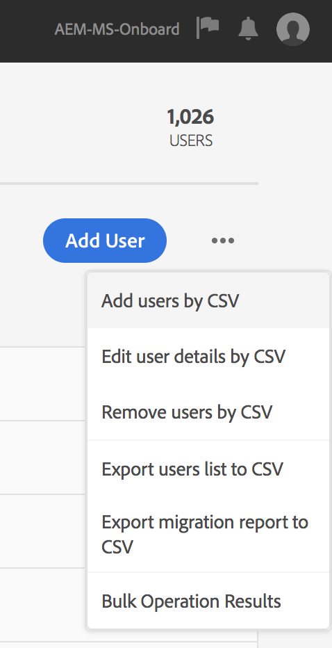

# Adobe IMS-autentisering och stöd för Admin Console för AEM-hanterade tjänster {#adobe-ims-authentication-and-admin-console-support-for-aem-managed-services}

>[!NOTE]
>
>Observera att den här funktionen endast är tillgänglig för Adobe Managed Services-kunder.

## Introduktion {#introduction}

AEM 6.4.3.0 introducerar stöd för Admin Console för AEM-instanser och Adobe IMS-baserad autentisering (Identity Management System) för kunder som använder **AEM Managed Services** .

AEM-introduktion till Admin Console gör att AEM Managed Services-kunder kan hantera alla Experience Cloud-användare i en konsol. Användare och grupper kan tilldelas till produktprofiler som är kopplade till AEM-instanser, så att de kan logga in på en viss instans.

## Viktiga markeringar {#key-highlights}

* Stöd för AEM IMS-autentisering gäller endast för AEM-författare, administratörer och utvecklare, inte för externa slutanvändare på kundens webbplats, som webbplatsbesökare
* Admin Console kommer att representera AEM Managed Services-kunder som IMS-organisationer och deras instanser som produktkontexter. Kundsystem- och produktadministratörer kan hantera åtkomst till instanser
* AEM Managed Services synkroniserar kundtopologier med Admin Console. Det kommer att finnas en instans av AEM Managed Services Product Context per instans i Admin Console.
* Produktprofiler i Admin Console avgör vilka instanser en användare kan komma åt
* Federerad autentisering med kundens egna SAML 2-kompatibla identitetsleverantörer stöds
* Endast Enterprise ID:n eller Federated ID:n (för kunder med enkel inloggning) stöds, inte personliga Adobe ID:n.
* Användarhantering (i Adobe Admin Console) ägs även fortsättningsvis av kundadministratörerna.

## Arkitektur {#architecture}

IMS-autentisering fungerar med OAuth-protokollet mellan AEM och Adobe IMS-slutpunkten. När en användare har lagts till i IMS och har en Adobe-identitet kan han/hon logga in på AEM Managed Services-instanser med IMS-inloggningsuppgifter.

Inloggningsflödet för användaren visas nedan. Användaren omdirigeras till IMS och eventuellt till kund-ID för SSO-validering och omdirigeras sedan tillbaka till AEM.

## Konfigurera {#how-to-set-up}

### Integrering av organisationer i Admin Console {#onboarding-organizations-to-admin-console}

Kunden måste registrera sig på Admin Console för att använda Adobe IMS för AEM-autentisering.

Som ett första steg bör kunden ha en organisation som är etablerad i Adobe IMS. Adobe Enterprise-kunder representeras som IMS-organisationer i [Adobe Admin Console](https://helpx.adobe.com/enterprise/using/admin-console.html).

Kunder med AEM Managed Services bör redan ha en organisation etablerad, och som en del av IMS-etableringen kommer kundinstanser att vara tillgängliga i Admin Console för hantering av användarberättiganden och åtkomst.

Övergången till IMS för användarautentisering är en gemensam åtgärd mellan AMS och kunder, där vart och ett av dem har sina arbetsflöden att slutföra.

När en kund finns som IMS-organisation och AMS har etablerat kunden för IMS är detta en sammanfattning av de konfigurationsarbetsflöden som krävs:

1. Den utsedda systemadministratören får en inbjudan att logga in på Admin Console
1. Anspråksdomänen för systemadministratören som bekräftar ägarskapet för domänen (i det här exemplet acme.com)
1. Systemadministratören ställer in användarkataloger
1. Systemadministratören konfigurerar identitetsleverantören (IDP) i Admin Console för enkel inloggning.
1. AEM Admin hanterar de lokala grupperna, behörigheterna och behörigheterna som vanligt. Se Användar- och gruppsynkronisering

>[!NOTE]
>
>Mer information om grunderna i Adobe Identity Management Basics, inklusive IDP-konfiguration, finns i artikeln på [den här sidan.](https://helpx.adobe.com/enterprise/using/set-up-identity.html)
>
>Mer information om Enterprise Administration och Admin Console finns i artikeln [på den här sidan](https://helpx.adobe.com/enterprise/managing/user-guide.html).

### Onboarding-användare till Admin Console {#onboarding-users-to-the-admin-console}

Det finns tre sätt att introducera användare beroende på kundens storlek och deras önskemål:

1. Skapa användare och grupper manuellt i Admin Console
1. Överföra en CSV-fil med användare
1. Synkronisera användare och grupper från kundens Enterprise Active Directory.

#### Manuellt tillägg via användargränssnittet i Admin Console {#manual-addition-through-admin-console-ui}

Användare och grupper kan skapas manuellt i Admin Console-gränssnittet. Den här metoden kan användas om de inte har ett stort antal användare att hantera. Ett antal färre än 50 AEM-användare.

Användarna kan också skapas manuellt om kunden redan använder den här metoden för att administrera andra Adobe-produkter som Analytics, Target eller Creative Cloud.

#### Filöverföring i Admin Console-gränssnittet {#file-upload-in-the-admin-console-ui}

En CSV-fil kan laddas upp för att användarna ska kunna lägga till flera användare samtidigt:

#### Verktyget för användarsynkronisering {#user-sync-tool}

Med verktyget för användarsynkronisering (UST i korthet) kan företagskunder skapa eller hantera Adobe-användare med hjälp av Active Directory eller andra testade OpenLDAP-katalogtjänster. Målanvändarna är IT-identitetsadministratörer (Enterprise Directory och System Admins) som kan installera och konfigurera verktyget. Verktyget med öppen källkod är anpassbart så att kunderna kan låta en utvecklare ändra det efter sina egna behov.

När användarsynkronisering körs hämtar den en lista över användare från organisationens Active Directory (eller någon annan kompatibel datakälla) och jämför den med listan över användare i Admin Console. Därefter anropas API:t för Adobes användarhantering så att Admin Console synkroniseras med organisationens katalog. Förändringarna är helt envägs. Ändringar som görs i Admin Console skickas inte ut till katalogen.

Verktyget gör att systemadministratören kan mappa användargrupper i kundens katalog med produktkonfiguration och användargrupper i Admin Console. Den nya UST-versionen gör det även möjligt att dynamiskt skapa användargrupper i Admin Console.

För att konfigurera användarsynkronisering måste organisationen skapa en uppsättning autentiseringsuppgifter på samma sätt som de använder API:t för [användarhantering](https://www.adobe.io/apis/cloudplatform/usermanagement/docs/setup.html).

Användarsynkronisering distribueras via Adobe Github-databasen på den här platsen:

[https://github.com/adobe-apiplatform/user-sync.py/releases/latest](https://github.com/adobe-apiplatform/user-sync.py/releases/latest)

Observera att en förhandsversion 2.4RC1 finns tillgänglig med stöd för att skapa dynamiska grupper och finns här: [https://github.com/adobe-apiplatform/user-sync.py/releases/tag/v2.4rc1](https://github.com/adobe-apiplatform/user-sync.py/releases/tag/v2.4rc1)

De viktigaste funktionerna i den här versionen är möjligheten att dynamiskt mappa nya LDAP-grupper för användarmedlemskap i Admin Console samt att skapa dynamiska användargrupper.

Mer information om de nya gruppfunktionerna finns här:

[https://github.com/adobe-apiplatform/user-sync.py/blob/v2/docs/en/user-manual/advanced_configuration](https://github.com/adobe-apiplatform/user-sync.py/blob/v2/docs/en/user-manual/advanced_configuration.md#additional-group-options)

>[!NOTE]
>
>Mer information om verktyget för användarsynkronisering finns på [dokumentationssidan](https://adobe-apiplatform.github.io/user-sync.py/en/).
>
>
>Verktyget för användarsynkronisering måste registrera som ett UMAPI för en Adobe I/O-klient enligt den procedur som beskrivs [här](https://adobe-apiplatform.github.io/umapi-documentation/en/UM_Authentication.html).
>
>Adobe I/O Console Documentation finns [här](https://www.adobe.io/apis/cloudplatform/console.html).
>
>
>API:t för användarhantering som används av verktyget för användarsynkronisering beskrivs på den här [platsen](https://www.adobe.io/apis/cloudplatform/umapi-new.html).

>[!NOTE]
>
>AEM IMS-konfigurationen hanteras av Adobe Managed Services-teamet. Kundadministratören kan dock ändra det efter behov (till exempel automatiskt gruppmedlemskap eller gruppmappning). IMS-klienten registreras även av ditt Managed Services-team.

## Så här använder du {#how-to-use}

### Hantera produkter och användaråtkomst i Admin Console {#managing-products-and-user-access-in-admin-console}

När kundens produktadministratör loggar in på Admin Console visas flera instanser av produktkontexten för AEM Managed Services enligt nedan:

I det här exemplet har organisationen *AEM-MS-Onboard* 32 instanser som spänner över olika topologier och miljöer som Stage, Prod osv.

Instansinformationen kan kontrolleras för att identifiera instansen:

Under varje produktkontextinstans kommer det att finnas en associerad produktprofil. Den här produktprofilen används för att tilldela användare och grupper åtkomst.

Alla användare och grupper som läggs till under den här produktprofilen kan logga in på den instansen enligt exemplet nedan:

### Loggar in på AEM {#logging-into-aem}

#### Inloggning för lokal administratör {#local-admin-login}

AEM kan fortsätta att ha stöd för lokala inloggningar för Admin-användare eftersom inloggningsskärmen har ett alternativ för att logga in lokalt:

#### IMS-baserad inloggning {#ims-based-login}

För andra användare kan den IMS-baserade inloggningen användas när IMS har konfigurerats på instansen. Användaren klickar först på knappen **Logga in med Adobe** enligt nedan:

De dirigeras sedan till inloggningsskärmen för IMS och anger sina inloggningsuppgifter:

Om en federerad IDP konfigureras under den första konfigurationen av Admin Console dirigeras användaren om till kund-ID:t för enkel inloggning.

IDP är Okta i följande exempel:

När autentiseringen är klar omdirigeras användaren tillbaka till AEM och loggas in:

### Migrerar befintliga användare {#migrating-existing-users}

För befintliga AEM-instanser som använder en annan autentiseringsmetod och nu migreras till IMS måste det finnas ett migreringssteg.

Befintliga användare i AEM-databasen (som hämtas lokalt via LDAP eller SAML) kan migreras till IMS som IDP med verktyget för användarmigrering.

Detta verktyg kommer att köras av ditt AMS-team som en del av IMS-etableringen.

### Hantera behörigheter och åtkomstkontrollistor i AEM {#managing-permissions-and-acls-in-aem}

Åtkomstkontroll och behörigheter hanteras även i fortsättningen i AEM, vilket kan uppnås genom att användargrupper skiljs från IMS (t.ex. AEM-GRP-008 i exemplet nedan) och lokala grupper där behörigheter och åtkomstkontroll definieras. Användargrupperna som synkroniseras från IMS kan tilldelas lokala grupper och ärva behörigheterna.

I exemplet nedan lägger vi till synkroniserade grupper i den lokala gruppen *Dam_Users* som exempel.

Här har en användare också tilldelats ett fåtal grupper i Admin Console. (Observera att användare och grupper kan synkroniseras från LDAP med användarsynkroniseringsverktyget eller skapas lokalt, se avsnittet **Onboarding Users (Onboarding-användare) till Admin Console** ovan).

&amp;ast;Observera att användargrupper endast synkroniseras när användarna loggar in på instansen. För kunder som har ett stort antal användare och grupper kan ett gruppsynkroniseringsverktyg köras av AMS för att hämta grupper i förväg för åtkomstkontroll och behörighetshantering som beskrivs ovan.

Användaren ingår i följande grupper i IMS:

När användaren loggar in synkroniseras deras gruppmedlemskap enligt nedan:

I AEM kan användargrupper som synkroniseras från IMS läggas till som medlemmar i befintliga lokala grupper, t.ex. DAM-användare.

Som framgår nedan ärver gruppen *AEM-GRP_008* DAM-användares behörigheter. Detta är ett effektivt sätt att hantera behörigheter för synkroniserade grupper och används ofta även i LDAP-baserade autentiseringsmetoder.

