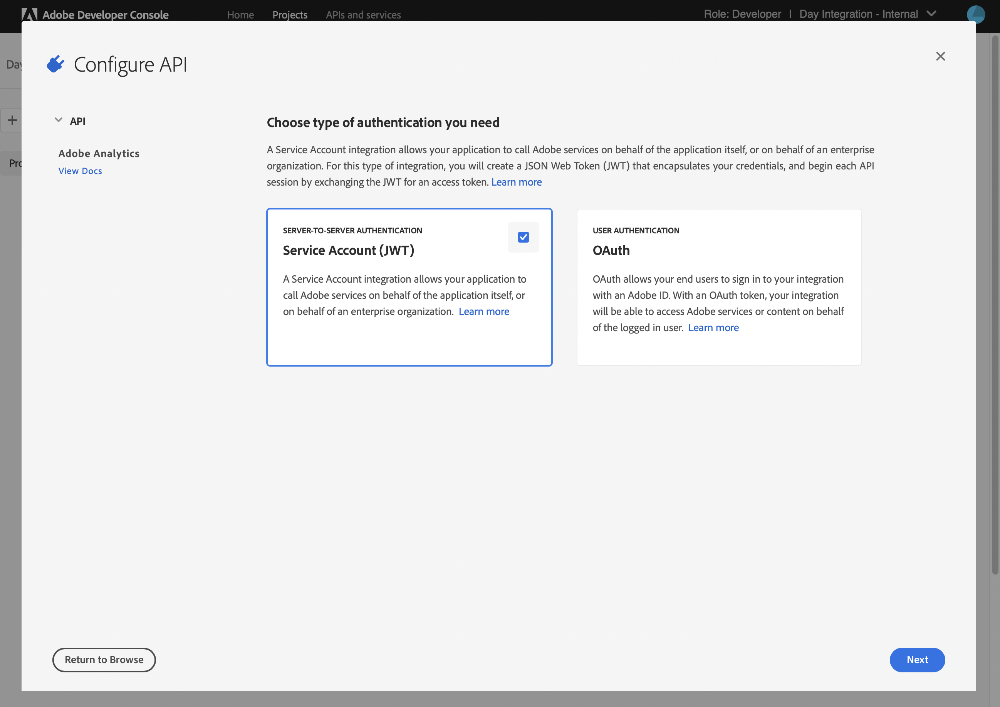

# Integrering med Adobe Analytics med IMS {#integration-with-adobe-analytics-using-ims}

Integreringen av AEM med Adobe Analytics via API:t för Analytics Standard kräver att Adobe IMS (Identity Management System) konfigureras med Adobe Developer Console.

>[!NOTE]
>
>Stöd för Adobe Analytics Standard API 2.0 är nytt i AEM 6.5.12.0. Den här versionen av API:t stöder IMS-autentisering.
>
>För bakåtkompatibilitet stöds fortfarande Adobe Analytics Classic API 1.4 i AEM. The [API:t för Analytics Classic använder autentisering av användarautentiseringsuppgifter](/help/sites-administering/adobeanalytics-connect.md).
>
>API-valet styrs av den autentiseringsmetod som används för AEM-/Analytics-integrering.
>
>Ytterligare information finns också tillgänglig under [Migrera till 2.0 API:er](https://developer.adobe.com/analytics-apis/docs/2.0/guides/migration/).

## Förutsättningar {#prerequisites}

Innan du börjar med den här proceduren:

* [Stöd för Adobe](https://helpx.adobe.com/se/contact/enterprise-support.ec.html) måste tillhandahålla ditt konto för:

   * Adobe Console
   * Adobe Developer Console
   * Adobe Analytics och
   * Adobe IMS (Identity Management System)

* Din organisations systemadministratör bör använda Admin Console för att lägga till de utvecklare som behövs i organisationen till de relevanta produktprofilerna.

   * Detta ger specifika utvecklare behörighet att aktivera integreringar i Adobe Developer Console.
   * Mer information finns i [Hantera utvecklare](https://helpx.adobe.com/enterprise/admin-guide.html/enterprise/using/manage-developers.ug.html).

## Konfigurera en IMS-konfiguration - Generera en offentlig nyckel {#configuring-an-ims-configuration-generating-a-public-key}

Det första steget i konfigurationen är att skapa en IMS-konfiguration i AEM och generera den offentliga nyckeln.

1. Öppna AEM **verktyg** -menyn.
1. I **Säkerhet** avsnittsmarkera **Adobe IMS-konfigurationer**.
1. Välj **Skapa** för att öppna **Adobe IMS Technical Account Configuration**.
1. Använda listrutan under **Molnkonfiguration**, markera **Adobe Analytics**.
1. Aktivera **Skapa nytt certifikat** och ange ett nytt alias.
1. Bekräfta med **Skapa certifikat**.

   

1. Välj **Hämta** (eller **Hämta offentlig nyckel**) för att hämta filen till den lokala hårddisken, så att den är klar att användas när [konfigurera IMS för Adobe Analytics-integrering med AEM](#configuring-ims-for-adobe-analytics-integration-with-aem).

   >[!CAUTION]
   >
   >Låt konfigurationen vara öppen, den behövs igen när [Slutför IMS-konfigurationen i AEM](#completing-the-ims-configuration-in-aem).

   

## Konfigurera IMS för Adobe Analytics-integrering med AEM {#configuring-ims-for-adobe-analytics-integration-with-aem}

Med Adobe Developer Console måste du skapa ett projekt (integration) med Adobe Analytics (för AEM) och sedan tilldela de behörigheter som krävs.

### Skapa projektet {#creating-the-project}

Öppna Adobe Developer Console och skapa ett projekt med Adobe Analytics som AEM ska använda:

1. Öppna Adobe Developer Console for Projects:

   [https://developer.adobe.com/console/projects](https://developer.adobe.com/console/projects)

1. Alla projekt du har visas. Välj **Skapa nytt projekt** - platsen och användningen beror på:

   * Om du inte har något projekt än **Skapa nytt projekt** kommer att vara i mitten, nederst.
      
   * Om du redan har befintliga projekt listas dessa och **Skapa nytt projekt** kommer att vara överst till höger.
      

1. Välj **Lägg till i projekt** följt av **API**:

   

1. Välj **Adobe Analytics** sedan **Nästa**:

   >[!NOTE]
   >
   >Om du prenumererar på Adobe Analytics, men inte ser det i listan, bör du kontrollera [Förutsättningar](#prerequisites).

   

1. Välj **Tjänstkonto (JWT)** som typ av autentisering fortsätter du med **Nästa**:

   

1. **Överför din offentliga nyckel** och när det är klart fortsätter du med **Nästa**:

   

1. Granska inloggningsuppgifterna och fortsätt med **Nästa**:

   

1. Välj önskade produktprofiler och fortsätt med **Spara konfigurerat API**:

   

1. Konfigurationen kommer att bekräftas.

### Tilldela behörigheter till integreringen {#assigning-privileges-to-the-integration}

Du måste nu tilldela nödvändig behörighet till integreringen:

1. Öppna Adobe **Admin Console**:

   * [https://adminconsole.adobe.com](https://adminconsole.adobe.com/)

1. Navigera till **Produkter** (övre verktygsfältet) och sedan välja **Adobe Analytics - &lt;*din-tenant-id*>** (från den vänstra panelen).
1. Välj **Produktprofiler** och sedan den arbetsyta du behöver i den lista som visas. Exempel: Standardarbetsyta.
1. Välj **API-autentiseringsuppgifter** och sedan den integreringskonfiguration som krävs.
1. Välj **Redigerare** som **Produktroll**; i stället för **Observer**.

## Information lagrad för Adobe Developer Console Integration Project {#details-stored-for-the-ims-integration-project}

På Adobe Developer Projects-konsolen ser du en lista över alla dina integrationsprojekt:

* [https://developer.adobe.com/console/projects](https://developer.adobe.com/console/projects)

Välj en specifik projektpost om du vill visa mer information om konfigurationen. Bland dessa finns:

* Projektöversikt
* Insikter
* Autentiseringsuppgifter
   * Tjänstkonto (JWT)
      * Information om autentiseringsuppgifter
      * Generera JWT
* APIS
   * Exempel: Adobe Analytics

Några av dessa behöver du för att slutföra integreringen av Adobe Analytics i AEM.

## Slutför IMS-konfigurationen i AEM {#completing-the-ims-configuration-in-aem}

Om du går tillbaka till AEM kan du slutföra IMS-konfigurationen genom att lägga till obligatoriska värden från integrationsprojektet för Analytics:

1. Återgå till [IMS-konfiguration öppnas i AEM](#configuring-an-ims-configuration-generating-a-public-key).
1. Välj **Nästa**.

1. Här kan du använda [Information lagrad för Adobe Developer Console Integration Project](#details-stored-for-the-ims-integration-project):

   * **Titel**: Din text.
   * **Auktoriseringsserver**: Kopiera/klistra in detta från `aud` rad i **Nyttolast** avsnitt nedan, t.ex. `https://ims-na1.adobelogin.com` i exemplet nedan
   * **API-nyckel**: Kopiera detta från **Autentiseringsuppgifter** i [Projektöversikt](#details-stored-for-the-ims-integration-project)
   * **Klienthemlighet**: Generera detta i [Fliken Klienthemlighet i avsnittet Tjänstkonto (JWT)](#details-stored-for-the-ims-integration-project)och kopiera
   * **Nyttolast**: Kopiera detta från [Generera JWT-flik i avsnittet Tjänstkonto (JWT)](#details-stored-for-the-ims-integration-project)

   

1. Bekräfta med **Skapa**.

1. Din Adobe Analytics-konfiguration visas i AEM.

   

## Bekräfta IMS-konfigurationen {#confirming-the-ims-configuration}

Så här bekräftar du att konfigurationen fungerar som förväntat:

1. Öppna:

   * `https://localhost<port>/libs/cq/adobeims-configuration/content/configurations.html`

   Till exempel:

   * `https://localhost:4502/libs/cq/adobeims-configuration/content/configurations.html`

1. Välj din konfiguration.
1. Välj **Kontrollera hälsa** i verktygsfältet, följt av **Kontrollera**.

   

1. Om du lyckas visas ett bekräftelsemeddelande.

## Konfigurera Adobe Analytics Cloud-tjänsten {#configuring-the-adobe-analytics-cloud-service}

Det går nu att referera till konfigurationen för en Cloud Service som använder API:t för Analytics Standard:

1. Öppna **verktyg** -menyn. Sedan, i **Cloud Services** avsnitt, markera **Äldre Cloud Services**.
1. Bläddra nedåt till **Adobe Analytics** och markera **Konfigurera nu**.

   The **Skapa konfiguration** öppnas.

1. Ange **Titel** och, om du vill, en **Namn** (Om inget anges genereras detta från titeln).

   Du kan också välja önskad mall (om fler än en är tillgänglig).

1. Bekräfta med **Skapa**.

   The **Redigera komponent** öppnas.

1. Ange informationen i dialogrutan **Analysinställningar** tab:

   * **Autentisering**: IMS

   * **IMS-konfiguration**: välj namnet på IMS-konfigurationen

1. Klicka **Anslut till Analytics** för att initiera anslutningen till Adobe Analytics.

   Om anslutningen lyckas visas meddelandet **Anslutningen lyckades** visas.

1. Välj **OK** i meddelandet.

1. Fyll i andra parametrar efter behov, följt av **OK** i dialogrutan för att bekräfta konfigurationen.

1. Du kan nu fortsätta till [Lägga till ett analysramverk](/help/sites-administering/adobeanalytics-connect.md) för att konfigurera parametrar som ska skickas till Adobe Analytics.
