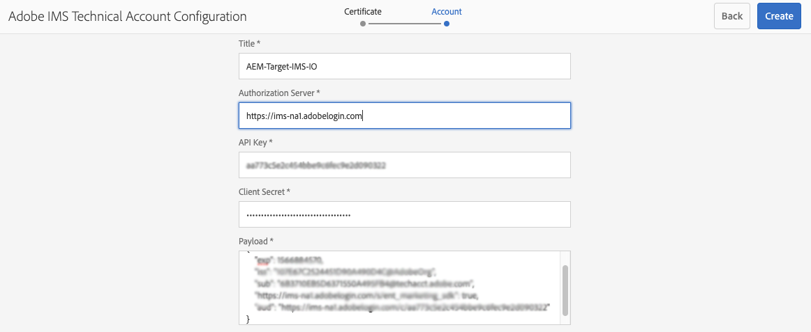

# Integrering med Adobe Target med Adobe I/O{#integration-with-adobe-target-using-adobe-i-o}

Integreringen av AEM med Adobe Target via Target Standard API kräver att du konfigurerar Adobe IMS (Identity Management System) och Adobe I/O.

>[!NOTE]
>
>Stöd för Adobe Target Standard API är nytt i AEM 6.5. Målstandard-API:t använder IMS-autentisering.
>
>Det finns fortfarande stöd för att använda Adobe Target Classic API i AEM för bakåtkompatibilitet. I [Target Classic API används inloggningsuppgifter för autentisering](/help/sites-administering/target-configuring.md#manually-integrating-with-adobe-target).
>
>API-valet styrs av den autentiseringsmetod som används för AEM/Target-integrering.
>Se även avsnittet [Klient-ID och Klientkod](#tenant-client).

## Förutsättningar {#prerequisites}

Innan du börjar med den här proceduren:

* [Adobe ](https://helpx.adobe.com/se/contact/enterprise-support.ec.html) Supportmåste tillhandahålla ditt konto för:

   * Adobe Console
   * Adobe I/O
   * Adobe Target och
   * Adobe IMS (Identity Management System)

* Din organisations systemadministratör bör använda Admin Console för att lägga till de utvecklare som behövs i organisationen till de relevanta produktprofilerna.

   * Detta ger specifika utvecklare tillstånd att aktivera integreringar inom Adobe I/O.
   * Mer information finns i [Hantera utvecklare](https://helpx.adobe.com/enterprise/admin-guide.html/enterprise/using/manage-developers.ug.html).

## Konfigurera en IMS-konfiguration - Generera en offentlig nyckel {#configuring-an-ims-configuration-generating-a-public-key}

Det första steget i konfigurationen är att skapa en IMS-konfiguration i AEM och generera den offentliga nyckeln.

1. Öppna menyn **Verktyg** i AEM.
1. I avsnittet **Säkerhet** väljer du **Adobe IMS-konfigurationer**.
1. Välj **Skapa** för att öppna **Adobe IMS Technical Account Configuration**.
1. Använd listrutan under **Molnkonfiguration** och välj **Adobe Target**.
1. Aktivera **Skapa nytt certifikat** och ange ett nytt alias.
1. Bekräfta med **Skapa certifikat**.

   

1. Välj **Hämta** (eller **Hämta offentlig nyckel**) om du vill hämta filen till den lokala enheten, så att den är klar att användas när [du konfigurerar Adobe I/O för Adobe Target-integrering med AEM](#configuring-adobe-i-o-for-adobe-target-integration-with-aem).

   >[!CAUTION]
   >
   >Behåll den här konfigurationen öppen. Den behövs igen när [IMS-konfigurationen i AEM](#completing-the-ims-configuration-in-aem) är klar.

   

## Konfigurera Adobe I/O för Adobe Target-integrering med AEM {#configuring-adobe-i-o-for-adobe-target-integration-with-aem}

Du måste skapa det Adobe I/O-projekt (integrering) med Adobe Target som AEM ska använda och sedan tilldela de behörigheter som krävs.

### Skapa projektet {#creating-the-project}

Öppna konsolen Adobe I/O för att skapa ett I/O-projekt med Adobe Target som AEM ska använda:

>[!NOTE]
>
>Se även självstudiekurserna [Adobe I/O](https://www.adobe.io/apis/experienceplatform/home/tutorials/alltutorials.html).

1. Öppna Adobe I/O-konsolen för projekt:

   [https://console.adobe.io/projects](https://console.adobe.io/projects)

1. Alla projekt du har visas. Välj **Skapa nytt projekt** - platsen och användningen beror på:

   * Om du inte har något projekt ännu är **Skapa nytt projekt** centrerat, nederst.
      
   * Om du redan har befintliga projekt listas dessa och **Skapa nytt projekt** visas högst upp till höger.
      

1. Välj **Lägg till i projekt** följt av **API**:

   

1. Välj **Adobe Target** och sedan **Nästa**:

   >[!NOTE]
   >
   >Om du prenumererar på Adobe Target, men inte ser det i listan, bör du kontrollera [Förutsättningar](#prerequisites).

   

1. **Ladda upp din offentliga nyckel** och fortsätt med  **nästa** när det är klart:

   

1. Granska inloggningsuppgifterna och fortsätt med **Nästa**:

   

1. Välj önskade produktprofiler och fortsätt med **Spara konfigurerad API**:

   >[!NOTE]
   >
   >Vilka produktprofiler som visas beror på om du har:
   >
   >* Adobe Target Standard - endast **Standardarbetsyta** är tillgänglig
   >* Adobe Target Premium - alla tillgängliga arbetsytor listas enligt nedan

   

1. Skapandet bekräftas.

<!--
1. The creation will be confirmed, you can now **Continue to integration details**; these are needed for [Completing the IMS Configuration in AEM](#completing-the-ims-configuration-in-aem).

   
-->

### Tilldela behörigheter till integreringen {#assigning-privileges-to-the-integration}

Du måste nu tilldela nödvändig behörighet till integreringen:

1. Öppna Adobe **Admin Console**:

   * [https://adminconsole.adobe.com](https://adminconsole.adobe.com/)

1. Gå till **Produkter** (övre verktygsfältet) och välj sedan **Adobe Target - &lt;*din-tenant-id*>** (från den vänstra panelen).
1. Välj **Produktprofiler** och sedan önskad arbetsyta i listan. Exempel: Standardarbetsyta.
1. Välj **Integrationer** och sedan den integreringskonfiguration som krävs.
1. Välj **redigerare** som **produktroll**; i stället för **Observer**.

## Information lagrad för Adobe I/O-integreringsprojektet {#details-stored-for-the-adobe-io-integration-project}

På projektkonsolen i Adobe I/O kan du se en lista över alla dina integrationsprojekt:

* [https://console.adobe.io/projects](https://console.adobe.io/projects)

Välj **Visa** (till höger om en viss projektpost) om du vill visa mer information om konfigurationen. Bland dessa finns:

* Projektöversikt
* Insikter
* Autentiseringsuppgifter
   * Tjänstkonto (JWT)
      * Information om autentiseringsuppgifter
      * Generera JWT
* APIS
   * Exempel: Adobe Target

Vissa av dessa behöver du för att slutföra integreringen av Target i AEM med Adobe I/O.

## Slutför IMS-konfigurationen i AEM {#completing-the-ims-configuration-in-aem}

Om du går tillbaka till AEM kan du slutföra IMS-konfigurationen genom att lägga till obligatoriska värden från Adobe I/O-integreringen för Target:

1. Återgå till den [IMS-konfiguration som är öppen i AEM](#configuring-an-ims-configuration-generating-a-public-key).
1. Välj **Nästa**.

1. Här kan du använda [informationen från Adobe I/O](#details-stored-for-the-adobe-io-integration-project):

   * **Titel**: Din text.
   * **Auktoriseringsserver**: Kopiera/klistra in detta från  `"aud"` raden i  **** löneavsnittet nedan, t.ex.  `"https://ims-na1.adobelogin.com"` i exemplet nedan
   * **API-nyckel**: Kopiera detta från   översiktsavsnittet i Adobe I/O-integreringen för Target
   * **Klienthemlighet**: Generera detta i   översiktsavsnittet för Target-integrationen och kopiera
   * **Nyttolast**: Kopiera detta från  [Generate ](#details-stored-for-the-adobe-io-integration-project) JWT-avsnittet i Adobe I/O-integreringen för Target

   

1. Bekräfta med **Skapa**.

1. Din Adobe Target-konfiguration visas i AEM.

   

## Bekräfta IMS-konfigurationen {#confirming-the-ims-configuration}

Så här bekräftar du att konfigurationen fungerar som förväntat:

1. Öppna:

   * `https://localhost<port>/libs/cq/adobeims-configuration/content/configurations.html`

   Till exempel:

   * `https://localhost:4502/libs/cq/adobeims-configuration/content/configurations.html`

1. Välj din konfiguration.
1. Välj **Kontrollera hälsa** i verktygsfältet följt av **Kontrollera**.

   

1. Om det lyckas visas meddelandet:

   

## Konfigurera Adobe Target-Cloud Servicen {#configuring-the-adobe-target-cloud-service}

Det går nu att referera till konfigurationen för en Cloud Service som använder Target Standard API:

1. Öppna menyn **Verktyg**. I avsnittet **Cloud Services** väljer du sedan **Äldre Cloud Services**.
1. Bläddra ned till **Adobe Target** och välj **Konfigurera nu**.

   Dialogrutan **Skapa konfiguration** öppnas.

1. Ange en **titel** och, om du vill, ett **namn** (om du inte anger något kommer detta att genereras från titeln).

   Du kan också välja önskad mall (om fler än en är tillgänglig).

1. Bekräfta med **Skapa**.

   Dialogrutan **Redigera komponent** öppnas.

1. Ange informationen på fliken **Adobe Target Settings**:

   * **Autentisering**: IMS
   * **Klient-ID**: Adobe IMS-klientens ID. Se även avsnittet [Klient-ID och Klientkod](#tenant-client).

      >[!NOTE]
      >
      >För IMS måste det här värdet hämtas från Target. Du kan logga in på Target och extrahera klient-ID:t från URL:en.
      >
      >Om URL:en till exempel är:
      >
      >`https://experience.adobe.com/#/@yourtenantid/target/activities`
      >
      >Sedan använder du `yourtenantid`.
   * **Klientkod**: Se  [Klient-ID och ](#tenant-client) Klientkod.
   * **IMS-konfiguration**: välj namnet på IMS-konfigurationen
   * **API-typ**: REST
   * **A4T Analytics Cloud-konfiguration**: Välj den Analytics-molnkonfiguration som används för målaktivitetsmål och -mått. Du behöver detta om du använder Adobe Analytics som rapportkälla när du skapar innehåll för målgruppsanpassning. Om du inte ser din molnkonfiguration läser du i [Konfigurera A4T Analytics Cloud Configuration](/help/sites-administering/target-configuring.md#configuring-a-t-analytics-cloud-configuration).

   >[!NOTE]
   >Autentisering med användarautentiseringsuppgifter (äldre) fungerar inte med A4T (för både Target och Analytics). Därför bör kunderna använda     IMS-autentisering i stället för autentisering med användarautentiseringsuppgifter.
   * **Använd exakt målgruppsanpassning**: Som standard är den här kryssrutan markerad. Om du väljer det här alternativet väntar molntjänstkonfigurationen på att kontexten ska läsas in innan innehållet läses in. Se följande.
   * **Synkronisera segment från Adobe Target**: Välj det här alternativet om du vill hämta segment som har definierats i Target för att använda dem i AEM. Du måste välja det här alternativet när API-typegenskapen är REST, eftersom infogade segment inte stöds och du alltid måste använda segment från Target. (Observera att den AEM termen segment motsvarar målgruppen.)
   * **Klientbibliotek**: Välj om du vill ha klientbiblioteket AT.js eller mbox.js (utgått).
   * **Använd tagghanteringssystemet för att leverera klientbiblioteket**: Använd DTM (utgått), Adobe Launch eller något annat tagghanteringssystem.
   * **Custom AT.js**: Lämna tomt om du har markerat rutan Tagghantering eller om du vill använda AT.js som standard. Du kan även överföra dina anpassade AT.js. Visas bara om du har valt AT.js.

   >[!NOTE]
   >
   >[Konfigurationen av en Cloud Service för att använda Target Classic-](/help/sites-administering/target-configuring.md#manually-integrating-with-adobe-target) API har tagits bort (fliken Adobe Recommendations Settings används).
1. Klicka på **Anslut till mål** för att initiera anslutningen till Adobe Target.

   Om anslutningen lyckas visas meddelandet **Anslutningen lyckades**.

1. Välj **OK** i meddelandet följt av **OK** i dialogrutan för att bekräfta konfigurationen.
1. Du kan nu fortsätta till [Lägga till ett målramverk](/help/sites-administering/target-configuring.md#adding-a-target-framework) för att konfigurera ContextHub- eller ClientContext-parametrar som ska skickas till Target. Observera att detta kanske inte behövs för att exportera AEM Experience Fragments till Target.

### Klient-ID och klientkod {#tenant-client}

Med [Adobe Experience Manager 6.5.8.0](/help/release-notes/sp-release-notes.md) har fältet Klientkod lagts till i fönstret för målkonfigurationen.

Tänk på följande när du konfigurerar fälten för klient-ID och klientkod:

1. För de flesta kunder är innehavar-ID och klientkod samma. Det innebär att båda fälten innehåller samma information och är identiska. Se till att du anger klient-ID i båda fälten.
2. För äldre syften kan du även ange olika värden i fälten Klient-ID och Klientkod.

I båda fallen ska du tänka på följande:

* Som standard kopieras även klientkoden (om den läggs till först) automatiskt till fältet Klient-ID.
* Du kan ändra standardinställningen för klient-ID.
* Därför kommer serverdelsanropen till Target att baseras på klientens ID och klientsidans anrop till Target kommer att baseras på klientkoden.

Som tidigare nämnts är det första fallet det vanligaste för AEM 6.5. Oavsett vad du väljer bör du kontrollera att både **och**-fälten innehåller rätt information beroende på dina behov.

>[!NOTE]
>
> Om du vill ändra en befintlig målkonfiguration:
>
> 1. Ange klientorganisations-ID:t igen.
> 2. Återanslut till mål.
> 3. Spara konfigurationen.

