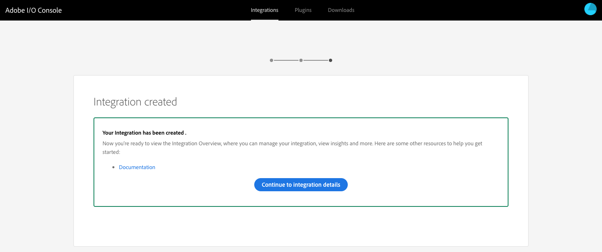

# Integrering med Adobe Target med Adobe I/O{#integration-with-adobe-target-using-adobe-i-o}

Integreringen av AEM med Adobe Target via Target Standard API kräver att Adobe IMS (Identity Management System) och Adobe I/O konfigureras.

>[!NOTE]
>
>Stöd för Adobe Target Standard API är nytt i AEM 6.5. Målstandard-API:t använder IMS-autentisering.
>
>Det går fortfarande att använda Adobe Target Classic-API:t i AEM för bakåtkompatibilitet. API:t för [Target Classic använder autentisering](/help/sites-administering/target-configuring.md#manually-integrating-with-adobe-target)av användarautentiseringsuppgifter.
>
>API-valet styrs av den autentiseringsmetod som används för AEM/Target-integrering.

## Förutsättningar {#prerequisites}

Innan du börjar med proceduren måste [Adobe Support](https://helpx.adobe.com/contact/enterprise-support.ec.html) tillhandahålla ditt konto för:

* Adobe Console
* Adobe I/O
* Adobe Target och
* Adobe IMS (Identity Management System)

## Konfigurera en IMS-konfiguration - Generera en offentlig nyckel {#configuring-an-ims-configuration-generating-a-public-key}

Det första steget i konfigurationen är att skapa en IMS-konfiguration i AEM och generera den offentliga nyckeln.

1. Öppna menyn **Verktyg** i AEM.
1. I avsnittet **Säkerhet** väljer du **Adobe IMS-konfigurationer**.
1. Välj **Skapa** för att öppna **Adobe IMS Technical Account Configuration**.
1. Välj **Adobe Target** i listrutan under **Cloud Configuration**.
1. Aktivera **Skapa nytt certifikat** och ange ett nytt alias.
1. Bekräfta med **Skapa certifikat**.

   

1. Välj **Hämta** (eller **Hämta offentlig nyckel**) om du vill hämta filen till din lokala enhet, så att den är klar att användas när du [konfigurerar Adobe I/O för Adobe Target-integrering med AEM](#configuring-adobe-i-o-for-adobe-target-integration-with-aem).

   >[!CAUTION]
   >
   >Behåll konfigurationen öppen. Den behövs igen när IMS-konfigurationen [slutförs i AEM](#completing-the-ims-configuration-in-aem).

   

## Konfigurera Adobe I/O för Adobe Target-integration med AEM {#configuring-adobe-i-o-for-adobe-target-integration-with-aem}

Du måste skapa den Adobe I/O-integration med Adobe Target som AEM ska använda och sedan tilldela de behörigheter som krävs.

### Skapa integreringen {#creating-the-integration}

Öppna Adobe I/O-konsolen för att skapa en I/O-integrering med Adobe Target som AEM ska använda:

>[!NOTE]
>
>Se även [Adobes I/O-självstudiekurser](https://www.adobe.io/apis/experienceplatform/home/tutorials/alltutorials.html).

1. Öppna Adobe I/O-konsolen för integreringar:

   * [https://console.adobe.io/integrations](https://console.adobe.io/integrations)

1. Välj **Ny integrering**:

   >[!NOTE]
   >
   >Om du redan har befintliga integreringar visas dessa och knappen **Ny integrering** visas överst till höger.

   

1. Välj **Åtkomst till ett API** följt av **Fortsätt**:

   

1. Välj **Adobe Target** och sedan **Continue**:

   

1. Lägg till nödvändig information för integreringskonfigurationen:

   * **Namn**

      Ange namnet.

   * **Beskrivning**

      En beskrivning är valfri.

   * **Offentligt nyckelcertifikat**

      Ladda upp filen med den offentliga nyckeln; som genererats under [Konfigurera en IMS-konfiguration - Generera en offentlig nyckel](#configuring-an-ims-configuration-generating-a-public-key).

      När certifikatet har lästs in visas det under **Certifikat**.

   * **Produktprofiler**

      Produktprofiler motsvarar arbetsytor i Target som AEM kan använda för innehållsexport och skapande av erbjudanden. Som standard är standardarbetsytan Mål markerad. Välj andra profiler/arbetsytor som ska visas i AEM som exportmål.
   Exempel:

   

1. Bekräfta med **Create-integrering**.
1. Skapandet kommer att bekräftas. Nu kan du **fortsätta med integreringsinformationen**; dessa behövs för att [slutföra IMS-konfigurationen i AEM](#completing-the-ims-configuration-in-aem).

   

### Tilldela behörigheter till integreringen {#assigning-privileges-to-the-integration}

Du måste nu tilldela nödvändig behörighet till integreringen:

1. Öppna Adobe **Admin Console**:

   * [https://adminconsole.adobe.com](https://adminconsole.adobe.com/)

1. Gå till **Produkter** (det övre verktygsfältet) och välj sedan **Adobe Target - &lt;*your-tenant-id*>** (från den vänstra panelen).
1. Välj **Produktprofiler** och välj sedan önskad arbetsyta i listan. Exempel: Standardarbetsyta.
1. Välj **Integrationer** och sedan den integreringskonfiguration som krävs.
1. Välj **Redigeraren** som **produktroll**. i stället för **observatör**.

## Information lagrad för Adobe I/O-integrering {#details-stored-for-the-adobe-i-o-integration}

På Adobe I/O-integrationskonsolen kan du se en lista över alla dina integreringar:

* [https://console.adobe.io/integrations](https://console.adobe.io/integrations)

Välj **Visa** (till höger om en viss integrationspost) om du vill visa mer information om konfigurationen. Bland dessa finns:

* Översikt
* Insikter
* Tjänster
* Händelser
* JWT (JSON Web Token)

Vissa av dessa behöver du för att slutföra Adobe I/O-integreringen för Target i AEM.

1. **Översikt**:

   

1. **JWT**:

   

## Slutför IMS-konfigurationen i AEM {#completing-the-ims-configuration-in-aem}

Om du går tillbaka till AEM kan du slutföra IMS-konfigurationen genom att lägga till obligatoriska värden från Adobe I/O-integreringen för Target:

1. Återgå till [IMS-konfigurationen som är öppen i AEM](#configuring-an-ims-configuration-generating-a-public-key).
1. Välj **Nästa**.

1. Här kan du använda [informationen från Adobe I/O](#details-stored-for-the-adobe-i-o-integration):

   * **Titel**: Din text.
   * **Auktoriseringsserver**: Kopiera/klistra in det här från `"aud"` raden i **avsnittet Nyttolast** nedan, t.ex. `"https://ims-na1.adobelogin.com"` i exemplet nedan
   * **API-nyckel**: Kopiera detta från [översiktsavsnittet](#details-stored-for-the-adobe-i-o-integration) i Adobe I/O-integreringen för Target
   * **Klienthemlighet**: Generera detta i [översiktsavsnittet](#details-stored-for-the-adobe-i-o-integration) i Adobe I/O-integreringen för Target, och kopiera
   * **Nyttolast**: Kopiera detta från [JWT](#details-stored-for-the-adobe-i-o-integration) -delen av Adobe I/O-integreringen för Target
   

1. Bekräfta med **Skapa**.

1. Din Adobe Target-konfiguration visas i AEM-konsolen.

   

## Bekräfta IMS-konfigurationen {#confirming-the-ims-configuration}

Så här bekräftar du att konfigurationen fungerar som förväntat:

1. Öppna:

   * `https://localhost<port>/libs/cq/adobeims-configuration/content/configurations.html`
   Exempel:

   * `https://localhost:4502/libs/cq/adobeims-configuration/content/configurations.html`

1. Välj din konfiguration.
1. Välj **Kontrollera hälsa** i verktygsfältet följt av **Kontrollera**.

   

1. Om det lyckas visas meddelandet:

   

## Konfigurera Adobe Target Cloud-tjänsten {#configuring-the-adobe-target-cloud-service}

Det går nu att referera till konfigurationen för en molntjänst så att du kan använda Target Standard API:

1. Öppna **Verktyg** -menyn. Välj sedan **Äldre molntjänster** i avsnittet **Cloud-tjänster**.
1. Bläddra ned till **Adobe Target** och välj **Konfigurera nu**.

   Dialogrutan **Skapa konfiguration** öppnas.

1. Ange en **titel** och, om du vill, ett **namn** (om du inte anger något kommer det att genereras från titeln).

   Du kan också välja önskad mall (om fler än en är tillgänglig).

1. Bekräfta med **Skapa**.

   Dialogrutan **Redigera komponent** öppnas.

1. Ange informationen på fliken **Adobe Target Settings** :

   * **Klientkod**: Klient-ID för Adobe IMS

      >[!CAUTION]
      >
      >Klient-ID:t för Adobe IMS måste anges i fältet Klientkod.

   * **Autentisering**: IMS
   * **IMS-konfiguration**: välj namnet på IMS-konfigurationen
   * **API-typ**: REST
   * **A4T Analytics Cloud Configuration**: Välj den Analytics-molnkonfiguration som används för målaktivitetsmål och -mått. Detta behöver ni om ni använder Adobe Analytics som rapportkälla när ni inriktar er på innehåll. Om du inte ser din molnkonfiguration läser du i [Konfigurera A4T Analytics Cloud Configuration](/help/sites-administering/target-configuring.md#configuring-a-t-analytics-cloud-configuration).
   * **Använd exakt målgruppsanpassning**: Som standard är den här kryssrutan markerad. Om du väljer det här alternativet väntar molntjänstkonfigurationen på att kontexten ska läsas in innan innehållet läses in. Se följande.
   * **Synkronisera segment från Adobe Target**: Välj det här alternativet om du vill hämta segment som är definierade i Target för att använda dem i AEM. Du måste välja det här alternativet när API-typegenskapen är REST, eftersom infogade segment inte stöds och du alltid måste använda segment från Target. (Observera att AEM-termen för segment motsvarar målgruppen.)
   * **Klientbibliotek**: Välj om du vill ha klientbiblioteket AT.js eller mbox.js (utgått).
   * **Använd tagghanteringssystemet för att leverera klientbiblioteket**: Använd DTM (utgått), Adobe Launch eller något annat tagghanteringssystem.
   * **Custom AT.js**: Lämna tomt om du har markerat rutan Tagghantering eller om du vill använda AT.js som standard. Du kan även överföra dina anpassade AT.js. Visas bara om du har valt AT.js.
   >[!NOTE]
   >
   >[Konfigurationen av en molntjänst för att använda Target Classic API](/help/sites-administering/target-configuring.md#manually-integrating-with-adobe-target) är föråldrad (fliken Adobe Recommendations Settings används).

   Exempel:

   

1. Klicka på **Anslut till mål** för att initiera anslutningen till Adobe Target.

   Om anslutningen lyckas visas meddelandet **Anslutningen lyckades** .

1. Välj **OK** i meddelandet, följt av **OK** i dialogrutan för att bekräfta konfigurationen.
1. Du kan nu fortsätta med att [lägga till ett Target Framework](/help/sites-administering/target-configuring.md#adding-a-target-framework) för att konfigurera ContextHub- eller ClientContext-parametrar som ska skickas till Target. Observera att detta kanske inte behövs för att exportera AEM Experience Fragments till Target.

