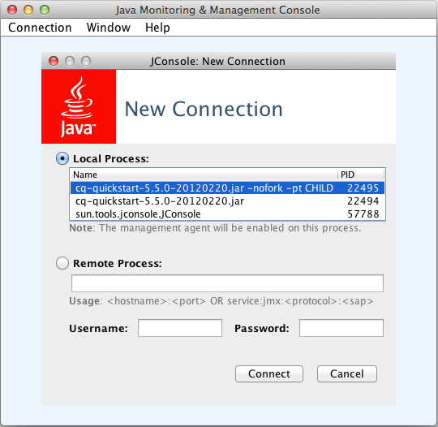
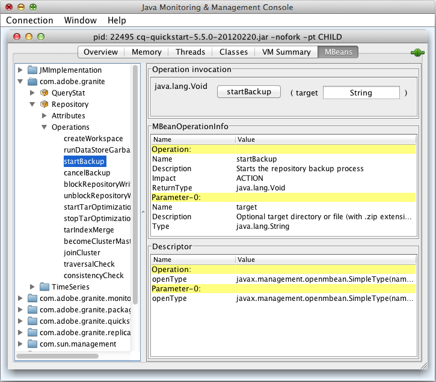

# Övervakningsserverresurser med JMX-konsolen{#monitoring-server-resources-using-the-jmx-console}

Med JMX Console kan du övervaka och hantera tjänster på CRX-servern. De följande avsnitten sammanfattar de attribut och åtgärder som visas via JMX-ramverket.

Mer information om hur du använder konsolkontrollerna finns i [Använda JMX-konsolen](#using-the-jmx-console). Bakgrundsinformation om JMX finns på [Java Management Extensions (JMX) Technology](https://www.oracle.com/technetwork/java/javase/tech/javamanagement-140525.html) page på Oracles webbplats.

Mer information om hur du skapar MBeans för att hantera tjänster med JMX-konsolen finns i [Integrera tjänster med JMX-konsolen](/help/sites-developing/jmx-integration.md).

## Underhåll av arbetsflöden {#workflow-maintenance}

Åtgärder för att administrera instanser av arbetsflöden som körs, har slutförts, inaktuella och misslyckats.

* Domän: com.adobe.granite.workflow
* Typ:Underhåll

>[!NOTE]
>
>I [arbetsflödeskonsolen](/help/sites-administering/workflows-administering.md) finns ytterligare administrationsverktyg för arbetsflöden och beskrivningar av möjliga statusvärden för arbetsflödesinstanser.

### Operationer {#operations}

**listRunningWorkflowsPerModel** Visar antalet arbetsflödesinstanser som körs för varje arbetsflödesmodell.

* Argument: ingen
* Returnerat värde: Tabelldata som innehåller kolumnerna Count och ModelId.

**listCompletedWorkflowsPerModel** Visar antalet slutförda arbetsflödesinstanser för varje arbetsflödesmodell.

* Argument: ingen
* Returnerat värde: Tabelldata som innehåller kolumnerna Count och ModelId.

**returnWorkflowQueueInfo** Visar information om arbetsflödesobjekt som har bearbetats och som står i kö för bearbetning.

* Argument: ingen
* Returnerat värde: Tabelldata som innehåller följande kolumner:

   * Jobb
   * Könamn
   * Aktiva jobb
   * Genomsnittlig bearbetningstid
   * Genomsnittlig väntetid
   * Avbrutna jobb
   * Misslyckade jobb
   * Slutförda jobb
   * Bearbetade jobb
   * Köade jobb

**returnWorkflowJobTopicInfo** Visar bearbetningsinformation för arbetsflödesjobb, ordnade efter ämne.

* Argument: ingen
* Returnerat värde: Tabelldata som innehåller följande kolumner:

   * Ämnesnamn
   * Genomsnittlig bearbetningstid
   * Genomsnittlig väntetid
   * Avbrutna jobb
   * Misslyckade jobb
   * Slutförda jobb
   * Bearbetade jobb

**returnFailedWorkflowCount** Visar antalet misslyckade arbetsflödesinstanser. Du kan ange en arbetsflödesmodell för att fråga efter eller hämta information för alla arbetsflödesmodeller.

* Argument:

   * modell: ID för modellen som ska frågas. Ange inget värde om du vill se antalet misslyckade arbetsflödesinstanser för alla arbetsflödesmodeller. ID är sökvägen till modellnoden, till exempel:

      `/conf/global/settings/workflow/models/dam/update_asset/jcr:content/model`

* Returnerat värde: Antalet misslyckade arbetsflödesinstanser.

**returnFailedWorkflowCountPerModel** Visar antalet arbetsflödesinstanser som har misslyckats för varje arbetsflödesmodell.

* Argument: ingen.
* Returnerat värde: Tabelldata som innehåller kolumnerna Antal och Modell-ID.

**terminateFailedInstances** Avsluta arbetsflödesinstanser som har misslyckats. Du kan avsluta alla misslyckade instanser eller endast de misslyckade instanserna för en viss modell. Du kan också starta om instanserna när de har avslutats. Du kan också testa åtgärden för att se resultaten utan att faktiskt utföra åtgärden.

* Argument:

   * Starta om instansen: (Valfritt) Ange värdet för `true` att starta om instanserna när de har avslutats. Standardvärdet för `false` orsakar ingen omstart av avslutade arbetsflödesinstanser.
   * Torr körning: (Valfritt) Ange ett värde på om du `true` vill visa resultatet av åtgärden utan att utföra åtgärden. Standardvärdet för `false` utför åtgärden.
   * Modell: (Valfritt) ID:t för den modell som åtgärden tillämpas på. Ange ingen modell för att använda åtgärden på misslyckade instanser av alla arbetsflödesmodeller. ID är sökvägen till modellnoden, till exempel:

      `/conf/global/settings/workflow/models/dam/update_asset/jcr:content/model`

* Returnerat värde: Tabelldata om de instanser som avslutas, som innehåller följande kolumner:

   * Initierare
   * InstanceId
   * ModelId
   * Nyttolast
   * StartComment
   * WorkflowTitle

**retryFailedWorkItems** Försöker köra misslyckade arbetsobjektsteg. Du kan försöka göra om alla misslyckade arbetsobjekt eller endast misslyckade arbetsobjekt för en viss arbetsflödesmodell. Du kan också testa åtgärden för att se resultaten utan att faktiskt utföra åtgärden.

* Argument:

   * Torr körning: (Valfritt) Ange ett värde på om du `true` vill visa resultatet av åtgärden utan att utföra åtgärden. Standardvärdet för `false` utför åtgärden.
   * Modell: (Valfritt) ID:t för den modell som åtgärden tillämpas på. Ange ingen modell för att använda åtgärden på misslyckade arbetsobjekt i alla arbetsflödesmodeller. ID är sökvägen till modellnoden, till exempel:

      `/conf/global/settings/workflow/models/dam/update_asset/jcr:content/model`

* Returnerat värde: Tabelldata om misslyckade arbetsobjekt som har provats på nytt, inklusive följande kolumner:

   * Initierare
   * InstanceId
   * ModelId
   * Nyttolast
   * StartComment
   * WorkflowTitle

**RensaAktiv** Tar bort aktiva arbetsflödesinstanser av en viss ålder. Du kan rensa aktiva instanser för alla modeller eller bara instanser för en viss modell. Du kan också testa åtgärden för att se resultaten utan att utföra åtgärden.

* Argument:

   * Modell: (Valfritt) ID:t för den modell som åtgärden tillämpas på. Ange ingen modell för att använda åtgärden på arbetsflödesinstanserna för alla arbetsflödesmodeller. ID är sökvägen till modellnoden, till exempel:

      `/conf/global/settings/workflow/models/dam/update_asset/jcr:content/model`
   * Antal dagar sedan arbetsflödet startades: Åldern på arbetsflödesinstanserna som ska rensas, i dagar.
   * Torr körning: (Valfritt) Ange ett värde på om du `true` vill visa resultatet av åtgärden utan att utföra åtgärden. Standardvärdet för `false` utför åtgärden.

* Returnerat värde: Tabelldata om de aktiva arbetsflödesinstanserna som rensas, inklusive följande kolumner:

   * Initierare
   * InstanceId
   * ModelId
   * Nyttolast
   * StartComment
   * WorkflowTitle

**countStaleWorkflows** Returnerar antalet inaktuella arbetsflödesinstanser. Du kan hämta antalet inaktuella instanser för alla arbetsflödesmodeller eller för en viss modell.

* Argument:

   * Modell: (Valfritt) ID:t för den modell som åtgärden tillämpas på. Ange ingen modell för att använda åtgärden på arbetsflödesinstanserna för alla arbetsflödesmodeller. ID är sökvägen till modellnoden, till exempel:

      `/conf/global/settings/workflow/models/dam/update_asset/jcr:content/model`

* Returnerat värde: Antalet inaktuella arbetsflödesinstanser.

**launchStaleWorkflows** Startar om inaktuella arbetsflödesinstanser. Du kan starta om alla inaktuella instanser eller bara inaktuella instanser för en viss modell. Du kan också testa åtgärden för att se resultaten utan att faktiskt utföra åtgärden.

* Argument:

   * Modell: (Valfritt) ID:t för den modell som åtgärden tillämpas på. Ange ingen modell för att använda åtgärden på inaktuella instanser av alla arbetsflödesmodeller. ID är sökvägen till modellnoden, till exempel:

      `/conf/global/settings/workflow/models/dam/update_asset/jcr:content/model`
   * Torr körning: (Valfritt) Ange ett värde på om du `true` vill visa resultatet av åtgärden utan att utföra åtgärden. Standardvärdet för `false` utför åtgärden.

* Returnerat värde: En lista över arbetsflödesinstanser som har startats om.

**fetchModelList** Visar alla arbetsflödesmodeller.

* Argument: ingen
* Returnerat värde: Tabelldata som identifierar arbetsflödesmodellerna inklusive kolumnerna ModelId och ModelName.

**countRunningWorkflows** Returnerar antalet arbetsflödesinstanser som körs. Du kan hämta antalet instanser som körs för alla arbetsflödesmodeller eller för en viss modell.

* Argument:

   * Modell: (Valfritt) ID:t för modellen som antalet instanser som körs returneras för. Ange ingen modell för att returnera antalet instanser som körs för alla arbetsflödesmodeller. ID är sökvägen till modellnoden, till exempel:

      `/conf/global/settings/workflow/models/dam/update_asset/jcr:content/model`

* Returnerat värde: Antalet arbetsflödesinstanser som körs.

**countCompletedWorkflows** Returnerar antalet slutförda arbetsflödesinstanser. Du kan hämta antalet slutförda instanser för alla arbetsflödesmodeller eller för en viss modell.

* Argument:

   * Modell: (Valfritt) ID:t för modellen som antalet slutförda instanser returneras för. Ange ingen modell för att returnera antalet slutförda instanser av alla arbetsflödesmodeller. ID är sökvägen till modellnoden, till exempel:

      `/conf/global/settings/workflow/models/dam/update_asset/jcr:content/model`

* Returnerat värde: Antalet slutförda arbetsflödesinstanser.

**clearCompleted** Tar bort poster för slutförda arbetsflöden med en viss ålder från databasen. Använd den här åtgärden regelbundet för att minimera storleken på databasen när du använder arbetsflöden i stor utsträckning. Du kan rensa slutförda instanser för alla modeller eller bara instanser för en viss modell. Du kan också testa åtgärden för att se resultaten utan att utföra åtgärden.

* Argument:

   * Modell: (Valfritt) ID:t för den modell som åtgärden tillämpas på. Ange ingen modell för att använda åtgärden på arbetsflödesinstanserna för alla arbetsflödesmodeller. ID är sökvägen till modellnoden, till exempel:

      `/conf/global/settings/workflow/models/dam/update_asset/jcr:content/model`
   * Antal dagar sedan arbetsflödet har slutförts: Antalet dagar som arbetsflödesinstanserna har försatts i slutfört läge.
   * Torr körning: (Valfritt) Ange ett värde på om du `true` vill visa resultatet av åtgärden utan att utföra åtgärden. Standardvärdet för `false` utför åtgärden.

* Returnerat värde: Tabelldata om de slutförda arbetsflödesinstanserna som rensas, inklusive följande kolumner:

   * Initierare
   * InstanceId
   * ModelId
   * Nyttolast
   * StartComment
   * WorkflowTitle

## Databas {#repository}

Information om CRX-databasen

* Domän: com.adobe.granite
* Typ:Databas

### Attribut {#attributes}

**Namn** Namnet på JCR-databasimplementeringen. Skrivskyddad.

**Version** Databasens implementeringsversion. Skrivskyddad.

**HomeDir** Katalogen där databasen finns. Standardplatsen är &lt;QuickStart_Jar_Location>/crx-quickstart/database. Skrivskyddad.

**CustomerName** Namnet på kunden som programvarulicensen utfärdas till. Skrivskyddad.

**LicenseKey** Den unika licensnyckeln för den här installationen av databasen. Skrivskyddad.

**AvailableDiskSpace** Det diskutrymme som är tillgängligt för den här instansen av databasen, i MB. Skrivskyddad.

**MaximumNumberOfOpenFiles** Det antal filer som kan öppnas samtidigt. Skrivskyddad.

**SessionTracker** Värdet på systemvariabeln crx.debug.sessions. true anger en felsökningssession. false anger en normal session. Läs/skriv.

**Beskriver** en uppsättning nyckelvärdepar som representerar databasegenskaper. Alla egenskaper är skrivskyddade.

<table>
 <tbody>
  <tr>
   <th>Nyckel</th>
   <th>Värde</th>
  </tr>
  <tr>
   <td>option.node.and.property.with.same.name.supported</td>
   <td>Anger om en nod och en egenskap för noden kan ha samma namn. true anger att samma namn stöds, false anger att det inte stöds. </td>
  </tr>
  <tr>
   <td>identifierare.stabilitet</td>
   <td>Anger stabiliteten för nodidentifierare som inte kan refereras. Följande värden är möjliga:
    <ul>
     <li>identifier.ability.indefinite.duration: Identifierare ändras inte.</li>
     <li>identifier.ability.method.duration: Identifierare kan ändras mellan metodanrop.</li>
     <li>identifier.ability.save.duration: Identifierare ändras inte i en sparnings-/uppdateringscykel.</li>
     <li>identifier.Stabilitet.session.duration: Identifierare ändras inte under en session.</li>
    </ul> </td>
  </tr>
  <tr>
   <td>query.xpath.pos.index</td>
   <td>Anger om JCR 1.0 XPath-frågespråket stöds. true anger stöd och false anger inget stöd.</td>
  </tr>
  <tr>
   <td>crx.database.systemid</td>
   <td>Den systemidentifierare som finns i filen system.id.</td>
  </tr>
  <tr>
   <td>option.query.sql.supported</td>
   <td>Anger om JCR 1.0 XPath-frågespråket stöds. true anger stöd och false anger inget stöd.</td>
  </tr>
  <tr>
   <td>jcr.database.version</td>
   <td>Versionen för databasimplementeringen.</td>
  </tr>
  <tr>
   <td>option.update.primary.node.type.supported</td>
   <td>Anger om den primära nodtypen för en nod kan ändras. true anger att du kan ändra den primära nodtypen och false anger att ändringen inte stöds.</td>
  </tr>
  <tr>
   <td>option.node.type.management.supported</td>
   <td>Anger om nodtypshantering stöds. true anger att det stöds och false anger att det inte stöds.</td>
  </tr>
  <tr>
   <td>node.type.management.overrides.supported</td>
   <td>Anger om du kan åsidosätta den ärvda egenskapen eller den underordnade noddefinitionen för en nodtyp. true anger att åsidosättningar stöds och false anger att inga åsidosättningar stöds.</td>
  </tr>
  <tr>
   <td>option.observation.supported</td>
   <td>true anger att asynkron observation av databasändringar stöds. Stöd för asynkron observation gör det möjligt för applikationer att ta emot och besvara meddelanden om varje ändring allt eftersom den inträffar.</td>
  </tr>
  <tr>
   <td>query.jcrscore</td>
   <td><p>true anger att pseudoegenskapen jcr:score är tillgänglig i XPath- och SQL-frågor som innehåller en jcrfn:contains (in XPath) eller CONTAINS (in SQL)-funktion för fulltextsökning.</p> </td>
  </tr>
  <tr>
   <td>option.simple.version.supported</td>
   <td>true anger att databasen har stöd för enkel versionshantering. Med enkel versionshantering upprätthåller databasen en sekventiell serie med versioner av en nod.</td>
  </tr>
  <tr>
   <td>option.workspace.management.supported</td>
   <td>true anger att databasen har stöd för att skapa och ta bort arbetsytor med API:er.</td>
  </tr>
  <tr>
   <td>option.update.mixin.node.types.supported</td>
   <td>true anger att databasen stöder tillägg och borttagning av blandade nodtyper i en befintlig nod.</td>
  </tr>
  <tr>
   <td>node.type.management.primary.item.name.supported</td>
   <td>true anger att databasen aktiverar noddefinitioner så att de innehåller ett primärt objekt som underordnat objekt. Ett primärt objekt kan nås med API:t utan att objektnamnet är känt.</td>
  </tr>
  <tr>
   <td>level.2.supported</td>
   <td>true anger att både LEVEL_1_SUPPORTED och OPTION_XML_IMPORT_SUPPORTED är true.</td>
  </tr>
  <tr>
   <td>write.supported</td>
   <td>true anger att databasen ger skrivåtkomst med API:t. false anger skrivskyddad åtkomst.</td>
  </tr>
  <tr>
   <td>node.type.management.update.in.use.supported</td>
   <td>true anger att du kan ändra noddefinitioner som används av befintliga noder.</td>
  </tr>
  <tr>
   <td>jcr.specification.version</td>
   <td>Den version av JCR-specifikationen som databasen implementerar.</td>
  </tr>
  <tr>
   <td>option.Journaled.Observation.supported</td>
   <td>true anger att program kan utföra journalförd observation av databasen. med journalförd observation kan en uppsättning ändringsmeddelanden inhämtas för en viss tidsperiod. </td>
  </tr>
  <tr>
   <td>query.languages</td>
   <td>De frågespråk som databasen stöder. Inget värde anger att det inte finns något frågestöd.</td>
  </tr>
  <tr>
   <td>option.xml.export.supported</td>
   <td>true anger att databasen stöder export av noder som XML-kod.</td>
  </tr>
  <tr>
   <td>node.type.management.multiple.binary.properties.supported</td>
   <td>true anger att databasen stöder registrering av nodtyper som har flera binära egenskaper. false anger att en enda binär egenskap stöds för en nodtyp.</td>
  </tr>
  <tr>
   <td>option.access.control.supported</td>
   <td>true anger att databasen har stöd för åtkomstkontroll, för att ställa in och fastställa användarbehörigheter för nodåtkomst.</td>
  </tr>
  <tr>
   <td>option.baselines.supported</td>
   <td>true anger att databasen stöder både konfigurationer och baslinjer.</td>
  </tr>
  <tr>
   <td>option.shareable.nodes.supported</td>
   <td>true anger att databasen stöder skapande av delningsbara noder.</td>
  </tr>
  <tr>
   <td>crx.Cluster.id</td>
   <td>Identifieraren för databasklustret.</td>
  </tr>
  <tr>
   <td>query.stored.queries.supported</td>
   <td>true anger att databasen har stöd för lagrade frågor.</td>
  </tr>
  <tr>
   <td>query.full.text.search.supported</td>
   <td>true anger att databasen stöder fulltextsökning.</td>
  </tr>
  <tr>
   <td>node.type.management.arv</td>
   <td><p>Anger nivån på databasstöd för nodtyparv. Följande värden är möjliga:</p> <p>node.type.management.inherance.minimum: Registrering av primära nodtyper är begränsad till dem som bara har not:base som supertyp. Registrering av blandnodtyper är begränsad till dem som saknar supertyp.</p> <p>node.type.management.inheritance.single: Registrering av primära nodtyper är begränsad till dem med en supertyp. Registrering av blandnodtyper är begränsad till dem med högst en supertyp.</p> <p><br /> node.type.management.inheritance.multiple: Primära nodtyper kan registreras med en eller flera supertyper. Blandnodtyper kan registreras med noll eller flera supertyper.</p> </td>
  </tr>
  <tr>
   <td>crx.Cluster.preferredMaster</td>
   <td>true anger att den här klusternoden är den primära huvudnoden i klustret.</td>
  </tr>
  <tr>
   <td>option.transaction.supported</td>
   <td>true anger att databasen stöder transaktioner.</td>
  </tr>
  <tr>
   <td>jcr.database.vendor.url</td>
   <td>Databasleverantörens URL.</td>
  </tr>
  <tr>
   <td>node.type.management.value.constraints.supported</td>
   <td>true anger att databasen stöder värdebegränsningar för nodegenskaper.</td>
  </tr>
  <tr>
   <td>node.type.management.property.types</td>
   <td>en array med javax.jcr.PropertyType-konstanter som representerar de egenskapstyper som en registrerad nodtyp kan ange. En nollängdsmatris anger att registrerade nodtyper inte kan ange egenskapsdefinitioner. Egenskapstyperna är STRING, URI, BOOLEAN, LONG, DOUBLE, DECIMAL, BINARY, DATE, NAME, PATH, WEAKREFERENCE, REFERENCE och UNDEFINED (om de stöds)</td>
  </tr>
  <tr>
   <td>node.type.management.orderable.child.nodes.supported</td>
   <td>true anger att databasen stöder bevarande av ordningen för underordnade noder.</td>
  </tr>
  <tr>
   <td>jcr.database.vendor</td>
   <td>Namnet på databasleverantören.</td>
  </tr>
  <tr>
   <td>query.joins</td>
   <td><p>Nivån för stöd för kopplingar i frågor. Följande värden är möjliga:</p>
    <ul>
     <li>query.joins.none: Inget stöd för kopplingar. Frågor kan innehålla en väljare.</li>
     <li>query.joins.inner: Stöd för inre kopplingar.</li>
     <li>query.joins.inner.outer: Stöd för inre och yttre kopplingar.</li>
    </ul> </td>
  </tr>
  <tr>
   <td>org.apache.jackrabbit.spi.Commons.AdditionalEventInfo</td>
   <td> </td>
  </tr>
  <tr>
   <td>query.xpath.doc.order</td>
   <td>true anger att databasen har stöd för frågespråket XPath 1.0.</td>
  </tr>
  <tr>
   <td>query.jcrpath</td>
   <td> </td>
  </tr>
  <tr>
   <td>option.xml.import.supported</td>
   <td>true anger att databasen stöder import av XML-kod som innehåll.</td>
  </tr>
  <tr>
   <td>node.type.management.same.name.siblings.supported</td>
   <td>true anger att databasen stöder noder på samma nivå (noder med samma överordnade nod) med samma namn.</td>
  </tr>
  <tr>
   <td>node.type.management.rest.definitions.supported</td>
   <td>true anger att databasen stöder namnegenskaper med restdefinitioner. Om det stöds kan namnattributet för en objektdefinition vara en asterisk ("*").</td>
  </tr>
  <tr>
   <td>node.type.management.autocreated.definitions.supported</td>
   <td>true anger att databasen automatiskt stöder skapande av underordnade objekt (noder eller egenskaper) för en nod när noden skapas.</td>
  </tr>
  <tr>
   <td>crx.Cluster.master</td>
   <td>true anger att den här databasnoden är huvudnoden i klustret.</td>
  </tr>
  <tr>
   <td>level.1.supported</td>
   <td>true anger att option.xml.export.support är true och query.languages har en längd som inte är noll.</td>
  </tr>
  <tr>
   <td>option.unfied.content.supported</td>
   <td>true anger att databasen stöder osorterat innehåll. Osorterade noder ingår inte i databashierarkin.</td>
  </tr>
  <tr>
   <td>jcr.specification.name</td>
   <td>Namnet på JCR-specifikationen som databasen implementerar.</td>
  </tr>
  <tr>
   <td>option.versioning.supported</td>
   <td>true anger att databasen har stöd för fullständig versionshantering.</td>
  </tr>
  <tr>
   <td>jcr.database.name</td>
   <td>Namnet på databasen.</td>
  </tr>
  <tr>
   <td>option.locking.supported</td>
   <td>true anger att databasen stöder låsning av noder. Låsning gör att användaren tillfälligt kan förhindra att andra användare gör ändringar.</td>
  </tr>
  <tr>
   <td>jcr.database.version.display</td>
   <td> </td>
  </tr>
  <tr>
   <td>option.activity.supported</td>
   <td>true anger att databasen stöder aktiviteter. Aktiviteter är en uppsättning ändringar som utförs på en arbetsyta som sammanfogas till en annan arbetsyta.</td>
  </tr>
  <tr>
   <td>node.type.management.multivalue.properties.supported</td>
   <td>true anger att databasen stöder nodegenskaper som kan ha noll eller flera värden.</td>
  </tr>
  <tr>
   <td>option.retention.supported</td>
   <td>true anger att databasen har stöd för användning av externa program för kvarhållningshantering för att tillämpa kvarhållningsprinciper på innehåll och stöder spärr och release.</td>
  </tr>
  <tr>
   <td>option.lifecycle.supported</td>
   <td>true anger att databasen stöder livscykelhantering.</td>
  </tr>
 </tbody>
</table>

**WorkspaceNames** Namnen på arbetsytorna i databasen. Skrivskyddad.

**DataStoreGarbageCollectionDelay** Den tid i millisekunder som skräpinsamlingen strömmar efter skanning av var tionde nod. Läs/skriv.

**Säkerhetskopieringsfördröjning** Den tid i millisekunder som säkerhetskopieringsprocessen går mellan varje steg i säkerhetskopieringen. Läs/skriv.

**BackupInProgress** Värdet true anger att en säkerhetskopieringsprocess körs. Skrivskyddad.

**Säkerhetskopieringsförlopp** för den aktuella säkerhetskopian, procentandelen av alla filer som har säkerhetskopierats. Skrivskyddad.

**CurrentBackupTarget** För den aktuella säkerhetskopian är den ZIP-fil där säkerhetskopierade filer lagras. När en säkerhetskopiering inte pågår visas inget värde. Skrivskyddad.

**BackupwasSuccessful** Värdet true anger att inga fel har inträffat under den aktuella säkerhetskopieringen eller att ingen säkerhetskopiering pågår. false anger att ett fel uppstod under den aktuella säkerhetskopieringen. Skrivskyddad.

**BackupResult** Status för den aktuella säkerhetskopian. Följande värden är möjliga:

* Säkerhetskopiering pågår: En säkerhetskopia körs.
* Säkerhetskopieringen avbröts: Säkerhetskopieringen har avbrutits.
* Säkerhetskopieringen slutfördes med fel: Ett fel uppstod under säkerhetskopieringen. Felmeddelandet innehåller information om orsaken.
* Säkerhetskopieringen har slutförts: Säkerhetskopieringen lyckades.
* Ingen säkerhetskopiering har utförts hittills: Det finns ingen pågående säkerhetskopiering.

Skrivskyddad.

**TAROptimizationRunningSince** Den tidpunkt då den aktuella TAR-filoptimeringsprocessen började. Skrivskyddad.

**TAROptimizationDelay** Den tid i millisekunder som TR-optimeringsprocessen går mellan varje steg i processen. Läs/skriv.

**ClusterProperties** En uppsättning nyckelvärdepar som representerar klusteregenskaper och -värden. Varje rad i tabellen representerar en klusteregenskap. Skrivskyddad.

**ClusterNodes** Medlemmarna i databasklustret.

**ClusterId** Identifieraren för det här databaskluster. Skrivskyddad.

**ClusterMasterId** Identifieraren för databasklustrets huvudnod. Skrivskyddad.

**ClusterNodeId** Identifieraren för den här noden i databaskluster. Skrivskyddad.

### Operationer {#operations-1}

**createWorkspace** Skapar en arbetsyta i den här databasen.

* Argument:

   * namn: Ett strängvärde som representerar namnet på den nya arbetsytan.

* Returnerat värde: ingen

**runDataStoreGarbageCollection** Kör skräpinsamling på databasnoderna.

* Argument:

   * ta bort: Ett booleskt värde som anger om oanvända databasobjekt ska tas bort. Värdet true medför att oanvända noder och egenskaper tas bort. Värdet false gör att alla noder skannas, men inga tas bort.

* Returnerat värde: ingen

**stopDataStoreGarbageCollection** Stoppar en skräpinsamling för datalager som körs.

* Argument: ingen
* Returnerat värde: strängbeteckning för aktuell status

**startBackup** Säkerhetskopierar databasdata i en ZIP-fil.

* Argument:

   * `target`: (Valfritt) Ett `String` värde som representerar namnet på den ZIP-fil eller katalog där databasdata ska arkiveras. Om du vill använda en ZIP-fil inkluderar du filnamnstillägget ZIP. Om du vill använda en katalog ska du inte inkludera något filnamnstillägg.

      Om du vill utföra en stegvis säkerhetskopiering anger du katalogen som tidigare användes för säkerhetskopieringen.

      Du kan ange en absolut eller relativ sökväg. Relativa sökvägar är relativa till den överordnade för crx-quickstart-katalogen.

      När du inte anger något värde används standardvärdet för `backup-currentdate.zip` , där `currentdate` är i formatet `yyyyMMdd-HHmm`.

* Returnerat värde: ingen

**cancelBackup** Stoppar den aktuella säkerhetskopieringsprocessen och tar bort det temporära arkivet som processen skapade för arkivering av data.

* Argument: ingen
* Returnerat värde: ingen

**blockRepositoryWrites** Blockerar ändringar i databasdata. Alla databassäkerhetskopieringslyssnare meddelas om blocket.

* Argument: ingen
* Returnerat värde: ingen

**unblockRepositoryWrites** Tar bort blocket från databasen. Alla databassäkerhetskopieringslyssnare meddelas om att block har tagits bort.

* Argument: ingen
* Returnerat värde: ingen

**starttarOptimization** Startar optimeringsprocessen för TAR-filen med standardvärdet för tarOptimizationDelay.

* Argument: ingen
* Returnerat värde: ingen

**stoptarOptimization** Stoppar TAR-filoptimering.

* Argument: ingen
* Returnerat värde: ingen

**tarIndexMerge** Sammanfogar de övre indexfilerna för alla TAR-uppsättningar. De vanligaste indexfilerna är filer med olika huvudversioner. Följande filer sammanfogas till filen index_3_1.tar: index_1_1.tar, index_2_0.tar, index_3_0.tar. De filer som har sammanfogats tas bort (i föregående exempel tas index_1_1.tar, index_2_0.tar och index_3_0.tar bort).

* Argument:

   * `background`: Ett booleskt värde som anger om åtgärden ska köras i bakgrunden så att webbkonsolen kan användas under körningen. Värdet true kör åtgärden i bakgrunden.

* Returnerat värde: ingen

**becomesClusterMaster** Anger den här databasnoden som huvudnod i klustret. Om det inte redan är en huvudserver stoppar det här kommandot den aktuella huvudinstansens avlyssnare och startar en huvudavlyssnare på den aktuella noden. Den här noden anges sedan som huvudnod och startas om, vilket gör att alla slavnoder ansluter till den här instansen.

* Argument: ingen
* Returnerat värde: ingen

**joinCluster** Lägger till den här databasen i ett kluster som en slavnod. Du måste ange ett användarnamn och lösenord för autentisering. Anslutningen använder grundläggande autentisering. Säkerhetsuppgifterna är base-64-kodade innan de skickas till servern.

* Argument:

   * `master`: Ett strängvärde som representerar IP-adressen eller datornamnet för den dator som kör huvuddatabasnoden.
   * `username`: Namnet som ska användas för att autentisera med klustret.
   * `password`: Lösenordet som ska användas för autentisering.

* Returnerat värde: ingen

**traversalCheck** Traverses och åtgärdar eventuellt inkonsekvenser i ett underträd som börjar vid en viss nod. Detta beskrivs ingående i dokumentationen om Persistence Managers.

**consistentCheck** Checks and optional fixes consistent in the Datastore. Detta beskrivs utförligt i dokumentationen om datalagret.

## Databasstatistik (TimeSeries) {#repository-statistics-timeseries}

Värdet för fältet TimeSeries för varje statistisk typ som `org.apache.jackrabbit.api.stats.RepositoryStatistics` definieras.

* Domain: `com.adobe.granite`
* Typ: `TimeSeries`
* Namn: Ett av följande värden från klassen `org.apache.jackrabbit.api.stats.RepositoryStatistics.Type` Enum:

   * BUNDLE_CACHE_ACCESS_COUNTER
   * BUNDLE_CACHE_MISS_AVERAGE
   * BUNDLE_CACHE_MISS_COUNTER
   * BUNDLE_CACHE_MISS_DURATION
   * BUNDLE_CACHE_SIZE_COUNTER
   * BUNDLE_COUNTER
   * BUNDLE_READ_COUNTER
   * BUNDLE_WRITE_AVERAGE
   * BUNDLE_WRITE_COUNTER
   * BUNDLE_WRITE_DURATION
   * BUNDLE_WS_SIZE_COUNTER
   * QUERY_AVERAGE
   * QUERY_COUNT
   * QUERY_DURATION
   * SESSION_COUNT
   * SESSION_LOGIN_COUNTER
   * SESSION_READ_AVERAGE
   * SESSION_READ_COUNTER
   * SESSION_READ_DURATION
   * SESSION_WRITE_AVERAGE
   * SESSION_WRITE_COUNTER
   * SESSION_WRITE_DURATION

### Attribut {#attributes-1}

Följande attribut anges för varje statistiktyp som rapporteras:

* ValuePerSecond: Det uppmätta värdet per sekund under den sista minuten. Skrivskyddad.
* ValuePerMinute: Det uppmätta värdet per minut under den senaste timmen. Skrivskyddad.
* ValuePerHour: Det uppmätta värdet per timme under den senaste veckan. Skrivskyddad.
* ValuePerWeek: Det uppmätta värdet per vecka under de senaste tre åren. Skrivskyddad.

## Databasfrågestatistik {#repository-query-stats}

Statistisk information om databasfrågor.

* Domän: com.adobe.granite
* Typ: QueryStat

### Attribut {#attributes-2}

**SlowFrågar** information om databasfrågor som tagit längst tid att slutföra. Skrivskyddad.

**SlowQueriesQueueSize** Det maximala antalet frågor som ska tas med i listan SlowQueries. Läs/skriv.

**PopularQueries** Information om de databasfrågor som har uppstått mest. Skrivskyddad.

**PopularQueriesQueueSize** Det maximala antalet frågor i PopularQueries-listan. Läs/skriv.

### Operationer {#operations-2}

**clearSlowQueriesQueue** Tar bort alla frågor från listan SlowQueries.

* Argument: ingen
* Returnerat värde: ingen

**clearPopularQueriesQueue** Tar bort alla frågor från PopularQueries-listan.

* Argument: ingen
* Returnerat värde: ingen

## Replikeringsagenter {#replication-agents}

Övervaka tjänsterna för varje replikeringsagent. När du skapar en replikeringsagent visas tjänsten automatiskt i JMX-konsolen.

* **** Domän: com.adobe.granite.replication
* **** Typ: agent
* **** Namn: inget värde
* **** Egenskaper: {id=&quot;*Name*&quot;}, där *Name* är värdet för agentens Name-egenskap.

### Attribut {#attributes-3}

**ID** Ett strängvärde som representerar identifieraren för replikeringsagentens konfiguration. Flera agenter kan använda samma konfiguration. Skrivskyddad.

**Giltigt** booleskt värde som anger om agenten är korrekt konfigurerad:

* `true`: Giltig konfiguration.
* `false` : Konfigurationen innehåller fel.

Skrivskyddad.

**Aktiverat** Ett booleskt värde som anger om agenten är aktiverad:

* `true`: Aktiverad.
* `false`: Inaktiverad.

**QueueBlocked** Ett booleskt värde som anger om kön finns och är blockerad:

* `true`: Blockerad. Ett automatiskt försök väntar.
* `false`: Inte blockerad eller finns inte.

Skrivskyddad.

**QueuePaused** Ett booleskt värde som anger om jobbkön är pausad:

* `true`: Pausad (pausad)
* `false`: Inte pausad eller finns inte.

Läs/skriv.

**QueueNumEnentries** Ett int-värde som representerar antalet jobb i agentkön. Skrivskyddad.

**QueueStatusTime** Ett Date-värde som anger tiden på servern när de visade statusvärdena hämtades. Värdet motsvarar den tid då sidan lästes in. Skrivskyddad.

**QueueNextRetryTime** för blockerade köer, ett datumvärde som anger när nästa automatiska försök görs. Kön blockeras inte när ingen tid visas. Skrivskyddad.

**QueueProcessingSedan** ett Date-värde som anger när bearbetningen påbörjades för det aktuella jobbet. Om ingen tid visas är kön antingen blockerad eller inaktiv. Skrivskyddad.

**QueueLastProcessTime** Ett Date-värde som anger när det föregående jobbet slutfördes. Skrivskyddad.

### Operationer {#operations-3}

**queueForceRetry** för blockerade köer skickar kommandot Försök igen till kön.

* Argument: ingen
* Returnerat värde: ingen

**queueClear** Tar bort alla jobb från kön.

* Argument: ingen
* Returnerat värde: ingen

## Sling Engine {#sling-engine}

Tillhandahåller statistik om HTTP-begäranden så att du kan övervaka prestandan för SlingRequestProcessor-tjänsten.

* Domän: org.apache.sling
* Typ: motor
* Egenskaper: {service=RequestProcessor}

### Attribut {#attributes-4}

**RequestsCount** Antalet begäranden som har gjorts sedan statistiken senast återställdes.

**MinRequestDurationMsec** Den kortaste tiden (i millisekunder) som krävdes för att bearbeta en begäran sedan statistiken senast återställdes.

**MaxRequestDurationMsec** Den längsta tiden (i millisekunder) som krävdes för att bearbeta en begäran sedan statistiken senast återställdes.

**StandardDedationDurationMsec** Standardavvikelsen för den tid som krävdes för att bearbeta begäranden. Standardavvikelsen beräknas med hjälp av alla begäranden sedan statistiken senast återställdes.

**MeanRequestDurationMsec** Den genomsnittliga tid som krävs för att bearbeta en begäran. Medelvärdet beräknas med hjälp av alla begäranden sedan statistiken senast återställdes

### Operationer {#operations-4}

**resetStatistics** Anger att all statistik ska vara noll. Återställ statistiken när du behöver analysera bearbetningsprestanda för begäranden under en viss tidsperiod.

* Argument: ingen
* Returnerat värde: ingen

**id** Strängbeteckningen för paket-ID:t.

**installerat** Ett booleskt värde som anger om paketet är installerat:

* `true`: Installerad.
* `false`: Inte installerat.

**installedBy** ID för den användare som senast installerade paketet.

**installedDate** Det datum då paketet senast installerades.

**size** Ett långt värde som innehåller paketets storlek i byte.


## Quickstart Launcher {#quickstart-launcher}

Information om startprocessen och Snabbstart.

* Domän: com.adobe.granite.quickstart
* Typ: Startprogram

### Operationer {#operations-5}

**logg**

Visar ett meddelande i QuickStart-fönstret.

Argument:

* p1: Ett `String` värde som representerar meddelandet som ska visas. Följande bild visar resultatet av att anropa `log` med p1-värdet `this is a log message`.


* Returnerat värde: ingen

**startupFinished**

Anropar metoden startFinished för serverstartprogrammet. Metoden försöker öppna välkomstsidan i en webbläsare.

* Argument: ingen
* Returnerat värde: ingen

**startupProgress**

Anger slutvärdet för serverns startprocess. Förloppsindikatorn i QuickStart-fönstret representerar värdet för slutförande.

* Argument:

   * p1: Ett flyttal som representerar hur mycket av startprocessen som är slutförd, som en bråkdel. Värdet måste vara mellan noll och ett. 0,3 anger till exempel att 30 % är klart.

* Returnerat värde: ingen.


## Tjänster från tredje part {#third-party-services}

Flera tredjepartsserverresurser installerar MBeans som visar attribut och åtgärder för JMX-konsolen. I följande tabell visas resurser från tredje part och länkar till mer information.

<table>
 <tbody>
  <tr>
   <th>Domän</th>
   <th>Typ</th>
   <th>Klassen MBean</th>
  </tr>
  <tr>
   <td>JMImplementation</td>
   <td>MBeanServerDelegate</td>
   <td><a href="https://docs.oracle.com/javase/8/docs/api/javax/management/MBeanServerDelegate.html">javax.management.MBeanServerDelegate</a></td>
  </tr>
  <tr>
   <td>com.sun.management</td>
   <td>HotSpotDiagnostic</td>
   <td><a href="https://docs.oracle.com/javase/8/docs/jre/api/management/extension/com/sun/management/HotSpotDiagnosticMXBean.html">com.sun.management.HotSpotDiagnosticMXBean</a></td>
  </tr>
  <tr>
   <td>java.lang</td>
   <td>
    <ul>
     <li>ClassLoading</li>
     <li>Kompilering</li>
     <li>GarbageCollector</li>
     <li>Minne</li>
     <li>MemoryManager</li>
     <li>MemoryPool</li>
     <li>Operativsystem</li>
     <li>Körning</li>
     <li>Koppling</li>
    </ul> </td>
   <td><a href="https://docs.oracle.com/javase/8/docs/api/javax/management/package-summary.html">javax.management</a> -paket</td>
  </tr>
  <tr>
   <td>java.util.log</td>
   <td> </td>
   <td><a href="https://docs.oracle.com/javase/8/docs/api/java/util/logging/LoggingMXBean.html">java.util.log.LoggingMXBean</a></td>
  </tr>
  <tr>
   <td>osgi.core</td>
   <td>
    <ul>
     <li>bundleState</li>
     <li>ramverk</li>
     <li>packageState</li>
     <li>serviceState</li>
    </ul> </td>
   <td><a href="https://osgi.org/specification/osgi.enterprise/7.0.0/service.jmx.html#d0e42567">org.osgi.jmx.framework</a> package</td>
  </tr>
 </tbody>
</table>

## Använda JMX-konsolen {#using-the-jmx-console}

JMX-konsolen visar information om flera tjänster som körs på servern:

* Attribut: Tjänstegenskaper som konfigurationer eller körningsdata. Attribut kan vara skrivskyddade eller skrivskyddade.
* Åtgärder: Kommandon som du kan anropa för tjänsten.

MBeans som distribueras med en OSGi-tjänst visar tjänstattribut och åtgärder för konsolen. MBean avgör vilka attribut och åtgärder som visas och om attributen är skrivskyddade eller skrivskyddade.

JMX-konsolens huvudsida innehåller en tjänsttabell. Varje rad i tabellen representerar en tjänst som exponeras av en MBean.

1. Öppna webbkonsolen och klicka på fliken JMX. ([http://localhost:4502/system/console/jmx](http://localhost:4502/system/console/jmx))
2. Klicka på ett cellvärde för en tjänst om du vill visa attributen och åtgärderna för tjänsten.
3. Om du vill ändra ett attributvärde klickar du på värdet, anger värdet i dialogrutan som visas och klickar på Spara.
4. Om du vill anropa en tjänståtgärd klickar du på åtgärdens namn, anger argumentvärden i dialogrutan som visas och klickar på Anropa.

## Använda externa JMX-program för övervakning {#using-external-jmx-applications-for-monitoring}

Med CRX kan externa program interagera med hanterade bönor (MBeans) via Java Management Extensions (JMX) [](https://docs.oracle.com/javase/6/docs/technotes/guides/management/overview.html). Med generiska konsoler som [JConsole](https://java.sun.com/developer/technicalArticles/J2SE/jconsole.html) eller domänspecifika övervakningsprogram kan du hämta och ställa in CRX-konfigurationer och -egenskaper samt övervaka prestanda och resursanvändning.

### Använda JConsole för att ansluta till CRX {#using-jconsole-to-connect-to-crx}

Så här ansluter du till CRX med JConsole:

1. Öppna ett terminalfönster.
1. Ange följande kommando:

   `jconsole`

JConsole startas och JConsole-fönstret visas.

### Ansluta till en lokal CRX-process {#connecting-to-a-local-crx-process}

JConsole visar en lista över lokala Java Virtual Machine-processer. Listan innehåller två snabbstartprocesser. Välj snabbstartsprocessen &quot;CHILD&quot; i listan med lokala processer (vanligtvis den med det högre PID).



### Ansluta till en fjärr-CRX-process {#connecting-to-a-remote-crx-process}

För att kunna ansluta till en fjärr-CRX-process måste den JVM som är värd för fjärr-CRX-processen aktiveras för att acceptera fjärr-JMX-anslutningar.

Om du vill aktivera fjärr-JMX-anslutningar måste följande systemegenskap anges när du startar JVM:

`com.sun.management.jmxremote.port=portNum`

I egenskapen ovan `portNum` är portnumret genom vilket du vill aktivera JMX RMI-anslutningar. Ange ett portnummer som inte används. Förutom att publicera en RMI-anslutning för lokal åtkomst, publicerar den här egenskapen en extra RMI-anslutning i ett privat skrivskyddat register på den angivna porten med ett välkänt namn, &quot;jmxrmi&quot;.

När du aktiverar JMX-agenten för fjärrövervakning använder den som standard lösenordsautentisering baserat på en lösenordsfil som måste anges med följande systemegenskap när Java VM startas:

`com.sun.management.jmxremote.password.file=pwFilePath`

I den [relevanta JMX-dokumentationen](https://docs.oracle.com/javase/6/docs/technotes/guides/management/agent.html) finns detaljerade anvisningar om hur du konfigurerar en lösenordsfil.

Exempel:

```shell
$ java
  -Dcom.sun.management.jmxremote.password.file=pwFilePath
  -Dcom.sun.management.jmxremote.port=8463
  -jar ./cq-quickstart.jar
```

### Använda de MBeans som tillhandahålls av CRX {#using-the-mbeans-provided-by-crx}

När du har anslutit till snabbstartprocessen innehåller JConsole ett antal allmänna övervakningsverktyg för den JVM som CRX körs i.


För att få tillgång till CRX interna övervaknings- och konfigurationsalternativ går du till fliken MBeans och från det hierarkiska innehållsträdet till vänster väljer du de attribut eller åtgärder som du är intresserad av. Till exempel avsnittet com.adobe.granite/Repository/Operations.

I det avsnittet markerar du det önskade attributet eller funktionsmakrot i den vänstra rutan.



