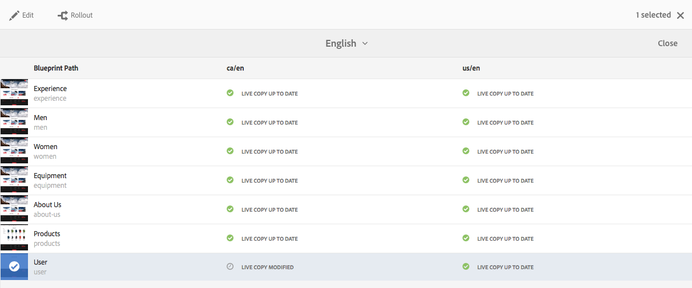
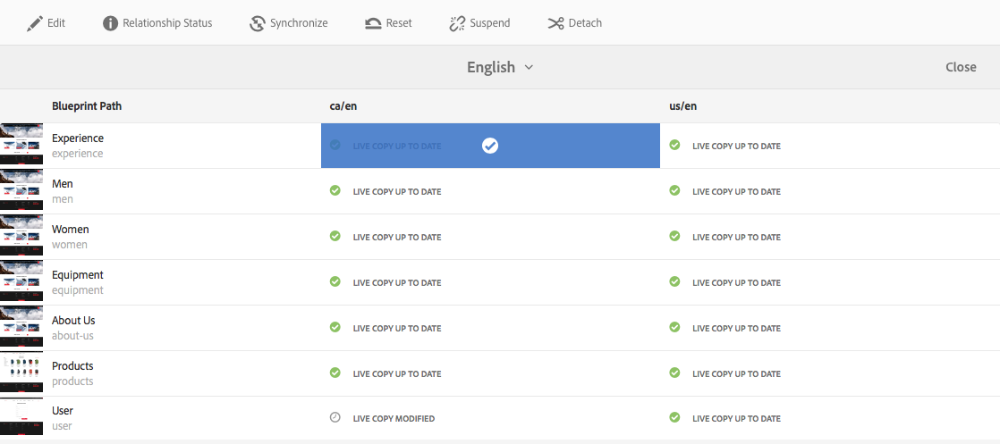
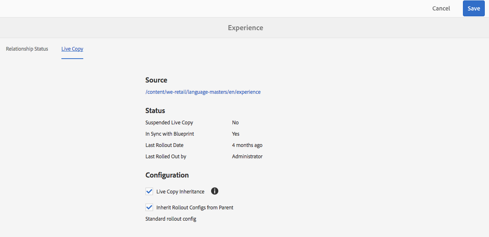

# Översiktskonsol för Live Copy{#live-copy-overview-console}

Med **Live Copy Overview** kan du

* Visa/hantera arv på en webbplats:

   * Visa det blå trädet och motsvarande Live-kopia-struktur, tillsammans med deras arvsstatus
   * Ändra arvsstatus; till exempel göra uppehåll, återuppta
   * Visa egenskaper för utkast och live-kopia

* Utför utrullningsåtgärder

## Öppna Live Copy-översikt {#opening-the-live-copy-overview}

Du kan öppna Live-kopieringsöversikt från:

* [Panelen Referenser till en översiktssida (Sites console)](#opening-live-copy-overview-references-for-a-blueprint-page)
* [Egenskaper för en ritningssida](#opening-live-copy-overview-properties-of-a-blueprint-page)

### Öppna Live Copy-översikt - referenser för en designsida {#opening-live-copy-overview-references-for-a-blueprint-page}

Översikt över **Live-kopian** kan öppnas på panelen **Referenser** i **webbplatskonsolen** :

1. Gå **till din plantryckssida i** Sites [-konsolen och markera](/help/sites-authoring/basic-handling.md#viewing-and-selecting-resources)den.
1. Öppna panelen **[Referenser](/help/sites-authoring/basic-handling.md#references)**och välj **Live-kopior**.

   

   >[!NOTE]
   >
   >Du kan också öppna Referenser först och sedan välja en plan.

1. Markera **Live Copy Overview** om du vill visa och använda översikten över alla live-kopior som hör till den valda planen.
1. Använd **Stäng** för att avsluta och återgå till **platskonsolen** .

### Öppna Live Copy-översikt - egenskaper för en designsida {#opening-live-copy-overview-properties-of-a-blueprint-page}

Översikt över **Live-kopian** kan öppnas när du visar egenskaper för en ritningssida:

1. Öppna **Egenskaper** för lämplig ritningssida.
1. Öppna fliken **Utskrift** - alternativet **Live-kopieringsöversikt** visas i det övre verktygsfältet:

   

1. Markera **Live Copy Overview** om du vill visa och använda översikten över alla live-kopior som hör till den aktuella planen.

   >[!NOTE]
   >
   >Mer information finns också i artikeln [Livecopy status message - Update/Green/In Sync](https://helpx.adobe.com/experience-manager/kb/livecopy-status-message---up-to-date-green-in-sync.html)i kunskapsbasen.

1. Använd **Stäng** för att avsluta och återgå till **platskonsolen** .

## Använda Live Copy-översikt {#using-the-live-copy-overview}

Översikten **över** Live-kopian kan även användas för att utföra åtgärder på den aktiva kopian:

1. Öppna **Live Copy Overview**.
1. Välj önskad skiss- eller Live copy-sida - verktygsfältet uppdateras för att visa tillgängliga åtgärder. Vilka [åtgärder](/help/sites-administering/msm.md#terms-used) som är tillgängliga beror på om du har valt en [ritning](#actions-for-a-blueprint-page) eller en [live-kopia](#actions-for-a-live-copy-page) :

### Åtgärder för en designsida {#actions-for-a-blueprint-page}

När du väljer en ritningssida är följande åtgärder tillgängliga:

* Redigera

   * Öppna ritningssidan för redigering.

* [Utrullning](/help/sites-administering/msm.md#rollout-and-synchronize)

   * Utför en utrullning för att föra över ändringar från källan till livecopy.

### Åtgärder för en Live Copy-sida {#actions-for-a-live-copy-page}

När du väljer en live-kopieringssida är följande åtgärder tillgängliga:

* Redigera

   * Öppna den aktiva kopieringssidan för redigering.

* [Relationsstatus](#relationship-status)

   * Visa information om status och arv.

* [Synkronisera](/help/sites-administering/msm.md#rollout-and-synchronize)

   * Synkronisera en live-kopia för att dra ändringar från källan till livecopy.

* [Återställ](/help/sites-administering/msm-livecopy.md#resetting-a-live-copy-page)

   * Återställ en live-kopieringssida om du vill ta bort alla arvsannulleringar och återställa sidan till samma läge som källsidan.

* [Gör uppehåll](/help/sites-administering/msm.md#suspending-and-cancelling-inheritance-and-synchronization)

   * Inaktiverar tillfälligt relationen mellan en live-kopia och dess ritningssida.

* [Återuppta](/help/sites-administering/msm-livecopy.md#resuming-inheritance-for-a-page)

   * Med Återuppta kan du återskapa en pausad relation.

* [Koppla loss](/help/sites-administering/msm.md#detaching-a-live-copy)

   * Tar permanent bort den aktiva relationen mellan en live-kopia och dess designsida.

## Relationsstatus {#relationship-status}

Konsolen för **relationsstatus** har två flikar med en rad funktioner:

* [Statusinformation för relation](#relationship-status-information)
* [Live Copy-information](#live-copy-information)

### Statusinformation för relation {#relationship-status-information}

På den här fliken finns detaljerad information om relationen mellan ritningen och den aktiva kopian:

### Live Copy-information {#live-copy-information}

På den här fliken kan du visa och redigera konfigurationen av live-kopian:

