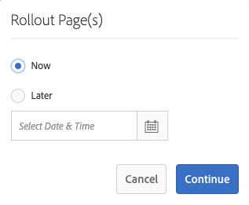
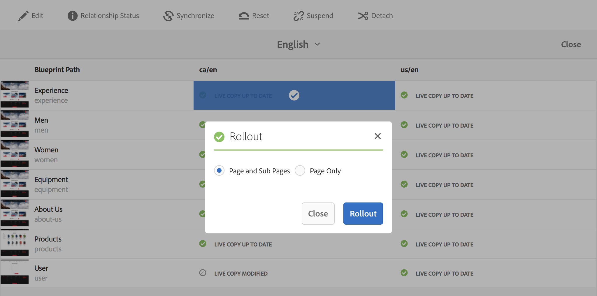

# Skapa och synkronisera Live-kopior{#creating-and-synchronizing-live-copies}

Du kan skapa en live-kopia från en sida eller en plantryckskonfiguration och sedan hantera arv och synkronisering.

## Hantera layoutkonfigurationer {#managing-blueprint-configurations}

En plankonfiguration identifierar en befintlig webbplats som du vill använda som källa för en eller flera live-kopieringssidor.

>[!NOTE]
>
>Med designkonfigurationer kan du överföra innehållsändringar till live-kopior. Se [Live-kopior - Källa, utkast och skissbilder](/help/sites-administering/msm.md#source-blueprints-and-blueprint-configurations).

När du skapar en ritningskonfiguration väljer du en mall som definierar den interna strukturen för ritningen. Standardmallen för utkast förutsätter att källwebbplatsen har följande egenskaper:

* Webbplatsen har en rotsida.
* De direkt underordnade sidorna i roten är språkgrenar på webbplatsen. När du skapar en live-kopia visas språken som valfritt innehåll som ska inkluderas i kopian.
* Roten för varje språkgren har en eller flera underordnade sidor. När du skapar en live-kopia visas underordnade sidor som kapitel som du kan inkludera i live-kopian.

>[!NOTE]
>
>En annan struktur kräver en annan designmall.

När du har skapat en ritningskonfiguration konfigurerar du följande egenskaper:

* **Namn**: Namnet på designkonfigurationen.
* **Källsökväg**: Sökvägen till rotsidan på platsen som du använder som källa (utkast).
* **Beskrivning**. (Valfritt) En beskrivning av ritningskonfigurationen. Beskrivningen visas i listan med designkonfigurationer att välja mellan när du skapar en plats.

När du använder din ritningskonfiguration kan du associera den med en utrullningskonfiguration som bestämmer hur live-kopiorna av källan/ritningen synkroniseras. Se [Ange vilka utrullningskonfigurationer som ska användas](/help/sites-administering/msm-sync.md#specifying-the-rollout-configurations-to-use).

### Skapa en designkonfiguration {#creating-a-blueprint-configuration}

Så här skapar du en ritningskonfiguration:

1. [Navigera](/help/sites-authoring/basic-handling.md#global-navigation) till **verktyg** väljer du **Webbplatser** -menyn.
1. Välj **Blueprints** för att öppna **Skapa utkast** konsol:

   

1. Välj **Skapa**.
1. Välj en ritningsmall och sedan **Nästa** för att fortsätta.
1. Välj den källsida som ska användas som utkast. **Nästa** för att fortsätta.
1. Definiera:

   * **Titel**: obligatorisk titel för ritningen
   * **Beskrivning**: en valfri beskrivning med mer information.

1. **Skapa** kommer att skapa en ritningskonfiguration baserat på din specifikation.

### Redigera eller ta bort en utkastkonfiguration {#editing-or-deleting-a-blueprint-configuration}

Du kan redigera eller ta bort en befintlig ritningskonfiguration:

1. [Navigera](/help/sites-authoring/basic-handling.md#global-navigation) till **verktyg** väljer du **Webbplatser** -menyn.
1. Välj **Blueprints** för att öppna **Skapa utkast** konsol:

   

1. Välj önskad konfiguration av utkast - lämpliga åtgärder blir tillgängliga i verktygsfältet:

   * **Egenskaper**; du kan använda detta för att visa och sedan redigera egenskaperna för konfigurationen.
   * **Ta bort**

## Skapa en Live Copy {#creating-a-live-copy}

### Skapa en Live-kopia av en sida {#creating-a-live-copy-of-a-page}

Du kan skapa en live-kopia av vilken sida eller gren som helst. När du skapar en live-kopia kan du ange vilka rollout-konfigurationer som ska användas för att synkronisera innehållet:

* De valda rollout-konfigurationerna gäller för live-kopieringssidan och dess underordnade sidor.
* Om du inte anger några utplaceringskonfigurationer avgör MSM vilka utplaceringskonfigurationer som ska användas. Se [Ange vilken utrullningskonfiguration som ska användas](/help/sites-administering/msm-sync.md#specifying-the-rollout-configurations-to-use).

Du kan skapa en live-kopia av vilken sida som helst:

* Sidor som refereras av en [konfiguration av utkast](#creating-a-blueprint-configuration).
* Och sidor som inte har någon anslutning till en konfiguration.
* AEM har också stöd för att skapa en live-kopia på sidorna i en annan live-kopia.

Den enda skillnaden är att tillgängligheten för **Utrullning** -kommandot på käll-/ritningssidorna är beroende av om källan refereras av en ritningskonfiguration:

* Om du skapar en live-kopia från en källsida som **är** som refereras i en ritningskonfiguration, kommer kommandot Rollout att vara tillgängligt på käll-/ritningssidorna.
* Om du skapar en live-kopia från en källsida som **är inte** som refereras i en ritningskonfiguration, kommer kommandot Rollout inte att vara tillgängligt på käll-/ritningssidan/-sidorna.

Så här skapar du en live-kopia:

1. I **Webbplatser** välj konsol **Skapa** sedan **Live Copy**.

   

1. Välj källsida och klicka eller tryck sedan **Nästa**. Till exempel:

   

1. Ange målsökvägen för live-kopian (öppna den överordnade mappen/sidan för live-kopian) och klicka eller tryck sedan på **Nästa**.

   

   >[!NOTE]
   >
   >Målsökvägen får inte finnas i källsökvägen.

1. Ange:

   * a **Titel** för sidan.
   * a **Namn**, som används i URL-adressen.

   

1. Använd **Uteslut undersidor** kryssruta:

   * Markerad: skapa en live-kopia av den markerade sidan (endast begränsad live-kopia)
   * Inte markerad: skapa en live-kopia som innehåller alla underordnade till den markerade sidan (djup live-kopia)

1. (Valfritt) Använd kommandot **Utrullningskonfigurationer** för att markera dem. Markerade konfigurationer visas under den nedrullningsbara väljaren.
1. Klicka eller tryck **Skapa**. Ett bekräftelsemeddelande visas. Här kan du välja antingen **Öppna** eller **Klar**.

### Skapa en Live-kopia av en plats från en designkonfiguration {#creating-a-live-copy-of-a-site-from-a-blueprint-configuration}

Skapa en live-kopia med hjälp av en ritningskonfiguration för att skapa en webbplats baserad på innehållet i ritningen (källan). När du skapar en live-kopia från en ritningskonfiguration väljer du en eller flera språkgrenar i den ritningskälla som ska kopieras och sedan markerar du de kapitel som ska kopieras från språkgrenarna. Se [Skapa en designkonfiguration](/help/sites-administering/msm-livecopy.md#creating-a-blueprint-configuration).

Om du utelämnar vissa språkgrenar eller kapitel från live-kopian kan du lägga till dem senare. Se [Skapa en Live-kopia i en Live-kopia (utkast-konfiguration)](#creating-a-live-copy-inside-a-live-copy-blueprint-configuration).

>[!CAUTION]
>
>När ritningskällan innehåller länkar och referenser som avser ett stycke i en annan gren, uppdateras inte målen på sidorna för den aktiva kopian, utan de är fortfarande kopplade till det ursprungliga målet.

När du skapar platsen anger du värden för följande egenskaper:

* **Ursprungliga språk**: De språkgrenar i den utkast som ska inkluderas i live-kopian.
* **Inledande kapitel**: De underordnade sidorna i grenarna för utkast som ska inkluderas i live-kopian.
* **Målsökväg**: Platsen för den publicerade kopians rotsida.
* **Titel**: Titeln på den aktiva kopians rotsida.
* **Namn**: (Valfritt) Namnet på den JCR-nod som lagrar den aktiva kopians rotsida. Standardvärdet baseras på titeln.
* **Webbplatsägare**: (Valfritt)
* **Live Copy**: Välj det här alternativet om du vill skapa en direktrelation med källplatsen. Om du inte markerar det här alternativet skapas en kopia av ritningen, men den synkroniseras inte med källan.
* **Utrullningskonfigurationer**: (Valfritt) Välj en eller flera utrullningskonfigurationer som ska användas för synkronisering av live-kopian. Som standard ärvs utrullningskonfigurationerna från ritningen. Se [Ange vilka utrullningskonfigurationer som ska användas](/help/sites-administering/msm-sync.md#specifying-the-rollout-configurations-to-use) för mer information.

Så här skapar du en live-kopia av en webbplats från en planeringskonfiguration:

1. I **Webbplatser** konsol, välj **Skapa** sedan **Plats** i listrutan.
1. Välj den designkonfiguration som ska användas som källa för live-kopian och fortsätt med **Nästa**:

   

1. Använd **Ursprungliga språk** för att ange vilka språk som ska användas för den publicerade kopian.

   Alla tillgängliga språk är markerade som standard. Om du vill ta bort ett språk klickar eller trycker du på **X** som visas bredvid språket.

   Till exempel:

   

1. Använd **Inledande kapitel** i listrutan för att markera de avsnitt i ritningen som ska ingå i den aktiva kopian. Alla tillgängliga kapitel inkluderas som standard, men kan tas bort.
1. Ange värden för de återstående egenskaperna och välj sedan **Skapa**. Välj **Klar** för att gå tillbaka till **Webbplatser** konsol, eller **Öppna webbplats** för att öppna webbplatsens rotsida.

### Skapa en Live-kopia i en Live-kopia (utkast-konfiguration) {#creating-a-live-copy-inside-a-live-copy-blueprint-configuration}

När du skapar en live-kopia i den befintliga live-kopian (skapad med en ritningskonfiguration) kan du infoga en eller flera språkversioner som inte fanns med när live-kopian ursprungligen skapades.

## Övervaka din Live Copy {#monitoring-your-live-copy}

### Se status för en Live-kopia {#seeing-the-status-of-a-live-copy}

Egenskaperna för en live-kopia visar följande information om live-kopian:

* **Källa**: Källsidan för den aktiva kopieringssidan.
* **Status**: Synkroniseringsstatus för live-kopian. Statusen omfattar huruvida den aktiva kopian är uppdaterad med källan, när den senaste synkroniseringen inträffade och vem som utförde synkroniseringen.
* **Konfiguration**:

   * Anger om sidan fortfarande omfattas av live-kopiarv.
   * Anger om konfigurationen ärvs från den överordnade sidan.
   * Alla utrullningskonfigurationer som används för live-kopian.

Så här visar du egenskaperna:

1. I **Webbplatser** markerar du live copy-sidan och öppnar egenskaperna.
1. Välj **Live Copy** -fliken.

   Till exempel:

   

   >[!NOTE]
   >
   >Mer information finns även i artikeln i kunskapsbasen [LiveCycle-statusmeddelande - uppdaterad/grön/synkroniserad](https://helpx.adobe.com/experience-manager/kb/livecopy-status-message---up-to-date-green-in-sync.html).

### Visa Live-kopior av en blå sida {#seeing-the-live-copies-of-a-blueprint-page}

Utskriftssidor (som refereras i en ritningskonfiguration) ger dig en lista över de live-kopieringssidor som använder den aktuella (blå) sidan som källa. Använd den här listan för att hålla reda på live-kopior. Listan visas på **Blueprint** -fliken i [sidegenskaper](/help/sites-authoring/editing-page-properties.md).

## Synkronisera din Live-kopia {#synchronizing-your-live-copy}

### Rulla ut ett utkast {#rolling-out-a-blueprint}

Rulla ut en ritningssida för att överföra innehållsändringar till live-kopior. A **Utrullning** åtgärden kör de utrullningskonfigurationer som använder [Vid utrullning](/help/sites-administering/msm-sync.md#rollout-triggers) utlösare.

>[!NOTE]
>
>Konflikter kan uppstå om nya sidor med samma sidnamn skapas både i den blå grenen och i en beroende livekopiegren.
>
>sådan [konflikter måste hanteras och lösas vid utrullning](/help/sites-administering/msm-rollout-conflicts.md).
>

#### Skapa en skiss från Sidegenskaper {#rolling-out-a-blueprint-from-page-properties}

1. I **Webbplatser** markerar du sidan i utkastet och öppnar egenskaperna.
1. Öppna **Blueprint** -fliken.
1. Välj **Utrullning**.

   

1. Ange sidorna och eventuella underordnade sidor och bekräfta sedan med bockmarkeringen:

   

1. Ange om utrullningsjobbet ska köras omedelbart (**Nu**) eller vid ett annat datum/tid (**Senare**).

   

Utrullningar bearbetas som asynkrona jobb och kan kontrolleras i [**Status för asynkrona jobb** kontrollpanel](asynchronous-jobs.md#monitor-the-status-of-asynchronous-operations) på **Global navigering** -> **verktyg** -> **Operationer** -> **Jobb**

>[!NOTE]
>
>Asynkron utrullningsbearbetning kräver AEM 6.5.3.0 eller senare. I tidigare versioner bearbetades sidorna direkt och synkront.

#### Rulla ut en skiss från referensspåret {#roll-out-a-blueprint-from-the-reference-rail}

1. I **Webbplatser** markerar du sidan i live-kopian och öppnar **[Referenser](/help/sites-authoring/basic-handling.md#references)** (från verktygsfältet).
1. Välj **Blueprint** i listan för att visa de utkast som är kopplade till den här sidan.
1. Välj önskad rityta i listan.
1. Klicka eller tryck **Utrullning**.
1. Du ombeds bekräfta informationen om utrullningen:

   * **Rullningsomfång**:

     Ange om omfånget gäller enbart för den valda sidan eller om det ska omfatta underordnade sidor.

   * **Schema**:

     Ange om utrullningsjobbet ska köras omedelbart (**Nu**) eller vid ett senare datum/tid (**Senare**).

     

1. När du har bekräftat dessa uppgifter väljer du **Utrullning** för att utföra åtgärden.

Utrullningar bearbetas som asynkrona jobb och kan kontrolleras i [**Status för asynkrona jobb** kontrollpanel](asynchronous-jobs.md#monitor-the-status-of-asynchronous-operations) på **Global navigering** -> **verktyg** -> **Operationer** -> **Jobb**

>[!NOTE]
>
>Asynkron utrullningsbearbetning kräver AEM 6.5.3.0 eller senare. I tidigare versioner bearbetades sidorna direkt och synkront såvida inte **Bakgrundslayout** alternativet har markerats.

#### Rulla ut en utkast från Live Copy-översikt {#roll-out-a-blueprint-from-the-live-copy-overview}

The [Utrullningsåtgärden är också tillgänglig från Live-kopieringsöversikten](/help/sites-administering/msm-livecopy-overview.md#using-the-live-copy-overview)när en designsida är markerad.

1. Öppna [Live Copy - översikt](/help/sites-administering/msm-livecopy-overview.md#using-the-live-copy-overview) och väljer en designsida.
1. Välj **Utrullning** i verktygsfältet.
1. Ange sidorna och eventuella underordnade sidor och bekräfta sedan med bockmarkeringen:

   

1. Ange om utrullningsjobbet ska köras omedelbart (**Nu**) eller vid ett annat datum/tid (**Senare**).

   

Utrullningar bearbetas som asynkrona jobb och kan kontrolleras i [**Status för asynkrona jobb** kontrollpanel](asynchronous-jobs.md#monitor-the-status-of-asynchronous-operations) på **Global navigering** -> **verktyg** -> **Operationer** -> **Jobb**

>[!NOTE]
>
>Asynkron utrullningsbearbetning kräver AEM 6.5.3.0 eller senare. I tidigare versioner bearbetades sidorna direkt och synkront.

### Synkronisera en Live-kopia {#synchronizing-a-live-copy}

Synkronisera en live-kopia för att dra innehållsändringar från källan till live-kopian.

#### Synkronisera en Live-kopia från Sidegenskaper {#synchronize-a-live-copy-from-page-properties}

Synkronisera en live-kopia för att dra ändringar från källan till livecopy.

>[!NOTE]
>
>Synkronisering kör de utrullningskonfigurationer som använder [Vid utrullning](/help/sites-administering/msm-sync.md#rollout-triggers) utlösare.

1. I **Webbplatser** markerar du live copy-sidan och öppnar egenskaperna.
1. Öppna **Live Copy** -fliken.
1. Klicka eller tryck **Synkronisera**.

   

   Bekräftelse kommer att begäras, använd **Synkronisera** för att fortsätta.

#### Synkronisera en Live-kopia från Live Copy-översikt {#synchronize-a-live-copy-from-the-live-copy-overview}

The [Synkroniseringsåtgärden är även tillgänglig från Live-kopieringsöversikten](/help/sites-administering/msm-livecopy-overview.md#using-the-live-copy-overview)när en Live Copy-sida är markerad.

1. Öppna [Live Copy - översikt](/help/sites-administering/msm-livecopy-overview.md#using-the-live-copy-overview) och väljer en Live Copy-sida.
1. Välj **Synkronisera** i verktygsfältet.
1. Bekräfta **Utrullning** i dialogrutan efter att du har angett om du vill inkludera:

   * **Sidor och undersidor**
   * **Endast sida**

   

## Ändra innehåll i Live Copy {#changing-live-copy-content}

Om du vill ändra innehållet i en live-kopia kan du:

* Lägg till stycken på sidan.
* Uppdatera befintligt innehåll genom att bryta arvet av live-kopior för alla sidor eller komponenter.

>[!NOTE]
>
>Om du skapar en sida manuellt i den aktiva kopian är den lokal för den aktiva kopian, vilket innebär att den inte har någon motsvarande källsida att koppla till.
>
>Det bästa sättet att skapa en lokal sida som ingår i relationen är att skapa den i källan och göra en (djup) utrullning. Då skapas sidan lokalt som live-kopior.

>[!NOTE]
>
>Konflikter kan uppstå om nya sidor med samma sidnamn skapas både i den blå grenen och i en beroende livekopiegren.
>
>sådan [konflikter måste hanteras och lösas vid utrullning](/help/sites-administering/msm-rollout-conflicts.md).
>

### Lägga till komponenter på en Live Copy-sida {#adding-components-to-a-live-copy-page}

Lägg till komponenter på en live-kopia när som helst. Arvsstatus för live-kopian och dess styckesystem styr inte möjligheten att lägga till komponenter.

När den aktiva kopieringssidan synkroniseras med källsidan ändras inte de tillagda komponenterna. Se även [Ändra ordning på komponenter på en Live Copy-sida](#changing-the-order-of-components-on-a-live-copy-page).

>[!NOTE]
>
>Ändringar som görs lokalt för en komponent som markerats som en behållare skrivs inte över av innehållet i ritningen i en utrullning. Se [MSM Best Practices](/help/sites-administering/msm-best-practices.md#components-and-container-synchronization) för mer information.

### Pausa arv för en sida {#suspending-inheritance-for-a-page}

När du skapar en live-kopia sparas live-kopiekonfigurationen på rotsidan för de kopierade sidorna. Alla underordnade sidor på rotsidan ärver konfigurationerna för live-kopior. Komponenterna på livecopy-sidorna ärver också konfigurationen för live-kopiering.

Du kan göra uppehåll i arvet av live-kopior för en live-kopieringssida så att du kan ändra sidegenskaper och komponenter. När du gör uppehåll i arv synkroniseras inte längre sidegenskaperna och komponenterna med källan.

>[!NOTE]
>
>Du kan också [frigöra en live-kopia](#detaching-a-live-copy) från sin plan för att ta bort alla anslutningar. Frigör är permanent och icke-reversibel.

>[!NOTE]
>
>Om komponenten är markerad som en behållare gäller inte åtgärderna för att avbryta och göra uppehåll för dess underordnade komponenter. Se även [MSM Best Practices](/help/sites-administering/msm-best-practices.md#components-and-container-synchronization) om du vill ha mer information.

#### Pausa arv från Sidegenskaper {#suspending-inheritance-from-page-properties}

Så här gör du uppehåll i arv på en sida:

1. Öppna egenskaperna för live-kopieringssidan med **Visa egenskaper** kommando **Webbplatser** konsol eller med **Sidinformation** på sidans verktygsfält.
1. Klicka eller tryck på **Live Copy** -fliken.
1. Välj **Gör uppehåll** i verktygsfältet. Du kan sedan välja något av följande:

   * **Gör uppehåll**: endast aktuell sida
   * **Pausa med barn**: aktuell sida tillsammans med eventuella underordnade sidor

1. Välj **Gör uppehåll** i bekräftelsedialogrutan.

#### Pausa arv från Live Copy-översikt {#suspending-inheritance-from-the-live-copy-overview}

The [Åtgärden Gör uppehåll är också tillgänglig via Live Copy-översikt](/help/sites-administering/msm-livecopy-overview.md#using-the-live-copy-overview)när en Live Copy-sida är markerad.

1. Öppna [Live Copy - översikt](/help/sites-administering/msm-livecopy-overview.md#using-the-live-copy-overview) och väljer en Live Copy-sida.
1. Välj **Gör uppehåll** i verktygsfältet.
1. Välj lämpligt alternativ från:

   * **Gör uppehåll**
   * **Pausa med barn**

   

1. Bekräfta **Gör uppehåll** i **Skjut upp Live Copy** dialog:

   

### Återuppta arv för en sida {#resuming-inheritance-for-a-page}

Att skjuta upp live-kopiarv för en sida är en tillfällig åtgärd. När den har pausats **Återuppta** blir en åtgärd tillgänglig så att du kan återskapa den aktiva relationen.

När du återaktiverar arv synkroniseras inte sidan automatiskt med källan. Du kan begära en synkronisering, om detta krävs, antingen:

* I **Återuppta**/**Återställ** dialog, till exempel:

  

* I ett senare skede, genom att manuellt välja synkroniseringsåtgärden.

>[!CAUTION]
>
>När du återaktiverar arv synkroniseras inte sidan automatiskt med källan. Du kan begära en synkronisering manuellt om det behövs, antingen vid återupptagningen eller senare.

#### Återuppta arv från Sidegenskaper {#resuming-inheritance-from-page-properties}

En gång [pausad](#suspending-inheritance-from-page-properties) den **Återuppta** blir åtgärden i verktygsfältet för sidegenskaperna:

När du väljer det här alternativet visas dialogrutan. Du kan välja en synkronisering, om det behövs, och sedan bekräfta åtgärden.

#### Återuppta en Live Copy-sida från Live Copy-översikten {#resume-a-live-copy-page-from-the-live-copy-overview}

The [Åtgärden Återuppta är också tillgänglig från Live Copy Overview](/help/sites-administering/msm-livecopy-overview.md#using-the-live-copy-overview)när en Live Copy-sida är markerad.

1. Öppna [Live Copy - översikt](/help/sites-administering/msm-livecopy-overview.md#using-the-live-copy-overview) och väljer en Live Copy-sida som har pausats. Den visas som **ARV AVBRUTEN**.
1. Välj **Återuppta** i verktygsfältet.
1. Ange om du vill synkronisera sidan efter att ha återställt arv och bekräfta sedan **Återuppta** i **Återuppta Live Copy** -dialogrutan.

### Ändra arvsdjup (grund/djup) {#changing-inheritance-depth-shallow-deep}

På en befintlig Live-kopia kan du ändra siddjupet, dvs. om underordnade sidor ska tas med.

* Byt till en ytlig live-kopia:

   * Kommer att ha omedelbar effekt och är icke-reversibel.

      * Underordnade sidor kopplas explicit från live-kopian. Ytterligare ändringar av underordnade kan inte bevaras om de ångras.

      * Tar bort alla underordnade `LiveRelationships` även om det finns kapslade `LiveCopies`.

* Byt till en djup live-kopia:

   * Underordnade sidor ändras inte.
   * Om du vill se effekten av switchen kan du göra en utrullning, så tillämpas alla innehållsändringar enligt utrullningskonfigurationen.

* Byt till en ytlig live-kopia och sedan tillbaka till djupet:

   * Alla underordnade objekt till den (tidigare) ytliga, aktiva kopian behandlas som om de skapats manuellt och därför flyttas bort med `[oldname]_msm_moved name`.

Så här anger eller ändrar du djup:

1. Öppna egenskaperna för live-kopieringssidan med **Visa egenskaper** kommando **Webbplatser** konsol eller med **Sidinformation** på sidans verktygsfält.
1. Klicka eller tryck på **Live Copy** -fliken.
1. I **Konfiguration** -sektion, ange eller rensa **Live Copy-arv** beroende på om underordnade sidor inkluderas:

   * checked - a deep copy (the child pages are included)
   * clear - a shallow live copy (child pages are exclude)

   >[!CAUTION]
   >
   >Att byta till en ytlig live-kopia har omedelbar effekt och går inte att ångra.
   >
   >Se [Live-kopior - komposition](/help/sites-administering/msm.md#live-copies-composition) för mer information.

1. Klicka eller tryck **Spara** för att behålla uppdateringarna.

### Avbryta arv för en komponent {#cancelling-inheritance-for-a-component}

Avbryt arvet av live-kopia för en komponent så att komponenten inte längre är synkroniserad med källkomponenten. Du kan aktivera arv vid ett senare tillfälle om det behövs.

>[!NOTE]
>
>Om komponenten är markerad som en behållare gäller inte åtgärderna för att avbryta och göra uppehåll för dess underordnade komponenter. Se även [MSM Best Practices](/help/sites-administering/msm-best-practices.md#components-and-container-synchronization) om du vill ha mer information.

>[!NOTE]
>
>När du återaktiverar arv synkroniseras inte komponenten automatiskt med källan. Du kan begära en synkronisering manuellt om det behövs.

Avbryt arv för att ändra komponentinnehållet eller ta bort komponenten:

1. Klicka på eller tryck på den komponent som du vill avbryta arvet för.

   

1. Klicka eller tryck på knappen **Avbryt arv** -ikon.

   

1. Bekräfta åtgärden med i dialogrutan Avbryt arv **Ja**.

   Komponentverktygsfältet uppdateras med alla (lämpliga) redigeringskommandon.

### Återaktivera arv för en komponent {#re-enabling-inheritance-for-a-component}

Om du vill aktivera arv för en komponent klickar eller trycker du på **Återaktivera arv** -ikonen i komponentens verktygsfält.

### Ändra ordning på komponenter på en Live Copy-sida {#changing-the-order-of-components-on-a-live-copy-page}

Om en live-kopia innehåller komponenter som är en del av ett styckesystem följer arvet av det styckesystemet följande regler:

* Komponenternas ordning i ett ärvt styckesystem kan ändras, även om arv är etablerat.
* Vid utrullning återställs komponenternas ordning från ritningen. Om nya komponenter lades till i live-kopian innan den lanserades, kommer de att ordnas om tillsammans med de komponenter ovanför vilka de lades till.
* Om arvet av styckesystemet avbryts återställs inte komponenternas ordning vid utrullning och förblir som i den aktiva kopian.

>[!NOTE]
>
>När du återställer ett annullerat arv i ett styckesystem, komponenternas ordning **återställs inte automatiskt** från planen. Du kan begära en synkronisering manuellt om det behövs.

Använd följande procedur för att avbryta arv av styckesystemet.

1. Öppna sidan med live-kopian.
1. Dra en befintlig komponent till en ny plats på sidan.
1. I **Avbryt arv** bekräfta åtgärden med **Ja**.

### Åsidosätta egenskaper för en Live Copy-sida {#overriding-properties-of-a-live-copy-page}

Sidegenskaperna för en Live-kopia-sida ärvs (och kan inte redigeras) från källsidan som standard.

Du kan avbryta arv av en egenskap när du behöver ändra egenskapsvärdet för live-kopian. En länkikon anger att arv är aktiverat för egenskapen.

När du avbryter arv kan du ändra egenskapsvärdet. En ikon med en bruten länk anger att arvet har avbrutits.

Du kan senare återaktivera arv för en egenskap om det behövs.

>[!NOTE]
>
>När du återaktiverar arv synkroniseras inte egenskapen för live-kopieringssidan automatiskt med egenskapen source. Du kan begära en synkronisering manuellt om det behövs.

1. Öppna egenskaperna för den aktiva kopieringssidan med hjälp av **Visa egenskaper** alternativ för **Webbplatser** konsol eller **Sidinformation** ikonen i sidans verktygsfält.
1. Om du vill avbryta arvet av en egenskap klickar eller trycker du på länkikonen som visas till höger om egenskapen.

   

1. I **Avbryt arv** bekräftelsedialogruta, klicka eller tryck **Ja**.

### Återställa egenskaper för en Live Copy-sida {#revert-properties-of-a-live-copy-page}

Om du vill aktivera arv för en egenskap klickar eller trycker du på **Återställ arv** -ikonen som visas bredvid egenskapen.

### Återställa en Live Copy-sida {#resetting-a-live-copy-page}

Återställ en live-kopia till:

* Ta bort alla annulleringar av arv och
* Returnera sidan till samma läge som källsidan.

Återställningen påverkar ändringar som du har gjort i sidegenskaperna, styckesystemet och komponenterna.

#### Återställ en Live Copy-sida från Sidegenskaperna {#reset-a-live-copy-page-from-the-page-properties}

1. I **Webbplatser** konsolen, markera live copy-sidan och välj **Visa egenskaper**.
1. Öppna **Live Copy** -fliken.
1. Välj **Återställ** i verktygsfältet.

   

1. I **Återställ Live Copy** dialogruta, bekräfta med **Återställ**.

#### Återställ en Live Copy-sida från Live Copy-översikten {#reset-a-live-copy-page-from-the-live-copy-overview}

The [Återställningsåtgärden är även tillgänglig från Live-kopieringsöversikten](/help/sites-administering/msm-livecopy-overview.md#using-the-live-copy-overview)när en Live Copy-sida är markerad.

1. Öppna [Live Copy - översikt](/help/sites-administering/msm-livecopy-overview.md#using-the-live-copy-overview) och väljer en Live Copy-sida.
1. Välj **Återställ** i verktygsfältet.
1. Bekräfta **Återställ** i **Återställ Live Copy** dialog:

   

## Jämföra en Live Copy-sida med en designsida {#comparing-a-live-copy-page-with-a-blueprint-page}

Om du vill spåra de ändringar du har gjort kan du visa planeringsidan i **Referenser** och jämför det med sin Live copy-sida:

1. I **Webbplatser** konsol, [navigera till en skiss- eller Live copy-sida och markera den](/help/sites-authoring/basic-handling.md#viewing-and-selecting-resources).
1. Öppna **[Referenser](/help/sites-authoring/basic-handling.md#references)** och markera:

   * **Blueprint** (när en live-kopieringssida är markerad)
   * **Live-kopior** (när en ritningssida har valts)

1. Välj en specifik live-kopia och sedan antingen:

   * **Jämför med skiss** (när en live-kopieringssida är markerad)
   * **Jämför med Live Copy** (när en ritningssida har valts)

   Till exempel:

   

1. De två sidorna (live copy och plan) öppnas sida vid sida.

   Mer information om hur du använder den här funktionen finns i [Sidskillnader](/help/sites-authoring/page-diff.md).

## Koppla loss en Live-kopia {#detaching-a-live-copy}

Koppla loss permanent tar bort den aktiva relationen mellan en live-kopia och dess käll-/ritningssida. Alla MSM-relevanta egenskaper tas bort från den aktiva kopian och de aktiva kopieringssidorna blir en fristående kopia.

>[!CAUTION]
>
>Du kan inte återskapa den aktiva relationen när du har frigjort den aktiva kopian.
>
>Om du vill ta bort den aktiva relationen och välja att återställa den senare kan du [avbryt live copy-arv](#suspending-inheritance-for-a-page) för sidan.

Det påverkar var i trädet du använder **Koppla loss**:

* **Koppla loss från en rotsida i en LiveCopy**

  När den här åtgärden utförs på rotsidan för en live-kopia tas den aktiva relationen mellan alla sidor i ritningen och dess livecopy bort.

  Ytterligare ändringar av sidor i planen (som tidigare) **inte** påverka livecopy (som tidigare).

* **Frigöra på en undersida i en LiveCopy**

  När den här åtgärden utförs på en undersida (eller en gren) i en live-kopia:

   * direktrelationen tas bort för den undersidan (eller grenen)
   * och (sub-)sidorna i livekopiegrenen behandlas som om de skapats manuellt.

  *Men*, undersidorna fortfarande omfattas av den överordnade grenens aktiva relation, så en ytterligare utrullning av ritningssidan/-sidorna kommer att båda:

   1. Byt namn på den eller de frånkopplade sidorna:

      * Detta beror på att MSM betraktar dem som manuellt skapade sidor som orsakar en konflikt eftersom de har samma namn som de livecopy-sidor som de försöker skapa.

   1. Skapa en (livecopy) sida med det ursprungliga namnet som innehåller ändringarna från utrullningen.

  >[!NOTE]
  >
  >Se [MSM-utrullningskonflikter](/help/sites-administering/msm-rollout-conflicts.md) för närmare uppgifter om sådana situationer.

### Frigöra en Live Copy-sida från Sidegenskaper {#detach-a-live-copy-page-from-the-page-properties}

Så här frigör du en live-kopia:

1. I **Webbplatser** markera live copy-sidan och klicka eller tryck **Visa egenskaper**.
1. Öppna **Live Copy** -fliken.
1. I verktygsfältet väljer du **Koppla loss**.

   

1. En bekräftelsedialogruta visas. Välj **Koppla loss** för att slutföra åtgärden.

### Frigöra en Live Copy-sida från Live Copy-översikten {#detach-a-live-copy-page-from-the-live-copy-overview}

The [Åtgärden Frigör är också tillgänglig från Live-kopieringsöversikten](/help/sites-administering/msm-livecopy-overview.md#using-the-live-copy-overview)när en Live Copy-sida är markerad.

1. Öppna [Live Copy - översikt](/help/sites-administering/msm-livecopy-overview.md#using-the-live-copy-overview) och väljer en Live Copy-sida.
1. Välj **Koppla loss** i verktygsfältet.
1. Bekräfta **Koppla loss** i **Frigör Live Copy** dialog:

   
