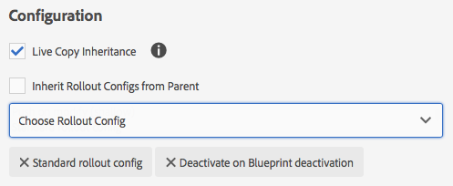

# Konfigurera Live Copy-synkronisering{#configuring-live-copy-synchronization}

Utför följande uppgifter för att kontrollera hur och när live-kopior synkroniseras med källinnehållet.

* Bestäm om befintliga utrullningskonfigurationer uppfyller dina krav eller om du behöver skapa en eller flera.
* Ange de utrullningskonfigurationer som ska användas för dina livekopior.

## Installerade och anpassade utrullningskonfigurationer {#installed-and-custom-rollout-configurations}

I det här avsnittet finns information om de installerade rollout-konfigurationerna och de synkroniseringsåtgärder som de använder samt hur du skapar anpassade konfigurationer om det behövs.

### Utlösare för utrullning {#rollout-triggers}

Varje utrullningskonfiguration använder en utlösare som gör att utrullningen sker. Utrullningskonfigurationer kan använda någon av följande utlösare:

* **Vid utrullning**: Kommandot **utrullning** används på den blå utskriftssidan eller så används kommandot **Synkronisera** på den aktiva kopieringssidan.

* **Vid ändring**: Källsidan ändras.

* **Vid aktivering**: Källsidan aktiveras.

* **Vid inaktivering**: Källsidan är inaktiverad.

>[!NOTE]
>
>Om du använder On Modification-utlösaren kan det påverka prestandan. Mer information finns i [MSM:s bästa praxis](/help/sites-administering/msm-best-practices.md#onmodify) .

### Installerade utrullningskonfigurationer {#installed-rollout-configurations}

I följande tabell visas de utrullningskonfigurationer som har installerats med AEM. Tabellen innehåller utlösar- och synkroniseringsåtgärderna för varje utrullningskonfiguration. Om de installerade rollout-konfigurationsåtgärderna inte uppfyller dina krav kan du [skapa en ny rollout-konfiguration](#creating-a-rollout-configuration).

<table>
 <tbody>
  <tr>
   <th>Namn</th>
   <th>Beskrivning</th>
   <th>Utlösare</th>
   <th>Synkroniseringsåtgärder   , se även <a href="#installed-synchronization-actions">installerade synkroniseringsåtgärder</a></th>
  </tr>
  <tr>
   <td>Standardkonfiguration för utrullning</td>
   <td>Standardkonfiguration för utrullning som gör det möjligt att starta en process vid utlösare för utrullning och kör åtgärder: skapa, uppdatera, ta bort innehåll och beställa underordnade noder.</td>
   <td>Vid utrullning</td>
   <td>contentUpdate  contentCopy  contentDelete  referencesUpdate  productUpdate  orderChildren</td>
  </tr>
  <tr>
   <td>Aktivera vid aktivering av utkast</td>
   <td>Publicerar live-kopian när källan publiceras.</td>
   <td> Vid aktivering</td>
   <td>targetActivate</td>
  </tr>
  <tr>
   <td>Inaktivera vid inaktivering av utkast</td>
   <td>Inaktiverar live-kopian när källan inaktiveras.</td>
   <td>Vid inaktivering</td>
   <td>targetDeactivate  </td>
  </tr>
  <tr>
   <td>Skjut vid ändring</td>
   <td>
Flyttar innehållet till live-kopian när källan ändras.
 
Använd den här utrullningskonfigurationen sparsamt när den använder utlösaren Vid ändring.
 </td>
   <td>Vid ändring</td>
   <td>contentUpdate  contentCopy  contentDelete  referencesUpdate  orderChildren  </td>
  </tr>
  <tr>
   <td>Skjut på ändring (grund)</td>
   <td>
Överför innehåll till live-kopian när ritningssidan ändras, utan att uppdatera referenser (t.ex. för tunna kopior).
 
Använd den här utrullningskonfigurationen sparsamt när den använder utlösaren Vid ändring.
 </td>
   <td>Vid ändring</td>
   <td>contentUpdate  contentCopy  contentDelete  orderChildren</td>
  </tr>
  <tr>
   <td>Promote Launch</td>
   <td>Standardutrullningskonfiguration för att marknadsföra startsidor.</td>
   <td>Vid utrullning</td>
   <td>contentUpdate  contentCopy  contentDelete  referencesUpdate  orderChildren  markLiveRelationship</td>
  </tr>
  <tr>
   <td>Konfiguration för innehållsållning för katalogsida</td>
   <td>Använder sidmallar från en katalogplan.</td>
   <td>Vid utrullning</td>
   <td>contentUpdate  contentCopy  contentDelete  referencesUpdate  productCreateUpdate  orderChildren</td>
  </tr>
  <tr>
   <td>Katalogsidans uppdateringskonfiguration</td>
   <td>Använder målegenskaper från en katalogplan. Måste köras efter konfiguration för att visa innehåll på katalogsidan.</td>
   <td>Vid utrullning</td>
   <td>catalogRolloutHooks</td>
  </tr>
  <tr>
   <td>DPS-publikationer, utrullningskonfiguration</td>
   <td>DPS Publication-konfiguration som gör att du kan starta en utrullningsprocess vid utlösare för utrullning samtidigt som FolioProducer-bindningsegenskaper utesluts vid den första utrullningen</td>
   <td>Vid utrullning</td>
   <td>contentUpdate  contentCopy  contentDelete  referencesUpdate  orderChildren  dpsMetadataFilter</td>
  </tr>
  <tr>
   <td>Konfiguration för äldre katalog (5.6.0)</td>
   <td>Ersatta. Använd Kataloggenerator i stället för MSM för kataloglanseringar.</td>
   <td>Vid utrullning</td>
   <td>editProperties</td>
  </tr>
 </tbody>
</table>

### Installerade synkroniseringsåtgärder {#installed-synchronization-actions}

I följande tabell visas de synkroniseringsåtgärder som har installerats med AEM. Om de installerade åtgärderna inte uppfyller dina krav kan du [skapa en ny synkroniseringsåtgärd](/help/sites-developing/extending-msm.md#creating-a-new-synchronization-action).

<table>
 <tbody>
  <tr>
   <th>Åtgärdsnamn</th>
   <th>Beskrivning</th>
   <th>Egenskaper  </th>
  </tr>
  <tr>
   <td>contentCopy</td>
   <td>När det inte finns några noder i källan på den aktiva kopian kopieras noderna till den aktiva kopian. <a href="#excluding-properties-and-node-types-from-synchronization">Konfigurera CQ MSM Content Copy Action-tjänsten</a> för att ange vilka nodtyper, styckeobjekt och sidegenskaper som ska uteslutas.   </td>
   <td> </td>
  </tr>
  <tr>
   <td>contentDelete</td>
   <td>
Tar bort noder i live-kopian som inte finns i källan. <a href="#excluding-properties-and-node-types-from-synchronization">Konfigurera tjänsten</a> CQ MSM Content Delete Action för att ange vilka nodtyper, styckeobjekt och sidegenskaper som ska uteslutas. 
 </td>
   <td> </td>
  </tr>
  <tr>
   <td>contentUpdate</td>
   <td>Uppdaterar innehållet i live-kopian med ändringarna från källan. <a href="#excluding-properties-and-node-types-from-synchronization">Konfigurera CQ MSM Content Update Action-tjänsten</a> för att ange vilka nodtyper, styckeobjekt och sidegenskaper som ska uteslutas.   </td>
   <td> </td>
  </tr>
  <tr>
   <td>editProperties</td>
   <td>
Redigerar egenskaper för live-kopian. Egenskapen editMap avgör vilka egenskaper som redigeras och deras värde. Värdet för egenskapen editMap måste ha följande format:
 
<code>[property_name_1]#[current_value]#</code>[nytt_värde],  <code>[property_name_2]#[current_value]#</code>[nytt_värde],  ... ,  <code>[property_name_n]#[current_value]#</code>[nytt_värde]
 
Objekten <code>current_value</code> och <code>new_value</code> är reguljära uttryck.   
 
Ta till exempel följande värde för editMap:
 
<code>sling:resourceType#/</code>(contentpage|homepage)#/  mobilecontentpage,  cq:template#/contentpage#/mobilecontentpage
 
Det här värdet redigerar egenskaperna för live-kopieringsnoderna enligt följande:

    <ul>
     <li>De <code>sling:resourceType</code> egenskaper som antingen är inställda på <code>contentpage</code> eller <code>homepage</code> som <code>mobilecontentpage.</code></li>
     <li>De <code>cq:template</code> egenskaper som är inställda på <code>contentpage</code> är <code>mobilecontentpage.</code></li>
    </ul> </td>
   <td>
 
 
editMap: (String) Identifierar egenskapen, det aktuella värdet och det nya värdet. Mer information finns i beskrivningen.  
 </td>
  </tr>
  <tr>
   <td>meddela</td>
   <td>Skickar en sidhändelse om att sidan har rullats ut. För att kunna meddelas måste du först prenumerera på utrullningshändelser.</td>
   <td> </td>
  </tr>
  <tr>
   <td>orderChildren</td>
   <td>På live-kopian beställs de underordnade (noderna), baserat på ordningen i ritningen  </td>
   <td> </td>
  </tr>
  <tr>
   <td>referencesUpdate</td>
   <td>
På den aktiva kopian uppdaterar den här synkroniseringsåtgärden referenser som länkar.  Söker efter sökvägar på live-kopieringssidorna som pekar på en resurs i planen. När den hittas uppdateras sökvägen till den relaterade resursen inuti live-kopian (i stället för ritningen). Referenser som har mål utanför planen ändras inte.
 
<a href="#excluding-properties-and-node-types-from-synchronization">Konfigurera CQ MSM References Update Action-tjänsten</a> för att ange vilka nodtyper, styckeobjekt och sidegenskaper som ska uteslutas. 
 </td>
   <td> </td>
  </tr>
  <tr>
   <td>targetVersion</td>
   <td>
Skapar en version av den aktiva kopian.
 
Den här åtgärden måste vara den enda synkroniseringsåtgärden som ingår i en utrullningskonfiguration.
 </td>
   <td> </td>
  </tr>
  <tr>
   <td>targetActivate</td>
   <td>
Aktiverar live-kopian.
 
Den här åtgärden måste vara den enda synkroniseringsåtgärden som ingår i en utrullningskonfiguration.
 </td>
   <td> </td>
  </tr>
  <tr>
   <td>targetDeactivate</td>
   <td>
Inaktiverar live-kopian.
 
Den här åtgärden måste vara den enda synkroniseringsåtgärden som ingår i en utrullningskonfiguration.
 </td>
   <td> </td>
  </tr>
  <tr>
   <td>arbetsflöde</td>
   <td>
Startar arbetsflödet som definieras av egenskapen target (endast för sidor) och tar live-kopian som nyttolast.
 
Målsökvägen är sökvägen till modellnoden, till exempel /etc/workflow/models/request_for_activation/jcr:content/model
 </td>
   <td>mål: (String) Sökvägen till arbetsflödesmodellen.  </td>
  </tr>
  <tr>
   <td>mandatory</td>
   <td>
Anger behörighet för flera åtkomstkontrollistor på live-kopieringssidan som skrivskyddad för en viss användargrupp. Följande åtkomstkontrollistor är konfigurerade:

    <ul>
     <li>ActionSet.ACTION_NAME_REMOVE</li>
     <li>ActionSet.ACTION_NAME_SET_PROPERTY</li>
     <li>ActionSet.ACTION_NAME_ACL_MODIFY</li>
    </ul> 
Använd den här åtgärden endast för sidor.
 </td>
   <td>mål: (String) ID:t för gruppen som du anger behörigheter för.   </td>
  </tr>
  <tr>
   <td>mandatoryContent</td>
   <td>
Anger behörighet för flera åtkomstkontrollistor på live-kopieringssidan som skrivskyddad för en viss användargrupp. Följande åtkomstkontrollistor är konfigurerade:

    <ul>
     <li>ActionSet.ACTION_NAME_SET_PROPERTY</li>
     <li>ActionSet.ACTION_NAME_ACL_MODIFY</li>
    </ul> 
Använd den här åtgärden endast för sidor.
 </td>
   <td>mål: (String) ID:t för gruppen som du anger behörigheter för. </td>
  </tr>
  <tr>
   <td>mandatoryStructure</td>
   <td>Anger behörigheten för ACTIONSet.ACTION_NAME_REMOVE ACL på den aktiva kopieringssidan som skrivskyddad för en viss användargrupp. Använd den här åtgärden endast för sidor.</td>
   <td>mål: (String) ID:t för gruppen som du anger behörigheter för. </td>
  </tr>
  <tr>
   <td>VersionCopyÅtgärd</td>
   <td>Om utkast-/källsidan har publicerats minst en gång skapar en live-kopieringssida med den publicerade versionen. Obs! den här åtgärden är bara tillgänglig för att skapa en live-kopia baserad på en publicerad källsida, inte för att uppdatera en befintlig live-kopia-sida. </td>
   <td> </td>
  </tr>
  <tr>
   <td>PageMoveAction</td>
   <td>
PageMoveAction används när en sida har flyttats i utkastet.
 
Åtgärden kopierar i stället för att flytta (relaterad) LiveCopy-sidan från platsen före flytten till platsen efter.
 
PageMoveAction ändrar inte LiveCopy-sidan på platsen före flyttningen. Därför har den statusen LiveRelationship utan utkast för efterföljande RolloutConfigurations.
 
<a href="#excluding-properties-and-node-types-from-synchronization">Konfigurera tjänsten</a> CQ MSM Page Move Action för att ange vilka nodtyper, styckeobjekt och sidegenskaper som ska uteslutas. 
 
Den här åtgärden måste vara den enda synkroniseringsåtgärden som ingår i en utrullningskonfiguration.
 </td>
   <td>
prop_referenceUpdate: (Boolean) Ange som true om du vill uppdatera referenser. Standardvärdet är true.
 
 
 </td>
  </tr>
  <tr>
   <td>productCreateUpdate</td>
   <td>Skapar eller uppdaterar produktresurser i en katalog. Den här åtgärden är avsedd att användas i följande situationer:
    <ul>
     <li>Generera eller distribuera en katalog (eller katalogavsnitt)</li>
     <li>En användare återställer synkroniseringsarv för en produktkomponent.</li>
    </ul> </td>
   <td> </td>
  </tr>
  <tr>
   <td>markLiveRelationship</td>
   <td>Anger att det finns en aktiv relation för startskapat innehåll.</td>
   <td> </td>
  </tr>
  <tr>
   <td>catalogRolloutHooks</td>
   <td>Kör kataloggenereringsspecifika rollout-hooks. Anropar metoderna executePageRolloutHooks och executeProductRolloutHooks i CatalogGenerator.  Se com.adobe.cq.commerce.pim.api.CatalogGenerator i AEM Javadocs.</td>
   <td> </td>
  </tr>
  <tr>
   <td>productUpdate</td>
   <td>Uppdaterar produktsidor i en live-kopia av en produktkatalog</td>
   <td> </td>
  </tr>
 </tbody>
</table>

### Skapa en utrullningskonfiguration {#creating-a-rollout-configuration}

Du kan [skapa en utrullningskonfiguration](/help/sites-developing/extending-msm.md#creating-a-new-rollout-configuration) när de installerade utrullningskonfigurationerna inte uppfyller dina programkrav:

* [Skapa utrullningskonfigurationen](/help/sites-developing/extending-msm.md#create-the-rollout-configuration).
* [Lägg till synkroniseringsåtgärder i utrullningskonfigurationen](/help/sites-developing/extending-msm.md#add-synchronization-actions-to-the-rollout-configuration).

Den nya utrullningskonfigurationen är sedan tillgänglig för dig när du ställer in utrullningskonfigurationer på en ritnings- eller Live copy-sida.

### Exkludera egenskaper och nodtyper från synkronisering {#excluding-properties-and-node-types-from-synchronization}

Du kan konfigurera flera OSGi-tjänster som stöder motsvarande synkroniseringsåtgärder så att de inte påverkar specifika nodtyper och egenskaper. Många egenskaper och delnoder som rör AEM:s interna funktion bör till exempel inte inkluderas i en live-kopia. Endast det innehåll som är relevant för sidans användare ska kopieras.

När du arbetar med AEM finns det flera metoder för att hantera konfigurationsinställningarna för sådana tjänster. Mer information och rekommendationer finns i [Konfigurera OSGi](/help/sites-deploying/configuring-osgi.md) .

I följande tabell visas de synkroniseringsåtgärder som du kan ange vilka noder som ska uteslutas för. Tabellen innehåller namnen på tjänsterna som ska konfigureras med webbkonsolen och PID:t för konfigurering med en databasnod.

| Synkroniseringsåtgärd | Tjänstnamn i webbkonsolen | Tjänst-PID |
|---|---|---|
| contentCopy | CQ MSM Content Copy-åtgärd | com.day.cq.wcm.msm.impl.actions.ContentCopyActionFactory |
| contentDelete | CQ MSM Content Delete Action | com.day.cq.wcm.msm.impl.actions.ContentDeleteActionFactory |
| contentUpdate | CQ MSM Content Update Action | com.day.cq.wcm.msm.impl.actions.ContentUpdateActionFactory |
| PageMoveAction | CQ MSM Sidflyttningsåtgärd | com.day.cq.wcm.msm.impl.actions.PageMoveActionFactory |
| referencesUpdate | Uppdateringsåtgärd för CQ MSM-referenser | com.day.cq.wcm.msm.impl.actions.ReferencesUpdateActionFactory |

I följande tabell beskrivs egenskaperna som du kan konfigurera:

<table>
 <tbody>
  <tr>
   <th>Egenskapen Web Console/OSGi</th>
   <th>Beskrivning</th>
  </tr>
  <tr>
   <td>
Undantagna nodtyper
 
cq.wcm.msm.action.excludedetypes
 </td>
   <td>Ett reguljärt uttryck som matchar de nodtyper som ska uteslutas från synkroniseringsåtgärden.</td>
  </tr>
  <tr>
   <td>
Exkluderade styckeobjekt
 
cq.wcm.msm.action.excludedparagraphitems
 </td>
   <td>Ett reguljärt uttryck som matchar styckeobjekten som ska uteslutas från synkroniseringsåtgärden.</td>
  </tr>
  <tr>
   <td>
Uteslutna sidegenskaper
 
cq.wcm.msm.action.excludedprops
 </td>
   <td>Ett reguljärt uttryck som matchar sidegenskaperna som ska uteslutas från synkroniseringsåtgärden.</td>
  </tr>
  <tr>
   <td>
Ignorerade Mixin NodeTypes
 
cq.wcm.msm.action.ignoreMixin
 </td>
   <td>Finns endast för CQ MSM Content Update Action. Ett reguljärt uttryck som matchar namnen på de mixin-nodtyper som ska uteslutas från synkroniseringsåtgärden.</td>
  </tr>
 </tbody>
</table>

>[!NOTE]
>
>I det klassiska användargränssnittet återspeglar låsikonen som visas i dialogrutan Sidegenskaper för LiveCopy-sidor inte konfigurationen för egenskapen Uteslutna sidegenskaper. Låsikonen visas även för egenskaper som har undantagits från synkroniseringsåtgärden.

>[!NOTE]
>
>I det pekoptimerade användargränssnittet finns även [Konfigurera MSM-lås på sidegenskaper (pekoptimerat användargränssnitt)](/help/sites-developing/extending-msm.md#configuring-msm-locks-on-pagep-roperties-touch-optimized-ui).

#### CQ MSM Content Update Action - Exclusions {#cq-msm-content-update-action-exclusions}

Flera egenskaper och nodtyper exkluderas som standard, de definieras i OSGi-konfigurationen av **CQ MSM Content Update Action** under **Excluded Page Properties**.

Som standard är egenskaper som matchar följande reguljära uttryck exkluderade (dvs. inte uppdaterade) vid utrullning:

Du kan ändra uttrycken som definierar exkluderingslistan efter behov.

Om du t.ex. vill att **sidans titel** ska inkluderas i ändringarna som gäller för utrullning tar du bort `jcr:title` från undantagen. Med regex:

`jcr:(?!(title)$).*`

>[!CAUTION]
>
>Före 5.5 SP2 konfigurerades de undantagna sidegenskaperna i systemkonsolen under WCM-rullningshanteraren för **Dag**. Med 5.5 SP2 och senare versioner ignoreras inställningarna för de undantagna sidegenskaperna på den panelen. Undantaget av egenskaper vid utrullning är konfigurerat enligt beskrivningen ovan i **CQ MSM Content Update Action**.
>
>Om du har justerat den här inställningen manuellt i en installation före 5.5 SP2 och uppgraderar till 5.5 SP2 eller senare måste *du därför överföra inställningarna manuellt från den gamla konfigurationspanelen till den nya*.

### Konfigurerar synkronisering för uppdatering av referenser {#configuring-synchronization-for-updating-references}

Du kan konfigurera flera OSGi-tjänster som stöder motsvarande synkroniseringsåtgärder som är relaterade till uppdatering av referenser.

När du arbetar med AEM finns det flera metoder för att hantera konfigurationsinställningarna för sådana tjänster. Mer information och rekommendationer finns i [Konfigurera OSGi](/help/sites-deploying/configuring-osgi.md) .

I följande tabell visas de synkroniseringsåtgärder som du kan ange referensuppdatering för. Tabellen innehåller namnen på tjänsterna som ska konfigureras med webbkonsolen och PID:t för konfigurering med en databasnod.

<table>
 <tbody>
  <tr>
   <th>Egenskapen Web Console/OSGi</th>
   <th>Beskrivning</th>
  </tr>
  <tr>
   <td>
Uppdatera referens i kapslade LiveCopies
 
cq.wcm.msm.impl.action.referencesUpdate.prop_updateNested
 </td>
   <td>Endast tillgängligt för CQ MSM Reference Update Action. Välj det här alternativet (Webbkonsol) eller ange den här booleska egenskapen till true (databaskonfiguration) för att ersätta referenser som är avsedda för alla resurser som finns i grenen i den översta LiveCopy.</td>
  </tr>
  <tr>
   <td>
Uppdatera referenssidor
 
cq.wcm.msm.impl.actions.pagemove.prop_referenceUpdate
 </td>
   <td>Endast tillgängligt för CQ MSM Sidflyttningsåtgärd. Välj det här alternativet (Webbkonsol) eller ange den här booleska egenskapen till <code>true</code> (databaskonfiguration) för att uppdatera referenser som använder originalsidan till att i stället referera till LiveCopy-sidan.</td>
  </tr>
 </tbody>
</table>

## Ange vilka utrullningskonfigurationer som ska användas {#specifying-the-rollout-configurations-to-use}

Med MSM kan du ange uppsättningar av utrullningskonfigurationer som används generellt, och när det behövs kan du åsidosätta dem för specifika live-kopior. MSM erbjuder flera platser för att ange vilka rollout-konfigurationer som ska användas. Platsen avgör om konfigurationen gäller för en specifik live-kopia.

I följande lista över platser där du kan ange vilka rollout-konfigurationer som ska användas beskrivs hur MSM avgör vilka rollout-konfigurationer som ska användas för en live-kopia:

* **Egenskaper **för Live copy-sida: När en live-kopia-sida har konfigurerats för att använda en eller flera utrullningskonfigurationer, använder MSM dessa rollout-konfigurationer.
* **Egenskaper **för designsida: När en live-kopia baseras på en plan, och live-kopieringssidan inte har konfigurerats med en utrullningskonfiguration, används den rollout-konfiguration som är associerad med den blå källsidan.
* **** Egenskaper för överordnad sida för Live-kopia: När varken den aktiva kopieringssidan eller den blå källsidan har konfigurerats med en utrullningskonfiguration, används den utrullningskonfiguration som gäller för den aktiva kopieringssidans överordnade sida.
* **Systemstandard **: När utrullningskonfigurationen för den aktiva kopians överordnade sida inte kan fastställas, används systemets standardkonfiguration för utrullning.

I en plan används till exempel referensplatsen We.Retail som källinnehåll. En webbplats skapas utifrån planen. Varje post i följande lista beskriver olika scenarier för användning av utrullningskonfigurationer:

* Ingen av sidorna för utkast eller live-kopia är konfigurerad att använda en rollout-konfiguration. MSM använder systemets standardkonfiguration för utrullning för alla live-kopieringssidor.
* Rotsidan för referenswebbplatsen för Vi.Retail har konfigurerats med flera utrullningskonfigurationer. MSM använder dessa utrullningskonfigurationer för alla live-kopieringssidor.
* Rotsidan för referenswebbplatsen We.Retail konfigureras med flera rollout-konfigurationer och rotsidan för den aktiva kopieringswebbplatsen konfigureras med en annan uppsättning rollout-konfigurationer. MSM använder de utrullningskonfigurationer som är konfigurerade på den aktiva kopians rotsida.

### Ange utrullningskonfigurationer för en Live Copy-sida {#setting-the-rollout-configurations-for-a-live-copy-page}

Konfigurera en sida med en live-kopia med de utrullningskonfigurationer som ska användas när källsidan rullas ut. Underordnade sidor ärver konfigurationen som standard. När du konfigurerar utrullningskonfigurationen att använda åsidosätter du konfigurationen som den aktiva kopieringssidan ärver från sin överordnade.

Du kan också konfigurera utrullningskonfigurationerna för en live-kopia-sida när du [skapar live-kopian](/help/sites-administering/msm-livecopy.md#creating-a-live-copy-of-a-page).

1. Använd **Sites** -konsolen för att välja live-kopieringssidan.
1. Välj **Egenskaper** i verktygsfältet.
1. Öppna fliken **Live-kopia** .

   I avsnittet **Konfiguration** visas de utrullningskonfigurationer som sidan ärver.

   

1. Justera flaggan för **Live Copy-arv** om det behövs. Om det här alternativet är markerat gäller konfigurationen för live-kopian alla underordnade.

1. Rensa egenskapen **Ärv utrullningskonfiguration från överordnad** och välj sedan en eller flera utrullningskonfigurationer i listan.

   De valda rollout-konfigurationerna visas under listrutan.

   

1. Klicka eller tryck på **Spara**.

### Ställa in utrullningskonfiguration för en blåtryckssida {#setting-the-rollout-configuration-for-a-blueprint-page}

Konfigurera en ritningssida med de utrullningskonfigurationer som ska användas när ritningssidan rullas ut.

Observera att de underordnade sidorna för den blå sidan ärver konfigurationen. När du konfigurerar utrullningskonfigurationen att använda kan du åsidosätta konfigurationen som sidan ärver från sin överordnade.

1. Använd **webbplatskonsolen** för att välja rotsidan i planen.
1. Välj **Egenskaper** i verktygsfältet.
1. Öppna fliken **Utskrift** .
1. Välj en eller flera **utrullningskonfigurationer** med den nedrullningsbara väljaren.
1. Behåll uppdateringarna med **Spara**.

### Ange systemets standardkonfiguration för utrullning {#setting-the-system-default-rollout-configuration}

Ange en utrullningskonfiguration som ska användas som systemstandard. Konfigurera OSGi-tjänsten om du vill ange standardvärdet:

* **Dag CQ WCM Live Relationship Manager** som tjänst-PID är `com.day.cq.wcm.msm.impl.LiveRelationshipManagerImpl`

Konfigurera tjänsten med [webbkonsolen](/help/sites-deploying/configuring-osgi.md#osgi-configuration-with-the-web-console) eller en [databasnod](/help/sites-deploying/configuring-osgi.md#osgi-configuration-in-the-repository).

* I webbkonsolen är namnet på egenskapen som ska konfigureras som standardkonfiguration för utrullning.
* Om du använder en databasnod är namnet på egenskapen som ska konfigureras `liverelationshipmgr.relationsconfig.default`.

Ange det här egenskapsvärdet som sökvägen till den utrullningskonfiguration som ska användas som systemstandard. Standardvärdet är `/etc/msm/rolloutconfigs/default`, vilket är **standardkonfigurationen** för utrullning.
