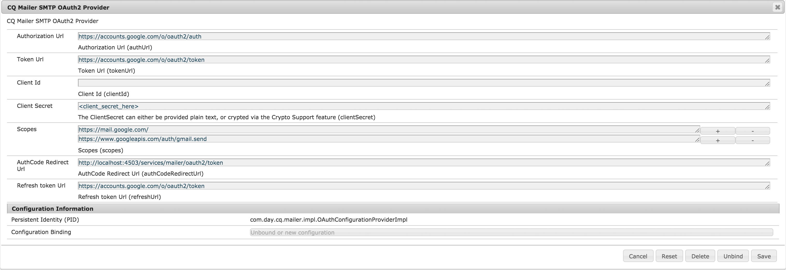
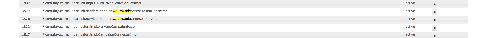

# Konfigurerar e-postmeddelande{#configuring-email-notification}

AEM skickar e-postmeddelanden till användare som:

* Prenumerera på sidhändelser, till exempel ändringar eller replikering. Avsnittet [Meddelandeinkorgen](/help/sites-classic-ui-authoring/author-env-inbox.md#subscribing-to-notifications) beskriver hur du prenumererar på sådana händelser.

* Prenumerera på forumevent.
* Måste utföra ett steg i ett arbetsflöde. Avsnittet [Deltagarsteg](/help/sites-developing/workflows-step-ref.md#participant-step) beskriver hur du utlöser e-postmeddelanden i ett arbetsflöde.

Krav:

* Användaren/användarna måste ha en giltig e-postadress definierad i profilen.
* CQ Mail-tjänsten **för** dagen måste vara korrekt konfigurerad.

När en användare meddelas får han eller hon ett e-postmeddelande på det språk som definieras i hans profil. Varje språk har en egen mall som kan anpassas. Nya e-postmallar kan läggas till för nya språk.

>[!NOTE]
>
>När du arbetar med AEM finns det flera metoder för att hantera konfigurationsinställningarna för sådana tjänster. Mer information och rekommenderade tillvägagångssätt finns i [Konfigurera OSGi](/help/sites-deploying/configuring-osgi.md).

## Konfigurera e-posttjänsten {#configuring-the-mail-service}

För att AEM ska kunna skicka e-postmeddelanden måste **Day CQ Mail Service** vara korrekt konfigurerad. Du kan visa konfigurationen i webbkonsolen. När du arbetar med AEM finns det flera metoder för att hantera konfigurationsinställningarna för sådana tjänster. Mer information och rekommenderade tillvägagångssätt finns i [Konfigurera OSGi](/help/sites-deploying/configuring-osgi.md).

Följande begränsningar gäller:

* **SMTP-serverporten** måste vara 25 eller senare.

* **SMTP-servervärdnamnet** får inte vara tomt.
* **&quot;Från&quot;-adressen** får inte vara tom.

Du kan hjälpa dig att felsöka ett problem med **Day CQ Mail Service** genom att titta på tjänstens loggar:

`com.day.cq.mailer.DefaultMailService`

Konfigurationen ser ut så här i webbkonsolen:


## Konfigurera e-postmeddelandekanalen {#configuring-the-email-notification-channel}

När du prenumererar på en sida eller ett forumhändelsemeddelande ställs e-postadressen in på `no-reply@acme.com` som standard. Du kan ändra det här värdet genom att konfigurera tjänsten **Notification Email Channel** i webbkonsolen.

Om du vill konfigurera from-email-adressen lägger du till en `sling:OsgiConfig`-nod i databasen. Använd följande procedur för att lägga till noden direkt med CRXDE Lite:

1. I CRXDE Lite lägger du till en mapp med namnet `config` under din programmapp.
1. Lägg till en nod med namnet:

   `com.day.cq.wcm.notification.email.impl.EmailChannel` av typen `sling:OsgiConfig`

1. Lägg till en `String`-egenskap i noden `email.from`. Ange den e-postadress som du vill använda som värde.

1. Klicka på **Spara alla**.

Använd följande procedur för att definiera noden i innehållspaketets källmappar:

1. Skapa en fil med namnet `com.day.cq.wcm.notification.email.impl.EmailChannel.xml` i `jcr_root/apps/*app_name*/config folder`

1. Lägg till följande XML för att representera noden:

   `<?xml version="1.0" encoding="UTF-8"?> <jcr:root xmlns:sling="https://sling.apache.org/jcr/sling/1.0" xmlns:jcr="https://www.jcp.org/jcr/1.0" jcr:primaryType="sling:OsgiConfig" email.from="name@server.com"/>`
1. Ersätt värdet för attributet `email.from` ( `name@server.com`) med din e-postadress.

1. Spara filen.

## Konfigurera e-postmeddelandetjänsten för arbetsflöde {#configuring-the-workflow-email-notification-service}

När du får e-postmeddelanden om arbetsflöden anges standardvärden för både from-email-adressen och värd-URL-prefixet. Du kan ändra dessa värden genom att konfigurera **Day CQ Workflow Email Notification Service** i webbkonsolen. Om du gör det bör du behålla ändringen i databasen.

Standardkonfigurationen ser ut så här i webbkonsolen:


### E-postmallar för sidmeddelanden {#email-templates-for-page-notification}

E-postmallar för sidmeddelanden finns nedan:

`/libs/settings/notification-templates/com.day.cq.wcm.core.page`

Standardmallen för engelska ( `en.txt`) definieras så här:

```xml
subject=[CQ Page Event Notification]: Page Event

header=-------------------------------------------------------------------------------------\n \
Time: ${time}\n \
User: ${userFullName} (${userId})\n \
-------------------------------------------------------------------------------------\n\n

message=The following pages were affected by the event: \n \
 \n \
${modifications} \n \
 \n\n
footer=\n \
-------------------------------------------------------------------------------------\n \
This is an automatically generated message. Please do not reply.
```

#### Anpassa e-postmallar för sidmeddelanden {#customizing-email-templates-for-page-notification}

Så här anpassar du den engelska e-postmallen för sidmeddelanden:

1. Öppna filen i CRXDE:

   `/libs/settings/notification-templates/com.day.cq.wcm.core.page/en.txt`

1. Ändra filen efter dina behov.
1. Spara ändringarna.

Mallen måste ha följande format:

```
 subject=<text_1>
 header=<text_2>
 message=<text_3>
 footer=<text_4>
```

Där &lt;text_x> kan vara en blandning av statisk text och dynamiska strängvariabler. Följande variabler kan användas i e-postmallen för sidmeddelanden:

* `${time}`, händelsens datum och tid.

* `${userFullName}`, det fullständiga namnet för användaren som utlöste händelsen.

* `${userId}`, ID:t för användaren som utlöste händelsen.
* `${modifications}`, beskriver sidhändelsens typ och sidsökvägen i formatet:

  &lt;page event type> => &lt;page path>

  Till exempel:

  PageModified => /content/geometrixx/en/products

### E-postmallar för arbetsflödesmeddelanden {#email-templates-for-workflow-notification}

E-postmallen för arbetsflödesmeddelanden (engelska) finns på:

`/libs/settings/workflow/notification/email/default/en.txt`

Den definieras enligt följande:

```xml
subject=Workflow notification: ${event.EventType}

header=-------------------------------------------------------------------------------------\n \
Time: ${event.TimeStamp}\n \
Step: ${item.node.title}\n \
User: ${participant.name} (${participant.id})\n \
Workflow: ${model.title}\n \
-------------------------------------------------------------------------------------\n\n

message=Content: ${host.prefix}${payload.path.open}\n

footer=\n \
-------------------------------------------------------------------------------------\n \
View the overview in your ${host.prefix}/aem/inbox\n \
-------------------------------------------------------------------------------------\n \
This is an automatically generated message. Please do not reply.
```

#### Anpassa e-postmallar för arbetsflödesmeddelanden {#customizing-email-templates-for-workflow-notification}

Så här anpassar du den engelska e-postmallen för meddelanden om arbetsflödeshändelser:

1. Öppna filen i CRXDE:

   `/libs/settings/workflow/notification/email/default/en.txt`

1. Ändra filen efter dina behov.
1. Spara ändringarna.

Mallen måste ha följande format:

```
subject=<text_1>
 header=<text_2>
 message=<text_3>
 footer=<text_4>
```

>[!NOTE]
>
>Där `<text_x>` kan vara en blandning av statisk text och dynamiska strängvariabler. Varje rad i ett `<text_x>`-objekt måste avslutas med ett omvänt snedstreck ( `\`), utom för den sista förekomsten, när frånvaron av omvänt snedstreck anger slutet på strängvariabeln `<text_x>` .
>
>Mer information om mallformatet finns i [javadocs för metoden Properties.load()](https://docs.oracle.com/javase/8/docs/api/java/util/Properties.html#load-java.io.InputStream-).

Metoden `${payload.path.open}` visar sökvägen till arbetsobjektets nyttolast. För en sida i Sites liknar till exempel `payload.path.open` `/bin/wcmcommand?cmd=open&path=…`.; detta är utan servernamnet, vilket är orsaken till att mallen anger detta med `${host.prefix}`.

Följande variabler kan användas i e-postmallen:

* `${event.EventType}`, händelsetyp
* `${event.TimeStamp}`, datum och tid för händelsen
* `${event.User}`, den användare som utlöste händelsen
* `${initiator.home}`, initierarnodens sökväg

* `${initiator.name}`, initierarnamnet

* `${initiator.email}`, initierarens e-postadress
* `${item.id}`, arbetsobjektets ID
* `${item.node.id}`, ID för noden i arbetsflödesmodellen som är associerad med det här arbetsobjektet
* `${item.node.title}`, arbetsobjektets titel
* `${participant.email}`, deltagarens e-postadress
* `${participant.name}`, deltagarens namn
* `${participant.familyName}`, deltagarens familjenamn
* `${participant.id}`, deltagarens ID
* `${participant.language}`, deltagarspråket
* `${instance.id}`, arbetsflödes-ID
* `${instance.state}`, arbetsflödesstatus
* `${model.title}`, arbetsflödesmodellens titel
* `${model.id}`, ID:t för arbetsflödesmodellen

* `${model.version}`, arbetsflödesmodellens version
* `${payload.data}`, nyttolasten

* `${payload.type}`, nyttolasttypen
* `${payload.path}`, nyttolastens sökväg
* `${host.prefix}`, värdprefix, till exempel: `http://localhost:4502`

### Lägga till en e-postmall för ett nytt språk {#adding-an-email-template-for-a-new-language}

Lägga till en mall för ett nytt språk:

1. Lägg till en fil `<language-code>.txt` nedan i CRXDE:

   * `/libs/settings/notification-templates/com.day.cq.wcm.core.page`: för sidmeddelanden
   * `/libs/settings/workflow/notification/email/default`: för arbetsflödesmeddelanden

1. Anpassa filen till språket.
1. Spara ändringarna.

>[!NOTE]
>
>`<language-code>` som används som filnamn för e-postmallen måste vara en språkkod med två bokstäver och gemener som känns igen av AEM. För språkkoder använder AEM ISO-639-1.

## Konfigurera e-postmeddelanden från AEM Assets {#assetsconfig}

När samlingar i AEM Assets delas eller inte delas kan användare få e-postmeddelanden från AEM. Följ de här stegen för att konfigurera e-postmeddelanden.

1. Konfigurera e-posttjänsten enligt beskrivningen ovan i [Konfigurera e-posttjänsten](/help/sites-administering/notification.md#configuring-the-mail-service).
1. Logga in AEM som administratör. Klicka på **Verktyg** > **Åtgärder** > **Webbkonsol** för att öppna webbkonsolkonfigurationen.
1. Redigera **Day CQ DAM Resource Collection-server**. Välj **skicka e-post**. Klicka på **Spara**.

## Konfigurera OAuth {#setting-up-oauth}

AEM erbjuder OAuth2-stöd för den integrerade Mailer-tjänsten, så att organisationer kan följa e-postkraven.

Du kan konfigurera OAuth för flera e-postleverantörer enligt instruktionerna nedan.

>[!NOTE]
>
>Den här proceduren är ett exempel för en Publish-instans. Om du vill aktivera e-postmeddelanden för en författarinstans måste du följa samma steg i författaren.

### Gmail {#gmail}

1. Skapa ditt projekt på `https://console.developers.google.com/projectcreate`
1. Välj ditt projekt och gå sedan till **API:er och tjänster** - **Kontrollpanel - Autentiseringsuppgifter**
1. Konfigurera OAuth-godkännandeskärmen enligt dina krav
1. Lägg till följande två omfång på uppdateringsskärmen:
   * `https://mail.google.com/`
   * `https://www.googleapis.com//auth/gmail.send`
1. När du har lagt till scopen går du tillbaka till **Autentiseringsuppgifter** på den vänstra menyn och går sedan till **Skapa autentiseringsuppgifter** - **OAuth-klient-ID** - **skrivbordsapp**
1. Ett nytt fönster öppnas med klient-ID och Klienthemlighet.
1. Spara dessa autentiseringsuppgifter.

**AEM sidkonfigurationer**

>[!NOTE]
>
>Adobe Managed Service-kunder kan samarbeta med sin kundtjänsttekniker för att göra dessa ändringar i produktionsmiljöerna.

Konfigurera först e-posttjänsten:

1. Öppna AEM webbkonsol genom att gå till `http://serveraddress:serverport/system/console/configMgr`
1. Leta efter och klicka sedan på **Day CQ Mail Service**
1. Lägg till följande inställningar:
   * SMTP-servervärdnamn: `smtp.gmail.com`
   * SMTP-serverport: `25` eller `587`, beroende på kraven
   * Markera kryssrutorna för **SMPT använder StarTLS** och **SMTP kräver StarTLS**
   * Kontrollera **OAuth-flöde** och klicka på **Spara**.

Konfigurera sedan SMTP OAuth-providern genom att följa proceduren nedan:

1. Öppna AEM webbkonsol genom att gå till `http://serveraddress:serverport/system/console/configMgr`
1. Leta efter och klicka sedan på **CQ Mailer SMTP OAuth2 Provider**
1. Fyll i den obligatoriska informationen enligt följande:
   * Autentiserings-URL: `https://accounts.google.com/o/oauth2/auth`
   * Token-URL: `https://accounts.google.com/o/oauth2/token`
   * Omfång: `https://www.googleapis.com/auth/gmail.send` och `https://mail.google.com/`. Du kan lägga till mer än ett omfång genom att trycka på knappen **+** till höger om varje konfigurerat omfång.
   * Klient-ID och klienthemlighet: konfigurera dessa fält med de värden som du hämtade enligt beskrivningen i stycket ovan.
   * Uppdatera token-URL: `https://accounts.google.com/o/oauth2/token`
   * Uppdateringstoken förfaller: aldrig
1. Klicka på **Spara**.

<!-- clarify refresh token expiry, currently not present in the UI -->

När inställningarna har konfigurerats bör de se ut så här:



Aktivera nu OAuth-komponenterna. Du kan göra detta genom att:

1. Gå till komponentkonsolen genom att gå till följande URL: `http://serveraddress:serverport/system/console/components`
1. Leta efter följande komponenter
   * `com.day.cq.mailer.oauth.servlets.handler.OAuthCodeGenerateServlet`
   * `com.day.cq.mailer.oauth.servlets.handler.OAuthCodeAccessTokenGenerator`
1. Tryck på ikonen Spela upp till vänster om komponenterna

   

Bekräfta slutligen konfigurationen genom att:

1. Gå till adressen för Publish-instansen och logga in som administratör.
1. Öppna en ny flik i webbläsaren och gå till `http://serveraddress:serverport/services/mailer/oauth2/authorize`. Detta dirigerar om dig till sidan för din SMTP-leverantör, i det här fallet Gmail.
1. Logga in och godkänn att ge nödvändiga behörigheter
1. När du har gett ditt medgivande lagras denna token i databasen. Du kan komma åt den under `accessToken` genom att gå direkt till den här URL:en på din publiceringsinstans: `http://serveraddress:serverport/crx/de/index.jsp#/conf/global/settings/mailer/oauth`
1. Upprepa ovanstående för varje publiceringsinstans

<!-- clarify if the ip/server address in the last procedure is that of the publish instance -->

### Microsoft Outlook {#microsoft-outlook}

1. Gå till [https://portal.azure.com/](https://portal.azure.com/) och logga in.
1. Sök efter **Azure Active Directory** i sökfältet och klicka på resultatet. Du kan även bläddra direkt till [https://portal.azure.com/#blade/Microsoft_AAD_IAM/ActiveDirectoryMenuBlade/Overview](https://portal.azure.com/#blade/Microsoft_AAD_IAM/ActiveDirectoryMenuBlade/Overview)
1. Klicka på **Appregistrering** - **Ny registrering**

   

1. Fyll i informationen enligt dina krav och klicka sedan på **Registrera**
1. Gå till den nya appen och välj **API-behörigheter**
1. Gå till **Lägg till behörighet** - **Diagrambehörighet** - **Delegerade behörigheter**
1. Välj behörigheterna nedan för din app och klicka sedan på **Lägg till behörighet**:
   * `SMTP.Send`
   * `Mail.Read`
   * `Mail.Send`
   * `openid`
   * `offline_access`
1. Gå till **Autentisering** - **Lägg till en plattform** - **Webb**, och lägg till följande URL i avsnittet **Omdirigerings-URL** för omdirigering av OAuth-koden och tryck sedan på **Konfigurera**:
   * `http://localhost:4503/services/mailer/oauth2/token`
1. Upprepa ovanstående för varje publiceringsinstans
1. Konfigurera inställningarna enligt dina krav
1. Gå sedan till **Certifikat och hemligheter**, klicka på **Ny klienthemlighet** och följ stegen på skärmen för att skapa en hemlighet. Observera denna hemlighet för senare bruk
1. Tryck på **Översikt** i den vänstra rutan och kopiera värdena för **program-ID** och **katalog-ID** för senare bruk

För att kunna göra en sammanfattning måste du ha följande information för att konfigurera OAuth2 för tjänsten Mailer på AEM sida:

* Autentiserings-URL, som skapas med klientorganisations-ID. Det kommer att ha följande formulär: `https://login.microsoftonline.com/<tenantID>/oauth2/v2.0/authorize`
* Token URL, som skapas med klient-ID. Det kommer att ha följande formulär: `https://login.microsoftonline.com/<tenantID>/oauth2/v2.0/token`
* Uppdaterings-URL:en som skapas med klient-ID:t. Det kommer att ha följande formulär: `https://login.microsoftonline.com/<tenantID>/oauth2/v2.0/token`
* Klient-ID
* Klienthemlighet

**AEM sidkonfigurationer**

Integrera sedan dina OAuth2-inställningar med AEM:

1. Gå till webbkonsolen för den lokala instansen genom att bläddra till `http://serveraddress:serverport/system/console/configMgr`
1. Leta efter och klicka på **Day CQ Mail Service**
1. Lägg till följande inställningar:
   * SMTP-servervärdnamn: `smtp.office365.com`
   * SMTP-användare: ditt användarnamn i e-postformat
   * &quot;Från&quot;-adress: Den e-postadress som ska användas i fältet &quot;Från:&quot; i meddelanden som skickas av e-postavsändaren
   * SMTP-serverport: `25` eller `587` beroende på kraven
   * Markera kryssrutorna för **SMPT använder StarTLS** och **SMTP kräver StarTLS**
   * Kontrollera **OAuth-flöde** och klicka på **Spara**.
1. Leta efter och klicka sedan på **CQ Mailer SMTP OAuth2 Provider**
1. Fyll i den obligatoriska informationen enligt följande:
   * Fyll i auktoriserings-URL:en, token-URL:en och uppdatera token-URL:en genom att skapa dem enligt beskrivningen i [slutet av proceduren](#microsoft-outlook)
   * Klient-ID och klienthemlighet: konfigurera dessa fält med de värden som du hämtade enligt beskrivningen ovan.
   * Lägg till följande scope i konfigurationen:
      * open
      * offline_access
      * `https://outlook.office365.com/Mail.Send`
      * `https://outlook.office365.com/Mail.Read`
      * `https://outlook.office365.com/SMTP.Send`
   * Omdirigerings-URL för AuthCode: `http://localhost:4503/services/mailer/oauth2/token`
   * Uppdatera token-URL: detta ska ha samma värde som token-URL:en ovan
1. Klicka på **Spara**.

När inställningarna har konfigurerats bör de se ut så här:


Aktivera nu OAuth-komponenterna. Du kan göra detta genom att:

1. Gå till komponentkonsolen genom att gå till följande URL: `http://serveraddress:serverport/system/console/components`
1. Leta efter följande komponenter
   * `com.day.cq.mailer.oauth.servlets.handler.OAuthCodeGenerateServlet`
   * `com.day.cq.mailer.oauth.servlets.handler.OAuthCodeAccessTokenGenerator`
1. Tryck på ikonen Spela upp till vänster om komponenterna


Bekräfta slutligen konfigurationen genom att:

1. Gå till adressen för Publish-instansen och logga in som administratör.
1. Öppna en ny flik i webbläsaren och gå till `http://serveraddress:serverport/services/mailer/oauth2/authorize`. Detta dirigerar om dig till sidan för din SMTP-leverantör, i det här fallet Outlook.
1. Logga in och godkänn att ge nödvändiga behörigheter
1. När du har gett ditt medgivande lagras denna token i databasen. Du kan komma åt den under `accessToken` genom att gå direkt till den här URL:en på din publiceringsinstans: `http://serveraddress:serverport/crx/de/index.jsp#/conf/global/settings/mailer/oauth`
