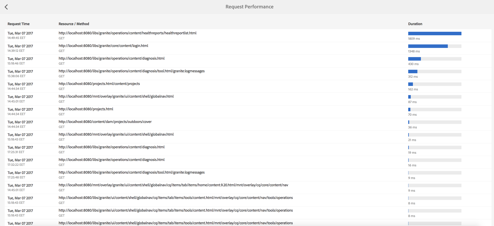
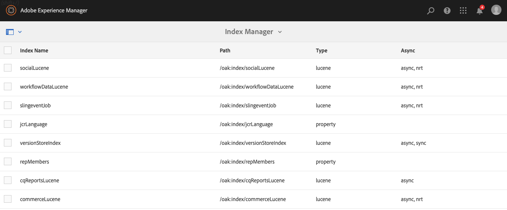

# Instrumentpanel för åtgärder {#operations-dashboard}

## Introduktion {#introduction}

På Operations Dashboard i AEM 6 kan systemansvariga snabbt övervaka AEM-systemets hälsa. Den innehåller även automatiskt genererad diagnos om relevanta aspekter av AEM och gör det möjligt att konfigurera och köra självständig automatisering av underhåll för att minska projektdriften och supportärenden avsevärt. Kontrollpanelen för åtgärder kan utökas med anpassade hälsokontroller och underhållsuppgifter. Data från Operations Dashboard kan dessutom nås från externa övervakningsverktyg via JMX.

**Kontrollpanelen för åtgärder:**

* Är en enklicksstatus som hjälper verksamhetstjänsterna att bli effektivare
* Ger en översikt över systemets hälsa på en central plats
* Minskar tiden för att hitta, analysera och åtgärda problem
* Automatisering av underhåll som kan minska projektkostnaderna avsevärt

Du kommer åt den genom att gå till **Verktyg** - **Åtgärder** från AEM-välkomstskärmen.

>[!NOTE]
>
>För att kunna komma åt Operations Dashboard måste den inloggade användaren vara en del av användargruppen Operators. Mer information finns i dokumentationen om [Användare, Grupp och Behörighetsadministration](/help/sites-administering/user-group-ac-admin.md).

## Hälsorapporter {#health-reports}

I systemet för hälsorapporter finns information om hälsa för en AEM-instans genom Sling Health Checks. Detta kan göras antingen via OSGI, JMX, HTTP-begäranden (via JSON) eller via Touch-gränssnittet. Den erbjuder mått och tröskelvärden för vissa konfigurerbara räknare och ger i vissa fall information om hur problemet kan lösas.

Den har flera funktioner som beskrivs nedan.

## Hälsokontroller {#health-checks}

**Hälsorapporterna** är ett kortsystem som anger god eller dålig hälsa med avseende på ett visst produktområde. Dessa kort är visualiseringar av Sling Health Checks, som samlar in data från JMX och andra källor och visar bearbetad information igen som MBeans. Dessa MBeans kan också inspekteras i [JMX-webbkonsolen](/help/sites-administering/jmx-console.md), under domänen **org.apache.sling.healthCheck** .

Gränssnittet Hälsorapporter finns på **Verktyg** - **Åtgärder** - **Hälsorapporter** på AEM-välkomstskärmen, eller direkt via följande URL:

`https://<serveraddress>:port/libs/granite/operations/content/healthreports/healthreportlist.html`


Kortsystemet visar tre möjliga lägen: **OK**, **VARNA** och **KRITISK**. Lägen är ett resultat av regler och tröskelvärden, som kan konfigureras genom att du håller muspekaren över kortet och sedan klickar på kugghjulsikonen i åtgärdsfältet:


### Typ av hälsokontroll {#health-check-types}

Det finns två typer av hälsokontroller i AEM 6:

1. Individuella hälsokontroller
1. Sammansatta hälsokontroller

En **enskild hälsokontroll** är en enda hälsokontroll som motsvarar ett statuskort. Enskilda hälsokontroller kan konfigureras med regler eller tröskelvärden och de kan ge ett eller flera tips och länkar för att lösa identifierade hälsoproblem. Låt oss ta kontrollen &quot;Loggfel&quot; som ett exempel: Om det finns FEL-poster i instansloggarna finns de på informationssidan i hälsokontrollen. Längst upp på sidan finns en länk till &quot;Loggmeddelandeanalyseraren&quot; i avsnittet Diagnosverktyg, där du kan analysera felen mer ingående och konfigurera om loggarna.

En **sammansatt hälsokontroll** är en kontroll som samlar in information från flera enskilda kontroller.

Sammansatta hälsokontroller konfigureras med hjälp av **filtertaggar**. Alla enskilda kontroller som har samma filtertagg grupperas alltså som en sammansatt hälsokontroll. En sammansatt hälsokontroll har bara OK-status om alla de enskilda kontrollerna också har OK-status.

### Så här skapar du hälsokontroller {#how-to-create-health-checks}

På kontrollpanelen för åtgärder kan du visualisera resultatet av både individuella och sammansatta hälsokontroller.

### Skapa en enskild hälsokontroll {#creating-an-individual-health-check}

Du skapar en enskild hälsokontroll i två steg: implementera en kontroll av skickningshälsa och lägga till en post för hälsokontrollen på instrumentpanelens konfigurationsnoder.

1. För att kunna skapa en Sling Health Check måste du skapa en OSGI-komponent som implementerar Sling HealthCheck-gränssnittet. Du lägger till den här komponenten i ett paket. Komponentens egenskaper identifierar hälsokontrollen fullständigt. När komponenten har installerats skapas en JMX MBean automatiskt för hälsokontrollen. Mer information finns i dokumentationen om [hälsokontroll](https://sling.apache.org/documentation/bundles/sling-health-check-tool.html) vid sjösling.

   Exempel på en Sling Health Check-komponent, skriven med OSGI-tjänstkomponentanteckningar:

   ```java
   @Component(service = HealthCheck.class,
   property = {
       HealthCheck.NAME + "=Example Check",
       HealthCheck.TAGS + "=example",
       HealthCheck.TAGS + "=test",
       HealthCheck.MBEAN_NAME + "=exampleHealthCheckMBean"
   })
    public class ExampleHealthCheck implements HealthCheck {
       @Override
       public Result execute() {
           // health check code
       }
    }
   ```

   >[!NOTE]
   >
   >Egenskapen definierar `MBEAN_NAME` namnet på den böna som ska genereras för den här hälsokontrollen.

1. När du har skapat en hälsokontroll måste en ny konfigurationsnod skapas för att den ska bli tillgänglig i gränssnittet för kontrollpanelen för åtgärder. I det här steget måste du känna till JMX-namnet på hälsokontrollen (egenskapen `MBEAN_NAME` ). Om du vill skapa en konfiguration för hälsokontrollen öppnar du CRXDE och lägger till en ny nod (av typen **nt:unsigned**) under följande sökväg: `/apps/settings/granite/operations/hc`

   Följande egenskaper ska anges för den nya noden:

   * **** Namn: `sling:resourceType`

      * **** Typ: `String`
      * **** Värde: `granite/operations/components/mbean`
   * **** Namn: `resource`

      * **** Typ: `String`
      * **** Värde: `/system/sling/monitoring/mbeans/org/apache/sling/healthcheck/HealthCheck/exampleHealthCheck`
   >[!NOTE]
   >
   >Resurssökvägen ovan skapas enligt följande: Om huvudnamnet för din hälsokontroll är &quot;test&quot; lägger du till &quot;test&quot; i slutet av sökvägen `/system/sling/monitoring/mbeans/org/apache/sling/healthcheck/HealthCheck`
   >
   >Så den sista vägen blir:
   >
   >`/system/sling/monitoring/mbeans/org/apache/sling/healthcheck/HealthCheck/test`

   >[!NOTE]
   >
   >Kontrollera att följande egenskaper har angetts till true för `/apps/settings/granite/operations/hc` sökvägen:
   >
   >
   >`sling:configCollectionInherit`
   >
   >`sling:configPropertyInherit`
   >
   >
   >Detta anger för konfigurationshanteraren att sammanfoga de nya konfigurationerna med de befintliga från `/libs`.

### Skapa en sammansatt hälsokontroll {#creating-a-composite-health-check}

En sammansatt hälsokontroll har till uppgift att sammanställa ett antal enskilda hälsokontroller som delar en uppsättning gemensamma funktioner. Den sammansatta hälsokontrollen för Säkerhet grupperar till exempel alla enskilda hälsokontroller som utför säkerhetsrelaterade kontroller. Det första steget för att skapa en sammansatt kontroll är att lägga till en ny OSGI-konfiguration. För att den ska kunna visas på kontrollpanelen för åtgärder måste en ny konfigurationsnod läggas till, på samma sätt som vi gjorde för en enkel kontroll.

1. Gå till Web Configuration Manager i OSGI-konsolen. Du kan göra detta genom att gå till `https://serveraddress:port/system/console/configMgr`
1. Sök efter posten **Apache Sling Composite Health Check**. Observera att det redan finns två konfigurationer när du har hittat den: en för systemkontrollerna och en annan för säkerhetskontrollerna.
1. Skapa en ny konfiguration genom att trycka på plusknappen (+) till höger om konfigurationen. Ett nytt fönster visas enligt nedan:

   

1. Skapa en konfiguration och spara den. En böna kommer att skapas med den nya konfigurationen.

   Syftet med varje konfigurationsegenskap är följande:

   * **** Namn (hc.name): Namnet på den sammansatta hälsokontrollen. Ett beskrivande namn rekommenderas.
   * **** Taggar (hc.tags): Taggarna för den här hälsokontrollen. Om den här sammansatta hälsokontrollen är avsedd att ingå i en annan sammansatt hälsokontroll (till exempel i en hierarki av hälsokontroller) lägger du till de taggar som den sammansatta kontrollen är relaterad till.
   * **** MBean-namn (hc.mbean.name): Namnet på den böna som ska ges till JMX MBean för den här sammansatta hälsokontrollen.
   * **** Filtertaggar (filter.tags): Detta är en egenskap som är specifik för sammansatta hälsokontroller. Det här är de taggar som det sammansatta objektet ska aggregera. Den sammansatta hälsokontrollen sammanfogas under sin grupp med alla hälsokontroller som har en tagg som matchar någon av filtertaggarna i den sammansatta samlingen. En sammansatt hälsokontroll med filtertaggarna **test** och **check** sammanställer till exempel alla enskilda och sammansatta hälsokontroller som har någon av **test** - och **check** -taggarna i taggegenskapen ( `hc.tags`).
   >[!NOTE]
   >
   >En ny JMX Mbean skapas för varje ny konfiguration av den sammansatta hälsokontrollen för Apache Sling.**

1. Slutligen måste posten för den sammansatta hälsokontrollen som precis har skapats läggas till i konfigurationsnoderna för kontrollpanelen för åtgärder. Förfarandet för detta är detsamma som för individuella hälsokontroller: en nod av typen **nt:undefined** måste skapas under `/apps/settings/granite/operations/hc`. Egenskapen resource för noden definieras av värdet för **hc.ean.name** i OSGI-konfigurationen.

   Om du till exempel har skapat en konfiguration och angett värdet **hc.mbean.name** till **diskus ålder**, ser konfigurationsnoderna ut så här:

   * **** Namn: `Composite Health Check`

      * **** Typ: `nt:unstructured`
   Med följande egenskaper:

   * **** Namn: `sling:resourceType`

      * **** Typ: `String`
      * **** Värde: `granite/operations/components/mbean`
   * **** Namn: `resource`

      * **** Typ: `String`
      * **** Värde: `/system/sling/monitoring/mbeans/org/apache/sling/healthcheck/HealthCheck/diskusage`
   >[!NOTE]
   >
   >Om du skapar enskilda hälsokontroller som logiskt sett hör till en sammansatt kontroll som redan finns på kontrollpanelen som standard, hämtas de automatiskt och grupperas under respektive sammansatta kontroll. På grund av detta behöver du inte skapa en ny konfigurationsnod för dessa kontroller.
   >
   >Om du till exempel skapar en enskild säkerhetshälsokontroll behöver du bara tilldela den taggen &quot;**security**&quot;, och den är installerad, så visas den automatiskt under den sammansatta kontrollen Säkerhetskontroller på kontrollpanelen för åtgärder.

### Hälsokontroller som tillhandahålls med AEM {#health-checks-provided-with-aem}

<table>
 <tbody>
  <tr>
   <td><strong>zHealthcheck-namn</strong></td>
   <td><strong>Beskrivning</strong></td>
  </tr>
  <tr>
   <td>Frågeprestanda</td>
   <td><p>Den här hälsokontrollen förenklades <strong>i AEM 6.4</strong>och kontrollerar nu det nyligen omgjorda <code>Oak QueryStats</code> MBean, närmare bestämt <code>SlowQueries </code>attributet. Om statistiken innehåller långsamma frågor returnerar hälsokontrollen en varning. Annars returneras OK-statusen.<br /> </p> <p>MBean för den här hälsokontrollen är <a href="http://localhost:4502/system/console/jmx/org.apache.sling.healthcheck%3Aname%3DqueriesStatus%2Ctype%3DHealthCheck">org.apache.sling.healthCheck:name=queriesStatus,type=HealthCheck</a>.</p> </td>
  </tr>
  <tr>
   <td>Längd på observationskö</td>
   <td><p>Längden på observationskön itererar över alla händelseavlyssnare och bakgrundsobservrar, jämför deras <code>queueSize </code>med <code>maxQueueSize</code> och:</p>
    <ul>
     <li>returnerar Kritisk status om <code>queueSize</code> värdet överstiger <code>maxQueueSize</code> värdet (det vill säga när händelser tas bort)</li>
     <li>returnerar Varna om <code>queueSize</code> värdet är över <code>maxQueueSize * WARN_THRESHOLD</code> (standardvärdet är 0,75) </li>
    </ul> <p>Den maximala längden för varje kö kommer från separata konfigurationer (Oak och AEM) och kan inte konfigureras från den här hälsokontrollen. MBean för den här hälsokontrollen är <a href="http://localhost:4502/system/console/jmx/org.apache.sling.healthcheck%3Aname%3DObservationQueueLengthHealthCheck%2Ctype%3DHealthCheck">org.apache.sling.healthCheck:name=ObservationQueueLengthHealthCheck,type=HealthCheck</a>.</p> </td>
  </tr>
  <tr>
   <td>Gränser för genomgång av frågor</td>
   <td><p>Gränser för genomsökning av frågor kontrollerar <code>QueryEngineSettings</code> MBean, närmare bestämt attributen <code>LimitInMemory</code> och <code>LimitReads</code> , och returnerar följande status:</p>
    <ul>
     <li>returnerar varningsstatus om en av gränserna är lika med eller högre än <code>Integer.MAX_VALUE</code></li>
     <li>returnerar Warn-status om en av gränserna är lägre än 10000 (den rekommenderade inställningen från Oak)</li>
     <li>returnerar statusen Kritisk om det inte går att hämta <code>QueryEngineSettings</code> eller något av gränserna</li>
    </ul> <p>Mönstret för den här hälsokontrollen är <a href="http://localhost:4502/system/console/jmx/org.apache.sling.healthcheck%3Aname%3DqueryTraversalLimitsBundle%2Ctype%3DHealthCheck">org.apache.sling.healthCheck:name=queryTraversalLimitsBundle,type=HealthCheck</a>.</p> </td>
  </tr>
  <tr>
   <td>Synkroniserade klockor</td>
   <td><p>Den här kontrollen gäller endast för <a href="https://github.com/apache/sling-old-svn-mirror/blob/4df9ab2d6592422889c71fa13afd453a10a5a626/bundles/extensions/discovery/oak/src/main/java/org/apache/sling/discovery/oak/SynchronizedClocksHealthCheck.java">dokumentnodore-kluster</a>. Den returnerar följande status:</p>
    <ul>
     <li>returnerar Warn-status när instansklockorna inte är synkroniserade och går över ett fördefinierat lågt tröskelvärde</li>
     <li>returnerar statusen Kritisk när instansklockorna inte är synkroniserade och går över ett fördefinierat högt tröskelvärde</li>
    </ul> <p>Mönstret för den här hälsokontrollen är <a href="http://localhost:4502/system/console/jmx/org.apache.sling.healthcheck%3Aname%3DslingDiscoveryOakSynchronizedClocks%2Ctype%3DHealthCheck">org.apache.sling.healthCheck:name=slingDiscoveryOakSynchronizedClocks,type=HealthCheck</a>.</p> </td>
  </tr>
  <tr>
   <td>Asynkrona index</td>
   <td><p>Kontrollen Asynkrona index:</p>
    <ul>
     <li>returnerar Kritisk status om minst ett indexeringsfält misslyckas</li>
     <li>söker efter alla <code>lastIndexedTime</code> indexeringsbanor och:
      <ul>
       <li>returnerar Kritisk status om det är mer än 2 timmar sedan </li>
       <li>returnerar varningsstatus om det är mellan 2 timmar och 45 minuter sedan </li>
       <li>returnerar OK-status om det är mindre än 45 minuter sedan </li>
      </ul> </li>
     <li>om inget av dessa villkor uppfylls returneras OK-statusen</li>
    </ul> <p>Både statuströskelvärdena Kritisk och Varna är konfigurerbara. Mönstret för den här hälsokontrollen är <a href="http://localhost:4502/system/console/jmx/org.apache.sling.healthcheck%3Aname%3DasyncIndexHealthCheck%2Ctype%3DHealthCheck">org.apache.sling.healthCheck:name=asyncIndexHealthCheck,type=HealthCheck</a>.</p> <p><strong>Obs! Den </strong>här hälsokontrollen är tillgänglig med AEM 6.4 och har backporterats till AEM 6.3.0.1.</p> </td>
  </tr>
  <tr>
   <td>Stora Lucene-index</td>
   <td><p>Den här kontrollen använder data som exponeras av <code>Lucene Index Statistics</code> MBean för att identifiera stora index och returnerar:</p>
    <ul>
     <li>en varningsstatus om det finns ett index med mer än 1 miljard dokument</li>
     <li>en kritisk status om det finns ett index med mer än 1,5 miljarder dokument</li>
    </ul> <p>Tröskelvärdena kan konfigureras och MBean för hälsokontrollen är <a href="http://localhost:4502/system/console/jmx/org.apache.sling.healthcheck%3Aname%3DlargeIndexHealthCheck%2Ctype%3DHealthCheck">org.apache.sling.hälsocheck:name=largeIndexHealthCheck,type=HealthCheck.</a></p> <p><strong>Obs! Den </strong>här kontrollen är tillgänglig med AEM 6.4 och har backporterats till AEM 6.3.2.0.</p> </td>
  </tr>
  <tr>
   <td>Systemunderhåll</td>
   <td><p>Systemunderhåll är en sammansatt kontroll som returnerar OK om alla underhållsåtgärder körs som de är konfigurerade. Kom ihåg att:</p>
    <ul>
     <li>varje underhållsåtgärd åtföljs av en tillhörande hälsokontroll</li>
     <li>Om en uppgift inte läggs till i ett underhållsfönster returneras den kritiska hälsokontrollen</li>
     <li>du måste konfigurera underhållsaktiviteterna Granskningslogg och Arbetsflödestömning eller på annat sätt ta bort dem från underhållsfönstren. Om de inte konfigureras kommer dessa uppgifter att misslyckas vid den första körningen, så systemunderhållskontrollen returnerar statusen Kritisk.</li>
     <li><strong>Med AEM 6.4</strong>görs också en kontroll av underhållsuppgiften <a href="/help/sites-administering/operations-dashboard.md#automated-maintenance-tasks">Lucene Binaries</a> .</li>
     <li>på AEM 6.2 och lägre returnerar systemunderhållskontrollen en varningsstatus direkt efter start eftersom aktiviteterna aldrig körs. Från och med 6.3 returneras OK om det första underhållet inte har nåtts än.</li>
    </ul> <p>MBean för den här hälsokontrollen är <a href="http://localhost:4502/system/console/jmx/org.apache.sling.healthcheck%3Aname%3Dsystemchecks%2Ctype%3DHealthCheck">org.apache.sling.healthCheck:name=systemchecks,type=HealthCheck</a>.</p> </td>
  </tr>
  <tr>
   <td>Replikeringskö</td>
   <td><p>Den här kontrollen itererar över replikeringsagenter och tittar på deras köer. För objektet högst upp i kön kontrolleras hur många gånger agenten försökte replikera på nytt. Om agenten försökte replikera igen mer än värdet för <code>numberOfRetriesAllowed</code> parametern returneras en varning. Parametern <code>numberOfRetriesAllowed</code> kan konfigureras. </p> <p>Mbean för den här hälsokontrollen är <a href="http://localhost:4502/system/console/jmx/org.apache.sling.healthcheck%3Aname%3DreplicationQueue%2Ctype%3DHealthCheck" target="_blank">org.apache.sling.healthCheck:name=replicationQueue,type=HealthCheck</a>.</p> </td>
  </tr>
  <tr>
   <td>Försäljningsjobb</td>
   <td>
    <div>
      Sling Jobs kontrollerar antalet jobb som köas i JobManager, jämför det med <code>maxNumQueueJobs</code> tröskelvärdet och:
    </div>
    <ul>
     <li>returnerar Kritisk om mer än <code>maxNumQueueJobs</code> finns i kön</li>
     <li>returnerar Kritisk om det finns aktiva jobb som körs länge och är äldre än 1 timme</li>
     <li>returnerar Kritisk om det finns jobb i kö och den senaste slutförda jobbtiden är äldre än 1 timme</li>
    </ul> <p>Endast parametern för maximalt antal jobb i kö kan konfigureras och har standardvärdet 1 000.</p> <p>MBean för den här hälsokontrollen är <a href="http://localhost:4502/system/console/jmx/org.apache.sling.healthcheck%3Aname%3DslingJobs%2Ctype%3DHealthCheck" target="_blank">org.apache.sling.healthCheck:name=slingJobs,type=HealthCheck</a>.</p> </td>
  </tr>
  <tr>
   <td>Begär prestanda</td>
   <td><p>Den här kontrollen tittar på <code>granite.request.metrics.timer</code> Sling-måttet <a href="http://localhost:4502/system/console/slingmetrics" target="_blank"></a>och:</p>
    <ul>
     <li>returnerar Kritisk om det 75:e percentilvärdet överstiger det kritiska tröskelvärdet (standardvärdet är 500 millisekunder)</li>
     <li>returnerar Varna om det 75:e percentilvärdet överstiger varningströskeln (standardvärdet är 200 millisekunder)</li>
    </ul> <p>Mbean för den här hälsokontrollen är<em> org.apache.sling.healthCheck:name=requestsStatus,type=HealthCheck </em><a href="http://localhost:4502/system/console/jmx/org.apache.sling.healthcheck%3Aname%3DrequestsStatus%2Ctype%3DHealthCheck" target="_blank"></a>.</p> </td>
  </tr>
  <tr>
   <td>Loggfel</td>
   <td><p>Den här kontrollen returnerar varningsstatus om loggen innehåller fel.</p> <p>MBean för den här hälsokontrollen är <a href="http://localhost:4502/system/console/jmx/org.apache.sling.healthcheck%3Aname%3DlogErrorHealthCheck%2Ctype%3DHealthCheck" target="_blank">org.apache.sling.healthCheck:name=logErrorHealthCheck,type=HealthCheck</a>.</p> </td>
  </tr>
  <tr>
   <td>Diskutrymme</td>
   <td><p>Kontrollen av diskutrymme söker på <code>FileStoreStats</code> MBean, hämtar storleken på nodarkivet och mängden användbart diskutrymme på nodlagringspartitionen och:</p>
    <ul>
     <li>returnerar Varna om det tillgängliga diskutrymmet till databasstorleken är mindre än varningströskeln (standardvärdet är 10)</li>
     <li>returnerar Kritisk om det användbara diskutrymmet till databasstorleken är mindre än det kritiska tröskelvärdet (standardvärdet är 2)</li>
    </ul> <p>Båda tröskelvärdena kan konfigureras. Kontrollen fungerar bara på instanser med ett segmentlager.</p> <p>Mbean för den här hälsokontrollen är <a href="http://localhost:4502/system/console/jmx/org.apache.sling.healthcheck%3Aname%3DDiskSpaceHealthCheck%2Ctype%3DHealthCheck" target="_blank">org.apache.sling.healthCheck:name=DiskSpaceHealthCheck,type=HealthCheck</a>.</p> </td>
  </tr>
  <tr>
   <td>Hälsokontroll för schemaläggare</td>
   <td><p>Den här kontrollen returnerar en varning om instansen har Quartz-jobb som körs i mer än 60 sekunder. Tröskelvärdet för acceptabel varaktighet kan konfigureras.</p> <p>Mbean för den här hälsokontrollen är <a href="http://localhost:4502/system/console/jmx/org.apache.sling.healthcheck%3Aname%3DslingCommonsSchedulerHealthCheck%2Ctype%3DHealthCheck" target="_blank">org.apache.sling.healthCheck:name=slingCommonsSchedulerHealthCheck,type=HealthCheck</a><em>.</em></p> </td>
  </tr>
  <tr>
   <td>Säkerhetskontroller</td>
   <td><p>Säkerhetskontrollen är en sammansatt kontroll som sammanställer resultaten av flera säkerhetsrelaterade kontroller. Dessa individuella hälsokontroller tar upp andra problem än checklistan för säkerhet som finns på dokumentationssidan för <a href="/help/sites-administering/security-checklist.md">checklistan.</a> Kontrollen är användbar som säkerhetsröktest när instansen startas. </p> <p>MBean för den här hälsokontrollen är <a href="http://localhost:4502/system/console/jmx/org.apache.sling.healthcheck%3Aname%3Dsecuritychecks%2Ctype%3DHealthCheck" target="_blank">org.apache.sling.healthCheck:name=</a><a href="http://localhost:4502/system/console/jmx/org.apache.sling.healthcheck%3Aname%3Dsecuritychecks%2Ctype%3DHealthCheck" target="_blank"></a><a href="http://localhost:4502/system/console/jmx/org.apache.sling.healthcheck%3Aname%3Dsecuritychecks%2Ctype%3DHealthCheck" target="_blank"></a><a href="http://localhost:4502/system/console/jmx/org.apache.sling.healthcheck%3Aname%3Dsecuritychecks%2Ctype%3DHealthCheck" target="_blank">securityChecks,type=HealthCheck</a></p> </td>
  </tr>
  <tr>
   <td>Aktiva paket</td>
   <td><p>Active Bundles kontrollerar statusen för alla paket och:</p>
    <ul>
     <li>returnerar Warn-status om något av paketen inte är aktivt eller (med start, med lat aktivering)</li>
     <li>ignorerar paketens status i ignoreringslistan</li>
    </ul> <p>Parametern för ignoreringslistan kan konfigureras.</p> <p>MBean för den här hälsokontrollen är <a href="http://localhost:4502/system/console/jmx/org.apache.sling.healthcheck%3Aname%3DinactiveBundles%2Ctype%3DHealthCheck" target="_blank">org.apache.sling.healthCheck:name=inactiveBundles,type=HealthCheck</a>.</p> </td>
  </tr>
  <tr>
   <td>Kontroll av kodcache</td>
   <td><p>Det här är en hälsokontroll som verifierar flera JVM-villkor som kan utlösa ett CodeCache-fel i Java 7:</p>
    <ul>
     <li>returnerar Varna om instansen körs på Java 7, med tömning av kodcache aktiverat</li>
     <li>returnerar Varna om instansen körs på Java 7 och storleken på den reserverade kodcachen är mindre än ett minimitröskelvärde (standardvärdet är 90 MB)</li>
    </ul> <p>Tröskelvärdet kan konfigureras <code>minimum.code.cache.size</code> . Mer information om felet <a href="https://bugs.java.com/bugdatabase/view_bug.do?bug_id=8012547">finns</a><a href="https://bugs.java.com/bugdatabase/view_bug.do?bug_id=8012547"></a><a href="https://bugs.java.com/bugdatabase/view_bug.do?bug_id=8012547"></a><a href="https://bugs.java.com/bugdatabase/view_bug.do?bug_id=8012547"> på den här sidan</a>.</p> <p>MBean för den här hälsokontrollen är <a href="http://localhost:4502/system/console/jmx/org.apache.sling.healthcheck%3Aname%3DcodeCacheHealthCheck%2Ctype%3DHealthCheck" target="_blank">org.apache.sling.healthCheck:name=codeCacheHealthCheck,type=HealthCheck</a>.</p> </td>
  </tr>
  <tr>
   <td>Sökvägsfel för resurssökning</td>
   <td><p>Kontrollerar om det finns några resurser i sökvägen <code>/apps/foundation/components/primary</code> och:</p>
    <ul>
     <li>returnerar Varna om det finns underordnade noder under <code>/apps/foundation/components/primary</code></li>
    </ul> <p>Mbean för den här hälsokontrollen är <a href="http://localhost:4502/system/console/jmx/org.apache.sling.healthcheck%3Aname%3DresourceSearchPathErrorHealthCheck%2Ctype%3DHealthCheck" target="_blank">org.apache.sling.healthCheck:name=resourceSearchPathErrorHealthCheck,type=HealthCheck</a>.</p> </td>
  </tr>
 </tbody>
</table>

## Övervakning med Nagios {#monitoring-with-nagios}

Kontrollpanelen för hälsokontroll kan integreras med Nagios via Granite JMX Mbeans. I följande exempel visas hur du lägger till en kontroll som visar hur mycket minne som används på servern som kör AEM.

1. Installera och installera Nagios på övervakningsservern.
1. Installera sedan Nagios Remote Plugin Executor (NRPE).

   >[!NOTE]
   >
   >Mer information om hur du installerar Nagios och NRPE i ditt system finns i [Nagios-dokumentationen](https://library.nagios.com/library/products/nagioscore/manuals/).

1. Lägg till en värddefinition för AEM-servern. Detta kan göras via webbgränssnittet för Nagios XI med hjälp av Configuration Manager:

   1. Öppna en webbläsare och peka på Nagios-servern.
   1. Tryck på knappen **Konfigurera** i den övre menyn.
   1. I den vänstra rutan trycker du på **Core Config Manager** under **Advanced Configuration**.
   1. Tryck på länken **Värdar** under **övervakningsavsnittet** .
   1. Lägg till värddefinitionen:
   

   Nedan visas ett exempel på en värdkonfigurationsfil, om du använder Nagios Core:

   ```xml
   define host {
      address 192.168.0.5
      max_check_attempts 3
      check_period 24x7
      check-command check-host-alive
      contacts admin
      notification_interval 60
      notification_period 24x7
   }
   ```

1. Installera Nagios och NRPE på AEM-servern.
1. Installera plugin-programmet [check_http_json](https://github.com/phrawzty/check_http_json) på båda servrarna.
1. Definiera ett generiskt JSON-kontrollkommando på båda servrarna:

   ```xml
   define command{
   
       command_name    check_http_json-int
   
       command_line    /usr/lib/nagios/plugins/check_http_json --user "$ARG1$" --pass "$ARG2$" -u 'https://$HOSTNAME$:$ARG3$/$ARG4$' -e '$ARG5$' -w '$ARG6$' -c '$ARG7$'
   
   }
   ```

1. Lägg till en tjänst för använt minne på AEM-servern:

   ```xml
   define service {
   
       use generic-service
   
       host_name my.remote.host
   
       service_description AEM Author Used Memory
   
       check_command  check_http_json-int!<cq-user>!<cq-password>!<cq-port>!system/sling/monitoring/mbeans/java/lang/Memory.infinity.json!{noname}.mbean:attributes.HeapMemoryUsage.mbean:attributes.used.mbean:value!<warn-threshold-in-bytes>!<critical-threshold-in-bytes>
   
       }
   ```

1. Kontrollera din Nagios-instrumentpanel för den nya tjänsten:

   

## Diagnosverktyg {#diagnosis-tools}

Kontrollpanelen för åtgärder ger även tillgång till diagnosverktyg som kan hjälpa dig att hitta och felsöka grundorsaker till varningarna från kontrollpanelen för hälsokontroll samt tillhandahålla viktig felsökningsinformation för systemoperatorer.

Bland de viktigaste funktionerna finns:

* En loggmeddelandeanalyserare
* Möjlighet att komma åt stackar och tråddumpar
* Begäranden och frågeprestandaanalyser

Du kan nå skärmen Diagnosverktyg genom att gå till **Verktyg - Åtgärder - Diagnos** från AEM-välkomstskärmen. Du kan även få åtkomst till skärmen via följande URL: `https://serveraddress:port/libs/granite/operations/content/diagnosis.html`


### Loggmeddelanden {#log-messages}

Loggmeddelandena Användargränssnittet visar som standard alla FELmeddelanden. Om du vill att fler loggmeddelanden ska visas måste du konfigurera en loggare med rätt loggnivå.

Loggmeddelandena använder ett tillägg i minnesloggen och är därför inte relaterade till loggfilerna. En annan konsekvens är att om du ändrar loggnivåerna i det här användargränssnittet ändras inte den information som loggas i de traditionella loggfilerna. Om du lägger till och tar bort loggare i det här användargränssnittet påverkas bara loggen i minnet. Observera också att ändringar av loggningskonfigurationerna kommer att återspeglas i framtiden för minnesloggen. De poster som redan är loggade och inte längre är relevanta tas inte bort, men liknande poster kommer inte att loggas i framtiden.

Du kan konfigurera vad som loggas genom att tillhandahålla loggkonfigurationer från den övre vänstra kugghjulsknappen i användargränssnittet. Där kan du lägga till, ta bort eller uppdatera loggkonfigurationer. En loggkonfiguration består av en **loggnivå** (WARN/INFO/DEBUG) och ett **filternamn**. Filternamnet **** filtrerar källan för loggmeddelanden som loggas. Om en loggare däremot ska samla in alla loggmeddelanden för den angivna nivån ska filternamnet vara &quot;**root**&quot;. Om du ställer in en loggningsnivå aktiveras fångandet av alla meddelanden med en nivå som är lika med eller högre än den angivna.

Exempel:

* Om du planerar att hämta alla **FELMEDDELANDEN** krävs ingen konfiguration. Alla FELmeddelanden hämtas som standard.
* Om du planerar att hämta alla **FEL**-, **WARN** - och **INFO** -meddelanden ska loggningsnamnet anges som: &quot;**root**&quot; och loggningsnivån till: **INFORMATION**.

* Om du planerar att hämta alla meddelanden som kommer från ett visst paket (till exempel com.adobe.granite) ska loggningsnamnet anges till: &quot;com.adobe.granite&quot; och loggningsnivån till: **DEBUG** (då hämtas alla **FEL**-, **VARN**-, **INFO** - och **DEBUG** -meddelanden), vilket visas i bilden nedan.


>[!NOTE]
>
>Du kan inte ställa in ett loggningsnamn så att endast FELMEDDELANDEN hämtas via ett angivet filter. Som standard hämtas alla FELMEDDELANDEN.

>[!NOTE]
>
>Användargränssnittet för loggmeddelanden återspeglar inte den faktiska felloggen. Såvida du inte konfigurerar andra typer av loggmeddelanden i användargränssnittet visas endast FELmeddelanden. Mer information om hur du visar specifika loggmeddelanden finns i instruktionerna ovan.

>[!NOTE]
>
>Inställningarna på diagnossidan påverkar inte loggfilerna och vice versa. Så även om felloggen kan fånga upp INFO-meddelanden kanske du inte ser dem i användargränssnittet för loggmeddelanden. Via gränssnittet går det också att fånga upp DEBUG-meddelanden från vissa paket utan att det påverkar felloggen. Mer information om hur du konfigurerar loggfilerna finns i [Loggning](/help/sites-deploying/configure-logging.md).

>[!NOTE]
>
>**Med AEM 6.4** loggas underhållsåtgärder ut ur kartongen i ett mer informationsrikt format på INFO-nivå. Det gör att underhållsaktiviteternas status blir mer synlig.
>
>Om du använder verktyg från tredje part (till exempel Splunk) för att övervaka och reagera på underhållsaktiviteter kan du använda följande loggsatser:

```
Log level: INFO
DATE+TIME [MaintanceLogger] Name=<MT_NAME>, Status=<MT_STATUS>, Time=<MT_TIME>, Error=<MT_ERROR>, Details=<MT_DETAILS>
```

### Begär prestanda {#request-performance}

På sidan Prestandabegäran kan du analysera de långsammaste sidbegäranden som behandlas. Endast innehållsbegäranden registreras på den här sidan. Mer specifikt kommer följande förfrågningar att hämtas:

1. Begäranden om åtkomst till resurser under `/content`
1. Begäranden om åtkomst till resurser under `/etc/design`
1. Begäranden som har `".html"` tillägget



Sidan visar:

* Tiden då begäran gjordes
* URL:en och förfrågningsmetoden
* Längden i millisekunder

Som standard hämtas de långsammaste 20 sidbegäranden, men gränsen kan ändras i Configuration Manager.

### Frågeprestanda {#query-performance}

På sidan Frågeprestanda kan du analysera de långsammaste frågorna som har utförts av systemet. Denna information tillhandahålls av databasen i en JMX Mbean. JMX Mbean tillhandahåller den här informationen i Jackrabbit, medan den i Oak-databasen finns i `com.adobe.granite.QueryStat``org.apache.jackrabbit.oak.QueryStats.`

Sidan visar:

* Tidpunkten då frågan gjordes
* Frågans språk
* Antal gånger frågan utfärdades
* Frågeinstruktionen
* Längden i millisekunder


### Förklara fråga {#explain-query}

För varje given fråga försöker Oak att ta reda på det bästa sättet att köra baserat på de Oak-index som definieras i databasen under noden **oak:index** . Oak kan välja olika index beroende på frågan. Att förstå hur Oak kör en fråga är det första steget till att optimera frågan.

Förklara frågan är ett verktyg som förklarar hur Oak kör en fråga. Du kommer åt den genom att gå till **Verktyg - Åtgärder - Diagnos** från AEM-välkomstskärmen och sedan klicka på **Frågeprestanda** och växla till fliken **Förklara fråga** .

**Funktioner**

* Stöder frågespråken Xpath, JCR-SQL och JCR-SQL2
* Rapporterar den faktiska körningstiden för den angivna frågan
* Identifierar långsamma frågor och varningar om frågor som kan vara långsamma
* Rapporterar Oak-indexet som används för att köra frågan
* Visar den faktiska förklaringen till Oak Query-motorn
* Innehåller klickbar-för-inläsningslista med långsamma och populära frågor

När du är i användargränssnittet för enkla frågor behöver du bara skriva in frågan och trycka på **knappen Förklaring** :


Den första posten i avsnittet Frågeförklaring är den faktiska förklaringen. Förklaringen visar vilken typ av index som användes för att köra frågan.

Den andra posten är körningsplanen.

Om du markerar rutan **Inkludera körningstid** innan frågan körs visas även hur lång tid frågan kördes i, vilket ger mer information som kan användas för att optimera indexen för programmet eller distributionen.


### Indexhanteraren {#the-index-manager}

Syftet med indexhanteraren är att underlätta indexhantering, t.ex. att underhålla index eller visa deras status.

Du kommer åt den genom att gå till **Verktyg - Åtgärder - Diagnos **från välkomstskärmen och sedan klicka på knappen **Indexhanteraren** .

Den kan också nås direkt på den här URL:en: `https://serveraddress:port/libs/granite/operations/content/diagnosistools/indexManager.html`



Gränssnittet kan användas för att filtrera index i tabellen genom att skriva in filtervillkoren i sökrutan i skärmens övre vänstra hörn.

### Download Status ZIP {#download-status-zip}

Detta aktiverar nedladdningen av en zip som innehåller användbar information om systemstatus och konfiguration. Arkivet innehåller instanskonfigurationer, en lista över paket, OSGI, Sling-statistik och statistik. Detta kan resultera i en stor fil. Du kan minska effekten av stora statusfiler genom att använda **fönstret** Download Status ZIP. **Du kommer åt fönstret från: AEM > Verktyg > Åtgärder > Diagnos > Download Status ZIP.**

I det här fönstret kan du välja vad som ska exporteras (loggfiler och/eller tråddumpar) och antalet loggdagar som ska inkluderas i hämtningen i förhållande till det aktuella datumet.


### Ladda ned tråddump {#download-thread-dump}

Då laddas en zip-fil ned som innehåller information om trådarna i systemet. Information om varje tråd anges, t.ex. dess status, klassinläsaren och stackspårningen.

### Ladda ned Heap Dump {#download-heap-dump}

Du kan också hämta en ögonblicksbild av heap för att kunna analysera den vid ett senare tillfälle. Observera att detta kommer att starta nedladdningen av en stor fil, i storleksordningen hundratals megabyte.

## Automatiserade underhållsuppgifter {#automated-maintenance-tasks}

Sidan Automatiserade underhållsaktiviteter är en plats där du kan visa och spåra rekommenderade underhållsaktiviteter som schemalagts för periodisk körning. Uppgifterna integreras med systemet för hälsokontroll. Uppgifterna kan också utföras manuellt från gränssnittet.

För att komma till sidan Underhåll på kontrollpanelen för drift måste du gå till **Verktyg - Drift - Kontrollpanel - Underhåll** från välkomstskärmen i AEM eller följa den här länken:

`https://serveraddress:port/libs/granite/operations/content/maintenance.html`

Följande åtgärder är tillgängliga på kontrollpanelen för åtgärder:

1. The **Revision Clean** Uptask, located under the **Daily Maintenance Window** menu.
1. Uppgiften **Lucene Binaries Cleanup** , som finns under menyn **Dagligt underhållsfönster** .
1. Aktiviteten **Rensa** arbetsflöde, som finns på menyn **Underhållsfönster** varje vecka.
1. Aktiviteten **Data Store Garbage Collection** , som finns under menyn **Veckounderhåll för fönster** .
1. Underhållsuppgiften **Granskningslogg** , som finns på menyn **Underhållsfönster** varje vecka.
1. Aktiviteten **Rensa underhåll** av version, som finns under menyn **Underhållsfönster** varje vecka.

Standardtiden för det dagliga underhållet är 2 till 5 AM. De uppgifter som konfigurerats för att köras varje vecka i underhållsperioden körs mellan 1 och 2.00 på lördagar.

Du kan också konfigurera timinginställningarna genom att trycka på kugghjulsikonen på något av de två underhållskorten:


>[!NOTE]
>
>Sedan AEM 6.1 kan de befintliga underhållsfönstren även konfigureras att köras månadsvis.

### Rensa version {#revision-clean-up}

Mer information om hur du utför Revision Clean Up [finns i den här dedikerade artikeln](/help/sites-deploying/revision-cleanup.md).

### Lucene Binaries Cleanup {#lucene-binaries-cleanup}

Genom att använda rensningsaktiviteten för Lucene-binärfiler kan du rensa bort lucene-binärfiler och minska storlekskraven för det datalager som körs. Detta beror på att lucens binära urn återanvänds dagligen i stället för att det tidigare beroendet av en lyckad [datalagringsskräpinsamling](/help/sites-administering/data-store-garbage-collection.md) används.

Även om underhållsarbetet utvecklades för att minska Lucene-relaterat revisionsskräp, finns det allmänna effektivitetsvinster när uppgiften körs:

* Den veckovisa körningen av skräpinsamlingen för datalagret slutförs snabbare
* Det kan också förbättra den totala AEM-prestandan något

Du kommer åt aktiviteten Rensa Lucene-binärfiler från: **AEM > Tools > Operations > Maintenance > Daily Maintenance Window > Lucene Binaries Cleanup**.

### Skräpinsamling för datalager {#data-store-garbage-collection}

Mer information om skräpinsamling i datalagret finns på den dedikerade [dokumentationssidan](/help/sites-administering/data-store-garbage-collection.md).

### Rensa arbetsflöde {#workflow-purge}

Arbetsflöden kan också rensas från kontrollpanelen för underhåll. För att kunna köra aktiviteten Rensa arbetsflöde måste du:

1. Klicka på sidan **Veckounderhåll** .
1. På följande sida klickar du på knappen **Spela upp** på **arbetsflödets tömningskort** .

>[!NOTE]
>
> Mer detaljerad information om underhåll av arbetsflöden finns på [den här sidan](/help/sites-administering/workflows-administering.md#regular-purging-of-workflow-instances).

### Underhåll av granskningslogg {#audit-log-maintenance}

Se den [separata dokumentationssidan för underhåll av granskningslogg.](/help/sites-administering/operations-audit-log.md)

### Rensa version {#version-purge}

Du kan schemalägga underhållsaktiviteten Rensa version så att tidigare versioner tas bort automatiskt. Därför minimeras behovet av att manuellt använda [versionsrensningsverktygen](/help/sites-deploying/version-purging.md). Du kan schemalägga och konfigurera aktiviteten Rensa version genom att gå till **Verktyg > Åtgärder > Underhåll > Fönster** för veckounderhåll och följa dessa steg:

1. Click the **Add** button.
1. Välj Rensa **version** i listrutan.

   

1. Om du vill konfigurera aktiviteten Rensa version klickar du på **växlingsikonen** på det nya underhållskortet för att tömma version.

   

**Med AEM 6.4** kan du stoppa underhållsåtgärden Version Rensa enligt följande:

* Automatiskt - Om det schemalagda underhållsfönstret stängs innan aktiviteten kan slutföras stoppas aktiviteten automatiskt. Den återupptas när nästa underhållsfönster öppnas.
* Manuellt - Om du vill stoppa aktiviteten manuellt klickar du på ikonen **Stopp** på underhållskortet för versionsrensning. Nästa körning innebär att uppgiften återupptas.

>[!NOTE]
>
>Att stoppa underhållsaktiviteten innebär att avbryta körningen utan att förlora spårning av det pågående jobbet.

>[!CAUTION]
>
>För att optimera databasstorleken bör du köra versionsrensningen ofta. Uppgiften bör schemaläggas utanför kontorstid när trafiken är begränsad.

## Anpassade underhållsaktiviteter {#custom-maintenance-tasks}

Anpassade underhållsåtgärder kan implementeras som OSGi-tjänster. Eftersom infrastrukturen för underhållsaktiviteter baseras på Apache Slings jobbhantering måste en underhållsaktivitet implementera java-gränssnittet ` [org.apache.sling.event.jobs.consumer.JobExecutor](https://sling.apache.org/apidocs/sling7/org/apache/sling/event/jobs/consumer/JobExecutor.html)`. Dessutom måste den deklarera flera egenskaper för serviceregistrering som ska identifieras som en underhållsuppgift enligt nedan:

<table>
 <tbody>
  <tr>
   <td><strong>Tjänstegenskapsnamn</strong><br /> </td>
   <td><strong>Beskrivning</strong></td>
   <td><strong>Exempel</strong><br /> </td>
   <td><strong>Typ</strong></td>
  </tr>
  <tr>
   <td>granite.Maintenance.isStoppable</td>
   <td>Booleskt attribut som definierar om aktiviteten kan stoppas av användaren. Om en uppgift deklarerar att den kan avbrytas måste den under körningen kontrollera om den har stoppats och sedan vidta åtgärder i enlighet med detta. Standardvärdet är false.</td>
   <td>true</td>
   <td>valfritt</td>
  </tr>
  <tr>
   <td>granit.underhåll.mandatory</td>
   <td>Booleskt attribut som definierar om en uppgift är obligatorisk och måste köras regelbundet. Om en uppgift är obligatorisk men inte finns i något aktivt schemafönster visas en hälsokontroll som ett fel. Standardvärdet är false.</td>
   <td>true</td>
   <td>valfritt</td>
  </tr>
  <tr>
   <td>granite.maint.name</td>
   <td>Ett unikt namn för aktiviteten - det används för att referera till uppgiften. Det här är vanligtvis ett enkelt namn.</td>
   <td>MyMaintenanceTask</td>
   <td>Krävs</td>
  </tr>
  <tr>
   <td>granite.Maintenance.title</td>
   <td>En titel som visas för den här uppgiften</td>
   <td>Min speciella underhållsuppgift</td>
   <td>Krävs</td>
  </tr>
  <tr>
   <td>jobb.topics</td>
   <td>Detta är ett unikt ämne i underhållsaktiviteten.<br /> Jobbhanteringen i Apache Sling startar ett jobb med exakt det här avsnittet för att utföra underhållsaktiviteten. När aktiviteten registreras för det här avsnittet körs den.<br /> Ämnet måste börja med <i>com/adobe/granite/Maintenance/job/</i></td>
   <td>com/adobe/granite/Maintenance/job/MyMaintenanceTask</td>
   <td>Krävs</td>
  </tr>
 </tbody>
</table>

Utöver de ovanstående tjänstegenskaperna måste metoden för `process()` `JobConsumer` gränssnittet implementeras genom att lägga till den kod som ska köras för underhållsuppgiften. Angiven `JobExecutionContext` kan användas för att skriva ut statusinformation, kontrollera om jobbet har stoppats av användaren och skapa ett resultat (om åtgärden lyckades eller misslyckades).

I situationer där en underhållsåtgärd inte ska köras på alla installationer (t.ex. bara köras på publiceringsinstansen) kan du få tjänsten att kräva en konfiguration för att kunna aktiveras genom att lägga till `@Component(policy=ConfigurationPolicy.REQUIRE)`. Du kan sedan markera konfigurationen som körningsläge beroende i databasen. Mer information finns i [Konfigurera OSGi](/help/sites-deploying/configuring-osgi.md#creating-the-configuration-in-the-repository).

Nedan visas ett exempel på en anpassad underhållsåtgärd som tar bort filer från en konfigurerbar tillfällig katalog som har ändrats under de senaste 24 timmarna:

src/main/java/com/adobe/granite/samples/maintenance/impl/DeleteTempFilesTask.java

<table>
 <tbody>
  <tr>
   <td><p> </p> <p><code>/*</code></p> <p><code> * #%L</code></p> <p><code> * sample-maintenance-task</code></p> <p><code> * %%</code></p> <p><code> * Copyright (C) 2014 Adobe</code></p> <p><code> * %%</code></p> <p><code> * Licensed under the Apache License, Version 2.0 (the "License");</code></p> <p><code> * you may not use this file except in compliance with the License.</code></p> <p><code> * You may obtain a copy of the License at</code></p> <p><code> * </code></p> <p><code> * <a href="https://www.apache.org/licenses/LICENSE-2.0">https://www.apache.org/licenses/LICENSE-2.0</a></code></p> <p><code> * </code></p> <p><code> * Unless required by applicable law or agreed to in writing, software</code></p> <p><code> * distributed under the License is distributed on an "AS IS" BASIS,</code></p> <p><code> * WITHOUT WARRANTIES OR CONDITIONS OF ANY KIND, either express or implied.</code></p> <p><code> * See the License for the specific language governing permissions and</code></p> <p><code> * limitations under the License.</code></p> <p><code> * #L%</code></p> <p><code> */</code></p> <p><code> </code></p> <p><code>package com.adobe.granite.samples.maintenance.impl;</code></p> <p><code> </code></p> <p><code>import java.io.File;</code></p> <p><code>import java.util.Calendar;</code></p> <p><code>import java.util.Collection;</code></p> <p><code>import java.util.Map;</code></p> <p><code> </code></p> <p><code>import org.apache.commons.io.FileUtils;</code></p> <p><code>import org.apache.commons.io.filefilter.IOFileFilter;</code></p> <p><code>import org.apache.commons.io.filefilter.TrueFileFilter;</code></p> <p><code>import org.apache.felix.scr.annotations.Activate;</code></p> <p><code>import org.apache.felix.scr.annotations.Component;</code></p> <p><code>import org.apache.felix.scr.annotations.Properties;</code></p> <p><code>import org.apache.felix.scr.annotations.Property;</code></p> <p><code>import org.apache.felix.scr.annotations.Service;</code></p> <p><code>import org.apache.sling.commons.osgi.PropertiesUtil;</code></p> <p><code>import org.apache.sling.event.jobs.Job;</code></p> <p><code>import org.apache.sling.event.jobs.consumer.JobConsumer;</code></p> <p><code>import org.apache.sling.event.jobs.consumer.JobExecutionContext;</code></p> <p><code>import org.apache.sling.event.jobs.consumer.JobExecutionResult;</code></p> <p><code>import org.apache.sling.event.jobs.consumer.JobExecutor;</code></p> <p><code>import org.slf4j.Logger;</code></p> <p><code>import org.slf4j.LoggerFactory;</code></p> <p><code> </code></p> <p><code>import com.adobe.granite.maintenance.MaintenanceConstants;</code></p> <p><code> </code></p> <p><code>@Component(metatype = true,</code></p> <p><code> label = "Delete Temp Files Maintenance Task",</code></p> <p><code> description = "Maintatence Task which deletes files from a configurable temporary directory which have been modified in the last 24 hours.")</code></p> <p><code>@Service</code></p> <p><code>@Properties({</code></p> <p><code> @Property(name = MaintenanceConstants.PROPERTY_TASK_NAME, value = "DeleteTempFilesTask", propertyPrivate = true),</code></p> <p><code> @Property(name = MaintenanceConstants.PROPERTY_TASK_TITLE, value = "Delete Temp Files", propertyPrivate = true),</code></p> <p><code> @Property(name = JobConsumer.PROPERTY_TOPICS, value = MaintenanceConstants.TASK_TOPIC_PREFIX</code></p> <p><code> + "DeleteTempFilesTask", propertyPrivate = true) })</code></p> <p><code>public class DeleteTempFilesTask implements JobExecutor {</code></p> <p><code> </code></p> <p><code> private static final Logger log = LoggerFactory.getLogger(DeleteTempFilesTask.class);</code></p> <p><code> </code></p> <p><code> @Property(label = "Temporary Directory", description="Temporary Directory. Defaults to the java.io.tmpdir system property.")</code></p> <p><code> private static final String PROP_TEMP_DIR = "temp.dir";</code></p> <p><code> </code></p> <p><code> private File tempDir;</code></p> <p><code> </code></p> <p><code> @Activate</code></p> <p><code> private void activate(Map&lt;string, object=""&gt; properties) {</code></p> <p><code> this.tempDir = new File(PropertiesUtil.toString(properties.get(PROP_TEMP_DIR),</code></p> <p><code> System.getProperty("java.io.tmpdir")));</code></p> <p><code> }</code></p> <p><code> </code></p> <p><code> @Override</code></p> <p><code> public JobExecutionResult process(Job job, JobExecutionContext context) {</code></p> <p><code> log.info("Deleting old temp files from {}.", tempDir.getAbsolutePath());</code></p> <p><code> Collection&lt;file&gt; files = FileUtils.listFiles(tempDir, new LastModifiedBeforeYesterdayFilter(),</code></p> <p><code> TrueFileFilter.INSTANCE);</code></p> <p><code> int counter = 0;</code></p> <p><code> for (File file : files) {</code></p> <p><code> log.debug("Deleting file {}.", file.getAbsolutePath());</code></p> <p><code> counter++;</code></p> <p><code> file.delete();</code></p> <p><code> // TODO - capture the output of delete() and do something useful with it</code></p> <p><code> }</code></p> <p><code> return context.result().message(String.format("Deleted %s files.", counter)).succeeded();</code></p> <p><code> }</code></p> <p><code> </code></p> <p><code> /**</code></p> <p><code> * IOFileFilter which filters out files which have been modified in the last 24 hours.</code></p> <p><code> *</code></p> <p><code> */</code></p> <p><code> private static class LastModifiedBeforeYesterdayFilter implements IOFileFilter {</code></p> <p><code> </code></p> <p><code> private final long minTime;</code></p> <p><code> </code></p> <p><code> private LastModifiedBeforeYesterdayFilter() {</code></p> <p><code> Calendar cal = Calendar.getInstance();</code></p> <p><code> cal.add(Calendar.DATE, -1);</code></p> <p><code> this.minTime = cal.getTimeInMillis();</code></p> <p><code> }</code></p> <p><code> </code></p> <p><code> @Override</code></p> <p><code> public boolean accept(File dir, String name) {</code></p> <p><code> // this method is never actually called.</code></p> <p><code> return false;</code></p> <p><code> }</code></p> <p><code> </code></p> <p><code> @Override</code></p> <p><code> public boolean accept(File file) {</code></p> <p><code> return file.lastModified() <= this.minTime;</code></p> <p><code> }</code></p> <p><code> }</code></p> <p><code> </code></p> <p><code>}</code></p> <p><code>&lt;file&gt;&lt;/string,&gt;</code></p> <p> </p> </td>
  </tr>
 </tbody>
</table>

[experienceManager-java-MaintenanceMetask-sample](https://github.com/Adobe-Marketing-Cloud/experiencemanager-java-maintenancetask-sample)- [src/main/java/com/adobe/granite/samples/maintenance/impl/DeleteTempFilesTask.java](https://github.com/Adobe-Marketing-Cloud/experiencemanager-java-maintenancetask-sample/blob/master/src/main/java/com/adobe/granite/samples/maintenance/impl/DeleteTempFilesTask.java)

När tjänsten har distribuerats visas den i gränssnittet för kontrollpanelen för åtgärder. Du kan lägga till den i något av de tillgängliga underhållsschemana:


Detta lägger till en motsvarande resurs på /apps/granite/operations/config/Maintenance/`schedule`/`taskname`. Om aktiviteten är beroende av körningsläge måste egenskapen granite.operations.conditions.runmode anges på den noden med värdena för de körningslägen som måste vara aktiva för den här underhållsaktiviteten.

## Systemöversikt {#system-overview}

På **systemöversiktspanelen** visas en översikt på hög nivå över AEM-instansens konfiguration, maskinvara och hälsa. Detta innebär att systemets hälsostatus är transparent och att all information samlas på en enda kontrollpanel.

>[!NOTE]
>
>Du kan också [titta på den här videon](https://video.tv.adobe.com/v/21340?captions=swe) för att få en introduktion till kontrollpanelen för systemöversikt.

### Åtkomst {#how-to-access}

Om du vill komma åt kontrollpanelen för systemöversikt går du till **Verktyg > Åtgärder > Systemöversikt**.


### Kontrollpanelen för systemöversikt förklaras {#system-overview-dashboard-explained}

I tabellen nedan beskrivs all information som visas på kontrollpanelen för systemöversikt. Tänk på att om det inte finns någon relevant information att visa (t.ex. om säkerhetskopiering inte pågår, finns det inga hälsokontroller som är kritiska) visas meddelandet&quot;Inga poster&quot; i respektive avsnitt.

Du kan också hämta en `JSON` fil som sammanfattar instrumentpanelsinformationen genom att klicka på **knappen Hämta** i det övre högra hörnet av instrumentpanelen. `JSON` Slutpunkten är `/libs/granite/operations/content/systemoverview/export.json` och kan användas i ett `curl` skript för extern övervakning.

<table>
 <tbody>
  <tr>
   <td><strong>Avsnitt</strong></td>
   <td><strong>Vilken information som visas</strong></td>
   <td><strong>När är det viktigt?</strong></td>
   <td><strong>Länkar till</strong></td>
  </tr>
  <tr>
   <td>Hälsokontroller</td>
   <td>
    <ul>
     <li>en lista över kontroller som har statusen Kritisk</li>
     <li>en lista över kontroller som har statusen Varna</li>
    </ul> </td>
   <td>Visuellt:<br />
    <ul>
     <li>en röd tagg för kritiska kontroller</li>
     <li>en orange tagg för Warn-kontroller</li>
    </ul> </td>
   <td>
    <ul>
     <li>Sidan Hälsorapporter</li>
    </ul> </td>
  </tr>
  <tr>
   <td>Underhållsaktiviteter</td>
   <td>
    <ul>
     <li>en lista över misslyckade uppgifter</li>
     <li>en lista över aktiviteter som körs</li>
     <li>en lista över åtgärder som har slutförts i den senaste körningen</li>
     <li>en lista över uppgifter som aldrig har körts</li>
     <li>en lista över aktiviteter som inte är schemalagda</li>
    </ul> </td>
   <td><p>Visuellt:</p>
    <ul>
     <li>en röd tagg för misslyckade uppgifter</li>
     <li>en orange tagg för att köra uppgifter (eftersom de kan påverka prestandan)</li>
     <li>grå taggar för varannan status</li>
    </ul> </td>
   <td>
    <ul>
     <li>Underhållsaktiviteter</li>
    </ul> </td>
  </tr>
  <tr>
   <td>System</td>
   <td>
    <ul>
     <li>operativsystem och OS-version (till exempel Mac OS X)</li>
     <li>systembelastningsgenomsnitt, som hämtats från <a href="https://docs.oracle.com/javase/8/docs/api/java/lang/management/OperatingSystemMXBean.html#getSystemLoadAverage--">OperatingSystemMXBeanusable</a></li>
     <li>diskutrymme (på partitionen där arbetskatalogen finns)</li>
     <li>maximal heap, som returneras av <a href="https://docs.oracle.com/javase/8/docs/api/java/lang/management/MemoryMXBean.html#getHeapMemoryUsage--">MemoryMXBean</a></li>
    </ul> </td>
   <td>Ej tillämpligt</td>
   <td>Ej tillämpligt</td>
  </tr>
  <tr>
   <td>Instance</td>
   <td>
    <ul>
     <li>AEM-versionen</li>
     <li>lista över körningslägen</li>
     <li>det datum då instansen startades</li>
    </ul> </td>
   <td>Ej tillämpligt</td>
   <td>Ej tillämpligt</td>
  </tr>
  <tr>
   <td>Databas</td>
   <td>
    <ul>
     <li>Oak-versionen</li>
     <li>typ av nodarkiv (Segmentmål eller dokument)
      <ul>
       <li>om typen är dokument, visas typen av dokumentarkiv (RDB eller Mongo)</li>
      </ul> </li>
     <li>om det finns ett anpassat datalager:
      <ul>
       <li>för ett fildatalager visas sökvägen</li>
       <li>för ett S3-datalager visas namnet på S3-bucket</li>
       <li>för ett delat S3-datalager visas namnet på S3-bucket</li>
       <li>för ett Azure Data Store visas behållaren</li>
      </ul> </li>
     <li>om det inte finns något anpassat externt datalager visas ett meddelande som anger detta</li>
    </ul> </td>
   <td>Ej tillämpligt</td>
   <td>Ej tillämpligt</td>
  </tr>
  <tr>
   <td>Distributionsagenter</td>
   <td>
    <ul>
     <li>en lista över agenter med blockerade köer</li>
     <li>en lista över felkonfigurerade agenter ("Konfigurationsfel")</li>
     <li>en lista över agenter med köbearbetning pausad</li>
     <li>en lista över inaktiva agenter</li>
     <li>en lista över agenter som körs (som för närvarande bearbetar poster)</li>
    </ul> </td>
   <td><p>Visuellt:</p>
    <ul>
     <li>en röd tagg för blockerade agenter eller konfigurationsfel</li>
     <li>en orange tagg för pausade agenter</li>
     <li>en grå tagg för pausade, inaktiva eller aktiva agenter<br /> </li>
    </ul> </td>
   <td>Distributionssida<br /> </td>
  </tr>
  <tr>
   <td>Replikeringsagenter</td>
   <td>
    <ul>
     <li>en lista över agenter med blockerade köer</li>
     <li>en lista över inaktiva agenter</li>
     <li>en lista över agenter som körs (som för närvarande bearbetar poster)</li>
    </ul> </td>
   <td><p>Visuellt:<br /> </p>
    <ul>
     <li>en röd tagg för blockerade agenter</li>
     <li>en grå tagg för pausade agenter</li>
    </ul> </td>
   <td>Replikeringssida</td>
  </tr>
  <tr>
   <td>Arbetsflöden</td>
   <td>
    <ul>
     <li>Arbetsflödesjobb:
      <ul>
       <li>antal misslyckade arbetsflödesjobb (om sådana finns)</li>
       <li>antal avbrutna arbetsflödesjobb (om sådana finns)</li>
      </ul> </li>
    </ul>
    <ul>
     <li>Antal arbetsflöden - antal arbetsflöden i en viss status (om sådana finns):
      <ul>
       <li>körs</li>
       <li>misslyckades</li>
       <li>pausad</li>
       <li>avbruten</li>
      </ul> </li>
    </ul> <p>För vart och ett av de statusvärden som anges ovan utförs en fråga, med en gräns på 400 millisekunder. Vid 400 millisekunder visas antalet poster fram till den punkten.</p> </td>
   <td><p>Ej tolkad:</p>
    <ul>
     <li>användaren bör undersöka när det finns arbetsflöden och jobb i oväntade statusvärden.</li>
    </ul> </td>
   <td>Sidan med arbetsflödesfel</td>
  </tr>
  <tr>
   <td>Försäljningsjobb</td>
   <td><p>Antal jobb vid körning - antal jobb i en given status (om sådana finns):</p>
    <ul>
     <li>misslyckades</li>
     <li>köad</li>
     <li>avbruten</li>
     <li>aktiv</li>
    </ul> </td>
   <td><p>Ej tolkad:</p>
    <ul>
     <li>användaren bör undersöka när det finns jobb i oväntade statusvärden eller med höga räkningar.</li>
    </ul> </td>
   <td>Ej tillämpligt</td>
  </tr>
  <tr>
   <td>Beräknat nodantal</td>
   <td><p>Uppskattat antal:</p>
    <ul>
     <li>sidor</li>
     <li>resurser</li>
     <li>taggar</li>
     <li>auktoriszables</li>
     <li>totalt antal noder<br /> </li>
    </ul> <p>Det totala antalet noder hämtas från nodeCounterMBean, medan resten av statistiken hämtas från IndexInfoService.</p> </td>
   <td>Ej tillämpligt</td>
   <td>Ej tillämpligt</td>
  </tr>
  <tr>
   <td>Säkerhetskopiera</td>
   <td>Visar "Onlinesäkerhetskopiering pågår" om så är fallet.</td>
   <td>Ej tillämpligt</td>
   <td>Ej tillämpligt</td>
  </tr>
  <tr>
   <td>Indexering</td>
   <td><p>Skärmar:</p>
    <ul>
     <li>"Indexering pågår"</li>
     <li>"Fråga pågår"</li>
    </ul> <p>Om det finns en indexerings- eller frågetråd i tråddumpen.</p> </td>
   <td>Ej tillämpligt</td>
   <td>Ej tillämpligt</td>
  </tr>
 </tbody>
</table>

