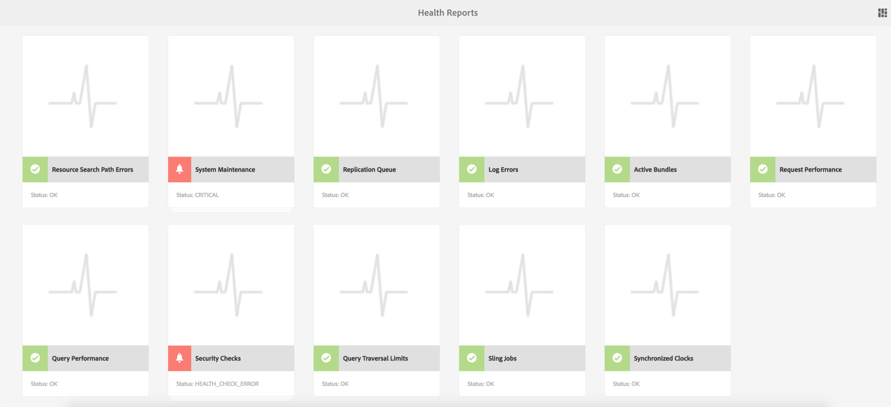
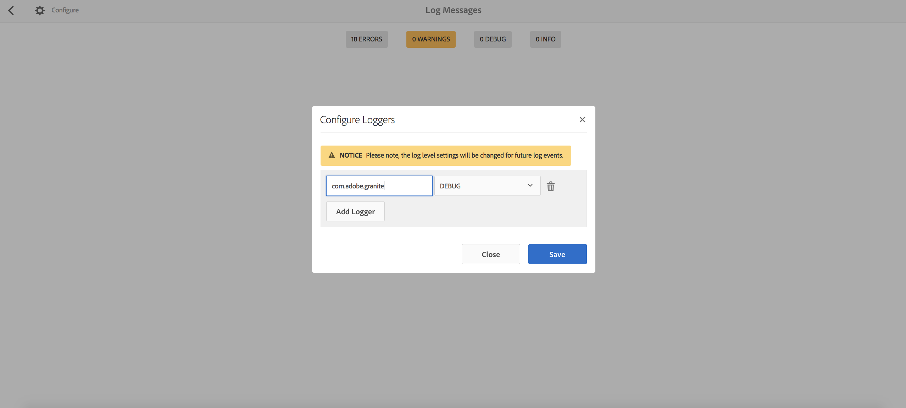
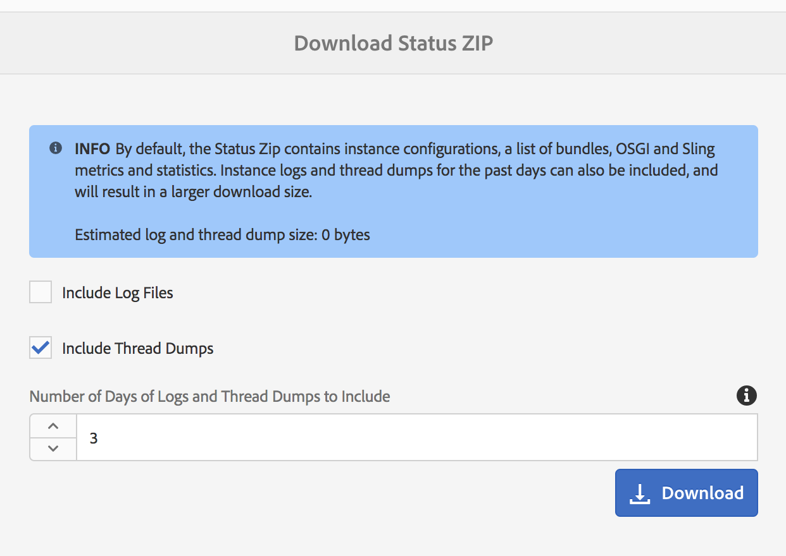

# Instrumentpanel för åtgärder {#operations-dashboard}

## Introduktion {#introduction}

På kontrollpanelen för åtgärder i AEM 6 kan systemansvariga övervaka AEM systemhälsan snabbt. Den innehåller även automatiskt genererad diagnos om relevanta aspekter av AEM och gör att du kan konfigurera och köra självständig automatisering av underhåll för att avsevärt minska projektdriften och supportärenden. Kontrollpanelen för åtgärder kan utökas med anpassade hälsokontroller och underhållsuppgifter. Data från Operations Dashboard kan dessutom nås från externa övervakningsverktyg via JMX.

**Kontrollpanelen för åtgärder:**

* Är en enklickssystemstatus som hjälper verksamhetstjänsterna att bli effektivare
* Ger en översikt över systemets hälsa på en central plats
* Minskar tiden för att hitta, analysera och åtgärda problem
* Automatisering av underhåll som kan minska projektkostnaderna avsevärt

Du kommer åt den genom att gå till **Verktyg** - **Åtgärder** från AEM välkomstskärm.

>[!NOTE]
>
>För att få åtkomst till kontrollpanelen för åtgärder måste den inloggade användaren vara en del av användargruppen Operatorer. Mer information finns i dokumentationen om [Administrering av användare, grupper och åtkomsträttigheter](/help/sites-administering/user-group-ac-admin.md).

## Hälsorapporter {#health-reports}

I systemet för hälsorapporter finns information om hälsotillståndet i en AEM via Sling Health Checks. Du uppnår detta antingen genom OSGI-, JMX-, HTTP-begäranden (via JSON) eller genom Touch-gränssnittet. Den erbjuder mått och tröskelvärden för vissa konfigurerbara räknare och ibland ger den information om hur problemet kan lösas.

Den har flera funktioner som beskrivs nedan.

## Hälsokontroller {#health-checks}

**Hälsorapporter** är ett kortsystem som indikerar god eller dålig hälsa i ett visst produktområde. Dessa kort är visualiseringar av Sling Health Checks, som samlar in data från JMX och andra källor och visar bearbetad information igen som MBeans. Dessa MBeans kan också inspekteras i [JMX-webbkonsolen](/help/sites-administering/jmx-console.md), under domänen **org.apache.sling.hälsothcheck**.

Du kommer åt gränssnittet Hälsorapporter via menyn **Verktyg** - **Åtgärder** - **Hälsorapporter** på AEM välkomstskärm, eller direkt via följande URL:

`https://<serveraddress>:port/libs/granite/operations/content/healthreports/healthreportlist.html`



Kortsystemet visar tre möjliga lägen: **OK**, **WARN** och **CRITICAL**. Lägen är ett resultat av regler och tröskelvärden, som kan konfigureras genom att du håller muspekaren över kortet och sedan klickar på kugghjulsikonen i åtgärdsfältet:


### Typ av hälsokontroll {#health-check-types}

Det finns två typer av hälsokontroller i AEM 6:

1. Individuella hälsokontroller
1. Sammansatta hälsokontroller

En **enskild hälsokontroll** är en enskild hälsokontroll som motsvarar ett statuskort. Enskilda hälsokontroller kan konfigureras med regler eller tröskelvärden och de kan ge ett eller flera tips och länkar för att lösa identifierade hälsoproblem. Låt oss ta kontrollen &quot;Loggfel&quot; som exempel: om det finns FEL-poster i instansloggarna kan du hitta dem på informationssidan i hälsokontrollen. Längst upp på sidan finns en länk till analysverktyget för loggmeddelanden i avsnittet Diagnosverktyg, där du kan analysera felen mer i detalj och konfigurera om loggarna.

En **sammansatt hälsokontroll** är en kontroll som samlar in information från flera enskilda kontroller.

Sammansatta hälsokontroller har konfigurerats med hjälp av **filtertaggar**. Alla enskilda kontroller som har samma filtertagg grupperas alltså som en sammansatt hälsokontroll. En sammansatt hälsokontroll har bara statusen OK om alla enskilda kontroller som den sammanställer också har OK-status.

### Så här skapar du hälsokontroller {#how-to-create-health-checks}

På kontrollpanelen för åtgärder kan du visualisera resultatet av både individuella och sammansatta hälsokontroller.

### Skapa en enskild hälsokontroll {#creating-an-individual-health-check}

Att skapa en enskild hälsokontroll består av två steg: implementera en hälsokontroll vid enkel inloggning och lägga till en post för hälsokontrollen på kontrollpanelens konfigurationsnoder.

1. Skapa en OSGI-komponent som implementerar Sling HealthCheck-gränssnittet om du vill skapa en Sling-hälsokontroll. Lägg till den här komponenten i ett paket. Komponentens egenskaper identifierar hälsokontrollen fullständigt. När komponenten har installerats skapas en JMX MBean automatiskt för hälsokontrollen. Mer information finns i [Hälsokontrolldokumentationen för Sling](https://sling.apache.org/documentation/bundles/sling-health-check-tool.html).

   Exempel på en Sling Health Check-komponent, skriven med OSGI-tjänstkomponentsanteckningar:

   ```java
   @Component(service = HealthCheck.class,
   property = {
       HealthCheck.NAME + "=Example Check",
       HealthCheck.TAGS + "=example",
       HealthCheck.TAGS + "=test",
       HealthCheck.MBEAN_NAME + "=exampleHealthCheckMBean"
   })
    public class ExampleHealthCheck implements HealthCheck {
       @Override
       public Result execute() {
           // health check code
       }
    }
   ```

   >[!NOTE]
   >
   >Egenskapen `MBEAN_NAME` definierar namnet på den böna som genereras för den här hälsokontrollen.

1. När du har skapat en hälsokontroll måste en ny konfigurationsnod skapas för att den ska bli tillgänglig i gränssnittet för kontrollpanelen för åtgärder. I det här steget måste du känna till JMX-namnet för hälsokontrollen (egenskapen `MBEAN_NAME`). Om du vill skapa en konfiguration för hälsokontrollen öppnar du CRXDE och lägger till en nod (av typen **not:undefined**) under följande sökväg: `/apps/settings/granite/operations/hc`

   Följande egenskaper ska anges för den nya noden:

   * **Namn:** `sling:resourceType`

      * **Typ:** `String`
      * **Värde:** `granite/operations/components/mbean`

   * **Namn:** `resource`

      * **Typ:** `String`
      * **Värde:** `/system/sling/monitoring/mbeans/org/apache/sling/healthcheck/HealthCheck/exampleHealthCheck`

   >[!NOTE]
   >
   >Resurssökvägen ovan skapas så här: Om huvudnamnet för hälsokontrollen är &quot;test&quot; lägger du till &quot;test&quot; i slutet av sökvägen `/system/sling/monitoring/mbeans/org/apache/sling/healthcheck/HealthCheck`
   >
   >Så den sista banan är följande:
   >
   >`/system/sling/monitoring/mbeans/org/apache/sling/healthcheck/HealthCheck/test`

   >[!NOTE]
   >
   >Kontrollera att sökvägen `/apps/settings/granite/operations/hc` har följande egenskaper inställda på true:
   >
   >
   >`sling:configCollectionInherit`
   >
   >`sling:configPropertyInherit`
   >
   >
   >Den här processen instruerar konfigurationshanteraren att sammanfoga de nya konfigurationerna med de befintliga från `/libs`.

### Skapa en sammansatt hälsokontroll {#creating-a-composite-health-check}

En sammansatt hälsokontroll har till uppgift att sammanställa flera enskilda hälsokontroller som delar en uppsättning gemensamma funktioner. Den sammansatta hälsokontrollen för Säkerhet grupperar till exempel alla enskilda hälsokontroller som utför säkerhetsrelaterade kontroller. Det första steget för att skapa en sammansatt kontroll är att lägga till en OSGI-konfiguration. För att den ska kunna visas på kontrollpanelen för åtgärder måste en ny konfigurationsnod läggas till på samma sätt som en enkel kontroll.

1. Gå till Web Configuration Manager i OSGI-konsolen. Åtkomst `https://serveraddress:port/system/console/configMgr`
1. Sök efter posten **Apache Sling Composite Health Check**. När du har hittat den bör du tänka på att det redan finns två konfigurationer: en för systemkontrollerna och en annan för säkerhetskontrollerna.
1. Skapa en konfiguration genom att trycka på plusknappen (+) till höger om konfigurationen. Ett nytt fönster visas enligt nedan:

   

1. Skapa en konfiguration och spara den. En böna skapas med den nya konfigurationen.

   Syftet med varje konfigurationsegenskap är följande:

   * **Namn (hc.name):** Namnet på den sammansatta hälsokontrollen. Ett beskrivande namn rekommenderas.
   * **Taggar (hc.tags):** Taggarna för den här hälsokontrollen. Om den här sammansatta hälsokontrollen är avsedd att ingå i en annan sammansatt hälsokontroll (till exempel i en hierarki av hälsokontroller) lägger du till de taggar som den sammansatta kontrollen är relaterad till.
   * **MBean-namn (hc.mbean.name):** Namnet på den Mbean som anges till JMX MBean för den här sammansatta hälsokontrollen.
   * **Filtertaggar (filter.tags):** Den egenskap som är specifik för sammansatta hälsokontroller. Dessa taggar sammanställs av det sammansatta. Den sammansatta hälsokontrollen aggregerar under sin grupp alla hälsokontroller som har en tagg som matchar någon av filtertaggarna i den här sammansatta sammansättningen. En sammansatt hälsokontroll med filtertaggarna **test** och **check** samlar till exempel alla enskilda och sammansatta hälsokontroller som har någon av taggarna **test** och **check** i taggegenskapen ( `hc.tags`).

   >[!NOTE]
   >
   >En ny JMX Mbean skapas för varje ny konfiguration av den sammansatta hälsokontrollen för Apache Sling.**

1. Slutligen måste posten för den sammansatta hälsokontrollen som har skapats läggas till i konfigurationsnoderna för kontrollpanelen för åtgärder. Proceduren är densamma som för individuella hälsokontroller: en nod av typen **not:unStructed** måste skapas under `/apps/settings/granite/operations/hc`. Resursegenskapen för noden definieras av värdet **hc.ean.name** i OSGI-konfigurationen.

   Om du till exempel har skapat en konfiguration och angett värdet **hc.mbean.name** till **diskus age** ser konfigurationsnoderna ut så här:

   * **Namn:** `Composite Health Check`

      * **Typ:** `nt:unstructured`

   Med följande egenskaper:

   * **Namn:** `sling:resourceType`

      * **Typ:** `String`
      * **Värde:** `granite/operations/components/mbean`

   * **Namn:** `resource`

      * **Typ:** `String`
      * **Värde:** `/system/sling/monitoring/mbeans/org/apache/sling/healthcheck/HealthCheck/diskusage`

   >[!NOTE]
   >
   >Om du skapar enskilda hälsokontroller som logiskt sett hör till en sammansatt kontroll som redan finns på kontrollpanelen som standard, hämtas de automatiskt och grupperas under respektive sammansatta kontroll. Därför behöver du inte skapa en konfigurationsnod för dessa kontroller.
   >
   >Om du till exempel skapar en enskild säkerhetshälsokontroll tilldelar du den taggen **security** och den installeras. Den visas automatiskt under den sammansatta kontrollen Säkerhetskontroller på kontrollpanelen för åtgärder.

### Hälsokontroller som tillhandahålls med AEM {#health-checks-provided-with-aem}

<table>
 <tbody>
  <tr>
   <td><strong>zHealthcheck-namn</strong></td>
   <td><strong>Beskrivning</strong></td>
  </tr>
  <tr>
   <td>Frågeprestanda</td>
   <td><p>Den här hälsokontrollen förenklades <strong> i AEM 6.4</strong> och kontrollerar nu det nyligen omfakterade <code>Oak QueryStats</code> MBean, närmare bestämt <code>SlowQueries </code>-attributet. Om statistiken innehåller långsamma frågor returnerar hälsokontrollen en varning. Annars returneras OK-status.<br /> </p> <p>MBean för den här hälsokontrollen är <a href="http://localhost:4502/system/console/jmx/org.apache.sling.healthcheck%3Aname%3DqueriesStatus%2Ctype%3DHealthCheck">org.apache.sling.healthCheck:name=queriesStatus,type=HealthCheck</a>.</p> </td>
  </tr>
  <tr>
   <td>Längd på observationskö</td>
   <td><p>Längden på observationskön itererar över alla händelseavlyssnare och bakgrundsobservrar, jämför deras <code>queueSize </code> med deras <code>maxQueueSize</code> och:</p>
    <ul>
     <li>returnerar Kritisk status om värdet <code>queueSize</code> överskrider värdet <code>maxQueueSize</code> (det vill säga när händelser skulle tas bort)</li>
     <li>returnerar en varning om värdet <code>queueSize</code> är över <code>maxQueueSize * WARN_THRESHOLD</code> (standardvärdet är 0,75) </li>
    </ul> <p>Den maximala längden för varje kö kommer från olika konfigurationer (Oak och AEM) och kan inte konfigureras från den här hälsokontrollen. MBean för den här hälsokontrollen är <a href="http://localhost:4502/system/console/jmx/org.apache.sling.healthcheck%3Aname%3DObservationQueueLengthHealthCheck%2Ctype%3DHealthCheck">org.apache.sling.healthCheck:name=ObservationQueueLengthHealthCheck,type=HealthCheck</a>.</p> </td>
  </tr>
  <tr>
   <td>Gränser för genomgång av frågor</td>
   <td><p>Gränser för genomgång av frågor kontrollerar <code>QueryEngineSettings</code> MBean, närmare bestämt attributen <code>LimitInMemory</code> och <code>LimitReads</code>, och returnerar följande status:</p>
    <ul>
     <li>returnerar varningsstatus om en av gränserna är lika med eller högre än <code>Integer.MAX_VALUE</code></li>
     <li>returnerar varningsstatus om en av gränserna är lägre än 10000 (den rekommenderade inställningen från Oak)</li>
     <li>returnerar statusen Kritisk om <code>QueryEngineSettings</code> eller någon av gränserna inte kan hämtas</li>
    </ul> <p>Mönstret för den här hälsokontrollen är <a href="http://localhost:4502/system/console/jmx/org.apache.sling.healthcheck%3Aname%3DqueryTraversalLimitsBundle%2Ctype%3DHealthCheck">org.apache.sling.healthCheck:name=queryTraversalLimitsBundle,type=HealthCheck</a>.</p> </td>
  </tr>
  <tr>
   <td>Synkroniserade klockor</td>
   <td><p>Den här kontrollen gäller endast för <a href="https://github.com/apache/sling-old-svn-mirror/blob/4df9ab2d6592422889c71fa13afd453a10a5a626/bundles/extensions/discovery/oak/src/main/java/org/apache/sling/discovery/oak/SynchronizedClocksHealthCheck.java">dokumentnodore-kluster</a>. Den returnerar följande status:</p>
    <ul>
     <li>returnerar Warn-status när instansklockorna inte är synkroniserade och går över ett fördefinierat lågt tröskelvärde</li>
     <li>returnerar statusen Kritisk när instansklockorna inte är synkroniserade och går över ett fördefinierat högt tröskelvärde</li>
    </ul> <p>Mönstret för den här hälsokontrollen är <a href="http://localhost:4502/system/console/jmx/org.apache.sling.healthcheck%3Aname%3DslingDiscoveryOakSynchronizedClocks%2Ctype%3DHealthCheck">org.apache.sling.healthCheck:name=slingDiscoveryOakSynchronizedClocks,type=HealthCheck</a>.</p> </td>
  </tr>
  <tr>
   <td>Asynkrona index</td>
   <td><p>Kontrollen Asynkrona index:</p>
    <ul>
     <li>returnerar en kritisk status om minst ett indexeringsfält misslyckas</li>
     <li>kontrollerar om <code>lastIndexedTime</code> innehåller alla indexeringsbanor och:
      <ul>
       <li>returnerar en Kritisk status om det är mer än 2 timmar sedan </li>
       <li>returnerar en varningsstatus om det är mellan 2 timmar och 45 minuter sedan </li>
       <li>returnerar OK-status om den är mindre än 45 minuter sedan </li>
      </ul> </li>
     <li>om inget av dessa villkor uppfylls returneras OK-statusen</li>
    </ul> <p>Både statuströskelvärdena Kritisk och Varna är konfigurerbara. Mönstret för den här hälsokontrollen är <a href="http://localhost:4502/system/console/jmx/org.apache.sling.healthcheck%3Aname%3DasyncIndexHealthCheck%2Ctype%3DHealthCheck">org.apache.sling.healthCheck:name=asyncIndexHealthCheck,type=HealthCheck</a>.</p> <p><strong>Obs! </strong>Den här hälsokontrollen är tillgänglig i AEM 6.4 och har säkerhetskopierats till AEM 6.3.0.1.</p> </td>
  </tr>
  <tr>
   <td>Stora Lucene-index</td>
   <td><p>Den här kontrollen använder data som exponeras av <code>Lucene Index Statistics</code> MBean för att identifiera stora index och returnerar:</p>
    <ul>
     <li>en varningsstatus om det finns ett index med mer än 1 miljard dokument</li>
     <li>en kritisk status om det finns ett index med mer än 1,5 miljarder dokument</li>
    </ul> <p>Tröskelvärdena kan konfigureras och MBean för hälsokontrollen är <a href="http://localhost:4502/system/console/jmx/org.apache.sling.healthcheck%3Aname%3DlargeIndexHealthCheck%2Ctype%3DHealthCheck">org.apache.sling.hälsocheck:name=largeIndexHealthCheck,type=HealthCheck.</a></p> <p><strong>Obs! </strong>Den här kontrollen är tillgänglig i AEM 6.4 och har flyttats tillbaka till AEM 6.3.2.0.</p> </td>
  </tr>
  <tr>
   <td>Systemunderhåll</td>
   <td><p>Systemunderhåll är en sammansatt kontroll som returnerar OK om alla underhållsåtgärder körs som de är konfigurerade. Kom ihåg att:</p>
    <ul>
     <li>varje underhållsåtgärd åtföljs av en tillhörande hälsokontroll</li>
     <li>Om en uppgift inte läggs till i ett underhållsfönster returneras Critical-kontrollen</li>
     <li>konfigurera underhållsuppgifterna för granskningslogg och tömning av arbetsflöde eller på annat sätt ta bort dem från underhållsfönstren. Om dessa uppgifter inte är konfigurerade misslyckas de vid den första körningen, så systemunderhållskontrollen returnerar statusen Kritisk.</li>
     <li><strong>I AEM 6.4</strong> finns det även en kontroll för <a href="/help/sites-administering/operations-dashboard.md#automated-maintenance-tasks">Lucene Binaries-underhållsuppgiften</a></li>
     <li>på AEM 6.2 och lägre returnerar systemunderhållskontrollen en varningsstatus direkt efter start eftersom aktiviteterna aldrig körs. Från och med 6.3 returneras OK om det första underhållsfönstret inte har nåtts ännu.</li>
    </ul> <p>MBean för den här hälsokontrollen är <a href="http://localhost:4502/system/console/jmx/org.apache.sling.healthcheck%3Aname%3Dsystemchecks%2Ctype%3DHealthCheck">org.apache.sling.healthCheck:name=systemchecks,type=HealthCheck</a>.</p> </td>
  </tr>
  <tr>
   <td>Replikeringskö</td>
   <td><p>Den här kontrollen itererar över replikeringsagenter och tittar på deras köer. För objektet högst upp i kön kontrolleras hur många gånger agenten försökte replikera på nytt. Om agenten försökte replikera igen mer än värdet för parametern <code>numberOfRetriesAllowed</code> returneras en varning. Parametern <code>numberOfRetriesAllowed</code> kan konfigureras. </p> <p>MBean för den här hälsokontrollen är <a href="http://localhost:4502/system/console/jmx/org.apache.sling.healthcheck%3Aname%3DreplicationQueue%2Ctype%3DHealthCheck" target="_blank">org.apache.sling.healthCheck:name=replicationQueue,type=HealthCheck</a>.</p> </td>
  </tr>
  <tr>
   <td>Försäljningsjobb</td>
   <td>
    <div>
      Sling Jobs kontrollerar antalet jobb som köas i JobManager, jämför det med
     tröskelvärde för <code>maxNumQueueJobs</code> och:
    </div>
    <ul>
     <li>returnerar ett kritiskt värde om fler än <code>maxNumQueueJobs</code> finns i kön</li>
     <li>returnerar ett kritiskt värde om det finns tidskrävande aktiva jobb som är äldre än 1 timme</li>
     <li>returnerar ett kritiskt värde om det finns jobb i kö och den senaste jobbtiden är äldre än 1 timme</li>
    </ul> <p>Endast parametern för maximalt antal jobb i kö kan konfigureras och har standardvärdet 1 000.</p> <p>MBean för den här hälsokontrollen är <a href="http://localhost:4502/system/console/jmx/org.apache.sling.healthcheck%3Aname%3DslingJobs%2Ctype%3DHealthCheck" target="_blank">org.apache.sling.healthCheck:name=slingJobs,type=HealthCheck</a>.</p> </td>
  </tr>
  <tr>
   <td>Begär prestanda</td>
   <td><p>Den här kontrollen tittar på <code>granite.request.metrics.timer</code> <a href="http://localhost:4502/system/console/slingmetrics" target="_blank">Sling-måttet </a> och:</p>
    <ul>
     <li>returnerar ett kritiskt värde om det 75:e percentilvärdet överstiger det kritiska tröskelvärdet (standardvärdet är 500 millisekunder)</li>
     <li>returnerar ett varningsmeddelande om det 75:e percentilvärdet överstiger varningsvärdet (standardvärdet är 200 millisekunder)</li>
    </ul> <p>MBean för den här hälsokontrollen är <em> </em><a href="http://localhost:4502/system/console/jmx/org.apache.sling.healthcheck%3Aname%3DrequestsStatus%2Ctype%3DHealthCheck" target="_blank">org.apache.sling.hälsothcheck:name=requestsStatus,type=HealthCheck</a>.</p> </td>
  </tr>
  <tr>
   <td>Loggfel</td>
   <td><p>Den här kontrollen returnerar varningsstatus om loggen innehåller fel.</p> <p>MBean för den här hälsokontrollen är <a href="http://localhost:4502/system/console/jmx/org.apache.sling.healthcheck%3Aname%3DlogErrorHealthCheck%2Ctype%3DHealthCheck" target="_blank">org.apache.sling.healthCheck:name=logErrorHealthCheck,type=HealthCheck</a>.</p> </td>
  </tr>
  <tr>
   <td>Diskutrymme</td>
   <td><p>Kontrollen av diskutrymme söker på <code>FileStoreStats</code> MBean, hämtar storleken på nodarkivet och mängden användbart diskutrymme på nodlagringspartitionen, och:</p>
    <ul>
     <li>returnerar en varning om det tillgängliga diskutrymmet till databasstorleken är mindre än varningsvärdet (standardvärdet är 10)</li>
     <li>returnerar ett kritiskt värde om det tillgängliga diskutrymmet till databasstorleken är mindre än det kritiska tröskelvärdet (standardvärdet är 2)</li>
    </ul> <p>Båda tröskelvärdena kan konfigureras. Kontrollen fungerar bara på instanser med ett segmentlager.</p> <p>MBean för den här hälsokontrollen är <a href="http://localhost:4502/system/console/jmx/org.apache.sling.healthcheck%3Aname%3DDiskSpaceHealthCheck%2Ctype%3DHealthCheck" target="_blank">org.apache.sling.healthCheck:name=DiskSpaceHealthCheck,type=HealthCheck</a>.</p> </td>
  </tr>
  <tr>
   <td>Hälsokontroll för schemaläggare</td>
   <td><p>Den här kontrollen returnerar en varning om instansen har Quartz-jobb som körs i mer än 60 sekunder. Tröskelvärdet för acceptabel varaktighet är konfigurerbart.</p> <p>Mbean för den här hälsokontrollen är <a href="http://localhost:4502/system/console/jmx/org.apache.sling.healthcheck%3Aname%3DslingCommonsSchedulerHealthCheck%2Ctype%3DHealthCheck" target="_blank">org.apache.sling.healthCheck:name=slingCommonsSchedulerHealthCheck,type=HealthCheck</a><em>.</em></p> </td>
  </tr>
  <tr>
   <td>Säkerhetskontroller</td>
   <td><p>Säkerhetskontrollen är en sammansatt kontroll som sammanställer resultaten av flera säkerhetsrelaterade kontroller. Dessa enskilda hälsokontroller åtgärdar andra problem än säkerhetskontrolllistan som finns på dokumentationssidan för <a href="/help/sites-administering/security-checklist.md">säkerhetschecklistan.</a> Kontrollen är användbar som säkerhetsröktest när instansen startas. </p> <p>MBean för den här hälsokontrollen är <a href="http://localhost:4502/system/console/jmx/org.apache.sling.healthcheck%3Aname%3Dsecuritychecks%2Ctype%3DHealthCheck" target="_blank">org.apache.sling.healthCheck:name=securityChecks,type=HealthCheck</a></p> </td>
  </tr>
  <tr>
   <td>Aktiva paket</td>
   <td><p>Active Bundles kontrollerar statusen för alla paket och:</p>
    <ul>
     <li>returnerar Warn-status om något av paketen inte är aktivt eller (med start, med lat aktivering)</li>
     <li>ignorerar paketens status i ignoreringslistan</li>
    </ul> <p>Parametern för ignoreringslistan kan konfigureras.</p> <p>MBean för den här hälsokontrollen är <a href="http://localhost:4502/system/console/jmx/org.apache.sling.healthcheck%3Aname%3DinactiveBundles%2Ctype%3DHealthCheck" target="_blank">org.apache.sling.healthCheck:name=inactiveBundles,type=HealthCheck</a>.</p> </td>
  </tr>
  <tr>
   <td>Kontroll av kodcache</td>
   <td><p>En hälsokontroll som verifierar flera JVM-förhållanden som kan utlösa ett CodeCache-fel i Java™ 7:</p>
    <ul>
     <li>returnerar en varning om instansen körs på Java™ 7, med tömning av kodcache aktiverat</li>
     <li>returnerar ett varningsmeddelande om instansen körs på Java™ 7 och storleken på den reserverade kodcachen är mindre än ett minimivärde (standardvärdet är 90 MB)</li>
    </ul> <p>Tröskelvärdet <code>minimum.code.cache.size</code> kan konfigureras. Mer information om felet finns i <a href="https://bugs.java.com/bugdatabase/"> och sök sedan på fel-ID 8012547</a>.</p> <p>MBean för den här hälsokontrollen är <a href="http://localhost:4502/system/console/jmx/org.apache.sling.healthcheck%3Aname%3DcodeCacheHealthCheck%2Ctype%3DHealthCheck" target="_blank">org.apache.sling.healthCheck:name=codeCacheHealthCheck,type=HealthCheck</a>.</p> </td>
  </tr>
  <tr>
   <td>Sökvägsfel för resurssökning</td>
   <td><p>Kontrollerar om det finns några resurser i sökvägen <code>/apps/foundation/components/primary</code> och:</p>
    <ul>
     <li>returnerar en varning om det finns underordnade noder under <code>/apps/foundation/components/primary</code></li>
    </ul> <p>MBean för den här hälsokontrollen är <a href="http://localhost:4502/system/console/jmx/org.apache.sling.healthcheck%3Aname%3DresourceSearchPathErrorHealthCheck%2Ctype%3DHealthCheck" target="_blank">org.apache.sling.healthCheck:name=resourceSearchPathErrorHealthCheck,type=HealthCheck</a>.</p> </td>
  </tr>
 </tbody>
</table>

### Konfiguration av hälsokontroll {#health-check-configuration}

Som standard körs hälsokontrollerna var 60:e sekund för en AEM.

Du kan konfigurera **Period** med [OSGi-konfigurationen](/help/sites-deploying/configuring-osgi.md) **Query Health Check Configuration** (com.adobe.granite.queries.impl.hc.QueryHealthCheckMetrics).

## Övervakning med externa tjänster {#monitoring-with-external-services}

Integrering är möjligt med externa tekniker eller leverantörer. Mer information finns i dokumentationen till dem.

## Diagnosverktyg {#diagnosis-tools}

Kontrollpanelen för åtgärder ger även tillgång till diagnosverktyg som kan hjälpa dig att hitta och felsöka rotorsaker till varningarna som kommer från kontrollpanelen för hälsokontroll, samt tillhandahålla viktig felsökningsinformation för systemoperatörer.

Bland de viktigaste funktionerna är:

* En loggmeddelandeanalyserare
* Möjlighet att komma åt stackar och tråddumpar
* Begäranden och frågeprestandaanalyser

Du kan nå skärmen Diagnosverktyg genom att gå till **Verktyg - Åtgärder - Diagnos** från AEM välkomstskärm. Du kan även komma åt skärmen genom att komma åt följande URL: `https://serveraddress:port/libs/granite/operations/content/diagnosis.html`


### Loggmeddelanden {#log-messages}

Loggmeddelandena Användargränssnittet visar alla FELmeddelanden som standard. Om du vill att fler loggmeddelanden ska visas konfigurerar du en loggare med rätt loggnivå.

Loggmeddelandena använder ett tillägg i minnesloggen och är därför inte relaterade till loggfilerna. En annan konsekvens är att om du ändrar loggnivåerna i det här användargränssnittet ändras inte den information som loggas i de traditionella loggfilerna. Om du lägger till och tar bort loggare i det här användargränssnittet påverkas bara minnesloggaren. Dessutom återspeglas ändringen av loggningskonfigurationerna i framtiden för minnesloggaren. Poster som redan är loggade och inte längre är relevanta tas inte bort, men liknande poster loggas inte i framtiden.

Du kan konfigurera vad som loggas genom att tillhandahålla loggkonfigurationer från den övre vänstra kugghjulsknappen i användargränssnittet. Där kan du lägga till, ta bort eller uppdatera loggkonfigurationer. En loggningskonfiguration består av en **loggnivå** (WARN/INFO/DEBUG) och ett **filternamn**. **filternamnet** har rollen som filtrerar källan för loggmeddelanden som loggas. Om en loggare däremot ska samla in alla loggmeddelanden för den angivna nivån bör filternamnet vara **root**. Om du anger nivån för en logger aktiveras inhämtning av alla meddelanden med en nivå som är lika med eller högre än den angivna.

Exempel:

* Om du planerar att hämta alla **ERROR**-meddelanden krävs ingen konfiguration. Alla FELmeddelanden hämtas som standard.
* Om du planerar att hämta alla **ERROR**-, **WARN**- och **INFO**-meddelanden ska loggningsnamnet anges till: **root** och loggningsnivån till: **INFO**.

* Om du planerar att hämta alla meddelanden som kommer från ett visst paket (till exempel com.adobe.granite) ska loggningsnamnet anges till: &quot;com.adobe.granite&quot;. Loggningsnivån inställd på: **DEBUG** (om du gör det hämtas alla **ERROR**-, **WARN**-, **INFO**- och **DEBUG** -meddelanden), vilket visas i bilden nedan.



>[!NOTE]
>
>Du kan inte ange ett loggningsnamn så att endast FELMEDDELANDEN hämtas via ett angivet filter. Som standard hämtas alla FELmeddelanden.

>[!NOTE]
>
>Användargränssnittet för loggmeddelanden återspeglar inte den faktiska felloggen. Såvida du inte konfigurerar andra typer av loggmeddelanden i användargränssnittet visas endast FELmeddelanden. Mer information om hur du visar specifika loggmeddelanden finns i instruktionerna ovan.

>[!NOTE]
>
>Inställningarna på diagnossidan påverkar inte loggfilerna och omvänt. Så även om felloggen kan fånga upp INFO-meddelanden kanske du inte ser dem i användargränssnittet för loggmeddelanden. Via gränssnittet går det också att fånga upp DEBUG-meddelanden från vissa paket utan att det påverkar felloggen. Mer information om hur du konfigurerar loggfilerna finns i [Loggning](/help/sites-deploying/configure-logging.md).

>[!NOTE]
>
>**Med AEM 6.4** loggas underhållsaktiviteter ut ur kartongen i ett mer informationsformat på INFO-nivå. Det här arbetsflödet ger bättre synlighet för underhållsuppgifternas status.
>
>Om du använder verktyg från tredje part (till exempel Splunk) för att övervaka och reagera på underhållsaktiviteter kan du använda följande loggsatser:

```
Log level: INFO
DATE+TIME [MaintanceLogger] Name=<MT_NAME>, Status=<MT_STATUS>, Time=<MT_TIME>, Error=<MT_ERROR>, Details=<MT_DETAILS>
```

### Begär prestanda {#request-performance}

På sidan Prestandabegäran kan du analysera de långsammaste sidbegäranden som behandlas. Endast innehållsbegäranden registreras på den här sidan. Mer specifikt hämtas följande förfrågningar:

1. Begäranden om åtkomst till resurser under `/content`
1. Begäranden om åtkomst till resurser under `/etc/design`
1. Begäranden med tillägget `".html"`


Sidan visar:

* Tiden då begäran gjordes
* URL:en och förfrågningsmetoden
* Längden i millisekunder

Som standard hämtas de långsammaste 20 sidbegäranden, men gränsen kan ändras i Configuration Manager.

### Frågeprestanda {#query-performance}

På sidan Frågeprestanda kan du analysera de långsammaste frågorna som har utförts av systemet. Denna information tillhandahålls av databasen i en JMX Mbean. I Jackrabbit tillhandahåller JMX Mbean den här informationen, medan den i Oak-databasen erbjuds av `org.apache.jackrabbit.oak.QueryStats.``com.adobe.granite.QueryStat`

Sidan visar:

* Tidpunkten då frågan gjordes
* Frågans språk
* Antal gånger frågan utfärdades
* Frågeinstruktionen
* Längden i millisekunder


### Förklara fråga {#explain-query}

För varje fråga försöker Oak att ta reda på det bästa sättet att köra baserat på Oak-index som definierats i databasen under noden **oak:index**. Beroende på frågan kan olika index väljas av Oak. Att förstå hur Oak kör en fråga är det första steget till att optimera frågan.

Förklara frågan är ett verktyg som förklarar hur Oak kör en fråga. Du kommer åt den genom att gå till **Verktyg - Åtgärder - Diagnos** från AEM välkomstskärm. Klicka sedan på **Frågeprestanda** och växla till fliken **Förklara fråga**.

**Funktioner**

* Stöder frågespråken Xpath, JCR-SQL och JCR-SQL2
* Rapporterar den faktiska körningstiden för den angivna frågan
* Identifierar långsamma frågor och varningar om frågor som kan vara långsamma
* Rapporterar det Oak-index som används för att köra frågan
* Visar Oak Query Engine-förklaringen
* Innehåller klickbar-för-inläsningslista med långsamma och populära frågor

När du är i användargränssnittet för enkla frågor anger du frågan och trycker på knappen **Förklara**:


Den första posten i avsnittet Frågeförklaring är den faktiska förklaringen. Förklaringen visar vilken typ av index som användes för att köra frågan.

Den andra posten är körningsplanen.

Om du markerar rutan **Inkludera körningstid** innan frågan körs visas även hur lång tid frågan kördes. Alternativet **Inkludera nodantal** rapporterar antalet noder. Rapporten innehåller mer information som kan användas för att optimera index för ditt program eller din distribution.


### Index Manager {#the-index-manager}

Syftet med indexhanteraren är att underlätta indexhantering, t.ex. att underhålla index eller visa deras status.

Du kommer åt den genom att gå till **Verktyg - Åtgärder - Diagnos **från välkomstskärmen och sedan klicka på knappen **Indexhanteraren** .

Den kan också nås direkt på den här URL:en: `https://serveraddress:port/libs/granite/operations/content/diagnosistools/indexManager.html`


Gränssnittet kan användas för att filtrera index i tabellen genom att skriva in filtervillkoren i sökrutan i skärmens övre vänstra hörn.

### Download Status ZIP {#download-status-zip}

Den här åtgärden aktiverar nedladdningen av en zip som innehåller användbar information om systemstatus och konfiguration. Arkivet innehåller instanskonfigurationer, en lista över paket, OSGI, Sling-statistik och statistik, som kan resultera i en stor fil. Du kan minska effekten av stora statusfiler genom att använda fönstret **Download Status ZIP** . Du kommer åt fönstret från:**AEM > Verktyg > Åtgärder > Diagnos > Download Status ZIP.**

I det här fönstret kan du välja vad som ska exporteras (loggfiler och/eller tråddumpar) och antalet dagar med loggar som ingår i hämtningen i förhållande till det aktuella datumet.



### Ladda ned tråddump {#download-thread-dump}

Den här åtgärden aktiverar nedladdningen av en zip som innehåller information om trådarna i systemet. Information om varje tråd anges, t.ex. dess status, klassinläsaren och stackspårningen.

### Ladda ned Heap Dump {#download-heap-dump}

Du kan hämta en ögonblicksbild av heapen för att analysera den senare. Den här åtgärden aktiverar hämtning av en stor fil (hundratals megabyte).

## Automatiserade underhållsuppgifter {#automated-maintenance-tasks}

Sidan Automatiserade underhållsaktiviteter är en plats där du kan visa och spåra rekommenderade underhållsaktiviteter som schemalagts för periodisk körning. Uppgifterna integreras med systemet för hälsokontroll. Uppgifterna kan också utföras manuellt från gränssnittet.

Om du vill gå till underhållssidan på kontrollpanelen för åtgärder går du AEM välkomstskärmen till **Verktyg - Åtgärder - Kontrollpanel - Underhåll** eller direkt till den här länken:

`https://serveraddress:port/libs/granite/operations/content/maintenance.html`

Följande åtgärder är tillgängliga på kontrollpanelen för åtgärder:

1. Aktiviteten **Revision Clean Up** som finns under menyn **Daily Maintenance Window** .
1. Åtgärden **Lucene Binaries Cleanup** som finns under menyn **Dagligt underhållsfönster**.
1. Aktiviteten **Rensa arbetsflöde** som finns under menyn **Underhållsfönster** varje vecka.
1. Aktiviteten **Data Store Garbage Collection** som finns under menyn **Veckounderhåll**.
1. Underhållsuppgiften **Granskningslogg**, som finns under menyn **Veckounderhåll**.
1. Aktiviteten **Rensa underhåll** av version, som finns under menyn **Veckounderhåll**.
1. Underhållsuppgiften **Projektrensning**, som finns under menyn **Underhållsfönster** varje vecka, med alternativet **Lägg till**.
1. Underhållsaktiviteten **Rensa ad ad hoc-aktiviteter** som finns under menyn **Veckounderhåll** och som använder alternativet **Lägg till**.

Standardtimingen för det dagliga underhållet är 2:00 till 5:00. De uppgifter som konfigurerats för att köras varje vecka i underhållsfönstret körs mellan 1:00 A.M och 2:00 A.M. på lördagar.

Du kan också konfigurera timinginställningarna genom att trycka på kugghjulsikonen på något av de två underhållskorten:


>[!NOTE]
>
>Sedan AEM 6.1 kan de befintliga underhållsfönstren även konfigureras att köras månadsvis.

### Rensa version {#revision-clean-up}

Mer information om hur du utför rensning av revision [finns i den här dedikerade artikeln](/help/sites-deploying/revision-cleanup.md).

### Lucene Binaries Cleanup {#lucene-binaries-cleanup}

Genom att använda rensningsaktiviteten för Lucene-binärfiler kan du rensa bort lucene-binärfiler och minska storlekskraven för det datalager som körs. Lucene&#39;s binära urn regenereras dagligen i stället för det tidigare beroendet av en lyckad [skräpinsamling](/help/sites-administering/data-store-garbage-collection.md) för datalagret.

Även om underhållsarbetet utvecklades för att minska Lucene-relaterat revisionsskräp, finns det allmänna effektivitetsvinster när uppgiften körs:

* Den veckovisa körningen av skräpinsamlingen för datalagret kan slutföras snabbare.
* Den kan också förbättra den övergripande AEM något.

Du kommer åt rensningsaktiviteten för Lucene-binärfiler från: **AEM > Verktyg > Åtgärder > Underhåll > Fönster för dagligt underhåll > Rensa Lucene-binärfiler**.

### Skräpinsamling för datalager {#data-store-garbage-collection}

Mer information om skräpinsamling i datalagret finns på den dedikerade [dokumentationssidan](/help/sites-administering/data-store-garbage-collection.md).

### Rensa arbetsflöde {#workflow-purge}

Arbetsflöden kan också rensas från kontrollpanelen för underhåll. Så här kör du tömningsaktiviteten för arbetsflöde:

1. Klicka på sidan **Underhållsfönster** varje vecka.
1. På följande sida klickar du på **Spela upp** på kortet **Rensa arbetsflöde**.

>[!NOTE]
>
>Mer detaljerad information om underhåll av arbetsflöden finns på [den här sidan](/help/sites-administering/workflows-administering.md#regular-purging-of-workflow-instances).

### Underhåll av granskningslogg {#audit-log-maintenance}

Mer information om underhåll av granskningslogg finns på den [separata dokumentationssidan.](/help/sites-administering/operations-audit-log.md)

### Rensa version {#version-purge}

Du kan schemalägga underhållsaktiviteten Rensa version så att tidigare versioner tas bort automatiskt. Den här åtgärden minimerar behovet av att manuellt använda verktygen [Rensa version](/help/sites-deploying/version-purging.md). Du kan schemalägga och konfigurera aktiviteten Rensa version genom att gå till **Verktyg > Åtgärder > Underhåll > Fönster för veckounderhåll** och följa dessa steg:

1. Klicka på **Lägg till**.
1. Välj **Rensa version** i listrutan.

   

1. Om du vill konfigurera aktiviteten Rensa version klickar du på ikonen **gears** på det nya underhållskortet för att tömma version.

   

**Med AEM 6.4** kan du stoppa underhållsåtgärden Version Rensa enligt följande:

* Automatiskt - Om det schemalagda underhållsfönstret stängs innan aktiviteten kan slutföras stoppas aktiviteten automatiskt. Den återupptas när nästa underhållsfönster öppnas.
* Manuellt - Om du vill stoppa aktiviteten manuellt klickar du på ikonen **Stopp** på underhållskortet för versionsrensning. Nästa körning innebär att uppgiften återupptas utan problem.

>[!NOTE]
>
>Om du stoppar underhållsaktiviteten innebär det att körningen avbryts utan att det pågående jobbet går förlorat.

>[!CAUTION]
>
>För att optimera databasstorleken bör du köra versionsrensningen ofta. Uppgiften bör schemaläggas utanför kontorstid när trafiken är begränsad.

### Rensa projekt {#project-purge}

<!--
Override the out-of-the-box Maintenance window configuration node under `/libs` by creating properties under the folder `/apps/settings/granite/operations/maintenance/granite_weekly`, `granite_daily` or `granite_monthly`. See the Maintenance Window table below for additional configuration details.

Enable the maintenance task by adding another node under the node above (name it `granite_ProjectPurgeTask`) with the appropriate properties. 
-->

Konfigurera OSGI-egenskaperna under **Adobe Projects Purge Configuration** (com.adobe.cq.projects.purge.Scheduler).

### Rensa ad hoc-uppgifter {#purge-of-ad-hoc-tasks}

<!--
Override the out-of-the-box Maintenance window configuration node under `/libs` by creating properties under the folder `/apps/settings/granite/operations/maintenance/granite_weekly`, `granite_daily` or `granite_monthly`.

See the Maintenance Window table below for additional configuration details. Enable the maintenance task by adding another node under the node above. Name it `granite_TaskPurgeTask`, with attribute `sling:resourceType` set to `granite/operations/components/maintenance/task` and attribute `granite.maintenance.name` set to `TaskPurge`. 
-->

Konfigurera OSGI-egenskaperna under **Ad-hoc-aktivitetsrensning** (`com.adobe.granite.taskmanagement.impl.purge.TaskPurgeMaintenanceTask`).

## Anpassade underhållsaktiviteter {#custom-maintenance-tasks}

Anpassade underhållsåtgärder kan implementeras som OSGi-tjänster. Eftersom infrastrukturen för underhållsaktiviteten baseras på Apache Slings jobbhantering, måste en underhållsaktivitet implementera Java™-gränssnittet ` [org.apache.sling.event.jobs.consumer.JobExecutor](https://sling.apache.org/apidocs/sling7/org/apache/sling/event/jobs/consumer/JobExecutor.html)`. Dessutom måste den deklarera flera egenskaper för serviceregistrering som ska identifieras som en underhållsuppgift enligt nedan:

<table>
 <tbody>
  <tr>
   <td><strong>Tjänstegenskapsnamn</strong><br /> </td>
   <td><strong>Beskrivning</strong></td>
   <td><strong>Exempel</strong><br /> </td>
   <td><strong>Typ</strong></td>
  </tr>
  <tr>
   <td>granite.maintenance.isStoppable</td>
   <td>Booleskt attribut som definierar om aktiviteten kan stoppas av användaren. Om en aktivitet deklarerar att den kan avbrytas måste den under körningen kontrollera om den har stoppats och sedan agera därefter. Standardvärdet är false.</td>
   <td>true</td>
   <td>Valfritt</td>
  </tr>
  <tr>
   <td>granite.maintenance.mandatory</td>
   <td>Booleskt attribut som definierar om en uppgift är obligatorisk och måste köras regelbundet. Om en uppgift är obligatorisk men inte finns i något aktivt schemafönster rapporterar en hälsokontroll det här felet. Standardvärdet är false.</td>
   <td>true</td>
   <td>Valfritt</td>
  </tr>
  <tr>
   <td>granite.maintenance.name</td>
   <td>Ett unikt namn för aktiviteten - namnet används för att referera till uppgiften och är bara ett enkelt namn.</td>
   <td>MyMaintenanceTask</td>
   <td>Obligatoriskt</td>
  </tr>
  <tr>
   <td>granite.maintenance.title</td>
   <td>En titel som visas för den här uppgiften</td>
   <td>Min speciella underhållsuppgift</td>
   <td>Obligatoriskt</td>
  </tr>
  <tr>
   <td>job.topics</td>
   <td>Ett unikt ämne i underhållsaktiviteten.<br /> Jobbhanteringen i Apache Sling startar ett jobb med exakt det här avsnittet för att köra underhållsaktiviteten. När aktiviteten registreras för det här avsnittet körs den.<br /> Ämnet måste börja med <i>com/adobe/granite/Maintenance/job/</i></td>
   <td>com/adobe/granite/Maintenance/job/MyMaintenanceTask</td>
   <td>Obligatoriskt</td>
  </tr>
 </tbody>
</table>

Utöver ovanstående tjänstegenskaper måste metoden `process()` i gränssnittet `JobConsumer` implementeras genom att lägga till koden som ska köras för underhållsaktiviteten. Angiven `JobExecutionContext` kan användas för att generera statusinformation, kontrollera om jobbet har stoppats av användaren och skapa ett resultat (om det lyckades eller misslyckades).

I situationer där en underhållsuppgift inte ska köras på alla installationer (till exempel bara på publiceringsinstansen) kan du få tjänsten att kräva att en konfiguration är aktiv genom att lägga till `@Component(policy=ConfigurationPolicy.REQUIRE)`. Du kan sedan markera konfigurationen som körningsläge beroende i databasen. Mer information finns i [Konfigurera OSGi](/help/sites-deploying/configuring-osgi.md#creating-the-configuration-in-the-repository).

Nedan visas ett exempel på en anpassad underhållsåtgärd som tar bort filer från en konfigurerbar tillfällig katalog som har ändrats under de senaste 24 timmarna:

src/main/java/com/adobe/granite/samples/maintenance/impl/DeleteTempFilesTask.java

<table>
 <tbody>
  <tr>
   <td><p> </p> <p><code>/*</code></p> <p><code> * #%L</code></p> <p><code> * sample-maintenance-task</code></p> <p><code> * %%</code></p> <p><code> * Copyright (C) 2014 Adobe</code></p> <p><code> * %%</code></p> <p><code> * Licensed under the Apache License, Version 2.0 (the "License");</code></p> <p><code> * you may not use this file except in compliance with the License.</code></p> <p><code> * You may obtain a copy of the License at</code></p> <p><code> * </code></p> <p><code> * <a href="https://www.apache.org/licenses/LICENSE-2.0">https://www.apache.org/licenses/LICENSE-2.0</a></code></p> <p><code> * </code></p> <p><code> * Unless required by applicable law or agreed to in writing, software</code></p> <p><code> * distributed under the License is distributed on an "AS IS" BASIS,</code></p> <p><code> * WITHOUT WARRANTIES OR CONDITIONS OF ANY KIND, either express or implied.</code></p> <p><code> * See the License for the specific language governing permissions and</code></p> <p><code> * limitations under the License.</code></p> <p><code> * #L%</code></p> <p><code> */</code></p> <p><code> </code></p> <p><code>package com.adobe.granite.samples.maintenance.impl;</code></p> <p><code> </code></p> <p><code>import java.io.File;</code></p> <p><code>import java.util.Calendar;</code></p> <p><code>import java.util.Collection;</code></p> <p><code>import java.util.Map;</code></p> <p><code> </code></p> <p><code>import org.apache.commons.io.FileUtils;</code></p> <p><code>import org.apache.commons.io.filefilter.IOFileFilter;</code></p> <p><code>import org.apache.commons.io.filefilter.TrueFileFilter;</code></p> <p><code>import org.apache.felix.scr.annotations.Activate;</code></p> <p><code>import org.apache.felix.scr.annotations.Component;</code></p> <p><code>import org.apache.felix.scr.annotations.Properties;</code></p> <p><code>import org.apache.felix.scr.annotations.Property;</code></p> <p><code>import org.apache.felix.scr.annotations.Service;</code></p> <p><code>import org.apache.sling.commons.osgi.PropertiesUtil;</code></p> <p><code>import org.apache.sling.event.jobs.Job;</code></p> <p><code>import org.apache.sling.event.jobs.consumer.JobConsumer;</code></p> <p><code>import org.apache.sling.event.jobs.consumer.JobExecutionContext;</code></p> <p><code>import org.apache.sling.event.jobs.consumer.JobExecutionResult;</code></p> <p><code>import org.apache.sling.event.jobs.consumer.JobExecutor;</code></p> <p><code>import org.slf4j.Logger;</code></p> <p><code>import org.slf4j.LoggerFactory;</code></p> <p><code> </code></p> <p><code>import com.adobe.granite.maintenance.MaintenanceConstants;</code></p> <p><code> </code></p> <p><code>@Component(metatype = true,</code></p> <p><code> label = "Delete Temp Files Maintenance Task",</code></p> <p><code> description = "Maintatence Task which deletes files from a configurable temporary directory which have been modified in the last 24 hours.")</code></p> <p><code>@Service</code></p> <p><code>@Properties({</code></p> <p><code> @Property(name = MaintenanceConstants.PROPERTY_TASK_NAME, value = "DeleteTempFilesTask", propertyPrivate = true),</code></p> <p><code> @Property(name = MaintenanceConstants.PROPERTY_TASK_TITLE, value = "Delete Temp Files", propertyPrivate = true),</code></p> <p><code> @Property(name = JobConsumer.PROPERTY_TOPICS, value = MaintenanceConstants.TASK_TOPIC_PREFIX</code></p> <p><code> + "DeleteTempFilesTask", propertyPrivate = true) })</code></p> <p><code>public class DeleteTempFilesTask implements JobExecutor {</code></p> <p><code> </code></p> <p><code> private static final Logger log = LoggerFactory.getLogger(DeleteTempFilesTask.class);</code></p> <p><code> </code></p> <p><code> @Property(label = "Temporary Directory", description="Temporary Directory. Defaults to the java.io.tmpdir system property.")</code></p> <p><code> private static final String PROP_TEMP_DIR = "temp.dir";</code></p> <p><code> </code></p> <p><code> private File tempDir;</code></p> <p><code> </code></p> <p><code> @Activate</code></p> <p><code> private void activate(Map&lt;string, object=""&gt; properties) {</code></p> <p><code> this.tempDir = new File(PropertiesUtil.toString(properties.get(PROP_TEMP_DIR),</code></p> <p><code> System.getProperty("java.io.tmpdir")));</code></p> <p><code> }</code></p> <p><code> </code></p> <p><code> @Override</code></p> <p><code> public JobExecutionResult process(Job job, JobExecutionContext context) {</code></p> <p><code> log.info("Deleting old temp files from {}.", tempDir.getAbsolutePath());</code></p> <p><code> Collection&lt;file&gt; files = FileUtils.listFiles(tempDir, new LastModifiedBeforeYesterdayFilter(),</code></p> <p><code> TrueFileFilter.INSTANCE);</code></p> <p><code> int counter = 0;</code></p> <p><code> for (File file : files) {</code></p> <p><code> log.debug("Deleting file {}.", file.getAbsolutePath());</code></p> <p><code> counter++;</code></p> <p><code> file.delete();</code></p> <p><code> // TODO - capture the output of delete() and do something useful with it</code></p> <p><code> }</code></p> <p><code> return context.result().message(String.format("Deleted %s files.", counter)).succeeded();</code></p> <p><code> }</code></p> <p><code> </code></p> <p><code> /**</code></p> <p><code> * IOFileFilter which filters out files which have been modified in the last 24 hours.</code></p> <p><code> *</code></p> <p><code> */</code></p> <p><code> private static class LastModifiedBeforeYesterdayFilter implements IOFileFilter {</code></p> <p><code> </code></p> <p><code> private final long minTime;</code></p> <p><code> </code></p> <p><code> private LastModifiedBeforeYesterdayFilter() {</code></p> <p><code> Calendar cal = Calendar.getInstance();</code></p> <p><code> cal.add(Calendar.DATE, -1);</code></p> <p><code> this.minTime = cal.getTimeInMillis();</code></p> <p><code> }</code></p> <p><code> </code></p> <p><code> @Override</code></p> <p><code> public boolean accept(File dir, String name) {</code></p> <p><code> // this method is never actually called.</code></p> <p><code> return false;</code></p> <p><code> }</code></p> <p><code> </code></p> <p><code> @Override</code></p> <p><code> public boolean accept(File file) {</code></p> <p><code> return file.lastModified() <= this.minTime;</code></p> <p><code> }</code></p> <p><code> }</code></p> <p><code> </code></p> <p><code>}</code></p> <p><code>&lt;file&gt;&lt;/string,&gt;</code></p> <p> </p> </td>
  </tr>
 </tbody>
</table>

[experienceManager-java-MaintenanceMetask-sample](https://github.com/Adobe-Marketing-Cloud/experiencemanager-java-maintenancetask-sample)- [src/main/java/com/adobe/granite/samples/maintenance/impl/DeleteTempFilesTask.java](https://github.com/Adobe-Marketing-Cloud/experiencemanager-java-maintenancetask-sample/blob/master/src/main/java/com/adobe/granite/samples/maintenance/impl/DeleteTempFilesTask.java)

När tjänsten har distribuerats visas den i gränssnittet för kontrollpanelen för åtgärder. Du kan lägga till den i något av de tillgängliga underhållsschemana:


Den här åtgärden lägger till en motsvarande resurs på /apps/granite/operations/config/maintain/`schedule`/`taskname`. Om aktiviteten är beroende av körningsläge måste egenskapen granite.operations.conditions.runmode anges på den noden med värdena för de körningslägen som måste vara aktiva för den här underhållsaktiviteten.

## Systemöversikt {#system-overview}

**Systemöversiktspanelen** visar en översikt på hög nivå över konfiguration, maskinvara och hälsa för AEM. Systemets hälsostatus är transparent och all information samlas på en enda kontrollpanel.

>[!NOTE]
>
>Du kan även [titta på den här videon](https://video.tv.adobe.com/v/21340) om du vill se en introduktion till kontrollpanelen för systemöversikt.

### Så här får du åtkomst {#how-to-access}

Gå till **Verktyg > Åtgärder > Systemöversikt** om du vill komma åt kontrollpanelen för systemöversikt.


### Kontrollpanelen för systemöversikt förklaras {#system-overview-dashboard-explained}

Tabellen nedan beskriver all information som visas i kontrollpanelen för systemöversikt. Om det inte finns någon relevant information att visa (t.ex. om säkerhetskopiering inte pågår finns det inga hälsokontroller som är kritiska) visas meddelandet&quot;Inga poster&quot; i respektive avsnitt.

Du kan även hämta en `JSON`-fil som sammanfattar instrumentpanelsinformationen genom att klicka på knappen **Hämta** i det övre högra hörnet av instrumentpanelen. Slutpunkten `JSON` är `/libs/granite/operations/content/systemoverview/export.json` och kan användas i ett `curl`-skript för extern övervakning.

<table>
 <tbody>
  <tr>
   <td><strong>Avsnitt</strong></td>
   <td><strong>Vilken information som visas</strong></td>
   <td><strong>När är det viktigt?</strong></td>
   <td><strong>Länkar till</strong></td>
  </tr>
  <tr>
   <td>Hälsokontroller</td>
   <td>
    <ul>
     <li>en lista över kontroller som har statusen Kritisk</li>
     <li>en lista över kontroller som har statusen Varna</li>
    </ul> </td>
   <td>Visuellt:<br />
    <ul>
     <li>en röd tagg för kritiska kontroller</li>
     <li>en orange tagg för Warn-kontroller</li>
    </ul> </td>
   <td>
    <ul>
     <li>Sidan Hälsorapporter</li>
    </ul> </td>
  </tr>
  <tr>
   <td>Underhållsaktiviteter</td>
   <td>
    <ul>
     <li>en lista över misslyckade uppgifter</li>
     <li>en lista över aktiviteter som körs</li>
     <li>en lista över åtgärder som har slutförts i den senaste körningen</li>
     <li>en lista över uppgifter som aldrig har körts</li>
     <li>en lista över aktiviteter som inte är schemalagda</li>
    </ul> </td>
   <td><p>Visuellt:</p>
    <ul>
     <li>en röd tagg för misslyckade uppgifter</li>
     <li>en orange tagg för att köra uppgifter (eftersom de kan påverka prestandan)</li>
     <li>grå taggar för varannan status</li>
    </ul> </td>
   <td>
    <ul>
     <li>Underhållsaktiviteter</li>
    </ul> </td>
  </tr>
  <tr>
   <td>System</td>
   <td>
    <ul>
     <li>operativsystem och OS-version (till exempel macOS X)</li>
     <li>systemets genomsnittliga belastning, som hämtats från <a href="https://docs.oracle.com/javase/8/docs/api/java/lang/management/OperatingSystemMXBean.html#getSystemLoadAverage--">OperatingSystemMXBeanusable</a></li>
     <li>diskutrymme (på partitionen där arbetskatalogen finns)</li>
     <li>maximal heap, som returnerats av <a href="https://docs.oracle.com/javase/8/docs/api/java/lang/management/MemoryMXBean.html#getHeapMemoryUsage--">MemoryMXBean</a></li>
    </ul> </td>
   <td>Ej tillämpligt</td>
   <td>Ej tillämpligt</td>
  </tr>
  <tr>
   <td>Instans</td>
   <td>
    <ul>
     <li>AEM</li>
     <li>lista över körningslägen</li>
     <li>det datum då instansen startades</li>
    </ul> </td>
   <td>Ej tillämpligt</td>
   <td>Ej tillämpligt</td>
  </tr>
  <tr>
   <td>Databas</td>
   <td>
    <ul>
     <li>Oak</li>
     <li>typ av nodarkiv (Segmentmål eller dokument)
      <ul>
       <li>om typen är dokument, visas typen av dokumentarkiv (RDB eller Mongo)</li>
      </ul> </li>
     <li>om det finns ett anpassat datalager:
      <ul>
       <li>för ett fildatalager visas sökvägen</li>
       <li>för ett S3-datalager visas namnet på S3-bucket</li>
       <li>för ett delat S3-datalager visas namnet på S3-bucket</li>
       <li>för ett Azure Data Store visas behållaren</li>
      </ul> </li>
     <li>om det inte finns något anpassat externt datalager visas ett meddelande som anger detta</li>
    </ul> </td>
   <td>Ej tillämpligt</td>
   <td>Ej tillämpligt</td>
  </tr>
  <tr>
   <td>Distributionsagenter</td>
   <td>
    <ul>
     <li>en lista över agenter med blockerade köer</li>
     <li>en lista över felkonfigurerade agenter ("Konfigurationsfel")</li>
     <li>en lista över agenter med köbearbetning pausad</li>
     <li>en lista över inaktiva agenter</li>
     <li>en lista över agenter som körs (som för närvarande bearbetar poster)</li>
    </ul> </td>
   <td><p>Visuellt:</p>
    <ul>
     <li>en röd tagg för blockerade agenter eller konfigurationsfel</li>
     <li>en orange tagg för pausade agenter</li>
     <li>en grå tagg för pausade, inaktiva eller aktiva agenter <br /> </li>
    </ul> </td>
   <td>Distributionssida <br /> </td>
  </tr>
  <tr>
   <td>Replikeringsagenter</td>
   <td>
    <ul>
     <li>en lista över agenter med blockerade köer</li>
     <li>en lista över inaktiva agenter</li>
     <li>en lista över agenter som körs (som för närvarande bearbetar poster)</li>
    </ul> </td>
   <td><p>Visuellt:<br /> </p>
    <ul>
     <li>en röd tagg för blockerade agenter</li>
     <li>en grå tagg för pausade agenter</li>
    </ul> </td>
   <td>Replikeringssida</td>
  </tr>
  <tr>
   <td>Arbetsflöden</td>
   <td>
    <ul>
     <li>Arbetsflödesjobb:
      <ul>
       <li>antal misslyckade arbetsflödesjobb (om sådana finns)</li>
       <li>antal avbrutna arbetsflödesjobb (om sådana finns)</li>
      </ul> </li>
    </ul>
    <ul>
     <li>Antal arbetsflöden - antal arbetsflöden i en viss status (om sådana finns):
      <ul>
       <li>körs</li>
       <li>misslyckades</li>
       <li>pausad</li>
       <li>avbruten</li>
      </ul> </li>
    </ul> <p>För vart och ett av de statusvärden som anges ovan utförs en fråga, med en gräns på 400 millisekunder. Vid 400 millisekunder visas antalet poster fram till den punkten.</p> </td>
   <td><p>Ej tolkad:</p>
    <ul>
     <li>användaren bör undersöka när det finns arbetsflöden och jobb i oväntade statusvärden.</li>
    </ul> </td>
   <td>Sidan med arbetsflödesfel</td>
  </tr>
  <tr>
   <td>Försäljningsjobb</td>
   <td><p>Antal jobb vid körning - antal jobb med en given status (om sådana finns):</p>
    <ul>
     <li>misslyckades</li>
     <li>köad</li>
     <li>avbruten</li>
     <li>aktiv</li>
    </ul> </td>
   <td><p>Ej tolkad:</p>
    <ul>
     <li>användaren bör undersöka när det finns jobb i oväntade statusvärden eller med höga räkningar.</li>
    </ul> </td>
   <td>Ej tillämpligt</td>
  </tr>
  <tr>
   <td>Beräknat nodantal</td>
   <td><p>Beräknat antal:</p>
    <ul>
     <li>sidor</li>
     <li>resurser</li>
     <li>taggar</li>
     <li>auktoriszables</li>
     <li>totalt antal noder <br /> </li>
    </ul> <p>Det totala antalet noder hämtas från nodeCounterMBean, medan resten av statistiken hämtas från IndexInfoService.</p> </td>
   <td>Ej tillämpligt</td>
   <td>Ej tillämpligt</td>
  </tr>
  <tr>
   <td>Säkerhetskopiering</td>
   <td>Visar i så fall "Onlinesäkerhetskopiering pågår".</td>
   <td>Ej tillämpligt</td>
   <td>Ej tillämpligt</td>
  </tr>
  <tr>
   <td>Indexering</td>
   <td><p>Skärmar:</p>
    <ul>
     <li>"Indexering pågår"</li>
     <li>"Fråga pågår"</li>
    </ul> <p>Om det finns en indexerings- eller frågetråd i tråddumpen.</p> </td>
   <td>Ej tillämpligt</td>
   <td>Ej tillämpligt</td>
  </tr>
 </tbody>
</table>
