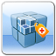

# Så här arbetar du med paket{#how-to-work-with-packages}

Med paket kan du importera och exportera databasinnehåll. Du kan till exempel använda paket för att installera nya funktioner, överföra innehåll mellan instanser och säkerhetskopiera databasinnehåll.

Paket kan öppnas och/eller underhållas från följande sidor:

* [Package Manager](#package-manager), som du använder för att hantera paketen i den lokala AEM instansen.

* [Programvarudistribution](#software-distribution), en centraliserad server som innehåller både offentligt tillgängliga paket och de som är privata för ditt företag. De publika paketen kan innehålla snabbkorrigeringar, nya funktioner, dokumentation m.m.

Du kan överföra paket mellan Package Manager, Software Distribution och ditt filsystem.

## Vad är paket? {#what-are-packages}

Ett paket är en zip-fil som innehåller databasinnehåll i form av en filsystemserialisering (kallas vault-serialisering). Detta ger en lättanvänd och redigerbar representation av filer och mappar.

Paket innehåller innehåll, både sidinnehåll och projektrelaterat innehåll, som väljs med filter.

Ett paket innehåller även vaultmetainformation, inklusive filterdefinitioner och importkonfigurationsinformation. Ytterligare innehållsegenskaper (som inte används för paketextrahering) kan inkluderas i paketet, till exempel en beskrivning, en visuell bild eller en ikon. dessa egenskaper är avsedda för innehållspaketkonsumenten och endast för informationsändamål.

>[!NOTE]
>
>Paket representerar den aktuella versionen av innehållet när paketet skapas. De innehåller inga tidigare versioner av det innehåll som AEM sparar i databasen.

Du kan utföra följande åtgärder på eller med paket:

* Skapa nya paket; definiera paketinställningar och filter efter behov
* Förhandsgranska paketinnehåll (före bygge)
* Skapa paket
* Visa paketinformation
* Visa paketinnehåll (efter bygget)
* Ändra definitionen för befintliga paket
* Återskapa befintliga paket
* Radbryt paket
* Hämta paket från AEM till filsystemet
* Överför paket från filsystemet till den lokala AEM
* Validera paketinnehåll före installation
* Utför en torr installation
* Installera paket (AEM installerar inte paket automatiskt efter överföring)
* Ta bort paket
* Hämta paket, till exempel snabbkorrigeringar, från biblioteket för programvarudistribution
* Överför paket till den företagsinterna sektionen i biblioteket för programvarudistribution

## Paketinformation {#package-information}

En paketdefinition består av olika typer av information:

* [Paketinställningar](#package-settings)
* [Paketfilter](#package-filters)
* [Paketskärmbilder](#package-screenshots)
* [Paketikoner](#package-icons)

### Paketinställningar {#package-settings}

Du kan redigera olika paketinställningar för att definiera aspekter som paketbeskrivning, relaterade fel, beroenden och providerinformation.

Dialogrutan **Paketinställningar** är tillgänglig via knappen **Redigera** när du [skapar](#creating-a-new-package) eller [redigerar](#viewing-and-editing-package-information) ett paket och innehåller tre flikar för konfiguration. Klicka på **OK** för att spara ändringarna när du har gjort dem.


| **Fält** | **Beskrivning** |
|---|---|
| Namn | Paketets namn. |
| Grupp | Namnet på gruppen som paketet ska läggas till i, för att organisera paket. Skriv namnet på en ny grupp eller markera en befintlig grupp. |
| Version | Text som ska användas för den anpassade versionen. |
| Beskrivning | En kort beskrivning av paketet. HTML-kod kan användas för formatering. |
| Miniatyrbild | Ikonen som visas med paketlistan. Klicka på Bläddra för att välja en lokal fil. |


<table>
 <tbody>
  <tr>
   <th><strong>Fält</strong></th>
   <th><strong>Beskrivning</strong></th>
   <th><strong>Format/exempel</strong></th>
  </tr>
  <tr>
   <td>Namn</td>
   <td>Namnet på providern.</td>
   <td><em>AEM Geometrixx<br /> </em></td>
  </tr>
  <tr>
   <td>Webbadress</td>
   <td>URL för providern.</td>
   <td><em>https://www.aem-geometrixx.com</em></td>
  </tr>
  <tr>
   <td>Länk</td>
   <td>Paketspecifik länk till en providersida.</td>
   <td><em>https://www.aem-geometrixx.com/mypackage.html</em></td>
  </tr>
  <tr>
   <td>Kräver<br /> </td>
   <td>
    <ul>
     <li>Administratör: Välj när paketet bara kan installeras av ett konto med administratörsbehörighet.</li>
     <li>Starta om: Välj när servern måste startas om efter att paketet har installerats.</li>
    </ul> </td>
   <td> </td>
  </tr>
  <tr>
   <td>AC-hantering</td>
   <td><p>Ange hur åtkomstkontrollsinformationen som definieras i paketet ska hanteras när paketet importeras:</p>
    <ul>
     <li><strong>Ignorera</strong></li>
     <li><strong>Skriv över</strong></li>
     <li><strong>Sammanfoga</strong></li>
     <li><strong>Radera</strong></li>
     <li><strong>MergePreserve</strong></li>
    </ul> <p>The default value is <strong>Ignore</strong>.</p> </td>
   <td>
    <ul>
     <li><strong>Ignorera</strong> - bevara åtkomstkontrollistor i databasen</li>
     <li><strong>Skriv över</strong> - skriv över ACL:er i databasen</li>
     <li><strong>Sammanfoga</strong> - sammanfoga båda uppsättningarna med åtkomstkontrollistor</li>
     <li><strong>Rensa</strong> - rensa ACL:er</li>
     <li><strong>MergePreserve</strong> - sammanfoga åtkomstkontrollen i innehållet med den som ingår i paketet genom att lägga till åtkomstkontrollposterna för objekt som inte finns i innehållet</li>
    </ul> </td>
  </tr>
 </tbody>
</table>


| **Fält** | **Beskrivning** | **Format/exempel** |
|---|---|---|
| Testad med | Det produktnamn och den version som det här paketet har eller är kompatibelt med. | *AEM6* |
| Åtgärdade fel | Ett textfält där du kan visa information om fel som har åtgärdats i det här paketet. Visa varje fel på en separat rad. | bug-nr summary |
| Beroende på | Visar beroendeinformation som måste respekteras när andra paket är nödvändiga för att det aktuella paketet ska kunna köras som förväntat. Det här fältet är viktigt när du använder snabbkorrigeringar. | groupId:name:version |
| Ersätter | En lista över borttagna paket som det här paketet ersätter. Innan du installerar kontrollerar du att det här paketet innehåller allt nödvändigt innehåll från de föråldrade paketen, så att inget innehåll skrivs över. | groupId:name:version |

### Paketfilter {#package-filters}

Filter identifierar databasnoderna som ska inkluderas i paketet. En **filterdefinition** anger följande information:

* Rotsökvägen **** för innehållet som ska inkluderas.
* **Regler** som innehåller eller exkluderar specifika noder under rotsökvägen.

Filter kan innehålla noll eller flera regler. När inga regler har definierats innehåller paketet allt innehåll under rotsökvägen.

Du kan definiera en eller flera filterdefinitioner för ett paket. Använd mer än ett filter för att inkludera innehåll från flera rotsökvägar.


Följande tabell beskriver dessa regler och innehåller exempel:

<table>
 <tbody>
  <tr>
   <th> Regeltyp</th>
   <th>Beskrivning </th>
   <th>Exempel </th>
  </tr>
  <tr>
   <td> include</td>
   <td>Du kan definiera en sökväg eller använda ett reguljärt uttryck för att ange alla noder som du vill ta med.<br /> <br /> Om du tar med en katalog kommer:
    <ul>
     <li>ta med den katalogen <i>och</i> alla filer och mappar i den katalogen (dvs hela underträdet)</li>
     <li><strong>inte</strong> inkludera andra filer eller mappar från den angivna rotsökvägen</li>
    </ul> </td>
   <td>/libs/sling/install(/.*)? </td>
  </tr>
  <tr>
   <td> exclude</td>
   <td>Du kan ange en sökväg eller använda ett reguljärt uttryck för att ange alla noder som du vill utesluta.<br /> <br /> Om du utesluter en katalog utesluts katalogen <i>och</i> alla filer och mappar i den katalogen (dvs. hela underträdet).<br /> </td>
   <td>/libs/wcm/foundation/components(/.*)?</td>
  </tr>
 </tbody>
</table>

>[!NOTE]
>
>Ett paket kan innehålla flera filterdefinitioner, så att noder från olika platser enkelt kan kombineras till ett paket.

Paketfilter definieras oftast när du först [skapar paketet](#creating-a-new-package), men de kan redigeras vid ett senare tillfälle (efter vilket paketet ska återskapas).

### Paketskärmbilder {#package-screenshots}

Du kan bifoga skärmbilder till ditt paket för att få en visuell representation av hur innehållet ser ut; genom att t.ex. tillhandahålla skärmbilder av nya funktioner.

### Paketikoner {#package-icons}

Du kan även bifoga en ikon till paketet för att få en snabb visuell representation av vad paketet innehåller. Detta visas sedan i paketlistan och kan hjälpa dig att enkelt identifiera paketet eller paketklassen.

Eftersom ett paket kan innehålla en ikon används följande konventioner för officiella paket:

>[!NOTE]
>
>Undvik förvirring genom att använda en beskrivande ikon för paketet och använd inte någon av de officiella ikonerna.

Officiellt snabbkorrigeringspaket:



AEM eller tilläggspaket:

Officiella funktionspaket:


## Pakethanteraren {#package-manager}

Pakethanteraren hanterar paketen i din lokala AEM. När du har [tilldelat nödvändiga behörigheter](#permissions-needed-for-using-the-package-manager) kan du använda pakethanteraren för olika åtgärder, bland annat för att konfigurera, bygga, hämta och installera dina paket. Nyckelelementen som ska konfigureras är:

* [Paketinställningar](#package-settings)
* [Paketfilter](#package-filters)

### Behörigheter som krävs för att använda Pakethanteraren {#permissions-needed-for-using-the-package-manager}

Om du vill ge användarna rätt att skapa, ändra, överföra och installera paket måste du ge dem rätt behörighet på följande platser:

* **/etc/paket** (fullständig behörighet exklusive radering)
* noden som innehåller paketets innehåll

Se [Ange behörigheter](/help/sites-administering/security.md#setting-page-permissions) för instruktioner om hur du ändrar behörigheter.

### Skapa ett nytt paket {#creating-a-new-package}

Så här skapar du en ny paketdefinition:

1. På AEM välkomstskärm klickar du på **Paket** (eller på **verktygskonsolen** dubbelklickar du på **Paket**).

1. Välj sedan **Pakethanteraren**.
1. Klicka på **Skapa paket**.

   >[!NOTE]
   >
   >Om din instans har många paket kan det finnas en mappstruktur på plats, så du kan navigera till den önskade målmappen innan du skapar det nya paketet.

1. I dialogrutan:

   

   Ange följande:

   * **Gruppnamn**

      Målgruppens (eller mappens) namn. Grupper är avsedda att användas för att hjälpa dig att ordna dina paket.

      En mapp skapas för gruppen om den inte redan finns. Om du lämnar gruppnamnet tomt skapas paketet i huvudpaketlistan (Hem > Paket).

   * **Paketnamn**

      Namnet på det nya paketet. Välj ett beskrivande namn som hjälper dig (och andra) att enkelt identifiera innehållet i paketet.

   * **Version**

      Ett textfält där du kan ange en version. Detta läggs till paketnamnet för att bilda zip-filens namn.
   Skapa paketet genom att klicka på **OK** .

1. AEM listar det nya paketet i lämplig gruppmapp.

   

   Klicka på ikonen eller paketnamnet som du vill öppna.

   

   >[!NOTE]
   >
   >Du kan vid behov gå tillbaka till den här sidan senare.

1. Klicka på **Redigera** för att redigera [paketinställningarna](#package-settings).

   Här kan du lägga till information och/eller definiera vissa inställningar. till exempel innehåller de en beskrivning, [ikon](#package-icons), relaterade fel och lägger till providerinformation.

   Klicka på **OK** när du är klar med redigeringen av inställningarna.

1. Lägg till **[skärmbilder](#package-screenshots)** i paketet efter behov. En instans är tillgänglig när paketet skapas. Lägg till fler om det behövs med **Package Screenshot** från sidespark.

   Lägg till den faktiska bilden genom att dubbelklicka på bildkomponenten i området **Skärmbilder** , lägga till en bild och klicka på **OK**.

1. Definiera **[paketfiltren](#package-filters)** genom att dra instanser av **filterdefinitionen** från sidosparken och sedan dubbelklicka för att öppna dem för redigering:

   

   Ange:

   * **Rotsökväg** Innehållet som ska paketeras. kan vara roten i ett underträd.
   * **Regler**&#x200B;är frivilliga. för enkla paketdefinitioner är det inte nödvändigt att ange inkluderings- eller exkluderingsregler.

      Om det behövs kan du definiera reglerna [**** Inkludera **eller** Uteslut](#package-filters) för att definiera paketets innehåll exakt.

      Lägg till regler med **+** -symbolen, eller ta bort regler med **-** -symbolen. Regler tillämpas efter deras ordning så att de kan placeras efter behov med knapparna **Upp** och **Ned** .
   Klicka sedan på **OK** för att spara filtret.

   >[!NOTE]
   >
   >Du kan använda så många filterdefinitioner du behöver, men du måste se till att de inte hamnar i konflikt. Använd **Förhandsgranska** för att bekräfta vad paketinnehållet ska vara.

1. Du kan använda **Förhandsgranska** för att bekräfta vad paketet innehåller. Detta utför en torr körning av byggprocessen och visar allt som kommer att läggas till i paketet när det byggs.
1. Nu kan du [skapa](#building-a-package) ditt paket.

   >[!NOTE]
   >
   >Det är inte obligatoriskt att bygga paketet just nu, det kan göras vid en senare tidpunkt.

### Bygga ett paket {#building-a-package}

Ett paket skapas ofta samtidigt som du [skapar paketdefinitionen](#creating-a-new-package), men du kan gå tillbaka vid ett senare tillfälle för att antingen skapa eller återskapa paketet. Detta kan vara användbart om innehållet i databasen har ändrats.

>[!NOTE]
>
>Innan du skapar paketet kan det vara användbart att förhandsgranska innehållet i paketet. Det gör du genom att klicka på **Förhandsgranska**.

1. Öppna paketdefinitionen från **pakethanteraren** (klicka på paketikonen eller paketnamnet).

1. Klicka på **Skapa**. En dialogruta där du uppmanas bekräfta att du vill skapa paketet.

   >[!NOTE]
   >
   >Detta är särskilt viktigt när du återskapar ett paket eftersom paketinnehållet skrivs över.

1. Click **OK**. AEM skapar paketet med allt innehåll som läggs till i paketet. När AEM är klar visas en bekräftelse på att paketet har skapats och (när du stänger dialogrutan) information om paketlistan uppdateras.

### Rewrapping a Package {#rewrapping-a-package}

När ett paket har byggts kan det vid behov rewrappas.

När du gör om en paketering ändras paketinformationen *utan* att paketinnehållet ändras. Paketinformationen är miniatyrbilden, beskrivningen osv., vilket innebär att allt du kan redigera i dialogrutan **Paketinställningar** (för att öppna den här klickningen på **Redigera**).

Ett viktigt användningsområde för ombrytning är när du förbereder ett paket. Du kan till exempel ha ett befintligt paket och bestämma dig för att dela det med andra. För det vill du lägga till en miniatyrbild och lägga till en beskrivning. I stället för att återskapa hela paketet med alla dess funktioner (vilket kan ta en stund och innebär att paketet inte längre är identiskt med originalpaketet) kan du kapsla in det och bara lägga till miniatyrbilden och beskrivningen.

1. Öppna paketdefinitionen från **pakethanteraren** (klicka på paketikonen eller paketnamnet).

1. Klicka på **Redigera** och uppdatera **[paketinställningarna](#package-settings)** efter behov. Spara genom att klicka på **OK** .

1. Klicka på **Radbryt**, så visas en dialogruta där du får bekräfta.

### Visa och redigera paketinformation {#viewing-and-editing-package-information}

Så här visar eller redigerar du information om en paketdefinition:

1. Gå till det paket du vill visa i Pakethanteraren.
1. Klicka på paketikonen för det paket som du vill visa. Paketsidan med information om paketdefinitionen öppnas:

   

   >[!NOTE]
   >
   >Du kan även redigera och utföra vissa åtgärder på paketet från den här sidan.
   >
   >Vilka knappar som är tillgängliga beror på om paketet redan har skapats eller inte.

1. Om paketet redan har byggts klickar du på **Innehåll**, så öppnas ett fönster där allt innehåll i paketet visas:

### Innehåll och testinstallation för visning av paket {#viewing-package-contents-and-testing-installation}

När ett paket har skapats kan du visa innehållet:

1. Gå till det paket du vill visa i Pakethanteraren.
1. Klicka på paketikonen för det paket som du vill visa. Detta öppnar paketsidan med information om paketdefinitionen.

1. Om du vill visa innehållet klickar du på **Innehåll** i ett fönster och visar hela innehållet i paketet:

   

1. Om du vill utföra en torr installation klickar du på **Testinstallation**. När du har bekräftat åtgärden öppnas ett fönster där resultatet visas som om installationen utfördes:

   

### Hämtar paket till filsystemet {#downloading-packages-to-your-file-system}

I det här avsnittet beskrivs hur du hämtar ett paket från AEM till filsystemet med hjälp av **Package Manager**.

1. På AEM välkomstskärm klickar du på **Paket** och väljer sedan **Pakethanteraren**.
1. Navigera till paketet som du vill hämta.

   

1. Klicka på länken som utgörs av zip-filens namn (understruken) för paketet som du vill hämta; till exempel `export-for-offline.zip`.

   AEM hämtar paketet till datorn (med en standarddialogruta för hämtning av webbläsare).

### Överför paket från filsystemet {#uploading-packages-from-your-file-system}

Med en paketöverföring kan du överföra ett paket från filsystemet till AEM Package Manager.
Så här överför du ett paket:

1. Navigera till **Pakethanteraren**. Till den gruppmapp som du vill att paketet ska överföras till.

   

1. Klicka på **Överför paket**.

   

   * **Arkiv**

      Du kan antingen skriva filnamnet direkt eller använda **Bläddra..** för att välja det paket som krävs från det lokala filsystemet (efter att du har valt **OK**).

   * **Tvinga överföring**

      Om det redan finns ett paket med det här namnet kan du klicka på det här om du vill framtvinga en överföring (och skriva över det befintliga paketet).
   Klicka på **OK** så att det nya paketet överförs och visas i pakethanterarlistan.

   >[!NOTE]
   >
   >Se till att du [installerar paketet](#installing-packages)för att göra innehållet tillgängligt för AEM.

### Verifierar paket {#validating-packages}

Innan du installerar ett paket kanske du vill verifiera dess innehåll. Eftersom paket kan ändra överlagrade filer under `/apps` och/eller lägga till, ändra och ta bort åtkomstkontrollistor, är det ofta användbart att validera dessa ändringar innan du installerar.

#### Valideringsalternativ {#validation-options}

Valideringsmekanismen kan kontrollera följande egenskaper hos paketet:

* OSGi-paketimporter
* Övertäckningar
* ACL

Dessa alternativ beskrivs nedan.

* **Validera OSGi-paketimporter**

   **Vad är markerat**

   Den här valideringen undersöker paketet för alla JAR-filer (OSGi-paket), extraherar deras `manifest.xml` (som innehåller de versionshanteringsberoenden som OSGi-paketet är beroende av) och verifierar den AEM instansexporten som anger beroenden med rätt versioner.

   **Hur det rapporteras**

   Alla versionshanteringsberoenden som inte kan uppfyllas av den AEM instansen visas i **aktivitetsloggen** för pakethanteraren.

   **Fellägen**

   Om beroenden inte uppfylls startar inte OSGi-paketen med dessa beroenden. Detta resulterar i en trasig programdistribution eftersom allt som förlitar sig på det OSGi-paket som inte startats i sin tur inte fungerar som det ska.

   **Felupplösning**

   För att åtgärda fel på grund av att OSGi-paketen inte är nöjd måste beroendeversionen i paketet med otillfredsställande importer justeras.

* **Validera övertäckningar**

   **Vad är markerat**

   Valideringen avgör om det paket som installeras innehåller en fil som redan finns i AEM.

   Om det till exempel finns en övertäckning på `/apps/sling/servlet/errorhandler/404.jsp`är det ett paket som innehåller `/libs/sling/servlet/errorhandler/404.jsp`så att den ändrar den befintliga filen på `/libs/sling/servlet/errorhandler/404.jsp`.

   **Hur det rapporteras**

   Alla sådana övertäckningar beskrivs i **aktivitetsloggen** i pakethanteraren.

   **Fellägen**

   Ett feltillstånd innebär att paketet försöker distribuera en fil som redan är överlagrad, vilket innebär att ändringarna i paketet åsidosätts (och därmed&quot;döljs&quot;) av övertäckningen och inte börjar gälla.

   **Felupplösning**

   För att lösa det här problemet måste den som ansvarar för övertäckningsfilens struktur i `/apps` granska ändringarna i den överliggande filen i `/libs` och införliva ändringarna efter behov i övertäckningen ( `/apps`) samt distribuera den överliggande filen på nytt.

   >[!NOTE]
   >
   >Observera att valideringsfunktionen inte kan stämma av om det överlagda innehållet har integrerats korrekt i överläggsfilen. Valideringen fortsätter därför att rapportera om konflikter även efter att nödvändiga ändringar har gjorts.

* **Validera åtkomstkontrollistor**

   **Vad är markerat**

   Valideringen kontrollerar vilka behörigheter som läggs till, hur de hanteras (sammanfoga/ersätt) och om de aktuella behörigheterna påverkas.

   **Hur det rapporteras**

   Behörigheterna beskrivs i **aktivitetsloggen** för Package Manager.

   **Fellägen**

   Inga explicita fel kan anges. Valideringen anger bara om nya ACL-behörigheter kommer att läggas till eller påverkas av att paketet installeras.

   **Felupplösning**

   Med hjälp av den information som valideringen ger kan de påverkade noderna granskas i CRXDE och åtkomstkontrollistorna kan justeras i paketet efter behov.

   >[!CAUTION]
   >
   >Som god praxis rekommenderas att paket inte påverkar AEM-tillhandahållna åtkomstkontrollistor eftersom detta kan leda till oväntade produktbeteenden.

#### Utför validering {#performing-validation}

Paketvalidering kan göras på två olika sätt:

* Via pakethanterarens gränssnitt
* Via HTTP-POST-begäran, till exempel med cURL

>[!NOTE]
>
>Validering ska alltid ske efter att paketet har överförts, men innan det installeras.

**Paketvalidering via Pakethanteraren**

1. Öppna packningshanteraren på `https://<server>:<port>/crx/packmgr`
1. Markera paketet i listan och välj sedan **Mer** i listrutan och **Validera** i listrutan.

   >[!NOTE]
   >
   >Detta bör göras efter att du har överfört innehållspaketet, men innan du installerar paketet.

1. I den modala dialogrutan som visas använder du kryssrutorna för att välja valideringstyp(er) och börja valideringen genom att klicka på **Validera**. Du kan också klicka på **Avbryt**.

1. De valda valideringarna körs sedan. Resultaten visas i aktivitetsloggen för Package Manager.

**Paketvalidering via HTTP-POST-begäran**

Begäran om POST har följande format.

```
https://<host>:<port>/crx/packmgr/service.jsp?cmd=validate&type=osgiPackageImports,overlays,acls
```

>[!NOTE]
>
>Parametern kan vara vilken kommaseparerad, osorterad lista som helst som består av: `type`
>
>* `osgiPackageImports`
>* `overlays`
>* `acls`

>
>
Standardvärdet är `type``osgiPackageImports` om det inte skickas.

Följande är ett exempel på hur du använder cURL för att köra en paketvalidering.

1. Om du använder cURL kör du en programsats som liknar följande:

   ```shell
   curl -v -X POST --user admin:admin -F file=@/Users/SomeGuy/Desktop/core.wcm.components.all-1.1.0.zip 'http://localhost:4502/crx/packmgr/service.jsp?cmd=validate&type=osgiPackageImports,overlays,acls'
   ```

1. Den begärda valideringen körs och svaret skickas tillbaka som ett JSON-objekt.

>[!NOTE]
>
>Svaret på en begäran om validering av HTTP-POST blir ett JSON-objekt med valideringsresultatet.

### Installerar paket {#installing-packages}

När du har överfört ett paket måste du installera innehållet. Om paketinnehållet ska vara installerat och fungera måste det vara både:

* läses in i AEM (antingen [överförd från filsystemet](#uploading-packages-from-your-file-system) eller hämtad från [programvarudistribution](#software-distribution))

* installerat

>[!CAUTION]
>
>Om du installerar ett paket kan befintligt innehåll skrivas över eller tas bort. Överför bara ett paket om du är säker på att det inte tar bort eller skriver över innehåll som du behöver.
>
>Om du vill se innehållet i ett paket, eller hur det påverkar det, kan du:
>
>* Gör en testinstallation av paketet utan att ändra något av innehållet:
   >  Öppna paketet (klicka på paketikonen eller paketnamnet) och klicka på **Testa installation**.
   >
   >
* Se en lista med paketets innehåll:
   >  Öppna paketet och klicka på **Innehåll**.

>


>[!NOTE]
>
>Omedelbart innan du installerar ditt paket skapas ett ögonblicksbildspaket med det innehåll som ska skrivas över.
>
>Den här ögonblicksbilden installeras om/när du avinstallerar paketet.

>[!CAUTION]
>
>Om du installerar digitala resurser måste du:
>
>* Inaktivera först WorkflowLauncher.
   >  Använd menyalternativet Komponenter i OSGi-konsolen för att inaktivera `com.day.cq.workflow.launcher.impl.WorkflowLauncherImpl`.
   >
   >
* När installationen är klar återaktiverar du WorkflowLauncher.
>
>
Genom att inaktivera WorkflowLauncher säkerställer du att Assets-importimeringsramverket inte (oavsiktligt) manipulerar resurserna vid installationen.

1. Gå till det paket du vill installera i Pakethanteraren.

   En **installationsknapp** visas vid de paket som ännu inte har installerats.

   >[!NOTE]
   >
   >Du kan också öppna paketet genom att klicka på dess ikon för att öppna knappen **Installera** där.

1. Klicka på **Installera** för att starta installationen. En dialogruta begär bekräftelse och visar alla ändringar som görs. Klicka på **Stäng** i dialogrutan när du är klar.

   Ordet **Installerad** visas bredvid paketet när det har installerats.

### Filsystembaserad överföring och installation {#file-system-based-upload-and-installation}

Det finns ett annat sätt att överföra och installera paket till din instans. I filsystemet har du en mapp tillsammans med en burk och en `crx-quicksart` `license.properties` fil. Du måste skapa en mapp med namnet `install` under `crx-quickstart`. Du kommer då att få något sådant: `<aem_home>/crx-quickstart/install`

I den här installationsmappen kan du lägga till dina paket direkt. De laddas automatiskt upp och installeras på din instans. När du är klar kan du se paketen i Package Manager.

Om instansen körs och du lägger till ett paket till `install` mappen startar överföringen direkt och installationen på instansen. Om instansen inte körs installeras paketen som du placerar i `install` mappen när du startar i alfabetisk ordning.

>[!NOTE]
>
>Du kan också göra detta innan du ens startar instansen för första gången. Om du vill göra det måste du skapa `crx-quickstart` mappen manuellt, skapa `install` mappen under den och placera paketen där. När du sedan startar instansen första gången installeras paketen i alfabetisk ordning.

### Avinstallerar paket {#uninstalling-packages}

AEM kan du avinstallera paket. Den här åtgärden återställer innehållet i databasen som påverkas av ögonblicksbilden som skapades omedelbart före paketinstallationen.

>[!NOTE]
>
>Vid installationen skapas ett ögonblicksbildspaket med det innehåll som ska skrivas över.
>
>Paketet installeras om när du avinstallerar paketet.

1. Gå till det paket som du vill avinstallera i Pakethanteraren.
1. Klicka på paketikonen för det paket som du vill avinstallera.
1. Klicka på **Avinstallera** för att ta bort innehållet i det här paketet från databasen. En dialogruta begär bekräftelse och visar alla ändringar som görs. Klicka på **Stäng** i dialogrutan när du är klar.

### Ta bort paket {#deleting-packages}

Så här tar du bort ett paket från pakethanterarlistan:

>[!NOTE]
>
>De installerade filerna/noderna från paketet tas **inte** bort.

1. Utöka mappen **Packages** i **** verktygskonsolen så att paketet visas i den högra rutan.

1. Klicka på det paket som du vill ta bort så att det är markerat och sedan antingen:

   * Klicka på **Ta bort** i verktygsfältmenyn.
   * Högerklicka och välj **Ta bort**.

   

1. AEM ber om en bekräftelse på att du vill ta bort paketet. Bekräfta borttagningen genom att klicka på **OK** .

>[!CAUTION]
>
>Om det här paketet redan har installerats tas det *installerade* innehållet **inte** bort.

### Replikerar paket {#replicating-packages}

Replikera innehållet i ett paket för att installera det på publiceringsinstansen:

1. Navigera till det paket som du vill replikera i **Pakethanteraren**.

1. Klicka på ikonen eller på namnet på det paket som du vill replikera för att expandera det.
1. Välj **Replikera** i listrutan **Mer** i verktygsfältet.

## Paketdelning {#package-share}

Paketresursen var en centraliserad server som är allmänt tillgänglig för delning av innehållspaket.

Den har ersatts av [programvarudistribution](#software-distribution).

## Programvarudistribution {#software-distribution}

[Programvarudistribution](https://downloads.experiencecloud.adobe.com) är det nya användargränssnittet som är utformat för att förenkla sökning och hämtning av AEM paket.

Mer information finns i [Software Distribution Documentation](https://experienceleague.adobe.com/docs/experience-cloud/software-distribution/home.html).

>[!CAUTION]
>
>AEM pakethanteraren kan för tillfället inte användas med programvarudistribution, du hämtar dina paket till den lokala hårddisken.

