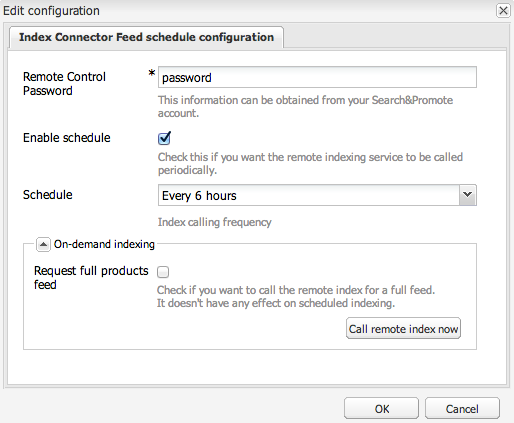

# Produktfeed {#product-feed}

AEM är integrerat med [Search&amp;Promote](https://www.adobe.com/solutions/testing-targeting/searchandpromote.html) och gör att du kan:

* använda eCommerce API, oberoende av den underliggande databasstrukturen och handelsplattformen.
* Använd funktionen Index Connector i Search&amp;Promote för att skapa en produktfeed i XML-format.
* utnyttja funktionen Fjärrstyrning i Search&amp;Promote för att utföra on-demand- eller schemalagda begäranden i produktflödet
* feed-generering för olika Search&amp;Promote-konton, konfigurerade som molntjänster.

Du måste ha ett giltigt konto och [konfigurera anslutningen till Search&amp;Promote](/help/sites-administering/search-and-promote.md#configuring-the-connection-to-search-promote). Du måste också verifiera att du använder rätt [datacenter](/help/sites-administering/search-and-promote.md#configuring-the-data-center) och kontrollera att URI:n för **fjärrserver **är konfigurerad.

## Ställ in produktfeed {#set-up-the-product-feed}

Du måste först ange en webbplatsrot och ett identifierarattribut. Så här gör du:

1. Navigera till din Search&amp;Promote-konfiguration.
1. Click **[!UICONTROL Edit]**.
1. Klicka på fliken Konfiguration **[!UICONTROL för]** indexanslutning.
1. Ange **[!UICONTROL webbplatsens rot]** och **[!UICONTROL identifierarattribut]**.

   >[!NOTE]
   >
   >Webbplatsroten **[!UICONTROL är]** roten till din eCommerce-webbplats, till exempel `/content/geometrixx-outdoors/en`.
   >
   >Identifierarattributet **** är en JCR-egenskap som unikt identifierar produkten: `identifier`.

1. Click **[!UICONTROL OK]**.

Sedan måste du redigera två konfigurationer i webbkonsolen innan du kan generera produktflöden.

### Configuring the Day CQ Search&amp;Promote Products Crawler Implementation for Geometrixx {#configuring-the-day-cq-search-promote-products-crawler-implementation-for-geometrixx}

1. Gå till [http://localhost:4502/system/console/configMgr](http://localhost:4502/system/console/configMgr).
1. Klicka på **[!UICONTROL Day CQ Search&amp;Promote products crawler implementation for Geometrixx]**.
1. Ange det Search&amp;Promote-kontonummer som crawlern är länkad till. Den kommer att användas för att leta upp den molntjänstkonfiguration som används av denna crawler.
1. Click **[!UICONTROL Save]**.

### Configuring the Day CQ Search&amp;Promote Products Feed Generator for Geometrixx {#configuring-the-day-cq-search-promote-products-feed-generator-for-geometrixx}

1. Gå till [http://localhost:4502/system/console/configMgr](http://localhost:4502/system/console/configMgr).
1. Klicka på **[!UICONTROL Day CQ Search&amp;Promote products feed generator för Geometrixx]**.
1. Ange det Search&amp;Promote-kontonummer som den här generatorn är länkad till. Den kommer att användas för att leta upp den molntjänstkonfiguration som används av den här generatorn.
1. Click **[!UICONTROL Save]**.

## Schemalägg produktfeed {#schedule-the-product-feed}

Om du vill aktivera schemalagd feed-generering måste du konfigurera en schemaläggare för den.
En schemaläggare är konfigurerad som en underordnad konfiguration till din specifika konfiguration för Search&amp;Promote-molntjänster.

1. Navigera till din Search&amp;Promote-konfiguration.
1. Klicka **[!UICONTROL +]** bredvid **[!UICONTROL Schemaläggarens konfiguration]**.
1. Ange en **[!UICONTROL titel]** som sidförfattare kan känna igen och ett unikt **[!UICONTROL namn]**.
1. Klicka på **[!UICONTROL Skapa]**. En dialogruta öppnas.

   

1. Ange **[!UICONTROL fjärrstyrningslösenordet]**. Det är lösenordet som du konfigurerade i ditt Search&amp;Pronote-konto.

   >[!NOTE]
   >
   >Det här är inte lösenordet till ditt Search&amp;Promote-konto. Du kan hitta och ändra det här lösenordet genom att logga in på ditt Search&amp;Promote-konto och gå till **[!UICONTROL Index]** och sedan till **[!UICONTROL Fjärrstyrning]**.

1. Markera **[!UICONTROL kryssrutan Aktivera schema]** .
1. Välj ett **[!UICONTROL schema]**. Det är det faktiska schemat för matningsgenerering.
1. Aktivera indexering på **[!UICONTROL begäran]** eller inte. Den här funktionen används för att manuellt anropa indexet Search&amp;Promote. Om **[!UICONTROL Request full products feed]** är markerad begär Search&amp;Promote en fullständig produktfeed. I annat fall begärs inkrementell produktfeed.

   >[!NOTE]
   >
   >Indexeringsfunktionen on-demand använder funktionen Fjärrstyrning i Search&amp;Promote. När en fjärrindexering anropas startar inte indexeringen omedelbart, men en indexeringsbegäran skickas till Search&amp;Promote med hjälp av fjärrkontrollsfunktionen.

1. Click **[!UICONTROL OK]**.

Nu när du har konfigurerat allt kan du se en XML-sida som innehåller alla produkter i den konfigurerade webbplatsens rot: [http://localhost:4502/etc/commerce/searchpromote/feed/full](http://localhost:4502/etc/commerce/searchpromote/feed/full).
