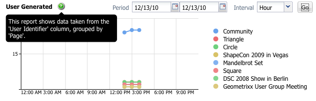
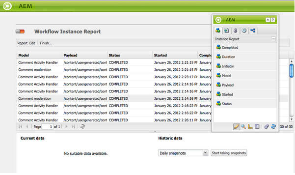

# Rapportering {#reporting}

Adobe Experience Manager (AEM) ger dig möjlighet att övervaka och analysera instansens tillstånd och innehåller ett urval standardrapporter som kan konfigureras för dina individuella behov:

* [Komponentrapport](#component-report)
* [Diskanvändning](#disk-usage)
* [Hälsokontroll](#health-check)
* [Sidaktivitetsrapport](#page-activity-report)
* [Användargenererad innehållsrapport](#user-generated-content-report)
* [Användarrapport](#user-report)
* [Instansrapport för arbetsflöde](#workflow-instance-report)
* [Arbetsflödesrapport](#workflow-report)

>[!NOTE]
>
>Rapporterna är bara tillgängliga i det klassiska användargränssnittet. Systemövervakning och rapportering i det moderna användargränssnittet finns i [Operations Dashboard.](/help/sites-administering/operations-dashboard.md)

Alla rapporter kan nås från **verktygskonsolen**. Välj **Rapporter** i den vänstra rutan och dubbelklicka sedan på önskad rapport i den högra rutan så att du kan öppna den för visning, konfiguration eller båda.

Nya instanser av en rapport kan också skapas från konsolen **Verktyg**. Välj **Rapporter** i den vänstra rutan och sedan **Nytt..** i verktygsfältet. Definiera en **titel** och **namn**, markera den rapporttyp som du behöver och klicka sedan på **Skapa**. Den nya rapportinstansen visas i listan. Dubbelklicka på den här för att öppna och dra sedan en komponent från sidosparken så att du kan skapa den första kolumnen och starta rapportdefinitionen.

>[!NOTE]
>
>Utöver de AEM standardrapporter som är tillgängliga direkt kan du [utveckla egna (nya) rapporter](/help/sites-developing/dev-reports.md).

## Grunderna i anpassning av rapporter {#the-basics-of-report-customization}

Det finns olika format för rapporter. I följande rapporter används kolumner som kan anpassas enligt följande avsnitt:

* [Komponentrapport](#component-report)
* [Sidaktivitetsrapport](#page-activity-report)
* [Användargenererad innehållsrapport](#user-generated-content-report)
* [Användarrapport](#user-report)
* [Instansrapport för arbetsflöde](#workflow-instance-report)

>[!NOTE]
>
>Följande rapporter har sina egna format och anpassningar:
>
>
>* [Hälsokontrollen](#health-check) använder urvalsfält för att ange data som du vill rapportera om.
>* [Diskanvändning](#disk-usage) använder länkar för att gå igenom databasstrukturen.
>* [Arbetsflödet](/help/sites-administering/reporting.md#workflow-report) ger en översikt över arbetsflödena som körs på din instans.
>
>Följande procedurer för kolumnkonfiguration är därför inte lämpliga. Mer information finns i beskrivningarna av de enskilda rapporterna.

### Markera och placera datakolumner {#selecting-and-positioning-the-data-columns}

Kolumner kan läggas till, flyttas på eller tas bort från alla rapporter, antingen som standard eller anpassade.

Fliken **Komponenter** i sidosparken (som är tillgänglig på rapportsidan) listar alla datakategorier som kan markeras som kolumner.

Så här ändrar du datamarkeringen:

* om du vill lägga till en kolumn drar du den önskade komponenten från sidosparken och släpper den i önskad position

   * en grön bock anger när positionen är giltig och ett par pilar anger exakt var den är placerad
   * en röd no go-symbol anger när positionen är ogiltig

* om du vill flytta en kolumn klickar du på rubriken, håller ned och drar till den nya positionen
* Om du vill ta bort en kolumn klickar du på kolumnrubriken, håller ned och drar uppåt i rapportrubrikområdet (ett rött minustecken anger att positionen inte är giltig). Släpp musknappen så begär dialogrutan Ta bort komponenter en bekräftelse på att du verkligen vill ta bort kolumnen.

### Nedrullningsbar meny för kolumn {#column-drop-down-menu}

Varje kolumn i rapporten har en listruta. Detta visas när muspekaren flyttas över kolumntitelcellen.

En pilspets visas längst till höger i titelcellen (ska inte blandas ihop med pilhuvudet direkt till höger om titeltexten som anger den [aktuella sorteringsmekanismen](#sorting-the-data)).

Vilka alternativ som är tillgängliga på menyn beror på hur kolumnen är konfigurerad (vilket sker under projektutvecklingen). Alla ogiltiga alternativ är nedtonade (nedtonade).

### Sortera data {#sorting-the-data}

Data kan sorteras efter en viss kolumn genom att antingen:

* klicka på rätt kolumnrubrik. Sorteringen växlar mellan stigande och fallande, vilket anges med en pilspets omedelbart bredvid titeltexten
* använd [kolumnens nedrullningsbara meny](#column-drop-down-menu) för att markera antingen **Sortera stigande** eller **Sortera fallande**. Återigen indikeras detta av en pilspets omedelbart bredvid titeltexten

### Grupper och det aktuella dataramarmet {#groups-and-the-current-data-chart}

För lämpliga kolumner kan du välja **Gruppera efter den här kolumnen** i [kolumnens nedrullningsbara meny](#column-drop-down-menu). Detta grupperar data efter varje distinkt värde i den kolumnen. Du kan markera mer än en kolumn som ska grupperas. Alternativet är nedtonat (nedtonat) när data i kolumnen inte är lämpliga. Det innebär att alla poster är distinkta och unika, så att inga grupper kan formas. Till exempel kolumnen Användar-ID i användarrapporten.

När minst en kolumn har grupperats genereras ett cirkeldiagram av **Aktuella data** baserat på den här grupperingen. Om flera kolumner är grupperade visas detta i diagrammet.

När du för markören över cirkeldiagrammet visas det sammanlagda värdet för det aktuella segmentet. Här används den mängd som för närvarande är definierad för kolumnen, t.ex. antal, minimum, medel.

### Filter och aggregat {#filters-and-aggregates}

I lämpliga kolumner kan du även konfigurera **filterinställningar** och/eller **aggregat** från [kolumnens nedrullningsbara meny](#column-drop-down-menu).

#### Filter {#filters}

Med Filterinställningar kan du ange villkor för poster som ska visas. De tillgängliga operatorerna är:

* `contains`
* `equals`

Så här anger du ett filter:

1. Välj den operator som du vill använda i listrutan.
1. Ange texten som ska filtreras.
1. Klicka på **Använd**.

Så här inaktiverar du filtret:

1. Ta bort filtertexten.
1. Klicka på **Använd**.

#### Aggregat {#aggregates}

Du kan också välja en aggregeringsmetod (dessa kan variera beroende på vilken kolumn som är vald):

### Kolumnegenskaper {#column-properties}

Det här alternativet är bara tillgängligt när den [allmänna kolumnen](#generic-column) har använts i [användarrapporten](#user-report).

### Historiska data {#historic-data}

Ett diagram över dataändringar över tid visas under **Historiska data**. Detta kommer från ögonblicksbilder som tagits med regelbundna intervall.

Data:

* Insamlat av, om tillgängligt, den första sorterade kolumnen, i annat fall den första kolumnen (icke-grupperad)
* Grupperad efter lämplig kolumn

Rapporten kan genereras:

1. Ange **Gruppering** i den obligatoriska kolumnen.
1. **Redigera** konfigurationen så att du kan definiera ögonblicksbilder per timme eller dag.
1. **Slutför..** definitionen som startar samlingen av ögonblicksbilder.

   Den röda/gröna reglageknappen längst upp till vänster anger när ögonblicksbilder samlas in.

Det resulterande diagrammet visas längst ned till höger:

När datainsamlingen startar kan du välja:

* **Period**

  Du kan välja från- och till-datum för rapportdata som ska visas.

* **Intervall**

  Månad, Vecka, Dag, Timme kan väljas för rapportens skala och aggregering.

  Om det t.ex. finns dagliga ögonblicksbilder för februari 2011:

   * Om intervallet är inställt på `Day` visas varje fixering som ett enskilt värde i diagrammet.
   * Om intervallet är inställt på `Month` aggregeras alla ögonblicksbilder för februari till ett enda värde (visas som en enda punkt i diagrammet).

Välj dina krav och klicka sedan på **Gå** för att tillämpa dem på rapporten. Om du vill uppdatera visningen när fler ögonblicksbilder har gjorts klickar du på **Gå** igen.

När ögonblicksbilder samlas in kan du:

* Använd **Slutför..** igen för att initiera om samlingen.

  **Slutför** om du vill frysa rapportens struktur (d.v.s. kolumnerna som är tilldelade rapporten och som är grupperade, sorterade, filtrerade o.s.v.) och börjar ta ögonblicksbilder.

* Öppna dialogrutan **Redigera** så att du kan välja **Inga ögonblicksbilder av data** för att avsluta samlingen tills det behövs.

  **Redigera** aktiverar eller inaktiverar bara ögonblicksbilder. Om ögonblicksbilder aktiveras igen används rapportens tillstånd när den senast var klar för att ta ytterligare ögonblicksbilder.

>[!NOTE]
>
>Ögonblicksbilder lagras under `/var/reports/...`, där resten av sökvägen speglar sökvägen för respektive rapport och ID som skapades när rapporten slutfördes.
>
>
>Gamla ögonblicksbilder kan rensas manuellt om du är säker på att du inte längre behöver dessa förekomster.

>[!NOTE]
>
>De förkonfigurerade rapporterna är inte prestandakrävande, men det rekommenderas ändå att du använder dagliga ögonblicksbilder i en produktionsmiljö. Om det är möjligt kan du köra dessa dagliga ögonblicksbilder vid en tidpunkt på dagen när det inte finns mycket aktivitet på webbplatsen. Detta kan definieras med parametern `Daily snapshots (repconf.hourofday)` för **Day CQ Reporting Configuration**. Mer information om hur du konfigurerar det här finns i [OSGI-konfiguration](/help/sites-deploying/configuring-osgi.md).

#### Visningsgränser {#display-limits}

Rapporten med historiska data kan också ändra utseendet något på grund av begränsningar som kan anges enligt antalet resultat för den valda perioden.

Varje vågrät linje kallas en serie (och motsvarar en post i teckenförklaringen). Varje lodrät punktkolumn representerar de aggregerade fixeringarna.

Det finns begränsningar som du kan ange för att hålla diagrammet rent under längre tidsperioder. Följande gäller för standardrapporterna:

* vågrät serie - både standard- och systemmaximum är `9`

* lodräta aggregerade ögonblicksbilder - standardvärdet är `35` (per vågrät serie)

Så när (lämpliga) gränser överskrids:

* punkterna inte visas
* teckenförklaringen för det historiska datatecknet kan visa ett annat antal poster än det aktuella datatecknet

Anpassade rapporter kan även visa värdet **Total** för alla serier. Detta visas som en serie (vågrät linje och post i teckenförklaringen).

>[!NOTE]
>
>För anpassade rapporter kan gränserna anges på ett annat sätt.

### Redigera (rapport) {#edit-report}

Knappen **Redigera** öppnar dialogrutan **Redigera rapport** .

Detta är en plats där perioden för insamling av ögonblicksbilder för [historiska data](#historic-data) har definierats, men olika andra inställningar kan också definieras:

* **Titel**

  Du kan definiera en egen titel.

* **Beskrivning**

  Du kan definiera en egen beskrivning.

* **Rotsökväg** (*endast aktiv för vissa rapporter*)

  Använd det här om du vill begränsa rapporten till en (under) del av databasen.

* **Rapportbearbetning**

   * **Uppdatera data automatiskt**

     Rapportdata uppdateras varje gång du uppdaterar rapportdefinitionen.

   * **uppdatera data manuellt**

     Det här alternativet kan användas för att förhindra fördröjningar som orsakas av automatiska uppdateringsåtgärder när det finns stora datamängder.

     Om du väljer det här alternativet måste rapportdata uppdateras manuellt när någon del av rapportkonfigurationen har ändrats. Det innebär också att när du ändrar någon aspekt av konfigurationen, tas rapporttabellen bort.

     När detta är markerat visas knappen **[Läs in data](#load-data)** (bredvid **Redigera** i rapporten). **Läs in data** läser in data och uppdaterar rapportdata som visas.

* **Fixeringar**
Du kan definiera hur ofta ögonblicksbilder ska göras, varje dag, varje timme eller inte alls.

### Läs in data {#load-data}

Knappen **Läs in data** visas bara när **uppdatera data manuellt** har valts i **[Redigera](#edit-report)**.

Om du klickar på **Läs in data** läses data in igen och rapporten uppdateras.

Om du väljer att uppdatera data manuellt innebär det att:

1. När du ändrar rapportkonfigurationen tas rapportdatatabellen bort.

   Om du till exempel ändrar sorteringsmekanismen för en kolumn visas inte data.

1. Om du vill att rapportdata ska visas igen måste du klicka på **Läs in data** för att läsa in data igen.

### Slutför (rapport) {#finish-report}

När du **slutför** rapporten:

* Rapportdefinitionen *vid den tidpunkten* används för att ta ögonblicksbilder. Därefter kan du fortsätta arbeta med en rapportdefinition eftersom den är skild från ögonblicksbilderna.
* Alla befintliga ögonblicksbilder tas bort.
* Nya ögonblicksbilder samlas in för [historiska data](#historic-data).

I den här dialogrutan kan du definiera eller uppdatera din egen titel och beskrivning för den resulterande rapporten.

## Rapporttyper {#report-types}

### Komponentrapport {#component-report}

Komponentrapporten innehåller information om hur din webbplats använder komponenterna.

[Informationskolumner](#selecting-and-positioning-the-data-columns) om:

* Författare
* Komponentsökväg
* Komponenttyp
* Senast ändrad
* Sida

Det innebär att du kan se följande:

* Vilka komponenter som används och var de används.

  Användbart vid testning.

* Hur instanser av en viss komponent distribueras.

  Detta kan vara intressant om specifika sidor (dvs.&quot;stora sidor&quot;) har prestandaproblem.

* Identifiera delar av sajten med frekventa/mindre frekventa ändringar.
* Se hur sidinnehåll utvecklas över tid.

Alla komponenter ingår, produktstandard och projektspecifik. Med dialogrutan **Redigera** kan användaren även ange en **rotsökväg** som definierar rapportens startpunkt - alla komponenter under den rotmappen beaktas för rapporten.

 

### Diskanvändning {#disk-usage}

Diskanvändningsrapporten innehåller information om de data som lagras i din databas.

Rapporten börjar i databasens rot ( / ) genom att klicka på en viss gren som du kan gå ned i databasen (den aktuella sökvägen visas i rapportrubriken).

### Hälsokontroll {#health-check}

Den här rapporten analyserar den aktuella begärandeloggen:

`<cq-installation-dir>/crx-quickstart/logs/request.log`

För att hjälpa dig att identifiera de mest dyra förfrågningarna inom en viss period.

Om du vill generera rapporten kan du ange följande:

* **Period (timmar)**

  Antalet timmar (tidigare) som ska analyseras.

  Standard: `24`

* **max. Resultat**

  Maximalt antal utdatarader.

  Standard: `50`

* **max. Begäranden**

  Maximalt antal begäranden som ska analyseras.

  Standard: `-1` (alla)

* **E-postadress**

  Skicka resultat till en e-postadress.

  Valfritt; Standard: tomt

* **Kör dagligen (hh:mm)**

  Ange en tidpunkt då rapporten ska köras automatiskt varje dag.

  Valfritt; Standard: tomt

### Sidaktivitetsrapport {#page-activity-report}

Sidaktivitetsrapporten innehåller en lista över sidor och åtgärder som har utförts på dem.

[Informationskolumner](#selecting-and-positioning-the-data-columns) om:

* Sida
* Tid
* Typ
* Användare

Betydelse som du kan övervaka:

* De senaste ändringarna.
* Författare som arbetar med specifika sidor.
* Sidor som inte har ändrats nyligen kan behöva åtgärdas.
* Sidor som ändras oftast eller oftast.
* De flesta/minst aktiva användarna.

Sidaktivitetsrapporten hämtar all information från granskningsloggen. Som standard är rotsökvägen konfigurerad till granskningsloggen på `/var/audit/com.day.cq.wcm.core.page`.

### Användargenererad innehållsrapport {#user-generated-content-report}

Den här rapporten innehåller information om användargenererat innehåll, t.ex. kommentarer, omdömen eller forum.

[Informationskolumner](#selecting-and-positioning-the-data-columns) på:

* Datum
* IP-adress
* Sida
* Referent
* Typ
* Användar-ID

Gör att du kan:

* Se vilka sidor som får flest kommentarer.
* Få en översikt över alla kommentarer som specifika besökare lämnar webbplatsen, kanske problemen är relaterade.
* Se om nytt innehåll ger upphov till kommentarer genom att övervaka när kommentarer görs på en sida.

### Användarrapport {#user-report}

Den här rapporten innehåller information om alla användare som har registrerat ett konto och/eller en profil. Den kan omfatta både författare inom organisationen och externa besökare.

[Informationskolumner](#selecting-and-positioning-the-data-columns) (om sådana finns) om:

* Ålder
* Land
* Domän
* E-post
* Efternamn
* Kön
* [Allmän](#generic-column)
* Förnamn
* Info
* Ränta
* Språk
* NTLM Hashcode
* Användar-ID

Gör att du kan:

* Se användarnas demografiska spridning.
* Rapportera om anpassade fält som du har lagt till i profilerna.

#### Allmän kolumn {#generic-column}

Kolumnen **Allmänt** är tillgänglig i användarrapporten så att du kan komma åt anpassad information, vanligtvis från [användarprofilerna](/help/sites-administering/identity-management.md#profiles-and-user-accounts); till exempel [Favoritfärg, enligt informationen under Lägg till fält i profildefinitionen](/help/sites-administering/identity-management.md#adding-fields-to-the-profile-definition).

Dialogrutan Allmän kolumn öppnas när du gör något av följande:

* Dra den allmänna komponenten från sidosparken till rapporten.
* Markera kolumnegenskaperna för en befintlig allmän kolumn.

På fliken **Definitioner** kan du definiera:

* **Titel**

  Din egen rubrik för den generiska kolumnen.

* **Egenskap**

  Egenskapsnamnet som lagrats i databasen, vanligtvis i användarens profil.

* **Sökväg**

  Vanligtvis hämtas egenskapen från `profile`.

* **Typ**

  Välj fälttyp från `String`, `Number`, `Integer`, `Date`.

* **Standardmängd**

  Detta definierar den mängd som används som standard om kolumnen delas upp i en rapport med minst en grupperad kolumn. Välj önskad mängd från `Count`, `Minimum`, `Average`, `Maximum`, `Sum`.

  *Antal* för ett `String`-fält innebär till exempel att antalet distinkta `String`-värden visas för kolumnen i aggregeringstillståndet.

På fliken **Extended** kan du även definiera de aggregeringar och filter som finns:

### Instansrapport för arbetsflöde {#workflow-instance-report}

Detta ger en kortfattad översikt som ger information om de enskilda instanserna av arbetsflöden, både som körs och slutförda.

[Informationskolumner](#selecting-and-positioning-the-data-columns) om:

* Slutförd
* Varaktighet
* Initierare
* Modell
* Nyttolast
* Startat
* Status

Det innebär att du kan:

* Övervaka arbetsflödenas genomsnittliga varaktighet. Om detta sker regelbundet kan det lyfta fram problem med arbetsflödet.

### Arbetsflödesrapport {#workflow-report}

Här finns viktig statistik om arbetsflödena som körs på instansen.

## Använda rapporter i en Publish-miljö {#using-reports-in-a-publish-environment}

När du har konfigurerat rapporterna efter dina specifika krav kan du aktivera dem för att överföra konfigurationen till publiceringsmiljön.

>[!CAUTION]
>
>Om du vill ha **historiska data** för Publish-miljön **Slutför** rapporten om redigeringsmiljön innan du aktiverar sidan.

Rapporten finns sedan tillgänglig under

`/etc/reports`

Rapporten User-Generated Content finns under:

`http://localhost:4503/etc/reports/ugcreport.html`

Nu rapporteras data som samlats in från Publish-miljön.

Eftersom ingen rapportkonfiguration tillåts i Publish-miljön är knapparna **Redigera** och **Slutför** inte tillgängliga. Du kan dock välja **Period** och **Intervall** för **Historiska data** -rapporter om ögonblicksbilder samlas in.

>[!CAUTION]
>
>Åtkomst till de här rapporterna kan vara ett säkerhetsproblem. Därför rekommenderar Adobe att du konfigurerar Dispatcher så att `/etc/reports` inte är tillgänglig för externa besökare. Mer information finns i [Säkerhetschecklistan](security-checklist.md).

## Behörigheter krävs för att köra rapporter {#permissions-needed-for-running-reports}

Behörigheterna som krävs beror på åtgärden:

* Rapportdata samlas in med den aktuella användarens behörigheter.
* Historiska data samlas in med behörigheten för användaren som slutförde rapporten.

I en AEM är följande behörigheter förinställda för rapporterna:

* **Användarrapport**

  `user administrators` - läs och skriv

* **Sidaktivitetsrapport**

  `contributors` - läs och skriv

* **Komponentrapport**

  `contributors` - läs och skriv

* **Användargenererad innehållsrapport**

  `contributors` - läs och skriv

* **Instansrapport för arbetsflöde**

  `workflow-users` - läs och skriv

Alla medlemmar i gruppen `administrators` har den behörighet som krävs för att skapa rapporter.
