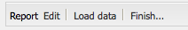

# Rapportering {#reporting}

För att hjälpa dig att övervaka och analysera instansens status tillhandahåller AEM ett urval av standardrapporter, som kan konfigureras för dina individuella krav:

* [Komponentrapport](#component-report)
* [Diskanvändning](#disk-usage)
* [Hälsokontroll](#health-check)
* [Sidaktivitetsrapport](#page-activity-report)
* [Användargenererad innehållsrapport](#user-generated-content-report)
* [Användarrapport](#user-report)
* [Instansrapport för arbetsflöde](#workflow-instance-report)
* [Arbetsflödesrapport](#workflow-report)

Alla rapporter finns på **verktygskonsolen** . Välj **Rapporter** i den vänstra rutan och dubbelklicka sedan på önskad rapport i den högra rutan för att öppna den för visning och/eller konfiguration.

Nya instanser av en rapport kan också skapas från **verktygskonsolen** . **Välj** Rapporter **i den vänstra rutan och sedan** Nytt... i verktygsfältet. Definiera en **titel** och ett **namn**, markera den rapporttyp som du vill ha och klicka sedan på **Skapa**. Den nya rapportinstansen visas i listan. Dubbelklicka på det här för att öppna och dra sedan en komponent från sidosparken för att skapa den första kolumnen och starta rapportdefinitionen.

>[!NOTE]
>
>Förutom de vanliga AEM-rapporterna som finns tillgängliga direkt kan du [ta fram egna (helt nya) rapporter](/help/sites-developing/dev-reports.md).

## Grunderna i anpassning av rapporter {#the-basics-of-report-customization}

Det finns olika format för rapporter. I följande rapporter används kolumner som kan anpassas enligt följande avsnitt:

* [Komponentrapport](#component-report)
* [Sidaktivitetsrapport](#page-activity-report)
* [Användargenererad innehållsrapport](#user-generated-content-report)
* [Användarrapport](#user-report)
* [Instansrapport för arbetsflöde](#workflow-instance-report)

>[!NOTE]
>
>Följande rapporter har sina egna format och anpassningar:
>
>
>* [Hälsokontrollen](#health-check) använder urvalsfält för att ange data som du vill rapportera om.
>* [Diskanvändning](#disk-usage) använder länkar för att gå igenom databasstrukturen.
>* [Arbetsflödesrapporten](/help/sites-administering/reporting.md#workflow-report) ger en översikt över arbetsflödena som körs på instansen.
>
>
Följande procedurer för kolumnkonfiguration är därför inte lämpliga. Mer information finns i beskrivningarna av de enskilda rapporterna.

### Markera och placera datakolumner {#selecting-and-positioning-the-data-columns}

Kolumner kan läggas till, flyttas på eller tas bort från alla rapporter, antingen som standard eller anpassade.

Fliken **Komponenter** i sidosparken (som finns på rapportsidan) listar alla datakategorier som kan markeras som kolumner.

Så här ändrar du datamarkeringen:

* om du vill lägga till en ny kolumn drar du den nödvändiga komponenten från sidosparken och släpper den på önskad plats

   * en grön bock visar när positionen är giltig och ett par pilar anger exakt var den kommer att placeras
   * en röd no go-symbol anger när positionen är ogiltig

* om du vill flytta en kolumn klickar du på rubriken, håller ned och drar till den nya positionen
* Om du vill ta bort en kolumn klickar du på kolumnrubriken, håller ned och drar uppåt i rapportrubrikområdet (ett rött minustecken anger att positionen inte är giltig). släpper du musknappen så begär dialogrutan Ta bort komponent(er) en bekräftelse på att du verkligen vill ta bort kolumnen.

### Nedrullningsbar meny för kolumn {#column-drop-down-menu}

Varje kolumn i rapporten har en nedrullningsbar meny. Detta visas när muspekaren flyttas över kolumntitelcellen.

En pilspets visas längst till höger om titelcellen (ska inte blandas ihop med pilhuvudet direkt till höger om den titeltext som anger den [aktuella sorteringsmekanismen](#sorting-the-data)).

Vilka alternativ som är tillgängliga på menyn beror på hur kolumnen är konfigurerad (vilket sker under projektutvecklingen). Alla ogiltiga alternativ är nedtonade.

### Sortera data {#sorting-the-data}

Data kan sorteras efter en viss kolumn genom att antingen:

* klicka på lämplig kolumnrubrik, sorteringen växlar mellan stigande och fallande, vilket anges med en pilspets omedelbart intill titeltexten
* Använd [kolumnens nedrullningsbara meny](#column-drop-down-menu) för att specifikt välja antingen **Sortera stigande** eller **Sortera fallande**. detta markeras med en pilspets omedelbart intill rubriktexten

### Grupper och det aktuella dataramarmet {#groups-and-the-current-data-chart}

För lämpliga kolumner kan du välja **Gruppera efter den här kolumnen** i [kolumnens listruta](#column-drop-down-menu). Detta grupperar data efter varje distinkt värde i den kolumnen. Du kan markera mer än en kolumn som ska grupperas. Alternativet kommer att tonas ned när uppgifterna i kolumnen inte är lämpliga. Det vill säga att alla poster är distinkta och unika så att inga grupper kan formas, till exempel kolumnen Användar-ID i användarrapporten.

När minst en kolumn har grupperats kommer ett cirkeldiagram av **aktuella data** att genereras baserat på den här grupperingen. Om flera kolumner är grupperade, visas även detta i diagrammet.

Om du för markören över cirkeldiagrammet visas det sammanlagda värdet för det aktuella segmentet. Här används den mängd som för närvarande är definierad för kolumnen. t.ex. antal, minimum, genomsnitt, bland annat.

### Filter och aggregat {#filters-and-aggregates}

För lämpliga kolumner kan du även konfigurera **Filterinställningar** och/eller **Aggregat** från [kolumnens nedrullningsbara meny](#column-drop-down-menu).

#### Filter {#filters}

Med Filterinställningar kan du ange villkor för poster som ska visas. De tillgängliga operatorerna är:

* `contains`
* `equals`

Så här anger du ett filter:

1. Välj den operator som du vill använda i listrutan.
1. Ange texten som ska filtreras.
1. Klicka på **Använd**.

Så här inaktiverar du filtret:

1. Ta bort filtertexten.
1. Klicka på **Använd**.

#### Aggregat {#aggregates}

Du kan också välja en aggregeringsmetod (dessa kan variera beroende på vilken kolumn som är vald):

### Kolumnegenskaper {#column-properties}

Det här alternativet är bara tillgängligt när kolumnen  Allmänt har använts i [användarrapporten](#user-report).

### Historiska data {#historic-data}

Ett diagram över hur data ändras över tid visas under **Historiska data**. Detta kommer från ögonblicksbilder som tagits med regelbundna intervall.

Data:

* Insamlat av, om tillgängligt, den första sorterade kolumnen, i annat fall den första kolumnen (icke-grupperad)
* Grupperad efter lämplig kolumn

Rapporten kan genereras:

1. Ange **gruppering** för den obligatoriska kolumnen.
1. **Redigera** konfigurationen för att definiera hur ofta ögonblicksbilderna ska göras, Varje timme eller dag.
1. **** Slutför... Definitionen som startar samlingen av ögonblicksbilder.

   Den röda/gröna reglageknappen längst upp till vänster anger när ögonblicksbilder samlas in.

Det resulterande diagrammet visas längst ned till höger:

När datainsamlingen har startat kan du välja:

* **Period**

   Du kan välja från- och till-datum för rapportdata som ska visas.

* **Intervall**

   Månad, Vecka, Dag, Timme kan väljas för rapportens skala och aggregering.

   Om det t.ex. finns dagliga ögonblicksbilder för februari 2011:

   * Om intervallet är inställt på `Day`visas varje fixering som ett enda värde i diagrammet.
   * Om intervallet är inställt på `Month`sammanställs alla ögonblicksbilder för februari till ett enda värde (visas som en enda punkt i diagrammet).

Välj dina krav och klicka sedan på **Gå** för att tillämpa dem på rapporten. Om du vill uppdatera visningen när fler ögonblicksbilder har gjorts klickar du på **Gå** igen.

När ögonblicksbilder samlas in kan du:

* **Använd** slutför... igen för att initiera om samlingen.

   **Slutför** rapportens struktur (dvs. kolumnerna som tilldelats rapporten och som grupperas, sorteras, filtreras osv.) och börjar ta ögonblicksbilder.

* Öppna dialogrutan **Redigera** om du vill välja **Inga ögonblicksbilder** av data som ska avsluta samlingen tills det behövs.

   **Redigera** bara om du vill aktivera eller inaktivera ögonblicksbilder. Om ögonblicksbilder aktiveras igen används rapportens tillstånd när den senast var klar för att ta ytterligare ögonblicksbilder.

>[!NOTE]
>
>Ögonblicksbilder lagras under `/var/reports/...` där resten av sökvägen speglar sökvägen för respektive rapport och ID som skapades när rapporten var klar.
>
>
>Gamla ögonblicksbilder kan rensas manuellt om du är helt säker på att du inte längre behöver dessa förekomster.

>[!NOTE]
>
>De förkonfigurerade rapporterna är inte prestandakrävande, men det rekommenderas ändå att du använder dagliga ögonblicksbilder i en produktionsmiljö. Om möjligt kan du köra dessa dagliga ögonblicksbilder vid en tidpunkt på dagen när det inte finns mycket aktivitet på din webbplats. Detta kan definieras med `Daily snapshots (repconf.hourofday)` parametern för **dagars CQ Reporting Configuration**. Mer information om hur du konfigurerar detta finns i [OSGI Configuration](/help/sites-deploying/configuring-osgi.md) .

#### Visningsgränser {#display-limits}

Rapporten med historiska data kan också ändra utseendet något på grund av begränsningar som kan anges enligt antalet resultat för den valda perioden.

Varje vågrät linje kallas en serie (och motsvarar en post i teckenförklaringen). Varje lodrät punktkolumn representerar de aggregerade fixeringarna.

För att hålla diagrammet rent under längre tidsperioder finns det begränsningar som kan anges. Följande gäller för standardrapporterna:

* vågrät serie - både standard- och systemmaximum är `9`

* vertikala aggregerade ögonblicksbilder - standard är `35` (per horisontella serier)

Så när (lämpliga) gränser överskrids:

* punkterna inte visas
* teckenförklaringen för det historiska datatecknet kan visa ett annat antal poster än det aktuella datatecknet

Anpassade rapporter kan även visa **totalt** värde för alla serier. Detta visas som en serie (vågrät linje och post i teckenförklaringen).

>[!NOTE]
>
>För anpassade rapporter kan gränserna anges på ett annat sätt.

### Redigera (rapport) {#edit-report}

Knappen **Redigera** öppnar dialogrutan **Redigera rapport** .

Detta är en plats där perioden för insamling av ögonblicksbilder för [historiska data](#historic-data) definieras, men olika andra inställningar kan också definieras:

* **Titel**

   Du kan definiera en egen titel.

* **Beskrivning**

   Du kan definiera en egen beskrivning.

* **Rotsökväg** (*endast aktiv för vissa rapporter*)

   Använd det här om du vill begränsa rapporten till en (under) del av databasen.

* **Rapportbearbetning**

   * **uppdatera data automatiskt**

      Rapportdata uppdateras varje gång du uppdaterar rapportdefinitionen.

   * **uppdatera data manuellt**

      Det här alternativet kan användas för att förhindra fördröjningar som orsakas av automatiska uppdateringsåtgärder när det finns stora datamängder.

      Om du väljer det här alternativet måste rapportdata uppdateras manuellt när någon aspekt av rapportkonfigurationen har ändrats. Det innebär också att så snart du ändrar någon aspekt av konfigurationen kommer rapporttabellen att tas bort.

      När det här alternativet är markerat visas knappen **[Läs in data](#load-data)**(bredvid **Redigera**i rapporten).**Läs in data**läser in data och uppdaterar rapportdata som visas.

* **Ögonblicksbilder** Du kan definiera hur ofta ögonblicksbilder ska tas; varje dag, timme eller inte alls.

### Läs in data {#load-data}

Knappen **Läs in data** visas bara när du har valt att uppdatera data **** manuellt i **[Redigera](#edit-report)**.

Om du klickar på **Läs in data** läses data in igen och rapporten uppdateras.

Om du väljer att uppdatera data manuellt innebär det att:

1. Så snart du ändrar rapportkonfigurationen kommer tabellen med rapportdata att tas bort.

   Om du t.ex. ändrar sorteringsmekanismen för en kolumn visas inte data.

1. Om du vill att rapportdata ska visas igen måste du klicka på **Läs in data** för att läsa in data igen.

### Slutför (rapport) {#finish-report}

När du **är klar** med rapporten:

* Rapportdefinitionen *från och med den tidpunkten* används för att ta ögonblicksbilder (därefter kan du fortsätta arbeta med en rapportdefinition eftersom den sedan är separat från ögonblicksbilderna).
* Alla befintliga ögonblicksbilder tas bort.
* Nya ögonblicksbilder samlas in för [historiska data](#historic-data).

I den här dialogrutan kan du definiera, eller uppdatera, din egen titel och beskrivning för den resulterande rapporten.

## Rapporttyper {#report-types}

### Komponentrapport {#component-report}

Komponentrapporten innehåller information om hur din webbplats använder komponenterna.

[Informationskolumner](#selecting-and-positioning-the-data-columns) om:

* Författare
* Komponentsökväg
* Komponenttyp
* Senast ändrad
* Sidan

Betydelse som du kan se, till exempel:

* Vilka komponenter som används där.

   Användbar, till exempel vid testning.

* Hur instanser av en viss komponent distribueras.

   Detta kan vara intressant om vissa sidor (t.ex. &quot;stora sidor&quot;) har prestandaproblem.

* Identifiera delar av sajten med frekventa/mindre frekventa ändringar.
* Se hur sidinnehåll utvecklas över tid.

Alla komponenter ingår, som är standard och projektspecifika. Med dialogrutan **Redigera** kan användaren också ange en **rotsökväg** som definierar rapportens startpunkt - alla komponenter under den rotmappen beaktas för rapporten.

 

### Diskanvändning {#disk-usage}

Diskanvändningsrapporten innehåller information om de data som lagras i databasen.

Rapporten börjar i databasens rot ( / ); genom att klicka på en viss gren kan du gå ned i databasen (den aktuella sökvägen visas i rapportrubriken).

### Hälsokontroll {#health-check}

Den här rapporten analyserar den aktuella begärandeloggen:

`<cq-installation-dir>/crx-quickstart/logs/request.log`
för att hjälpa dig att identifiera de mest dyra förfrågningarna inom en viss period.

Så här skapar du rapporten:

* **Period (timmar)**

   Antalet timmar (tidigare) som ska analyseras.

   Default: `24`

* **max. Resultat**

   Maximalt antal utdatarader.

   Default: `50`

* **max. Begäranden**

   Maximalt antal begäranden som ska analyseras.

   Standard: `-1` (all)

* **E-postadress**

   Skicka resultat till en e-postadress.

   ValfrittStandard: blank

* **Kör dagligen (hh:mm)**

   Ange en tidpunkt då rapporten ska köras automatiskt varje dag.

   ValfrittStandard: blank

### Sidaktivitetsrapport {#page-activity-report}

Sidaktivitetsrapporten innehåller en lista över sidor och åtgärder som har utförts på dem.

[Informationskolumner](#selecting-and-positioning-the-data-columns) om:

* Sidan
* Time
* Typ
* Användare

Betydelse som du kan övervaka:

* De senaste ändringarna.
* Författare som arbetar med specifika sidor.
* Sidor som inte har ändrats nyligen kan behöva åtgärdas.
* Sidor som ändras oftast eller oftast.
* De flesta/minst aktiva användarna.

Sidaktivitetsrapporten hämtar all information från granskningsloggen. Som standard är rotsökvägen konfigurerad till granskningsloggen på `/var/audit/com.day.cq.wcm.core.page`.

### Användargenererad innehållsrapport {#user-generated-content-report}

Denna rapport innehåller information om användargenererat innehåll; vara kommentarer, omdömen eller forum.

[Informationskolumner](#selecting-and-positioning-the-data-columns) om:

* Date
* IP-adress
* Sidan
* Referent
* Typ
* Användar-ID

Tillåt dig att:

* Se vilka sidor som får flest kommentarer.
* Få en översikt över alla kommentarer som specifika besökare lämnar webbplatsen, kanske problemen är relaterade.
* Se om nytt innehåll ger upphov till kommentarer genom att övervaka när kommentarer görs på en sida.

### Användarrapport {#user-report}

Denna rapport innehåller information om alla användare som har registrerat ett konto och/eller en profil. detta kan omfatta både författare inom organisationen och externa besökare.

[Informationskolumner](#selecting-and-positioning-the-data-columns) (om sådana finns) om:

* Ålder
* Land
* Domän
* E-post
* Efternamn
* Kön
* [Allmän](#generic-column)
* Förnamn
* Information
* Ränta
* Språk:
* NTLM Hashcode
* Användar-ID

Tillåt dig att:

* Se användarnas demografiska spridning.
* Rapportera om anpassade fält som du har lagt till i profilerna.

#### Allmän kolumn {#generic-column}

Den **allmänna** kolumnen finns i användarrapporten så att du kan komma åt anpassad information, vanligtvis från [användarprofilerna](/help/sites-administering/identity-management.md#profiles-and-user-accounts); Exempel: [Favoritfärg som anges under Lägg till fält i profildefinitionen](/help/sites-administering/identity-management.md#adding-fields-to-the-profile-definition).

Dialogrutan Allmän kolumn öppnas när du antingen:

* Dra den allmänna komponenten från sidosparken till rapporten.
* Markera kolumnegenskaperna för en befintlig allmän kolumn.

På fliken **Definitioner** kan du definiera:

* **Titel**

   Din egen rubrik för den generiska kolumnen.

* **Egenskap**

   Egenskapsnamnet som lagrats i databasen, vanligtvis i användarens profil.

* **Bana**

   Vanligtvis hämtas egenskapen från `profile`.

* **Typ**

   Välj fälttyp från `String`, `Number`, `Integer`, `Date`.

* **Standardaggregering**

   Detta definierar den mängd som används som standard om kolumnen delas upp i en rapport med minst en grupperad kolumn. Välj önskad mängd från `Count`, `Minimum`, `Average`, `Maximum`, `Sum`.

   Exempel: *Antal* för ett `String` fält betyder att antalet distinkta `String` värden visas för kolumnen i aggregeringstillståndet.

På fliken **Extended** kan du även definiera de aggregat och filter som är tillgängliga:

### Instansrapport för arbetsflöde {#workflow-instance-report}

Detta ger en kortfattad översikt som ger information om de enskilda instanserna av arbetsflöden, både som körs och slutförda.

[Informationskolumner](#selecting-and-positioning-the-data-columns) om:

* Slutförd
* Varaktighet
* Initierare
* Modell
* Nyttolast
* Startat
* Status

Betyder att du kan:

* övervaka arbetsflödenas genomsnittliga varaktighet, om detta händer regelbundet kan det lyfta fram problem med arbetsflödet.

### Arbetsflödesrapport {#workflow-report}

Här finns viktig statistik om arbetsflödena som körs på instansen.

## Använda rapporter i en publiceringsmiljö {#using-reports-in-a-publish-environment}

När du har konfigurerat rapporterna efter dina specifika krav kan du aktivera dem för att överföra konfigurationen till publiceringsmiljön.

>[!CAUTION]
>
>Om du vill ha **historiska data** för publiceringsmiljön **slutför** du rapporten om författarmiljön innan du aktiverar sidan.

Den lämpliga rapporten finns sedan tillgänglig under

`/etc/reports`

Rapporten User Generated Content finns under:

`http://localhost:4503/etc/reports/ugcreport.html`

Nu rapporteras data som samlats in från publiceringsmiljön.

Eftersom ingen rapportkonfiguration tillåts i publiceringsmiljön är knapparna **Redigera** och **Slutför** inte tillgängliga. Du kan dock välja **Period** och **Intervall** för **historiska** datarapporter om ögonblicksbilder samlas in.

>[!CAUTION]
>
>Tillgång till dessa rapporter kan vara en säkerhetsfråga. Därför rekommenderar vi att du konfigurerar Dispatcher så att den inte `/etc/reports` är tillgänglig för externa besökare. Mer information finns i [checklistan](security-checklist.md) .

## Behörigheter krävs för att köra rapporter {#permissions-needed-for-running-reports}

Behörigheterna som krävs beror på åtgärden:

* Rapportdata samlas i princip in med den aktuella användarens behörighet.
* Historiska data samlas in med behörigheten för användaren som slutförde rapporten.

I en standard-AEM-installation är följande behörigheter förinställda för rapporterna:

* **Användarrapport**

   `user administrators` - läsa och skriva

* **Sidaktivitetsrapport**

   `contributors` - läsa och skriva

* **Komponentrapport**

   `contributors` - läsa och skriva

* **Användargenererad innehållsrapport**

   `contributors` - läsa och skriva

* **Instansrapport för arbetsflöde**

   `workflow-users` - läsa och skriva

Alla medlemmar i `administrators` gruppen har de rättigheter som krävs för att skapa nya rapporter.
