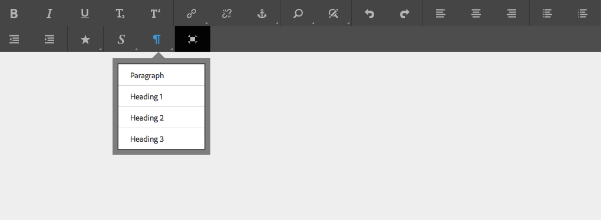

# Konfigurera RTE för att skapa tillgängliga webbsidor och webbplatser {#configure-rte-for-accessibility}

Adobe Experience Manager har stöd för många vanliga tillgänglighetsfunktioner enligt olika tillgänglighetsstandarder. Dessutom kan utvecklare anpassa eller utöka för att få funktioner som hjälper dig att skapa tillgängligt innehåll med hjälp av Experience Manager-komponenter som använder textredigeraren.

När du utformar webbsidor och lägger till innehåll på sidorna kan innehållsutvecklare och författare använda funktioner i textredigeraren för att tillhandahålla tillgänglighetsrelaterad information. Du kan till exempel lägga till strukturinformation via rubriker och styckeelement.

Om du vill konfigurera och anpassa de här funktionerna [konfigurerar du RTE-pluginerna](#configure-the-plugin-features) för komponenten. Med plugin-programmet `paraformat` kan du till exempel lägga till ytterligare semantiska element på blocknivå, inklusive att utöka antalet rubriknivåer som stöds utöver de grundläggande `H1`-, `H2`- och `H3`-elementen som standard.

RTE finns i en mängd komponenter för det beröringsaktiverade användargränssnittet och det klassiska användargränssnittet. Den primära komponenten som ska använda RTE är dock **Text** -komponenten som är tillgänglig för båda gränssnitten. I följande bilder visas RTE med ett intervall av plugin-program aktiverade, inklusive `paraformat`:



*Figur: Textkomponenten i det beröringsaktiverade användargränssnittet.*


*Figur: Textkomponenten i det klassiska användargränssnittet.*

Skillnaderna mellan de RTE-funktioner som är tillgängliga i de olika gränssnitten finns i [Plugin-program och deras funktioner](/help/sites-administering/rich-text-editor.md#aboutplugins).

## Konfigurera plugin-programfunktionerna {#configure-the-plugin-features}

Fullständiga anvisningar om hur du konfigurerar textredigeraren finns i [Konfigurera sidan för textredigeraren](/help/sites-administering/rich-text-editor.md). Detta täcker alla frågor, inklusive de viktigaste stegen:

* [Plugins och funktioner](/help/sites-administering/rich-text-editor.md#aboutplugins).
* [Konfigurationsplatser](/help/sites-administering/rich-text-editor.md#understand-the-configuration-paths-and-locations).
* [Aktivera ett plugin-program och konfigurera egenskapen för funktioner](/help/sites-administering/rich-text-editor.md#enable-rte-functionalities-by-activating-plug-ins).
* [Konfigurera andra funktioner i RTE](/help/sites-administering/rich-text-editor.md#enable-rte-functionalities-by-activating-plug-ins).

Genom att konfigurera ett plugin-program i rätt `rtePlugins`-undergren i CRXDE Lite kan du aktivera alla eller specifika funktioner för det plugin-programmet.


### Exempel - ange styckeformat som är tillgängliga i markeringsfältet för textredigering {#example-specifying-paragraph-formats-available-in-rte-selection-field}

Nya semantiska blockformat kan göras tillgängliga för markering genom att:

1. Beroende på vilken RTE du använder kan du bestämma och navigera till [konfigurationsplatsen](/help/sites-administering/rich-text-editor.md#understand-the-configuration-paths-and-locations).
1. [Aktivera styckemarkeringsfältet](/help/sites-administering/rich-text-editor.md) genom att [aktivera plugin-programmet](/help/sites-administering/rich-text-editor.md#enable-rte-functionalities-by-activating-plug-ins).
1. [Ange de format som du vill ska vara tillgängliga i fältet Val av stycken](/help/sites-administering/rich-text-editor.md).
1. Styckeformaten är sedan tillgängliga för innehållsförfattaren från markeringsfälten i textredigeraren. De kan nås:

   * Använda ikonen för styckepilcrow i det pekaktiverade användargränssnittet.
   * Använder fältet **Format** (snabbväljare) i det klassiska användargränssnittet.

Eftersom strukturella element är tillgängliga i textredigeraren via alternativen för styckeformat, är AEM en bra grund för utveckling av hjälpmedelsanpassat innehåll. Innehållsförfattare kan inte använda textredigeraren för att formatera teckenstorlek, färger eller andra relaterade attribut, vilket förhindrar att textbunden formatering skapas. I stället måste de markera lämpliga strukturella element, t.ex. rubriker, och använda globala format som du väljer med alternativet Format. Detta garanterar ren markering, fler alternativ för användare som bläddrar med egna formatmallar och korrekt strukturerat innehåll.

## Användning av källredigeringsfunktionen {#use-of-the-source-edit-feature}

I vissa fall måste innehållsförfattare granska och justera HTML källkoden som skapats med RTE. En del innehåll som skapats i en textredigerare kan till exempel kräva ytterligare kod för att säkerställa överensstämmelse med WCAG 2.0. Detta kan du göra med alternativet [källredigering](/help/sites-administering/rich-text-editor.md#aboutplugins) i textredigeraren. Du kan ange funktionen [`sourceedit` i `misctools` plugin ](/help/sites-administering/rich-text-editor.md#aboutplugins).

>[!CAUTION]
>
>Använd funktionen `sourceedit` noggrant. Skrivfel och/eller funktioner som inte stöds kan orsaka fler problem.

## Lägg till stöd för fler element och attribut i HTML {#add-support-for-more-html-elements-and-attributes}

Om du vill utöka tillgänglighetsfunktionerna i AEM ytterligare kan du utöka de befintliga komponenterna baserat på RTE (till exempel komponenterna **Text** och **Tabell**) med ytterligare element och attribut.

Följande procedur visar hur du utökar komponenten **Table** med ett **Caption** -element som ger information om en datatabell för hjälpmedelsanvändare:

### Exempel - lägg till bildtexten i dialogrutan Tabellegenskaper {#example-adding-the-caption-to-the-table-properties-dialog}

I konstruktorn för `TablePropertiesDialog` lägger du till ytterligare ett textinmatningsfält som används för att redigera bildtexten. Observera att `itemId` måste anges till `caption` (det vill säga DOM-attributets namn) för att innehållet ska hanteras automatiskt.

Ange eller ta bort attributet till/från DOM-elementet i **Tabell**. Värdet skickas av dialogrutan i objektet `config`. Observera att DOM-attribut bör anges/tas bort med motsvarande `CQ.form.rte.Common`-metoder ( `com` är en genväg för `CQ.form.rte.Common`) för att undvika vanliga fel i webbläsarimplementeringar.

>[!NOTE]
>
>Den här proceduren passar bara för det klassiska användargränssnittet.

### Exempel: skapa tillgänglig HTML när textbetoning används {#create-accessible-html-for-text}

RTE kan använda taggarna `strong` och `em` i stället för `b` och `i`. Lägg till följande nod som jämställd i noderna `uiSettings` och `rtePlugins` i dialogrutan.

```HTML
<htmlRules jcr:primaryType="nt:unstructured">
    <docType jcr:primaryType="nt:unstructured">
        <typeConfig jcr:primaryType="nt:unstructured"
                useSemanticMarkup="{Boolean}true">
            <semanticMarkupMap
                    b="strong"
                    i="em"/>
        </typeConfig>
    </docType>
</htmlRules>
```

### Stegvisa instruktioner {#step-by-step-instructions}

1. Starta CRXDE Lite. Till exempel: [http://localhost:4502/crx/de/](http://localhost:4502/crx/de/)
1. Copy:

   `/libs/cq/ui/widgets/source/widgets/form/rte/commands/Table.js`

   till:

   `/apps/cq/ui/widgets/source/widgets/form/rte/commands/Table.js`

   >[!NOTE]
   >
   >Du kan behöva skapa mellanliggande mappar om de inte redan finns.

1. Copy:

   `/libs/cq/ui/widgets/source/widgets/form/rte/plugins/TablePropertiesDialog.js`

   till:

   `/apps/cq/ui/widgets/source/widgets/form/rte/plugins/TablePropertiesDialog.js`.

1. Öppna följande fil för redigering (öppna med dubbelklick):

   `/apps/cq/ui/widgets/source/widgets/form/rte/plugins/TablePropertiesDialog.js`

1. I metoden `constructor`, före radläsningen:

   ```
   var dialogRef = this;
   ```

   Lägg till följande kod:

   ```
   editItems.push({
       "itemId": "caption",
       "name": "caption",
       "xtype": "textfield",
       "fieldLabel": CQ.I18n.getMessage("Caption"),
       "value": (this.table && this.table.caption ? this.table.caption.textContent : "")
   });
   ```

1. Öppna följande fil:

   `/apps/cq/ui/widgets/source/widgets/form/rte/commands/Table.js`.

1. Lägg till följande kod i slutet av metoden `transferConfigToTable`:

   ```
   /**
    * Adds Caption Element
   */
   var captionElement;
   if (dom.firstChild && dom.firstChild.tagName.toLowerCase() == "caption")
   {
      captionElement = dom.firstChild;
   }
   if (config.caption)
   {
       var captionTextNode = document.createTextNode(config.caption)
       if (captionElement)
       {
          dom.replaceNode(captionElement.firstChild,captionTextNode);
       } else
       {
           captionElement = document.createElement("caption");
           captionElement.appendChild(captionTextNode);
           if (dom.childNodes.length>0)
           {
              dom.insertBefore(captionElement, dom.firstChild);
           } else
           {
              dom.appendChild(captionElement);
           }
       }
   } else if (captionElement)
   {
     dom.removeChild(captionElement);
   }
   ```

1. Spara ändringarna med **Spara alla..**

>[!NOTE]
>
>Ett oformaterat textfält är inte den enda typen av indata som tillåts för bildtextelementets värde. Du kan använda en ExtJS-widget som tillhandahåller bildtextens värde via dess `getValue()`-metod.
>
>Om du vill lägga till redigeringsfunktioner för ytterligare element och attribut måste du se till att båda:
>
>* Egenskapen `itemId` för varje motsvarande fält anges till namnet på lämpligt DOM-attribut (`TablePropertiesDialog`).
>* Attributet anges och/eller tas bort explicit i DOM-elementet (`Table`).

>[!MORELIKETHIS]
>
>* [Snabbguide till WCAG 2.0](/help/managing/qg-wcag.md)
>* [Skapa tillgängligt innehåll (WCAG 2.0-överensstämmelse)](/help/sites-authoring/creating-accessible-content.md)
