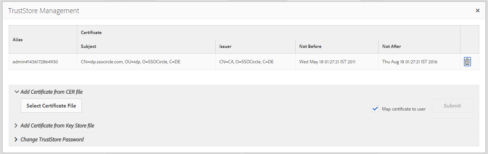

# SAML 2.0-autentiseringshanterare{#saml-authentication-handler}

AEM levereras med en [SAML](http://saml.xml.org/saml-specifications) -autentiseringshanterare. Den här hanteraren har stöd för [SAML](http://saml.xml.org/saml-specifications) 2.0 Authentication Request Protocol (Web-SSO-profil) med `HTTP POST` bindning.

Det har stöd för:

* signering och kryptering av meddelanden
* automatiskt skapa användare
* synkronisera grupper med befintliga i AEM
* Tjänsteleverantören och identitetsleverantören initierade autentisering

Den här hanteraren lagrar det krypterade SAML-svarsmeddelandet i användarnoden ( `usernode/samlResponse`) för att underlätta kommunikationen med en tredjeparts tjänsteleverantör.

>[!NOTE]
>
>Se [en demonstration av AEM- och SAML-integrering](https://helpx.adobe.com/cq/kb/saml-demo.html).
>
>Om du vill läsa en community-artikel från början till slut klickar du på: Integrera [SAML med Adobe Experience Manager](https://helpx.adobe.com/experience-manager/using/aem63_saml.html).

## Konfigurera autentiseringshanteraren för SAML 2.0 {#configuring-the-saml-authentication-handler}

Via [webbkonsolen](/help/sites-deploying/configuring-osgi.md) får du tillgång till [SAML](http://saml.xml.org/saml-specifications) 2.0 Authentication Handler-konfigurationen som kallas **Adobe Granite SAML 2.0 Authentication Handler**. Följande egenskaper kan anges.

>[!NOTE]
>
>Autentiseringshanteraren för SAML 2.0 är inaktiverad som standard. Du måste ange minst en av följande egenskaper för att kunna aktivera hanteraren:
>
>* Identitetsleverantörens POST-URL.
>* Tjänstleverantörens enhets-ID.
>

>[!NOTE]
>
>SAML-försäkringar är signerade och kan eventuellt krypteras. För att detta ska fungera måste du tillhandahålla minst det offentliga certifikatet för identitetsleverantören i TrustStore. Mer information finns i [Lägga till IdP-certifikatet i avsnittet TrustStore](/help/sites-administering/saml-2-0-authenticationhandler.md#add-the-idp-certificate-to-the-aem-truststore) .

**Sökväg** till sökvägsdatabas som den här autentiseringshanteraren ska användas för av Sling. Om detta är tomt inaktiveras autentiseringshanteraren.

**Värde på OSGi Framework Service Ranking för Service Ranking** för Service anger i vilken ordning tjänsten ska anropas. Detta är ett heltalsvärde där högre värden anger högre prioritet.

**IDP-certifikatalias** Aliaset för IdP:s certifikat i det globala förtroendearkivet. Om den här egenskapen är tom inaktiveras autentiseringshanteraren. Se kapitlet&quot;Add the IdP Certificate to the AEM TrustStore&quot; nedan om hur du konfigurerar det.

**Identity Provider URL** för den IDP som SAML-autentiseringsbegäran ska skickas till. Om den här egenskapen är tom inaktiveras autentiseringshanteraren.

>[!CAUTION]
>
>Identitetsleverantörens värdnamn måste läggas till i **OSGi-konfigurationen för Apache Sling Referrer-filtret** . Mer information finns i avsnittet [Webbkonsol](/help/sites-deploying/configuring-osgi.md) .

**Tjänstleverantörens enhets-ID** som unikt identifierar den här tjänstleverantören med identitetsleverantören. Om den här egenskapen är tom inaktiveras autentiseringshanteraren.

**Standardomdirigering** Standardplatsen att omdirigera till efter lyckad autentisering.

>[!NOTE]
>
>Den här platsen används bara om `request-path` cookien inte är inställd. Om du begär en sida under den konfigurerade sökvägen utan en giltig inloggningstoken, lagras den begärda sökvägen i en cookie
>och webbläsaren omdirigeras till den här platsen igen när autentiseringen är klar.

**Användar-ID-attribut** Namnet på attributet som innehåller det användar-ID som används för att autentisera och skapa användaren i CRX-databasen.

>[!NOTE]
>
>Användar-ID:t hämtas inte från SAML-kontrollens `saml:Subject` nod utan från detta `saml:Attribute`.

**Använd kryptering** Anger om denna autentiseringshanterare förväntar sig krypterade SAML-försäkringar eller inte.

**Skapa automatiskt CRX-användare** Anger om icke-befintliga användare ska skapas automatiskt i databasen efter lyckad autentisering.

>[!CAUTION]
>
>Om det automatiska skapandet av CRX-användare är inaktiverat måste användarna skapas manuellt.

**Lägg till i grupper** Anger om en användare automatiskt ska läggas till i CRX-grupper efter lyckad autentisering.

**Gruppmedlemskap** Namnet på saml:Attribute som innehåller en lista med CRX-grupper som den här användaren ska läggas till i.

## Lägg till IdP-certifikatet i AEM TrustStore {#add-the-idp-certificate-to-the-aem-truststore}

SAML-försäkringar är signerade och kan eventuellt krypteras. För att detta ska fungera måste du ange minst det offentliga certifikatet för IdP i databasen. För att göra detta måste du:

1. Gå till *http:/serveraddress:serverport/libs/granite/security/content/truststore.html*
1. Klicka på länken **[!UICONTROL Create TrustStore]**
1. Ange lösenordet för TrustStore och tryck på **[!UICONTROL Save]**.
1. Klicka på **[!UICONTROL Hantera TrustStore]**.
1. Överför IdP-certifikatet.
1. Notera certifikatet Alias. Aliaset är **[!UICONTROL admin#1436172864930]** i exemplet nedan.

   

## Lägg till tjänstleverantörens nyckel och certifikatkedja i AEM-nyckelbehållaren {#add-the-service-provider-key-and-certificate-chain-to-the-aem-keystore}

>[!NOTE]
>
>Stegen nedan är obligatoriska, annars kommer följande undantag att inträffa: `com.adobe.granite.keystore.KeyStoreNotInitialisedException: Uninitialised system trust store`

1. Gå till: [http://localhost:4502/libs/granite/security/content/useradmin.html](http://localhost:4502/libs/granite/security/content/useradmin.html)
1. Redigera `authentication-service` användaren.
1. Skapa en KeyStore genom att klicka på **Create KeyStore** under **Kontoinställningar**.

>[!NOTE]
>
>Stegen nedan är bara obligatoriska om hanteraren ska kunna signera eller dekryptera meddelanden.

1. Överför filen med den privata nyckeln genom att klicka på **Välj fil** med den privata nyckeln. Nyckeln måste vara i PKCS#8-format med DER-kodning.
1. Ladda upp certifikatfilen genom att klicka på **Välj certifikatkedjefiler**.
1. Tilldela ett alias enligt nedan:

   

## Konfigurera en loggare för SAML {#configure-a-logger-for-saml}

Du kan konfigurera en loggare för att felsöka problem som kan uppstå när SAML felkonfigureras. Du kan göra detta genom att:

1. Gå till webbkonsolen på *http://localhost:4502/system/console/configMgr*
1. Sök efter och klicka på posten **Apache Sling Logger Configuration**
1. Skapa en loggare med följande konfiguration:

   * **** Loggnivå: Felsök
   * **** Loggfil: logs/saml.log
   * **** Logger: com.adobe.granite.auth.saml

