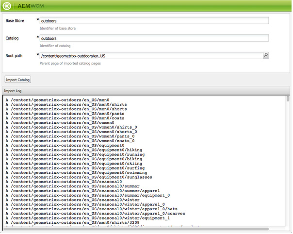

# SAP Commerce Cloud{#sap-commerce-cloud}

Efter installationen kan du konfigurera instansen:

1. [Konfigurera den motsatta sökningen för Geometrixx utomhus](#configure-the-facetted-search-for-geometrixx-outdoors).
1. [Konfigurera katalogversionen](#configure-the-catalog-version).
1. [Konfigurera importstrukturen](#configure-the-import-structure).
1. [Konfigurera de produktattribut som ska läsas in](#configure-the-product-attributes-to-load).
1. [Importerar produktdata](#importing-the-product-data).
1. [Konfigurera katalogimporteraren](#configure-the-catalog-importer).
1. Använd [importeraren för att importera katalogen](#catalog-import) till en viss plats i AEM.

## Konfigurera den motsatta sökningen för Geometrixx utomhus {#configure-the-facetted-search-for-geometrixx-outdoors}

>[!NOTE]
>
>Detta behövs inte för hybris 5.3.0.1 och senare.

1. I webbläsaren går du till **hybris Management Console** på:

   [http://localhost:9001/hmc/hybris](http://localhost:9001/hmc/hybris)

1. I sidofältet väljer du **System**, **Fasettssökning** och sedan **Fasettsökningskonfiguration**.
1. **Öppna Redigeraren** för katalogen **Sample Solr Configuration for clothescatalog**.

1. Under **Katalogversioner** använder du **Lägg till katalogversion** för att lägga till `outdoors-Staged` och `outdoors-Online` i listan.
1. **Spara** konfigurationen.
1. Öppna **SOLR-objekttyper** för att lägga till **SOLR-sorteringar** i `ClothesVariantProduct`:

   * relevans (&quot;Relevans&quot;, poäng)
   * name-asc (&quot;Name (stigande)&quot;, name)
   * name-desc (&quot;Name (fallande)&quot;, name)
   * price-asc (&quot;Price (stigande)&quot;, priceValue)
   * price-desc (&quot;Price (fallending)&quot;, priceValue)
   >[!NOTE]
   >
   >Använd snabbmenyn (oftast högerklickning) för att markera `Create Solr sort`.
   >
   >I Hybris 5.0.0 öppnar du `Indexed Types` fliken, dubbelklickar på `ClothesVariantProduct`och sedan på fliken `SOLR Sort`.

   

1. På fliken **Indexerade typer** ställer du in **Sammansatt typ** till:

   `Product - Product`

1. På fliken **Indexerade typer** justerar du **indexeringsfrågor** för `full`:

   ```shell
   SELECT {pk} FROM {Product} WHERE {pk} NOT IN ({{SELECT {baseProductpk} FROM {variantproduct}}})
   ```

1. På fliken **Indexerade typer** justerar du **indexeringsfrågor** för `incremental`:

   ```shell
   SELECT {pk} FROM {Product} WHERE {pk} NOT IN ({{SELECT {baseProductpk} FROM {variantproduct}}}) AND {modifiedtime} <= ?lastIndexTime
   ```

1. Justera **aspekten på fliken** Indexerade typer `category` . Dubbelklicka på den sista posten i kategorilistan för att öppna fliken **Indexerad egenskap** :

   >[!NOTE]
   >
   >För hybris 5.2 ska du kontrollera att attributet i tabellen Egenskaper är markerat enligt skärmbilden nedan: `Facet`

    

1. Öppna fliken **Fasettinställningar** och justera fältvärdena:

   

1. **Spara ändringarna.**
1. Justera även här från **SOLR-objekttyper**`price` enligt följande skärmbilder. Precis som med `category`det dubbelklickar du på `price` för att öppna fliken **Indexerad egenskap** :

   

1. Öppna fliken **Fasettinställningar** och justera fältvärdena:

   

1. **Spara ändringarna.**
1. Öppna **System**, **Fasettssökning** och sedan **Åtgärdsguiden** för indexering. Starta ett cronjob:

   * **Indexeraråtgärd**: `full`
   * **Solr-konfiguration**: `Sample Solr Config for Clothes`

## Konfigurera katalogversionen {#configure-the-catalog-version}

Den **katalogversion** ( `hybris.catalog.version`) som importeras kan konfigureras för OSGi-tjänsten:

**Dag CQ Commerce Hybris Configuration**( `com.adobe.cq.commerce.hybris.common.DefaultHybrisConfigurationService`)

**Katalogversionen** är vanligtvis inställd på antingen `Online` eller `Staged` (standard).

>[!NOTE]
>
>När du arbetar med AEM finns det flera metoder för att hantera konfigurationsinställningarna för sådana tjänster. Mer information finns i [Konfigurera OSGi](/help/sites-deploying/configuring-osgi.md) . Se även konsolen för en fullständig lista över konfigurerbara parametrar och deras standardvärden.

Loggutdata ger återkoppling om skapade sidor och komponenter och rapporterar potentiella fel.

## Konfigurera importstrukturen {#configure-the-import-structure}

I följande lista visas en exempelstruktur (med resurser, sidor och komponenter) som skapas som standard:

```shell
+ /content/dam/path/to/images
  + 12345.jpg (dam:Asset)
    + ...
  + ...
+ /content/site/en
  - cq:commerceProvider = "hybris"
  - cq:hybrisBaseStore = "basestore"
  - cq:hybrisCatalogId = "catalog"
  + category1 (cq:Page)
    + jcr:content (cq:PageContent)
      - jcr:title = "Category 1"
    + category11 (cq:Page)
      + jcr:content (cq:PageContent)
        - jcr:title = "Category 1.1"
      + 12345 (cq:Page)
        + jcr:content (cq:PageContent)
          + par
            + product (nt:unstructured)
              - cq:hybrisProductId = "12345"
              - sling:resourceType = "commerce/components/product"
              + image (nt:unstructured)
                - sling:resourceType = "commerce/components/product/image"
                - fileReference = "/content/dam/path/to/images/12345.jpg"
              + 12345.1-S (nt:unstructured)
                - cq:hybrisProductId = "12345.1-S"
                - sling:resourceType = "commerce/components/product"
                + image (nt:unstructured)
                  - sling:resourceType = "commerce/components/product/image"
                  - fileReference = "/content/dam/path/to/images/12345.1-S.jpg"
              + ...
```

En sådan struktur skapas av OSGi-tjänsten `DefaultImportHandler` som implementerar `ImportHandler` gränssnittet. Den faktiska importören anropar en importhanterare för att skapa produkter, produktvariationer, kategorier, tillgångar osv.

>[!NOTE]
>
>Du kan [anpassa den här processen genom att implementera en egen importhanterare](#configure-the-import-structure).

Strukturen som ska skapas vid import kan konfigureras för:

&quot;**Day CQ Commerce Hybris Default Import Handler**`(com.adobe.cq.commerce.hybris.importer.DefaultImportHandler`)

När du arbetar med AEM finns det flera metoder för att hantera konfigurationsinställningarna för sådana tjänster. Mer information finns i [Konfigurera OSGi](/help/sites-deploying/configuring-osgi.md) . Se även konsolen för en fullständig lista över konfigurerbara parametrar och deras standardvärden.

## Konfigurera de produktattribut som ska läsas in {#configure-the-product-attributes-to-load}

Svarsparsern kan konfigureras för att definiera egenskaper och attribut som ska läsas in för (variant) produkter:

1. Konfigurera OSGi-paketet:

   **Standardsvarsparser**(`com.adobe.cq.commerce.hybris.impl.importer.DefaultResponseParser`) för handelshybris i dagskvot

   Här kan du definiera olika alternativ och attribut som behövs för inläsning och mappning.

   >[!NOTE]
   >
   >När du arbetar med AEM finns det flera metoder för att hantera konfigurationsinställningarna för sådana tjänster. Mer information finns i [Konfigurera OSGi](/help/sites-deploying/configuring-osgi.md) . Se även konsolen för en fullständig lista över konfigurerbara parametrar och deras standardvärden.

## Importera produktdata {#importing-the-product-data}

Det finns flera olika sätt att importera produktdata. Produktdata kan importeras när miljön först konfigureras eller efter att hybris-data har ändrats:

* [Fullständig import](#full-import)
* [Inkrementell import](#incremental-import)
* [Express Update](#express-update)

Faktisk produktinformation som importerats från hybris lagras i databasen enligt följande:

`/etc/commerce/products`

Följande egenskaper anger länken till hybris:

* `commerceProvider`
* `cq:hybrisCatalogId`
* `cq:hybrisProductID`

>[!NOTE]
>
>hybris-implementeringen (dvs. `geometrixx-outdoors/en_US`) lagrar endast produkt-ID:n och annan grundläggande information under `/etc/commerce`.
>
>Det hänvisas till hybris-servern varje gång information om en produkt begärs.

### Fullständig import {#full-import}

1. Om det behövs tar du bort alla befintliga produktdata med CRXDE Lite.

   1. Navigera till det underträd som innehåller produktdata:

      `/etc/commerce/products`

      Exempel:

      [`http://localhost:4502/crx/de/index.jsp#/etc/commerce/products`](http://localhost:4502/crx/de/index.jsp#/etc/commerce/products)

   1. Ta bort noden som innehåller produktdata, till exempel `outdoors`.
   1. **Spara alla** för att behålla ändringen.

1. Öppna hybris-importören i AEM:

   `/etc/importers/hybris.html`

   Exempel:

   [http://localhost:4502/etc/importers/hybris.html](http://localhost:4502/etc/importers/hybris.html)

1. Konfigurera de parametrar som krävs, till exempel:

   

1. Klicka på **Importera katalog** för att starta importen.

   När du är klar kan du verifiera de data som importerats på:

   ```
       /etc/commerce/products/outdoors
   ```

   Du kan öppna detta i CRXDE Lite; till exempel:

   `[http://localhost:4502/crx/de/index.jsp#/etc/commerce/products](http://localhost:4502/crx/de/index.jsp#/etc/commerce/products)`

### Inkrementell import {#incremental-import}

1. Kontrollera informationen i AEM för den eller de relevanta produkterna i respektive underträd under:

   `/etc/commerce/products`

   Du kan öppna detta i CRXDE Lite; till exempel:

   [http://localhost:4502/crx/de/index.jsp#/etc/commerce/products](http://localhost:4502/crx/de/index.jsp#/etc/commerce/products)

1. I hybris ska informationen om relevanta produkter uppdateras.

1. Öppna hybris-importören i AEM:

   `/etc/importers/hybris.html`

   Exempel:

   [http://localhost:4502/etc/importers/hybris.html](http://localhost:4502/etc/importers/hybris.html)

1. Markera kryssrutan **Inkrementell import**.
1. Klicka på **Importera katalog** för att starta importen.

   När det är klart kan du verifiera de data som uppdaterats i AEM under:

   ```
       /etc/commerce/products
   ```


### Express Update {#express-update}

Importprocessen kan ta lång tid, så som ett tillägg till produktsynkroniseringen kan du välja specifika områden i katalogen för en snabb uppdatering som aktiveras manuellt. Detta använder exportflödet tillsammans med standardattributskonfigurationen.

1. Kontrollera informationen i AEM för den eller de relevanta produkterna i respektive underträd under:

   `/etc/commerce/products`

   Du kan öppna detta i CRXDE Lite; till exempel:

   [http://localhost:4502/crx/de/index.jsp#/etc/commerce/products](http://localhost:4502/crx/de/index.jsp#/etc/commerce/products)

1. I hybris ska informationen om relevanta produkter uppdateras.

1. I hybris lägger du till produkten/produkterna i Express-kön. till exempel:

   

1. Öppna hybris-importören i AEM:

   `/etc/importers/hybris.html`

   Exempel:

   [http://localhost:4502/etc/importers/hybris.html](http://localhost:4502/etc/importers/hybris.html)

1. Markera kryssrutan **Express Update**.
1. Klicka på **Importera katalog** för att starta importen.

   När det är klart kan du verifiera de data som uppdaterats i AEM under:

   ```
       /etc/commerce/products
   ```

   ` [](http://localhost:4502/crx/de/index.jsp#/etc/commerce/products)`

## Konfigurera katalogimporteraren {#configure-the-catalog-importer}

hybriskatalogen kan importeras till AEM med hjälp av satsimportör för hybris-kataloger, kategorier och produkter.

De parametrar som används av importeraren kan konfigureras för:

**Dag CQ Commerce Hybris Catalog Importer**( `com.adobe.cq.commerce.hybris.impl.importer.DefaultHybrisImporter`)

När du arbetar med AEM finns det flera metoder för att hantera konfigurationsinställningarna för sådana tjänster. Mer information finns i [Konfigurera OSGi](/help/sites-deploying/configuring-osgi.md) . Se även konsolen för en fullständig lista över konfigurerbara parametrar och deras standardvärden.

## Katalogimport {#catalog-import}

hybris-paketet levereras med en katalogimportör för att skapa den inledande sidstrukturen.

Det här är tillgängligt från:

`http://localhost:4502/etc/importers/hybris.html`



Följande uppgifter måste lämnas:

* **Basarkiv** Identifieraren för basarkivet som konfigurerats i hybris.

* **Katalog** Identifieraren för den katalog som ska importeras.

* **Rotsökväg** Sökvägen dit katalogen ska importeras.

## Ta bort en produkt från katalogen {#removing-a-product-from-the-catalog}

Så här tar du bort en eller flera produkter från katalogen:

1. [Konfigurera för OSGi service](/help/sites-deploying/configuring-osgi.md) **Day CQ Commerce Hybris Catalog Importer**. Se även [Konfigurera katalogimporteraren](#configure-the-catalog-importer).

   Aktivera följande egenskaper:

   * **Aktivera produktborttagning**
   * **Aktivera borttagning av produktresurser**
   >[!NOTE]
   >
   >När du arbetar med AEM finns det flera metoder för att hantera konfigurationsinställningarna för sådana tjänster. Mer information finns i [Konfigurera OSGi](/help/sites-deploying/configuring-osgi.md) . Se även konsolen för en fullständig lista över konfigurerbara parametrar och deras standardvärden.

1. Initiera importören genom att utföra två stegvisa uppdateringar (se [Katalogimport](#catalog-import)):

   * Första körningen resulterar i en uppsättning ändrade produkter som anges i logglistan.
   * För andra gången ska inga produkter uppdateras.
   >[!NOTE]
   >
   >Den första importen är att initiera produktinformationen. Den andra importen verifierar att allt fungerade och att dess produktuppsättning är klar.

1. Kontrollera kategorisidan som innehåller den produkt du vill ta bort. Produktinformationen ska vara synlig.

   I följande kategori visas information om Cajamara-produkten:

   [http://localhost:4502/editor.html/content/geometrixx-outdoors/en_US/equipment/biking.html](http://localhost:4502/editor.html/content/geometrixx-outdoors/en_US/equipment/biking.html)

1. Ta bort produkten i hybris-konsolen. Använd alternativet **Ändra godkännandestatus** för att ange statusen till `unapproved`. Produkten tas bort från liveflödet.

   Exempel:

   * Öppna sidan [http://localhost:9001/productcockpit](http://localhost:9001/productcockpit)
   * Markera katalogen `Outdoors Staged`
   * Sök efter `Cajamara`
   * Välj den här produkten och ändra godkännandestatusen till `unapproved`

1. Utför en annan stegvis uppdatering (se [Katalogimport](#catalog-import)). Loggen visar den borttagna produkten.
1. [Utför](/help/sites-administering/generic.md#rolling-out-a-catalog) lämplig katalog. Produkt- och produktsidan har tagits bort från AEM.

   Exempel:

   * Öppna:

      [http://localhost:4502/aem/catalogs.html/content/catalogs/geometrixx-outdoors-hybris](http://localhost:4502/aem/catalogs.html/content/catalogs/geometrixx-outdoors-hybris)

   * Utrulla `Hybris Base` katalogen
   * Öppna:

      [http://localhost:4502/editor.html/content/geometrixx-outdoors/en_US/equipment/biking.html](http://localhost:4502/editor.html/content/geometrixx-outdoors/en_US/equipment/biking.html)

   * Produkten kommer att `Cajamara` ha tagits bort från `Bike` kategorin

1. Så här återinstallerar du produkten:

   1. I hybris ska godkännandestatusen återställas till **godkänd**
   1. I AEM:

      1. utföra en stegvis uppdatering
      1. lansera lämplig katalog igen
      1. uppdatera lämplig kategorisida

## Lägg till orderhistorikspår i klientkontexten {#add-order-history-trait-to-the-client-context}

Så här lägger du till orderhistorik i [klientkontexten](/help/sites-developing/client-context.md):

1. Öppna [klientkontextdesignsidan](/help/sites-administering/client-context.md)genom att:

   * Öppna en sida för redigering och öppna sedan klientkontexten med **Ctrl-Alt-c** (Windows) eller **Ctrl-Option-c** (Mac). Använd pennikonen i klientkontextens övre vänstra hörn för att **öppna designsidan** ClientContext.
   * Navigera direkt till [http://localhost:4502/etc/clientcontext/default/content.html](http://localhost:4502/etc/clientcontext/default/content.html)

1. [Lägg till komponenten **** Orderhistorik](/help/sites-administering/client-context.md#adding-a-property-component) i komponenten **Kundvagn** i klientkontexten.
1. Du kan bekräfta att klientkontexten visar information om din orderhistorik. Exempel:

   1. Öppna [klientkontexten](/help/sites-administering/client-context.md).
   1. Lägg en artikel i kundvagnen.
   1. Slutför utcheckningen.
   1. Kontrollera klientkontexten.
   1. Lägg till ytterligare en artikel i kundvagnen.
   1. Navigera till utcheckningssidan:

      * Klientkontexten visar en sammanfattning av orderhistoriken.
      * Meddelandet&quot;Du är en återkommande kund&quot; visas.
   >[!NOTE]
   >
   >Meddelandet realiseras av:
   >
   >* Navigera till [http://localhost:4502/content/campaigns/geometrixx-outdoors/hybris-returning-customer.html](http://localhost:4502/content/campaigns/geometrixx-outdoors/hybris-returning-customer.html)
   >
   >  Kampanjen består av en upplevelse.
   >
   >* Klicka på segmentet ([http://localhost:4502/etc/segmentation/geometrixx-outdoors/returning-customer.html](http://localhost:4502/etc/segmentation/geometrixx-outdoors/returning-customer.html))
      >
      >
   * Segmentet byggs med egenskapen **** Orderhistorik.

