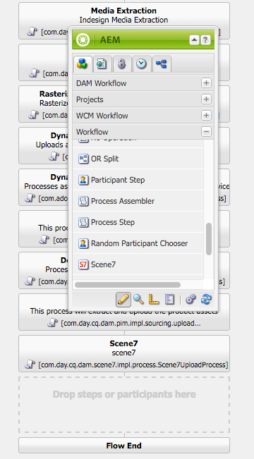

# Integrera med Dynamic Media Classic (Scene7){#integrating-with-dynamic-media-classic-scene}

[Adobe Dynamic Media Classic](https://help.adobe.com/en_US/scene7/using/WS26AB0D9A-F51C-464e-88C8-580A5A82F810.html) är en värdbaserad lösning för att hantera, förbättra, publicera och leverera mediefiler till webben, mobiler, e-post och internetanslutna skärmar och för tryck.

Om du vill använda Dynamic Media Classic måste du konfigurera molnkonfigurationen så att Dynamic Media Classic och AEM Assets kan samverka med varandra. I det här dokumentet beskrivs hur du konfigurerar AEM och Dynamic Media Classic.

Information om hur du använder alla dynamiska Media Classic-komponenter på en sida och arbetar med video finns i [Använda Dynamic Media Classic](../assets/scene7.md).

>[!NOTE]
>
>* Dynamic Media Classic&#39;s DHTML viewer Platform nåddes officiellt den 31 januari 2014. Mer information finns i Vanliga frågor och svar om [DHTML-visningsprogrammet](../sites-administering/dhtml-viewer-endoflifefaqs.md).
>* Innan du konfigurerar Dynamic Media Classic att arbeta med AEM bör du läsa [Bästa praxis](#best-practices-for-integrating-scene-with-aem) för integrering av Dynamic Media Classic med AEM.
>* Om du använder Dynamic Media Classic med en anpassad proxykonfiguration måste du konfigurera båda proxykonfigurationerna för HTTP-klienten eftersom vissa funktioner i AEM använder 3.x-API:erna och vissa andra 4.x-API:er. 3.x har konfigurerats med [http://localhost:4502/system/console/configMgr/com.day.commons.httpclient](http://localhost:4502/system/console/configMgr/com.day.commons.httpclient) och 4.x har konfigurerats med [http://localhost:4502/system/console/configMgr/org.apache.http.proxyconfigurator](http://localhost:4502/system/console/configMgr/org.apache.http.proxyconfigurator).
>

## AEM/Dynamic Media Classic-integrering jämfört med Dynamic Media {#aem-scene-integration-versus-dynamic-media}

AEM-användare kan välja mellan två lösningar för att arbeta med dynamiska medier: Antingen integrerar de sin instans av AEM med Dynamic Media Classic eller med Dynamic Media-lösningen som är integrerad i AEM.

Använd följande kriterier för att avgöra vilken lösning du ska välja:

* Om du är en **befintlig** Dynamic Media Classic-kund vars mediefiler finns i Dynamic Media Classic för publicering och leverans, men du vill integrera dessa mediefiler med hjälp av WCM-redigering (Sites) och/eller AEM Resurser för hantering, använder du den [AEM/Dynamic Media Classic-punktintegration](#aem-scene-point-to-point-integration) som beskrivs i det här dokumentet.

* Om du är en **ny** AEM-kund som har behov av multimedieleverans väljer du alternativet Dynamic Media. Det här alternativet är bäst om du inte har något befintligt S7-konto och många resurser lagrade i det systemet.

* I vissa fall kanske du vill använda båda lösningarna. Scenariot [med](/help/sites-administering/scene7.md#dual-use-scenario) dubbla användningsområden beskriver det scenariot.

### AEM/Dynamic Media Classic point-to-point-integrering {#aem-scene-point-to-point-integration}

När du arbetar med resurser i den här lösningen gör du något av följande:

* Ladda upp material direkt till Dynamic Media Classic och gå sedan åt via **Dynamic Media Classic** Content Browser för att skapa sidor eller
* Ladda upp till AEM Assets och aktivera sedan automatisk publicering till Dynamic Media Classic, du kommer åt via **Assets** content browser för att skapa sidor

Komponenterna som du använder för den här integreringen finns i komponentområdet **Dynamic Media Classic** i [designläget.](/help/sites-authoring/author-environment-tools.md#page-modes)

### AEM Dynamic Media {#aem-dynamic-media}

AEM Dynamic Media är en kombination av Dynamic Media Classic-funktioner direkt i AEM-plattformen.

När du arbetar med resurser i den här lösningen följer du det här arbetsflödet:

1. Ladda upp enstaka bild- och videomaterial direkt till AEM.
1. Koda videofilmer direkt i AEM.
1. Bygg bildbaserade uppsättningar direkt i AEM.
1. Lägg till interaktivitet i bilder eller videoklipp om tillämpligt.

Komponenterna som du använder för Dynamic Media finns i komponentområdet **[!UICONTROL Dynamic Media]** i [designläget](/help/sites-authoring/author-environment-tools.md#page-modes). De innehåller följande:

* **[!UICONTROL Dynamiska media]** - Komponenten **[!UICONTROL Dynamic Media]** är smart - beroende på om du lägger till en bild eller en video har du olika alternativ. Komponenten har stöd för bildförinställningar, bildbaserade visningsprogram som bilduppsättningar, snurra, blandade medieuppsättningar och video. Dessutom är visningsprogrammet responsivt - skärmstorleken ändras automatiskt baserat på skärmstorleken. Alla visningsprogram är HTML5-visningsprogram.

* **[!UICONTROL Interaktiva media]** - Komponenten **[!UICONTROL Interactive Media]** är avsedd för resurser som karusellbanderoller, interaktiva bilder och interaktiv video som har interaktivitet i dem, till exempel hotspot-områden eller bildscheman. Den här komponenten är smart - beroende på om du lägger till en bild eller en video har du olika alternativ. Dessutom är visningsprogrammet responsivt - skärmstorleken ändras automatiskt baserat på skärmstorleken. Alla visningsprogram är HTML5-visningsprogram.

### Scenario med dubbla användningsområden {#dual-use-scenario}

Du kan använda både integreringsfunktionerna Dynamic Media och Dynamic Media Classic i AEM samtidigt. I följande exempeltabell beskrivs när du aktiverar och inaktiverar vissa områden.

Så här använder du Dynamic Media och Dynamic Media Classic samtidigt:

1. Konfigurera [Dynamic Media Classic](#creating-a-cloud-configuration-for-scene) i molntjänster.
1. Följ de specifika instruktionerna för ditt användningsfall:

   <table>
    <tbody>
    <tr>
    <td> </td>
    <td> </td>
    <td><strong>Dynamiska medier</strong></td>
    <td> </td>
    <td><strong>Dynamic Media Classic-integrering</strong></td>
    <td> </td>
    </tr>
    <tr>
    <td><strong>Om du är ...</strong></td>
    <td><strong>Arbetsflöde för användningsfall</strong></td>
    <td><strong>Bild/video</strong></td>
    <td><strong>Dynamic Media Component</strong></td>
    <td><strong>S7 Content Browser and Components</strong></td>
    <td><strong>Automatisk överföring från resurser till S7</strong></td>
    </tr>
    <tr>
    <td>Nyheter i Sites och Dynamic Media</td>
    <td>Ladda upp material till AEM och använd AEM Dynamic Media-komponenten för att skapa material på webbplatssidor</td>
    <td>
På
 
(Se steg 3)
 </td>
    <td><a href="/help/assets/adding-dynamic-media-assets-to-pages.md">På</a></td>
    <td>Av</td>
    <td>Av</td>
    </tr>
    <tr>
    <td>I detaljhandeln och är nya på Sites och Dynamic Media</td>
    <td>Överför icke-produktresurser till AEM för hantering och leverans. Ladda upp produktmaterial till Dynamic Media Classic och använd Dynamic Media Classic Content Browser i AEM och komponent för att skapa produktinformationssidor på webbplatser.</td>
    <td>
På
 
(Se steg 3)
 </td>
    <td><a href="/help/assets/adding-dynamic-media-assets-to-pages.md">På</a></td>
    <td><a href="/help/assets/scene7.md#scene-content-browser">På</a></td>
    <td>Av</td>
    </tr>
    <tr>
    <td>Nyheter i Assets och Dynamic Media</td>
    <td>Överför resurser till AEM Assets och använd publicerad URL/inbäddningskod från Dynamic Media</td>
    <td>
På
 
(Se steg 3)
 </td>
    <td>Av</td>
    <td>Av</td>
    <td>Av</td>
    </tr>
    <tr>
    <td>Nyheter i Dynamic Media och Templating</td>
    <td>Använd Dynamic Media för bild och video. Skapa bildmallar i Dynamic Media Classic och använd Dynamic Media Classic Content Finder för att inkludera mallar på Sites-sidor.</td>
    <td>
På
 
(Se steg 3)
 </td>
    <td><a href="/help/assets/adding-dynamic-media-assets-to-pages.md">På</a></td>
    <td><a href="/help/assets/scene7.md#scene-content-browser">På</a></td>
    <td>Av</td>
    </tr>
    <tr>
    <td>En befintlig Dynamic Media Classic-kund och är ny på Sites</td>
    <td>Ladda upp material till Dynamic Media Classic och använd AEM Dynamic Media Classic-webbläsare för att söka efter och redigera material på webbplatssidor</td>
    <td>Av</td>
    <td>Av</td>
    <td><a href="/help/assets/scene7.md#scene-content-browser">På</a></td>
    <td>Av</td>
    </tr>
    <tr>
    <td>En befintlig Dynamic Media Classic-kund och är ny för Sites and Assets</td>
    <td>Ladda upp material till DAM och publicera automatiskt till Dynamic Media Classic för leverans. Använd AEM Dynamic Media Classic-innehållsläsaren för att söka efter och redigera resurser på webbplatssidor.</td>
    <td>Av</td>
    <td>Av</td>
    <td><a href="/help/assets/scene7.md#scene-content-browser">På</a></td>
    <td>
<a href="#configuringautouploadingfromaemassets">På</a>
 
(Se steg 4)
 </td>
    </tr>
    <tr>
    <td>Befintlig Dynamic Media Classic-kund och nybörjare på Assets</td>
    <td>
Ladda upp material till AEM och använd Dynamic Media för att generera renderingar för nedladdning/delning. Publicera automatiskt AEM-material till Dynamic Media Classic för leverans.
 
<strong></strong> Viktigt: Inaktiverar dubblettbearbetning och återgivningar som genererats i AEM kommer inte att synkroniseras med Dynamic Media Classic
 </td>
    <td>
På
 
(Se steg 3)
 </td>
    <td>Av</td>
    <td>Av</td>
    <td>
<a href="#configuringautouploadingfromaemassets">På</a>
 
(Se steg 4)
 </td>
    </tr>
    </tbody>
    </table>

1. (Valfritt) (se falltabell) - Konfigurera molnkonfigurationen [för](/help/assets/config-dynamic.md) dynamiska media och [aktivera Dynamic Media-servern](/help/assets/config-dynamic.md).
1. (Valfritt) (se falltabell) - Om du väljer att aktivera automatisk överföring från resurser till Dynamic Media Classic måste du lägga till följande:

   1. Konfigurera automatisk överföring till Dynamic Media Classic.
   1. Lägg till steget **Dynamic Media Classic-överföring** efter alla arbetsflödesstegen för dynamiska media *i slutet av* arbetsflödet för **Dam Update Asset** ( `https://<server>:<host>/cf#/etc/workflow/models/dam/update_asset.html)`
   1. (Valfritt) Begränsa uppladdning av dynamiska media Classic-resurser efter MIME-typ i [https://&lt;server>:&lt;port>/system/console/configMgr/com.day.cq.dam.scene7.impl.Scene7AssetMimeTypeServiceImpl](http://localhost:4502/system/console/configMgr/com.day.cq.dam.scene7.impl.Scene7AssetMimeTypeServiceImpl). MIME-typer för resurser som inte finns i den här listan kommer inte att överföras till Dynamic Media Classic-servern.
   1. (Valfritt) Konfigurera video i Dynamic Media Classic-konfigurationen. Du kan aktivera videokodning för antingen eller både Dynamic Media och Dynamic Media Classic samtidigt. Dynamiska återgivningar används för att förhandsgranska och spela upp lokalt i AEM-instanser, medan dynamiska Media Classic-videoåtergivningar genereras och lagras på Dynamic Media Classic-servrar. När du konfigurerar videokodningstjänster för både Dynamic Media och Dynamic Media Classic använder du en [videobearbetningsprofil](/help/assets/video-profiles.md) för resursmappen Dynamic Media Classic.
   1. (Valfritt) [Konfigurera säker förhandsvisning i Dynamic Media Classic](/help/sites-administering/scene7.md#configuring-the-state-published-unpublished-of-assets-pushed-to-scene).

#### Begränsningar {#limitations}

När både Dynamic Media Classic och Dynamic Media är aktiverade finns följande begränsningar:

* Manuell överföring till Dynamic Media Classic genom att markera en resurs och dra den till en Dynamic Media Classic-komponent på en AEM-sida fungerar inte.
* Även om synkroniserade AEM-Dynamic Media Classic-resurser uppdateras automatiskt till Dynamic Media Classic när resursen redigeras i Assets, utlöser en återställningsåtgärd inte en ny överföring och Dynamic Media Classic får därför inte den senaste versionen omedelbart efter en återställning. Du kan lösa problemet genom att redigera igen när återställningen är klar.
* Om du behöver använda Dynamic Media för ett användningsfall och Dynamic Media Classic-integrering för ett annat användningsfall, så att de dynamiska medieresurserna inte interagerar med Dynamic Media Classic-systemet, ska du inte använda Dynamic Media Classic-konfigurationen för Dynamic Media-mappen eller Dynamic Media-konfigurationen (bearbetningsprofil) för en Dynamic Media Classic-mapp.

## Bästa sättet att integrera Dynamic Media Classic med AEM {#best-practices-for-integrating-scene-with-aem}

När du integrerar Dynamic Media Classic med AEM finns det några viktiga metodtips som behöver följas inom följande områden:

* Testa integreringen
* Överför resurser direkt från Dynamic Media Classic rekommenderas för vissa scenarier

Se [kända begränsningar](#known-limitations-and-design-implications).

### Testa integreringen {#test-driving-your-integration}

Adobe rekommenderar att du testkör integreringen genom att låta rotmappen peka mot en undermapp i stället för ett helt företag.

>[!CAUTION]
>
>Det kan ta lång tid att importera mediefiler från ett befintligt Dynamic Media Classic-företagskonto och visa dem i AEM. Se till att du anger en mapp i Dynamic Media Classic som inte har för många resurser (rotmappen har till exempel ofta för många resurser och kan krascha systemet).

### Överföra resurser från AEM Assets jämfört med Dynamic Media Classic {#uploading-assets-from-aem-assets-versus-from-scene}

Du kan överföra resurser antingen med hjälp av funktionen Resurser (digital resurshantering) eller genom att gå till Dynamic Media Classic direkt i AEM via webbläsaren Dynamic Media Classic. Vilken du väljer beror på följande faktorer:

* Mediefiler av typen Dynamic Media Classic som AEM Assets ännu inte stöder måste läggas till på en AEM-webbplats direkt från Dynamic Media Classic via till exempel bildmallar.
* För resurstyper som stöds av både AEM Resurser och Dynamic Media Classic beror överföringssättet på följande:

   * Var tillgångarna finns idag OCH
   * Hur viktigt det är att hantera dem i en gemensam databas

Om resurserna redan finns i Dynamic Media Classic och det inte är lika viktigt att hantera dem i en gemensam databas, är det inte längre nödvändigt att exportera dem till AEM Assets för att synkronisera dem till Dynamic Media Classic för leverans. Annars kan det vara bättre att behålla resurser i en enda databas och synkronisera till Dynamic Media Classic endast för leverans.

## Konfigurera integrering med Dynamic Media Classic {#configuring-scene-integration}

Du kan konfigurera AEM så att resurser överförs till Dynamic Media Classic. Resurser från en CQ-målmapp kan överföras (automatiskt eller manuellt) från AEM till ett Dynamic Media Classic-företagskonto.

>[!NOTE]
>
>Adobe rekommenderar att du endast använder den angivna målmappen för import av Dynamic Media Classic-resurser. Digitala resurser som ligger utanför målmappen kan bara användas i komponenter i Dynamic Media Classic på sidor där Dynamic Media Classic-konfigurationen har aktiverats. Dessutom placeras de i en ad hoc-mapp i Dynamic Media Classic. Ad hoc-mappen är inte synkroniserad med AEM (men resurserna kan upptäckas i den dynamiska medieläsaren).

Om du vill konfigurera Dynamic Media Classic för integrering med AEM måste du utföra följande steg:

1. [Definiera en molnkonfiguration](#creating-a-cloud-configuration-for-scene) - Definierar mappningen mellan en Dynamic Media Classic-mapp och en Assets-mapp. Du måste slutföra det här steget även om du bara vill ha en enkelriktad synkronisering (AEM Resurser till Dynamic Media Classic).
1. [Aktivera **Adobe CQ s7dam Dam Listener **](#enabling-the-adobe-cq-scene-dam-listener)- klar i[!UICONTROL OSGi]-konsolen.
1. Om du vill att AEM-resurser automatiskt ska överföras till Dynamic Media Classic måste du aktivera det alternativet och lägga till Dynamic Media Classic i arbetsflödet för DAM-uppdateringsresurser. Du kan också överföra resurser manuellt.
1. Lägger till Dynamic Media Classic-komponenter i sidosparken. Detta gör att användarna kan använda komponenter i Dynamic Media Classic på sina AEM-sidor.
1. [Mappa konfigurationen till sidan i AEM](#enabling-scene-for-wcm) - Det här steget krävs för att visa alla förinställningar för video som du har skapat i Dynamic Media Classic. Det krävs också om du behöver publicera en resurs utanför CQ-målmappen till Dynamic Media Classic.

I det här avsnittet beskrivs hur du utför alla dessa steg och en lista med viktiga begränsningar.

### Hur synkronisering mellan Dynamic Media Classic och AEM Assets fungerar {#how-synchronization-between-scene-and-aem-assets-works}

När du konfigurerar AEM Assets och Dynamic Media Classic-synkronisering är det viktigt att du förstår följande:

#### Överför till Dynamic Media Classic från AEM Assets {#uploading-to-scene-from-aem-assets}

* Det finns en angiven synkroniseringsmapp i AEM för överföring av Dynamic Media Classic.
* Överföringar till Dynamic Media Classic kan automatiseras om de digitala resurserna placeras i den angivna synkroniseringsmappen.
* Mappen och undermappsstrukturen i AEM replikeras i Dynamic Media Classic.

>[!NOTE]
>
>AEM bäddar in alla metadata som XMP innan de överförs till Dynamic Media Classic, så alla egenskaper på metadatanoden är tillgängliga i Dynamic Media Classic som XMP.

#### Kända begränsningar och designkonsekvenser {#known-limitations-and-design-implications}

I och med synkroniseringen mellan AEM Assets och Dynamic Media Classic finns det för närvarande följande begränsningar/designkonsekvenser:

<table>
 <tbody>
  <tr>
   <td><strong>Begränsningar/konstruktionsdetaljer</strong></td>
   <td><strong>Beskrivning</strong></td>
  </tr>
  <tr>
   <td>En avsedd synkroniseringsmapp (målmapp)</td>
   <td>Du kan bara ha en mapp per företag i AEM för Dynamic Media Classic-överföringar. Du kan skapa flera konfigurationer om du behöver ha tillgång till mer än ett företagskonto i Dynamic Media Classic.</td>
  </tr>
  <tr>
   <td>Mappstruktur</td>
   <td>Om du tar bort en synkroniserad mapp med resurser, tas alla dynamiska Media Classic-fjärrresurser bort, men mappen finns kvar.</td>
  </tr>
  <tr>
   <td>Ad hoc-mapp</td>
   <td>Resurser som ligger utanför målmappen och som överförs manuellt till Dynamic Media Classic i WCM placeras automatiskt i en separat ad hoc-mapp i Dynamic Media Classic. Du konfigurerar detta i molnkonfigurationen i AEM.</td>
  </tr>
  <tr>
   <td>Blandat media</td>
   <td>Blandade medieuppsättningar visas i AEM även om de inte stöds i AEM.</td>
  </tr>
  <tr>
   <td>PDF</td>
   <td>Genererade PDF-filer från e-kataloger i Dynamic Media Classic importeras till CQ-målmappen.</td>
  </tr>
  <tr>
   <td>Gränssnittsuppdatering</td>
   <td>När du synkroniserar mellan AEM och Dynamic Media Classic måste du uppdatera användargränssnittet för att se ändringarna. </td>
  </tr>
  <tr>
   <td>Videominiatyrer</td>
   <td>Om du överför en video till AEM Resurser för kodning via Dynamic Media Classic kan det ta en stund innan videominiatyrerna och de kodade videoklippen är tillgängliga i AEM Resurser, beroende på videobearbetningstiden.</td>
  </tr>
  <tr>
   <td>Målundermappar</td>
   <td>
Om du använder undermappar i målmappen måste du antingen använda unika namn för varje resurs (oavsett plats) eller konfigurera Dynamic Media Classic (under Konfigurera) så att resurserna inte skrivs över oavsett plats.
 
Annars överförs resurser med samma namn som överförs till en dynamisk Media Classic-målundermapp, men resursen med samma namn i målmappen tas bort. 
 </td>
  </tr>
 </tbody>
</table>

### Konfigurera Dynamic Media Classic-servrar {#configuring-scene-servers}

Om du kör AEM bakom en proxy eller har speciella brandväggsinställningar, kan du behöva aktivera värdarna för de olika regionerna explicit. Servrar hanteras i innehåll i `/etc/cloudservices/scene7/endpoints` och kan anpassas efter behov. Tryck på en URL-adress och redigera sedan om det behövs för att ändra URL-adressen. I tidigare versioner av AEM var dessa värden hårdkodade.

Om du navigerar till `/etc/cloudservices/scene7/endpoints.html`de listade servrarna (och kan redigera dem genom att klicka på URL:en):

### Skapa en molnkonfiguration för Dynamic Media Classic {#creating-a-cloud-configuration-for-scene}

En molnkonfiguration definierar mappningen mellan en dynamisk Media Classic-mapp och en AEM Assets-mapp. Den måste konfigureras för att synkronisera AEM-resurser med Dynamic Media Classic. Mer information finns i Så här fungerar synkroniseringen.

>[!CAUTION]
>
>Det kan ta lång tid att importera mediefiler från ett befintligt Dynamic Media Classic-företagskonto och visa dem i AEM. Se till att du anger en mapp i Dynamic Media Classic som inte har för många resurser (rotmappen har till exempel ofta för många resurser).
>
>Om du vill testa att köra integreringen kanske du bara vill att rotmappen ska peka på en undermapp, i stället för på hela företaget.

>[!NOTE]
>
>Du kan ha flera konfigurationer: en molnkonfiguration representerar en användare på ett Dynamic Media Classic-företag. Om du vill få tillgång till andra Dynamic Media Classic-företag eller -användare måste du skapa flera konfigurationer.

Så här konfigurerar du AEM så att det går att publicera resurser till Dynamic Media Classic:

1. Tryck på AEM-ikonen och navigera till **[!UICONTROL Distribution > Cloud-tjänster]** för att komma åt Adobe Dynamic Media Classic.

1. Tryck på **[!UICONTROL Konfigurera nu]**.

   

1. Ange lämplig information i fältet **[!UICONTROL Titel]** och eventuellt i fältet **[!UICONTROL Namn]** . Tryck på **[!UICONTROL Skapa]**.

   >[!NOTE]
   >
   >När du skapar ytterligare konfigurationer visas det **[!UICONTROL överordnade konfigurationsfältet]** .
   >
   >Ändra **inte** den överordnade konfigurationen. Om du ändrar den överordnade konfigurationen kan integreringen brytas.

1. Ange e-postadress, lösenord och region för ditt Dynamic Media Classic-konto och tryck på **[!UICONTROL Anslut till Dynamic Media Classic]**. Du är ansluten till Dynamic Media Classic-servern och dialogrutan utökas med fler alternativ.

1. Ange **[!UICONTROL företagsnamnet]** och **[!UICONTROL rotsökvägen]** (det här är det publicerade servernamnet tillsammans med alla sökvägar du vill ange; om du inte känner till namnet på den publicerade servern går du till **[!UICONTROL Konfigurera > Programinställningar]** i Dynamic Media Classic.)

   >[!NOTE]
   >
   >Rotsökvägen för Dynamic Media Classic är den Dynamic Media Classic-mapp som AEM ansluter till. Den kan begränsas till en viss mapp.

   >[!CAUTION]
   >
   >Beroende på storleken på mappen Dynamic Media Classic kan det ta lång tid att importera en rotmapp. Dessutom kan Dynamic Media Classic-data överskrida AEM-lagringen. Kontrollera att du importerar rätt mapp. Om du importerar för mycket data kan det stoppa systemet.

   

1. Click **[!UICONTROL OK]**. AEM sparar din konfiguration.

>[!NOTE]
>
>Om du återansluter:
>
>* När du återansluter till Dynamic Media Classic vid publicering kan du behöva återställa lösenordet vid publicering, annars fungerar inte återanslutningen. Detta är inte något problem med författarinstansen.
>* Om du ändrar värden som region, företagsnamn måste du ansluta till Dynamic Media Classic igen. Om konfigurationsalternativen har ändrats men inte sparats anger AEM felaktigt att konfigurationen är giltig. Var noga med att återansluta.
>

### Aktivera Adobe CQ Dynamic Media Classic Dam Listener {#enabling-the-adobe-cq-scene-dam-listener}

Du måste aktivera Adobe CQ Dynamic Media Classic Dam Listener, som är inaktiverat som standard.

Så här aktiverar du den:

1. Tryck på [!UICONTROL verktygsikonen] och navigera sedan till **[!UICONTROL Åtgärder > Webbkonsol]**. Webbkonsolen öppnas.
1. Navigera till **[!UICONTROL Adobe CQ Dynamic Media Classic Dam Listener]** och markera kryssrutan **[!UICONTROL Aktiverad]** .

   

1.  Tryck på **[!UICONTROL Spara]**.

### Lägga till konfigurerbar tidsgräns i arbetsflödet för Dynamic Media Classic Upload {#adding-configurable-timeout-to-scene-upload-workflow}

När en AEM-instans har konfigurerats för att hantera videokodning via Dynamic Media Classic (Scene7) finns som standard en 35-minuters timeout för alla överföringsjobb. Om du vill hantera videokodningsjobb som kan ta längre tid kan du konfigurera den här inställningen:

1. Gå till **http://localhost:4502/system/console/configMgr/com.day.cq.dam.scene7.impl.Scene7UploadServiceImpl**.

   

1. Ändra numret i fältet **[!UICONTROL Aktiv timeout]** . Ett icke-negativt tal accepteras med måttenheten i sekunder. Som standard är detta 2 100.

   >[!NOTE]
   >
   >Bästa praxis: De flesta resurser är kapslade inom några minuter (till exempel bilder). I vissa fall - till exempel större videor - bör timeoutvärdet ökas till 7 200 sekunder (2 timmar) för att ge plats för lång bearbetningstid. Annars markeras detta Dynamic Media Classic-överföringsjobb som **[!UICONTROL UploadFailed]** i JCR-metadata.

1. Tryck på **[!UICONTROL Spara]**.

### Automatisk uppladdning från AEM Assets {#autouploading-from-aem-assets}

Från och med AEM 6.3.2 är AEM Assets nu konfigurerat för dig så att alla digitala resurser som du överför till den digitala resurshanteraren automatiskt uppdateras till Dynamic Media Classic om resurserna finns i en CQ-målmapp.

När en resurs läggs till i AEM Resurser överförs den automatiskt och publiceras till Dynamic Media Classic.

>[!NOTE]
>
>Den största filstorleken för automatisk överföring från AEM Resurser till Dynamic Media Classic är 500 MB.

Så här konfigurerar du automatisk uppladdning från AEM Resurser:

1. Tryck på AEM-ikonen och navigera till **[!UICONTROL Distribution > Cloud-tjänster]** . Tryck sedan på **[!UICONTROL dms7 (Dynamic Media]**) under Tillgängliga konfigurationer.
1. Tryck på fliken **[!UICONTROL Avancerat]** , markera kryssrutan **[!UICONTROL Aktivera automatisk överföring]** och tryck sedan på **[!UICONTROL OK]**. Du måste nu konfigurera arbetsflödet för DAM-resurser så att det även omfattar överföring till Dynamic Media Classic.

   >[!NOTE]
   >
   >Mer information om hur du överför resurser till Dynamic Media Classic i ett opublicerat läge finns i [Konfigurera tillståndet (publicerat/opublicerat) för resurser som har skickats till Dynamic Media Classic](#configuring-the-state-published-unpublished-of-assets-pushed-to-scene) .

   

1. Gå tillbaka till AEM-välkomstsidan och tryck på **[!UICONTROL Arbetsflöden]**. Dubbelklicka på arbetsflödet **DAM Update Asset** för att öppna det.
1. Gå till **[!UICONTROL Workflow]** -komponenterna och välj **[!UICONTROL Dynamic Media Classic]**. Dra **[!UICONTROL Dynamic Media Classic]** till arbetsflödet och tryck på **[!UICONTROL Spara]**. Resurser som läggs till i AEM Resurser i målmappen överförs automatiskt till Dynamic Media Classic.

   

   >[!NOTE]
   >
   >* När du lägger till resurser efter automatisering och de inte placeras i CQ-målmappen, överförs de inte till Dynamic Media Classic.
   >* AEM bäddar in alla metadata som XMP innan de överförs till Dynamic Media Classic, så alla egenskaper på metadatanoden är tillgängliga i Dynamic Media Classic som XMP.

### Konfigurera läget (publicerad/opublicerad) för resurser som skickats till Dynamic Media Classic {#configuring-the-state-published-unpublished-of-assets-pushed-to-scene}

Om du flyttar resurser från AEM Resurser till Dynamic Media Classic kan du antingen publicera dem automatiskt (standardbeteende) eller överföra dem till Dynamic Media Classic i ett opublicerat läge.

Du kanske inte vill publicera resurser direkt på Dynamic Media Classic om du vill testa dem i en staging-miljö innan du publicerar dem. Du kan använda AEM med den säkra testmiljön i Dynamic Media Classic för att överföra resurser direkt från Assets till Dynamic Media Classic i ett opublicerat läge.

Dynamiska mediefiler är fortfarande tillgängliga via säker förhandsvisning. Det är bara när resurser publiceras i AEM som resurserna i Dynamic Media Classic också publiceras live i produktionen.

Om du vill publicera resurser direkt när du överför dem till Dynamic Media Classic behöver du inte konfigurera några alternativ. Detta är standardbeteendet.

Om du inte vill att resurser som skickas till Dynamic Media Classic ska publiceras automatiskt beskrivs hur du konfigurerar AEM och Dynamic Media Classic för att göra detta i det här avsnittet.

#### Förutsättningar för att överföra resurser till Dynamic Media Classic som inte publicerats {#prerequisites-to-push-assets-to-scene-unpublished}

Innan du kan överföra resurser till Dynamic Media Classic utan att publicera dem måste du konfigurera följande:

1. Kontakta Dynamic Media Classic Customer Care (s7support@adobe.com) om du vill aktivera säker förhandsvisning för ditt Dynamic Media Classic-konto.
1. Följ anvisningarna för att [konfigurera en säker förhandsvisning för ditt Dynamic Media Classic-konto.](https://help.adobe.com/en_US/scene7/using/WSd968ca97bf00cf72-5eeee3a113268dc80f5-8000.html)

Detta är samma steg som du följer för att skapa säkra testkonfigurationer i Dynamic Media Classic.

>[!NOTE]
>
>Om installationsmiljön är ett 64-bitars Unix-operativsystem kan du läsa [https://helpx.adobe.com/experience-manager/kb/enable-xmp-write-back-64-bit-redhat.html](https://helpx.adobe.com/experience-manager/kb/enable-xmp-write-back-64-bit-redhat.html) för ytterligare konfigurationsalternativ som du måste ange.

#### Kända begränsningar för överföring av resurser i opublicerat läge {#known-limitations-for-pushing-assets-in-unpublished-state}

Om du använder den här funktionen bör du tänka på följande begränsningar:

* Versionskontroll stöds inte.
* Om en mediefil redan har publicerats i AEM och en senare version skapas, publiceras den nya versionen direkt i produktion. Publicera vid aktivering fungerar endast med den initiala publiceringen av en mediefil.

>[!NOTE]
>
>Om du vill publicera resurser direkt är det bästa sättet att behålla **[!UICONTROL Aktivera säker förhandsvisning]** inställd på **[!UICONTROL Omedelbart]** och använda funktionen **[!UICONTROL Aktivera automatisk överföring]** .

### Ange status för resurser som har skickats till Dynamic Media Classic som opublicerade {#setting-the-state-of-assets-pushed-to-scene-as-unpublished}

>[!NOTE]
>
>Om en användare publicerar resursen i AEM, aktiveras S7-resursen automatiskt för produktionen/den aktiva resursen (resursen kommer inte längre att vara i säker förhandsvisning/avpublicerad).

Så här anger du status för resurser som skickats till Dynamic Media Classic som opublicerade:

1. Tryck på AEM-ikonen och gå till **[!UICONTROL Distribution > Cloud-tjänster]**, tryck på **[!UICONTROL Dynamic Media Classic]** och välj din konfiguration i Dynamic Media Classic.
1. Tryck på fliken **[!UICONTROL Avancerat]** . I listrutan **[!UICONTROL Aktivera säker vy]** väljer du **[!UICONTROL Vid AEM-publiceringsaktivering]** för att överföra resurser till Dynamic Media Classic utan publicering. (Som standard anges det här värdet till **[!UICONTROL Omedelbart]**, där Dynamic Media Classic-resurser publiceras omedelbart.)

   Mer information om hur du testar resurser innan du publicerar dem finns i dokumentationen [för](https://help.adobe.com/en_US/scene7/using/WSd968ca97bf00cf72-5eeee3a113268dc80f5-8000.html) Dynamic Media Classic.

   

1. Tryck på **[!UICONTROL OK]**.

Om du aktiverar Säker vy innebär det att dina resurser skickas till den säkra förhandsgranskningsservern utan publicering.

Du kan kontrollera detta genom att navigera till en Dynamic Media Classic-komponent på en sida i AEM och trycka på **[!UICONTROL Redigera]**. Resursen kommer att ha den säkra förhandsvisningsservern angiven i URL:en. När du har publicerat i AEM uppdateras serverdomänen i filreferensen från förhandsgransknings-URL:en till produktions-URL:en.

### Aktivera Dynamic Media Classic för WCM {#enabling-scene-for-wcm}

Du måste aktivera Dynamic Media Classic för WCM av två anledningar:

* Om du vill aktivera listrutan med universella videoprofiler för sidredigering. Utan detta är listrutan **[!UICONTROL Universal Video Preset]** tom och kan inte anges.
* Om en digital resurs inte finns i målmappen kan du överföra resursen till Dynamic Media Classic om du aktiverar Dynamic Media Classic för den sidan i sidegenskaperna och drar och släpper resursen i en Dynamic Media Classic-komponent. Normala arvsregler gäller (vilket innebär att underordnade sidor ärver konfigurationen från den överordnade sidan).

När du aktiverar Dynamic Media Classic för WCM bör du tänka på att arvsregler gäller precis som för andra konfigurationer. Du kan aktivera Dynamic Media Classic för WCM i det pekoptimerade eller klassiska användargränssnittet.

#### Aktivera Dynamic Media Classic för WCM i det pekoptimerade användargränssnittet {#enabling-scene-for-wcm-in-the-touch-optimized-user-interface}

Så här aktiverar du Dynamic Media Classic för WCM i det pekoptimerade användargränssnittet:

1. Tryck på AEM-ikonen och navigera till **[!UICONTROL Webbplatser]** och sedan till rotsidan på din webbplats (inte språkspecifik).

1. I verktygsfältet väljer du [!UICONTROL inställningsikonen] och trycker på **[!UICONTROL Öppna egenskaper]**.

1. Tryck på **[!UICONTROL molntjänster]** och tryck på **[!UICONTROL Lägg till konfiguration]** och välj **[!UICONTROL Dynamic Media Classic]**.
1. Välj önskad konfiguration i listrutan **[!UICONTROL Adobe Dynamic Media Classic]** och tryck på **[!UICONTROL OK]**.

   

   Förinställningar för video från den konfigurationen av Dynamic Media Classic är tillgängliga för användning i AEM med videokomponenten Dynamic Media Classic på den sidan och underordnade sidor.

#### Aktivera Dynamic Media Classic för WCM i det klassiska användargränssnittet {#enabling-scene-for-wcm-in-the-classic-user-interface}

Så här aktiverar du Dynamic Media Classic för WCM i det klassiska användargränssnittet:

1. I AEM trycker du på **[!UICONTROL Webbplatser]** och navigerar till rotsidan på din webbplats (inte språkspecifik).

1. Tryck på ikonen **[!UICONTROL Sida]** och tryck sedan på **[!UICONTROL Sidegenskaper]** i sidoknappen.

1. Tryck på **[!UICONTROL molntjänster > Lägg till tjänster > Dynamic Media Classic]**.
1. Välj önskad konfiguration i listrutan **[!UICONTROL Adobe Dynamic Media Classic]** och tryck på **[!UICONTROL OK]**.

   Förinställningar för video från den konfigurationen av Dynamic Media Classic är tillgängliga för användning i AEM med videokomponenten Dynamic Media Classic på den sidan och underordnade sidor.

### Konfigurera en standardkonfiguration {#configuring-a-default-configuration}

Om du har flera Dynamic Media Classic-konfigurationer kan du ange en av dem som standard för den dynamiska medieläsaren.

Endast en Dynamic Media Classic-konfiguration kan markeras som standard vid ett givet tillfälle. Standardkonfigurationen är de företagsresurser som visas som standard i Dynamic Media Classic Content Browser.

Så här konfigurerar du standardkonfigurationen:

1. Tryck på AEM-ikonen och gå till **[!UICONTROL Distribution > Cloud-tjänster]**, tryck på **[!UICONTROL Dynamic Media Classic]** och välj din konfiguration i Dynamic Media Classic.
1. Tryck på **[!UICONTROL Redigera]** för att öppna konfigurationen.

1. Markera kryssrutan **[!UICONTROL Standardkonfiguration]** på fliken **[!UICONTROL Allmänt]** för att göra detta till standardföretag och rotsökväg som visas i webbläsaren Dynamic Media Classic-innehåll.

   

   >[!NOTE]
   >
   >Om det bara finns en konfiguration har kryssrutan **[!UICONTROL Standardkonfiguration]** ingen effekt.

### Konfigurera Ad-hoc-mappen {#configuring-the-ad-hoc-folder}

Du kan konfigurera mappen som resurser överförs till i Dynamic Media Classic när resursen inte finns i CQ-målmappen. Se Publicera resurser utanför CQ-målmappen.

Så här konfigurerar du adhoc-mappen:

1. Tryck på AEM-ikonen och gå till **[!UICONTROL Distribution > Cloud-tjänster]**, tryck på **[!UICONTROL Dynamic Media Classic]** och välj din konfiguration i Dynamic Media Classic.
1. Tryck på **[!UICONTROL Redigera]** för att öppna konfigurationen.

1. Tryck på fliken **[!UICONTROL Avancerat]** . I fältet **[!UICONTROL Ad-hoc-mapp]** kan du ändra **Ad-hoc** -mappen. Som standard är det **namnet_på_företaget/CQ5_adhoc**.

   

### Konfigurera universella förinställningar {#configuring-universal-presets}

Information om hur du konfigurerar universella förinställningar för videokomponenten finns i [Video](/help/assets/s7-video.md).

## Aktivera stöd för MIME-typbaserade resurser/Dynamic Media Classic-överföringsjobbparametrar {#enabling-mime-type-based-assets-scene-upload-job-parameter-support}

Du kan aktivera konfigurerbara parametrar för dynamiska media Classic-överföringsjobb som utlöses av synkroniseringen av Digital Asset Manager/Dynamic Media Classic-resurser.

Du konfigurerar det godkända filformatet efter MIME-typ i OSGi-området (Open Service Gateway-initiativ) på panelen Konfiguration av AEM Web Console. Sedan kan du anpassa de enskilda parametrarna för överföringsjobb som används för varje MIME-typ i JCR (Java Content Repository).

**Så här aktiverar du MIME-typbaserade resurser:**

1. Tryck på AEM-ikonen och navigera till **[!UICONTROL Verktyg > Åtgärder > Webbkonsol]**.
1. Tryck på **[!UICONTROL Konfiguration]** på panelen Konfiguration av Adobe Experience Manager Web Console på **[!UICONTROL OSGi]**-menyn.
1. I kolumnen Namn söker du efter och trycker på **[!UICONTROL Adobe CQ Dynamic Media Classic Asset MIME-typtjänst]** för att redigera konfigurationen.
1. I området Mime Type Mapping trycker du på ett plustecken (+) för att lägga till en MIME-typ.

   Se [MIME-typer](/help/assets/assets-formats.md#supported-mime-types)som stöds.

1. Skriv det nya MIME-typnamnet i textfältet.

   Du kan till exempel skriva ett `<file_extension>=<mime_type>` som i `EPS=application/postscript` ELLER `PSD=image/vnd.adobe.photoshop`.

1. Tryck på **[!UICONTROL Spara]** i det nedre högra hörnet av konfigurationsfönstret.
1. Gå tillbaka till AEM och tryck på CRXDE Lite till vänster.
1. På sidan CRXDE Lite navigerar du till `/etc/cloudservices/scene7/<environment>` (ersätt `<environment>` det faktiska namnet) i den vänstra listen.
1. Expandera `<environment>` (ersätt `<environment>` det faktiska namnet) för att visa `mimeTypes` noden.
1. Tryck på den mimeType som du just lade till.

   Till exempel `mimeTypes > application_postscript` OR `mimeTypes > image_vnd.adobe.photoshop`.

1. Tryck på fliken **[!UICONTROL Egenskaper]** till höger på CRXDE Lite-sidan.
1. Ange en dynamisk Media Classic-överföringsjobbparameter i **[!UICONTROL värdefältet jobParam]** .

   Exempel, `psprocess="rasterize"&psresolution=120` .

   Se API:t för [Adobe Dynamic Media Classic Image Production System](https://marketing.adobe.com/resources/help/en_US/s7/ips_api/) för ytterligare parametrar för överföringsjobb som du kan använda.

   >[!NOTE]
   >
   >Om du överför PSD-filer, och vill bearbeta dem som mallar med lagerextraheringar, anger du följande i **[!UICONTROL värdefältet jobParam]** :
   >
   >`process=MaintainLayers&createTemplate=true`
   >
   >Kontrollera att PSD-filen innehåller &quot;lager&quot;. Om det bara är en bild eller en bild med mask, bearbetas den som en bild eftersom det inte finns några lager att bearbeta.

1. Tryck på **[!UICONTROL Spara alla]** i det övre vänstra hörnet på CRXDE Lite-sidan.

## Felsökning av integrering mellan Dynamic Media Classic och AEM {#troubleshooting-scene-and-aem-integration}

Om du har problem med att integrera AEM med Dynamic Media Classic hittar du lösningar i följande scenarier.

**Om publiceringen av digitala resurser till Dynamic Media Classic misslyckas:**

* Kontrollera att resursen som du försöker överföra finns i **[!UICONTROL CQ-målmappen]** (du anger den här mappen i molnkonfigurationen för Dynamic Media Classic).
* Om så inte är fallet måste du konfigurera molnkonfigurationen i **[!UICONTROL Sidegenskaper]** för den sidan så att den kan överföras till **[!UICONTROL CQ-adhoc]** -mappen.

* Mer information finns i loggarna.

**Om dina videoförinställningar inte visas:**

* Kontrollera att du har konfigurerat molnkonfigurationen för den sidan via **[!UICONTROL Sidegenskaper]**. Videoförinställningar är tillgängliga i videokomponenten Dynamic Media Classic.

**Om videomaterialet inte spelas upp i AEM:**

* Kontrollera att du har använt rätt videokomponent. Dynamic Media Classic-videokomponenten skiljer sig från den grundläggande videokomponenten. Se [Foundation Video Component jämfört med Dynamic Media Classic Video Component](/help/assets/s7-video.md).

**Om nya eller ändrade resurser i AEM inte automatiskt överförs till Dynamic Media Classic:**

* Kontrollera att resurserna finns i CQ-målmappen. Endast resurser som finns i CQ-målmappen uppdateras automatiskt (förutsatt att du har konfigurerat AEM Resurser för automatisk överföring av resurser).
* Kontrollera att du har konfigurerat molntjänsterna till Aktivera automatisk överföring och att du har uppdaterat och sparat arbetsflödet för DAM-resurser så att det inkluderar Dynamic Media Classic-överföring.
* Gör något av följande när du överför en bild till en undermapp till målmappen för Dynamic Media Classic:

   * Se till att namnen på alla resurser oavsett plats är unika. Annars tas resursen i huvudmålmappen bort och bara resursen i undermappen blir kvar.
   * Ändra hur Dynamic Media Classic skriver över resurser under Konfigurera för kontot Dynamic Media Classic. Ange inte att Dynamic Media Classic ska skriva över resurser oavsett plats om du använder resurser med samma namn i undermappar.

**Om de borttagna resurserna eller mapparna inte synkroniseras mellan Dynamic Media Classic och AEM:**

* Resurser och mappar som tas bort i AEM Resurser visas fortfarande i den synkroniserade mappen i Dynamic Media Classic. Du måste ta bort dem manuellt.

**Om videoöverföringen misslyckas**

* Om videouppladdningen misslyckas och du använder AEM för att koda video via den dynamiska Media Classic-integreringen läser du [Lägga till konfigurerbar tidsgräns i arbetsflödet](#adding-configurable-timeout-to-scene-upload-workflow)för Dynamic Media Classic Upload.

>[!CAUTION]
>
>Det kan ta lång tid att importera mediefiler från ett befintligt Dynamic Media Classic-företagskonto och visa dem i AEM. Se till att du anger en mapp i Dynamic Media Classic som inte har för många resurser (rotmappen har till exempel ofta för många resurser).
>
>Om du vill testa att köra integreringen kanske du bara vill att rotmappen ska peka på en undermapp, i stället för på hela företaget.

