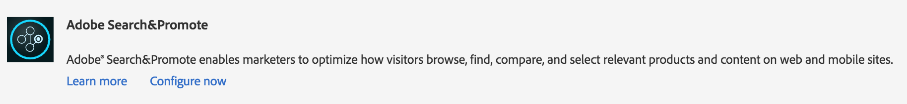

# Integrera med Adobe Search&amp;Promote{#integrating-with-adobe-search-promote}

Gör så här för att ringa tjänsten Adobe Search&amp;Promote från din webbplats:

1. Ange URL:en för molnet.
1. Konfigurera anslutningen till Search&amp;Promote-tjänsten.
1. Lägg till Search&amp;Promote-komponenter i Sidekick.
1. Använd komponenterna för att skapa innehållet. (Se [Lägga till sök&amp;befordra funktioner på en webbsida](/help/sites-authoring/search-and-promote.md).)
1. Lägg till banderoller på sidorna. Banderollbilder är känsliga för sök&amp;marknadsför data.
1. Generera en webbplatskarta så att Search&amp;Promote-tjänsten kan använda den.

>[!NOTE]
>
>Om du använder Search&amp;Promote med en anpassad proxykonfiguration måste du konfigurera båda HTTP-klientproxykonfigurationerna eftersom vissa funktioner i AEM använder 3.x-API:erna och andra 4.x-API:er:
>
>* 3.x är konfigurerat med [https://localhost:4502/system/console/configMgr/com.day.commons.httpclient](https://localhost:4502/system/console/configMgr/com.day.commons.httpclient)
>* 4.x är konfigurerat med [https://localhost:4502/system/console/configMgr/org.apache.http.proxyconfigurator](https://localhost:4502/system/console/configMgr/org.apache.http.proxyconfigurator)
>

## Ändra URL:en för Search&amp;Promote-tjänsten {#changing-the-search-promote-service-url}

Standardwebbadressen som är konfigurerad för tjänsten Search&amp;Promote är `https://searchandpromote.omniture.com/px/`. Om du vill använda en annan tjänst använder du OSGi-konsolen för att ange en annan URL.

1. Öppna OSGi-konsolen och klicka på fliken Konfiguration. ([https://localhost:4502/system/console/configMgr.](https://localhost:4502/system/console/configMgr))
1. Klicka på Dag CQ Search&amp;Promote Configuration.
1. Ange URL-adressen i rutan Fjärrserverns URI och klicka på Spara.

## Konfigurera anslutningen till Search&amp;Promote {#configuring-the-connection-to-search-promote}

Konfigurera en eller flera anslutningar till Search&amp;Promote så att dina webbsidor kan interagera med tjänsten. För att kunna ansluta behöver du medlemsidentifiering och kontonummer för ditt Search&amp;Promote-konto.

1. Välj **molntjänster** från verktygsikonen **>** Distribution ****.

   Detta tar dig till kontrollpanelen för molntjänster. Om du använder en lokal dator ser kontrollpanelens URL ut ungefär så här:

   [https://localhost:4502/libs/cq/core/content/tools/cloudservices.html](https://localhost:4502/libs/cq/core/content/tools/cloudservices.html)

1. Klicka på länken Adobe Search&amp;Promote eller ikonen Search&amp;Promote på sidan Cloud Services.

1. Om det är första gången du konfigurerar Adobe Search&amp;Promote klickar du på **Konfigurera nu** för att öppna panelen Skapa konfiguration.

   Om du vill veta mer om Search&amp;Promote klickar du på **Läs** mer i stället.

   

1. Ange en **titel** som sidförfattare kan känna igen, ange ett unikt **namn** och klicka sedan på **Skapa**.

   Fönstret **Redigera komponent** öppnas.

   Dessutom visas den nya konfigurationen under **Tillgängliga konfigurationer** på **Cloud Services-kontrollpanelen** Adobe Search&amp;Promote-listobjektet.

   

1. Lägg till följande i fälten i dialogrutan **Redigera komponent** .

   * **Medlems-ID**
   * **Kontonummer**
   >[!NOTE]
   >
   >För att få tillgång till den här informationen **själv,** måste du först logga in
   >
   >[https://searchandpromote.omniture.com/center/](https://searchandpromote.omniture.com/center/)
   >
   >
   >med dina giltiga Seach&amp;Promote-inloggningsuppgifter (e-post/lösenord).
   >Sedan måste du titta på din URL i din webbläsares adressfält som ska se ut ungefär så här:
   >
   >
   >[https://searchandpromote.omniture.com/px/home/?sp_id=XXXXXXXX-spYYYYYYYY](https://searchandpromote.omniture.com/px/home/?sp_id=XXXXXXXX-spYYYYYYYY)
   >
   >**Var:**
   >
   >    * **XXXXXXXX** motsvarar ditt* medlems-id**
   >    * **spYYYYYYY** motsvarar ditt **kontonummer**

1. Klicka på **Anslut till sök&amp;höj**.

   När meddelandet om att anslutningen lyckades visas klickar du på **OK**.

   (Efter anslutningen ändras knapptexten till** Återanslut till sökning och Befordra*.)

1. Click **OK**. Sidan Sök&amp;höj inställningar visas för den konfiguration som du just har skapat.

## Konfigurera datacentret {#configuring-the-data-center}

Om ditt Search&amp;Promote-konto finns i Asien eller Europa måste du ändra standarddatacentret så att det pekar till rätt datacenter (standarddatacentret är för nordamerikanska konton).

Så här konfigurerar du datacentret:

1. Navigera till webbkonsolen på `https://localhost:4502/system/console/configMgr/com.day.cq.searchpromote.impl.SearchPromoteServiceImpl`

   

1. Beroende på var servern finns ändrar du URI:n till något av följande:

   * Nordamerika: [https://center.atomz.com/px/](https://center.atomz.com/px/)
   * EMEA: [https://center.lon5.atomz.com/px/](https://center.lon5.atomz.com/px/)
   * APAC: [https://center.sin2.atomz.com/px/](https://center.sin2.atomz.com/px/)

1. Click **Save**.

## Lägga till Search&amp;Promote-komponenter i Sidekick {#adding-search-promote-components-to-sidekick}

I designläget kan du redigera en **del** -komponent så att komponenterna Search&amp;Promote kan användas i Sidekick. (Mer information finns i dokumentationen för [komponenter](/help/sites-developing/components.md#addinganewcomponenttotheparagraphsystemdesignmode) .)

Mer information om hur du använder komponenterna finns i [Lägga till sök- och höjdfunktioner på en webbsida](/help/sites-authoring/search-and-promote.md).)

## Ange den Search&amp;Promote-tjänst som dina sidor använder {#specifying-the-search-promote-service-that-your-pages-use}

Konfigurera webbsidor så att de använder en viss Search&amp;Promote-tjänst. Search&amp;Promote-komponenter använder automatiskt tjänsten på sin värdsida.

När du konfigurerar egenskaperna Sök&amp;Befordra för en sida ärver alla underordnade sidor inställningarna. Om det behövs kan du konfigurera underordnade sidor så att de åsidosätter de ärvda inställningarna.

>[!NOTE]
>
>Tjänstanslutningen måste redan vara konfigurerad. (Se [Konfigurera anslutningen till Search&amp;Promote](#connection).)

1. Öppna dialogrutan **Sidegenskaper** . På sidan** Webbplatser** högerklickar du på sidan och klickar på **Egenskaper**.
1. Klicka på fliken **Molntjänster** .
1. Om du vill inaktivera arvet av molntjänstkonfigurationer från en överordnad sida klickar du på hänglåsikonen bredvid arvsökvägen.

   

1. Klicka på **Lägg till tjänst**, välj **Adobe Search&amp;Promote** och klicka på **OK**.
1. Välj anslutningskonfiguration för ditt Search&amp;Promote-konto och klicka sedan på **OK**.

## Produktfeed {#product-feed}

Med Search&amp;Promote-integreringen kan du:

* använda eCommerce API, oberoende av den underliggande databasstrukturen och handelsplattformen.
* Använd funktionen Index Connector i Search&amp;Promote för att skapa en produktfeed i XML-format.
* utnyttja funktionen Fjärrstyrning i Search&amp;Promote för att utföra on-demand- eller schemalagda begäranden i produktflödet
* feed-generering för olika Search&amp;Promote-konton, konfigurerade som molntjänster.

Mer information finns i [Produktfeed](/help/sites-administering/product-feed.md).
