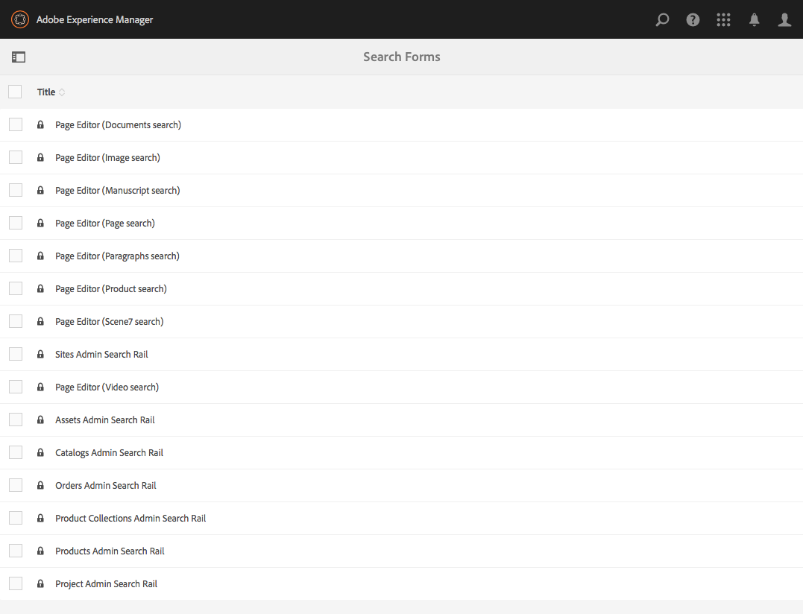
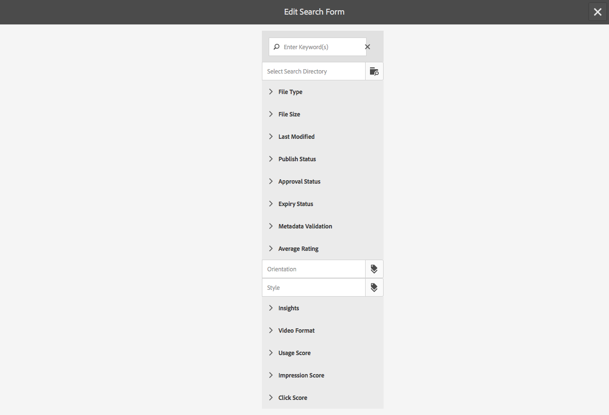
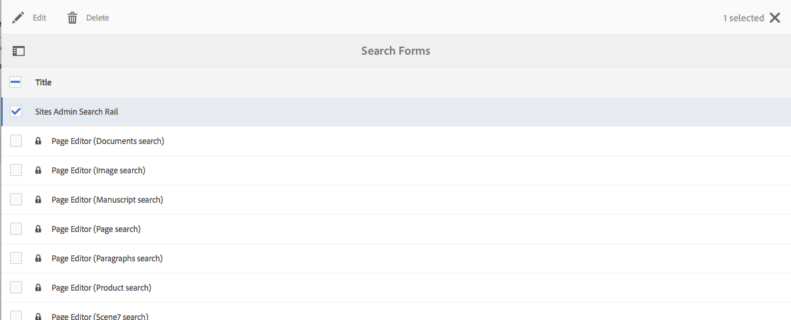

# Konfigurera Sök i Forms{#configuring-search-forms}

Använd **Sök i Forms** om du vill anpassa urvalet av sökprefix som används i de sökpaneler som finns i olika AEM konsoler och/eller paneler i författarmiljön. När du anpassar panelerna blir sökfunktionen mångsidig efter dina specifika behov.

Ett [intervall med predikat](#predicates-and-their-settings)s är tillgängligt direkt. Du kan lägga till flera predikat, bland annat egenskapspredikatet, för att söka efter resurser som matchar en enskild egenskap som du har angett. Alternativt kan du med Alternativ förutsäga att söka efter resurser som matchar ett eller flera värden som du anger för en viss egenskap.

Du kan [konfigurera sökformulären](#configuring-your-search-forms) som används i olika konsoler och i resursläsaren (när du redigerar sidor). [Dialogrutorna för konfiguration av dessa formulär](#configuring-your-search-forms) kan nås via:

* **Verktyg**

   * **Allmänt**

      * **Sök i Forms**

När du först öppnar den här konsolen ser du att alla konfigurationer har en hänglåssymbol. Det här anger att rätt konfiguration är standardkonfigurationen (färdig) och kan inte tas bort. När du har anpassat konfigurationen försvinner låset om du inte [tar bort din anpassade konfiguration](#deleting-a-configuration-to-reinstate-the-default). I så fall återställs standardinställningen (och hänglåsindikatorn).

## Konfigurationer {#configurations}

Standardkonfigurationerna är:

* **Sidredigeraren (dokumentsökning):**

  Den här konfigurationen definierar de alternativ som är tillgängliga vid sökning efter dokument i resursläsaren (när en sida redigeras).

* **Sidredigeraren (bildsökning):**

  Den här konfigurationen definierar de alternativ som är tillgängliga vid sökning efter bilder i resursläsaren (när en sida redigeras).

* **Sidredigeraren (manuell sökning):**

  Den här konfigurationen definierar de alternativ som är tillgängliga vid sökning efter manuskript i resursläsaren (när en sida redigeras).

* **Sidredigeraren (sidsökning):**

  Den här konfigurationen definierar de alternativ som är tillgängliga vid sökning efter sidor i resursläsaren (när en sida redigeras).

* **Sidredigeraren (sökning efter stycken):**

  Den här konfigurationen definierar de alternativ som är tillgängliga vid sökning efter stycken i resursläsaren (när en sida redigeras).

* **Sidredigeraren (produktsökning):**

  Den här konfigurationen definierar de alternativ som är tillgängliga vid sökning efter produkter i resursläsaren (när en sida redigeras).

* **Sidredigeraren (Dynamic Media Classic [tidigare Scene7]-sökning)**:

  Den här konfigurationen definierar de alternativ som är tillgängliga när du söker efter Scene7-resurser i resursläsaren (när du redigerar en sida).

* **Sökväg för webbplatsadministratörer**:

  Den här konfigurationen definierar de sökalternativ som är tillgängliga för användaren när sökfältet i webbplatskonsolen används.

* **Sidredigeraren (videosökning):**

  Den här konfigurationen definierar de alternativ som är tillgängliga när du söker efter videofilmer i resursläsaren (när du redigerar en sida).

* **Sökväg till Assets Admin Search:**

  Den här konfigurationen definierar de sökalternativ som är tillgängliga för användaren när Assets-konsolen används.

* **Katalogadministratörens sökväg:**

  Den här konfigurationen definierar de sökalternativ som är tillgängliga för användaren vid sökning i en e-handelskatalog.

* **Sökväg för administrationsadministratör:**

  Den här konfigurationen definierar de sökalternativ som är tillgängliga för användaren vid sökning i handelsorder.

* **Sökväg för administratör för produktsamlingar:**

  Den här konfigurationen definierar de sökalternativ som är tillgängliga för användaren vid sökning i produktsamlingar för e-handel.

* **Sökväg för produktadministratörer:**

  Den här konfigurationen definierar de sökalternativ som är tillgängliga för användaren vid sökning i e-handelsprodukter.

* **Sökväg för projektadministratör:**

  Den här konfigurationen definierar de sökalternativ som är tillgängliga för användaren vid sökning i projekt.

## Förutsägelser och deras inställningar {#predicates-and-their-settings}

### Predikat {#predicates}

Följande predikat är tillgängliga, beroende på konfigurationen:

<table>
 <tbody>
  <tr>
   <th>Förutse</th>
   <th>Syfte</th>
   <th>Inställningar</th>
  </tr>
  <tr>
   <td>Analyser </td>
   <td>Sök-/filterfunktioner i webbläsaren Sites när analysdata visas. Analyssökfilter läses in för att matcha mappade anpassade analyskolumner.</td>
   <td>
    <ul>
     <li>Fältetikett</li>
     <li>Beskrivning</li>
    </ul> </td>
  </tr>
  <tr>
   <td>Senast ändrad resurs </td>
   <td>Datum när resursen senast ändrades.  </td>
   <td>Ett anpassat predikat baserat på datumpredikatet.</td>
  </tr>
  <tr>
   <td>Komponenter </td>
   <td>Gör att en författare kan söka efter/filtrera sidor som har en viss komponent på sig. Ett bildgalleri, till exempel.  </td>
   <td>
    <ul>
     <li>Fältetikett</li>
     <li>Platshållare</li>
     <li>Egenskapsnamn*</li>
     <li>Egenskapsdjup</li>
     <li>Beskrivning</li>
    </ul> </td>
  </tr>
  <tr>
   <td>Datum </td>
   <td>Slider-baserad sökning av resurser baserat på en date-egenskap.</td>
   <td>
    <ul>
     <li>Fältetikett</li>
     <li>Egenskapsnamn*</li>
     <li>Beskrivning</li>
    </ul> </td>
  </tr>
  <tr>
   <td>Datumintervall </td>
   <td>Sök efter resurser som skapats inom ett angivet intervall efter en date-egenskap. På sökpanelen kan du ange start- och slutdatum.</td>
   <td>
    <ul>
     <li>Fältetikett</li>
     <li>Platshållare</li>
     <li>Egenskapsnamn*</li>
     <li>Intervalltext (från)*</li>
     <li>Intervall text (till)*</li>
     <li>Beskrivning</li>
    </ul> </td>
  </tr>
  <tr>
   <td>Förfallostatus </td>
   <td>Sök efter resurser baserat på förfallostatus.</td>
   <td>
    <ul>
     <li>Fältetikett</li>
     <li>Egenskapsnamn*</li>
     <li>Beskrivning</li>
    </ul> </td>
  </tr>
  <tr>
   <td>Filstorlek </td>
   <td>Sök efter resurser baserat på deras storlek.</td>
   <td>
    <ul>
     <li>Fältetikett</li>
     <li>Egenskapsnamn*</li>
     <li>Alternativbana</li>
     <li>Beskrivning</li>
    </ul> </td>
  </tr>
  <tr>
   <td>Dolt filter</td>
   <td>Ett filter för egenskap och värde som inte är synligt för användaren.</td>
   <td>
    <ul>
     <li>Egenskapsnamn</li>
     <li>Egenskapsvärde</li>
     <li>Beskrivning</li>
    </ul> </td>
  </tr>
  <tr>
   <td>Alternativ </td>
   <td>
Alternativen är innehållsnoder som skapas av användaren.
 
Mer information finns i <a href="#addinganoptionspredicate">Lägga till en alternativpredikat</a>.
 </td>
   <td>
    <ul>
     <li>Fältetikett</li>
     <li>JSON-sökväg</li>
     <li>Egenskapsnamn*</li>
     <li>Enkel markering</li>
     <li>Alternativbana</li>
     <li>Beskrivning</li>
    </ul> </td>
  </tr>
  <tr>
   <td>Alternativ, egenskap </td>
   <td>Sök efter en egenskap för alternativet.</td>
   <td>
    <ul>
     <li>Fältetikett</li>
     <li>Egenskapsnamn*</li>
     <li>Alternativ för nodsökväg   </li>
     <li>Enkel markering</li>
     <li>Beskrivning</li>
    </ul> </td>
  </tr>
  <tr>
   <td>Sidstatus </td>
   <td>Sök efter sidor utifrån deras status.</td>
   <td>
    <ul>
     <li>Fältetikett</li>
     <li>Publish-egenskapsnamn</li>
     <li>LiveCopy-egenskapsnamn</li>
     <li>Beskrivning</li>
    </ul> </td>
  </tr>
  <tr>
   <td>Bana </td>
   <td>Sök efter resurser som finns under en viss sökväg.</td>
   <td>
    <ul>
     <li>Fältetikett</li>
     <li>Lägg till söksökväg</li>
     <li>Beskrivning</li>
    </ul> </td>
  </tr>
  <tr>
   <td>Egenskap </td>
   <td>Sök på en angiven egenskap.</td>
   <td>ingen</td>
  </tr>
  <tr>
   <td>Publish-status </td>
   <td>Söka efter resurser baserat på deras publiceringsstatus</td>
   <td>
    <ul>
     <li>Fältetikett</li>
     <li>Egenskapsnamn*</li>
     <li>Beskrivning</li>
    </ul> </td>
  </tr>
  <tr>
   <td>Intervall </td>
   <td>Sök efter resurser som ligger inom ett angivet intervall. På sökpanelen kan du ange lägsta och högsta värden för intervallet.</td>
   <td>
    <ul>
     <li>Fältetikett</li>
     <li>Egenskapsnamn</li>
     <li>Beskrivning</li>
    </ul> </td>
  </tr>
  <tr>
   <td>Intervallalternativ </td>
   <td>Ett specifikt sökpredikat för Assets och samma som för vanliga Slider Predicate. Är fortfarande tillgängligt på grund av bakåtkompatibilitetsproblem.</td>
   <td>
    <ul>
     <li>Fältetikett</li>
     <li>Egenskapsnamn*</li>
     <li>Alternativbana</li>
     <li>Beskrivning</li>
    </ul> </td>
  </tr>
  <tr>
   <td>Klassificering </td>
   <td>Sök efter resurser efter deras klassificering.  </td>
   <td>
    <ul>
     <li>Fältetikett</li>
     <li>Egenskapsnamn*</li>
     <li>Alternativbana</li>
     <li>Beskrivning</li>
    </ul> </td>
  </tr>
  <tr>
   <td>Relativt datum </td>
   <td>Sök efter resurser baserat på det relativa datumet då de skapades  </td>
   <td>
    <ul>
     <li>Fältetikett</li>
     <li>Egenskapsnamn*</li>
     <li>Relativt datum</li>
     <li>Beskrivning</li>
    </ul> </td>
  </tr>
  <tr>
   <td>Skjutreglageintervall </td>
   <td>Ett vanligt sökpredikat som utökar intervallpredikatet med skjutreglaget. Värdet för den egenskap som söks igenom måste vara mellan skjutreglagets gränser.</td>
   <td>
    <ul>
     <li>Fältetikett</li>
     <li>Egenskapsnamn*</li>
     <li>Beskrivning</li>
    </ul> </td>
  </tr>
  <tr>
   <td>Tagg </td>
   <td>Sök efter resurser baserat på taggar. Du kan konfigurera egenskapen Path så att den fyller i olika taggar i listan Taggar.</td>
   <td>
    <ul>
     <li>Fältetikett</li>
     <li>Egenskapsnamn*</li>
     <li>Alternativbana</li>
     <li>Beskrivning</li>
    </ul> </td>
  </tr>
  <tr>
   <td>Taggar </td>
   <td>Sök baserat på taggar.</td>
   <td>
    <ul>
     <li>Platshållare</li>
     <li>Egenskapsnamn*</li>
     <li>Beskrivning</li>
    </ul> </td>
  </tr>
 </tbody>
</table>

>[!NOTE]
>
>* De vanliga sökpredikten definieras i:
>  `/libs/cq/gui/components/common/admin/customsearch/searchpredicates`
>
>* Sökpredikat som bara är relaterade till siteadmin (klassiskt användargränssnitt) finns under:
>  `/libs/cq/gui/components/siteadmin/admin/searchpanel/searchpredicates`
>   * Dessa är inaktuella och endast tillgängliga för bakåtkompatibilitet.
>
>Informationen är endast avsedd som referens. Ändra inte `/libs`.

### Predikatinställningar {#predicate-settings}

Beroende på predikatet finns ett urval av inställningar tillgängliga för konfiguration:

* **Fältetikett**

  Den etikett som visas som ett komprimeringsbart huvud eller som fältetikett för predikatet.

* **Beskrivning**

  Beskrivande information för användaren.

* **Platshållare**

  Tom text eller platshållaren för predikatet om ingen filtreringstext anges.

* **Egenskapsnamn**

  Egenskapen som ska genomsökas. Den använder en relativ sökväg och jokertecknen `*/*/*` anger djupet för egenskapen i förhållande till noden `jcr:content` (varje asterisk representerar en nodnivå).

  Om du bara vill söka på en underordnad nod på första nivån för resursen som har egenskapen `x` på noden `jcr:content` använder du `*/jcr:content/x`

* **Egenskapsdjup**

  Det maximala djup som ska sökas efter den egenskapen i resurserna. En sökning på den egenskapen kan därför utföras på en resurs och rekursiva underordnade tills nivån på de underordnade är lika med det angivna djupet.

* **Egenskapsvärde**

  Egenskapsvärdet som en absolut sträng eller som ett uttrycksspråk, till exempel `cq:Page` eller

  `${empty requestPathInfo.suffix ? "/content" : requestPathInfo.suffix}`.

* **Intervalltext**

  Etiketten för intervallfältet i predikatet **Datumintervall** .

* **Alternativsökväg**

  Användaren kan markera sökvägen med hjälp av Bandläsaren på fliken för predikatinställningar. När du har markerat **+** används ikonen för att lägga till markeringen i listan med giltiga alternativ (och sedan ikonen **-** som ska tas bort om det behövs).

  Alternativen är innehållsnoder som skapas av användaren och som har följande struktur:

  `(jcr:primaryType = nt:unstructured, value (String), jcr:title (String))`

* **Nodsökväg för alternativ**
I själva verket är det samma som **Alternativsökväg** , men bara det här är i det vanliga predikatfältet, det andra är specifikt för resurser.

* **En markering**
Om det här alternativet är markerat återges alternativen som kryssrutor som bara tillåter ett urval. Om du av misstag markerar kryssrutan kan den avmarkeras.

* **Egenskapsnamn för Publish och Live Copy**
Etiketterna för publicerings- och Live copy-kryssrutorna för platsspecifika predikat.

* &amp;ast; på fältetiketterna på fliken **Settings** betyder det att fälten är obligatoriska och om de lämnas tomma visas ett felmeddelande.

## Konfigurera din sökning i Forms {#configuring-your-search-forms}

### Skapa/öppna en anpassad konfiguration {#creating-opening-a-customized-configuration}

1. Navigera till **Verktyg** >> **Allmänt** >> **Sök i Forms**.

1. Välj den konfiguration som du vill anpassa.
1. Använd ikonen **Redigera** för att öppna konfigurationen för uppdatering.
1. Om en ny anpassning används, vill du förmodligen [lägga till nya predikatfält och definiera inställningarna](#add-edit-a-predicate-field-and-define-field-settings) efter behov. Om det finns en befintlig anpassning kan du välja ett befintligt fält och [uppdatera inställningarna](#add-edit-a-predicate-field-and-define-field-settings).
1. Välj **Klar** om du vill spara konfigurationen.

   >[!NOTE]
   >
   >De anpassade konfigurationerna lagras (om det är lämpligt) under:
   >
   >* `/apps/cq/gui/content/facets/<option>`
   >* `/apps/commerce/gui/content/facets/<option>`

### Lägg till/redigera ett prediktionsfält och definiera fältinställningar {#add-edit-a-predicate-field-and-define-field-settings}

Du kan lägga till eller redigera fält och definiera/uppdatera deras inställningar:

1. [Öppna den anpassade konfigurationen](#creating-opening-a-customized-configuration) för uppdatering.
1. Om du vill lägga till ett fält öppnar du fliken **Välj predikat** och drar predikatet till önskad plats. Exempel: **Förutsägelse för datumintervall**:

   

1. Beroende på om:

   * Du lägger till ett fält:

     När du har lagt till predikatet öppnas fliken **Inställningar** och egenskaperna som kan definieras visas.

   * Du vill uppdatera ett befintligt predikat:

     Markera predikatfältet (till höger) och öppna sedan fliken **Inställningar**.

   Till exempel inställningarna för **Förutsägelse av datumintervall**:

   

1. Gör önskade ändringar och bekräfta med **Klar**.

### Förhandsgranska sökkonfigurationen {#previewing-the-search-configuration}

1. Välj ikonen Förhandsgranska:

   

1. Då visas sökformulären så som de visas (helt expanderade) i kolumnen Sök i lämplig konsol.

   

1. **Stäng** förhandsgranskningen så att du kan returnera och slutföra konfigurationen.

### Ta bort ett predikatfält {#deleting-a-predicate-field}

1. [Öppna den anpassade konfigurationen](#creating-opening-a-customized-configuration) för uppdatering.
1. Markera predikatfältet (till höger), öppna fliken **Inställningar** och välj sedan ikonen **Ta bort** (längst ned till vänster).

   

1. En dialogruta begär en bekräftelse av borttagningsåtgärden.

1. Bekräfta detta och andra ändringar med **Klar**.

### Ta bort en konfiguration (för att återställa standardkonfigurationen) {#deleting-a-configuration-to-reinstate-the-default}

När du har anpassat en konfiguration åsidosätter detta standardinställningarna. Du kan återställa standardkonfigurationen genom att ta bort den anpassade konfigurationen.

>[!NOTE]
>
>Du kan inte ta bort någon av standardkonfigurationerna.

En anpassad konfiguration tas bort från konsolen:

1. Välj önskad konfiguration (till exempel **Sidredigeraren (sökning efter stycken)**) och sedan ikonen **Ta bort** i verktygsfältet:

   

1. Den anpassade konfigurationen tas bort och standardinställningen återställs (detta indikeras av att hänglåssymbolen visas igen i konsolen).

### Förutsägelser för tillägg av alternativ {#adding-options-predicates}

Alternativpredikat (Alternativ, Alternativ-egenskap) gör att du kan konfigurera ett objekt som du vill söka efter. De används för att söka efter något direkt under sidan, till exempel en egenskap på sidnoden.

I följande exempel (som används för att söka efter mallen som används för att skapa en sida) visas stegen som ingår:

1. Skapa noden som definierar den egenskap som du vill söka efter.

   Du behöver en rotnod som innehåller definitioner av de enskilda alternativen för att vara tillgängliga för användaren.

   Noderna för de enskilda alternativen behöver egenskaperna:

   * `jcr:title` - fältetiketten som ska visas i sökfältet
   * `value` - egenskapsvärdet som ska genomsökas

   

   >[!NOTE]
   >
   >Ändra ***inte*** något i sökvägen `/libs`.
   >
   >Detta beror på att innehållet i `/libs` skrivs över nästa gång du uppgraderar din instans (och kan mycket väl skrivas över när du använder en snabbkorrigering eller ett funktionspaket).
   >
   >Den rekommenderade metoden för konfiguration och andra ändringar är:
   >
   >1. Återskapa det obligatoriska objektet, som det finns i `/libs`, under `/apps`. I det här fallet från:
   >1. `/libs/cq/gui/content/common/options/predicates`
   >1. Gör ändringar i `/apps.`

1. Öppna **sökkonsolen för Forms** och välj den konfiguration som du vill uppdatera. Till exempel **Sökväg för webbplatsadministratörer**.

   Klicka sedan på ikonen **Redigera sökformulär** .

1. Beroende på konfigurationen lägger du till en **Alternativ** eller **Alternativ** i konfigurationen.
1. Uppdatera fälten, särskilt:

   * **Egenskapsnamn**

     Specificera den nodegenskap som du vill söka efter på målnoderna. Till exempel:

     `jcr:content/cq:template`

   * **Alternativnodssökväg**

     Välj den sökväg där du vill ha dina alternativ. Till exempel:

     `/apps/cq/gui/content/common/options/predicates/templatetype`

   

1. Välj **Klar** om du vill spara konfigurationen.
1. Navigera till rätt konsol (i det här exemplet **Platser**) och öppna **sökfältet**. De nya sökformulären, tillsammans med de olika alternativen, visas. Välj önskat alternativ så att du kan se sökresultaten:

   

## Användarbehörigheter {#user-permissions}

I följande tabell visas de behörigheter som krävs för att utföra redigerings-, borttagnings- och förhandsgranskningsåtgärder i sökformulär.

<table>
 <tbody>
  <tr>
   <td><strong>Åtgärd</strong></td>
   <td><strong>Behörigheter</strong></td>
  </tr>
  <tr>
   <td>Redigera </td>
   <td>Läs- och skrivbehörigheter på noden <code>/apps </code>.</td>
  </tr>
  <tr>
   <td>Ta bort</td>
   <td>Läsa, skriva, ta bort behörigheter på noden <code>/apps</code></td>
  </tr>
  <tr>
   <td>Förhandsgranska</td>
   <td>Läsa, skriva, ta bort behörigheter på noden <code>/var/dam/content</code>.  Läs- och skrivbehörigheter på noden <code>/apps</code>.</td>
  </tr>
 </tbody>
</table>
