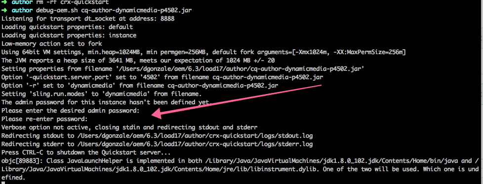

# Konfigurera administratörslösenordet vid installationen{#configure-the-admin-password-on-installation}

## Översikt {#overview}

Från och med version 6.3 tillåter Adobe Experience Manager (AEM) att administratörslösenordet ställs in med kommandoraden när en ny instans installeras.

I tidigare versioner av AEM behövde lösenordet för administratörskontot samt lösenordet för olika andra konsoler ändras efter installationen.

Den här funktionen lägger till möjligheten att ange ett nytt administratörslösenord för databasen och servermotorn under installationen av en AEM, vilket eliminerar behovet av att göra det manuellt efteråt.

>[!CAUTION]
>
>Funktionen täcker inte Felix Console, för vilken lösenordet måste ändras manuellt. Mer information finns i relevanta [Avsnittet Säkerhetschecklista](/help/sites-administering/security-checklist.md#change-default-passwords-for-the-aem-and-osgi-console-admin-accounts).

## Hur använder jag den? {#how-do-i-use-it}

Den här funktionen aktiveras automatiskt om du väljer att installera AEM via kommandoraden, i stället för att dubbelklicka på JAR från en filsystemutforskare.

Den allmänna syntaxen för att köra en AEM från kommandoraden är:

```shell
java -jar aem6.3.jar
```

När du har kört instansen från kommandoraden får du alternativet att ändra administratörslösenordet under installationsprocessen:



>[!NOTE]
>
>Uppmaningen att ändra administratörslösenordet visas bara under installationen av en ny AEM.

## Använda flaggan -nointeractive {#using-the-nointeractive-flag}

Du kan också välja att ange lösenordet från en egenskapsfil. Detta görs genom att använda `-nointeractive` flagga kombinerat med `-Dadmin.password.file` system, egenskap.

Nedan visas ett exempel:

```shell
java -Dadmin.password.file =/path/to/passwordfile.properties -jar aem6.3.jar -nointeractive
```

Lösenordet i `passwordfile.properties` filen måste ha följande format:

```xml
admin.password = 12345678
```

>[!NOTE]
>
>Om du bara använder `-nointeractive` parametern utan `-Dadmin.password.file` system property, AEM använder administratörslösenordet som standard utan att be dig ändra det, vilket i stort sett replikerar beteendet från tidigare versioner. Det här icke-interaktiva läget kan användas för automatiska installationer med kommandoraden i ett installationsskript.
