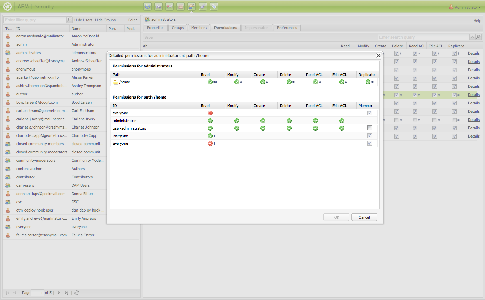
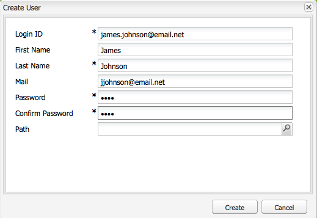
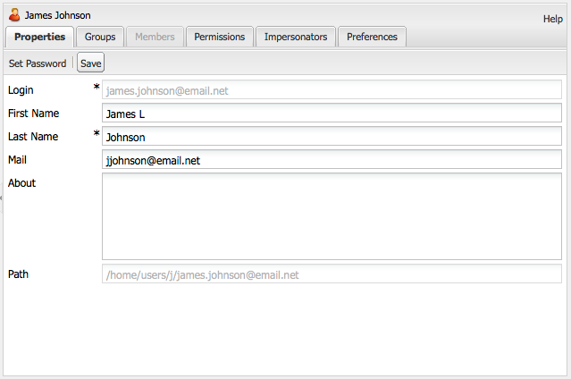
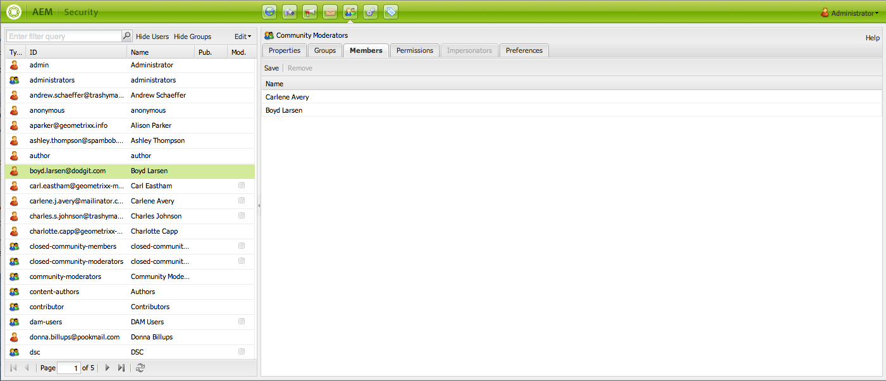
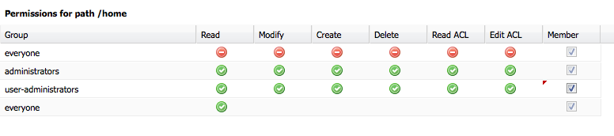
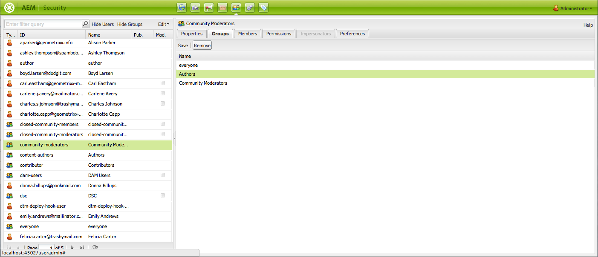

# Användaradministration och -säkerhet{#user-administration-and-security}

I det här kapitlet beskrivs hur du konfigurerar och upprätthåller användarauktorisering och även teorin bakom hur autentisering och auktorisering fungerar i AEM.

## Användare och grupper i AEM {#users-and-groups-in-aem}

I det här avsnittet behandlas de olika enheterna och relaterade begreppen mer ingående, så att du kan konfigurera ett enkelt sätt att underhålla användarhanteringskoncept.

### Användare {#users}

Användare loggar in på AEM med sitt konto. Varje användarkonto är unikt och innehåller grundläggande kontoinformation tillsammans med de behörigheter som tilldelats.

Användare är ofta medlemmar i grupper, vilket förenklar tilldelningen av dessa behörigheter och/eller behörigheter.

### Grupper {#groups}

Grupper är samlingar med användare, andra grupper eller båda. Alla dessa samlingar kallas medlemmar i en grupp.

Deras främsta syfte är att förenkla underhållsprocessen genom att minska antalet enheter som ska uppdateras, eftersom en ändring görs i en grupp tillämpas på alla medlemmar i gruppen. Grupper återspeglar ofta:

* en roll i programmet, t.ex. någon som har rätt att surfa innehållet eller någon som har rätt att bidra med innehåll.
* din egen organisation. Du kanske vill utöka rollerna för att skilja på medverkande från olika avdelningar när de är begränsade till olika grenar i innehållsträdet.

Därför tenderar grupperna att förbli stabila, medan användarna kommer och går oftare.

Med planering och en ren struktur kan användningen av grupper återspegla din struktur, vilket ger dig en tydlig översikt och en effektiv mekanism för uppdateringar.

### Inbyggda användare och grupper {#built-in-users-and-groups}

AEM WCM installerar flera användare och grupper. Dessa samlingar visas när du först öppnar säkerhetskonsolen efter installationen.

I följande tabeller visas varje objekt tillsammans med:

* en kort beskrivning
* rekommendationer om nödvändiga ändringar

*Ändra alla standardlösenord* (om du inte tar bort själva kontot under vissa omständigheter).

<table>
 <tbody>
  <tr>
   <td>Användar-ID</td>
   <td>Typ</td>
   <td>Beskrivning</td>
   <td>Rekommendation</td>
  </tr>
  <tr>
   <td>
admin
 
Standardlösenord: admin
 </td>
   <td>Användare</td>
   <td>
Systemadministratörskonto med fullständig behörighet.
 
Det här kontot används för anslutningen mellan AEM WCM och CRX.
 
Om du råkar ta bort det här kontot återskapas det när databasen startas om (i standardinställningen).
 
Administratörskontot är ett krav för den AEM plattformen. Detta konto kan därför inte tas bort.
 </td>
   <td>
Adobe rekommenderar att du ändrar standardlösenordet för det här användarkontot.
 
Bäst vid installation, men det kan göras efteråt.
 
Obs! Blanda inte ihop det här kontot med administratörskontot för CQ-servermotorn.
 </td>
  </tr>
  <tr>
   <td>
anonym
 
 
 </td>
   <td>Användare</td>
   <td>
Innehåller standardrättigheterna för oautentiserad åtkomst till en instans. Som standard innehåller det här kontot de lägsta åtkomsträttigheterna.
 
Om du råkar ta bort det här kontot återskapas det vid start. Den kan inte tas bort permanent, men den kan inaktiveras.
 </td>
   <td>Undvik att ta bort eller inaktivera det här kontot eftersom det påverkar funktionen för författarinstanser negativt. Om det finns säkerhetskrav som ger dig rätt att ta bort den måste du först testa de effekter den har på dina system.</td>
  </tr>
  <tr>
   <td>
författare
 
Standardlösenord: författare
 </td>
   <td>Användare</td>
   <td>
Ett författarkonto kan skriva till /content. Innefattar behörighet som deltagare och övertagare.
 
Kan användas som webbmaster eftersom den har åtkomst till hela /content-trädet.
 
Det här kontot är inte en inbyggd användare, utan en annan Geometrixx-demoanvändare
 </td>
   <td>
Adobe rekommenderar att kontot antingen tas bort helt eller att standardlösenordet ändras.
 
Bäst vid installation, men det kan göras efteråt.
 </td>
  </tr>
  <tr>
   <td>administratörer</td>
   <td>Grupp</td>
   <td>
Grupp som ger administratörsbehörighet till alla dess medlemmar. Det är bara administratörer som kan redigera den här gruppen.
 
Har fullständig behörighet.
 </td>
   <td>Även om du anger"Neka alla" på en nod kan administratörerna fortfarande komma åt noden</td>
  </tr>
  <tr>
   <td>innehållsförfattare</td>
   <td>Grupp</td>
   <td>
Grupp ansvarig för innehållsredigering. Kräver behörighet att läsa, ändra, skapa och ta bort.
 </td>
   <td>Du kan skapa egna grupper med innehållsförfattare med projektspecifika åtkomsträttigheter, förutsatt att du lägger till, ändrar, skapar och tar bort behörigheter.</td>
  </tr>
  <tr>
   <td>medverkande</td>
   <td>Grupp</td>
   <td>
Grundläggande behörighet som tillåter användaren att skriva innehåll (som i, endast de behörigheter som krävs för grundfunktionerna).
 
Tilldelar inga behörigheter för åtkomst till själva /content-trädet. Dessa måste tilldelas specifikt för de enskilda grupperna eller användarna.
 </td>
   <td> </td>
  </tr>
  <tr>
   <td>dam-users</td>
   <td>Grupp</td>
   <td>Körklar referensgrupp för vanliga AEM Assets-användare. Medlemmar i den här gruppen har lämplig behörighet för att aktivera överföring/delning av resurser och samlingar.</td>
   <td> </td>
  </tr>
  <tr>
   <td>alla</td>
   <td>Grupp</td>
   <td>
Alla användare i AEM är medlemmar i gruppen, men du kanske inte ser gruppen eller medlemskapsrelationen i alla verktyg.
 
Den här gruppen kan betraktas som standardrättigheter eftersom den kan användas för att tillämpa behörigheter för alla, även användare som kommer att skapas i framtiden.
 </td>
   <td>
Ändra eller ta inte bort den här gruppen.
 
Om du ändrar det här kontot får det ytterligare säkerhetskonsekvenser.
 </td>
  </tr>
  <tr>
   <td>tagg-administratörer</td>
   <td>Grupp</td>
   <td>Grupp som kan redigera taggar.</td>
   <td> </td>
  </tr>
  <tr>
   <td>användaradministratörer</td>
   <td>Grupp</td>
   <td>Auktoriserar användaradministration, det vill säga rätten att skapa användare och grupper.</td>
   <td> </td>
  </tr>
  <tr>
   <td>arbetsflödesredigerare</td>
   <td>Grupp</td>
   <td>Grupp som kan skapa och ändra arbetsflödesmodeller.</td>
   <td> </td>
  </tr>
  <tr>
   <td>arbetsflöde-användare</td>
   <td>Grupp</td>
   <td>
En användare som deltar i ett arbetsflöde måste vara medlem i ett grupparbetsflöde-användare. Ger användaren fullständig åtkomst till: /etc/workflow/instances så att han/hon kan uppdatera arbetsflödesinstansen.
 
Gruppen ingår i standardinstallationen, men du måste lägga till dina användare manuellt i gruppen.
 </td>
  </tr>
 </tbody>
</table>

## Behörigheter i AEM {#permissions-in-aem}

AEM använder åtkomstkontrollistor för att avgöra vilka åtgärder en användare eller grupp kan vidta och var den kan utföra dessa åtgärder.

### Behörigheter och åtkomstkontrollistor {#permissions-and-acls}

Behörigheter definierar vem som kan utföra vilka åtgärder på en resurs. Behörigheterna är resultatet av [åtkomstkontrollsutvärderingar](#access-control-lists-and-how-they-are-evaluated).

Du kan ändra behörigheter som beviljats/nekats till en viss användare genom att markera eller avmarkera kryssrutorna för de enskilda AEM [åtgärderna](security.md#actions). En bock anger att en åtgärd är tillåten. Ingen bock indikerar att en åtgärd nekas.

Där bockmarkeringen är i rutnätet visas även vilka behörigheter användarna har på vilka platser i AEM (d.v.s. vilka sökvägar).

### Åtgärder {#actions}

Åtgärder kan utföras på en sida (resurs). För varje sida i hierarkin kan du ange vilken åtgärd användaren får utföra på sidan. [Behörigheter](#permissions-and-acls) gör att du kan tillåta eller neka en åtgärd.

<table>
 <tbody>
  <tr>
   <td><strong>Åtgärd </strong></td>
   <td><strong>Beskrivning </strong></td>
  </tr>
  <tr>
   <td>Läs</td>
   <td>Användaren kan läsa sidan och eventuella underordnade sidor.</td>
  </tr>
  <tr>
   <td>Ändra</td>
   <td>
Användaren kan:

    <ul>
     <li>ändra befintligt innehåll på sidan och på eventuella underordnade sidor.</li>
     <li>skapa stycken på sidan eller på en underordnad sida.</li>
    </ul> 
På JCR-nivå kan användare redigera en resurs genom att redigera dess egenskaper, låsa, versionshantering, inga ändringar och de har fullständig skrivbehörighet på noder som definierar en jcr:content child-nod. Exempel: cq:Page, nt:file, cq:Asset.
 </td>
  </tr>
  <tr>
   <td>Skapa</td>
   <td>
Användaren kan:

    <ul>
     <li>skapa en sida eller underordnad sida.</li>
    </ul> 
Om <strong>modify</strong> nekas, utesluts underträden under jcr:content eftersom skapandet av jcr:content och dess underordnade noder betraktas som en sidändring. Den här regeln gäller endast noder som definierar en jcr:content child-nod.
 </td>
  </tr>
  <tr>
   <td>Ta bort</td>
   <td>
Användaren kan:

    <ul>
     <li>ta bort befintliga stycken från sidan eller en underordnad sida.</li>
     <li>ta bort en sida eller underordnad sida.</li>
    </ul> 
Om <strong>modify</strong> nekas exkluderas alla underträd under jcr:content eftersom jcr:content tas bort och dess underordnade noder betraktas som en sidändring. Den här regeln gäller endast noder som definierar en jcr:content child-nod.
 </td>
  </tr>
  <tr>
   <td>Läs ACL</td>
   <td>Användaren kan läsa åtkomstkontrollistan för sidan eller de underordnade sidorna.</td>
  </tr>
  <tr>
   <td>Redigera ACL</td>
   <td>Användaren kan ändra åtkomstkontrollistan för sidan eller underordnade sidor.</td>
  </tr>
  <tr>
   <td>Replikera</td>
   <td>Användaren kan replikera innehåll till en annan miljö (till exempel Publish-miljön). Behörigheten gäller även för underordnade sidor.</td>
  </tr>
 </tbody>
</table>

>[!NOTE]
>
>AEM genererar automatiskt användargrupper för rolltilldelning (ägare, redigerare, visningsprogram) i [samlingar](/help/assets/manage-collections.md). Om du lägger till åtkomstkontrollistor manuellt för sådana grupper kan det dock medföra säkerhetsluckor i AEM. Adobe rekommenderar att du undviker att lägga till åtkomstkontrollistor manuellt.

### Åtkomstkontrollistor och hur de utvärderas {#access-control-lists-and-how-they-are-evaluated}

AEM WCM använder ACL-listor (Access Control Lists) för att organisera de behörigheter som tillämpas på de olika sidorna.

Åtkomstkontrollistor består av de enskilda behörigheterna och används för att avgöra i vilken ordning dessa behörigheter tillämpas. Listan är uppbyggd enligt hierarkin för de aktuella sidorna. Listan skannas sedan nedifrån och upp tills den första behörigheten som krävs för att tillämpa på en sida hittas.

>[!NOTE]
>
>Det finns åtkomstkontrollistor som ingår i exemplen. Vi rekommenderar att du granskar och fastställer vad som är lämpligt för dina program. Om du vill granska de åtkomstkontrollistor som ingår går du till **CRXDE** och väljer fliken **Åtkomstkontroll** för följande noder:
>
>* `/etc/cloudservices`
>* `/home/users/we-retail`
>
>Ditt anpassade program kan ange åtkomst för andra relationer, till exempel:
>
>* `*/social/relationships/friend/*`
>* eller `*/social/relationships/pending-following/*`.
>
>När du skapar åtkomstkontrollistor som är specifika för communities, kan medlemmar som ansluter till de communityn beviljas ytterligare behörigheter. När användare ansluter till communities på: `/content/we-retail/us/en/community`

### Behörighetsstater {#permission-states}

>[!NOTE]
>
>För CQ 5.3-användare:
>
>Till skillnad från tidigare CQ-versioner bör **create** och **delete** inte längre beviljas om en användare bara får ändra sidor. I stället ska du bara bevilja åtgärden **Ändra** om du vill att användarna ska kunna skapa, ändra eller ta bort komponenter på befintliga sidor.
>
>Av bakåtkompatibilitetsskäl tas inte den speciella behandlingen av noder som definierar **jcr:content** med i funktionsmakrotesten.

| **Åtgärd** | **Beskrivning** |
|---|---|
| Tillåt (bock) | AEM WCM gör att användaren kan utföra åtgärden på den här sidan eller på underordnade sidor. |
| Neka (ingen bock) | AEM WCM tillåter inte att användaren utför åtgärden på den här sidan eller på några underordnade sidor. |

Behörigheterna tillämpas även på underordnade sidor.

Om en behörighet inte ärvs från den överordnade noden men har minst en lokal post läggs följande symboler till i kryssrutan. En lokal post skapas i CRX 2.2-gränssnittet (jokertecken-ACL:er kan för närvarande bara skapas i CRX.)

För en åtgärd vid en angiven sökväg:

<table>
 <tbody>
  <tr>
   <td>* (asterisk)</td>
   <td>Det finns minst en lokal post (antingen effektiv eller ineffektiv). Dessa jokertecken-ACL:er definieras i CRX.</td>
  </tr>
  <tr>
   <td>! (utropstecken)</td>
   <td>Det finns minst en post som inte har någon effekt.</td>
  </tr>
 </tbody>
</table>

När du hovrar över asterisken eller utropstecknet visas ett verktygstips med mer information om de deklarerade posterna. Verktygstipset är uppdelat i två delar:

<table>
 <tbody>
  <tr>
   <td>Övre delen</td>
   <td>
Listar de gällande posterna.
 </td>
  </tr>
  <tr>
   <td>Lägre del</td>
   <td>Listar de icke-effektiva poster som kan påverka någon annanstans i trädet (vilket anges av ett specialattribut som finns med motsvarande ACE som begränsar postens omfång). Det kan också vara en post vars effekt återkallas av en annan post som definieras vid den angivna sökvägen eller vid en överordnad nod.</td>
  </tr>
 </tbody>
</table>

>[!NOTE]
>
>Om inga behörigheter har definierats för en sida, nekas alla åtgärder.

Nedan följer några rekommendationer om hur du hanterar åtkomstkontrollistor:

* Tilldela inte behörigheter direkt till användare. Tilldela dem endast till grupper.

  Det förenklar underhållet eftersom antalet grupper är mycket mindre än antalet användare och också mindre flyktigt.

* Om du vill att en grupp/användare bara ska kunna ändra sidor, ska du inte ge dem behörighet att skapa eller neka. Ge dem endast behörighet att ändra och läsa.
* Använd Neka sparsamt. Använd bara Tillåt i största möjliga utsträckning.

  Om du använder Neka kan det orsaka oväntade effekter om behörigheterna tillämpas i en annan ordning än den förväntade. Om en användare är medlem i mer än en grupp kan programsatserna Neka från en grupp avbryta programsatsen Tillåt från en annan grupp eller tvärtom. Det är svårt att behålla en översikt när något sådant händer och det kan enkelt leda till oförutsedda resultat, medan Tillåt tilldelningar inte orsakar sådana konflikter.

  Adobe rekommenderar att du arbetar med Tillåt i stället för Neka. Se [Bästa praxis](#best-practices).

Innan du ändrar någon av behörigheterna måste du se till att du förstår hur de fungerar och fungerar tillsammans. Se CRX-dokumentationen som illustrerar hur AEM WCM [utvärderar åtkomsträttigheter](/help/sites-administering/user-group-ac-admin.md#how-access-rights-are-evaluated) och exempel på hur du konfigurerar åtkomstkontrollistor.

### Behörigheter {#permissions}

Behörigheter ger användare och grupper åtkomst till AEM på AEM sidor.

Du bläddrar bland behörigheter genom att utöka/komprimera noderna och du kan spåra behörighetsarvet upp till rotnoden.

Du tillåter eller nekar behörigheter genom att markera eller avmarkera lämpliga kryssrutor.

### Visa detaljerad behörighetsinformation {#viewing-detailed-permission-information}

Tillsammans med stödrastervyn AEM en detaljerad vy över behörigheter för en markerad användare/grupp på en viss sökväg. Detaljvyn innehåller ytterligare information.

Förutom att visa information kan du även inkludera eller exkludera den aktuella användaren eller gruppen från en grupp. Se [Lägga till användare eller grupper medan behörigheter läggs till](#adding-users-or-groups-while-adding-permissions). Ändringarna som görs här visas omedelbart i den övre delen av den detaljerade vyn.

Du öppnar detaljvyn genom att klicka på **Information** på fliken **Behörigheter** för en markerad grupp/användare och sökväg.

Detaljerna delas upp i två delar:

<table>
 <tbody>
  <tr>
   <td>Övre delen</td>
   <td>
Upprepar informationen som visas i trädstödrastret. För varje åtgärd visas med en ikon om åtgärden är tillåten eller inte:

    <ul>
     <li>ingen ikon = ingen deklarerad post</li>
     <li>(tick) = deklarerad åtgärd (allow)</li>
     <li>(-) = deklarerad åtgärd (neka)</li>
    </ul> </td>
  </tr>
  <tr>
   <td>Lägre del</td>
   <td>
Visar rutnätet med användare och grupper som gör följande:

    <ul>
     <li>Deklarerar en post för angiven sökväg OCH</li>
     <li>Är den angivna auktoriseringsfunktionen ELLER en grupp?</li>
    </ul> </td>
  </tr>
 </tbody>
</table>

### Personifiera en annan användare {#impersonating-another-user}

Med funktionen [Personifiera](/help/sites-authoring/user-properties.md#user-settings) kan en användare arbeta för en annan användares räkning.

Det innebär att ett användarkonto kan ange andra konton som kan fungera med deras konto. Om till exempel användare-B tillåts personifiera användare-A kan användare-B agera med hjälp av den fullständiga kontoinformationen för användare-A.

Med den här funktionen kan persondatorkonton slutföra uppgifter som om de använde det konto de personifierar. Exempel: under frånvaro eller för att dela en för stor belastning på kort sikt.

>[!NOTE]
>
>För att personifiering ska fungera för icke-admin-användare måste personifieraren (i ovanstående fall user-B) ha läsbehörighet i sökvägen `/home/users`.
>
>Se [Behörigheter i AEM](/help/sites-administering/security.md#permissions-in-aem).

>[!CAUTION]
>
>Om ett konto personifierar ett annat är det svårt att se. En post görs i granskningsloggen när personifieringen startar och avslutas, men de andra loggfilerna (till exempel åtkomstloggen) innehåller ingen information om att någon personifiering har skett för händelserna. Om användare-B personifierar användare-A ser alla händelser ut som om användare-A utförde dem.

>[!CAUTION]
>
>Du kan låsa en sida när du personifierar en användare. En sida som är låst på det här sättet kan bara låsas upp som den användare som är imiterad eller en användare med administratörsbehörighet.
>
>Sidorna kan inte låsas upp genom att den användare som låste sidan personifieras.

### Bästa praxis {#best-practices}

Nedan beskrivs de bästa sätten att arbeta med behörigheter och behörigheter:

| Regel | Orsak |
|--- |--- |
| *Använd grupper* | Undvik att tilldela behörigheter per användare. Det finns flera skäl till detta råd:<ul><li>Du har många fler användare än grupper, så grupper förenklar strukturen.</li><li>Grupper ger en översikt över alla konton.</li> <li>Arv är enklare med grupper.</li><li>Användarna kommer och går. Grupper är långsiktiga.</li></ul> |
| *Var positiv* | Använd alltid Allow-satser för att ange gruppens rättigheter (när det är möjligt). Undvik att använda programsatsen Neka. Grupper utvärderas i ordning och ordningen kan definieras olika för olika användare. Med andra ord: Du kan ha liten kontroll över i vilken ordning programsatserna implementeras och utvärderas. Om du bara använder Tillåt-satser spelar ordningen ingen roll. |
| *Behåll det enkelt* | Det är värt att investera lite tid och fundera när du konfigurerar en ny installation. Genom att använda en tydlig struktur förenklas det pågående underhållet och administrationen, vilket säkerställer att både dina nuvarande kollegor och framtida efterföljare enkelt kan förstå vad som implementeras. |
| *Testa* | Använd en testinstallation för att öva och se till att du förstår relationen mellan olika användare och grupper. |
| *Standardanvändare/grupper* | Uppdatera alltid standardanvändare och standardgrupper omedelbart efter installationen för att förebygga säkerhetsproblem. |

## Hantera användare och grupper {#managing-users-and-groups}

Användare kan vara personer som använder systemet och utländska system som gör förfrågningar till systemet.

En grupp är en uppsättning användare.

Båda kan konfigureras med funktionen för användaradministration i säkerhetskonsolen.

### Åtkomst till användaradministration med säkerhetskonsolen {#accessing-user-administration-with-the-security-console}

Du får åtkomst till alla användare, grupper och tillhörande behörigheter med hjälp av säkerhetskonsolen. Alla procedurer som beskrivs i det här avsnittet utförs i det här fönstret.

Gör något av följande om du vill få åtkomst AEM WCM-säkerhet:

* Klicka på säkerhetsikonen på välkomstskärmen eller olika platser i AEM:

* Navigera direkt till `https://<server>:<port>/useradmin`. Se till att du loggar in AEM som administratör.

Följande fönster visas:

I det vänstra trädet visas alla användare och grupper som finns i systemet. Du kan markera de kolumner som du vill visa, sortera innehållet i kolumnerna och till och med ändra ordningen som kolumnerna visas i genom att dra kolumnrubriken till en ny position.

Flikarna ger åtkomst till olika konfigurationer:

<!-- ??? in table below. -->

| Tabb | Beskrivning |
|--- |--- |
| Filterruta | En mekanism för att filtrera användare, grupper eller båda i listan. Se [Filtrera användare och grupper](#filtering-users-and-groups). |
| Dölj användare | En växlingsväxling som döljer alla listade användare och bara lämnar grupper. Se [Dölja användare och grupper](#hiding-users-and-groups). |
| Göm grupper | En växlingsknapp som döljer alla grupper i listan och endast låter användare göra det. Se [Dölja användare och grupper](#hiding-users-and-groups). |
| Redigera | En meny där du kan skapa och ta bort samt aktivera och inaktivera användare och grupper. Se [Skapa användare och grupper](#creating-users-and-groups) och [Ta bort användare och grupper](#deleting-users-and-groups). |
| Egenskaper | Visar information om användaren eller gruppen som kan innehålla e-postinformation, en beskrivning och namninformation. Här kan du även ändra en användares lösenord. Se [Skapa användare och grupper](#creating-users-and-groups), [Ändra användar- och gruppegenskaper](#modifying-user-and-group-properties) och [Ändra ett användarlösenord](#changing-a-user-password). |
| Grupper | Visar alla grupper som den markerade användaren eller gruppen tillhör. Du kan tilldela den eller de markerade användarna till ytterligare grupper eller ta bort dem från grupper. Se [Grupper](#adding-users-or-groups-to-a-group). |
| Medlemmar | Endast tillgängligt för grupper. Visar medlemmarna i en viss grupp. Se [Medlemmar](#members-adding-users-or-groups-to-a-group). |
| Behörigheter | Du kan tilldela behörigheter till en användare eller grupp. Här kan du styra följande:<ul><li>Behörigheter för särskilda sidor/noder. Se [Ange behörigheter](#setting-permissions). </li><li>Behörigheter för att skapa och ta bort sidor och ändra hierarkin. ??? låter dig [tilldela behörigheter](#settingprivileges), t.ex. ändrad hierarki, som gör att du kan skapa och ta bort sidor,</li><li>Behörigheter som är relaterade till [replikeringsbehörigheter](#setting-replication-privileges) (vanligtvis från författare till publicering) enligt en sökväg.</li></ul> |
| Personifierare | Tillåter en annan användare att personifiera kontot. Användbar när du behöver en användare för att agera för en annan användares räkning. Se [Personifiera användare](#impersonating-another-user). |
| Inställningar | Anger [inställningar för gruppen eller användaren](#setting-user-and-group-preferences). Till exempel språkinställningar. |

### Filtrera användare och grupper {#filtering-users-and-groups}

Du kan filtrera listan genom att ange ett filteruttryck som döljer alla användare och grupper som inte matchar uttrycket. Du kan också dölja användare och grupper med knapparna [Dölj användare och Dölj grupp](#hiding-users-and-groups).

Så här filtrerar du användare eller grupper:

1. I den vänstra trädlistan skriver du filteruttrycket i det angivna utrymmet. Om du till exempel anger **admin** visas alla användare och grupper som innehåller den här strängen.
1. Klicka på förstoringsglaset för att filtrera listan.

   

1. Klicka på **x** när du vill ta bort alla filter.

### Dölja användare och grupper {#hiding-users-and-groups}

Att dölja användare eller grupper är ett annat sätt att filtrera listan över alla användare och grupper i ett system. Det finns två växlingsmekanismer. Om du klickar på Dölj användare döljs alla användare och om du klickar på Dölj grupper döljs alla grupper (du kan inte dölja både användare och grupper samtidigt). Information om hur du filtrerar listan med hjälp av ett filteruttryck finns i [Filtrera användare och grupper](#filtering-users-and-groups).

Dölj användare och grupper:

1. Klicka på **Dölj användare** eller **Dölj grupper** i **säkerhetskonsolen**. Den valda knappen visas markerad.

   

1. Om du vill visa användare eller grupper igen klickar du på motsvarande knapp igen.

### Skapa användare och grupper {#creating-users-and-groups}

Så här skapar du en användare eller grupp:

1. Klicka på **Redigera** i trädlistan för konsolen **Säkerhet** och sedan på **Skapa användare** eller **Skapa grupp**.

   

1. Ange nödvändig information beroende på om du skapar en användare eller en grupp.

   * Om du väljer **Skapa användare** anger du inloggnings-ID, för- och efternamn, e-postadress och lösenord. Som standard skapar AEM en bana som baseras på den första bokstaven i efternamnet, men du kan välja en annan bana.

   

   * Om du väljer **Skapa grupp** anger du ett grupp-ID och en valfri beskrivning.

   

1. Klicka på **Skapa**. Användaren eller gruppen som du skapade visas i trädlistan.

### Ta bort användare och grupper {#deleting-users-and-groups}

Så här tar du bort en användare eller grupp:

1. Markera den användare eller grupp som du vill ta bort i **säkerhetskonsolen**. Om du vill ta bort flera objekt Skift-klickar eller Ctrl-klickar du för att markera dem.
1. Klicka på **Redigera** och välj sedan Ta bort. AEM frågar om du vill ta bort användaren eller gruppen.
1. Klicka på **OK** för att bekräfta eller avbryta.

### Ändra användar- och gruppegenskaper {#modifying-user-and-group-properties}

Så här ändrar du användar- och gruppegenskaper:

1. Dubbelklicka på det användar- eller gruppnamn som du vill ändra i **säkerhetskonsolen**.

1. Klicka på fliken **Egenskaper**, gör önskade ändringar och klicka sedan på **Spara**.

   

>[!NOTE]
>
>Användarens sökväg visas längst ned i användaregenskaperna. Den kan inte ändras.

### Ändra ett användarlösenord {#changing-a-user-password}

Använd följande procedur för att ändra en användares lösenord.

>[!NOTE]
>
>Du kan inte använda säkerhetskonsolen för att ändra administratörslösenordet. Om du vill ändra lösenordet för administratörskontot använder du [användarkonsolen](/help/sites-administering/granite-user-group-admin.md#changing-the-password-for-an-existing-user) som Granite-åtgärder tillhandahåller.
>
>Om du använder AEM Forms på JEE ska du inte använda nedanstående instruktioner för att ändra lösenord, utan AEM Forms på JEE Admin Console (/adminui) för att ändra lösenordet.

1. Dubbelklicka på det användarnamn du vill ändra lösenordet för i **säkerhetskonsolen**.
1. Klicka på fliken **Egenskaper** (om den inte redan är aktiv).
1. Klicka på **Ange lösenord**. Fönstret Ange lösenord öppnas där du kan ändra ditt lösenord.

   

1. Ange det nya lösenordet två gånger. Eftersom de inte visas i klartext är den här åtgärden en bekräftelse - om de inte matchar visas ett fel i systemet.
1. Klicka på **Ange** för att aktivera det nya lösenordet för kontot.

### Lägga till användare eller grupper i en grupp {#adding-users-or-groups-to-a-group}

AEM erbjuder tre olika sätt att lägga till användare eller grupper i en befintlig grupp:

* När du är i gruppen kan du lägga till medlemmar (antingen användare eller grupper).
* När du är medlem kan du lägga till medlemmar i grupper.
* När du arbetar med behörigheter kan du lägga till medlemmar i grupper.

### Grupper - lägga till användare eller grupper i en grupp {#groups-adding-users-or-groups-to-a-group}

Fliken **Grupper** visar vilka grupper det aktuella kontot tillhör. Du kan använda den för att lägga till det valda kontot i en grupp:

1. Dubbelklicka på namnet på kontot (användaren eller gruppen) som du vill tilldela en grupp.
1. Klicka på fliken **Grupper**. Du ser en lista över grupper som kontot redan tillhör.
1. I trädlistan klickar du på namnet på gruppen som du vill lägga till i kontot och drar den till rutan **Grupper** . (Om du vill lägga till flera användare Skift-klickar eller Ctrl-klickar du på namnen och drar dem.)

   

1. Klicka på **Spara** för att spara ändringarna.

### Medlemmar - Lägga till användare eller grupper i en grupp {#members-adding-users-or-groups-to-a-group}

Fliken **Medlemmar** fungerar bara för grupper och visar vilka användare och grupper som tillhör den aktuella gruppen. Du kan använda den för att lägga till konton i en grupp:

1. Dubbelklicka på namnet på gruppen som du vill lägga till medlemmar i.
1. Klicka på fliken **Medlemmar**. En lista över medlemmar som redan tillhör den här gruppen visas.
1. Klicka på namnet på den medlem du vill lägga till i gruppen i trädlistan och dra det till rutan **Medlemmar** . (Om du vill lägga till flera användare Skift-klickar eller Ctrl-klickar du på namnen och drar dem.)

   

1. Klicka på **Spara** för att spara ändringarna.

### Lägga till användare eller grupper när behörigheter läggs till {#adding-users-or-groups-while-adding-permissions}

Så här lägger du till medlemmar i en grupp på en viss sökväg:

1. Dubbelklicka på namnet på gruppen eller användaren som du vill lägga till användare i.

1. Klicka på fliken **Behörigheter**.

1. Navigera till sökvägen som du vill lägga till behörigheter i och klicka på **Information**. Den nedre delen av informationsfönstret innehåller information om vem som har behörighet för den sidan.

   

1. Markera kryssrutan i kolumnen **Medlem** för de medlemmar som du vill ska ha behörighet till den sökvägen. Avmarkera kryssrutan för den medlem som du vill ta bort behörigheter för. En röd triangel visas i cellen som du har ändrat.
1. Klicka på **OK** om du vill spara ändringarna.

### Ta bort användare eller grupper från grupper {#removing-users-or-groups-from-groups}

AEM erbjuder tre olika sätt att ta bort användare eller grupper från en grupp:

* När du är i gruppprofilen kan du ta bort medlemmar (antingen användare eller grupper).
* När du är i medlemsprofilen kan du ta bort medlemmar från grupper.
* När du arbetar med behörigheter kan du ta bort medlemmar från grupper.

### Grupper - Tar bort användare eller grupper från grupper {#groups-removing-users-or-groups-from-groups}

Så här tar du bort en användare eller ett gruppkonto från en grupp:

1. Dubbelklicka på namnet på gruppen eller användarkontot som du vill ta bort från en grupp.
1. Klicka på fliken **Grupper**. Du ser vilka grupper det valda kontot tillhör.
1. I rutan **Grupper** klickar du på namnet på den användare eller grupp som du vill ta bort från gruppen och sedan på **Ta bort**. (Om du vill ta bort flera konton Skift-klickar eller Ctrl-klickar du på namnen och klickar på **Ta bort**.)

   

1. Klicka på **Spara** för att spara ändringarna.

### Medlemmar - Tar bort användare eller grupper från grupper {#members-removing-users-or-groups-from-groups}

Så här tar du bort konton från en grupp:

1. Dubbelklicka på namnet på gruppen som du vill ta bort medlemmar från.
1. Klicka på fliken **Medlemmar**. En lista över medlemmar som redan tillhör den här gruppen visas.
1. I rutan **Medlemmar** klickar du på namnet på den medlem du vill ta bort från gruppen och sedan på **Ta bort**. (Om du vill ta bort flera användare Skift-klickar eller Ctrl-klickar du på namnen och klickar på **Ta bort**.)

   

1. Klicka på **Spara** för att spara ändringarna.

### Ta bort användare eller grupper när behörigheter läggs till {#removing-users-or-groups-while-adding-permissions}

Så här tar du bort medlemmar från en grupp på en viss sökväg:

1. Dubbelklicka på namnet på gruppen eller användaren som du vill ta bort användare från.

1. Klicka på fliken **Behörigheter**.

1. Navigera till sökvägen som du vill ta bort behörigheter till och klicka på **Information**. Den nedre delen av informationsfönstret innehåller information om vem som har behörighet för den sidan.

   

1. Markera kryssrutan i kolumnen **Medlem** för de medlemmar som du vill ska ha behörighet till den sökvägen. Avmarkera kryssrutan för den medlem som du vill ta bort behörigheter för. En röd triangel visas i cellen som du har ändrat.
1. Klicka på **OK** om du vill spara ändringarna.

### Användarsynkronisering {#user-synchronization}

När distributionen är en [publiceringsgrupp](/help/sites-deploying/recommended-deploys.md#tarmk-farm) måste användare och grupper synkroniseras mellan alla publiceringsnoder.

Mer information om användarsynkronisering och hur du aktiverar den finns i [Användarsynkronisering](/help/sites-administering/sync.md).

## Hantera behörigheter {#managing-permissions}

>[!NOTE]
>
>Adobe har introducerat en ny Touch UI-baserad huvudvy för behörighetshantering. Mer information om hur du använder den finns i [Principal View for Permissions Management](/help/sites-administering/touch-ui-principal-view.md).

I det här avsnittet beskrivs hur du anger behörigheter, inklusive replikeringsbehörigheter.

### Ange behörigheter {#setting-permissions}

Med behörigheter kan användare utföra vissa åtgärder på resurser på vissa sökvägar. Den innehåller även funktioner för att skapa eller ta bort sidor.

Så här lägger du till, ändrar eller tar bort behörigheter:

1. Dubbelklicka på namnet på den användare eller grupp som du vill ange behörigheter för i **säkerhetskonsolen** eller [sök efter noder](#searching-for-nodes).

1. Klicka på fliken **Behörigheter**.

   

1. Markera en kryssruta i trädstödrastret om du vill att den markerade användaren eller gruppen ska kunna utföra en åtgärd, eller avmarkera en kryssruta om du vill neka användaren eller gruppen att utföra en åtgärd. Mer information får du om du klickar på **Information**.

1. När du är klar klickar du på **Spara**.

### Ange replikeringsbehörighet {#setting-replication-privileges}

Replikeringsprivilegium är rätten att publicera innehåll, och det kan anges för grupper och användare.

>[!NOTE]
>
>* Alla replikeringsrättigheter som tillämpas på en grupp gäller för alla användare i gruppen.
>* En användares replikeringsbehörighet åsidosätter en grupps replikeringsbehörighet.
>* Tillåt replikeringsrättigheter har en högre prioritet än Neka-replikeringsrättigheter. Mer information finns i [Behörigheter i AEM](#permissions-in-aem).
>

Så här anger du replikeringsbehörighet:

1. Markera användaren eller gruppen i listan, dubbelklicka för att öppna och klicka på **Behörigheter**.
1. Navigera till den sökväg där du vill att användaren ska ha replikeringsbehörighet eller [sök efter noder i rutnätet.](#searching-for-nodes)

1. Markera en kryssruta i kolumnen **Replikera** på den valda sökvägen om du vill lägga till replikeringsprivilegiet för den användaren eller gruppen, eller avmarkera kryssrutan om du vill ta bort replikeringsprivilegiet. AEM visar en röd triangel var som helst där du har gjort ändringar som ännu inte har sparats.

   

1. Klicka på **Spara** för att spara ändringarna.

### Söker efter noder {#searching-for-nodes}

När du lägger till eller tar bort behörigheter kan du antingen bläddra eller söka efter noden.

Det finns två olika typer av sökvägar:

* Sökväg - Om söksträngen börjar med ett &quot;/&quot; söker den efter de direkta delnoderna i den angivna sökvägen:

I sökrutan kan du göra följande:

| Åtgärd | Vad det gör |
|--- |--- |
| Högerpil | Markerar en undernod i sökresultatet |
| Nedåtpil | Startar sökningen igen. |
| Retur-tangenten | Markerar en undernod och läser in den i trädstödrastret |

* Fulltextsökning - Om söksträngen inte börjar med ett &quot;/&quot; utförs en fulltextsökning på alla noder under sökvägen &quot;/content&quot;.

Så här söker du efter banor eller fulltext:

1. Markera en användare eller grupp i säkerhetskonsolen och klicka sedan på fliken **Behörigheter** .

1. Ange en sökterm i sökrutan.

### Personifiera användare {#impersonating-users}

Du kan ange en eller flera användare som får personifiera den aktuella användaren. Detta innebär att de kan ändra sina kontoinställningar till den aktuella användarens och agera för den här användarens räkning.

Använd den här funktionen med försiktighet eftersom den kan tillåta användare att utföra åtgärder som deras egen användare inte kan. När en användare personifieras meddelas användaren om att han/hon inte är inloggad som sig själv.

Det finns olika scenarier när du kanske vill använda den här funktionen, bland annat:

* Om du inte är på kontoret kan du låta en annan person personifiera dig medan du är borta. Genom att använda den här funktionen kan du se till att någon har din åtkomstbehörighet och du inte behöver ändra en användarprofil eller ange ditt lösenord.
* Du kan använda den i felsökningssyfte. Om du till exempel vill se hur webbplatsen ser ut för en användare med begränsad behörighet. Om en användare klagar på tekniska problem kan du dessutom personifiera användaren för att diagnostisera och åtgärda problemet.

Så här personifierar du en befintlig användare:

1. I trädlistan markerar du namnet på den person som du vill tilldela andra användare personifiering. Dubbelklicka för att öppna.
1. Klicka på fliken **Personifierare**.
1. Klicka på den användare som du vill ska kunna personifiera den valda användaren. Dra användaren (personifieraren) från listan till personifieringsrutan. Namnet visas i listan.

   

1. Klicka på **Spara**.

### Ange inställningar för användare och grupper {#setting-user-and-group-preferences}

Så här anger du användar- och gruppinställningar, inklusive språk, fönsterhantering och verktygsfältsinställningar:

1. Markera den användare eller grupp vars inställningar du vill ändra i det vänstra trädet. Om du vill markera flera användare eller grupper Ctrl-klickar eller Skift-klickar du på dina val.
1. Klicka på fliken **Inställningar**.

   

1. Gör de ändringar som behövs i grupp- eller användarinställningarna och klicka på **Spara** när du är klar.

### Ange att användare eller administratörer ska ha behörighet att hantera andra användare {#setting-users-or-administrators-to-have-the-privilege-to-manage-other-users}

Så här anger du att användare eller administratörer ska ha behörighet att ta bort/aktivera/inaktivera andra användare:

1. Lägg till användaren som du vill ge behörighet att hantera andra användare i administratörsgruppen och spara ändringarna.

   

1. Navigera till / på fliken **Behörigheter** för användaren och markera kryssrutan Tillåt replikering på / i kolumnen Replikera och klicka på **Spara**.

   

   Den valda användaren kan nu inaktivera, aktivera, ta bort och skapa användare.

### Utöka behörigheter på projektnivå {#extending-privileges-on-a-project-level}

Om du tänker implementera programspecifika behörigheter beskriver följande information vad du måste känna till för att implementera ett anpassat privilegium och hur du tillämpar det i CQ:

Privilegiet för att ändra hierarkin täcks av en kombination av jcr-privilegier. Replikeringsprivilegiet heter **crx:Replicate** som lagras/utvärderas tillsammans med andra behörigheter i jcr-databasen. Den tillämpas dock inte på jcr-nivån.

Definitionen och registreringen av anpassade behörigheter är officiellt en del av [Jackrabbit API](https://jackrabbit.apache.org/oak/docs/security/privilege.html) från och med version 2.4 (se även [JCR-2887](https://issues.apache.org/jira/browse/JCR-2887)). Ytterligare användning täcks av JCR Access Control Management som definieras av [JSR 283](https://jcp.org/en/jsr/detail?id=283) (avsnitt 16). API:t Jackrabbit definierar dessutom ett par tillägg.

Behörighetsregistreringsmekanismen återspeglas i användargränssnittet under **Databaskonfiguration**.

Registreringen av nya (anpassade) behörigheter skyddas av ett inbyggt privilegium som måste beviljas på databasnivån. I JCR: skicka &#39;null&#39; som &#39;absPath&#39;-parameter i ac mgt api finns mer information i jsr 333. Som standard har **admin** och alla medlemmar av administratörer denna behörighet.

>[!NOTE]
>
>Implementeringen hanterar validering och utvärdering av anpassade behörigheter, men kan inte framtvinga dem om de inte är aggregat av inbyggda behörigheter.
