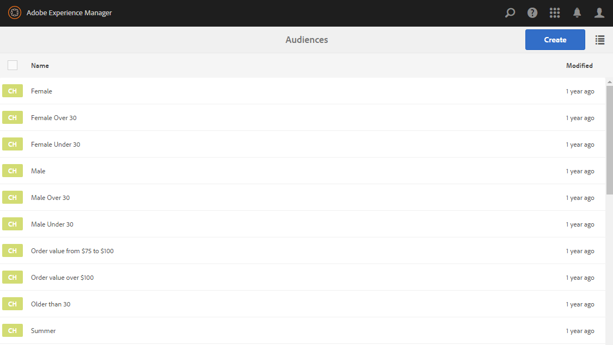

# Konfigurera segmentering med ContextHub{#configuring-segmentation-with-contexthub}

>[!NOTE]
>
>I det här avsnittet beskrivs hur du konfigurerar segmentering när du använder ContextHub. Om du använder funktionen för klientkontext läser du den relevanta dokumentationen för [konfiguration av segmentering för klientkontext](/help/sites-administering/campaign-segmentation.md).


Segmentering är en viktig faktor när man skapar en kampanj. Se [Hantera målgrupper](/help/sites-authoring/managing-audiences.md) för information om hur segmentering fungerar och nyckeltermer.

Beroende på den information du redan har samlat in om webbplatsbesökarna och vilka mål du vill uppnå, måste du definiera de segment och strategier som behövs för målinnehållet.

Dessa segment används sedan för att förse en besökare med specifikt riktat innehåll. Innehållet finns i avsnittet [Personalisering](/help/sites-authoring/personalization.md) på webbplatsen. [Verksamheter](/help/sites-authoring/activitylib.md) som definieras här kan inkluderas på alla sidor och definiera vilket besökarsegment det specialiserade innehållet gäller.

Med AEM kan ni enkelt personalisera användarnas upplevelse. Du kan även kontrollera resultatet av segmentdefinitionerna.

## Åtkomst till segment {#accessing-segments}

Audiences [-](/help/sites-authoring/managing-audiences.md) konsolen används för att hantera segment för ContextHub eller Client Context samt målgrupper för ditt Adobe Target-konto. I den här dokumentationen beskrivs hur du hanterar segment för ContextHub. Information om [klientkontextsegment](/help/sites-administering/campaign-segmentation.md) och Adobe Target-segment finns i relevant dokumentation.

Om du vill komma åt dina segment väljer du **Navigering > Personalisering > Publiker** i den globala navigeringen.



## Segmentredigerare {#segment-editor}

Med **segmentredigeraren** kan du enkelt ändra ett segment. Om du vill redigera ett segment markerar du det i [segmentlistan](/help/sites-administering/segmentation.md#accessing-segments) och klickar på **Redigera** .


Med komponentwebbläsaren kan du lägga till **OCH** - och **OR** -behållare för att definiera segmentlogiken, och sedan lägga till ytterligare komponenter för att jämföra egenskaper och värden eller referensskript och andra segment för att definiera urvalskriterierna (se [Skapa ett nytt segment](#creating-a-new-segment)) för att definiera det exakta scenariot för att markera segmentet.

När hela programsatsen utvärderas till true är segmentet löst. Om flera segment är tillämpliga används även **ökningsfaktorn** . Mer information om [förstärkningsfaktorn finns i](#creating-a-new-segment) Skapa ett nytt segment [.](/help/sites-administering/campaign-segmentation.md#boost-factor)

>[!CAUTION]
>
>Segmentredigeraren söker inte efter några cirkelreferenser. Segment A refererar till exempel till ett annat segment B, som i sin tur refererar till segment A. Du måste se till att dina segment inte innehåller några cirkelreferenser.

### Containers {#containers}

Följande behållare är tillgängliga när de är klara och gör att du kan gruppera jämförelser och referenser tillsammans för boolesk utvärdering. De kan dras från komponentwebbläsaren till redigeraren. Mer information finns i följande avsnitt [Använda OCH och ELLER behållare](/help/sites-administering/segmentation.md#using-and-and-or-containers) .

<table>
 <tbody>
  <tr>
   <td>Behållare OCH<br /> </td>
   <td>Operatorn boolesk AND<br /> </td>
  </tr>
  <tr>
   <td>Behållare ELLER<br /> </td>
   <td>Operatorn boolesk OR</td>
  </tr>
 </tbody>
</table>

### Jämförelser {#comparisons}

Följande segmentjämförelser är tillgängliga när du vill utvärdera segmentegenskaperna. De kan dras från komponentwebbläsaren till redigeraren.

<table>
 <tbody>
  <tr>
   <td>Property-Value<br /> </td>
   <td>Jämför en egenskap i en butik med ett definierat värde<br /> </td>
  </tr>
  <tr>
   <td>property-property</td>
   <td>Jämför en egenskap i en butik med en annan egenskap<br /> </td>
  </tr>
  <tr>
   <td>Referens för egenskapssegment</td>
   <td>Jämför en egenskap i en butik med ett annat refererat segment<br /> </td>
  </tr>
  <tr>
   <td>Referens för egenskapsskript</td>
   <td>Jämför en egenskap i en butik med resultatet av ett skript<br /> </td>
  </tr>
  <tr>
   <td>Referens för segmentreferens-Script</td>
   <td>Jämför ett hänvisat segment med resultatet av ett skript<br /> </td>
  </tr>
 </tbody>
</table>

>[!NOTE]
>
>Om datatypen för jämförelsen inte är inställd (d.v.s. inställd på automatisk identifiering) vid jämförelse av värden, kommer segmenteringsmotorn för ContextHub helt enkelt att jämföra värdena som javascript skulle göra. Den konverterar inte värden till de förväntade typerna, vilket kan leda till missvisande resultat. Exempel:
>
>`null < 30 // will return true`
>
>När du [skapar ett segment](/help/sites-administering/segmentation.md#creating-a-new-segment)bör du därför välja en **datatyp** när typerna av jämförda värden är kända. Exempel:
>
>När du jämför egenskapen `profile/age`vet du redan att jämförelsetypen kommer att vara **tal**, så även om `profile/age` inte är inställd returnerar en jämförelse `profile/age` som är mindre än 30 **false**, som du hade förväntat dig.

### Referenser {#references}

Följande referenser är tillgängliga när du vill länka direkt till ett skript eller ett annat segment. De kan dras från komponentwebbläsaren till redigeraren.

<table>
 <tbody>
  <tr>
   <td>Segmentreferens<br /> </td>
   <td>Utvärdera det refererade segmentet</td>
  </tr>
  <tr>
   <td>Skriptreferens</td>
   <td>Utvärdera det refererade skriptet. Mer information finns i följande avsnitt <a href="/help/sites-administering/segmentation.md#using-script-references">Använda skriptreferenser</a> .</td>
  </tr>
 </tbody>
</table>

## Skapa ett nytt segment {#creating-a-new-segment}

Så här definierar du det nya segmentet:

1. När du har [öppnat segmenten](/help/sites-administering/segmentation.md#accessing-segments)klickar eller trycker du på knappen Skapa och väljer **Skapa ContextHub-segment**.

   

1. I **New ContextHub Segment** anger du en rubrik för segmentet samt ett ökningsvärde om det behövs. Tryck eller klicka sedan på **Skapa**.

   

   Varje segment har en startparameter som används som viktningsfaktor. Ett högre värde anger att segmentet väljs framför ett segment med ett lägre värde i de fall där flera segment är giltiga.

   * Minsta värde: `0`
   * Högsta värde: `1000000`

1. Dra en jämförelse eller referens till segmentredigeraren som den visas i standardbehållaren OCH.
1. Dubbelklicka på eller tryck på konfigurationsalternativet för den nya referensen eller segmentet för att redigera de specifika parametrarna. I det här exemplet testar vi för människor i San Jose.

   

   Ange alltid en **datatyp** om det är möjligt för att säkerställa att dina jämförelser utvärderas korrekt. Mer information finns i [Jämförelser](/help/sites-administering/segmentation.md#comparisons) .

1. Spara definitionen genom att klicka på **OK** :
1. Lägg till fler komponenter efter behov. Du kan formulera booleska uttryck med behållarkomponenterna för AND- och OR-jämförelser (se [Använda OCH och Eller behållare](/help/sites-administering/segmentation.md#using-and-and-or-containers) nedan). Med segmentredigeraren kan du ta bort komponenter som inte längre behövs eller dra dem till nya positioner i programsatsen.

### Använda OCH- och ELLER-behållare {#using-and-and-or-containers}

Med hjälp av komponenterna AND och OR kan du skapa komplexa segment i AEM. När du gör det är det bra att tänka på några grundläggande saker:

* Definitionens översta nivå är alltid den AND-behållare som skapas från början. Detta kan inte ändras, men påverkar inte resten av segmentdefinitionen.
* Se till att det är rimligt att kapsla behållaren. Behållarna kan ses som parenteser i ditt booleska uttryck.

Följande exempel används för att välja besökare som räknas i vår huvudåldersgrupp:

Man och mellan 30 och 59 år

ELLER

Kvinnor och mellan 30 och 59 år

Du börjar med att placera en OR-behållarkomponent i standardbehållaren AND. I OR-behållaren lägger du till två AND-behållare och i båda dessa kan du lägga till egenskaps- eller referenskomponenterna.


### Använda skriptreferenser {#using-script-references}

Genom att använda komponenten Skriptreferens kan utvärderingen av en segmentegenskap delegeras till ett externt skript. När skriptet har konfigurerats korrekt kan det användas som en annan komponent i ett segmentvillkor.

#### Definiera ett skript som ska refereras {#defining-a-script-to-reference}

1. Lägg till fil i `contexthub.segment-engine.scripts` clientlib.
1. Implementera en funktion som returnerar ett värde. Exempel:

   ```
   ContextHub.console.log(ContextHub.Shared.timestamp(), '[loading] contexthub.segment-engine.scripts - script.profile-info.js');
   
   (function() {
       'use strict';
   
       /**
        * Sample script returning profile information. Returns user info if data is available, false otherwise.
        *
        * @returns {Boolean}
        */
       var getProfileInfo = function() {
           /* let the SegmentEngine know when script should be re-run */
           this.dependOn(ContextHub.SegmentEngine.Property('profile/age'));
           this.dependOn(ContextHub.SegmentEngine.Property('profile/givenName'));
   
           /* variables */
           var name = ContextHub.get('profile/givenName');
           var age = ContextHub.get('profile/age');
   
           return name === 'Joe' && age === 123;
       };
   
       /* register function */
       ContextHub.SegmentEngine.ScriptManager.register('getProfileInfo', getProfileInfo);
   
   })();
   ```

1. Registrera skriptet med `ContextHub.SegmentEngine.ScriptManager.register`.

Om skriptet är beroende av ytterligare egenskaper bör skriptet anropa `this.dependOn()`. Om skriptet till exempel är beroende av `profile/age`:

```
this.dependOn(ContextHub.SegmentEngine.Property('profile/age'));
```

#### Referera till ett skript {#referencing-a-script}

1. Skapa ContextHub-segment.
1. Lägg till **skriptreferenskomponenten** på önskad plats i segmentet.
1. Öppna redigeringsdialogrutan för **skriptreferenskomponenten** . Om skriptet är [korrekt konfigurerat](/help/sites-administering/segmentation.md#defining-a-script-to-reference)bör det vara tillgängligt i listrutan **Skriptnamn** .

## Testa tillämpningen av ett segment {#testing-the-application-of-a-segment}

När segmentet har definierats kan potentiella resultat testas med hjälp av **[ContextHub](/help/sites-authoring/ch-previewing.md).**

1. Förhandsgranska en sida
1. Klicka på ikonen ContextHub för att visa kontextHub-verktygsfältet
1. Välj en profil som matchar segmentet du skapade
1. ContextHub löser de segment som är tillämpliga för den valda personen

Vår enkla segmentdefinition för att identifiera användare i vår primära åldersgrupp är till exempel en enkel segmentdefinition som baseras på användarens ålder och kön. När du läser in en specifik profil som matchar dessa villkor visas om segmentet har matchats:


Eller om den inte är löst:


>[!NOTE]
>
>Alla egenskaper åtgärdas omedelbart, men de flesta ändras bara vid sidinläsning.

Sådana tester kan även utföras på innehållssidor och i kombination med riktat innehåll och relaterade **aktiviteter** och **upplevelser**.

Om du har konfigurerat en aktivitet och en upplevelse med hjälp av det primära åldersgruppssegmentet ovan kan du enkelt testa ditt segment med aktiviteten. Mer information om hur du konfigurerar en aktivitet finns i relaterad [dokumentation om att skapa riktat innehåll](/help/sites-authoring/content-targeting-touch.md).

1. I redigeringsläget för en sida där du har konfigurerat riktat innehåll kan du se att innehållet har angetts som mål via en pilikon i innehållet.

   

1. Växla till förhandsgranskningsläget och använd kontextnavet för att växla till en profil som inte matchar den segmentering som har konfigurerats för upplevelsen.

   

1. Byt till en persona som matchar den segmentering som konfigurerats för upplevelsen och se att upplevelsen ändras i enlighet med detta.

   

## Använda ditt segment {#using-your-segment}

Segment används för att styra det faktiska innehåll som ses av specifika målgrupper. Se [Hantera målgrupper](/help/sites-authoring/managing-audiences.md) för mer information om målgrupper och segment samt [Skapa riktat innehåll](/help/sites-authoring/content-targeting-touch.md) om hur du använder målgrupper och segment för att rikta innehåll.
