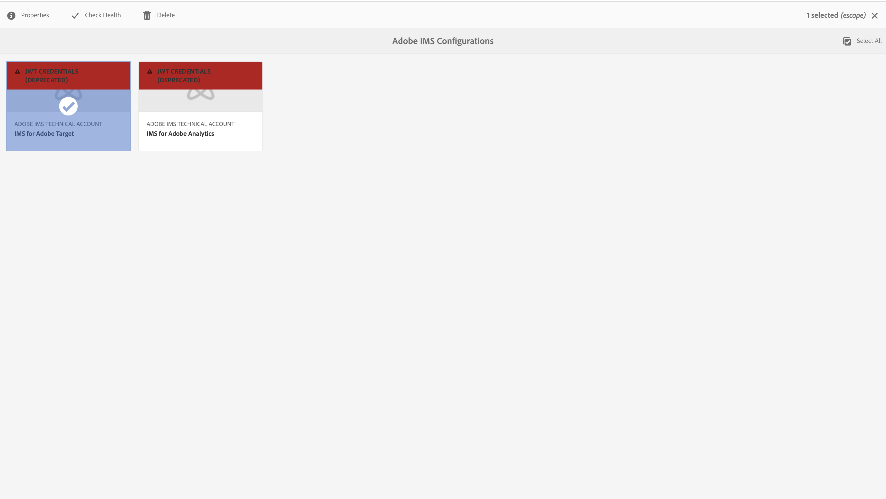

# Konfigurera IMS-integreringar för AEM {#setting-up-ims-integrations-for-aem}

>[!NOTE]
>
>Adobe-kunder använder [Adobe Developer Console](https://developer.adobe.com/console) för att generera autentiseringsuppgifter som möjliggör åtkomst till olika API:er. Kunderna väljer mellan olika typer av autentiseringsuppgifter, från OAuth Server-to-Server till Single-Page App. JWT (Credential Type Service Account) är nu föråldrat till förmån för OAuth Server-to-Server-autentiseringsuppgifterna med Service Pack 20. Den här ändringen kan porteras tillbaka till äldre Service Pack, med början från Service Pack 11 till Service Pack 20 med hjälp av en snabbkorrigering som du kan hämta [här](https://experience.adobe.com/#/downloads/content/software-distribution/en/aem.html?package=/content/software-distribution/en/details.html/content/dam/aem/public/adobe/packages/cq650/hotfix/ims-jwt-compatibility-package-6.5-1.0.zip).

Adobe Experience Manager (AEM) kan integreras med många andra Adobe-lösningar. Exempel: Adobe Target, Adobe Analytics med flera.

Integreringarna använder en IMS-integrering som konfigurerats med S2S OAuth.

* När du har skapat:

   * [Autentiseringsuppgifter i Developer Console](#credentials-in-the-developer-console)

* Då kan du:

   * Skapa en (ny) [OAuth-konfiguration](#creating-oauth-configuration)

   * [Migrera en befintlig JWT-konfiguration till en OAuth-konfiguration](#migrating-existing-JWT-configuration-to-oauth)

>[!CAUTION]
>
>Tidigare gjordes konfigurationer med [JWT-autentiseringsuppgifter som nu är borttagna i Adobe Developer Console](/help/sites-administering/jwt-credentials-deprecation-in-adobe-developer-console.md).
>
>Sådana konfigurationer kan inte längre skapas eller uppdateras, men kan migreras till OAuth-konfigurationer.

## Autentiseringsuppgifter i Developer Console {#credentials-in-the-developer-console}

Som ett första steg måste du konfigurera OAuth-autentiseringsuppgifterna i Adobe Developer Console.

Mer information om hur du gör den här konfigurationen finns i Developer Console-dokumentationen, beroende på dina krav:

* Översikt

   * [Server till server-autentisering](https://developer.adobe.com/developer-console/docs/guides/authentication/ServerToServerAuthentication/)

* Skapa en ny OAuth-autentiseringsuppgift:

   * [Implementeringshandbok för autentiseringsuppgifter för OAuth Server-till-Server](https://developer.adobe.com/developer-console/docs/guides/authentication/ServerToServerAuthentication/implementation/)

* Migrera en befintlig JWT-autentiseringsuppgift till en OAuth-autentiseringsuppgift:

   * [Migrerar från JWT-autentiseringsuppgifter (Service Account) till autentiseringsuppgifter för OAuth Server-till-Server](https://developer.adobe.com/developer-console/docs/guides/authentication/ServerToServerAuthentication/migration/)

Till exempel:

## Skapa en OAuth-konfiguration {#creating-oauth-configuration}

Så här skapar du en ny Adobe IMS-integrering med OAuth:

1. I AEM går du till **Verktyg**, **Säkerhet**, **Adobe IMS-integrering**.

1. Välj **Skapa**.

1. Slutför konfigurationen baserat på information från [Developer Console](https://developer.adobe.com/developer-console/docs/guides/authentication/ServerToServerAuthentication/implementation/). Till exempel:

   

1. **Spara** dina ändringar.

## Migrera en befintlig JWT-konfiguration till en OAuth-konfiguration {#migrating-existing-JWT-configuration-to-oauth}

Så här migrerar du en befintlig Adobe IMS-integrering baserad på JWT-autentiseringsuppgifter:

>[!NOTE]
>
>I det här exemplet visas en Starta IMS-konfiguration.

1. I AEM går du till **Verktyg**, **Säkerhet**, **Adobe IMS-integrering**.

1. Välj den JWT-konfiguration som ska migreras. JWT-konfigurationer har markerats med varningen **JWT-autentiseringsuppgifter (borttagen)**.

1. Välj **Egenskaper**:

   

1. Konfigurationen öppnas som skrivskyddad:

   

1. Välj **OAuth** i listrutan **Autentiseringstyp**:

   

1. De tillgängliga egenskaperna uppdateras. Fyll i uppgifterna från Developer Console:

   

1. Använd **Spara och stäng** för att behålla dina uppdateringar.
När du återgår till konsolen försvinner varningen **JWT-autentiseringsuppgifter (borttagen)**.
