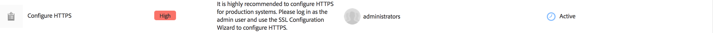

# SSL/TLS som standard{#ssl-tls-by-default}

I ett försök att kontinuerligt förbättra AEM säkerhet har Adobe introducerat en funktion som kallas SSL som standard. Syftet är att uppmuntra användningen av HTTPS för att ansluta till AEM instanser.

## Aktivera SSL/TLS som standard {#enabling-ssl-tls-by-default}

Du kan börja konfigurera SSL/TLS som standard genom att klicka på det relevanta inkorgsmeddelandet från AEM startskärm. Om du vill nå Inkorgen trycker du på klockikonen i skärmens övre högra hörn. Klicka sedan på **Visa alla**. Då visas en lista med alla aviseringar som har beställts i en listvy.

Markera och öppna aviseringen **Konfigurera HTTPS** i listan:



>[!NOTE]
>
>Om aviseringen **Konfigurera HTTPS** inte finns i Inkorgen kan du navigera direkt till HTTPS-guiden genom att gå till *<http://serveraddress:serverport/libs/granite/security/content/sslConfig.html?item=configuration%2fconfiguressl&_charset_=utf-8>*

En tjänstanvändare med namnet **ssl-service** har skapats för den här funktionen. När du har öppnat aviseringen vägleds du genom följande konfigurationsguide:

1. Konfigurera först arkivautentiseringsuppgifterna. Detta är autentiseringsuppgifterna för systemanvändarens nyckelarkiv **ssl-service** som innehåller den privata nyckeln och förtroendearkivet för HTTPS-avlyssnaren.

   

1. När du har angett inloggningsuppgifterna klickar du på **Nästa** i det övre högra hörnet på sidan. Ladda sedan upp den associerade privata nyckeln och certifikatet för SSL/TLS-anslutningen.

   

   >[!NOTE]
   >
   >Mer information om hur du skapar en privat nyckel och ett certifikat som ska användas med guiden finns i [den här proceduren](/help/sites-administering/ssl-by-default.md#generating-a-private-key-certificate-pair-to-use-with-the-wizard) nedan.

1. Slutligen anger du HTTPS-värdnamnet och TCP-porten för HTTPS-avlyssnaren.

   

## Automatisera SSL/TLS som standard {#automating-ssl-tls-by-default}

Det finns tre sätt att automatisera SSL/TLS som standard.

### Via HTTP-POST {#via-http-post}

Den första metoden innebär publicering till SSLSetup-servern som används av konfigurationsguiden:

```shell
POST /libs/granite/security/post/sslSetup.html
```

Du kan använda följande nyttolast i POSTEN för att automatisera konfigurationen:

```xml
------WebKitFormBoundaryyBO4ArmGlcfdGDbs
Content-Disposition: form-data; name="keystorePassword"

test
------WebKitFormBoundaryyBO4ArmGlcfdGDbs
Content-Disposition: form-data; name="keystorePasswordConfirm"
test
------WebKitFormBoundaryyBO4ArmGlcfdGDbs
Content-Disposition: form-data; name="truststorePassword"
test
------WebKitFormBoundaryyBO4ArmGlcfdGDbs
Content-Disposition: form-data; name="truststorePasswordConfirm"
test
------WebKitFormBoundaryyBO4ArmGlcfdGDbs
Content-Disposition: form-data; name="privatekeyFile"; filename="server.der"
Content-Type: application/x-x509-ca-cert

------WebKitFormBoundaryyBO4ArmGlcfdGDbs
Content-Disposition: form-data; name="certificateFile"; filename="server.crt"
Content-Type: application/x-x509-ca-cert

------WebKitFormBoundaryyBO4ArmGlcfdGDbs
Content-Disposition: form-data; name="httpsPort"
8443
```

Servern kommer, precis som vilken server som helst för POST av sling, att svara med 200 OK eller en felkod för HTTP-status. Du hittar information om status i svarets HTML.

Nedan finns exempel på både ett lyckat svar och ett fel.

**EXEMPEL PÅ SLUTFÖRT** (status = 200):

```xml
<!DOCTYPE html>
<html lang='en'>
<head>
<title>OK</title>
</head>
<body>
<h1>OK</h1>
<dl>
<dt class='foundation-form-response-status-code'>Status</dt>
<dd>200</dd>
<dt class='foundation-form-response-status-message'>Message</dt>
<dd>SSL successfully configured</dd>
<dt class='foundation-form-response-title'>Title</dt>
<dd>OK</dd>
<dt class='foundation-form-response-description'>Description</dt>
<dd>HTTPS has been configured on port 8443. The private key and
certificate were stored in the key store of the user ssl-service.
Take note of the key store password you provided. You need
it for any subsequent updating of the private key or certificate.</dd>
</dl>
<h2>Links</h2>
<ul class='foundation-form-response-links'>
<li><a class='foundation-form-response-redirect' href='/'>Done</a></li>
</ul>
</body>
</html>
```

**FELEXEMPEL** (status = 500):

```xml
<!DOCTYPE html>
<html lang='en'>
<head>
<title>Error</title>
</head>
<body>
<h1>Error</h1>
<dl>
<dt class='foundation-form-response-status-code'>Status</dt>
<dd>500</dd>
<dt class='foundation-form-response-status-message'>Message</dt>
<dd>The provided file is not a valid key, DER format expected</dd>
<dt class='foundation-form-response-title'>Title</dt>
<dd>Error</dd>
</dl>
</body>
</html>
```

### Via paket {#via-package}

Du kan också automatisera SSL-/TLS-konfigurationen genom att överföra ett paket som redan innehåller följande obligatoriska objekt:

* SSL-service-användarens nyckelbehållare. Detta finns under */home/users/system/security/ssl-service/keystore* i databasen.
* Konfigurationen `GraniteSslConnectorFactory`

### Skapa en privat nyckel/ett certifikatpar som ska användas med guiden {#generating-a-private-key-certificate-pair-to-use-with-the-wizard}

Här nedan hittar du ett exempel på hur du skapar ett självsignerat certifikat i DER-format som kan användas i SSL-/TLS-guiden. Installera OpenSSL baserat på operativsystemet, öppna kommandotolken för OpenSSL och ändra katalogen till den mapp där du vill generera den privata nyckeln/certifikatet.

>[!NOTE]
>
>Ett självsignerat certifikat används endast som exempel. Ska inte användas i produktion.

1. Skapa först den privata nyckeln:

   ```shell
   openssl genrsa -aes256 -out localhostprivate.key 4096
   openssl rsa -in localhostprivate.key -out localhostprivate.key
   ```

1. Generera sedan en CSR-begäran (Certificate Signing Request) med hjälp av en privat nyckel:

   ```shell
   openssl req -sha256 -new -key localhostprivate.key -out localhost.csr -subj "/CN=localhost"
   ```

1. Generera SSL-/TLS-certifikatet och signera det med den privata nyckeln. I det här exemplet upphör att gälla ett år från och med nu:

   ```shell
   openssl x509 -req -days 365 -in localhost.csr -signkey localhostprivate.key -out localhost.crt
   ```

1. Konvertera den privata nyckeln till DER-format. Detta beror på att SSL-guiden kräver att nyckeln är i DER-format:

   ```shell
   openssl pkcs8 -topk8 -inform PEM -outform DER -in localhostprivate.key -out localhostprivate.der -nocrypt
   ```

1. Ladda slutligen upp **localhostprivate.der** som privat nyckel och **localhost.crt** som SSL/TLS-certifikat i steg 2 i den grafiska SSL-/TLS-guiden som beskrivs i början av den här sidan.

### Uppdatera SSL-/TLS-konfigurationen via cURL {#updating-the-ssl-tls-configuration-via-curl}

>[!NOTE]
>
>En centraliserad lista över användbara cURL-kommandon i AEM finns i [Använda cURL med AEM](https://helpx.adobe.com/se/experience-manager/6-4/sites/administering/using/curl.html).

Du kan också automatisera SSL-/TLS-konfigurationen med verktyget cURL. Du kan göra detta genom att skicka konfigurationsparametrarna till den här URL:en:

*https://&lt;serveradress>:&lt;serverport>/libs/granite/security/post/sslSetup.html*

Nedan visas parametrarna som du kan använda för att ändra de olika inställningarna i konfigurationsguiden:

* `-F "keystorePassword=password"` - lösenordet för nyckelbehållaren;

* `-F "keystorePasswordConfirm=password"` - bekräfta lösenordet för nyckelbehållaren;

* `-F "truststorePassword=password"` - lösenordet för förvaltararkivet;

* `-F "truststorePasswordConfirm=password"` - bekräfta lösenordet för förtroendearkivet;

* `-F "privatekeyFile=@localhostprivate.der"` - ange den privata nyckeln;

* `-F "certificateFile=@localhost.crt"` - ange certifikatet;

* `-F "httpsHostname=host.example.com"`- ange värdnamnet;
* `-F "httpsPort=8443"` - den port som HTTPS-avlyssnaren ska arbeta med.

>[!NOTE]
>
>Det snabbaste sättet att köra cURL för att automatisera SSL-/TLS-konfigurationen är från den mapp där DER- och CRT-filerna finns. Du kan också ange den fullständiga sökvägen i argumenten `privatekeyFile` och certificateFile.
>
>Du måste också autentiseras för att kunna utföra uppdateringen, så se till att du lägger till cURL-kommandot med parametern `-u user:passeword`.
>
>Ett korrekt cURL-postkommando ska se ut så här:

```shell
curl -u user:password -F "keystorePassword=password" -F "keystorePasswordConfirm=password" -F "truststorePassword=password" -F "truststorePasswordConfirm=password" -F "privatekeyFile=@localhostprivate.der" -F "certificateFile=@localhost.crt" -F "httpsHostname=host.example.com" -F "httpsPort=8443" https://host:port/libs/granite/security/post/sslSetup.html
```

#### Flera certifikat med cURL {#multiple-certificates-using-curl}

Du kan skicka en certifikatkedja till servern genom att upprepa parametern certificateFile så här:

`-F "certificateFile=@root.crt" -F "certificateFile=@localhost.crt"..`

När du har kört kommandot kontrollerar du att alla certifikat har gjort det till nyckelbehållaren. Kontrollera **Keystore**-posterna från:
[http://localhost:4502/libs/granite/security/content/v2/usereditor.html/home/users/system/security/ssl-service](http://localhost:4502/libs/granite/security/content/v2/usereditor.html/home/users/system/security/ssl-service)

### Aktivera en TLS 1.3-anslutning {#enabling-tls-connection}

1. Gå till webbkonsolen
1. Gå sedan till **OSGi** - **Konfiguration** - **Adobe Granite SSL Connector Factory**
1. Gå till fältet **Inkluderade chiffersviter** och lägg till följande poster. Du kan bekräfta varje tillägg genom att trycka på knappen **+** till vänster om fältet, efter att du lagt till varje tillägg i:

   * `TLS_AES_256_GCM_SHA384`
   * `TLS_AES_128_GCM_SHA256`
   * `TLS_CHACHA20_POLY1305_SHA256`
   * `TLS_AES_128_CCM_SHA256`
   * `TLS_AES_128_CCM_8_SHA256`
