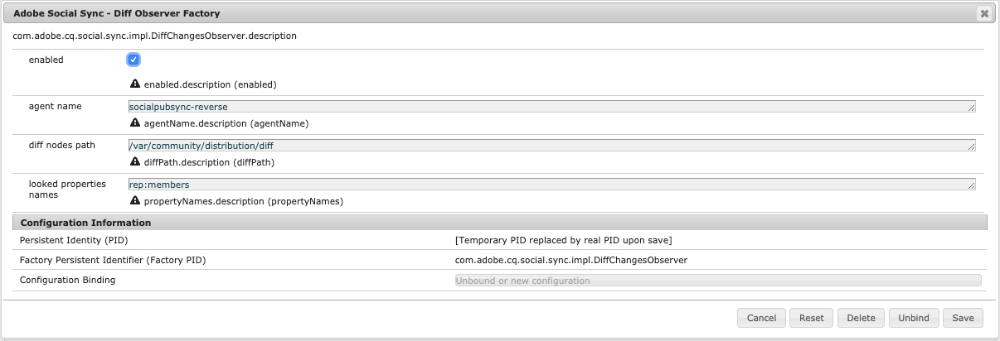

# Användarsynkronisering{#user-synchronization}

## Introduktion {#introduction}

När distributionen är en [publicera servergrupp](/help/sites-deploying/recommended-deploys.md#tarmk-farm), måste medlemmarna kunna logga in och se sina data på valfri publiceringsnod.

Användare och användargrupper (användardata) som har skapats i publiceringsmiljön behövs inte i författarmiljön.

De flesta användardata som skapas i författarmiljön är avsedda att finnas kvar i författarmiljön och inte kopieras till publiceringsinstanser.

Registrering och ändringar som görs på en publiceringsinstans måste synkroniseras med andra publiceringsinstanser för att de ska ha tillgång till samma användardata.

Från och med AEM 6.1 synkroniseras användardata automatiskt mellan publiceringsinstanserna i servergruppen när användarsynkronisering är aktiverad och skapas inte på författaren.

## Sling Distribution {#sling-distribution}

Användardata, tillsammans med deras [ACL:er](/help/sites-administering/security.md), lagras i [Oak Core](/help/sites-deploying/platform.md), lagret under Oak JCR och nås via [Oak API](https://developer.adobe.com/experience-manager/reference-materials/6-5/javadoc/org/apache/jackrabbit/oak/api/package-tree.html). Med ovanliga uppdateringar är det rimligt att användardata synkroniseras med andra publiceringsinstanser med [Distribution av säljinnehåll](https://github.com/apache/sling-old-svn-mirror/blob/trunk/contrib/extensions/distribution/README.md) (Sling distribution).

Fördelarna med användarsynkronisering med Sling-distribution jämfört med traditionell replikering är:

* *användare*, *användarprofiler* och *användargrupper* som skapats vid publicering har inte skapats för författare

* Sling distribution anger egenskaper i jcr-händelser, vilket gör det möjligt att agera i händelseavlyssnare på publiceringssidan utan att bekymra sig om oändliga replikeringsslingor
* Vid distribution skickas endast användardata till publiceringsinstanser som inte har ursprungsstatus, vilket eliminerar onödig trafik
* [ACL:er](/help/sites-administering/security.md) som angetts i användarnoden ingår i synkroniseringen

>[!NOTE]
>
>Om sessioner krävs rekommenderar vi att du antingen använder en enkel inloggning eller en klisteristisk session, och att kunderna loggar in om de växlar till en annan Publish-instans.

>[!CAUTION]
>
>Synkronisering av **administratörer** grupp stöds inte, även om användarsynkronisering är aktiverat. I stället loggas ett fel att importera diff-filen i felloggen.
>
>Det innebär att när distributionen är en publiceringsgrupp, om en användare läggs till eller tas bort från **administratörer** måste ändringen göras manuellt för varje Publish-instans.

## Aktivera användarsynkronisering {#enable-user-sync}

>[!NOTE]
>
>Som standard är användarsynkronisering `disabled`.
>
>Att aktivera användarsynkronisering innebär att ändra *befintlig* OSGi-konfigurationer.
>
>Inga nya konfigurationer ska läggas till som ett resultat av aktivering av användarsynkronisering.

Användarsynkronisering förlitar sig på redigeringsmiljön för att hantera distributionen av användardata, även om användardata inte har skapats på författaren. Mycket, men inte allt, av konfigurationen sker i författarmiljön och varje steg identifierar tydligt om den ska utföras på författare eller publicera.

Nedan följer de steg som krävs för att aktivera användarsynkronisering, följt av en [Felsökning](#troubleshooting) avsnitt:

### Förutsättningar {#prerequisites}

1. Om användare och användargrupper redan har skapats på en publiceringsinstans rekommenderar vi att du [synka manuellt](#manually-syncing-users-and-user-groups) användardata till alla publiceringsinstanser innan användarsynkronisering konfigureras och aktiveras.

När användarsynkroniseringen är aktiverad synkroniseras endast nyskapade användare och grupper.

1. Kontrollera att den senaste koden är installerad:

* [AEM plattformsuppdateringar](https://experienceleague.adobe.com/docs/experience-manager-release-information/aem-release-updates/aem-releases-updates.html)
* [AEM Communities-uppdateringar](/help/communities/deploy-communities.md#latestfeaturepack)

### 1. Apache Sling Distribution Agent - Sync Agents Factory {#apache-sling-distribution-agent-sync-agents-factory}

**Aktivera användarsynkronisering**

* **on author**

   * logga in med administratörsbehörighet
   * åtkomst till [Webbkonsol](/help/sites-deploying/configuring-osgi.md)

      * till exempel [https://localhost:4502/system/console/configMgr](https://localhost:4502/system/console/configMgr)

   * leta `Apache Sling Distribution Agent - Sync Agents Factory`

      * markera den befintliga konfigurationen så att du kan öppna den för redigering (pennikonen) Bekräfta `name`: **`socialpubsync`**

      * välj `Enabled` kryssruta
      * välj `Save`


### 2. Skapa behörig användare {#createauthuser}

**Konfigurera behörigheter**

Den auktoriserade användaren används i steg 3 för att konfigurera Sling-distributionen på författaren.

* **på varje publiceringsinstans**

   * logga in med administratörsbehörighet
   * åtkomst till [Säkerhetskonsol](/help/sites-administering/security.md)

      * till exempel [https://localhost:4503/useradmin](https://localhost:4503/useradmin)

   * skapa en användare

      * till exempel `usersync-admin`

   * lägg till den här användaren i **`administrators`** användargrupp
   * [lägg till ACL för den här användaren i /home](#howtoaddacl)

      * `Allow jcr:all` med begränsning `rep:glob=*/activities/*`

>[!CAUTION]
>
>En ny användare måste skapas.
>
>* Den tilldelade standardanvändaren är **`admin`**.
>* Använd inte `communities-user-admin user.`
>

#### Lägga till ACL {#addacls}

* access CRXDE Lite

   * till exempel [https://localhost:4503/crx/de](https://localhost:4503/crx/de)

* välj `/home` nod
* i den högra rutan väljer du `Access Control` tab
* om du vill lägga till en ACL-post väljer du `+` knapp

   * **kapitalbelopp**: *sök efter användare som har skapats för användarsynkronisering*
   * **Typ**: `Allow`
   * **Behörighet**: `jcr:all`
   * **Begränsningar** `rep:glob`: `*/activities/*`
   * välj **OK**

* välj **Spara alla**


Se även

* [Behörighetshantering](/help/sites-administering/user-group-ac-admin.md#access-right-management)
* Felsökningsavsnitt [Ändra åtgärdsundantag under svarsbearbetning](#modify-operation-exception-during-response-processing).

### 3. Adobe Granite-distribution - krypterad lösenordsleverantör för transport av hemlighet {#adobegraniteencpasswrd}

**Konfigurera behörigheter**

En gång en auktoriserad användare som är medlem i **`administrators`** användargrupp-skapas för alla publiceringsinstanser. Den auktoriserade användaren måste identifieras på författaren som behörig att synkronisera användardata från författare till publicering.

* **på författare**

   * logga in med administratörsbehörighet
   * åtkomst till [Webbkonsol](/help/sites-deploying/configuring-osgi.md)

      * till exempel [https://localhost:4502/system/console/configMgr](https://localhost:4502/system/console/configMgr)

   * leta `com.adobe.granite.distribution.core.impl.CryptoDistributionTransportSecretProvider.name`
   * för att öppna för redigering väljer du den befintliga konfigurationen (pennikonen) Bekräfta `property name`: **`socialpubsync-publishUser`**

   * ange användarnamn och lösenord för [auktoriserad användare](#createauthuser) skapades vid publicering i steg 2

      * till exempel `usersync-admin`


### 4. Apache Sling Distribution Agent - Queue Agents Factory {#apache-sling-distribution-agent-queue-agents-factory}

**Aktivera användarsynkronisering**

* **på varje publiceringsinstans**:

   * logga in med administratörsbehörighet
   * åtkomst till [Webbkonsol](/help/sites-deploying/configuring-osgi.md)

      * till exempel [https://localhost:4503/system/console/configMgr](https://localhost:4503/system/console/configMgr)

   * leta `Apache Sling Distribution Agent - Queue Agents Factory`

      * för att öppna för redigering väljer du den befintliga konfigurationen (pennikonen) Bekräfta `Name`: `socialpubsync-reverse`

      * välj `Enabled` kryssruta
      * välj `Save`

   * **upprepa** för varje publiceringsinstans


### 5. Adobe Social Sync - Diff Observer Factory {#diffobserver}

**Aktivera gruppsynkronisering**

* **på varje publiceringsinstans**:

   * logga in med administratörsbehörighet
   * åtkomst till [Webbkonsol](/help/sites-deploying/configuring-osgi.md)

      * till exempel [https://localhost:4503/system/console/configMgr](https://localhost:4503/system/console/configMgr)

   * leta **`Adobe Social Sync - Diff Observer Factory`**

      * för att öppna för redigering väljer du den befintliga konfigurationen (pennikonen)

        Verifiera `agent name`: `socialpubsync-reverse`

      * välj `Enabled` kryssruta
      * välj `Save`



### 6. Apache Sling Distribution Trigger - Factory för schemalagda utlösare {#apache-sling-distribution-trigger-scheduled-triggers-factory}

**(Valfritt) Ändra avsökningsintervall**

Som standard söker författaren efter ändringar var 30:e sekund. Så här ändrar du intervallet:

* **på författare**

   * logga in med administratörsbehörighet
   * åtkomst till [Webbkonsol](/help/sites-deploying/configuring-osgi.md)

      * till exempel [https://localhost:4502/system/console/configMgr](https://localhost:4502/system/console/configMgr)

   * leta `Apache Sling Distribution Trigger - Scheduled Triggers Factory`

      * för att öppna för redigering väljer du den befintliga konfigurationen (pennikonen)

         * Verifiera `Name`: `socialpubsync-scheduled-trigger`

      * ange `Interval in Seconds` till önskat intervall
      * välj `Save`


## Konfigurera för flera publiceringsinstanser {#configure-for-multiple-publish-instances}

Standardkonfigurationen är för en enda publiceringsinstans. Eftersom orsaken till aktiveringen av användarsynkronisering är att synkronisera flera publiceringsinstanser, t.ex. för en publiceringsgrupp, måste de ytterligare publiceringsinstanserna läggas till i synkroniseringsagentkatalogen.

### 7. Apache Sling Distribution Agent - Sync Agents Factory {#apache-sling-distribution-agent-sync-agents-factory-1}

**Lägg till publiceringsinstanser:**

* **på författare**

   * logga in med administratörsbehörighet
   * åtkomst till [Webbkonsol](/help/sites-deploying/configuring-osgi.md)

      * till exempel [https://localhost:4502/system/console/configMgr](https://localhost:4502/system/console/configMgr)

   * leta `Apache Sling Distribution Agent - Sync Agents Factory`

      * för att öppna för redigering väljer du den befintliga konfigurationen (pennikonen) Bekräfta `Name`: `socialpubsync`


* **Exporterarslutpunkter**
Det ska finnas en exportörslutpunkt för varje Publish-instans. Om det till exempel finns två publiceringsinstanser, localhost:4503 och 4504, ska det finnas två poster:

   * `https://localhost:4503/libs/sling/distribution/services/exporters/socialpubsync-reverse`
   * `https://localhost:4504/libs/sling/distribution/services/exporters/socialpubsync-reverse`

* **Importerarslutpunkter**
Det ska finnas en importslutpunkt för varje Publish-instans. Om det till exempel finns två publiceringsinstanser, localhost:4503 och 4504, ska det finnas två poster:

   * `https://localhost:4503/libs/sling/distribution/services/importers/socialpubsync`
   * `https://localhost:4504/libs/sling/distribution/services/importers/socialpubsync`

* välj `Save`

### 8. AEM Communities-lyssnare för användarsynkronisering {#aem-communities-user-sync-listener}

**(Valfritt) Synkronisera ytterligare JCR-noder**

Om det finns anpassade data att synkronisera över flera publiceringsinstanser:

* **på varje publiceringsinstans**:

   * logga in med administratörsbehörighet
   * åtkomst till [Webbkonsol](/help/sites-deploying/configuring-osgi.md)

      * till exempel `https://localhost:4503/system/console/configMgr`

   * leta `AEM Communities User Sync Listener`
   * för att öppna för redigering väljer du den befintliga konfigurationen (pennikonen) Bekräfta `Name`: `socialpubsync-scheduled-trigger`


* **Nodtyper**
Det här är listan över nodtyper som är synkroniserade. Alla nodtyper utom sling:Folder måste listas här (sling:folder hanteras separat).
Standardlista över nodtyper som ska synkroniseras:

   * rep:User
   * nt:ostrukturerad
   * nt:resurs

* **Ignorerbara egenskaper**
Det här är listan med egenskaper som ignoreras om några ändringar identifieras. Ändringar av de här egenskaperna kan synkroniseras som en sidoeffekt av andra ändringar (eftersom synkronisering alltid finns på nodnivå), men ändringar av de här egenskaperna utlöser inte synkronisering i sig.
Standardegenskap som ska ignoreras:

   * cq:lastModified

* **Ignorerbara noder**
Undersökvägar som ignoreras under synkronisering. Inget under dessa delsökvägar synkroniseras när som helst.
Standardnoder som ska ignoreras:

   * .tokens
   * system

* **Distribuerade mappar**
De flesta sling:Mappar ignoreras eftersom synkronisering inte behövs. De få undantagen listas här.
Standardmappar att synkronisera

   * segment/poäng
   * sociala medier/relationer
   * verksamhet

### 9. Unikt ID för försäljning {#unique-sling-id}

>[!CAUTION]
>
>Om Sling ID matchar mellan två eller flera publiceringsinstanser misslyckas synkroniseringen av användargruppen.

Om Sling ID är samma för flera publiceringsinstanser i en publiceringsgrupp synkroniseras inte användargrupperna.

Så här validerar du att alla värden för Sling ID skiljer sig åt för varje Publish-instans:

1. bläddra till `http://<host>:<port>/system/console/status-slingsettings`
1. kontrollera värdet för **Sling-ID**


Om Sling ID för en Publish-instans matchar Sling ID för någon annan Publish-instans:

1. stoppa en av publiceringsinstanserna som har ett matchande Sling ID
1. i katalogen crx-quickstart/launchpad/felix

   * söka efter och ta bort filen med namnet *sling.id.file*

      * i ett Linux®-system:
        `rm -i $(find . -type f -name sling.id.file)`

      * i ett Windows-system:
        `use windows explorer and search for *sling.id.file*`

1. starta Publish-instansen

   * vid start tilldelas det ett nytt Sling ID

1. validera att **Sling-ID** är nu unikt

Upprepa dessa steg tills alla publiceringsinstanser har ett unikt Sling ID.

## Vault Package Builder Factory {#vault-package-builder-factory}

För att uppdateringar ska kunna synkroniseras på rätt sätt måste du ändra valvpaketets byggare för användarsynkronisering:

* på varje AEM Publish-instans
* åtkomst till [Webbkonsol](/help/sites-deploying/configuring-osgi.md)

   * till exempel [https://localhost:4503/system/console/configMgr](https://localhost:4503/system/console/configMgr)

* leta upp `Apache Sling Distribution Packaging - Vault Package Builder Factory`

   * `Builder name: socialpubsync-vlt`

* markera redigeringsikonen
* lägg till två `Package Node Filters`:

   * `/home/users|-.*/.tokens`
   * `/home/users|-.*/rep:cache`

* principhantering:

   * om du vill skriva över befintliga rep:principnoder med nya lägger du till ett tredje paketfilter:

      * `/home/users|+.*/rep:policy`

   * för att förhindra att profiler distribueras, ange

      * `Acl Handling:` `IGNORE`


## Vad händer när ... {#what-happens-when}

### Självregister för användare eller redigeringsprofil vid publicering {#user-self-registers-or-edits-profile-on-publish}

Användare och profiler som skapats i publiceringsmiljön (självregistrering) visas inte i författarmiljön.

När topologin är [publicera servergrupp](/help/sites-deploying/recommended-deploys.md#tarmk-farm) och användarsynkroniseringen har konfigurerats korrekt, *användare* och *användarprofil* synkroniseras över hela publiceringsgruppen med Sling-distribution.

### Användare eller användargrupper skapas med säkerhetskonsolen {#users-or-user-groups-are-created-using-security-console}

Användardata som skapas i publiceringsmiljön visas inte som avsett i redigeringsmiljön och omvänt.

När [Användaradministration och -säkerhet](/help/sites-administering/security.md) konsolen används för att lägga till nya användare i publiceringsmiljön, användarsynkronisering synkroniserar nya användare och deras gruppmedlemskap med andra publiceringsinstanser om det behövs. Användarsynkronisering synkroniserar även användargrupper som skapats via säkerhetskonsolen.

## Felsökning {#troubleshooting}

### Använda användarsynkronisering offline {#how-to-take-user-sync-offline}

Om du vill göra användarsynkroniseringen offline går du till [ta bort en Publish-instans](#how-to-remove-a-publish-instance) eller [synkronisera data manuellt](#manually-syncing-users-and-user-groups)måste distributionskön vara tom och tyst.

Så här kontrollerar du status för distributionskön:

* på författare:

   * använda [CRXDE Lite](/help/sites-developing/developing-with-crxde-lite.md)

      * sök efter poster i `/var/sling/distribution/packages`

         * mappnoder namngivna med mönstret `distrpackage_*`

   * använda [Pakethanteraren](/help/sites-administering/package-manager.md)

      * söka efter väntande paket (ännu inte installerat)

         * namngiven med mönstret `socialpubsync-vlt*`
         * skapad av `communities-user-admin`

Inaktivera användarsynkronisering när distributionskön är tom:

* på författare

   * *uncheck *the `Enabled` kryssruta för [Apache Sling Distribution Agent - Sync Agents Factory](#apache-sling-distribution-agent-sync-agents-factory)

Så här återaktiverar du användarsynkronisering när åtgärder har slutförts:

* på författare

   * kontrollera `Enabled` kryssruta för [Apache Sling Distribution Agent - Sync Agents Factory](#apache-sling-distribution-agent-sync-agents-factory)

### Diagnostik för användarsynkronisering {#user-sync-diagnostics}

Diagnostik för användarsynkronisering är ett verktyg som kontrollerar konfigurationen och försöker identifiera eventuella problem.

Navigera från huvudkonsolen via författaren **Verktyg, Åtgärder, Diagnostik, Diagnostik för användarsynkronisering.**

Resultatet visas bara om du anger konsolen för användarsynkronisering.

Detta visas när användarsynkronisering inte har aktiverats:


#### Så här kör du diagnostik för publiceringsinstanser {#how-to-run-diagnostics-for-publish-instances}

När diagnostiken körs från redigeringsmiljön innehåller resultatet för godkänt/misslyckat en [INFORMATION] -sektion som visar listan med konfigurerade publiceringsinstanser för bekräftelse.

I listan finns en URL för varje Publish-instans som kör diagnostiken för den instansen. URL-param `syncUser` läggs till i diagnostikwebbadressen med dess värde inställt på *auktoriserad synkroniseringsanvändare* som [Steg 2](#createauthuser).

**Anteckning**: innan webbadressen startas *auktoriserad synkroniseringsanvändare* måste redan vara inloggad på den publiceringsinstansen.


### Felaktig konfiguration {#configuration-improperly-added}

När användarsynkroniseringen inte fungerar är det vanligaste problemet att ytterligare konfigurationer *tillagd*. I stället borde den befintliga *standardkonfigurationen ha *redigerad*.

Här följer några vyer över hur den redigerade bilden visas standardkonfigurationer i webbkonsolen. Om fler än en instans visas bör den tillagda konfigurationen tas bort.

#### (Författare) En Apache Sling Distribution Agent - Sync Agents Factory {#author-one-apache-sling-distribution-agent-sync-agents-factory}


#### (Författare) En Apache Sling Distribution Transport-autentiseringsuppgifter - Användarautentiseringsuppgifter baserad DistributionTransportSecretProvider {#author-one-apache-sling-distribution-transport-credentials-user-credentials-based-distributiontransportsecretprovider}


#### (Publish) En Apache Sling Distribution Agent - köagentfabrik {#publish-one-apache-sling-distribution-agent-queue-agents-factory}


#### (Publish) One Adobe Social Sync - Diff Observer Factory {#publish-one-adobe-social-sync-diff-observer-factory}


#### (Författare) En utlösare för Apache Sling Distribution - Factory för schemalagda utlösare {#author-one-apache-sling-distribution-trigger-scheduled-triggers-factory}


### Ändra åtgärdsundantag under svarsbearbetning {#modify-operation-exception-during-response-processing}

Om följande syns i loggen:

`org.apache.sling.servlets.post.impl.operations.ModifyOperation Exception during response processing.`

`java.lang.IllegalStateException: This tree does not exist`

Verifiera sedan att avsnittet [2. Skapa auktoriserad användare](#createauthuser) följdes på rätt sätt.

I det här avsnittet beskrivs hur du skapar en behörig användare, som finns på alla publiceringsinstanser, och identifierar dem i OSGi-konfigurationen för den hemliga providern. Som standard är användaren `admin`.

Den behöriga användaren bör göras medlem i **`administrators`** användargruppen och behörigheterna för den gruppen ska inte ändras.

Den auktoriserade användaren bör uttryckligen ha följande behörigheter och begränsningar för alla publiceringsinstanser:

| **bana** | **jcr:all** | **rep:glob** |
|---|---|---|
| /home | X | &#42;/aktiviteter/&#42; |
| /home/users | X | &#42;/aktiviteter/&#42; |
| /home/groups | X | &#42;/aktiviteter/&#42; |

Som medlem i `administrators` gruppen bör den auktoriserade användaren ha följande behörigheter för alla publiceringsinstanser:

| **bana** | **jcr:all** | **jcr:read** | **rep:write** |
|---|---|---|---|
| /etc/packages/sling/distribution |  |  | X |
| /libs/sling/distribution |  | X |  |
| /var |  |  | X |
| /var/eventing |  | X | X |
| /var/sling/distribution |  | X | X |

### Synkronisering av användargrupp misslyckades {#user-group-sync-failed}

Om Sling ID matchar mellan två eller flera publiceringsinstanser misslyckas synkroniseringen av användargruppen.

Se avsnitt [9. Unikt försäljnings-ID](#unique-sling-id)

### Synkronisera användare och användargrupper manuellt {#manually-syncing-users-and-user-groups}

* vid publiceringsinstanser där användare och användargrupper finns:

   * [om det är aktiverat, inaktivera användarsynkronisering](#how-to-take-user-sync-offline)
   * [skapa ett paket](/help/sites-administering/package-manager.md#creating-a-new-package) av `/home`

      * när du redigerar paketet

         * Fliken Filter: Lägg till filter: Rotsökväg: `/home`
         * Fliken Avancerat: AC-hantering: `Overwrite`

   * [exportera paketet](/help/sites-administering/package-manager.md#downloading-packages-to-your-file-system)

* på andra publiceringsinstanser:

   * [importera paketet](/help/sites-administering/package-manager.md#installing-packages)

Om du vill konfigurera eller aktivera användarsynkronisering går du till steg 1: [Apache Sling Distribution Agent - Sync Agents Factory](#apache-sling-distribution-agent-sync-agents-factory)

### När en publiceringsinstans blir otillgänglig {#when-a-publish-instance-becomes-unavailable}

När en publiceringsinstans blir otillgänglig bör den inte tas bort om den kommer tillbaka online i framtiden. Ändringarna köas för Publish-instansen och när den är online igen bearbetas ändringarna.

Om publiceringsinstansen aldrig återgår till onlineläge, om den är permanent offline, måste den tas bort eftersom köbygget resulterar i märkbart diskutrymme i redigeringsmiljön.

När en Publish-instans är nedtryckt har författarloggen följande undantag:

```
28.01.2016 15:57:48.475 ERROR
 [pool-12-thread-34-org_apache_sling_distribution_queue_socialpubsync_endpoint1
 (org/apache/sling/distribution/queue/socialpubsync/endpoint1)]
 org.apache.sling.distribution.agent.impl.SimpleDistributionAgent [agent][socialpubsync] could not deliver package distrpackage_1454014575838_a2b45ec8-0400-42f3-bed8-ae09b66381cb
 org.apache.sling.distribution.packaging.DistributionPackageImportException: failed in importing package ...
```

### Så här tar du bort en publiceringsinstans {#how-to-remove-a-publish-instance}

Så här tar du bort en Publish-instans från [Apache Sling Distribution Agent - Sync Agents Factory](#apache-sling-distribution-agent-sync-agents-factory)måste distributionskön vara tom och tyst.

* på författare:

   * [Ta användarsynkronisering offline](#how-to-take-user-sync-offline)
   * följ [steg 7](#apache-sling-distribution-agent-sync-agents-factory) om du vill ta bort Publish-instansen från båda serverlistorna:

      * `Exporter Endpoints`
      * `Importer Endpoints`

   * återaktivera användarsynkronisering

      * kontrollera `Enabled` kryssruta för [Apache Sling Distribution Agent - Sync Agents Factory](#apache-sling-distribution-agent-sync-agents-factory)
