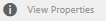
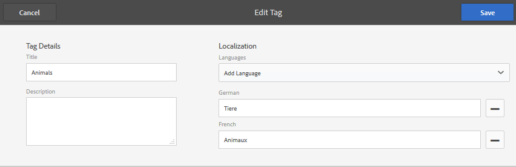

# Administrera taggar {#administering-tags}

Taggar är ett snabbt och enkelt sätt att klassificera innehåll på en webbplats. De kan ses som nyckelord eller etiketter (metadata) som gör att innehåll kan hittas snabbare som ett resultat av en sökning.

I Adobe Experience Manager (AEM) kan en -tagg vara en egenskap för

* en innehållsnod för en sida (se [Använda taggar](/help/sites-authoring/tags.md))

* en metadatanod för en resurs (se [Hantera metadata för digitala resurser](/help/assets/metadata.md))

Förutom sidor och resurser används taggar för AEM Communities-funktioner

* användargenererat innehåll (se [Taggning (UGC)](/help/communities/tag-ugc.md)

* Aktiveringsresurser (se [Aktiveringsresurser för taggning](/help/communities/functions.md#catalog-function))

## Märkordsfunktioner {#tag-features}

Några av funktionerna i AEM:

* Taggar kan grupperas i olika namnutrymmen. Sådana hierarkier tillåter att taxonomier skapas. Dessa taxonomier är globala i hela AEM.
* Huvudbegränsningen för nyligen skapade taggar är att de måste vara unika inom ett specifikt namnutrymme.
* En taggs namn får inte innehålla separationstecken för taggsökväg (de kommer inte att visas om sådana finns)

   * kolon `:` - avgränsar namnutrymmestaggen
   * snedstreck `/` - avgränsar undertaggar

* Taggar kan användas av författare och webbplatsbesökare. Oavsett vem som skapat dem blir alla typer av taggar tillgängliga för markering, både när du tilldelar till en sida och när du söker.
* Taggar kan skapas och deras taxonomi ändras av medlemmar i gruppen&quot;tagghanterare&quot; och medlemmar som har ändringsbehörighet till `/content/cq:tags`.

   * En tagg som innehåller underordnade taggar kallas behållartagg
   * En tagg som inte är en behållartagg kallas lövtagg
   * Ett taggnamnutrymme är antingen en lövtagg eller behållartagg

* Taggar används av [Sökkomponent](https://helpx.adobe.com/experience-manager/core-components/using/quick-search.html) för att underlätta sökning efter innehåll.
* Taggar används av [Teaser component](https://helpx.adobe.com/experience-manager/core-components/using/teaser.html), som övervakar en användares taggmoln för att tillhandahålla riktat innehåll.
* Om taggning är en viktig aspekt av ditt innehåll

   * se till att paketera taggar med de sidor där de används
   * kontrollera [taggbehörigheter](#setting-tag-permissions) aktivera läsåtkomst

## Taggningskonsolen {#tagging-console}

Taggningskonsolen används för att skapa och hantera taggar och deras taxonomier. Ett mål är att undvika att ha många liknande märkord som i stort sett liknar samma sak: till exempel sidor och sidor eller skor och skor.

Taggar hanteras genom att gruppera i namnutrymmen, granska användningen av befintliga taggar innan du skapar nya och ordna om taggen utan att koppla från det aktuella innehållet.

Så här kommer du åt taggningskonsolen:

* on author
* logga in med administratörsbehörighet
* från global navigering

   * välj **`Tools`**
   * välj **`General`**
   * välj **`Tagging`**

### Skapa ett namnutrymme {#creating-a-namespace}

Om du vill skapa ett namnutrymme väljer du **`Create Namespace`** -ikon.

Namnutrymmet är i sig en tagg och behöver inte innehålla några undertaggar. Om du vill fortsätta att skapa en taxonomi [skapa undertaggar](#creating-tags), som i sin tur kan vara antingen lövtaggar eller behållartaggar.

 

* **Titel**
  *(obligatoriskt)* En visningsrubrik för namnutrymmet.

* **Namn**
  *(valfritt)* Ett namn för namnutrymmet. Om inget anges skapas ett giltigt nodnamn från titeln. Se [TaggID](/help/sites-developing/framework.md#tagid).

* **Beskrivning**
  *(valfritt)* En beskrivning av namnutrymmet.

När den obligatoriska informationen har angetts

* välj **Skapa**

### Åtgärder för taggar {#operations-on-tags}

Om du väljer ett namnutrymme eller en annan tagg blir följande åtgärder tillgängliga:

* [Visa egenskaper](#viewing-tag-properties)
* [Referenser](#showing-tag-references)
* [Skapa tagg](#creating-tags)
* [Redigera](#editing-tags)
* [Flytta](#moving-tags)
* [Sammanfoga](#merging-tags)
* [Publicera](#publishing-tags)
* [Avpublicera](#unpublishing-tags)
* [Ta bort](#deleting-tags)

När webbläsarfönstret inte är tillräckligt brett för att visa alla ikoner grupperas ikonerna längst till höger tillsammans under en **`... More`** som visar en nedrullningsbar lista med de dolda åtgärdsikonerna när de är markerade.

### Välja en namnområdestagg {#selecting-a-namespace-tag}

Om namnutrymmet inte innehåller några taggar visas egenskaperna till höger när det är markerat, annars visas de underordnade taggarna. Varje markerad tagg visar antingen de taggar den innehåller eller dess egenskaper om den inte har underordnade taggar.

Om du vill markera taggen för åtgärder, och om du vill markera flera, markerar du bara ikonen bredvid titeln. Om du väljer titeln visas endast egenskaper eller så öppnas taggen för att visa dess innehåll.

 

### Visa taggegenskaper {#viewing-tag-properties}

När ett namnutrymme eller en annan tagg är markerad väljer du **`View Properties`** visas information om ikonen `name`, tid för senaste redigering och antal referenser. Om den publiceras visas den tidpunkt den senast publicerades och utgivarens id. Den här informationen visas i en kolumn till vänster om taggkolumnerna.

### Visar taggreferenser {#showing-tag-references}

När ett namnutrymme eller en annan tagg är markerad väljer du **Referenser** -ikonen identifierar innehållet som taggen har tillämpats på.

Den inledande visningen är antalet taggar som används.

Genom att markera pilen till höger om antalet listas referensnamnen.

Sökvägen till referensen visas som ett verktygstips när du håller pekaren över en referens.

### Skapa taggar {#creating-tags}

När ett namnutrymme eller en annan tagg är markerad (genom att markera ikonen bredvid titeln) kan en underordnad tagg skapas för den aktuella taggen genom att markera **`Create Tag`** -ikon.

* **Titel**
*(required) *En visningsrubrik för taggen.

* **Namn**
*(valfritt) *Ett namn för taggen. Om inget anges skapas ett giltigt nodnamn från titeln. Se [TaggID](/help/sites-developing/framework.md#tagid).

* **Beskrivning**
*(valfritt) *En beskrivning av taggen.

När den obligatoriska informationen har angetts

* välj **Skapa**

### Redigera taggar {#editing-tags}

När ett namnutrymme eller en annan tagg är markerad går det att ändra titeln, beskrivningen och ange lokalisering för titeln genom att välja **`Edit`**ikon.

När du har redigerat **Spara**.

Mer information om hur du lägger till språköversättningar finns i avsnittet om [Hantera taggar på olika språk](#managing-tags-in-different-languages).

### Flytta taggar {#moving-tags}

När ett namnutrymme eller en annan tagg är markerad väljer du **`Move`** Med -ikonen kan tagghanterare och utvecklare rensa upp taxonomin genom att flytta taggen till en ny plats eller byta namn på den. När den markerade taggen är en behållartagg flyttas även alla underordnade taggar om du flyttar taggen.

>[!NOTE]
>
>Vi rekommenderar att endast författare tillåts [redigera](#editing-tags) taggens `title`, inte för att flytta eller byta namn på taggar.

* **Bana**
  *(skrivskyddad)* Den aktuella sökvägen till den markerade taggen.

* **Flytta till**
Bläddra till den nya sökvägen under vilken du vill flytta taggen.

* **Byt namn till**
Visar den aktuella `name`av -taggen. En ny `name`kan anges.

* välj **Spara**

### Sammanfoga taggar {#merging-tags}

Du kan använda sammanslagningstaggar när en taxonomi har dubbletter. När tagg A sammanfogas med tagg B kommer alla sidor som taggas med tagg A att taggas med tagg B och tagg A är inte längre tillgängliga för författare.

När ett namnutrymme eller en annan tagg är markerad väljer du **Sammanfoga** öppnar en panel där banan som ska sammanfogas kan vara markerad.

* **Bana**
  *(skrivskyddad)* Sökvägen till taggen som markerats för att sammanfogas med en annan tagg.

* **Sammanfoga i**
Bläddra till och markera sökvägen till taggen som du vill sammanfoga i.

>[!NOTE]
>
>Efter sammanfogningen är **Bana** som ursprungligen valdes kommer (i stort) inte längre att finnas.
>
>När en refererad tagg flyttas eller sammanfogas tas taggen inte bort fysiskt så att det går att behålla referenser.

### Publiceringstaggar {#publishing-tags}

När ett namnutrymme eller en annan tagg är markerad väljer du **Publicera** -ikonen för att aktivera -taggen i publiceringsmiljön. Precis som för sidinnehåll publiceras bara den markerade taggen, oavsett om det är en behållartagg eller inte.

Om du vill publicera en taxonomi (ett namnutrymme och undertaggar) bör du skapa en [package](/help/sites-administering/package-manager.md) namnutrymmet (se [Taxonomirotnod](/help/sites-developing/framework.md#taxonomy-root-node)). Se till att [använd behörigheter](#setting-tag-permissions) till namnutrymmet innan paketet skapas.

### Avpublicerar taggar {#unpublishing-tags}

När ett namnutrymme eller en annan tagg är markerad väljer du **Avpublicera** -ikonen inaktiverar -taggen i redigeringsmiljön och tar bort den från publiceringsmiljön. Liknar `Delete`om den markerade taggen är en behållartagg inaktiveras alla dess underordnade taggar i redigeringsmiljön och tas bort från publiceringsmiljön.

### Ta bort taggar {#deleting-tags}

När ett namnutrymme eller en annan tagg är markerad väljer du **Ta bort** -ikonen tar bort taggen permanent från författarmiljön. Om taggen publicerades tas den även bort från publiceringsmiljön. Om den markerade taggen är en behållartagg tas även alla dess underordnade taggar bort.

## Ange taggbehörigheter {#setting-tag-permissions}

Taggbehörigheter är [&#39;secure (as default)&#39;](/help/sites-administering/production-ready.md); är en bra metod för publiceringsmiljön där läsbehörighet krävs för att explicit tillåtas för taggar. Detta görs genom att skapa ett paket av taggnamnutrymmet efter att behörigheter har angetts för författaren och installera paketet på alla publiceringsinstanser.

* on author instance

   * logga in med administratörsbehörighet
   * åtkomst till [Säkerhetskonsol](/help/sites-administering/security.md#accessing-user-administration-with-the-security-console),

      * till exempel gå till http://localhost:4502/useradmin

   * i den vänstra rutan markerar den grupp (eller användare) som [läsbehörighet](/help/sites-administering/security.md#permissions) ska beviljas
   * i den högra rutan letar du reda på **Path **to the Tag Namespace

      * till exempel `/content/cq:tags/mycommunity`

   * välj `checkbox`i **Läs** kolumn
   * välj **Spara**

* se till att alla publiceringsinstanser har samma behörigheter

   * en metod är att [skapa ett paket](/help/sites-administering/package-manager.md#package-manager) för namnutrymmet på författaren

      * på `Advanced` flik, för `AC Handling` välj `Overwrite`

   * replikera paketet

      * välj `Replicate` från pakethanteraren

## Hantera taggar på olika språk {#managing-tags-in-different-languages}

The `title`-egenskapen för en tagg kan översättas till flera språk. När den är översatt är rätt tagg `title`kan visas enligt användarspråk eller sidspråk.

### Definiera taggtitlar på flera språk {#defining-tag-titles-in-multiple-languages}

Följande beskriver hur du översätter `title`för -taggen **Djur** från engelska till tyska och franska.

Börja med att markera taggen under **Arkivfotografier** namnutrymmet och välja **`Edit`**ikon (se [Redigera taggar](#editing-tags) ).

På panelen Redigera tagg kan du välja språk som taggtiteln ska lokaliseras till.

När varje språk är markerat visas en textruta där den översatta titeln kan anges.

När alla översättningar har angetts väljer du **Spara** för att avsluta redigeringsläget.

I allmänhet hämtas det språk som valts för taggen från sidspråket, när det är tillgängligt. När [`tag` widget](/help/sites-developing/building.md#tagging-on-the-client-side) används i andra fall (t.ex. i formulär eller i dialogrutor), beror taggspråket på sammanhanget.

I stället för att använda sidspråkinställningen används användarspråkinställningen i taggningskonsolen. I taggningskonsolen för taggen Animals visas Animaux för en användare som anger språket som franska i sina användaregenskaper.

Information om hur du lägger till ett nytt språk i dialogrutan finns i [Lägga till ett nytt språk i dialogrutan Redigera tagg](/help/sites-developing/building.md#adding-a-new-language-to-the-edit-tag-dialog).

>[!NOTE]
>
>Taggen cloud och meta-nyckelorden i standardsidkomponenten använder den lokaliserade taggen `titles`baserat på sidspråket, om tillgängligt.

## Resurser {#resources}

* [Tagga för utvecklare](/help/sites-developing/tags.md)

  Information om taggningsramverket och hur du utökar och inkluderar taggar i anpassade program.

* [Klassiskt gränssnitt, taggningskonsol](/help/sites-administering/classic-console.md)
