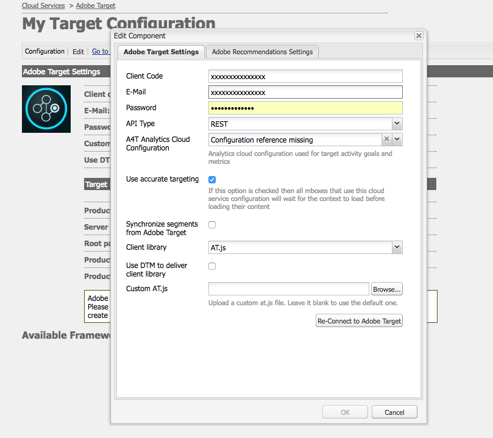

# Konfigurera integrationen med Adobe Target manuellt {#manually-configuring-the-integration-with-adobe-target}

Du kan antingen ändra inställningarna för guiden för deltagande som du gjorde när du använde guiden, eller så kan du integrera manuellt med Adobe Target utan att använda guiden.

## Ändra konfiguration för guiden för anmälan {#modifying-the-opt-in-wizard-configurations}

Guiden [för](/help/sites-administering/opt-in.md) deltagande som [integrerar AEM med Adobe Target](/help/sites-administering/target.md) skapar automatiskt en Target-molnkonfiguration med namnet Provisioned Target Configuration. Guiden skapar också ett Target-ramverk för molnkonfigurationen med namnet Provisioned Target Framework. Du kan ändra egenskaperna för molnkonfigurationen och ramverket om det behövs.

Du kan också konfigurera Adobe Target så att Adobe Target används som rapportkälla när du riktar in innehåll genom att konfigurera A4T Analytics Cloud Configuration.

Om du vill hitta molnkonfigurationen och ramverket går du till **molntjänster** via **Verktyg** > **Distribution** > **Cloud**. ([http://localhost:4502/libs/cq/core/content/tools/cloudservices.html](http://localhost:4502/libs/cq/core/content/tools/cloudservices.html)) Klicka eller tryck på **Visa konfigurationer** nedan.

### Etablerade egenskaper för målkonfiguration {#provisioned-target-configuration-properties}

Följande egenskapsvärden används i den konfiguration av molnet för konfiguration av etablerat mål som Opt-in-guiden skapar:

* **** Klientkod: Som du angett i guiden för anmälan.
* **** E-post: Som du angett i guiden för anmälan.
* **** Lösenord: Som du angett i guiden för anmälan.
* **** API-typ: REST
* **** Synkronisera segment från Adobe Target: Markerad.

* **** Klientbibliotek: mbox.js.
* **** Använd DTM för att leverera klientbibliotek: Inte markerat. Välj det här alternativet om du [använder DTM](/help/sites-administering/dtm.md) eller något annat tagghanteringssystem för att vara värd för filen mbox.js eller AT.js. Adobe rekommenderar att du använder DTM i stället för AEM för att leverera biblioteket.

* **** Custom mbox.js: Ingen har angetts så att standardfilen mbox.js används. Ange en anpassad mbox.js-fil som ska användas efter behov. Visas bara om du har valt mbox.js.
* **** Custom AT.js: Ingen har angetts så att AT.js-standardfilen används. Ange en anpassad AT.js-fil som ska användas efter behov. Visas bara om du har valt AT.js.

>[!NOTE]
>
>I AEM 6.3 kan du välja målbiblioteksfilen, [AT.JS](https://marketing.adobe.com/resources/help/en_US/target/ov2/c_target-atjs-implementation.html), som är ett nytt implementeringsbibliotek för Adobe Target som är utformat för både vanliga webbimplementeringar och ensidiga program.
>
>AT.js har flera förbättringar jämfört med mbox.js-biblioteket:
>
>* Förbättrade sidladdningstider för webbimplementeringar
>* Förbättrad säkerhet
>* Bättre implementeringsalternativ för single-page-applikationer
>* AT.js innehåller komponenterna som ingick i target.js, så det finns inte längre något anrop till target.js
>
>
Mer information finns i [Versionsinformation](https://marketing.adobe.com/resources/help/en_US/target/rn/201604.html) för mål.

### Etablerade egenskaper för målramverk {#provisioned-target-framework-properties}

Det provisionerade målramverk som Opt-in-guiden skapar är konfigurerat att skicka kontextdata från profildatalagret. Lagringens ålder och könsposter skickas som standard till Target. Din lösning kräver förmodligen ytterligare parametrar för att skickas.

Du kan konfigurera ramverket så att ytterligare kontextinformation skickas till Target enligt beskrivningen i [Lägga till ett målramverk](/help/sites-administering/target-configuring.md#adding-a-target-framework).

### Konfigurera A4T Analytics Cloud Configuration {#configuring-a-t-analytics-cloud-configuration}

Du kan konfigurera Adobe Target så att Adobe Analytics används som rapporteringskälla när du riktar in innehåll.

För att göra detta måste du ange vilken A4T-molnkonfiguration som ska ansluta din Adobe Target-molnkonfiguration till:

1. Navigera till **molntjänster** via **AEM-logotypen** > **Verktyg** > **Distribution** > **Molntjänster**.
1. Klicka på **Konfigurera nu** i avsnittet **Adobe Target**.
1. Återanslut till Adobe Target-konfigurationen.
1. Välj ramverket i listrutan **A4T Analytics Cloud Configuration** .

   >[!NOTE]
   >
   >Endast analyskonfigurationer som är aktiverade för A4T är tillgängliga.
   >
   >När du konfigurerar A4T med AEM kan du se att en Configuration-referens saknas. Så här kan du välja analysramverket:
   >
   >1. Navigera till **Verktyg** > **Allmänt** > **CRXDE Lite**.
   1. Navigera till **/libs/cq/analytics/components/testandtarget page/dialog/items/tabs/items/tab1_general/items/a4tAnalyticsConfig**
   1. Ställ in egenskapen **disable** på **false**.
   1. Tryck eller klicka på **Spara alla**.

   

   Click **OK**. När du har innehåll som mål med Adobe Target kan du [välja rapportkälla](/help/sites-authoring/content-targeting-touch.md).

## Manuell integrering med Adobe Target {#manually-integrating-with-adobe-target}

Integrera manuellt med Adobe Target i stället för att använda anmälningsguiden.

>[!NOTE]
Målbiblioteksfilen, [AT.JS](https://marketing.adobe.com/resources/help/en_US/target/ov2/c_target-atjs-implementation.html), är ett nytt implementeringsbibliotek för Adobe Target som är utformat för både vanliga webbimplementeringar och enkelsidiga program. Adobe rekommenderar att du använder AT.js i stället för mbox.js som klientbibliotek.
AT.js har flera förbättringar jämfört med mbox.js-biblioteket:
* Förbättrade sidladdningstider för webbimplementeringar
* Förbättrad säkerhet
* Bättre implementeringsalternativ för single-page-applikationer
* AT.js innehåller komponenterna som ingick i target.js, så det finns inte längre något anrop till target.js

Mer information finns i [Versionsinformation](https://marketing.adobe.com/resources/help/en_US/target/rn/201604.html) för mål.
Du kan välja AT.js eller mbox.js i listrutan **Klientbibliotek** .

### Skapa en målmolnkonfiguration {#creating-a-target-cloud-configuration}

Om du vill att AEM ska kunna interagera med Adobe Target skapar du en Target-molnkonfiguration. Om du vill skapa konfigurationen anger du klientkoden och inloggningsuppgifterna för Adobe Target.

Du skapar molnkonfigurationen för Target endast en gång eftersom du kan associera konfigurationen med flera AEM-kampanjer. Om du har flera Adobe Target-klientkoder skapar du en konfiguration för varje klientkod.

Du kan konfigurera molnkonfigurationen så att segment från Adobe Target synkroniseras. Om du aktiverar synkronisering importeras segment från Target i bakgrunden så snart molnkonfigurationen har sparats.

Använd följande procedur för att skapa en Target-molnkonfiguration i AEM:

1. Navigera till **molntjänster** via **AEM-logotypen** > **Verktyg** > **Distribution** > **Molntjänster**. ([http://localhost:4502/libs/cq/core/content/tools/cloudservices.html](http://localhost:4502/libs/cq/core/content/tools/cloudservices.html))

   Översiktssidan för **Adobe Marketing Cloud** öppnas.

1. Klicka på **Konfigurera nu** i avsnittet **Adobe Target**.
1. I dialogrutan **Skapa konfiguration** :

   1. Ge konfigurationen en **titel**.
   1. Välj mallen **Adobe Target Configuration** .
   1. Klicka på **Skapa**.
   Dialogrutan Redigera öppnas.

   

   >[!NOTE]
   När du konfigurerar A4T med AEM kan du se att en Configuration-referens saknas. Så här kan du välja analysramverket:
   1. Navigera till **Verktyg** > **Allmänt** > **CRXDE Lite**.
   1. Navigera till **/libs/cq/analytics/components/testandtarget page/dialog/items/tabs/items/tab1_general/items/a4tAnalyticsConfig**
   1. Ställ in egenskapen **disable** på **false**.
   1. Tryck eller klicka på **Spara alla**.

1. Ange värden för de här egenskaperna i dialogrutan.

   * **Klientkod**: målkontots klientkod
   * **E-post**: Målkontots e-postadress.
   * **Lösenord**: lösenordet för målkontot.
   * **API-typ**: antingen REST eller XML
   * **A4T Analytics Cloud Configuration**: Välj den Analytics-molnkonfiguration som används för målaktivitetsmål och -mått. Detta behöver ni om ni använder Adobe Analytics som rapportkälla när ni inriktar er på innehåll. Om du inte ser din molnkonfiguration läser du i [Konfigurera A4T Analytics Cloud Configuration](#configuring-a-t-analytics-cloud-configuration).

   * **** Använd exakt målgruppsanpassning: Som standard är den här kryssrutan markerad. Om du väljer det här alternativet väntar molntjänstkonfigurationen på att kontexten ska läsas in innan innehållet läses in. Se följande.
   * **** Synkronisera segment från Adobe Target: Välj det här alternativet om du vill hämta segment som är definierade i Target för att använda dem i AEM. Du måste välja det här alternativet när API-typegenskapen är REST, eftersom infogade segment inte stöds och du alltid måste använda segment från Target. (Observera att AEM-termen för segment motsvarar målgruppen.)
   * **** Klientbibliotek: Välj om du vill ha mbox.js- eller AT.js-klientbiblioteket.
   * **Använd DTM för att leverera klientbibliotek** - Välj det här alternativet om du vill använda AT.js eller mbox.js från DTM eller något annat tagghanteringssystem. Du måste [konfigurera DTM-integreringen](/help/sites-administering/dtm.md) för att kunna använda det här alternativet. Adobe rekommenderar att du använder DTM i stället för AEM för att leverera biblioteket.
   * **Custom mbox.js**: Lämna tomt om du har markerat DTM-rutan eller om du vill använda mbox.js som standard. Du kan även överföra din anpassade mbox.js. Visas bara om du har valt mbox.js.
   * **Custom AT.js**: Lämna tomt om du har markerat DTM-rutan eller om du vill använda AT.js som standard. Du kan även överföra dina anpassade AT.js. Visas bara om du har valt AT.js.
   >[!NOTE]
   Som standard aktiveras korrekt målanpassning när du väljer att gå med i konfigurationsguiden för Adobe Target.
   Korrekt målinriktning innebär att molntjänstkonfigurationen väntar på att kontexten ska läsas in innan innehållet läses in. Därför kan en korrekt målinriktning i fråga om prestanda skapa en fördröjning på några millisekunder innan innehållet läses in.
   Korrekt målinriktning är alltid aktiverat på författarinstansen. På publiceringsinstansen kan du dock välja att inaktivera korrekt målinriktning globalt genom att avmarkera kryssrutan bredvid Exakt målanpassning i molntjänstkonfigurationen (**http://localhost:4502/etc/cloudservices.html**). Du kan även aktivera och inaktivera exakt målinriktning för enskilda komponenter, oavsett vilken inställning du har i molntjänstkonfigurationen.
   Om du ***redan*** har skapat målkomponenter och ändrar den här inställningen påverkar ändringarna inte dessa komponenter. Du måste göra ändringar i den komponenten direkt.

1. Klicka på **Anslut till mål** för att initiera anslutningen med Target. Om anslutningen lyckas visas meddelandet **Anslutningen lyckades** . Klicka på **OK** i meddelandet och **OK** i dialogrutan.

   Om du inte kan ansluta till Target kan du läsa [felsökningsavsnittet](/help/sites-administering/target-configuring.md#troubleshooting-target-connection-problems) .

### Lägga till ett målramverk {#adding-a-target-framework}

När du har konfigurerat molnkonfigurationen för Target lägger du till ett Target-ramverk. Ramverket identifierar de standardparametrar som skickas till Adobe Target från de tillgängliga [klientkontext](/help/sites-administering/client-context.md) - eller [ContextHub](/help/sites-administering/contexthub-config.md) -komponenterna. Target använder parametrarna för att fastställa vilka segment som gäller för den aktuella kontexten.

Du kan skapa flera ramverk för en enda Target-konfiguration. Flera ramverk är användbara när du behöver skicka en annan uppsättning parametrar till Target för olika delar av webbplatsen. Skapa ett ramverk för varje uppsättning parametrar som du måste skicka. Associera varje avsnitt på webbplatsen med rätt ramverk. Observera att en webbsida bara kan använda ett ramverk åt gången.

1. På målkonfigurationssidan klickar du på **+** (plustecknet) bredvid Tillgängliga ramverk.
1. I dialogrutan Skapa ramverk anger du en **titel**, väljer **Adobe Target Framework** och klickar på **Skapa**.

   

   Ramverkssidan öppnas. Sidekick innehåller komponenter som representerar information från [Client Context](/help/sites-administering/client-context.md) eller [ContextHub](/help/sites-administering/contexthub-config.md) som du kan mappa.

   

1. Dra den klientkontextkomponent som representerar de data som du vill använda för mappning till släppmålet. Du kan också dra **komponenten ContextHub Store** till ramverket.

   >[!NOTE]
   Vid mappning skickas parametrar till en mbox via enkla strängar. Du kan inte mappa arrayer från ContextHub.

   Om du till exempel vill använda **Profildata** om webbplatsbesökarna för att styra målkampanjen drar du komponenten **Profildata** till sidan. De profildatavariabler som är tillgängliga för mappning till Target-parametrar visas.

   

1. Markera de variabler som du vill göra synliga för Adobe Target-systemet genom att markera kryssrutan **Dela** i rätt kolumner.

   

   >[!NOTE]
   Synkronisering av parametrar är bara ett sätt - från AEM till Adobe Target.

Ditt ramverk skapas. Om du vill replikera ramverket till publiceringsinstansen använder du alternativet **Aktivera ramverk** från sidosparken.

### Associera aktiviteter med målmolnkonfigurationen {#associating-activities-with-the-target-cloud-configuration}

Koppla dina [AEM-aktiviteter](/help/sites-authoring/activitylib.md) till din Target-molnkonfiguration så att du kan spegla aktiviteterna i [Adobe Target](https://marketing.adobe.com/resources/help/en_US/target/target/c_manage_content.html).

>[!NOTE]
Vilka typer av aktiviteter som är tillgängliga bestäms av följande:
* Om alternativet **xt_only** är aktiverat på Adobe Target-klienten (klientkod) som används på AEM-sidan för att ansluta till Adobe Target, kan du **bara** skapa XT-aktiviteter i AEM.

* Om alternativen **xt_only** **inte** är aktiverade på Adobe Target-klienten (klientkod) kan du skapa **både** XT- och A/B-aktiviteter i AEM.

**** Ytterligare information: Alternativen **xt_only** är en inställning som används för en viss målklient (klientkod) och kan bara ändras direkt i Adobe Target. Du kan inte aktivera eller inaktivera det här alternativet i AEM.

### Koppla målramverket till din webbplats {#associating-the-target-framework-with-your-site}

När du har skapat ett Target-ramverk i AEM kopplar du dina webbsidor till ramverket. Målkomponenterna på sidorna skickar ramverksdefinierade data till Adobe Target för spårning. (Se [Målanpassning](/help/sites-authoring/content-targeting-touch.md)av innehåll.)

När du associerar en sida med ramverket ärver de underordnade sidorna associationen.

1. Gå till den plats du vill konfigurera i **webbplatskonsolen** .
1. Välj [Visa egenskaper med hjälp av snabbåtgärder](/help/sites-authoring/basic-handling.md#quick-actions) eller [markeringsläge](/help/sites-authoring/basic-handling.md)**.**
1. Välj fliken **Molntjänster** .
1. Tryck/klicka på **Redigera**.
1. Tryck/klicka på **Lägg till konfiguration** under **molntjänstkonfigurationer** och välj **Adobe Target**.

   

1. Välj det ramverk du vill använda under **Konfigurationsreferens**.

   >[!NOTE]
   Se till att du väljer det specifika **ramverket** som du skapade och inte den målmolnkonfiguration som det skapades i.

1. Tryck/klicka på **Klar**.
1. Aktivera webbplatsens rotsida för att replikera den till publiceringsservern. (Se [Publicera sidor](/help/sites-authoring/publishing-pages.md).)

   >[!NOTE]
   Om ramverket som du kopplade till sidan inte har aktiverats ännu öppnas en guide där du även kan publicera det.

## Felsöka problem med målanslutning {#troubleshooting-target-connection-problems}

Utför följande åtgärder för att felsöka problem som uppstår vid anslutning till Target:

* Kontrollera att de användaruppgifter du anger är korrekta.
* Kontrollera att AEM-instansen kan ansluta till målservern. Kontrollera till exempel att brandväggsreglerna inte blockerar utgående AEM-anslutningar eller att AEM är konfigurerat att använda nödvändiga proxy.
* Sök efter användbara meddelanden i AEM-felloggen. Filen error.log finns i katalogen **crx-quickstart/logs** där AEM är installerat.
* När du redigerar aktiviteten i Adobe Target pekar URL-adressen mot localhost. Du kan kringgå detta genom att ställa in AEM-externalizer på rätt URL.

