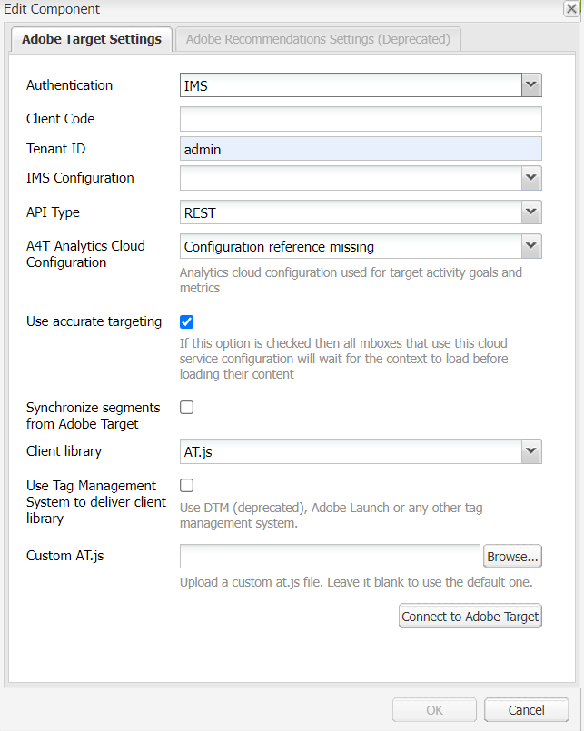

# Konfigurera integreringen med Adobe Target manuellt {#manually-configuring-the-integration-with-adobe-target}

Du kan antingen ändra inställningarna för guiden för deltagande som du gjorde när du använde guiden, eller så kan du integrera manuellt med Adobe Target utan att använda guiden.

## Ändra konfiguration för guiden för anmälan {#modifying-the-opt-in-wizard-configurations}

Guiden [Anmäl dig](/help/sites-administering/opt-in.md) som [integrerar AEM med Adobe Target](/help/sites-administering/target.md) skapar automatiskt en målmolnkonfiguration med namnet Provisioned Target Configuration. Guiden skapar också ett Target-ramverk för molnkonfigurationen med namnet Provisioned Target Framework. Du kan ändra egenskaperna för molnkonfigurationen och ramverket om det behövs.

Du kan också konfigurera Adobe Target att använda Adobe Target som rapportkälla när du riktar in innehåll genom att konfigurera A4T Analytics Cloud-konfigurationen.

Navigera till **Cloud Service** via **Verktyg** > **Distribution** > **Cloud** för att hitta molnkonfigurationen och ramverket. ([http://localhost:4502/libs/cq/core/content/tools/cloudservices.html](http://localhost:4502/libs/cq/core/content/tools/cloudservices.html))
Klicka på **Visa konfigurationer** nedan för Adobe Target.

### Etablerade egenskaper för målkonfiguration {#provisioned-target-configuration-properties}

Följande egenskapsvärden används i den konfiguration av molnet för konfiguration av etablerat mål som Opt-in-guiden skapar:

* **Klientkod:** Anges i guiden för anmälan.
* **E-postadress:** Som du angett i guiden för anmälan.
* **Lösenord:** Som du angett i guiden för att välja.
* **API-typ:** REST
* **Synkronisera segment från Adobe Target:** har valts.

* **Klientbibliotek:** mbox.js.
* **Använd DTM för att leverera klientbiblioteket:** Inte valt. Välj det här alternativet om du [använder DTM](/help/sites-administering/dtm.md) eller något annat tagghanteringssystem för att vara värd för filen mbox.js eller AT.js. Adobe rekommenderar att du använder DTM i stället för AEM för att leverera biblioteket.

* **Anpassad mbox.js:** Ingen har angetts så att standardfilen mbox.js används. Ange vid behov en anpassad mbox.js-fil som du vill använda. Visas bara om du har valt mbox.js.
* **Anpassad AT.js:** Ingen har angetts så att AT.js-standardfilen används. Ange en anpassad AT.js-fil som du vill använda efter behov. Visas bara om du har valt AT.js.

>[!NOTE]
>
>I AEM 6.3 kan du välja målbiblioteksfilen, [AT.JS](https://developer.adobe.com/target/implement/client-side/atjs/atjs-functions/mboxcreate-atjs/), som är ett nytt implementeringsbibliotek för Adobe Target som är utformat för både vanliga webbimplementeringar och enkelsidiga program.
>
>AT.js har flera förbättringar jämfört med mbox.js-biblioteket:
>
>* Förbättrade sidladdningstider för webbimplementeringar
>* Förbättrad säkerhet
>* Bättre implementeringsalternativ för ensidiga program
>* AT.js innehåller komponenterna som ingick i target.js, så det finns inte längre något anrop till target.

<!-- OLD URL WHICH IS 404 https://experienceleague.adobe.com/docs/target/using/implement-target/client-side/mbox-implement/mbox-download.html -->

### Etablerade egenskaper för målramverk {#provisioned-target-framework-properties}

Det provisionerade målramverk som Opt-in-guiden skapar är konfigurerat att skicka kontextdata från profildatalagret. Lagringens ålder och könsposter skickas som standard till Target. Din lösning kräver förmodligen ytterligare parametrar för att skickas.


Du kan konfigurera ramverket så att ytterligare kontextinformation skickas till Target enligt beskrivningen i [Lägga till ett målramverk](/help/sites-administering/target-configuring.md#adding-a-target-framework).

### Konfigurera A4T Analytics Cloud-konfiguration {#configuring-a-t-analytics-cloud-configuration}

Du kan konfigurera Adobe Target att använda Adobe Analytics som rapportkälla när du riktar in dig på innehåll.

>[!NOTE]
>
>Autentisering med användarautentiseringsuppgifter (äldre) fungerar inte med A4T (för både Target och Analytics). Kunder bör därför använda IMS-autentisering i stället för autentisering med användarautentiseringsuppgifter.

För att göra det anger du vilken A4T-molnkonfiguration som ska ansluta din Adobe Target-molnkonfiguration till:

1. Navigera till **Cloud Service** via logotypen **AEM** > **Verktyg** > **Distribution** > **Cloud Service**.
1. Klicka på **Konfigurera nu** i avsnittet **Adobe Target**.
1. Återanslut till din Adobe Target-konfiguration.
1. Markera ramverket i listrutan **A4T Analytics Cloud Configuration**.

   >[!NOTE]
   >
   >Endast analyskonfigurationer som är aktiverade för A4T är tillgängliga.
   >
   >När du konfigurerar A4T med AEM kan du se att en Configuration-referens saknas. Så här kan du välja analysramverket:
   >
   >1. Navigera till **Verktyg** > **Allmänt** > **CRXDE Lite**.
   1. Navigera till dialogrutan [A4T Analytics Configuration ](#a4t-analytics-config-dialog) (se nedan)
   1. Ange egenskapen **disable** till **false**.
   1. Klicka på **Spara alla**.

#### Dialogrutan Konfiguration av A4T Analytics {#a4t-analytics-config-dialog}

```xml
/libs/cq/analytics/components/testandtargetpage/dialog/items/tabs/items/tab1_general/items/a4tAnalyticsConfig
```



Klicka på **OK**. När du har innehåll som mål med Adobe Target kan du [välja rapportkälla](/help/sites-authoring/content-targeting-touch.md).

## Integrera manuellt med Adobe Target {#manually-integrating-with-adobe-target}

Integrera manuellt med Adobe Target i stället för att använda anmälningsguiden.

>[!NOTE]
>
Målbiblioteksfilen, [AT.JS](https://developer.adobe.com/target/implement/client-side/atjs/atjs-functions/mboxcreate-atjs/), är ett nytt implementeringsbibliotek för Adobe Target som är utformat för både vanliga webbimplementeringar och enkelsidiga program. Adobe rekommenderar att du använder AT.js i stället för mbox.js som klientbibliotek.
>
AT.js har flera förbättringar jämfört med mbox.js-biblioteket:
>
* Förbättrade sidladdningstider för webbimplementeringar
* Förbättrad säkerhet
* Bättre implementeringsalternativ för ensidiga program
* AT.js innehåller komponenterna som ingick i target.js, så det finns inte längre något anrop till target.js
>
Du kan välja AT.js eller mbox.js i listrutan **Klientbibliotek** .

<!-- OLD URL from above was 404 https://experienceleague.adobe.com/docs/target/using/implement-target/client-side/mbox-implement/mbox-download.html -->

### Skapa en målmolnkonfiguration {#creating-a-target-cloud-configuration}

Om du vill att AEM ska kunna interagera med Adobe Target skapar du en Target-molnkonfiguration. Om du vill skapa konfigurationen anger du Adobe Target klientkod och inloggningsuppgifter.

Du skapar bara målmolnkonfigurationen en gång eftersom du kan associera konfigurationen med flera AEM kampanjer. Om du har flera Adobe Target-klientkoder skapar du en konfiguration för varje klientkod.

Du kan konfigurera molnkonfigurationen så att segment från Adobe Target synkroniseras. Om du aktiverar synkronisering importeras segment från Target i bakgrunden när molnkonfigurationen sparas.

Använd följande procedur för att skapa en Target-molnkonfiguration i AEM:

1. Navigera till **Cloud Service** via logotypen **AEM** > **Verktyg** > **Cloud Service** > **Äldre Cloud Service**. ([http://localhost:4502/libs/cq/core/content/tools/cloudservices.html](http://localhost:4502/libs/cq/core/content/tools/cloudservices.html))

   Översiktssidan för **Cloud Service** öppnas.

1. Klicka på **Konfigurera nu** i avsnittet **Adobe Target**.
1. I dialogrutan **Skapa konfiguration**:

   1. Ge konfigurationen en **titel**.
   1. Välj mallen **Adobe Target Configuration**.

      

1. Klicka på **Skapa**.

   Dialogrutan Redigera öppnas.

   

   >[!NOTE]
   >
   När du konfigurerar A4T med AEM kan du se att en Configuration-referens saknas. Så här kan du välja analysramverket:
   >
   1. Navigera till **Verktyg** > **Allmänt** > **CRXDE Lite**.
   1. Navigera till **/libs/cq/analytics/components/testandtarget page/dialog/items/tabs/items/tab1_general/items/a4tAnalyticsConfig**
   1. Ange egenskapen **disable** till **false**.
   1. Klicka på **Spara alla**.

1. Ange värden för de här egenskaperna i dialogrutan.

   * **Klientkod**: Målkontots klientkod
   * **E-post**: Målkontots e-postadress.
   * **Lösenord**: Målkontots lösenord.
   * **API-typ**: antingen REST eller XML
   * **A4T Analytics Cloud Configuration**: Välj den Analytics Cloud-konfiguration som används för mål- och mätvärden för aktivitet. Du behöver den här konfigurationen om du använder Adobe Analytics som rapportkälla när du riktar in innehåll. Om du inte kan se din molnkonfiguration läser du i [Konfigurera A4T Analytics Cloud-konfiguration](#configuring-a-t-analytics-cloud-configuration).

   * **Använd korrekt målinriktning:** Som standard är den här kryssrutan markerad. Om du väljer det här alternativet väntar molntjänstkonfigurationen på att kontexten ska läsas in innan innehållet läses in. Se följande.
   * **Synkronisera segment från Adobe Target:** Välj det här alternativet så att du kan hämta segment som har definierats i Target för att använda dem i AEM. Välj det här alternativet när API-typegenskapen är REST, eftersom textbundna segment inte stöds och du måste använda segment från Target. (Den AEM termen segment motsvarar målgruppen.)
   * **Klientbibliotek:** Välj om du vill ha mbox.js- eller AT.js-klientbiblioteket.
   * **Använd DTM för att leverera klientbiblioteket** - Välj det här alternativet om du vill använda AT.js eller mbox.js från DTM eller något annat tagghanteringssystem. Konfigurera [DTM-integreringen](/help/sites-administering/dtm.md) för att använda det här alternativet. Adobe rekommenderar att du använder DTM i stället för AEM för att leverera biblioteket.
   * **Anpassad mbox.js**: Lämna tomt om du har markerat DTM-rutan eller om du vill använda standardmbox.js. Du kan även överföra din anpassade mbox.js. Visas bara om du har valt mbox.js.
   * **Anpassad AT.js**: Lämna tomt om du har markerat rutan DTM eller om du vill använda AT.js som standard. Du kan även överföra dina anpassade AT.js. Visas bara om du har valt AT.js.

   >[!NOTE]
   >
   Som standard aktiveras korrekt målgruppsanpassning när du väljer att använda konfigurationsguiden för Adobe Target.
   >
   Korrekt målinriktning innebär att molntjänstkonfigurationen väntar på att kontexten ska läsas in innan innehållet läses in. Därför kan en korrekt målinriktning, vad gäller prestanda, skapa en fördröjning på några millisekunder innan innehållet läses in.
   >
   Korrekt målinriktning är alltid aktiverat på författarinstansen. På publiceringsinstansen kan du dock avaktivera korrekt målinriktning globalt genom att avmarkera kryssrutan intill Accurate Targeting i molntjänstkonfigurationen (**http://localhost:4502/etc/cloudservices.html**). Du kan även aktivera och inaktivera exakt målinriktning för enskilda komponenter, oavsett vilken inställning du har i molntjänstkonfigurationen.
   >
   Om du redan har ***skapat*** målkomponenter och du ändrar den här inställningen påverkar ändringarna inte dessa komponenter. Ändra dessa komponenter direkt.

1. Klicka på **Anslut till mål** för att initiera anslutningen med mål. Om anslutningen lyckas visas meddelandet **Anslutningen lyckades**. Klicka på **OK** i meddelandet och sedan på **OK** i dialogrutan.

   Om du inte kan ansluta till Target kan du läsa avsnittet [felsökning](/help/sites-administering/target-configuring.md#troubleshooting-target-connection-problems).

### Lägga till ett målramverk {#adding-a-target-framework}

När du har konfigurerat molnkonfigurationen för Target lägger du till ett Target-ramverk. Ramverket identifierar de standardparametrar som skickas till Adobe Target från de tillgängliga komponenterna [Client Context](/help/sites-administering/client-context.md) eller [ContextHub](/help/sites-developing/ch-configuring.md). Target använder parametrarna för att fastställa vilka segment som gäller för den aktuella kontexten.

Du kan skapa flera ramverk för en enda Target-konfiguration. Flera ramverk är användbara när du måste skicka en annan uppsättning parametrar till Target för olika delar av webbplatsen. Skapa ett ramverk för varje uppsättning parametrar som du skickar. Associera varje avsnitt på webbplatsen med rätt ramverk. En webbsida kan bara använda ett ramverk åt gången.

1. Klicka på **+** (plustecken) bredvid Tillgängliga ramverk på målkonfigurationssidan.
1. Ange en **titel** i dialogrutan Skapa ramverk, markera **Adobe Target Framework** och klicka på **Skapa**.

   

   Ramverkssidan öppnas. Sidekick tillhandahåller komponenter som representerar information från [klientkontexten](/help/sites-administering/client-context.md) eller [ContextHub](/help/sites-developing/ch-configuring.md) som du kan mappa.

   

1. Dra den klientkontextkomponent som representerar de data som du vill använda för mappning till släppmålet. Du kan också dra **ContextHub Store** -komponenten till ramverket.

   >[!NOTE]
   >
   Vid mappning skickas parametrar till en mbox via enkla strängar. Du kan inte mappa arrayer från ContextHub.

   Om du till exempel vill använda **profildata** om webbplatsbesökarna för att styra målkampanjen drar du komponenten **profildata** till sidan. De profildatavariabler som är tillgängliga för mappning till Target-parametrar visas.

   

1. Markera de variabler som du vill göra synliga för Adobe Target-systemet genom att markera kryssrutan **Dela** i rätt kolumner.

   

   >[!NOTE]
   >
   Synkronisering av parametrar är bara ett sätt - från AEM till Adobe Target.

Ditt ramverk har skapats. Om du vill replikera ramverket till publiceringsinstansen använder du alternativet **Aktivera ramverk** från sidosparken.

### Associera aktiviteter med målmolnkonfigurationen  {#associating-activities-with-the-target-cloud-configuration}

Associera dina [AEM aktiviteter](/help/sites-authoring/activitylib.md) med din Target-molnkonfiguration så att du kan spegla aktiviteterna i [Adobe Target](https://experienceleague.adobe.com/docs/target/using/experiences/offers/manage-content.html).

>[!NOTE]
>
Vilka typer av aktiviteter som är tillgängliga bestäms av följande:
>
>
* Om alternativet **xt_only** är aktiverat på Adobe Target-klienten (klientkod) som används på AEM för att ansluta till Adobe Target, kan du skapa **endast** XT-aktiviteter i AEM.
>
* Om alternativet **xt_only** **inte** är aktiverat på Adobe Target-klienten (klientkod) kan du skapa **både** XT- och A/B-aktiviteter i AEM.
>
**Ytterligare information:** **xt_only** är en inställning som används för en viss målklient (klientkod) och kan bara ändras direkt i Adobe Target. Du kan inte aktivera eller inaktivera det här alternativet i AEM.

### Koppla målramverket till din webbplats {#associating-the-target-framework-with-your-site}

När du har skapat ett Target-ramverk i AEM kopplar du dina webbsidor till ramverket. Målkomponenterna på sidorna skickar ramverksdefinierade data till Adobe Target för spårning. (Se [Innehållsmål](/help/sites-authoring/content-targeting-touch.md).)

När du associerar en sida med ramverket ärver de underordnade sidorna associationen.

1. Gå till den plats som du vill konfigurera i **Sites**-konsolen.
1. Välj **Visa egenskaper med [snabbåtgärder](/help/sites-authoring/basic-handling.md#quick-actions) eller [markeringsläge](/help/sites-authoring/basic-handling.md).**
1. Markera fliken **Cloud Service**.
1. Klicka på **Redigera**.
1. Klicka på **Lägg till konfiguration** under **Konfigurationer för Cloud Service** och välj **Adobe Target**.

   

1. Välj ramverket som du vill använda under **Konfigurationsreferens**.

   >[!NOTE]
   >
   Se till att du väljer det specifika **Framework** som du skapade och inte den målmolnkonfiguration som det skapades under.

1. Klicka på **Klar**.
1. Aktivera webbplatsens rotsida så att du replikerar den till publiceringsservern. (Se [Använda Publish-sidor](/help/sites-authoring/publishing-pages.md).)

   >[!NOTE]
   >
   Om ramverket som du kopplade till sidan inte har aktiverats ännu öppnas en guide där du även kan publicera det.

## Felsöka problem med målanslutning {#troubleshooting-target-connection-problems}

Om du vill felsöka problem som uppstår vid anslutning till Target kan du utföra följande åtgärder:

* Se till att de inloggningsuppgifter du anger är korrekta.
* Kontrollera att AEM kan ansluta till målservern. Kontrollera till exempel att brandväggsreglerna inte blockerar utgående AEM eller att AEM har konfigurerats att använda nödvändiga proxy.
* Sök efter användbara meddelanden i AEM fellogg. Filen error.log finns i katalogen **crx-quickstart/logs** där AEM är installerad.
* När du redigerar aktiviteten i Adobe Target pekar URL:en mot localhost. Undvik den här förståelsen genom att ange rätt URL för AEM Externalizer.
