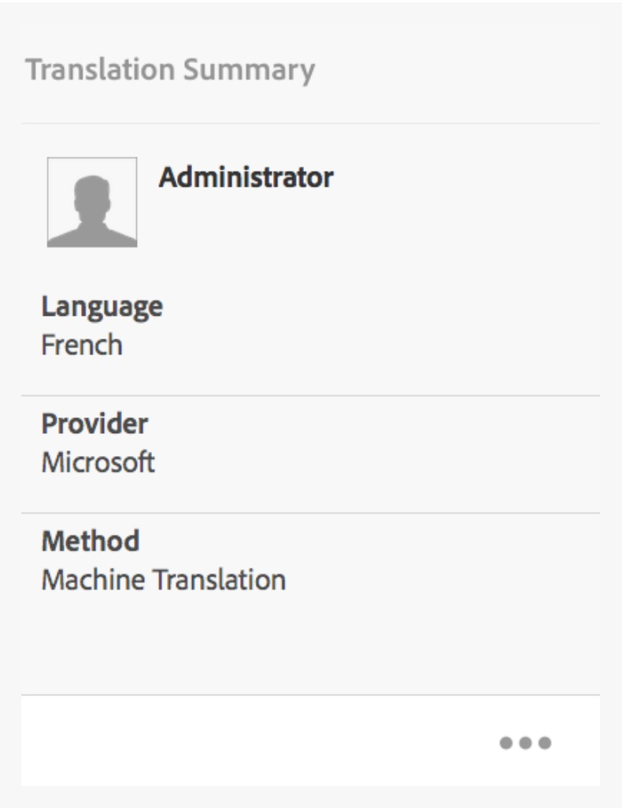
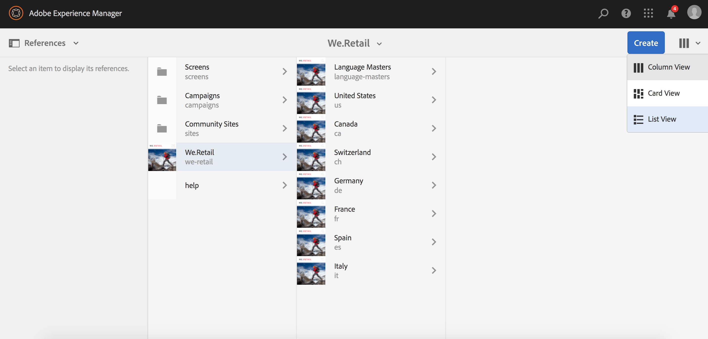

# Översättningsförbättringar{#translation-enhancements}

Den här sidan innehåller stegvisa förbättringar och förbättringar av funktionerna för hantering av AEM-översättning.

## Automatisering av översättningsprojekt {#translation-project-automation}

Alternativ för att förbättra produktiviteten när du arbetar med översättningsprojekt har lagts till, t.ex. automatiskt för att befordra och ta bort starter för översättningar och schemalägga återkommande körningar av ett översättningsprojekt.

1. Klicka eller tryck på ellipsen längst ned i rutan **Översättningssammanfattning** i översättningsprojektet.

   

1. Växla till fliken **Avancerat** . Längst ned kan du välja Befordra översättningsstarter **automatiskt**.

   

1. Du kan också välja om översättningar ska befordras automatiskt och tas bort när du har tagit emot översatt innehåll.

   

1. Om du vill välja den återkommande körningen av ett översättningsprojekt väljer du frekvensen i listrutan under **Upprepa översättning**. Återkommande projektkörning skapar och kör automatiskt översättningsjobb inom angivna intervall.

   

## Flerspråkiga översättningsprojekt {#multilingual-translation-projects}

Det går att konfigurera flera målspråk i ett översättningsprojekt, vilket minskar det totala antalet översättningsprojekt som skapas.

1. Klicka eller tryck på punkterna längst ned i rutan **Översättningssammanfattning** i översättningsprojektet.

   

1. Växla till fliken **Avancerat** . Du kan lägga till flera språk under **Målspråk**.

   

1. Om du initierar översättning via referenslinjen i Sites, lägger du till språk och väljer **Skapa flerspråkigt översättningsprojekt**.

   

1. Översättningsjobb skapas i projektet för alla målspråk. De kan startas antingen en i taget i projektet, eller alla i ett svep genom att projektet körs globalt i Projektadministratör.

   

## Uppdateringar av översättningsminne {#translation-memory-updates}

Manuella redigeringar av översatt innehåll kan synkroniseras tillbaka till översättningshanteringssystemet (TMS) för att utbilda översättningsminnet.

1. När du har uppdaterat textinnehåll på en översatt sida i webbplatskonsolen väljer du **Uppdatera översättningsminne**.

   

1. I en listvy visas en jämförelse sida vid sida av källan och översättningen för alla textkomponenter som redigerades. Välj vilka översättningsuppdateringar som ska synkroniseras med översättningsminnet och välj **Uppdatera minne**.

   

   >[!NOTE]
   >
   >AEM skickar tillbaka de markerade strängarna till översättningshanteringssystemet.

## Språkkopior på flera nivåer {#language-copies-on-multiple-levels}

Språkrötter kan nu grupperas under noder, till exempel efter region, samtidigt som de fortfarande identifieras som rötter i språkkopior.

>[!CAUTION]
>
>Endast en nivå tillåts. Följande tillåter till exempel inte att sidan&quot;es&quot; tolkas som en språkkopia:
>
>* `/content/we-retail/language-masters/en`
>* `/content/we-retail/language-masters/americas/central-america/es`
>
>
Den här `es` språkkopian kommer inte att identifieras eftersom den ligger två nivåer (amerika/central-amerika) bort från `en` noden.

>[!NOTE]
>
>Språkrötter kan ha vilket sidnamn som helst, inte bara språkets ISO-kod. AEM kontrollerar alltid sökvägen och namnet först, men om sidnamnet inte identifierar något språk, kontrollerar AEM egenskapen cq:language för sidan för att se om språket är identifierat.

## Översättningsstatusrapportering {#translation-status-reporting}

En egenskap kan nu väljas i platslistevyn som visar om en sida har översatts, är i översättning eller ännu inte har översatts. Så här visar du den:

1. I Platser växlar du till **listvyn.**

   

1. Klicka på eller tryck på **Visa inställningar**.

   

1. Markera **kryssrutan Översatt** under **Översättning** och tryck/klicka på **Uppdatera**.

   

Du kan nu se en **översatt** kolumn som visar sidornas översättningsstatus.

