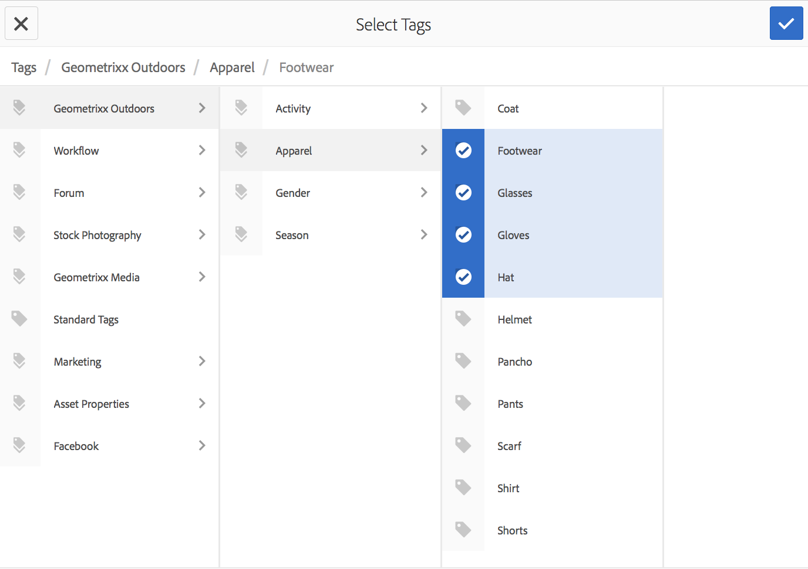
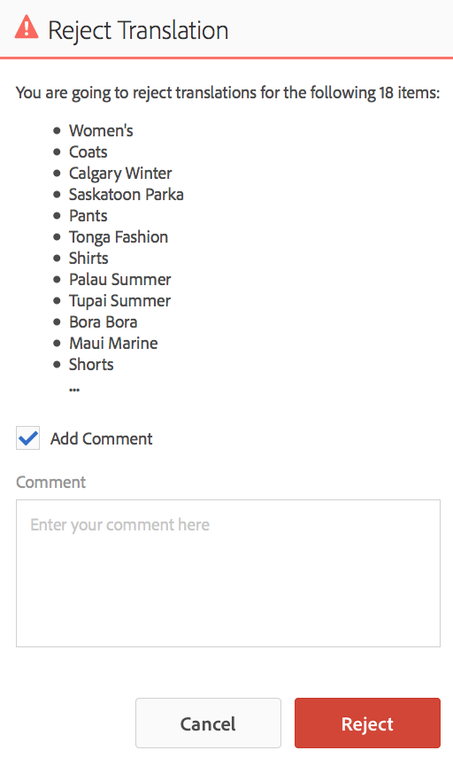

# Hantera översättningsprojekt{#managing-translation-projects}

När du har förberett innehåll för översättning måste du slutföra språkstrukturen genom att skapa saknade språkkopior och skapa översättningsprojekt.

Med översättningsprojekt kan du hantera översättning av AEM. Ett översättningsprojekt är en typ av AEM [projekt](/help/sites-authoring/projects.md) som innehåller resurser som ska översättas till andra språk. De här resurserna är sidorna och resurserna för [språkkopiorna](/help/sites-administering/tc-prep.md) som skapas från språkinställningen.

När resurser läggs till i ett översättningsprojekt skapas ett översättningsjobb för dem. Jobb innehåller kommandon och statusinformation som du använder för att hantera de mänskliga översättnings- och maskinöversättningsarbetsflödena som körs på resurserna.

>[!NOTE]
>
>Ett översättningsprojekt kan innehålla flera översättningsjobb.

Översättningsprojekt är långvariga objekt som definieras av språk och översättningsmetod/leverantör för att anpassas till organisationsstyrning för globalisering. De bör initieras en gång, antingen under den inledande översättningen eller manuellt, och förbli i kraft under innehålls- och översättningsuppdateringen.

Översättningsprojekt och jobb skapas med arbetsflöden för översättningsförberedelser. Dessa arbetsflöden har tre alternativ, både för inledande översättning (Create&amp;Translate) och uppdateringar (Update Translation):

1. [Skapa nytt projekt](#creating-translation-projects-using-the-references-panel)
1. [Lägg till i befintligt projekt](#adding-pages-to-a-translation-project)
1. [Endast innehållsstruktur](#creating-the-structure-of-a-language-copy)

>[!NOTE]
>
>Alternativ 3 är inte relaterat till översättningsjobb/projekt. Du kan kopiera innehåll och strukturella ändringar i språkmallen till (oöversatta) språkkopior. Du kan använda detta för att synkronisera dina språkmallsidor, även utan översättning.

## Utföra initiala översättningar och uppdatera befintliga översättningar {#performing-initial-translations-and-updating-existing-translations}

AEM identifierar om ett översättningsprojekt skapas för den inledande översättningen av innehåll eller för att uppdatera redan översatta språkkopior. När du skapar ett översättningsprojekt för en sida och anger vilka språkkopior du översätter för, identifierar AEM om källsidan redan finns i målspråkskopiorna:

* **Språkkopian innehåller inte sidan:** AEM behandlar den här situationen som den inledande översättningen. Sidan kopieras omedelbart till språkkopian och inkluderas i projektet. När den översatta sidan importeras till AEM kopieras AEM den direkt till språkkopian.
* **Språkkopian innehåller redan sidan:** AEM behandlar den här situationen som en uppdaterad översättning. En startsida skapas och en kopia av sidan läggs till i startprogrammet och ingår i projektet. Med det här programmet kan du granska uppdaterade översättningar innan du implementerar dem i språkkopian:

   * När den översatta sidan importeras till AEM, skrivs sidan över vid start.
   * Den översatta sidan skriver bara över språkkopian när startsidan höjs.

Språkroten /content/geometrixx/fr skapas till exempel för den franska översättningen av huvudspråket /content/geometrixx/en. Det finns inga andra sidor i den franska språkversionen.

* Ett översättningsprojekt skapas för sidan /content/geometrixx/en/products och alla underordnade sidor med den franska språkkopian som mål. Eftersom språkkopian inte innehåller sidan /content/geometrixx/fr/products kopierar AEM omedelbart sidan /content/geometrixx/en/products och alla underordnade sidor till den franska språkkopian. Kopiorna ingår också i översättningsprojektet.
* Ett översättningsprojekt skapas för sidan /content/geometrixx/en och alla underordnade sidor med den franska språkkopian som mål. Eftersom språkkopian innehåller den sida som motsvarar sidan /content/geometrixx/en (språkroten), kopierar AEM sidan /content/geometrixx/en och alla underordnade sidor och lägger till dem i en start. Kopiorna ingår också i översättningsprojektet.

## Skapa översättningsprojekt med referenspanelen {#creating-translation-projects-using-the-references-panel}

Skapa översättningsprojekt så att du kan köra och hantera arbetsflödet för översättning av resurserna i din språkinställning. När du skapar projekt anger du sidan i den språkmall som du översätter och de språkkopior som du utför översättningen för:

* Molnkonfigurationen för översättningsintegreringsramverket som är associerat med den valda sidan avgör många egenskaper för översättningsprojekten, till exempel översättningsarbetsflödet som ska användas.
* Ett projekt skapas för varje vald språkkopia.
* En kopia av den valda sidan och associerade resurser skapas och läggs till i varje projekt. Dessa kopior skickas senare till översättningsleverantören för översättning.

Du kan ange att de underordnade sidorna för den markerade sidan också ska vara markerade. I det här fallet läggs kopior av de underordnade sidorna också till i varje projekt så att de översätts. När underordnade sidor är kopplade till olika konfigurationer för översättningsintegreringsramverk skapar AEM ytterligare projekt.

Du kan även [skapa översättningsprojekt](#creating-a-translation-project-using-the-projects-console) manuellt.

>[!NOTE]
>
>Om du vill skapa ett projekt måste ditt konto vara medlem i gruppen `project-administrators`.

**Initiala översättningar och uppdaterade översättningar**

Referenspanelen anger om du uppdaterar befintliga språkkopior eller skapar den första versionen av språkkopiorna. När det finns en språkkopia för den valda sidan visas fliken Uppdatera språkkopior för att ge åtkomst till projektrelaterade kommandon.

Efter översättning kan du [granska översättningen](#reviewing-and-promoting-updated-content) innan du skriver över språkkopian med den. Om det inte finns någon språkkopia för den valda sidan visas fliken Skapa och översätt för att ge åtkomst till projektrelaterade kommandon.

### Skapa översättningsprojekt för en ny språkkopia {#create-translation-projects-for-a-new-language-copy}

1. Använd webbplatskonsolen för att välja sidan som du lägger till i översättningsprojekt.

   Om du till exempel vill översätta de engelska sidorna på demowebbplatsen väljer du Geometrixx Demo Site > English.

1. Klicka på Referenser i verktygsfältet.

   

1. Välj Språkkopior och sedan de språkkopior som du översätter källsidorna för.
1. Klicka på Skapa och översätt och konfigurera översättningsjobbet:

   * Använd listrutan Språk för att välja en språkkopia som du vill översätta för. Välj ytterligare språk efter behov. Språk som visas i listan motsvarar de [språkrötter som du har skapat](/help/sites-administering/tc-prep.md#creating-a-language-root).
   * Om du vill översätta den markerade sidan och alla underordnade sidor väljer du Markera alla underordnade sidor. Om du bara vill översätta den markerade sidan avmarkerar du alternativet.
   * För Projekt väljer du Skapa nytt översättningsprojekt.
   * Ange ett namn för projektet.

   

1. Klicka på Skapa.

### Skapa översättningsprojekt för en befintlig språkkopia {#create-translation-projects-for-an-existing-language-copy}

1. Använd webbplatskonsolen för att välja sidan som du lägger till i översättningsprojekten.

   Om du till exempel vill översätta de engelska sidorna på demowebbplatsen väljer du Geometrixx Demo Site > English.

1. Klicka på Referenser i verktygsfältet.

   

1. Välj Språkkopior och sedan de språkkopior som du översätter källsidorna för.
1. Klicka på Uppdatera språkkopior och konfigurera översättningsjobbet:

   * Om du vill översätta den markerade sidan och alla underordnade sidor väljer du Markera alla underordnade sidor. Om du bara vill översätta den markerade sidan avmarkerar du alternativet.
   * För Projekt väljer du Skapa nytt översättningsprojekt.
   * Ange ett namn för projektet.

   

1. Klicka på Start.

## Lägga till sidor i ett översättningsprojekt {#adding-pages-to-a-translation-project}

När du har skapat ett översättningsprojekt kan du använda rutan Resurser för att lägga till sidor i projektet. Det är praktiskt att lägga till sidor när du inkluderar sidor från olika grenar i samma projekt.

När du lägger till sidor i ett översättningsprojekt inkluderas sidorna i ett nytt översättningsjobb. Du kan också [lägga till sidor i ett befintligt jobb](#adding-pages-assets-to-a-translation-job).

När du lägger till sidor i ett projekt läggs kopior av sidorna till i en programstart när det behövs för att undvika att befintliga språkkopior skrivs över. (Se [Skapa översättningsprojekt för befintliga språkkopior](#performing-initial-translations-and-updating-existing-translations).)

1. Använd webbplatskonsolen för att välja sidan som du lägger till i översättningsprojektet.

   Om du till exempel vill översätta de engelska sidorna på demowebbplatsen väljer du Geometrixx Demo Site > English.

1. Klicka på Referenser i verktygsfältet.

   

1. Välj Språkkopior och sedan de språkkopior som du översätter källsidorna för.

   

1. Klicka på Uppdatera språkkopior och konfigurera sedan egenskaperna:

   * Om du vill översätta den markerade sidan och alla underordnade sidor väljer du Markera alla underordnade sidor. Om du bara vill översätta den markerade sidan avmarkerar du alternativet.
   * För Projekt väljer du Lägg till i befintligt översättningsprojekt.
   * Välj projektet.

   >[!NOTE]
   >
   >Målspråket som anges i översättningsprojektet ska matcha sökvägen till språkkopian enligt referenspanelen.

   

1. Klicka på Start.

## Lägga till sidor/Assets i ett översättningsjobb {#adding-pages-assets-to-a-translation-job}

Du kan lägga till sidor, resurser, taggar eller i18n-ordlistor i översättningsjobbet för översättningsprojektet. Så här lägger du till sidor eller resurser:

1. Klicka på ellipsen längst ned i översättningsjobbpanelen i översättningsprojektet.

   

1. Klicka på Lägg till och Sidor/Assets.

   

1. Markera det översta objektet i grenen som du vill lägga till och klicka sedan på bockmarkeringsikonen. Du kan markera flera.

   

1. Du kan också välja sökikonen för att enkelt söka efter sidor eller resurser som du vill lägga till i översättningsjobbet.

   

Dina sidor och/eller resurser läggs till i ditt översättningsjobb.

## Lägga till i18n-ordlistor i ett översättningsjobb {#adding-i-n-dictionaries-to-a-translation-job}

Du kan lägga till sidor, resurser, taggar eller i18n-ordlistor i översättningsjobbet för översättningsprojektet. Så här lägger du till en i18n-ordlista:

1. Klicka på ellipsen längst ned i översättningsjobbpanelen i översättningsprojektet.

   

1. Klicka på Lägg till och I18N-ordlista.

   

1. Markera **rotkatalogen** och ordlistan (om det behövs) som du vill lägga till och välj sedan **Lägg till**.

   

1. Välj typ av uppdatering om det efterfrågas:

   

Din ordbok är nu i ditt översättningsjobb.

>[!NOTE]
>
>Mer information om i18n-ordlistor finns i [Hantera ordlistor med hjälp av översättaren](/help/sites-developing/i18n-translator.md).

## Lägga till taggar i ett översättningsjobb {#adding-tags-to-a-translation-job}

Du kan lägga till sidor, resurser, taggar eller i18n-ordlistor i översättningsjobbet för översättningsprojektet. Så här lägger du till taggar:

1. Klicka på ellipsen längst ned i översättningsjobbpanelen i översättningsprojektet.

   

1. Klicka på Lägg till och sedan på Taggar.

   

1. Markera de taggar som du vill lägga till och klicka sedan på bockmarkeringsikonen. Du kan markera flera.

   

Dina taggar läggs nu till i översättningsjobbet.

## Visa information om översättningsprojekt {#seeing-translation-project-details}

Panelen Översättningssammanfattning innehåller egenskaperna som är konfigurerade för ett översättningsprojekt. Utöver den allmänna [projektinformationen](/help/sites-authoring/projects.md#project-info) innehåller översättningsfliken översättningsspecifika egenskaper:

* Source Language: Språket för de sidor som översätts.
* Målspråk: Det språk som sidorna översätts till.
* Översättningsmetod: Översättningsarbetsflödet. Antingen Human Translation eller Machine Translation stöds.
* Översättningsprovider: Den översättningstjänstleverantör som utför översättningen.
* Innehållskategori: (Maskinöversättning) Innehållskategorin som används för översättning.
* Cloud Config: Molnkonfigurationen för översättningstjänstkopplingen som används för projektet.

När ett projekt skapas med hjälp av en sidas resurspanel konfigureras dessa egenskaper automatiskt baserat på källsidans egenskaper.

## Övervaka status för ett översättningsjobb {#monitoring-the-status-of-a-translation-job}

Översättningsjobbpanelen i ett översättningsprojekt anger status för ett översättningsjobb och antalet sidor och resurser i jobbet.

I följande tabell beskrivs varje status som ett jobb eller ett objekt i jobbet kan ha:

| Status | Beskrivning |
|---|---|
| Utkast | Översättningsjobbet har inte startats. Översättningsjobb har statusen UTKAST när de skapas. |
| Skickat | Filer i översättningsjobbet har den här statusen när de har skickats till översättningstjänsten. Den här statusen kan inträffa efter att kommandot Scope eller Start har skickats. |
| Begärt omfång | För personalöversättningsarbetsflödet har filerna i jobbet skickats till översättningsleverantören för omfång. Den här statusen visas efter att kommandot Begär omfång har utfärdats. |
| Omfånget har slutförts | Leverantören har omfattat översättningsjobbet. |
| Bekräftat för översättning | Projektägaren har accepterat omfattningen. Den här statusen anger att översättningsleverantören ska börja översätta filerna i jobbet. |
| Översättning pågår | För ett jobb är översättningen av en eller flera filer i jobbet inte slutförd än. För ett objekt i jobbet översätts objektet. |
| Översatt | För ett jobb är översättningen av alla filer i jobbet slutförd. För ett objekt i jobbet översätts objektet. |
| Klar för granskning | Objektet i jobbet översätts och filen har importerats till AEM. |
| Complete | Projektägaren har angett att översättningskontraktet är slutfört. |
| Avbryt | Anger att översättningsleverantören ska sluta arbeta med ett översättningsjobb. |
| Feluppdatering | Ett fel uppstod när filer överfördes mellan AEM och översättningstjänsten. |
| Okänt läge | Ett okänt fel har inträffat. |

Klicka på ellipsen längst ned på panelen för att se status för varje fil i jobbet.

## Ange förfallodatum för översättningsjobb {#setting-the-due-date-of-translation-jobs}

Ange det datum före vilket översättningsleverantören måste returnera översatta filer. Du kan ange förfallodatum för projektet eller för ett specifikt jobb:

* **Projekt:** Översättningsjobb i projektet ärver förfallodatumet.
* **Jobb:** Förfallodatumet som du anger för jobbet åsidosätter förfallodatumet som har angetts för projektet.

Inställningen av förfallodatumet fungerar bara korrekt när översättningsleverantören som du använder har stöd för den här funktionen.

Följande procedur anger förfallodatumet för ett projekt.

1. Klicka på ellipsen längst ned i rutan Översättningssammanfattning.

   

1. På fliken Grundläggande använder du datumväljaren för egenskapen Förfallodatum för att välja förfallodatumet.

   

1. Klicka på Klar.

Följande procedur anger förfallodatumet för ett översättningsjobb.

1. Klicka på kommandomenyn på panelen Översättningsjobb och sedan på Förfallodatum.

   

1. Klicka på kalenderikonen i dialogrutan, välj datum och tid som ska användas som förfallodatum och klicka sedan på Spara.

   

## Omfång för ett översättningsjobb {#scoping-a-translation-job}

Använd ett översättningsjobb för att få en uppskattning av översättningskostnaden från din översättningstjänstleverantör. När du omsluter ett jobb skickas källfiler till översättningsleverantören som jämför texten med deras pool med lagrade översättningar (översättningsminne). Vanligtvis är omfattningen antalet ord som måste översättas.

Kontakta översättningsleverantören om du vill ha mer information om omfångsresultat.

>[!NOTE]
>
>Omfång är valfritt. Du kan starta ett översättningsjobb utan omfång.

När du omsluter ett översättningsjobb är jobbets status `Scope Requested`. När översättningsleverantören returnerar omfånget ändras statusen till `Scope Completed`. När omfånget är klart kan du använda kommandot Visa omfång för att granska omfångsresultaten.

Omfånget fungerar bara korrekt när den översättningsleverantör som du använder har stöd för den här funktionen.

1. Öppna översättningsprojektet i projektkonsolen.
1. Klicka på kommandomenyn på panelen Översättningsjobb och sedan på Begär omfång.

   

1. När jobbstatusen ändras till SCOPE_COMPLETED klickar du på kommandomenyn på panelen Översättningsjobb och sedan på Visa omfång.

## Starta ett översättningsjobb {#starting-a-translation-job}

Starta ett översättningsjobb för att översätta källsidorna till målspråket. Översättningen utförs enligt egenskapsvärdena för översättningssammanfattningsrutan.

När du har startat översättningsjobbet visas statusen Översättning pågår i rutan Översättningsjobb.

1. Öppna översättningsprojektet i projektkonsolen.
1. Klicka på kommandomenyn på panelen Översättningsjobb och sedan på Start.

   

1. Klicka på Stäng i åtgärdsdialogrutan som bekräftar översättningens början.

## Avbryta ett översättningsjobb {#canceling-a-translation-job}

Avbryt ett översättningsjobb om du vill stoppa översättningsprocessen och förhindra att översättningsleverantören utför fler översättningar. Du kan avbryta ett jobb när jobbet har statusen `Committed For Translation` eller `Translation In Progress`.

1. Öppna översättningsprojektet i projektkonsolen.
1. Klicka på kommandomenyn på panelen Översättningsjobb och klicka sedan på Avbryt.
1. Klicka på OK i åtgärdsdialogrutan som bekräftar att översättningen har avbrutits.

## Acceptera/avvisa arbetsflöde {#accept-reject-workflow}

När innehållet kommer tillbaka efter översättning och är i läget Klart för granskning kan du gå in i översättningsjobbet och acceptera/avvisa innehåll.

Om du väljer Avvisa översättning kan du lägga till en kommentar.

Om du avvisar innehåll skickas det tillbaka till översättningsleverantören där han kan se kommentaren.

## Granska och marknadsföra uppdaterat innehåll {#reviewing-and-promoting-updated-content}

När innehåll översätts för en befintlig språkkopia granskar du översättningarna, gör ändringar om det behövs och höjer sedan översättningarna så att de flyttas till språkkopian. Du kan granska översatta filer när översättningsjobbet visar statusen Klart för granskning.

1. Markera sidan i mallsidan för språk, klicka på Referenser och sedan på Språkkopior.
1. Klicka på den språkkopia som ska granskas.

   

1. Klicka på Starta för att visa startrelaterade kommandon.

   

1. Klicka på Öppna sida för att öppna startkopian av sidan för att granska och redigera innehållet.
1. När du har granskat innehållet och gjort de ändringar du behöver kan du befordra startkopian genom att klicka på Befordra.
1. På sidan Befordra start anger du vilka sidor som ska befordras och klickar sedan på Befordra.

## Jämför språkkopior {#comparing-language-copies}

Så här jämför du språkkopior med språkinställningen:

1. Gå till den språkkopia som du vill jämföra i konsolen **Platser**.
1. Öppna panelen **[Referenser](/help/sites-authoring/basic-handling.md#references)**.
1. Under rubriken **Kopior** väljer du **Språkkopior.**
1. Välj en viss språkkopia och klicka sedan på **Jämför med mallsida &#x200B;** eller **Jämför med föregående &#x200B;** om tillämpligt.

   

1. De två sidorna (start och källa) öppnas sida vid sida.

   Mer information om hur du använder den här funktionen finns i [Sidskillnad](/help/sites-authoring/page-diff.md).

## Slutföra och arkivera översättningsjobb {#completing-and-archiving-translation-jobs}

Slutför ett översättningsjobb när du har granskat de översatta filerna från leverantören. För mänskliga översättningsarbetsflöden anger en översättning för leverantören att översättningsavtalet har uppfyllts och att de bör spara översättningen i sitt översättningsminne.

När du har slutfört jobbet får jobbet statusen Fullständigt.

Arkivera ett översättningsjobb när det är klart och du behöver inte längre se jobbstatusinformation. När du arkiverar jobbet tas översättningsjobbpanelen bort från projektet.

## Skapa strukturen för en språkkopia {#creating-the-structure-of-a-language-copy}

Fyll i din språkkopia så att den innehåller innehåll från huvudspråket som du översätter. Innan du fyller i din språkkopia måste du ha [skapat språkroten](/help/sites-administering/tc-prep.md#creating-a-language-root) för språkkopian.

1. Använd webbplatskonsolen för att välja språkroten för huvudspråket som du använder som källa. Om du till exempel vill översätta de engelska sidorna på demowebbplatsen väljer du Innehåll > Demonsplats för Geometrixx > Engelska.
1. Klicka på Referenser i verktygsfältet.

   

1. Välj Språkkopior och välj sedan de språkkopior som du vill fylla i.

   

1. Klicka på Uppdatera språkkopior för att visa översättningsverktygen och konfigurera egenskaperna:

   * Markera alternativet Markera alla undersidor.
   * För Projekt väljer du Skapa endast struktur.

   

1. Klicka på Start.

## Flytta eller byta namn på en Source-sida {#move-source}

Om en redan översatt källsida måste [byta namn eller flyttas](/help/sites-authoring/managing-pages.md#moving-or-renaming-a-page), skapas en språkkopia baserad på det nya sidnamnet/den nya platsen när sidan översätts igen. Den gamla språkkopian som baseras på föregående namn/plats finns fortfarande kvar. Du kan förhindra detta genom att använda funktionen för att kopiera uppdateringsspråk efter flytten:

1. Flytta en sida som har en språkkopia.
1. Välj språkkopieringsroten.
1. Öppna panelen **Referenser**.
1. Välj **Språkkopior**.
1. Välj de målspråk som du vill uppdatera.
1. Välj **Uppdatera språkkopior**.

   

1. Klicka på **Uppdatera**. En [Launch](/help/sites-authoring/launches-promoting.md) kommer att skapas.
1. Navigera till den önskade språkroten och markera den.
1. Välj **Startar** med hjälp av panelen **Referenser**.

   

1. Klicka på den Launch som skapades och klicka på **Promote launch**.

Nu har källsidan flyttats och tillhörande språkkopia.

## Skapa ett översättningsprojekt med projektkonsolen {#creating-a-translation-project-using-the-projects-console}

Du kan skapa ett översättningsprojekt manuellt om du föredrar att använda projektkonsolen.

>[!NOTE]
>
>Om du vill skapa ett projekt måste ditt konto vara medlem i gruppen `projects-administrators`.

När du skapar ett översättningsprojekt manuellt måste du ange värden för följande översättningsrelaterade egenskaper utöver de [grundläggande egenskaperna](/help/sites-authoring/touch-ui-managing-projects.md#creating-a-project):

* **Namn:** Projektnamn.
* **Source-språk:** Källinnehållets språk.
* **Målspråk:** Det språk som innehållet översätts till.
* **Översättningsmetod:** Välj mänsklig översättning för att ange att översättningen ska utföras manuellt.

1. Klicka på Skapa i verktygsfältet i projektkonsolen.
1. Välj mallen Översättningsprojekt och klicka sedan på Nästa.
1. Ange värden för de grundläggande egenskaperna.
1. Klicka på Avancerat och ange värden för översättningsrelaterade egenskaper.
1. Klicka på Skapa. Klicka på Klar i bekräftelserutan för att återgå till projektkonsolen eller klicka på Öppna projekt för att öppna och börja hantera projektet.

## Exportera ett översättningsjobb {#exporting-a-translation-job}

Du kan hämta innehållet i ett översättningsjobb, till exempel för att skicka till en översättningsleverantör som inte är integrerad med AEM via en koppling, eller för att granska innehållet.

1. Klicka på Exportera i listrutan i rutan Översättningsjobb.
1. Klicka på Hämta exporterad fil i dialogrutan Exportera och använd vid behov webbläsardialogrutan för att spara filen.
1. Klicka på Stäng i dialogrutan Exportera.

## Importera ett översättningsjobb {#importing-a-translation-job}

Du kan importera översatt innehåll till AEM när översättningsleverantören skickar det till dig eftersom det inte är integrerat med AEM via en koppling.

1. Klicka på Importera i listrutan i rutan Översättningsjobb.
1. Använd webbläsarens dialogruta för att markera filen som ska importeras.
1. Klicka på Stäng i dialogrutan Importera.
