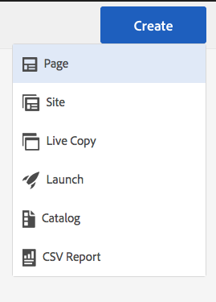

# Förbereder innehåll för översättning{#preparing-content-for-translation}

Flerspråkiga webbplatser har i allmänhet en viss mängd innehåll på flera språk. Webbplatsen är skriven på ett språk och sedan översatt till andra språk. Vanligtvis består flerspråkiga webbplatser av sidgrenar, där varje gren innehåller webbplatsens sidor på ett annat språk.

Exemplet Geometrixx Demo Site innehåller flera språkgrenar och har följande struktur:

```xml
/content
    |- geometrixx
             |- en
             |- fr
             |- de
             |- es
             |- it
             |- ja
             |- zh
```

Varje språkgren på en webbplats kallas för en språkkopia. Rotsidan för en språkkopia, som kallas språkroten, identifierar språket för innehållet i språkkopian. är t.ex. `/content/geometrixx/fr` språkroten för den franska språkkopian. För språkkopior måste en [korrekt konfigurerad språkrot](/help/sites-administering/tc-prep.md#creating-a-language-root) användas, så att rätt språk används när översättningar av en källplats utförs.

Den språkkopia som du ursprungligen skapade webbplatsinnehållet för är språkinställningen. Språkmallsidan är källan som översätts till andra språk.

Gör så här för att förbereda webbplatsen för översättning:

1. Skapa språkroten för din språkinställning. Exempelvis är språkroten för demowebbplatsen English Geometrixx /content/geometrixx/en. Kontrollera att språkroten är korrekt konfigurerad enligt informationen i [Skapa en språkrot](/help/sites-administering/tc-prep.md#creating-a-language-root).
1. Skriv innehållet i din språkmaster.
1. Skapa språkroten för varje språkkopia för webbplatsen. Den franska språkkopian av exempelwebbplatsen Geometrixx är till exempel /content/geometrixx/fr.

När du har förberett innehållet för översättning kan du automatiskt skapa saknade sidor i dina språkkopior och tillhörande översättningsprojekt. (Se [Skapa ett översättningsprojekt](/help/sites-administering/tc-manage.md).) En översikt över innehållsöversättningsprocessen i AEM finns i [Översätta innehåll för flerspråkiga webbplatser](/help/sites-administering/translation.md).

## Skapa en språkrot {#creating-a-language-root}

Skapa en språkrot som rotsida för en språkkopia som identifierar språket i innehållet. När du har skapat språkroten kan du skapa översättningsprojekt som innehåller språkkopian.

Om du vill skapa språkroten skapar du en sida och använder en ISO-språkkod som värde för egenskapen Namn. Språkkoden måste ha något av följande format:

* `<language-code>`Den språkkod som stöds är en kod med två bokstäver som definieras av ISO-639-1, till exempel `en`.

* `<language-code>_<country-code>` eller `<language-code>-<country-code>`Den landskod som stöds är en gemen- eller versal tvåbokstavskod enligt definitionen i ISO 3166, till exempel `en_US`, `en_us`, `en_GB`, `en-gb`.

Du kan använda båda formaten enligt den struktur som du har valt för den globala platsen.  Rotsidan för den franska språkkopian av Geometrixx-webbplatsen har `fr` egenskapen Name. Observera att egenskapen Namn används som namn på sidnoden i databasen och därför bestämmer sökvägen till sidan. (http://localhost:4502/content/geometrixx/fr.html)

I följande procedur används det pekoptimerade användargränssnittet för att skapa en språkkopia av en webbplats. Instruktioner om hur du använder det klassiska användargränssnittet finns i [Skapa en språkrot med det klassiska användargränssnittet](/help/sites-administering/tc-lroot-classic.md).

1. Navigera till Webbplatser.
1. Klicka på eller tryck på den webbplats där du vill skapa en språkkopia.

   Om du till exempel vill skapa en språkkopia av webbplatsen Geometrixx Outdoor klickar eller trycker du på Geometrixx Outdoor Site.

1. Klicka eller tryck på Skapa och sedan på eller på Skapa sida.

   

1. Välj sidmallen och klicka eller tryck sedan på Nästa.
1. I fältet Namn skriver du landskoden i formatet `<language-code>` eller `<language-code>_<country-code>`till exempel `en`, `en_US`, `en_us`, `en_GB`, `en_gb`. Skriv en rubrik för sidan.

   

1. Klicka eller tryck på Skapa. I bekräftelsedialogrutan klickar eller trycker du på **Klar** för att gå tillbaka till webbplatskonsolen eller på **Öppna** för att öppna språkkopian.

## Se status för språkrötter {#seeing-the-status-of-language-roots}

Det pekoptimerade användargränssnittet innehåller en referenspanel som visar en lista med språkrötter som har skapats.


I följande procedur används det pekoptimerade användargränssnittet för att öppna referenspanelen för en sida.

1. På webbplatskonsolen markerar du en sida på webbplatsen och klickar eller trycker sedan på **Referenser**.

   

1. Klicka eller tryck på **Språkkopior** på referenspanelen. På panelen Språkkopior visas språkkopiorna för webbplatsen.

