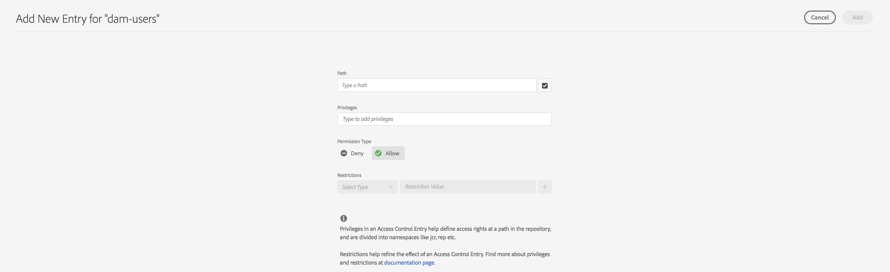
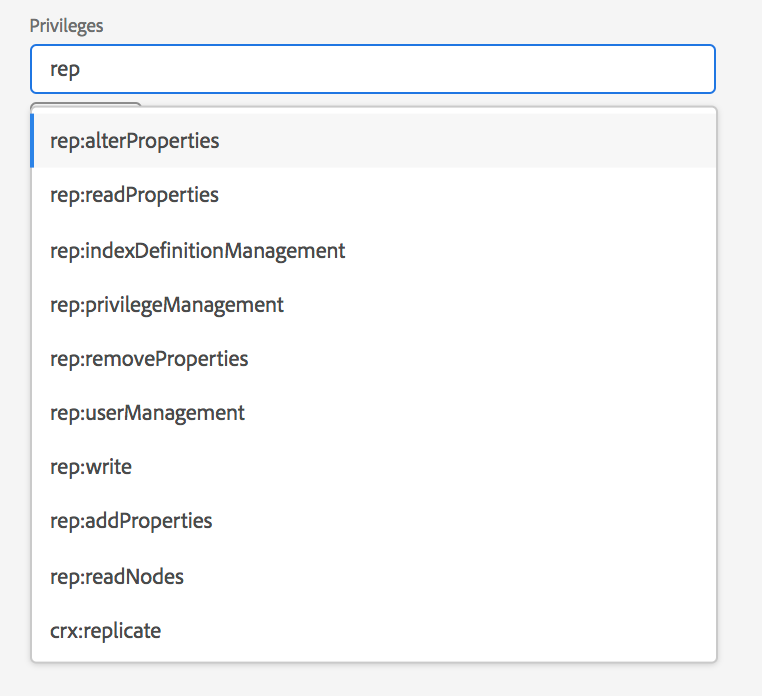
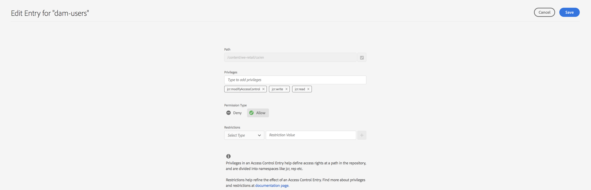
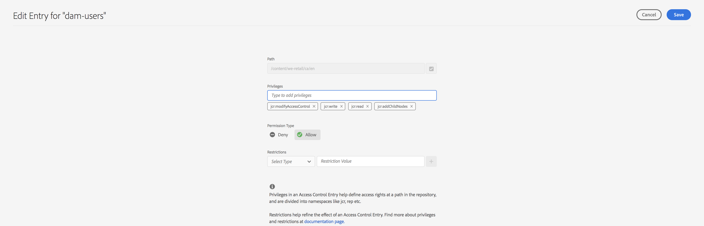

# Huvudvy för behörighetshantering{#principal-view-for-permissions-management}

## Översikt {#overview}

I AEM 6.5 introduceras behörighetshantering för användare och grupper. Huvudfunktionaliteten är densamma som det klassiska användargränssnittet, men är mer användarvänlig och effektiv.

## Användning {#how-to-use}

### Åtkomst till användargränssnittet {#accessing-the-ui}

Den nya UI-baserade behörighetshanteringen nås via behörighetskortet under Säkerhet enligt nedan:

Den nya vyn gör det enklare att se på hela uppsättningen behörigheter och begränsningar för ett givet huvudobjekt på alla sökvägar där behörigheter uttryckligen har beviljats. Detta eliminerar behovet av att gå till

CRXDE för att hantera avancerade behörigheter och begränsningar. Den har konsoliderats i samma vy. Vyn är som standard grupperad &quot;alla&quot;.

Det finns ett filter som gör att användaren kan välja vilken typ av huvudobjekt som ska undersökas **Användare**, **Grupper**, eller **Alla** och söka efter huvudnamn **.**

### Visa behörigheter för ett huvudkonto {#viewing-permissions-for-a-principal}

Med ramen till vänster kan användare rulla nedåt för att hitta ett huvudnamn eller söka efter en grupp eller en användare baserat på det valda filtret, vilket visas nedan:

Om du klickar på namnet visas de tilldelade behörigheterna till höger. I behörighetsrutan visas listan med åtkomstkontrollposter på specifika sökvägar tillsammans med konfigurerade begränsningar.

### Lägga till ny åtkomstkontrollpost för ett huvudkonto {#adding-new-access-control-entry-for-a-principal}

Du kan lägga till nya behörigheter genom att lägga till en ny åtkomstkontrollpost genom att klicka på knappen Lägg till ACE.

Då öppnas fönstret som visas nedan. Nästa steg är att välja en sökväg där behörigheten måste konfigureras.

Här väljer vi en sökväg där vi vill konfigurera behörighet för **dam-users**:

När sökvägen har valts går arbetsflödet tillbaka till den här skärmen där användaren kan välja en eller flera av de tillgängliga namnutrymmena (som `jcr`, `rep` eller `crx`) enligt nedan.

Du kan lägga till behörigheter genom att söka i textfältet och sedan välja från listan.

>[!NOTE]
>
>En fullständig lista över privilegier och beskrivningar finns på [den här sidan](/help/sites-administering/user-group-ac-admin.md#access-right-management).

 

När listan över behörigheter har valts kan användaren välja behörighetstyp: Neka eller Tillåt enligt nedan.

 

### Använda begränsningar {#using-restrictions}

Förutom en lista över behörigheter och behörighetstypen för en viss sökväg kan du på den här skärmen även lägga till begränsningar för den detaljerade åtkomstkontrollen enligt nedan:

>[!NOTE]
>
>Mer information om vad varje begränsning innebär finns i [The Jackrabbit Oak Documentation](https://jackrabbit.apache.org/oak/docs/security/authorization/restriction.html).

Du kan lägga till begränsningar enligt nedan genom att välja begränsningstyp, ange värdet och trycka på **+** ikon.

 

Den nya åtkomstkontrollistan visas i åtkomstkontrollistan enligt nedan. Observera att `jcr:write` är ett aggregerat privilegium som inkluderar `jcr:removeNode` som lades till ovan, men inte visas nedan som det omfattas av `jcr:write`.

### Redigera ACE {#editing-aces}

Du kan redigera åtkomstkontrollposter genom att markera ett huvudnamn och välja det ACE som du vill redigera.

Här kan du till exempel redigera posten nedan för **dam-users** genom att klicka på pennikonen till höger:

Redigeringsskärmen visas med konfigurerade ACE-adresser förmarkerade. Du kan ta bort dem genom att klicka på kryssikonen bredvid dem eller genom att lägga till nya behörigheter för den angivna sökvägen enligt nedan.

Här lägger vi till `addChildNodes` privilegium för **dam-users** på den angivna sökvägen.

Du kan spara ändringarna genom att klicka på **Spara** överst till höger så återspeglas ändringarna i de nya behörigheterna för **dam-users **enligt nedan:

### Ta bort ACE {#deleting-aces}

Åtkomstkontrollposter kan tas bort om du vill ta bort alla behörigheter som tilldelats ett huvudkonto på en viss sökväg. X-ikonen bredvid ACE kan användas för att ta bort den så som visas nedan:

 

### Klassiska kombinationer av användargränssnittsbehörigheter {#classic-ui-privilege-combinations}

Observera att det nya behörighetsgränssnittet uttryckligen använder den grundläggande uppsättningen behörigheter i stället för fördefinierade kombinationer som inte helt återspeglar de exakta underliggande behörigheter som beviljats.

Det orsakade förvirring om exakt vad som konfigureras. I följande tabell visas mappningen mellan privilegiakombinationerna från det klassiska användargränssnittet och de behörigheter som de består av:

<table>
 <tbody>
  <tr>
   <th>Klassiska kombinationer av användargränssnittsbehörigheter</th>
   <th>Behörighetsgränssnittsbehörighet</th>
  </tr>
  <tr>
   <td>Läs</td>
   <td><code>jcr:read</code></td>
  </tr>
  <tr>
   <td>Ändra</td>
   <td>
<code>jcr:modifyProperties</code>
 
<code>jcr:lockManagement</code>
 
<code>jcr:versionManagement</code>
 </td>
  </tr>
  <tr>
   <td>Skapa</td>
   <td>
<code>jcr:addChildNodes</code>
 
<code>jcr:nodeTypeManagement</code>
 </td>
  </tr>
  <tr>
   <td>Ta bort</td>
   <td>
<code>jcr:removeNode</code>
 
<code>jcr:removeChildNodes</code>
 </td>
  </tr>
  <tr>
   <td>Läs ACL</td>
   <td><code>jcr:readAccessControl</code></td>
  </tr>
  <tr>
   <td>Redigera ACL</td>
   <td><code>jcr:modifyAccessControl</code></td>
  </tr>
  <tr>
   <td>Replikera</td>
   <td><code>crx:replicate</code></td>
  </tr>
 </tbody>
</table>
