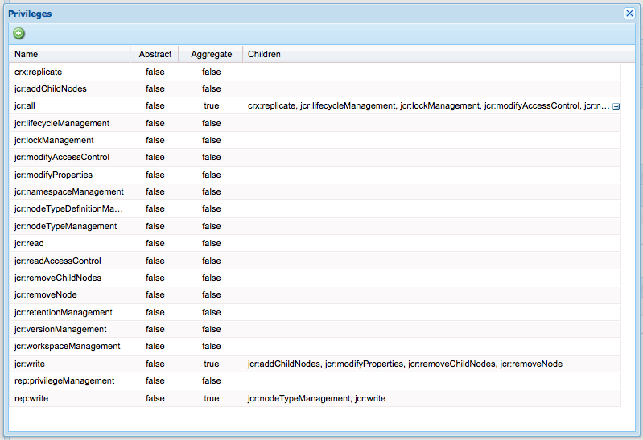
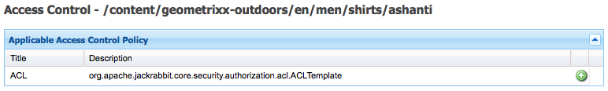

# Behörighetsadministration för användare, grupp och åtkomst{#user-group-and-access-rights-administration}

Att ge åtkomst till en CRX-databas omfattar flera ämnen:

* [Åtkomsträttigheter](#how-access-rights-are-evaluated) - begrepp för hur de definieras och utvärderas
* [Användaradministration](#user-administration) - hantera enskilda konton som används för åtkomst
* [Gruppadministration](#group-administration) - förenkla användarhantering genom att skapa grupper
* [Behörighetshantering](#access-right-management) - definiera principer som styr hur dessa användare och grupper kan komma åt resurser

De grundläggande elementen är:

**Med användarkonton** kan CRX autentisera åtkomsten genom att identifiera och verifiera en användare (av en person eller ett annat program) enligt uppgifterna på användarkontot.

I CRX är varje användarkonto en nod på arbetsytan. Ett CRX-användarkonto har följande egenskaper:

* Den representerar en användare av CRX.
* Den innehåller ett användarnamn och lösenord.
* Gäller den arbetsytan.
* Den kan inte ha underanvändare. För hierarkiska åtkomsträttigheter bör du använda grupper.

* Du kan ange åtkomsträttigheter för användarkontot.

   För att förenkla hanteringen rekommenderar vi dock att du (i de flesta fall) tilldelar åtkomsträttigheter till gruppkonton. Att tilldela åtkomsträttigheter för varje enskild användare blir snabbt mycket svårt att hantera (undantagen är vissa systemanvändare när det bara finns en eller två instanser).

**Gruppkonton** Gruppkonton är samlingar av användare och/eller andra grupper. De används för att förenkla hanteringen eftersom en ändring av de åtkomsträttigheter som tilldelats en grupp automatiskt tillämpas på alla användare i gruppen. En användare behöver inte tillhöra någon grupp, men tillhör ofta flera.

I CRX har en grupp följande egenskaper:

* Den representerar en grupp användare med gemensamma åtkomsträttigheter. Till exempel författare eller utvecklare.
* Gäller den arbetsytan.
* Den kan ha medlemmar. dessa kan vara enskilda användare eller andra grupper.
* Hierarkisk gruppering kan uppnås med medlemsrelationer. Du kan inte placera en grupp direkt under en annan grupp i databasen.
* Du kan definiera åtkomsträttigheter för alla gruppmedlemmar.

**Rättigheterna** CRX använder sig av åtkomsträttigheter för att styra åtkomsten till specifika delar av databasen.

Detta görs genom att tilldela behörigheter för att antingen tillåta eller neka åtkomst till en resurs (nod eller sökväg) i databasen. Eftersom olika behörigheter kan tilldelas måste de utvärderas för att avgöra vilken kombination som är tillämplig för den aktuella begäran.

Med CRX kan du konfigurera åtkomsträttigheter för både användar- och gruppkonton. Samma grundläggande utvärderingsprinciper tillämpas sedan på båda.

## Hur åtkomsträttigheter utvärderas {#how-access-rights-are-evaluated}

>[!NOTE]
>
>CRX implementerar [åtkomstkontroll enligt definitionen i JSR-283](https://docs.adobe.com/content/docs/en/spec/jcr/2.0/16_Access_Control_Management.html).
>
>En standardinstallation av en CRX-databas är konfigurerad att använda resursbaserade åtkomstkontrollistor. Detta är en möjlig implementering av åtkomstkontrollen JSR-283 och en av implementeringarna i Jackrabbit.

### Ämnen och huvudkonton {#subjects-and-principals}

CRX använder två viktiga begrepp vid utvärdering av åtkomsträttigheter:

* En **huvudman** är en enhet som har nyttjanderätt. Huvudposter är:

   * Ett användarkonto
   * Ett gruppkonto

      Om ett användarkonto tillhör en eller flera grupper är det även associerat med vart och ett av dessa gruppobjekt.

* Ett **ämne** används för att representera källan för en begäran.

   Den används för att konsolidera de åtkomsträttigheter som är tillämpliga för den begäran. Dessa hämtas från:

   * Användarens huvudnamn

      De rättigheter som du tilldelar direkt till användarkontot.

   * Alla gruppobjekt som är associerade med den användaren

      Alla rättigheter som tilldelats någon av grupperna som användaren tillhör.
   Resultatet används sedan för att tillåta eller neka åtkomst till den begärda resursen.

#### Kompilera listan över åtkomsträttigheter för ett ämne {#compiling-the-list-of-access-rights-for-a-subject}

I CRX är motivet beroende av:

* användarens huvudnamn
* alla gruppobjekt som är associerade med den användaren

Den förteckning över åtkomsträttigheter som är tillämpliga för föremålet är uppbyggd på följande:

* de rättigheter som du tilldelar direkt till användarkontot
* plus alla rättigheter som tilldelats någon av grupperna som användaren tillhör


>[!NOTE]
>
>* CRX tar ingen hänsyn till användarhierarkin när listan kompileras.
>* CRX använder bara en grupphierarki när du tar med en grupp som medlem i en annan grupp. Det finns inget automatiskt arv av gruppbehörigheter.
>* Den ordning som du anger grupperna i påverkar inte åtkomsträttigheterna.
>


### Löser begäran och åtkomsträttigheter {#resolving-request-and-access-rights}

När CRX hanterar begäran jämför den åtkomstbegäran från ämnet med åtkomstkontrollistan på databasnoden:

Så om Linda begär att få uppdatera `/features` noden i följande databasstruktur:


### Prioritetsordning {#order-of-precedence}

Åtkomsträttigheterna i CRX utvärderas enligt följande:

* Användarprinciper har alltid företräde framför grupprincipobjekt oavsett:

   * deras ordning i åtkomstkontrollistan
   * sin position i nodhierarkin

* För ett givet huvudobjekt finns (högst) 1 neka och 1 tillåt post på en viss nod. Implementeringen rensar alltid bort redundanta poster och ser till att samma privilegium inte finns med i både Tillåt- och Neka-posterna.

>[!NOTE]
>
>Den här utvärderingsprocessen passar för den resursbaserade åtkomstkontrollen i en standard-CRX-installation.

Ta två exempel där användaren `aUser` är medlem i gruppen `aGroup`:

```xml
   + parentNode
     + acl
       + ace: aUser - deny - write
     + childNode
       + acl
         + ace: aGroup - allow - write
       + grandChildNode
```

I ovanstående fall:

* `aUser` saknar skrivbehörighet `grandChildNode`.

```xml
   + parentNode
     + acl
       + ace: aUser - deny - write
     + childNode
       + acl
         + ace: aGroup - allow - write
         + ace: aUser - deny - write
       + grandChildNode
```

I detta fall:

* `aUser` saknar skrivbehörighet `grandChildNode`.
* Den andra ACE för `aUser` är redundant.

Åtkomsträttigheter från flera gruppobjekt utvärderas baserat på deras ordning, både i hierarkin och i en enda åtkomstkontrollista.

### Bästa praxis {#best-practices}

I följande tabell visas några rekommendationer och metodtips:

<table>
 <tbody>
  <tr>
   <td>Rekommendation...</td>
   <td>Orsak...</td>
  </tr>
  <tr>
   <td><i>Använd grupper</i></td>
   <td><p>Undvik att tilldela åtkomsträttigheter per användare. Det finns flera orsaker till detta:</p>
    <ul>
     <li>Du har många fler användare än grupper, så grupper förenklar strukturen.</li>
     <li>Grupper ger en översikt över alla konton.</li>
     <li>Arv är enklare med grupper.</li>
     <li>Användarna kommer och går. Grupper är långsiktiga.</li>
    </ul> </td>
  </tr>
  <tr>
   <td><i>Var positiv</i></td>
   <td><p>Använd alltid Allow-satser för att ange åtkomsträttigheter för grupprincipobjektet (när det är möjligt). Undvik att använda programsatsen Neka.</p> <p>Gruppobjekt utvärderas i ordning, både i hierarkin och i ordning i en enda åtkomstkontrollista.</p> </td>
  </tr>
  <tr>
   <td><i>Behåll det enkelt</i></td>
   <td><p>Att investera lite tid och fundera när man konfigurerar en ny installation kommer att återbetalas väl.</p> <p>Att använda en tydlig struktur förenklar det pågående underhållet och administrationen, vilket säkerställer att både dina nuvarande kollegor och/eller framtida efterföljare enkelt kan förstå vad som håller på att implementeras.</p> </td>
  </tr>
  <tr>
   <td><i>Testa</i></td>
   <td>Använd en testinstallation för att öva och se till att du förstår relationen mellan olika användare och grupper.</td>
  </tr>
  <tr>
   <td><i>Standardanvändare/grupper</i></td>
   <td>Uppdatera alltid standardanvändare och standardgrupper omedelbart efter installationen för att förebygga säkerhetsproblem.</td>
  </tr>
 </tbody>
</table>

## Användaradministration {#user-administration}

En standarddialogruta används för **användaradministration**.

Du måste vara inloggad på rätt arbetsyta och sedan kan du öppna dialogrutan från båda:

* länken **Användaradministration** på huvudkonsolen för CRX
* menyn **Säkerhet** i CRX Explorer


**Egenskaper**

* **Användar-ID**

   Kortnamn för kontot som används vid åtkomst till CRX.

* **Huvudnamn**

   Ett fullständigt textnamn för kontot.

* **Lösenord**

   Behövs vid åtkomst till CRX med det här kontot.

* **ntlmhash**

   Tilldelad automatiskt för varje nytt konto och uppdateras när lösenordet ändras.

* Du kan lägga till nya egenskaper genom att definiera namn, typ och värde. Klicka på Spara (grön bocksymbol) för varje ny egenskap.

**Gruppmedlemskap**

Detta visar alla grupper som kontot tillhör. Den ärvda kolumnen anger medlemskap som har ärvts som ett resultat av medlemskap i en annan grupp.

Om du klickar på ett GroupID (när det är tillgängligt) öppnas [Gruppadministration](#group-administration) för den gruppen.

**Personifierare**

Med personifieringsfunktionen kan en användare arbeta för en annan användares räkning.

Det innebär att ett användarkonto kan ange andra konton (användare eller grupp) som kan användas med deras konto. Med andra ord, om användare-B tillåts personifiera användare-A, kan användare-B vidta åtgärder med hjälp av den fullständiga kontoinformationen för användare-A (inklusive ID, namn och åtkomsträttigheter).

Detta gör att persondatorkonton kan slutföra uppgifter som om de använde det konto de personifierar. t.ex. under frånvaro eller för att på kort sikt dela en för hög belastning.

Om ett konto personifierar ett annat är det väldigt svårt att se. Loggfilerna innehåller ingen information om att personifiering har skett för händelserna. Så om användare-B personifierar användare-A ser alla händelser ut som om de utförts av användare-A personligen.

### Skapa ett användarkonto {#creating-a-user-account}

1. Öppna dialogrutan **Användaradministration** .
1. Klicka på **Skapa användare**.
1. Sedan kan du ange Egenskaper:

   * **Användar-ID** som används som kontonamn.
   * **Lösenord** krävs vid inloggning.
   * **Principal Name** för att ange ett fullständigt textnamn.
   * **Mellanliggande sökväg** som kan användas för att skapa en trädstruktur.

1. Klicka på Spara (grön bocksymbol).
1. Dialogrutan utökas så att du kan:

   1. Konfigurera **egenskaper**.
   1. Se **Gruppmedlemskap**.
   1. Definiera **personifierare**.

>[!NOTE]
>
>Prestandaförluster kan ibland ses när nya användare registreras i installationer som har ett stort antal av följande:
>
>* användare
>* grupper med många medlemmar
>


### Uppdatera ett användarkonto {#updating-a-user-account}

1. I dialogrutan **Användaradministration** öppnas listvyn för alla konton.
1. Navigera genom trädstrukturen.
1. Klicka på det konto du vill öppna för redigering.
1. Gör en ändring och klicka sedan på Spara (grön bocksymbol) för den posten.
1. **Klicka på** Stäng **för att slutföra, eller** Lista... för att återgå till listan över alla användarkonton.

### Ta bort ett användarkonto {#removing-a-user-account}

1. I dialogrutan **Användaradministration** öppnas listvyn för alla konton.
1. Navigera genom trädstrukturen.
1. Välj önskat konto och klicka på **Ta bort användare**; kontot tas bort omedelbart.

>[!NOTE]
>
>Detta tar bort noden för det här huvudkontot från databasen.
>
>Åtkomsthögerposter tas inte bort. Detta garanterar den historiska integriteten.

### Definiera egenskaper {#defining-properties}

Du kan definiera **egenskaper** för nya eller befintliga konton:

1. Öppna dialogrutan **Användaradministration** för rätt konto.
1. Definiera ett **egenskapsnamn** .
1. Välj **Typ** i listrutan.
1. Definiera **värdet**.
1. Klicka på Spara (grön klicksymbol) för den nya egenskapen.

Befintliga egenskaper kan tas bort med papperskorgssymbolen.

Med undantag för Lösenordet går det inte att redigera egenskaper, de måste tas bort och återskapas.

#### Ändra lösenordet {#changing-the-password}

Lösenordet **är en** speciell egenskap som du kan ändra genom att klicka på länken **Ändra lösenord** .

Du kan också ändra lösenordet till ditt eget användarkonto på menyn **Säkerhet** i CRX Explorer.

### Definiera en personifierare {#defining-an-impersonator}

Du kan definiera personifierare för antingen nya eller befintliga konton:

1. Öppna dialogrutan **Användaradministration** för rätt konto.
1. Ange vilket konto som ska få personifiera det kontot.

   Du kan använda Bläddra.. för att välja ett befintligt konto.

1. Klicka på Spara (grön bocksymbol) för den nya egenskapen.

## Gruppadministration {#group-administration}

En standarddialogruta används för **gruppadministration**.

Du måste vara inloggad på rätt arbetsyta och sedan kan du öppna dialogrutan från båda:

* länken **Gruppadministration** på huvudkonsolen för CRX
* menyn **Säkerhet** i CRX Explorer


**Egenskaper**

* **GruppID**

   Kortnamn för gruppkontot.

* **Huvudnamn**

   Ett fullständigt textnamn för gruppkontot.

* Du kan lägga till nya egenskaper genom att definiera namn, typ och värde. Klicka på Spara (grön bocksymbol) för varje ny egenskap.

* **Medlemmar**

   Du kan lägga till användare eller andra grupper som medlemmar i den här gruppen.

**Gruppmedlemskap**

Detta visar alla grupper som det aktuella gruppkontot tillhör. Den ärvda kolumnen anger medlemskap som har ärvts som ett resultat av medlemskap i en annan grupp.

Om du klickar på ett GroupID öppnas dialogrutan för den gruppen.

**Medlemmar**

Visar alla konton (användare och/eller grupper) som är medlemmar i den aktuella gruppen.

I kolumnen **Ärvd** anges medlemskap som har ärvts som ett resultat av medlemskap i en annan grupp.

>[!NOTE]
>
>När rollen Ägare, Redigerare eller Visningsprogram tilldelas till en användare i en resursmapp skapas en ny grupp. Gruppnamnet har samma format `mac-default-<foldername>` som varje mapp där rollerna definieras.

### Skapa ett gruppkonto {#creating-a-group-account}

1. Öppna dialogrutan **Gruppadministration** .
1. Klicka på **Skapa grupp**.
1. Sedan kan du ange Egenskaper:

   * **Principal Name** för att ange ett fullständigt textnamn.
   * **Mellanliggande sökväg** som kan användas för att skapa en trädstruktur.

1. Klicka på Spara (grön bocksymbol).
1. Dialogrutan utökas så att du kan:

   1. Konfigurera **egenskaper**.
   1. Se **Gruppmedlemskap**.
   1. Hantera **medlemmar**.

### Uppdatera ett gruppkonto {#updating-a-group-account}

1. I dialogrutan **Gruppadministration** öppnas listvyn för alla konton.
1. Navigera genom trädstrukturen.
1. Klicka på det konto du vill öppna för redigering.
1. Gör en ändring och klicka sedan på Spara (grön bocksymbol) för den posten.
1. **Klicka på** Stäng **för att slutföra, eller** Lista... för att återgå till listan över alla gruppkonton.

### Ta bort ett gruppkonto {#removing-a-group-account}

1. I dialogrutan **Gruppadministration** öppnas listvyn för alla konton.
1. Navigera genom trädstrukturen.
1. Välj önskat konto och klicka på **Ta bort grupp**; kontot tas bort omedelbart.

>[!NOTE]
>
>Detta tar bort noden för det här huvudkontot från databasen.
>
>Åtkomsthögerposter tas inte bort. Detta garanterar den historiska integriteten.

### Definiera egenskaper {#defining-properties-1}

Du kan definiera egenskaper för nya eller befintliga konton:

1. Öppna dialogrutan **Gruppadministration** för det aktuella kontot.
1. Definiera ett **egenskapsnamn** .
1. Välj **Typ** i listrutan.
1. Definiera **värdet**.
1. Klicka på Spara (grön bocksymbol) för den nya egenskapen.

Befintliga egenskaper kan tas bort med papperskorgssymbolen.

### Medlemmar {#members}

Du kan lägga till medlemmar i den aktuella gruppen:

1. Öppna dialogrutan **Gruppadministration** för det aktuella kontot.
1. Antingen:

   * Ange namnet på den obligatoriska medlemmen (användar- eller gruppkonto).
   * **Eller använd** Bläddra.. om du vill söka efter och välja det huvudkonto (användar- eller gruppkonto) som du vill lägga till.

1. Klicka på Spara (grön bocksymbol) för den nya egenskapen.

Eller ta bort en befintlig medlem med papperskorgssymbolen.

## Behörighetshantering {#access-right-management}

På fliken **Åtkomstkontroll** i CRXDE Lite kan du definiera åtkomstkontrollprinciper och tilldela relaterade behörigheter.

För **Aktuell sökväg** kan du till exempel välja en resurs i den vänstra rutan på fliken Åtkomstkontroll i den nedre högra rutan:


Policyerna kategoriseras enligt:

* **Tillämpliga åtkomstkontrollprinciper**

   Dessa profiler kan tillämpas.

   Dessa profiler är tillgängliga för att skapa en lokal profil. När du har valt och lagt till en tillämplig princip blir den en lokal princip.

* **Principer för lokal åtkomstkontroll**

   Detta är åtkomstkontrollprinciper som du har tillämpat. Du kan sedan uppdatera, beställa eller ta bort dem.

   En lokal princip åsidosätter alla principer som ärvs från den överordnade principen.

* **Effektiva åtkomstkontrollprinciper**

   Detta är de åtkomstkontrollprinciper som nu gäller för alla åtkomstbegäranden. De visar de aggregerade policyer som härletts från både lokala policyer och eventuella ärvda från det överordnade.

### Välj profil {#policy-selection}

Du kan välja profiler för:

* **Aktuell bana**

   Som i exemplet ovan väljer du en resurs i databasen. Profiler för den här &quot;aktuella sökvägen&quot; visas.

* **Databas**

   Väljer åtkomstkontroll på databasnivå. Om du till exempel anger `jcr:namespaceManagement` privilegiet, som bara är relevant för databasen, inte en nod.

* **kapitalbelopp**

   Ett huvudkonto som är registrerat i databasen.

   Du kan antingen skriva in **huvudnamnet** eller klicka på ikonen till höger om fältet för att öppna dialogrutan **Välj huvudnamn** .

   På så sätt kan du **söka** efter en **användare** eller **grupp**. Välj önskat huvudkonto i listan och klicka sedan på **OK** för att överföra värdet tillbaka till föregående dialogruta.


>[!NOTE]
>
>För att förenkla hanteringen rekommenderar vi att du tilldelar åtkomsträttigheter till gruppkonton, inte enskilda användarkonton.
>
>Det är enklare att hantera ett fåtal grupper än många användarkonton.

### Behörighet {#privileges}

Följande behörigheter är tillgängliga när du lägger till en åtkomstkontrollpost (mer information finns i API:t för [säkerhet](https://docs.adobe.com/docs/en/spec/javax.jcr/javadocs/jcr-2.0/javax/jcr/security/Privilege.html) ):

<table>
 <tbody>
  <tr>
   <th><strong>Namn på privilegium</strong></th>
   <th><strong>Vilken styr privilegiet att...</strong></th>
  </tr>
  <tr>
   <td><code>jcr:read</code></td>
   <td>Hämta en nod och läs dess egenskaper och värden.</td>
  </tr>
  <tr>
   <td><code>rep:write</code></td>
   <td>Detta är ett helkanin-specifikt aggregeringsprivilegium för jcr:write och jcr:nodeTypeManagement.<br /> </td>
  </tr>
  <tr>
   <td><code>jcr:all</code></td>
   <td>Det här är ett aggregerat privilegium som innehåller alla andra fördefinierade privilegier.</td>
  </tr>
  <tr>
   <td><strong>Avancerat</strong></td>
   <td> </td>
  </tr>
  <tr>
   <td><code>crx:replicate</code></td>
   <td>Utför replikering av en nod.</td>
  </tr>
  <tr>
   <td><code>jcr:addChildNodes</code></td>
   <td>Skapa underordnade noder för en nod.</td>
  </tr>
  <tr>
   <td><code>jcr:lifecycleManagement</code></td>
   <td>Utför livscykelåtgärder på en nod.</td>
  </tr>
  <tr>
   <td><code>jcr:lockManagement</code></td>
   <td>Låsa och låsa upp en nod; uppdatera ett lås.</td>
  </tr>
  <tr>
   <td><code>jcr:modifyAccessControl</code></td>
   <td>Ändra en nods åtkomstkontrollprinciper.</td>
  </tr>
  <tr>
   <td><code>jcr:modifyProperties</code></td>
   <td>Skapa, ändra och ta bort egenskaperna för en nod.</td>
  </tr>
  <tr>
   <td><code>jcr:namespaceManagement</code></td>
   <td>Registrera, avregistrera och ändra namnutrymmesdefinitioner.</td>
  </tr>
  <tr>
   <td><code>jcr:nodeTypeDefinitionManagement</code></td>
   <td>Importera nodtypsdefinitioner till databasen.</td>
  </tr>
  <tr>
   <td><code>jcr:nodeTypeManagement</code></td>
   <td>Lägg till och ta bort blandade nodtyper och ändra den primära nodtypen för en nod. Detta inkluderar även alla anrop till importmetoderna Node.addNode och XML där den nya nodens mixin eller primära typ uttryckligen anges.</td>
  </tr>
  <tr>
   <td><code>jcr:readAccessControl</code></td>
   <td>Läs en nods åtkomstkontrollprincip.</td>
  </tr>
  <tr>
   <td><code>jcr:removeChildNodes</code></td>
   <td>Ta bort underordnade noder för en nod.</td>
  </tr>
  <tr>
   <td><code>jcr:removeNode</code></td>
   <td>Ta bort en nod.</td>
  </tr>
  <tr>
   <td><code>jcr:retentionManagement</code></td>
   <td>Utför kvarhållningsåtgärder på en nod.</td>
  </tr>
  <tr>
   <td><code>jcr:versionManagement</code></td>
   <td>Utför versionsåtgärder på en nod.</td>
  </tr>
  <tr>
   <td><code>jcr:workspaceManagement</code></td>
   <td>Skapa och ta bort arbetsytor med JCR API.</td>
  </tr>
  <tr>
   <td><code>jcr:write</code></td>
   <td><br /> Detta är ett sammanställningsprivilegium som innehåller: - jcr:modifyProperties<br /> - jcr:addChildNodes<br /> - jcr:removeNode<br /> - jcr:removeChildNodes</td>
  </tr>
  <tr>
   <td><code>rep:privilegeManagement</code></td>
   <td>Registrera ett nytt privilegium.</td>
  </tr>
 </tbody>
</table>

### Registrerar nya behörigheter {#registering-new-privileges}

Du kan även registrera nya behörigheter:

1. I verktygsfältet väljer du **Verktyg** och sedan **Behörigheter** för att visa de behörigheter som för närvarande är registrerade.

   

1. Använd ikonen **Registrera privilegium** (**+**) för att öppna dialogrutan och definiera ett nytt privilegium:

   

1. Spara genom att klicka på **OK** . Privilegiet är nu tillgängligt för val.

### Lägga till en åtkomstkontrollpost {#adding-an-access-control-entry}

1. Markera resursen och öppna fliken **Åtkomstkontroll** .

1. Om du vill lägga till en ny **lokal åtkomstkontrollprincip** klickar du på ikonen **+** till höger om listan **Tillämplig åtkomstkontrollprincip** :

   

1. En ny post visas under **Lokala åtkomstkontrollprinciper:**

   

1. Klicka på **+** -ikonen för att lägga till en ny post:

   

   >[!NOTE]
   >
   >För närvarande krävs en tillfällig lösning för att ange en tom sträng.
   >
   >Därför måste du använda &quot;&quot;.

1. Definiera åtkomstkontrollprincipen och klicka på **OK** för att spara. Din nya policy kommer att:

   * anges under **Lokal åtkomstkontrollprincip**
   * Ändringarna kommer att återspeglas i **effektiva åtkomstkontrollprinciper**.

CRX validerar ditt val; för ett givet huvudkonto finns (högst) 1 neka och 1 tillåt post på en viss nod. Implementeringen rensar alltid bort redundanta poster och ser till att samma privilegium inte finns med i både Tillåt- och Neka-posterna.

### Principer för lokal åtkomstkontroll vid beställning {#ordering-local-access-control-policies}

Ordningen i listan anger i vilken ordning profilerna tillämpas.

1. I tabellen **Lokala åtkomstkontrollprinciper** väljer du önskad post och drar den till den nya positionen i tabellen.

   

1. Ändringarna visas både i tabellerna för **lokala** och **effektiva åtkomstkontrollprinciper**.

### Ta bort en åtkomstkontrollprincip {#removing-an-access-control-policy}

1. Klicka på den röda ikonen (-) till höger om posten i tabellen **Lokala åtkomstkontrollprinciper** .
1. Posten tas bort både från tabellerna för **lokala** och **effektiva åtkomstkontrollprinciper**.

### Testa en åtkomstkontrollprincip {#testing-an-access-control-policy}

1. **I verktygsfältet CRXDE Lite väljer du** Verktyg **och sedan** Testa åtkomstkontroll... .
1. En ny dialogruta öppnas i den övre högra rutan. Markera den **sökväg** och/eller det **huvudnamn** som du vill testa.
1. Klicka på **Testa** för att se resultatet av markeringen:

   