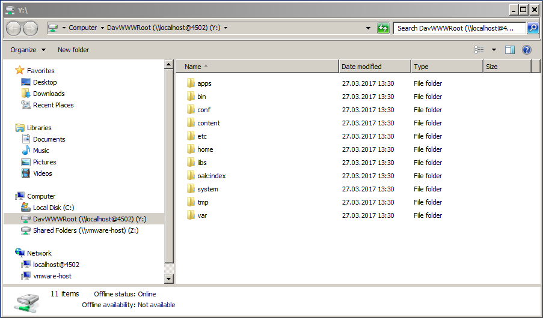

# WebDAV-åtkomst{#webdav-access}

Så här ansluter du till AEM via WebDAV med KDE:

AEM har WebDAV-stöd som gör att du kan visa och redigera databasinnehåll. Om du ansluter via WebDAV får du direktåtkomst till innehållsdatabasen via skrivbordet. Text- och PDF-filer som läggs till i databasen via WebDAV-anslutningen indexeras automatiskt i fulltext och kan sökas igenom med standardgränssnitt för sökning och via standard-Java API:er.

## Allmänt {#general}

[Detaljerade instruktioner ](/help/sites-administering/webdav-access.md#connecting-via-webdav) för olika operativsystem finns i det här dokumentet, men för att ansluta till databasen via WebDAV-protokollet pekar du din WebDAV-klient till följande plats:

```xml
http://localhost:4502
```


Den här URL:en ger WebDAV-åtkomst till standardarbetsytan ( `crx.default`) när den är ansluten från operativsystemnivå. Eftersom det är enklare för användaren ger det inte extra flexibilitet att ange namn på arbetsytor, vilket kan göras med ytterligare [WebDAV-URL:er](/help/sites-administering/webdav-access.md#webdav-urls).

AEM visar databasinnehållet på följande sätt:

* En nod av typen `nt:folder` visas som en mapp. Noder under noden `nt:folder` visas som mappinnehåll.

* En nod av typen `nt:file` visas som en fil. Noder under noden `nt:file` visas inte, men de utgör filens innehåll.

När du använder WebDAV för att skapa och redigera mappar och filer skapar och redigerar AEM de `nt:folder`- och `nt:file`-noder som behövs. Om du tänker använda WebDAV för att importera och exportera innehåll kan du försöka arbeta med nodtyperna `nt:file` och `nt:folder` så mycket som möjligt.

>[!NOTE]
>
>Innan du konfigurerar WebDAV bör du kontrollera [Tekniska krav](/help/sites-deploying/technical-requirements.md#webdav-clients).

## WebDAV-URL:er {#webdav-urls}

URL:en för WebDAV-servern har följande struktur:

<table>
 <colgroup>
  <col width="100" />
  <col width="100" />
  <col width="100" />
  <col width="100" />
  <col width="100" />
 </colgroup>
 <tbody>
  <tr>
   <td>
    <code>
     <strong>URL Component</strong>
    </code></td>
   <td><code>https://&lt;host&gt;:&lt;port&gt;</code></td>
   <td><code>/&lt;crx-webapp-path&gt;</code></td>
   <td><code>/repository</code></td>
   <td><code>/&lt;workspace&gt;</code></td>
  </tr>
  <tr>
   <td>
    <code>
     <strong>Example</strong>
    </code></td>
   <td><code>http://localhost:4502</code></td>
   <td><code>/crx</code></td>
   <td><code>/repository</code></td>
   <td><code>/crx.default</code></td>
  </tr>
  <tr>
   <td><strong>Beskrivning</strong></td>
   <td>Värd och port som AEM körs på</td>
   <td>Sökväg till webbprogrammet AEM databasen</td>
   <td>Sökväg till vilken WebDAV-servleten mappas</td>
   <td>Arbetsytans namn</td>
  </tr>
 </tbody>
</table>

Genom att ändra arbetsytelementet i sökvägen kan du mappa andra arbetsytor än standardarbetsytan ( `crx.default`). Om du till exempel vill mappa en arbetsyta med namnet `staging` använder du följande URL:

```xml
http://localhost:4502/crx/repository/staging
```

## Ansluta via WebDAV {#connecting-via-webdav}

[För att ansluta till din databas med hjälp av WebDAV-protokollet pekar du, som nämnts ovan](/help/sites-administering/webdav-access.md#general), din WebDAV-klient till din databasplats. Beroende på vilket operativsystem du använder skiljer sig dock stegen som krävs för att ansluta klienten åt och det kan finnas en konfiguration av operativsystemet som krävs.

Instruktioner om hur du ansluter följande operativsystem:

* [Windows](/help/sites-administering/webdav-access.md#windows)
* [macOS](/help/sites-administering/webdav-access.md#macos)
* [Linux](/help/sites-administering/webdav-access.md#linux)

### Windows {#windows}

Om du vill ansluta ett Microsoft Windows 7-system (och senare) till en AEM som inte är säker med SSL, måste alternativet att upprätta grundläggande autentisering över ett oskyddat nätverk uttryckligen aktiveras i Windows. Detta kräver en ändring i Windows-registret för WebClient.

När registret har uppdaterats kan AEM mappas som en enhet.

#### Windows 7 och senare konfiguration {#windows-and-greater-configuration}

Så här uppdaterar du registret så att grundläggande autentisering tillåts över ett oskyddat nätverk:

1. Leta reda på följande registerundernyckel:

   ```xml
   HKEY_LOCAL_MACHINE\SYSTEM\CurrentControlSet\Services\WebClient\Parameters
   ```

1. Ange `BasicAuthLevel`-registerpostens undernyckel till värdet `2` eller högre.

   Lägg till undernyckeln om den inte finns.

1. Du måste starta om systemet för att registerändringen ska börja gälla.

Mer information om registerändringen finns i [Microsoft Support KB 841215](https://support.microsoft.com/default.aspx/kb/841215).

Se [Microsoft Support KB 2445570](https://support.microsoft.com/kb/2445570) om du vill ha mer information om hur du kan förbättra WebDav-klientens svar i Windows.

>[!NOTE]
>
>Adobe rekommenderar att du skapar en Windows-användare med samma inloggningsuppgifter som databasanvändaren, annars kan behörighetskonflikter uppstå.

#### Konfiguration för Windows 8 {#windows-configuration}

För Windows 8 måste du också ändra registerposten [enligt beskrivningen för Windows 7 och senare](/help/sites-administering/webdav-access.md#windows-and-greater-configuration). Skrivbordsmiljö måste dock vara aktiverad för att du ska kunna se registerposten innan du kan göra detta.

Om du vill aktivera Skrivbordsmiljö öppnar du **Serverhanteraren**, **Funktioner**, **Lägg till funktioner** och **Skrivbordsmiljö**.

När registerposten som beskrivs för Windows 7 har startats om är den tillgänglig. Ändra den enligt beskrivningen för Windows 7 och senare.

#### Ansluter till Windows {#connecting-in-windows}

Så här ansluter du till AEM via WebDAV i en Windows-miljö:

1. Öppna **Utforskaren i Windows** eller **Utforskaren** och klicka på **Dator** eller **Den här datorn**.

   

1. Klicka på **Mappa nätverksenhet** för att starta guiden.
1. Ange mappningsinformationen:

   * **Enhet**: Välj en tillgänglig bokstav
   * **Mapp**:  `http://localhost:4502`
   * Kontrollera **Anslut med andra autentiseringsuppgifter**

   Klicka på Slutför

   

   >[!NOTE]
   >
   >Om AEM finns på en annan port använder du portnumret i stället för 4502. Om du inte kör innehållsdatabasen på den lokala datorn ersätter du `localhost` med respektive servernamn eller IP-adress.

1. Ange användarnamn `admin` och lösenord `admin`. Adobe rekommenderar att du använder det förkonfigurerade administratörskontot för testning.

   

1. Guiden stängs och den nyligen mappade enheten öppnas i Utforskaren i Windows eller i Utforskaren.

   

Windows har nu mappat AEM som en enhet via WebDAV och du kan använda den som vilken enhet som helst.

### macOS {#macos}

Det krävs inga konfigurationssteg för att ansluta via WebDAV i macOS. Du behöver bara ansluta till WebDAV-servern.

1. Gå till ett **Finder**-fönster och klicka på **Gå** och **Anslut till servern** eller tryck på **Kommando+k**.
1. Ange AEM plats i fönstret **Anslut till server**:

   * `http://localhost:4502`
   >[!NOTE]
   >
   >Om AEM finns på en annan port använder du portnumret i stället för 4502. Om du inte kör innehållsdatabasen på den lokala datorn ersätter du `localhost` med respektive servernamn eller IP-adress.

1. När du uppmanas att autentisera anger du användarnamn `admin` och lösenord `admin`. Adobe rekommenderar att du använder det förkonfigurerade administratörskontot för testning.

macOS har nu anslutit till AEM via WebDAV och du kan använda det som vilken mapp som helst på din Mac.

### Linux {#linux}

Anslutning via WebDAV i Linux kräver ingen konfiguration, men inkluderar några steg för att skapa anslutningen som varierar beroende på datormiljön.

#### GNOME {#gnome}

Så här ansluter du till AEM via WebDAV med GNOME:

1. I Nautilus (filutforskaren) väljer du **Platser** och väljer **Anslut till server**.
1. I fönstret **Anslut till server** väljer du WebDAV (HTTP) i Service Type.

1. I **Server** anger du `http://localhost:4502/crx/repository/crx.default`

   >[!NOTE]
   >
   >Om AEM finns på en annan port använder du portnumret i stället för 4502. Om du inte kör innehållsdatabasen på den lokala datorn ersätter du `localhost` med respektive servernamn eller IP-adress.

1. I **Mapp** anger du `/dav`
1. Ange användarnamnet `admin`. Adobe rekommenderar att du använder det förkonfigurerade administratörskontot för testning.
1. Lämna porten tom och ange ett namn för anslutningen.
1. Klicka på **Anslut**. AEM ber dig ange ditt lösenord.
1. Ange lösenordet `admin` och klicka på **Anslut**.

GNOME har nu monterat AEM som en volym och du kan använda den som vilken annan volym som helst.

#### KDE {#kde}

1. Öppna guiden Nätverksmapp.
1. Välj **WebFolder**(webdav) och klicka på Nästa.
1. Ange ett anslutningsnamn i **Namn**.
1. I **Användare** anger du `admin.` Adobe rekommenderar att du använder det förkonfigurerade administratörskontot.
1. I **Server** anger du `http://localhost:4502/crx/repository/crx.default`

   >[!NOTE]
   >
   >Om AEM finns på en annan port använder du portnumret i stället för 4502. Om du inte kör innehållsdatabasen på den lokala datorn ersätter du `localhost` med respektive servernamn eller IP-adress

1. I **Mapp** anger du `dav`

1. Klicka på **Spara och anslut**.
1. När du uppmanas att ange ditt lösenord anger du lösenordet `admin` och klickar på **Anslut**.

KDE har nu monterat AEM som en volym och du kan använda den som vilken annan volym som helst.
