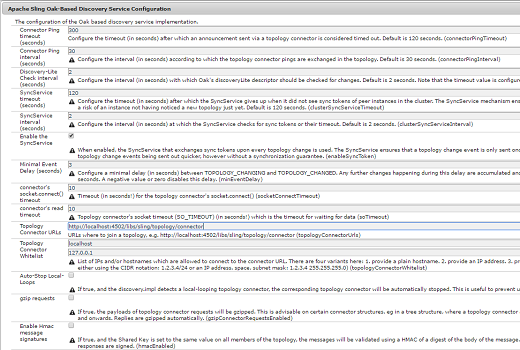

# Resursavlastare för arbetsflöde{#assets-workflow-offloader}

Med resursarbetsflödesavlastaren kan du aktivera flera instanser av Adobe Experience Manager-resurser (AEM) för att minska bearbetningsbelastningen på den primära (ledande) instansen. Bearbetningsinläsningen fördelas mellan ledarinstansen och de olika förinläsarinstanser (arbetare) som du lägger till i den. Genom att distribuera bearbetningslasten ökar effektiviteten och hastigheten med vilken AEM Assets bearbetar resurser. Dessutom kan du tilldela dedikerade resurser för att bearbeta resurser av en viss MIME-typ. Du kan till exempel tilldela en specifik nod i din topologi till att endast bearbeta InDesign-resurser.

## Konfigurera offloader-topologi {#configure-offloader-topology}

Använd Configuration Manager för att lägga till URL:en för ledarinstansen och värdnamnen för offloader-instanser för anslutningsbegäranden i ledarinstansen.

1. Tryck/klicka på AEM-logotypen och välj **Verktyg** > **Åtgärder** > **Webbkonsol** för att öppna Configuration Manager.
1. På webbkonsolen väljer du **Sling** > **Topology Management**.

   

1. Tryck/klicka på länken **Configure Discovery.Oak Service** på sidan Topology Management.

   

1. På sidan Konfiguration av sökningstjänst anger du anslutnings-URL:en för ledarinstansen i fältet **Topology Connector URL** .

   

1. I fältet **Topology Connector Whitelist** anger du IP-adress eller värdnamn för avlastarinstanser som tillåts ansluta till ledarinstansen. Tryck/klicka på **Spara**.

   

1. Om du vill se vilka avlastarinstanser som är anslutna till ledarinstansen går du till **Verktyg** > **Distribution** > **Topologi** och trycker/klickar på klustervyn.

## Inaktivera avlastning {#disable-offloading}

1. Tryck/klicka på AEM-logotypen och välj **Verktyg** > **Distribution** > **Avlastning**. På sidan **Avlastande webbläsare** visas ämnen och serverinstanser som kan använda ämnena.

   

1. Inaktivera ämnet *com/adobe/granite/workflow/avlastning* om de ledande instanser som användarna interagerar med för att överföra eller ändra AEM-resurser.

   

## Konfigurera startprogram för arbetsflöden i ledarinstansen {#configure-workflow-launchers-on-the-leader-instance}

Konfigurera arbetsflödesstarter så att arbetsflödet för **DAM Update Asset Offloading** används i ledarinstansen i stället för i arbetsflödet för **DAM Update Asset** .

1. Tryck/klicka på AEM-logotypen och välj **Verktyg** > **Arbetsflöde** > **Starta** för att öppna **Workflow Launchers** -konsolen.

   

1. Leta reda på de två startkonfigurationerna med händelsetypen **Node Created** respektive **Node Modified** , som kör arbetsflödet **DAM Update Asset** .
1. För varje konfiguration markerar du kryssrutan före den och trycker/klickar på ikonen **Visa egenskaper** i verktygsfältet för att visa dialogrutan **Startegenskaper** .

   

1. I listan **Arbetsflöde** väljer du Avlastning **av** DAM-uppdateringsresurs och trycker/klickar på **Spara**.

   

1. Tryck/klicka på AEM-logotypen och välj **Verktyg** > **Arbetsflöde** > **Modeller** för att öppna sidan **Arbetsflödesmodeller** .
1. Välj arbetsflödet **DAM Update Asset Offloading** och tryck/klicka på **Edit** (Redigera) i verktygsfältet för att visa information om det.

   

1. Visa snabbmenyn för steget **DAM-arbetsflödesavlastning** och välj **Redigera**. Kontrollera posten i fältet **Jobbämne** på fliken **Generiska argument** i konfigurationsdialogrutan.

   

## Inaktivera startfunktioner för arbetsflödet för offloader-instanser {#disable-the-workflow-launchers-on-the-offloader-instances}

Inaktivera arbetsflödet som startar arbetsflödet som kör arbetsflödet för **DAM-uppdatering av resurs** på ledarinstansen.

1. Tryck/klicka på AEM-logotypen och välj **Verktyg** > **Arbetsflöde** > **Starta** för att öppna **Workflow Launchers** -konsolen.

   

1. Leta reda på de två startkonfigurationerna med händelsetypen **Node Created** respektive **Node Modified** , som kör arbetsflödet **DAM Update Asset** .
1. För varje konfiguration markerar du kryssrutan före den och trycker/klickar på ikonen **Visa egenskaper** i verktygsfältet för att visa dialogrutan **Startegenskaper** .

   

1. I avsnittet **Aktivera** drar du reglaget för att inaktivera startprogrammet för arbetsflödet och inaktiverar det genom att trycka/klicka på **Spara** .

   

1. Överför alla resurser av typen bild vid ledarinstansen. Kontrollera miniatyrbilderna som genereras och porteras tillbaka för resursen av den avlastade instansen.

