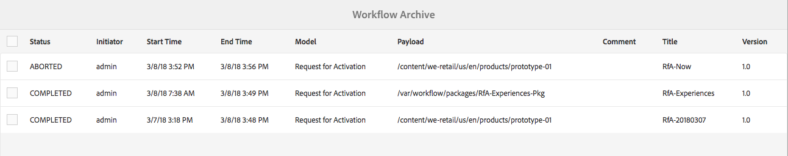

# Administrera arbetsflödesinstanser{#administering-workflow-instances}

Arbetsflödeskonsolen innehåller flera verktyg för att administrera arbetsflödesinstanser för att säkerställa att de körs som förväntat.

>[!NOTE]
>
>The [JMX-konsol](/help/sites-administering/jmx-console.md#workflow-maintenance) tillhandahåller ytterligare underhållsåtgärder för arbetsflöden.

Det finns en rad konsoler som du kan använda för att administrera dina arbetsflöden. Använd [global navigering](/help/sites-authoring/basic-handling.md#global-navigation) för att öppna **verktyg** välj **Arbetsflöde**:

* **Models**: Hantera arbetsflödesdefinitioner
* **Instanser**: Visa och hantera pågående arbetsflödesinstanser
* **Startare**: Hantera hur arbetsflöden startas
* **Arkiv**: Visa historik över arbetsflöden som har slutförts
* **Fel**: Visa historik över arbetsflöden som slutförts med fel
* **Tilldela automatiskt**: Konfigurera automatisk tilldelning av arbetsflöden till mallar

## Övervaka status för arbetsflödesinstanser {#monitoring-the-status-of-workflow-instances}

1. Använda navigeringsval **verktyg** sedan **Arbetsflöde**.
1. Välj **Instanser** så att du kan visa en lista över pågående arbetsflödesinstanser.

   

<!--
## Search Workflow Instances {#search-workflow-instances}

1. Using Navigation select **Tools**, then **Workflow**.
1. Select **Instances** to display the list of workflow instances currently in progress. On the top rail, in the left corner, select **Filters**. Alternatively, you can use the keystrokes alt+1. The following dialog is displayed:

   

1. In the Filter dialog, select the workflow search criteria. You can search based on these inputs:

   * Payload path: Select a specific path
   * Workflow model: Select a workflow model
   * Assignee: Select a workflow Assignee
   * Type: Task, Workflow item, or Workflow Failure
   * Task Status: Active, Complete, or Terminated
   * Where I Am: Owner AND Assignee, Owner only, Assignee only
   * Start Date: Start date before or after a specified date
   * End Date: End date before or after a specified date
   * Due Date: Due date before or after a specified date
   * Updated Date: Updated date before or after a specified date
-->

## Göra uppehåll, återuppta och avsluta en arbetsflödesinstans {#suspending-resuming-and-terminating-a-workflow-instance}

1. Använda navigeringsval **verktyg** sedan **Arbetsflöde**.
1. Välj **Instanser** så att du kan visa en lista över pågående arbetsflödesinstanser.

   

1. Markera ett specifikt objekt och använd sedan **Avsluta**, **Gör uppehåll**, eller **Återuppta**, beroende på vad som är tillämpligt; bekräftelse och/eller ytterligare uppgifter krävs:

   

## Visa arkiverade arbetsflöden {#viewing-archived-workflows}

1. Använda navigeringsval **verktyg** sedan **Arbetsflöde**.
1. Välj **Arkiv** så att du kan visa en lista över arbetsflödesinstanser som har slutförts.

   

   >[!NOTE]
   >
   >Avbrottsstatusen betraktas som ett slutfört avbrott eftersom det inträffar som ett resultat av en användaråtgärd, till exempel:
   >
   >* användning av **Avsluta** åtgärd
   >* när en sida som är underställd ett arbetsflöde tas bort (framtvingad) avslutas arbetsflödet

1. Markera ett specifikt objekt och sedan **Öppna historik** om du vill ha mer information:

   

## Åtgärdar fel i arbetsflödesinstansen {#fixing-workflow-instance-failures}

När ett arbetsflöde misslyckas, innehåller AEM **Fel** konsol där du kan undersöka och vidta lämpliga åtgärder när originalorsaken har hanterats:

* **Felinformation**
Öppnar ett fönster för att visa **Felmeddelande**, **Steg** och **Felstapel**.

* **Öppna historik**
Visar information om arbetsflödeshistoriken.

* **Försök igen** - Kör komponentinstansen Script Step igen. Använd kommandot Försök igen när du har åtgärdat orsaken till det ursprungliga felet. Du kan till exempel försöka utföra steget igen när du har åtgärdat ett fel i skriptet som utförs av processteget.
* **Avsluta** - Avsluta arbetsflödet om felet har orsakat en oförenlig situation för arbetsflödet. Arbetsflödet kan t.ex. förlita sig på miljöförhållanden som information i databasen som inte längre är giltig för arbetsflödesinstansen.
* **Avsluta och försök igen** - Liknar **Avsluta** förutom att en ny arbetsflödesinstans startas med den ursprungliga nyttolasten, titeln och beskrivningen.

Så här undersöker du fel och sedan återupptar eller avslutar du arbetsflödet:

1. Använda navigeringsval **verktyg** sedan **Arbetsflöde**.
1. Välj **Fel** så att du kan visa en lista över arbetsflödesinstanser som inte har slutförts korrekt.
1. Välj ett specifikt objekt och sedan lämplig åtgärd:

   

## Vanlig tömning av arbetsflödesinstanser {#regular-purging-of-workflow-instances}

Om du minimerar antalet arbetsflödesinstanser ökas arbetsflödesmotorns prestanda, så att du regelbundet kan rensa avslutade eller pågående arbetsflödesinstanser från databasen.

Konfigurera **Rensa arbetsflöde för Adobe Granite** för att rensa arbetsflödesinstanser utifrån deras ålder och status. Du kan också rensa arbetsflödesinstanser av alla modeller eller av en viss modell.

Du kan också skapa flera konfigurationer av tjänsten för att rensa arbetsflödesinstanser som uppfyller olika villkor. Skapa till exempel en konfiguration som tömmer instanser av en viss arbetsflödesmodell när de körs längre än förväntat. Skapa en annan konfiguration som tömmer alla slutförda arbetsflöden efter ett visst antal dagar för att minimera databasens storlek.

Om du vill konfigurera tjänsten kan du använda [Webbkonsol](/help/sites-deploying/configuring-osgi.md#osgi-configuration-with-the-web-console) eller [lägga till en OSGi-konfiguration i databasen](/help/sites-deploying/configuring-osgi.md#osgi-configuration-in-the-repository). I följande tabell beskrivs de egenskaper som du behöver för båda metoderna.

>[!NOTE]
>
>För att lägga till konfigurationen i databasen är tjänst-PID:
>
>`com.adobe.granite.workflow.purge.Scheduler`
>
>Eftersom tjänsten är en fabrikstjänst är namnet på `sling:OsgiConfig` noden kräver ett identifierarsuffix, till exempel:
>
>`com.adobe.granite.workflow.purge.Scheduler-myidentifier`

<table>
 <tbody>
  <tr>
   <th>Egenskapsnamn (webbkonsol)</th>
   <th>OSGi-egenskapsnamn</th>
   <th>Beskrivning</th>
  </tr>
  <tr>
   <td>Jobbnamn</td>
   <td>scheduledpurge.name</td>
   <td>Ett beskrivande namn för den schemalagda rensningen.</td>
  </tr>
  <tr>
   <td>Arbetsflödesstatus</td>
   <td>scheduledpurge.workflowStatus</td>
   <td><p>Status för de arbetsflödesinstanser som ska rensas. Följande värden är giltiga:</p>
    <ul>
     <li>SLUTFÖRT: Slutförda arbetsflödesinstanser rensas.</li>
     <li>KÖRNING: Körande arbetsflödesinstanser rensas.</li>
    </ul> </td>
  </tr>
  <tr>
   <td>Modeller att tömma</td>
   <td>scheduledpurge.modelIds</td>
   <td><p>ID:t för arbetsflödesmodellerna som ska rensas. ID är sökvägen till modellnoden, till exempel:<br /> /var/workflow/models/dam/update_asset<br /> </p> <p>Om du vill ange flera modeller klickar du på plusknappen (+) i webbkonsolen. </p> <p>Ange inget värde för att rensa instanser av alla arbetsflödesmodeller.</p> </td>
  </tr>
  <tr>
   <td>Arbetsflödesålder</td>
   <td>scheduledpurge.daysold</td>
   <td>Åldern på arbetsflödesinstanserna som ska rensas i dagar.</td>
  </tr>
 </tbody>
</table>

## Ange maximal storlek för inkorgen {#setting-the-maximum-size-of-the-inbox}

Du kan ange den maximala storleken för inkorgen genom att konfigurera **Adobe Granite Workflow Service**, med [Webbkonsol](/help/sites-deploying/configuring-osgi.md#osgi-configuration-with-the-web-console) eller [lägga till en OSGi-konfiguration i databasen](/help/sites-deploying/configuring-osgi.md#osgi-configuration-in-the-repository). I följande tabell beskrivs egenskapen som du konfigurerar för båda metoderna.

>[!NOTE]
>
>För att lägga till konfigurationen i databasen är tjänst-PID:
>
>`com.adobe.granite.workflow.core.WorkflowSessionFactory`.

| Egenskapsnamn (webbkonsol) | OSGi-egenskapsnamn |
|---|---|
| Max Inbox Query Size | granite.workflow.inboxQuerySize |

## Använda arbetsflödesvariabler för kundägda datalager {#using-workflow-variables-customer-datastore}

Data som bearbetas av arbetsflöden lagras i den Adobe-tillhandahållna lagringen (JCR). Dessa data kan vara känsliga till sin natur. Du kanske vill spara alla användardefinierade metadata/data i ditt egna hanterade lagringsutrymme i stället för det lagringsutrymme som Adobe tillhandahåller. I dessa avsnitt beskrivs hur du ställer in dessa variabler för extern lagring.

### Ange modellen för extern lagring av metadata {#set-model-for-external-storage}

På arbetsflödesmodellnivån anges en flagga som anger att modellen (och dess körningsinstanser) har extern lagring av metadata. Arbetsflödesvariabler sparas inte i JCR för arbetsflödesinstanser av modeller som är markerade för extern lagring.

Egenskapen *userMetadataPersistenceEnabled* lagras på *jcr:innehållsnod* av arbetsflödesmodellen. Den här flaggan bevaras i arbetsflödets metadata som *cq:userMetaDataCustomPersistenceEnabled*.

Bilden nedan visar hur du anger flaggan i ett arbetsflöde.


### API:er för metadata i extern lagring {#apis-for-metadata-external-storage}

Om du vill lagra variablerna externt implementerar du de API:er som arbetsflödet visar.

UserMetaDataPersistenceContext

I följande exempel visas hur du använder API:t.

```
@ProviderType
public interface UserMetaDataPersistenceContext {
 
    /**
     * Gets the workflow for persistence
     * @return workflow
     */
    Workflow getWorkflow();
 
    /**
     * Gets the workflow id for persistence
     * @return workflowId
     */
    String getWorkflowId();
 
    /**
     * Gets the user metadata persistence id
     * @return userDataId
     */
    String getUserDataId();
}
```

UserMetaDataPersistenceProvider

```
/**
 * This provider can be implemented to store the user defined workflow-data metadata in a custom storage location
 */
@ConsumerType
public interface UserMetaDataPersistenceProvider {
 
   /**
    * Retrieves the metadata using a unique identifier
    * @param userMetaDataPersistenceContext
    * @param metaDataMap of user defined workflow data metaData
    * @throws WorkflowException
    */
   void get(UserMetaDataPersistenceContext userMetaDataPersistenceContext, MetaDataMap metaDataMap) throws WorkflowException;
 
   /**
    * Stores the given metadata to the custom storage location
    * @param userMetaDataPersistenceContext
    * @param metaDataMap metadata map
    * @return the unique identifier that can be used to retrieve metadata. If null is returned, then workflowId is used.
    * @throws WorkflowException
    */
   String put(UserMetaDataPersistenceContext userMetaDataPersistenceContext, MetaDataMap metaDataMap) throws WorkflowException;
} 
```
